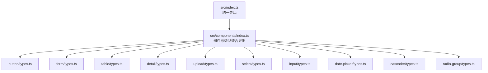
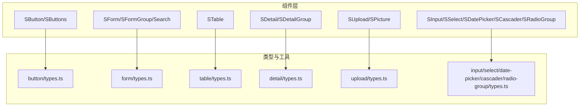
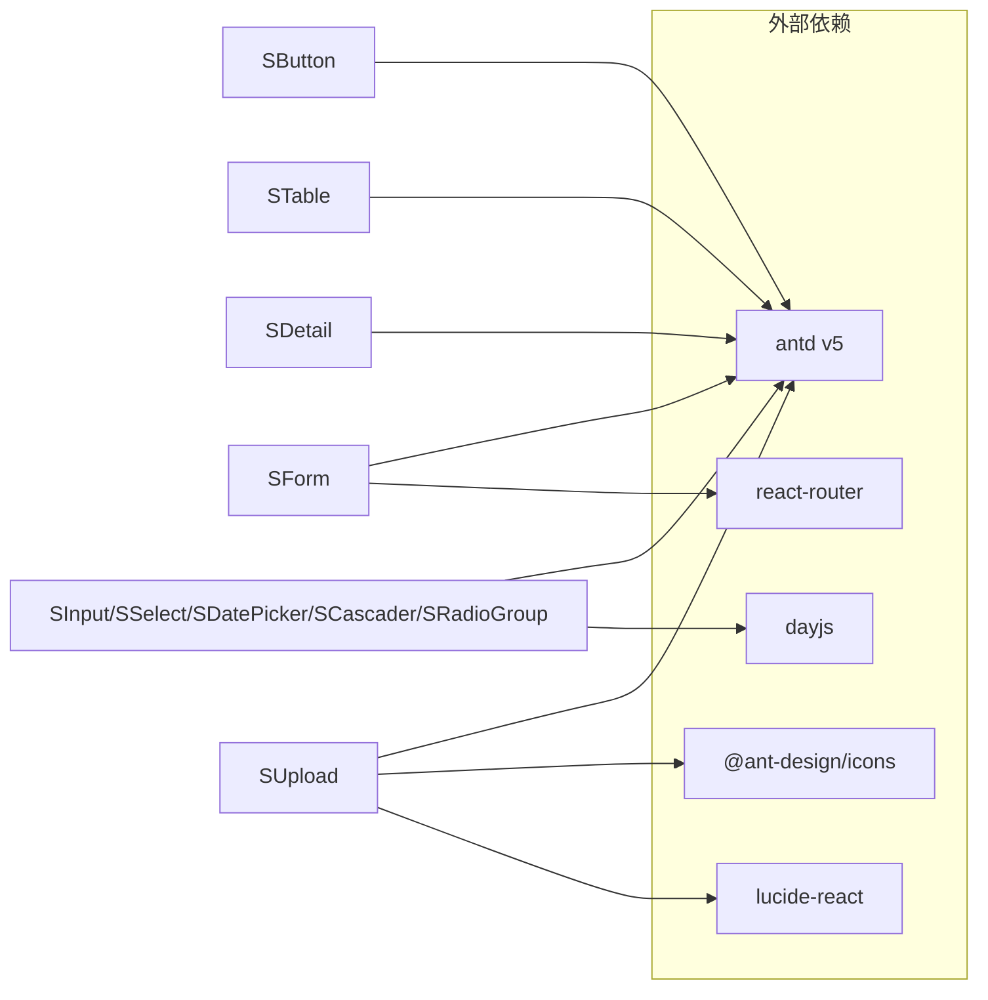

# API 参考

<cite>
**本文引用的文件**
- [package.json](file://package.json)
- [README.md](file://README.md)
- [docs/introduce-cn/index.md](file://docs/introduce-cn/index.md)
- [src/index.ts](file://src/index.ts)
- [src/components/index.ts](file://src/components/index.ts)
- [src/components/button/types.ts](file://src/components/button/types.ts)
- [src/components/form/types.ts](file://src/components/form/types.ts)
- [src/components/table/types.ts](file://src/components/table/types.ts)
- [src/components/detail/types.ts](file://src/components/detail/types.ts)
- [src/components/upload/types.ts](file://src/components/upload/types.ts)
- [src/components/select/types.ts](file://src/components/select/types.ts)
- [src/components/input/types.ts](file://src/components/input/types.ts)
- [src/components/date-picker/types.ts](file://src/components/date-picker/types.ts)
- [src/components/cascader/types.ts](file://src/components/cascader/types.ts)
- [src/components/radio-group/types.ts](file://src/components/radio-group/types.ts)
</cite>

## 目录

1. [简介](#简介)
2. [项目结构](#项目结构)
3. [核心组件](#核心组件)
4. [架构总览](#架构总览)
5. [详细组件 API 分类](#详细组件-api-分类)
6. [依赖关系分析](#依赖关系分析)
7. [性能与可维护性建议](#性能与可维护性建议)
8. [故障排查指南](#故障排查指南)
9. [结论](#结论)
10. [附录：查询与索引](#附录查询与索引)

## 简介

本文件为 SDesign 组件库的完整 API 参考，覆盖基础组件、表单组件、数据展示组件、反馈组件、业务组件等类别，按组件类型组织，逐项说明 Props、事件回调、方法调用与返回值类型，并给出 TypeScript 类型定义与接口说明、使用示例路径与最佳实践建议。同时提供版本兼容性与变更历史说明，以及 API 查询与索引指引，帮助开发者快速定位所需能力。

## 项目结构

SDesign 通过统一入口导出组件、Hooks、图标与工具，组件与类型分布在 src/components 下，各组件目录内包含类型定义、示例与文档 Markdown。核心入口如下：

- 入口导出：组件、Hooks、图标、工具
- 组件聚合导出：集中导出各组件与类型，便于按需引入或全量引入

图表来源

- [src/index.ts](file://src/index.ts#L1-L5)
- [src/components/index.ts](file://src/components/index.ts#L1-L81)

章节来源

- [src/index.ts](file://src/index.ts#L1-L5)
- [src/components/index.ts](file://src/components/index.ts#L1-L81)

## 核心组件

以下为核心组件与类型定义概览，后续章节将按组件类型展开详细 API。

- 按钮与按钮组：SButton、SButtons（含动作类型、尺寸、Space 间距等）
- 表单体系：SForm、SFormGroup、Search（含字段映射、校验、只读、嵌套等）
- 数据表格：STable（列定义扩展、分页、序号列等）
- 详情展示：SDetail、SDetailGroup（字典映射、文件、图片、占位等）
- 上传组件：SUpload、SPicture（限制数量/大小、回显、URL 前缀等）
- 输入与选择：SInput、SSelect、SRadioGroup、SCascader、SDatePicker（日期范围等）

章节来源

- [src/components/button/types.ts](file://src/components/button/types.ts#L1-L72)
- [src/components/form/types.ts](file://src/components/form/types.ts#L1-L155)
- [src/components/table/types.ts](file://src/components/table/types.ts#L1-L34)
- [src/components/detail/types.ts](file://src/components/detail/types.ts#L1-L80)
- [src/components/upload/types.ts](file://src/components/upload/types.ts#L1-L66)
- [src/components/select/types.ts](file://src/components/select/types.ts#L1-L9)
- [src/components/input/types.ts](file://src/components/input/types.ts#L1-L9)
- [src/components/date-picker/types.ts](file://src/components/date-picker/types.ts#L1-L25)
- [src/components/cascader/types.ts](file://src/components/cascader/types.ts#L1-L16)
- [src/components/radio-group/types.ts](file://src/components/radio-group/types.ts#L1-L10)

## 架构总览

SDesign 在 antd 基础上进行业务封装，遵循“类型透传 + 扩展增强”的设计原则：优先透传 antd 原生 Props，再在必要处补充业务所需的字段与行为，如日期格式化、字典映射、上传策略等。

图表来源

- [src/components/button/types.ts](file://src/components/button/types.ts#L1-L72)
- [src/components/form/types.ts](file://src/components/form/types.ts#L1-L155)
- [src/components/table/types.ts](file://src/components/table/types.ts#L1-L34)
- [src/components/detail/types.ts](file://src/components/detail/types.ts#L1-L80)
- [src/components/upload/types.ts](file://src/components/upload/types.ts#L1-L66)
- [src/components/input/types.ts](file://src/components/input/types.ts#L1-L9)
- [src/components/select/types.ts](file://src/components/select/types.ts#L1-L9)
- [src/components/date-picker/types.ts](file://src/components/date-picker/types.ts#L1-L25)
- [src/components/cascader/types.ts](file://src/components/cascader/types.ts#L1-L16)
- [src/components/radio-group/types.ts](file://src/components/radio-group/types.ts#L1-L10)

## 详细组件 API 分类

### 基础组件

- SButton（按钮）

  - 关键类型：SButtonActionType（动作类型枚举）、SButtonProps、SButtonsItem、SButtonsProps
  - 主要特性：支持 antd Button 的 type；新增 actionType 用于业务动作语义；按钮组支持 size、spaceProps、disabled、loading
  - 示例路径：[basic.tsx](file://src/components/button/demos/basic.tsx)、[size.tsx](file://src/components/button/demos/size.tsx)、[loading.tsx](file://src/components/button/demos/loading.tsx)
  - 章节来源
    - [src/components/button/types.ts](file://src/components/button/types.ts#L1-L72)

- SInput（输入框）

  - 关键类型：SInputProps（value、onChange、trim、onEnter）
  - 主要特性：支持字符串值、回车事件、自动去空格
  - 示例路径：[base.tsx](file://src/components/input/demos/base.tsx)、[higntLightSpace.tsx](file://src/components/input/demos/higntLightSpace.tsx)
  - 章节来源
    - [src/components/input/types.ts](file://src/components/input/types.ts#L1-L9)

- SSelect（选择器）

  - 关键类型：SSelectProps（基于 antd Select，扩展 ExtraComType）
  - 主要特性：透传 Select Props，支持额外通用属性
  - 示例路径：[index.tsx](file://src/components/select/demos/index.tsx)、[disable.tsx](file://src/components/select/demos/disable.tsx)
  - 章节来源
    - [src/components/select/types.ts](file://src/components/select/types.ts#L1-L9)

- SRadioGroup（单选分组）

  - 关键类型：SRadioGroupProps（基于 antd Radio.Group，扩展 ExtraComType）
  - 主要特性：透传 Radio.Group Props，支持额外通用属性
  - 示例路径：[index.tsx](file://src/components/radio-group/demos/index.tsx)、[disable.tsx](file://src/components/radio-group/demos/disable.tsx)
  - 章节来源
    - [src/components/radio-group/types.ts](file://src/components/radio-group/types.ts#L1-L10)

- SCascader（级联选择）

  - 关键类型：SCascaderProps（基于 antd Cascader，自定义 onChange/value/multiple）
  - 主要特性：支持多选、自定义值与选项
  - 示例路径：[base.tsx](file://src/components/cascader/demos/base.tsx)、[echo.tsx](file://src/components/cascader/demos/echo.tsx)、[form.tsx](file://src/components/cascader/demos/form.tsx)
  - 章节来源
    - [src/components/cascader/types.ts](file://src/components/cascader/types.ts#L1-L16)

- SDatePicker（日期选择）

  - 关键类型：SDatePickerType（自定义 onChange/value，支持多种值类型）
  - 主要特性：支持字符串、数组、Date、Dayjs 等多种值类型
  - 示例路径：[index.tsx](file://src/components/date-picker/demos/index.tsx)、[form.tsx](file://src/components/date-picker/demos/form.tsx)、[formSet.tsx](file://src/components/date-picker/demos/formSet.tsx)
  - 章节来源
    - [src/components/date-picker/types.ts](file://src/components/date-picker/types.ts#L1-L25)

- SDatePickerRange（日期范围）

  - 关键类型：同日期选择，支持范围选择与表单联动
  - 示例路径：[index.tsx](file://src/components/date-picker-range/demos/index.tsx)、[form.tsx](file://src/components/date-picker-range/demos/form.tsx)、[formSet.tsx](file://src/components/date-picker-range/demos/formSet.tsx)、[rangeKeys.tsx](file://src/components/date-picker-range/demos/rangeKeys.tsx)
  - 章节来源
    - [src/components/date-picker/types.ts](file://src/components/date-picker/types.ts#L1-L25)

- STitle（标题）

  - 关键类型：STitleProps（标题、描述、前缀、返回点击等）
  - 示例路径：[basic.tsx](file://src/components/title/demos/basic.tsx)、[backClick.tsx](file://src/components/title/demos/backClick.tsx)、[prefix.tsx](file://src/components/title/demos/prefix.tsx)、[titleDesc.tsx](file://src/components/title/demos/titleDesc.tsx)
  - 章节来源
    - [src/components/title/types.ts](file://src/components/title/types.ts#L1-L?)

- SCard（卡片）

  - 关键类型：SCardProps（卡片基础属性）
  - 示例路径：[index.tsx](file://src/components/card/demos/index.tsx)
  - 章节来源
    - [src/components/card/types.ts](file://src/components/card/types.ts#L1-L?)

- SNoData / SNoPage（无数据/无页面）

  - 关键类型：SNoDataProps / SNoPageProps（状态图标、文案等）
  - 示例路径：[base.tsx](file://src/components/no-data/demos/base.tsx)、[index.tsx](file://src/components/no-page/demos/index.tsx)
  - 章节来源
    - [src/components/no-data/types.ts](file://src/components/no-data/types.ts#L1-L?)
    - [src/components/no-page/types.ts](file://src/components/no-page/types.ts#L1-L?)

- STextEllipsis（文本省略）

  - 关键类型：STextEllipsisProps（省略策略、最大宽度等）
  - 示例路径：[index.tsx](file://src/components/text-ellipsis/demos/index.tsx)
  - 章节来源
    - [src/components/text-ellipsis/types.tsx](file://src/components/text-ellipsis/types.tsx#L1-L?)

- SLucideIcon（图标）

  - 关键类型：SLucideIconProps（图标名称、尺寸、颜色等）
  - 示例路径：[index.tsx](file://src/components/lucide-icon/demo/index.tsx)
  - 章节来源
    - [src/components/lucide-icon/types.ts](file://src/components/lucide-icon/types.ts#L1-L?)

- SErrorCom / SErrorBoundary（错误展示与边界）

  - 关键类型：SErrorComProps / SErrorBoundaryProps（错误内容、重试等）
  - 示例路径：[index.tsx](file://src/components/error-com/demos/index.tsx)、[index.tsx](file://src/components/error-boundary/demo/index.tsx)
  - 章节来源
    - [src/components/error-com/types.ts](file://src/components/error-com/types.ts#L1-L?)
    - [src/components/error-boundary/types.ts](file://src/components/error-boundary/types.ts#L1-L?)

- SCheckGroup / SDependency（校验与依赖）

  - 关键类型：SCheckGroupProps / SDependencyProps（勾选组、依赖渲染）
  - 示例路径：[index.tsx](file://src/components/check-group/demos/index.tsx)、[index.tsx](file://src/components/dependency/index.tsx)
  - 章节来源
    - [src/components/check-group/types.ts](file://src/components/check-group/types.ts#L1-L?)
    - [src/components/dependency/types.ts](file://src/components/dependency/types.ts#L1-L?)

- SConfirm（确认对话框）

  - 关键类型：SConfirmProps（标题、内容、按钮文案、事件拦截等）
  - 示例路径：[index.tsx](file://src/components/confirm/demos/index.tsx)、[eventStop.tsx](file://src/components/confirm/demos/eventStop.tsx)
  - 章节来源
    - [src/components/confirm/types.ts](file://src/components/confirm/types.ts#L1-L?)

- SDynamicContainer（动态容器）

  - 关键类型：SDynamicContainerProps（动态渲染容器）
  - 示例路径：[base.tsx](file://src/components/dynamic-container/demos/base.tsx)
  - 章节来源
    - [src/components/dynamic-container/index.tsx](file://src/components/dynamic-container/index.tsx#L1-L?)

- SFrameAnimation（帧动画）
  - 关键类型：SFrameAnimationProps（帧动画配置）
  - 示例路径：[index.tsx](file://src/components/frame-animation/demo/index.tsx)
  - 章节来源
    - [src/components/frame-animation/types.ts](file://src/components/frame-animation/types.ts#L1-L?)

### 表单组件

- SForm / SFormGroup / Search

  - 关键类型：SFormProps、SFormGroupProps、SearchProps、ItemsProps、GroupItemsType
  - 主要特性：字段映射（FormFieldMapType）、依赖字段（depNames）、只读/嵌套、分组容器、搜索展开/收起
  - 示例路径：[form.tsx](file://src/components/form/demos/form.tsx)、[group.tsx](file://src/components/form/demos/group.tsx)、[dependency.tsx](file://src/components/form/demos/dependency.tsx)、[search.tsx](file://src/components/form/demos/search.tsx)
  - 章节来源
    - [src/components/form/types.ts](file://src/components/form/types.ts#L1-L155)

- SFile（文件列表）

  - 关键类型：SFileProps、FileListProps、FileItemType、FileDataType、ReflectFile
  - 主要特性：文件列表渲染、回显、图标映射、下载等
  - 示例路径：[fileList.tsx](file://src/components/file/demos/fileList.tsx)、[reflectFileList.tsx](file://src/components/file/demos/reflectFileList.tsx)
  - 章节来源
    - [src/components/file/types.ts](file://src/components/file/types.ts#L1-L?)

- SUpload / SPicture（上传）
  - 关键类型：SUploadProps、SPictureProps、UploadHookType、UseBeforeUploadType、uploadFileType
  - 主要特性：数量/大小限制、接受类型、回显、单文件模式、URL 前缀、状态回调
  - 示例路径：[index.tsx](file://src/components/upload/demos/index.tsx)、[pictureUpload.tsx](file://src/components/upload/demos/pictureUpload.tsx)、[reflectUpload.tsx](file://src/components/upload/demos/reflectUpload.tsx)
  - 章节来源
    - [src/components/upload/types.ts](file://src/components/upload/types.ts#L1-L66)

### 数据展示组件

- STable（表格）

  - 关键类型：STableProps、SColumnsType、RenderType
  - 主要特性：列定义扩展（支持 render 类型）、分页参数、序号列
  - 示例路径：[table-dict.tsx](file://src/components/table/demos/table-dict.tsx)、[table-cell-ellipsis.tsx](file://src/components/table/demos/table-cell-ellipsis.tsx)
  - 章节来源
    - [src/components/table/types.ts](file://src/components/table/types.ts#L1-L34)

- SDetail / SDetailGroup（详情）

  - 关键类型：SDetailProps、SDetailItem、SDetailGroupProps、ItemType
  - 主要特性：字典映射、文件/图片、占位、分组容器、标题与操作区
  - 示例路径：[detail.tsx](file://src/components/detail/demos/detail.tsx)、[group.tsx](file://src/components/detail/demos/group.tsx)、[complexDetail.tsx](file://src/components/detail/demos/complexDetail.tsx)
  - 章节来源
    - [src/components/detail/types.ts](file://src/components/detail/types.ts#L1-L80)

- SSearchTable（搜索表格）
  - 关键类型：SSearchTableProps（搜索表单与表格组合）
  - 示例路径：[base.tsx](file://src/components/search-table/demos/base.tsx)、[advanced.tsx](file://src/components/search-table/demos/advanced.tsx)
  - 章节来源
    - [src/components/search-table/types.ts](file://src/components/search-table/types.ts#L1-L?)

### 反馈组件

- SConfirm（确认对话框）

  - 关键类型：SConfirmProps（确认/取消、事件拦截、自定义文案）
  - 示例路径：[modalConfirm.tsx](file://src/components/confirm/demos/modalConfirm.tsx)、[customText.tsx](file://src/components/confirm/demos/customText.tsx)
  - 章节来源
    - [src/components/confirm/types.ts](file://src/components/confirm/types.ts#L1-L?)

- SErrorCom / SErrorBoundary（错误展示与边界）
  - 关键类型：SErrorComProps / SErrorBoundaryProps（错误内容、重试、边界捕获）
  - 示例路径：[index.tsx](file://src/components/error-com/demos/index.tsx)、[index.tsx](file://src/components/error-boundary/demo/index.tsx)
  - 章节来源
    - [src/components/error-com/types.ts](file://src/components/error-com/types.ts#L1-L?)
    - [src/components/error-boundary/types.ts](file://src/components/error-boundary/types.ts#L1-L?)

### 业务组件

- SConfigProvider（全局配置）

  - 关键类型：SConfigProviderProps（上传 URL、主题等）
  - 示例路径：[detail.tsx](file://src/components/config-provider/demos/detail.tsx)、[uploadUrl.tsx](file://src/components/config-provider/demos/uploadUrl.tsx)
  - 章节来源
    - [src/components/config-provider/types.ts](file://src/components/config-provider/types.ts#L1-L?)

- SFormField（表单项渲染）

  - 关键类型：FormFieldMapType（字段类型到组件映射）
  - 示例路径：[index.tsx](file://src/components/form/components/form-field/index.tsx)
  - 章节来源
    - [src/components/form/types.ts](file://src/components/form/types.ts#L1-L155)

- SItemRender（自定义渲染）

  - 关键类型：RenderChildren（自定义渲染函数）
  - 示例路径：[index.tsx](file://src/components/form/components/item-render/index.tsx)
  - 章节来源
    - [src/components/form/types.ts](file://src/components/form/types.ts#L1-L155)

- SGroup（分组容器）

  - 关键类型：GroupItemsType（分组容器）
  - 示例路径：[index.tsx](file://src/components/form/components/group/index.tsx)
  - 章节来源
    - [src/components/form/types.ts](file://src/components/form/types.ts#L1-L155)

- SStepForm（步骤表单）

  - 关键类型：SStepFormProps（步骤表单）
  - 示例路径：[stepForm.tsx](file://docs/template/stepForm/stepForm.tsx)
  - 章节来源
    - [src/hooks/useStepForm.ts](file://src/hooks/useStepForm.ts#L1-L?)

- SUseSearchLayout（搜索布局）

  - 关键类型：SUseSearchLayoutProps（搜索布局）
  - 示例路径：[index.tsx](file://src/hooks/useSearchLayout.ts#L1-L?)
  - 章节来源
    - [src/hooks/useSearchLayout.ts](file://src/hooks/useSearchLayout.ts#L1-L?)

- SUseSearchTable（搜索表格）

  - 关键类型：SUseSearchTableProps（搜索表格）
  - 示例路径：[index.tsx](file://src/hooks/useSearchTable/index.tsx)
  - 章节来源
    - [src/hooks/useSearchTable/types.ts](file://src/hooks/useSearchTable/types.ts#L1-L?)

- SUseSTable（表格）

  - 关键类型：SUseSTableProps（表格）
  - 示例路径：[index.tsx](file://src/hooks/useSTable/index.tsx)
  - 章节来源
    - [src/hooks/useSTable/types.ts](file://src/hooks/useSTable/types.ts#L1-L?)

- SUseExpand（展开/收起）

  - 关键类型：SUseExpandProps（展开/收起）
  - 示例路径：[index.tsx](file://src/hooks/useExpand.ts#L1-L?)
  - 章节来源
    - [src/hooks/useExpand.ts](file://src/hooks/useExpand.ts#L1-L?)

- SUseResize（尺寸变化）

  - 关键类型：SUseResizeProps（尺寸变化）
  - 示例路径：[index.tsx](file://src/hooks/useResize.ts#L1-L?)
  - 章节来源
    - [src/hooks/useResize.ts](file://src/hooks/useResize.ts#L1-L?)

- SUseScale（缩放）

  - 关键类型：SUseScaleProps（缩放）
  - 示例路径：[index.tsx](file://src/hooks/useScale.ts#L1-L?)
  - 章节来源
    - [src/hooks/useScale.ts](file://src/hooks/useScale.ts#L1-L?)

- SUseFrameAnimation（帧动画）

  - 关键类型：SUseFrameAnimationProps（帧动画）
  - 示例路径：[index.tsx](file://src/hooks/useFrameAnimation.ts#L1-L?)
  - 章节来源
    - [src/hooks/useFrameAnimation.ts](file://src/hooks/useFrameAnimation.ts#L1-L?)

- SUseNumInput（数字输入）

  - 关键类型：SUseNumInputProps（数字输入）
  - 示例路径：[index.tsx](file://src/hooks/useNumInput.ts#L1-L?)
  - 章节来源
    - [src/hooks/useNumInput.ts](file://src/hooks/useNumInput.ts#L1-L?)

- SUseDispatchDict（字典派发）

  - 关键类型：SUseDispatchDictProps（字典派发）
  - 示例路径：[index.tsx](file://src/hooks/useDispatchDict.ts#L1-L?)
  - 章节来源
    - [src/hooks/useDispatchDict.ts](file://src/hooks/useDispatchDict.ts#L1-L?)

- SUseGetDictData（获取字典数据）

  - 关键类型：SUseGetDictDataProps（获取字典数据）
  - 示例路径：[index.tsx](file://src/hooks/useGetDictData.ts#L1-L?)
  - 章节来源
    - [src/hooks/useGetDictData.ts](file://src/hooks/useGetDictData.ts#L1-L?)

- SUseComStyle（组件样式）

  - 关键类型：SUseComStyleProps（组件样式）
  - 示例路径：[index.tsx](file://src/hooks/useComStyle.ts#L1-L?)
  - 章节来源
    - [src/hooks/useComStyle.ts](file://src/hooks/useComStyle.ts#L1-L?)

- SUseBeforeUpload（上传前置校验）

  - 关键类型：UseBeforeUploadType（上传前置校验）
  - 示例路径：[useBeforeUpload.ts](file://src/components/upload/hooks/useBeforeUpload.ts)
  - 章节来源
    - [src/components/upload/types.ts](file://src/components/upload/types.ts#L1-L66)

- SUseUpload（上传钩子）
  - 关键类型：UploadHookType（上传钩子）
  - 示例路径：[useUpload.ts](file://src/components/upload/hooks/useUpload.ts)
  - 章节来源
    - [src/components/upload/types.ts](file://src/components/upload/types.ts#L1-L66)

## 依赖关系分析

- 组件间耦合：表单组件依赖输入/选择/日期/上传等基础组件；详情组件依赖文件组件；表格组件依赖字典与渲染策略。
- 外部依赖：antd v5、dayjs、@ant-design/icons、lucide-react、react-router 等。
- 版本要求：Node >= 16.14；React/ReactDOM >= 18；antd ^5.20.6；dayjs ^1.11.10；lucide-react ^0.562.0；react-router ^6.0.0。

图表来源

- [package.json](file://package.json#L52-L101)

章节来源

- [package.json](file://package.json#L52-L101)

## 性能与可维护性建议

- 合理拆分与懒加载：对大组件（如表格、详情）采用按需引入与懒加载，减少首屏体积。
- 字典与远程数据：使用字典缓存与本地映射，避免重复请求；对高频渲染的列使用 memo 化。
- 上传优化：限制并发上传数量，启用断点续传（若后端支持），合理设置文件大小与类型。
- 表单校验：将复杂校验逻辑抽离为独立 Hook，避免在渲染中执行重计算。
- 样式与主题：统一使用 antd-style，减少样式冲突与重绘。

## 故障排查指南

- 表单字段不生效：检查字段类型映射与 props 传递，确认 required、disabled、readonly 状态。
- 上传失败：核对 uploadUrl、acceptList、limit/limitSizeType 设置，查看 onChange 回调中的状态码。
- 日期选择异常：确认 value 类型与 onChange 返回值一致，避免直接传入 Date 对象导致格式问题。
- 详情字典不显示：检查 dictKey 与 dictMap，确保键值匹配且数据源存在。
- 错误边界：使用 SErrorBoundary 包裹易错区域，结合 SErrorCom 提供用户友好的错误提示。

## 结论

SDesign 以 antd 为基础，围绕管理后台常见场景进行业务封装，提供统一的类型系统与清晰的 API 设计。通过本文档，开发者可以快速掌握各组件的 Props、事件、方法与类型定义，并结合示例路径与最佳实践高效落地。

## 附录：查询与索引

- 快速索引
  - 基础组件：SButton、SInput、SSelect、SRadioGroup、SCascader、SDatePicker、SDatePickerRange、STitle、SCard、SNoData、SNoPage、STextEllipsis、SLucideIcon、SErrorCom、SErrorBoundary、SCheckGroup、SDependency、SConfirm、SDynamicContainer、SFrameAnimation
  - 表单组件：SForm、SFormGroup、Search、SFile、SUpload、SPicture、SForm/FormFieldMapType、SItemRender、SGroup
  - 数据展示：STable、SDetail、SDetailGroup、SSearchTable
  - 反馈组件：SConfirm、SErrorCom、SErrorBoundary
  - 业务组件：SConfigProvider、SUseSearchLayout、SUseSearchTable、SUseSTable、SUseExpand、SUseResize、SUseScale、SUseFrameAnimation、SUseNumInput、SUseDispatchDict、SUseGetDictData、SUseComStyle、SUseBeforeUpload、SUseUpload
- 版本与兼容性
  - 当前版本：1.1.5
  - 变更历史：请参考文档版本说明与提交记录，关注 major/minor/patch 变更对 API 的影响
- 引入与使用
  - 安装与引入：参见快速上手文档与 README
  - 示例：各组件 demos 目录提供可运行示例

章节来源

- [README.md](file://README.md#L1-L62)
- [docs/introduce-cn/index.md](file://docs/introduce-cn/index.md#L1-L27)
