# Ai Components Documentation

<cite>
**本文档引用的文件**
- [README.md](file://README.md)
- [package.json](file://package.json)
- [src/index.ts](file://src/index.ts)
- [ai/llms.txt](file://ai/llms.txt)
- [ai/components/SButton.md](file://ai/components/SButton.md)
- [ai/components/SConfigProvider.md](file://ai/components/SConfigProvider.md)
- [ai/components/SSearchTable.md](file://ai/components/SSearchTable.md)
- [ai/components/SDetail.md](file://ai/components/SDetail.md)
- [ai/components/useSearchTable.md](file://ai/components/useSearchTable.md)
- [ai/components/useComStyle.md](file://ai/components/useComStyle.md)
- [src/hooks/index.ts](file://src/hooks/index.ts)
- [src/utils/index.ts](file://src/utils/index.ts)
</cite>

## 目录

1. [简介](#简介)
2. [项目结构](#项目结构)
3. [核心组件](#核心组件)
4. [架构概览](#架构概览)
5. [详细组件分析](#详细组件分析)
6. [依赖分析](#依赖分析)
7. [性能考虑](#性能考虑)
8. [故障排除指南](#故障排除指南)
9. [结论](#结论)

## 简介

@Dalydb/sdesign 是一个基于 Ant Design 二次封装的企业级 React 组件库，专注于提升管理后台开发效率。该项目提供了 50+ 个企业级组件，覆盖常见业务场景，包括基础组件、业务组件和布局组件。

### 主要特性

- **丰富组件** - 50+ 企业级组件，覆盖常见业务场景
- **开箱即用** - 基于 Ant Design 5.x，无缝集成
- **强大工具** - 完善的 Hooks 和工具函数库
- **按需加载** - 支持 tree-shaking，减少打包体积
- **TypeScript** - 完整的类型定义支持
- **易于定制** - 灵活的主题配置和样式扩展

### 技术栈

- React 18+
- TypeScript 5+
- Ant Design 5.x
- ahooks 3.x
- dumi 2.x（文档工具）
- father 4.x（构建工具）

## 项目结构

项目采用模块化的组织方式，主要分为以下几个部分：

```mermaid
graph TB
subgraph "核心目录结构"
Root[项目根目录]
AI[ai/] AI组件文档
SRC[src/] 核心源码
DOCS[docs/] 文档
CONFIG[config/] 配置
SCRIPTS[scripts/] 脚本
PUBLIC[public/] 静态资源
end
subgraph "AI组件系统"
AI_COMPONENTS[ai/components/] 组件文档
AI_LLMS[ai/llms.txt] 组件索引
end
subgraph "核心源码"
COMPONENTS[src/components/] 组件实现
HOOKS[src/hooks/] Hooks工具
UTILS[src/utils/] 工具函数
ICONS[src/icons/] 图标
TYPES[src/types/] 类型定义
end
Root --> AI
Root --> SRC
Root --> DOCS
Root --> CONFIG
Root --> SCRIPTS
Root --> PUBLIC
AI --> AI_COMPONENTS
AI --> AI_LLMS
SRC --> COMPONENTS
SRC --> HOOKS
SRC --> UTILS
SRC --> ICONS
SRC --> TYPES
```

**图表来源**

- [README.md: 1-242:1-242](file://README.md#L1-L242)
- [package.json: 1-128:1-128](file://package.json#L1-L128)

**章节来源**

- [README.md: 1-242:1-242](file://README.md#L1-L242)
- [package.json: 1-128:1-128](file://package.json#L1-L128)

## 核心组件

### 组件体系概览

项目提供了完整的组件体系，按照功能和使用场景进行分类：

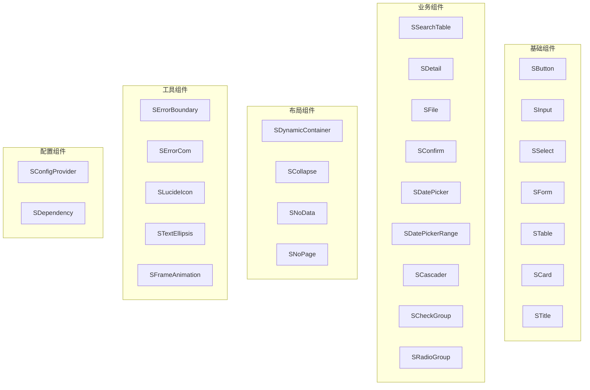

**图表来源**

- [ai/llms.txt: 20-199:20-199](file://ai/llms.txt#L20-L199)

### 组件导入方式

所有组件都通过统一的入口导出，支持按需加载：

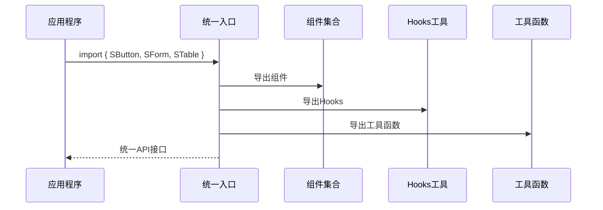

**图表来源**

- [src/index.ts: 1-5:1-5](file://src/index.ts#L1-L5)

**章节来源**

- [src/index.ts: 1-5:1-5](file://src/index.ts#L1-L5)
- [ai/llms.txt: 131-150:131-150](file://ai/llms.txt#L131-L150)

## 架构概览

### 整体架构设计

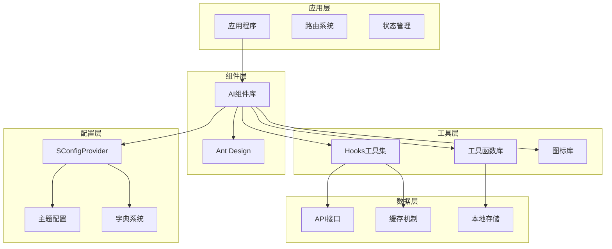

**图表来源**

- [README.md: 35-129:35-129](file://README.md#L35-L129)
- [ai/llms.txt: 190-208:190-208](file://ai/llms.txt#L190-L208)

### 数据流架构

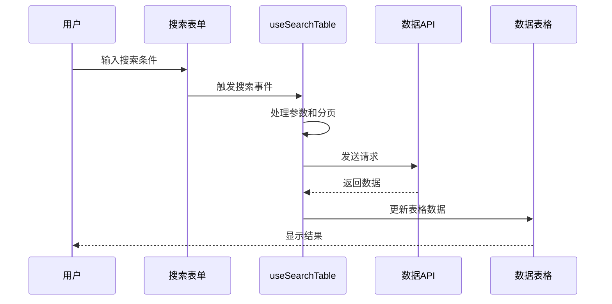

**图表来源**

- [ai/components/SSearchTable.md: 16-32:16-32](file://ai/components/SSearchTable.md#L16-L32)
- [ai/components/useSearchTable.md: 27-39:27-39](file://ai/components/useSearchTable.md#L27-L39)

## 详细组件分析

### SButton - 增强按钮组件

SButton 是一个增强的按钮组件，支持预设的操作类型和按钮组功能。

#### 组件特性

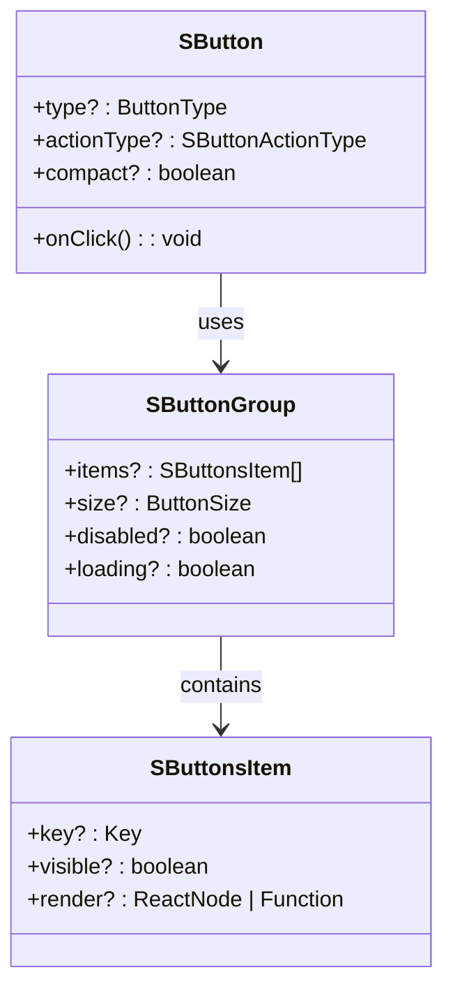

**图表来源**

- [ai/components/SButton.md: 20-43:20-43](file://ai/components/SButton.md#L20-L43)

#### 使用场景

- 页面中需要操作按钮（新增、编辑、删除、导出等）
- 需要 actionType 预设按钮文字和样式
- 需要按钮组（SButton.Group）批量配置按钮

**章节来源**

- [ai/components/SButton.md: 1-43:1-43](file://ai/components/SButton.md#L1-L43)

### SSearchTable - 搜索表格组件

SSearchTable 是 SForm.Search 和 STable 的一体化组件，专为管理后台标准列表页设计。

#### 核心功能

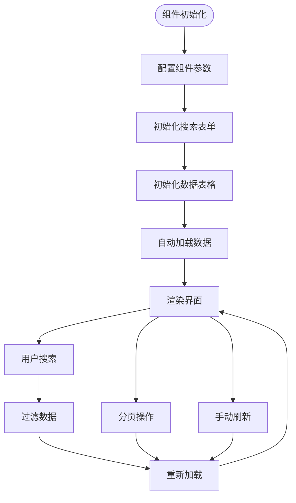

**图表来源**

- [ai/components/SSearchTable.md: 16-32:16-32](file://ai/components/SSearchTable.md#L16-L32)

#### 组件配置

| 配置项     | 类型        | 描述                    | 默认值 |
| ---------- | ----------- | ----------------------- | ------ |
| headTitle  | STitleProps | 页面顶部标题配置        | -      |
| tableTitle | STitleProps | 表格区域标题配置        | -      |
| requestFn  | Function    | 数据请求函数            | 必填   |
| options    | Object      | useSearchTable 配置选项 | {}     |
| tableProps | Object      | 表格 props 配置         | {}     |
| formProps  | Object      | 搜索表单 props 配置     | {}     |

**章节来源**

- [ai/components/SSearchTable.md: 16-32:16-32](file://ai/components/SSearchTable.md#L16-L32)

### SDetail - 详情展示组件

SDetail 是一个强大的详情展示组件，支持 8 种渲染类型和自动格式化功能。

#### 渲染类型系统

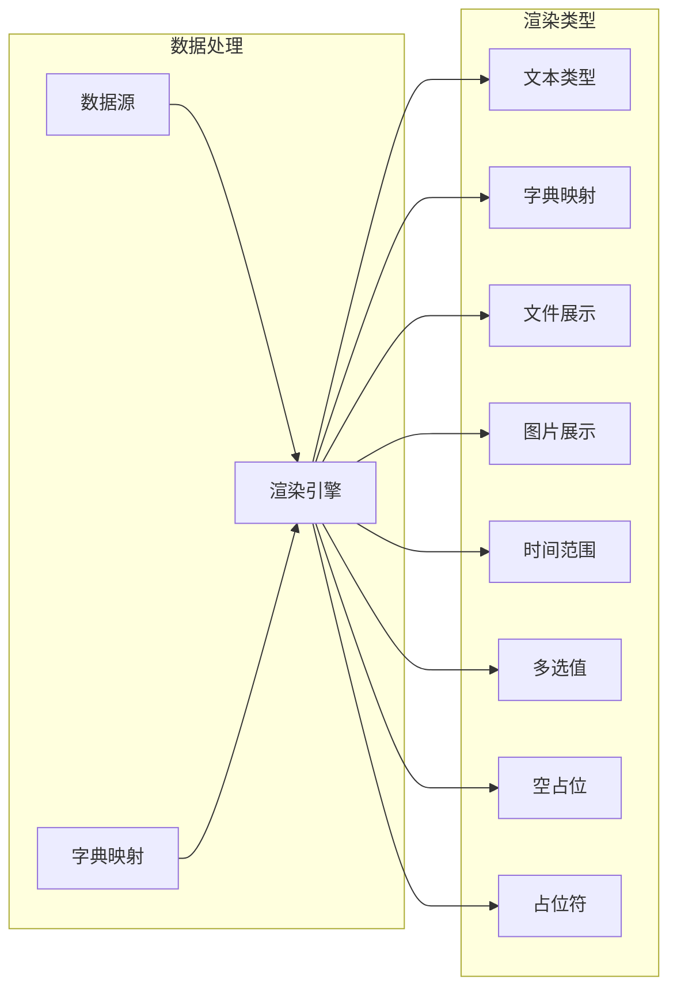

**图表来源**

- [ai/components/SDetail.md: 58-74:58-74](file://ai/components/SDetail.md#L58-L74)

#### 组件结构

| 组件类型      | 功能描述     | 使用场景       |
| ------------- | ------------ | -------------- |
| SDetail       | 基础详情组件 | 单个详情展示   |
| SDetail.Group | 分组详情组件 | 多组数据展示   |
| SDetail.Item  | 详情项组件   | 单个详情项配置 |

**章节来源**

- [ai/components/SDetail.md: 1-74:1-74](file://ai/components/SDetail.md#L1-L74)

### useSearchTable - 搜索表格 Hook

useSearchTable 是一个强大的数据处理 Hook，专门用于处理搜索表格的数据加载和状态管理。

#### Hook 工作流程

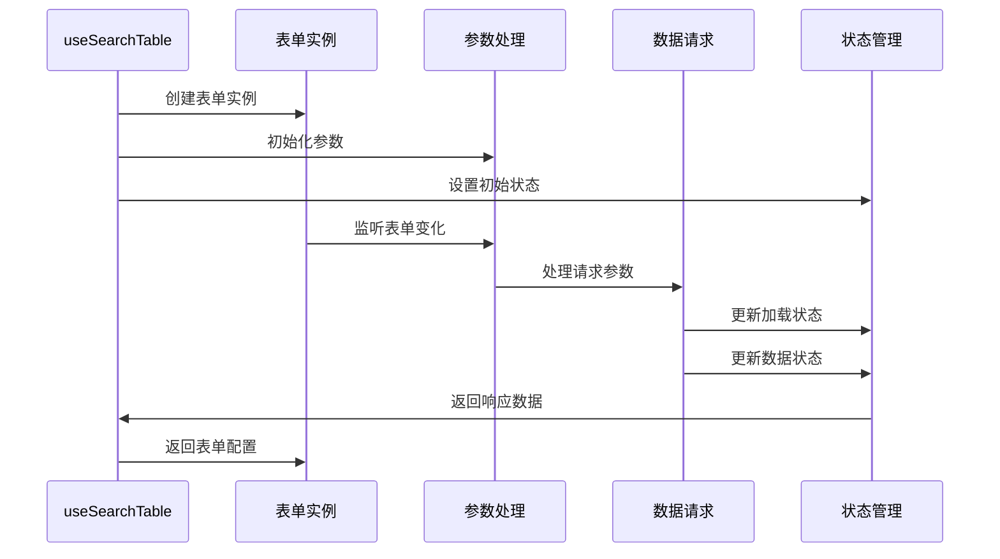

**图表来源**

- [ai/components/useSearchTable.md: 27-39:27-39](file://ai/components/useSearchTable.md#L27-L39)

#### 配置选项

| 选项                   | 类型         | 描述                   | 默认值 |
| ---------------------- | ------------ | ---------------------- | ------ |
| form                   | FormInstance | 外部表单实例           | -      |
| extraParams            | Object       | 额外请求参数           | -      |
| manual                 | Boolean      | 是否手动触发首次请求   | false  |
| dispatchParams         | Function     | 请求前参数处理         | -      |
| serviceProps           | Object       | ahooks useRequest 配置 | -      |
| paginationFields       | Object       | 分页字段映射           | -      |
| transformRequestParams | Function     | 请求参数转换           | -      |
| transformResponseData  | Function     | 响应数据转换           | -      |

**章节来源**

- [ai/components/useSearchTable.md: 12-22:12-22](file://ai/components/useSearchTable.md#L12-L22)

### SConfigProvider - 全局配置组件

SConfigProvider 是一个全局配置组件，为 STable 和 SDetail 等组件提供全局字典和上传地址配置。

#### 配置系统架构

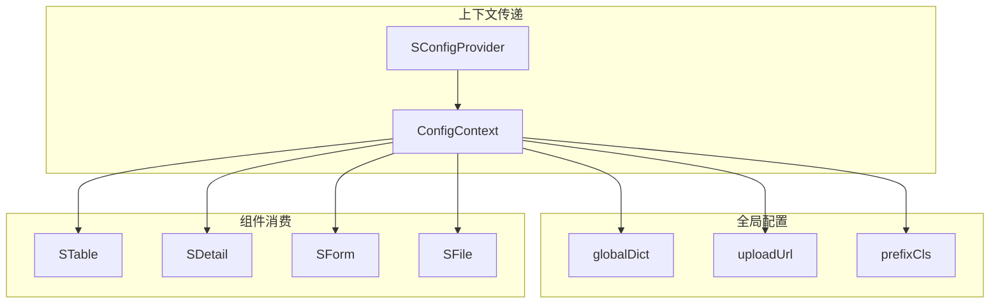

**图表来源**

- [ai/components/SConfigProvider.md: 15-27:15-27](file://ai/components/SConfigProvider.md#L15-L27)

#### 配置项说明

| 配置项     | 类型      | 描述             | 必填 |
| ---------- | --------- | ---------------- | ---- |
| globalDict | Object    | 全局字典数据     | 否   |
| uploadUrl  | String    | 文件上传接口地址 | 否   |
| children   | ReactNode | 子组件           | 是   |
| prefixCls  | String    | 样式前缀         | 否   |

**章节来源**

- [ai/components/SConfigProvider.md: 15-27:15-27](file://ai/components/SConfigProvider.md#L15-L27)

## 依赖分析

### 核心依赖关系

```mermaid
graph TB
subgraph "运行时依赖"
REACT[react >=18.0.0]
ANTD[antd >=5.20.6]
AHOOKS[ahooks ^3.7.4]
DAYJS[dayjs ^1.11.0]
LUCIDE[lucide-react >=0.500.0]
end
subgraph "开发依赖"
DUMI[dumi ~2.4.21]
FATHER[father ^4.6.11]
TYPESCRIPT[typescript ^5]
ESLINT[eslint ^8]
STYLELINT[stylelint ^14]
end
subgraph "工具依赖"
AXIOS[axios ^1.13.4]
CLASSNAMES[classnames ^2.5.1]
LODASH[lodash ^4.17.21]
ERROR_BOUNDARY[react-error-boundary ^6.0.0]
end
subgraph "项目依赖"
SDESIGN[@dalydb/sdesign]
ANT_STYLE[antd-style ^3.6.2]
COPY_CLIPBOARD[copy-to-clipboard ^3.3.3]
end
```

**图表来源**

- [package.json: 58-108:58-108](file://package.json#L58-L108)

### 组件间依赖关系

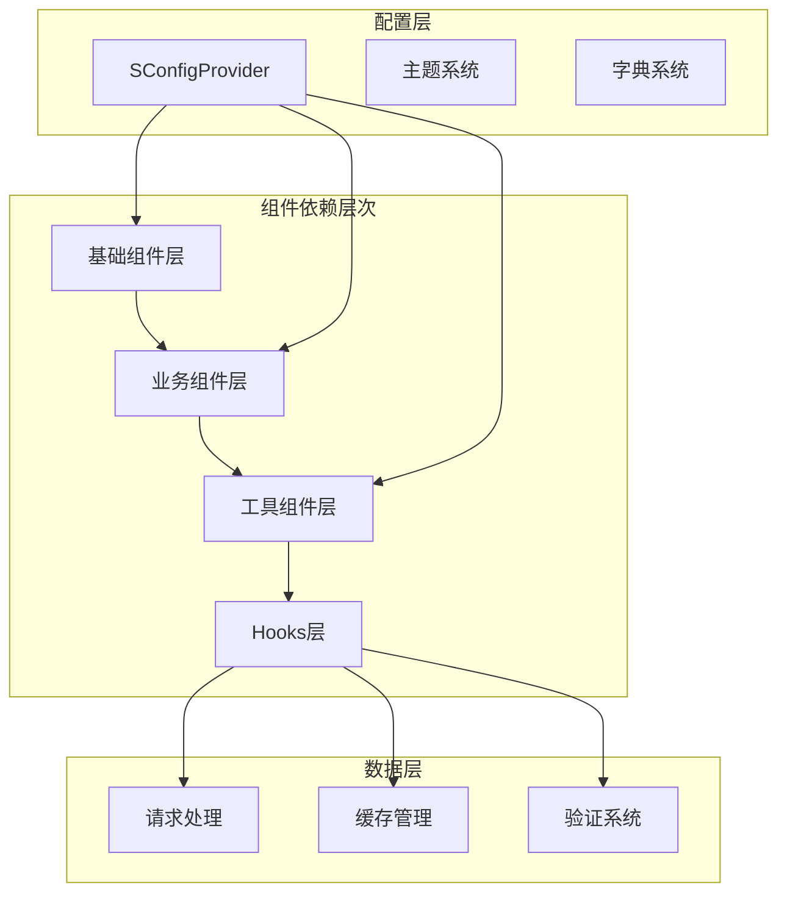

**图表来源**

- [src/hooks/index.ts: 1-21:1-21](file://src/hooks/index.ts#L1-L21)
- [src/utils/index.ts: 1-10:1-10](file://src/utils/index.ts#L1-L10)

**章节来源**

- [package.json: 58-108:58-108](file://package.json#L58-L108)
- [src/hooks/index.ts: 1-21:1-21](file://src/hooks/index.ts#L1-L21)
- [src/utils/index.ts: 1-10:1-10](file://src/utils/index.ts#L1-L10)

## 性能考虑

### 按需加载优化

项目支持完整的按需加载机制，通过以下方式优化性能：

1. **Tree Shaking** - 所有组件都支持 Tree Shaking，未使用的代码会被自动移除
2. **懒加载** - 大型组件支持懒加载，减少初始包体积
3. **代码分割** - 通过动态导入实现代码分割

### 缓存策略

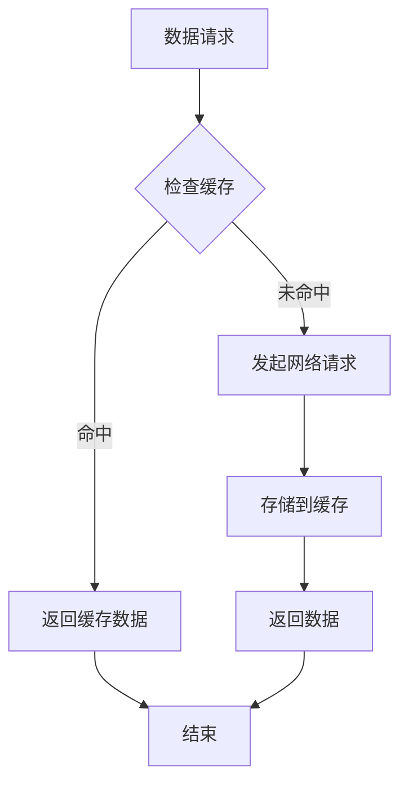

### 性能监控

- **React DevTools Profiler** - 提供组件渲染性能分析
- **Bundle Analyzer** - 分析包体积构成
- **Lighthouse** - 网页性能测试

## 故障排除指南

### 常见问题及解决方案

#### 组件导入问题

**问题**: 组件无法正确导入
**解决方案**:

1. 确保使用正确的导入路径
2. 检查版本兼容性
3. 确认按需加载配置

#### 样式冲突问题

**问题**: 组件样式与其他样式冲突
**解决方案**:

1. 使用 SConfigProvider 的 prefixCls 属性
2. 检查 CSS 优先级
3. 使用 CSS Modules

#### 数据加载问题

**问题**: 表格数据无法正确加载
**解决方案**:

1. 检查 requestFn 函数实现
2. 验证分页字段映射配置
3. 确认 API 接口格式

**章节来源**

- [ai/llms.txt: 202-208:202-208](file://ai/llms.txt#L202-L208)

### 调试技巧

1. **使用 React DevTools** - 检查组件树和状态
2. **启用开发模式** - 获取详细的错误信息
3. **使用 console.log** - 跟踪数据流向
4. **检查网络请求** - 验证 API 调用

## 结论

@Dalydb/sdesign 是一个设计精良的企业级 React 组件库，具有以下特点：

### 优势总结

1. **完整的组件体系** - 覆盖管理后台的各个业务场景
2. **优秀的开发体验** - 提供丰富的 Hooks 和工具函数
3. **良好的性能表现** - 支持按需加载和优化策略
4. **完善的文档支持** - 每个组件都有详细的使用说明
5. **灵活的配置选项** - 支持多种定制化需求

### 最佳实践建议

1. **优先使用 S 前缀组件** - 保持一致的组件体系
2. **合理使用配置组件** - 通过 SConfigProvider 统一配置
3. **充分利用 Hooks** - 使用 useSearchTable 等高级 Hook
4. **注意性能优化** - 合理使用懒加载和缓存
5. **遵循使用边界** - 严格按照组件的适用场景使用

### 未来发展

随着项目的持续发展，预计将添加更多业务场景的组件，进一步完善 Hooks 生态，并持续优化性能和开发体验。项目团队将继续保持与 Ant Design 的良好兼容性，确保组件库的稳定性和可靠性。
