# Business Template System

<cite>
**本文档引用的文件**
- [README.md](file://README.md)
- [package.json](file://package.json)
- [src/index.ts](file://src/index.ts)
- [src/components/index.ts](file://src/components/index.ts)
- [src/hooks/index.ts](file://src/hooks/index.ts)
- [src/utils/index.ts](file://src/utils/index.ts)
- [src/components/form/index.tsx](file://src/components/form/index.tsx)
- [src/hooks/useSearchTable/index.ts](file://src/hooks/useSearchTable/index.ts)
- [src/hooks/useSearchTable/types.ts](file://src/hooks/useSearchTable/types.ts)
- [src/components/search-table/index.tsx](file://src/components/search-table/index.tsx)
- [src/components/detail/index.tsx](file://src/components/detail/index.tsx)
- [src/components/config-provider/index.tsx](file://src/components/config-provider/index.tsx)
- [src/utils/dict.ts](file://src/utils/dict.ts)
- [config/index.ts](file://config/index.ts)
- [docs/index.md](file://docs/index.md)
</cite>

## 目录

1. [简介](#简介)
2. [项目结构](#项目结构)
3. [核心组件](#核心组件)
4. [架构概览](#架构概览)
5. [详细组件分析](#详细组件分析)
6. [依赖关系分析](#依赖关系分析)
7. [性能考虑](#性能考虑)
8. [故障排除指南](#故障排除指南)
9. [结论](#结论)

## 简介

Business Template System（业务模板系统）是一个基于 Ant Design 二次封装的企业级 React 组件库，专注于提升管理后台开发效率。该系统提供了丰富的组件体系、强大的 Hooks 工具库和完善的工具函数集合。

### 主要特性

- **丰富组件** - 50+ 企业级组件，覆盖常见业务场景
- **开箱即用** - 基于 Ant Design 5.x，无缝集成
- **强大工具** - 完善的 Hooks 和工具函数库
- **按需加载** - 支持 tree-shaking，减少打包体积
- **TypeScript** - 完整的类型定义支持
- **易于定制** - 灵活的主题配置和样式扩展

### 技术栈

- React 18+
- TypeScript 5+
- Ant Design 5.x
- ahooks 3.x
- dumi 2.x（文档工具）
- father 4.x（构建工具）

## 项目结构

项目采用模块化组织方式，主要分为以下几个核心目录：

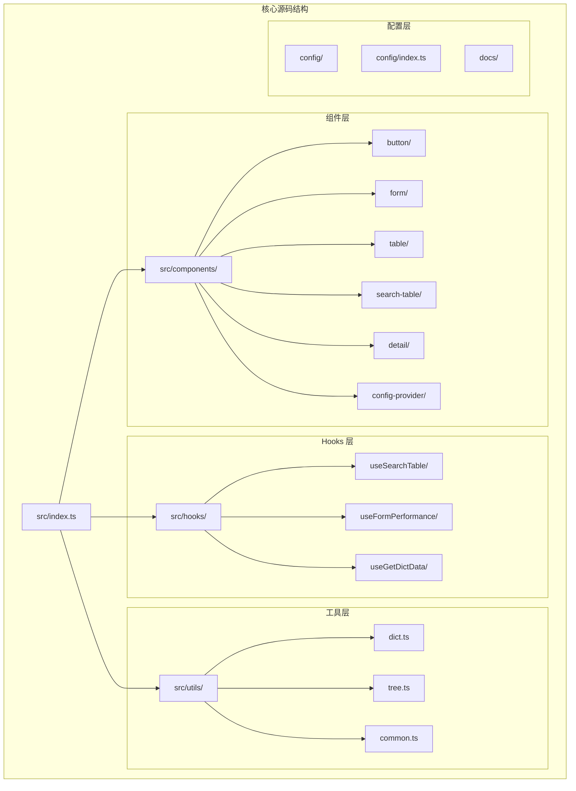

**图表来源**

- [src/index.ts](file://src/index.ts#L1-L5)
- [src/components/index.ts](file://src/components/index.ts#L1-L78)
- [src/hooks/index.ts](file://src/hooks/index.ts#L1-L25)
- [src/utils/index.ts](file://src/utils/index.ts#L1-L10)

**章节来源**

- [src/index.ts](file://src/index.ts#L1-L5)
- [src/components/index.ts](file://src/components/index.ts#L1-L78)
- [src/hooks/index.ts](file://src/hooks/index.ts#L1-L25)
- [src/utils/index.ts](file://src/utils/index.ts#L1-L10)

## 核心组件

### 组件体系概览

系统提供完整的组件体系，涵盖基础组件、业务组件和布局组件三大类：

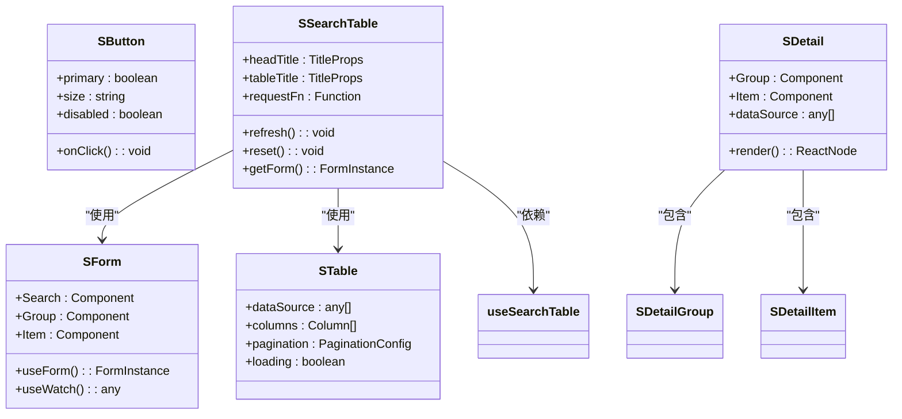

**图表来源**

- [src/components/search-table/index.tsx](file://src/components/search-table/index.tsx#L1-L58)
- [src/components/detail/index.tsx](file://src/components/detail/index.tsx#L1-L19)
- [src/components/form/index.tsx](file://src/components/form/index.tsx#L1-L34)

### 组件导出结构

系统通过统一的入口文件导出所有组件，提供清晰的 API 接口：

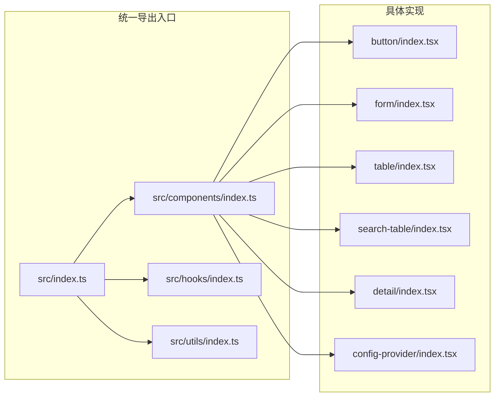

**图表来源**

- [src/index.ts](file://src/index.ts#L1-L5)
- [src/components/index.ts](file://src/components/index.ts#L1-L78)
- [src/hooks/index.ts](file://src/hooks/index.ts#L1-L25)
- [src/utils/index.ts](file://src/utils/index.ts#L1-L10)

**章节来源**

- [src/components/index.ts](file://src/components/index.ts#L1-L78)
- [src/hooks/index.ts](file://src/hooks/index.ts#L1-L25)
- [src/utils/index.ts](file://src/utils/index.ts#L1-L10)

## 架构概览

### 整体架构设计

系统采用分层架构设计，通过 Context 提供全局配置，通过 Hooks 封装复杂逻辑，通过组件组合实现业务功能：

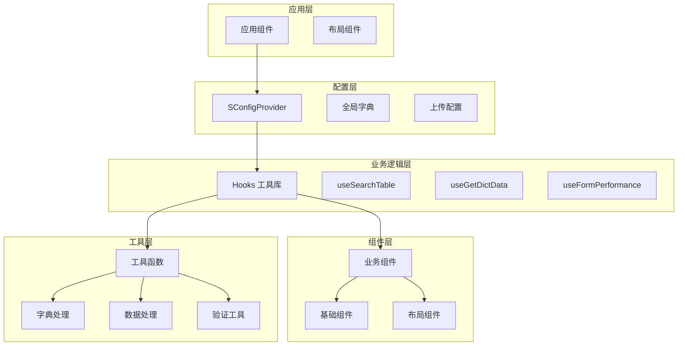

**图表来源**

- [src/components/config-provider/index.tsx](file://src/components/config-provider/index.tsx#L1-L47)
- [src/hooks/useSearchTable/index.ts](file://src/hooks/useSearchTable/index.ts#L1-L193)
- [src/utils/dict.ts](file://src/utils/dict.ts#L1-L121)

### 数据流架构

系统的核心数据流通过 useSearchTable Hook 实现，形成完整的数据获取、处理和展示流程：

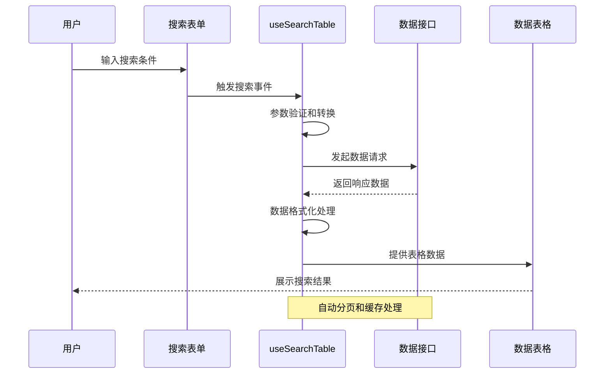

**图表来源**

- [src/hooks/useSearchTable/index.ts](file://src/hooks/useSearchTable/index.ts#L1-L193)
- [src/components/search-table/index.tsx](file://src/components/search-table/index.tsx#L1-L58)

**章节来源**

- [src/components/config-provider/index.tsx](file://src/components/config-provider/index.tsx#L1-L47)
- [src/hooks/useSearchTable/index.ts](file://src/hooks/useSearchTable/index.ts#L1-L193)

## 详细组件分析

### useSearchTable Hook 分析

useSearchTable 是系统的核心 Hook，提供了完整的搜索表格功能封装：

#### 核心功能特性

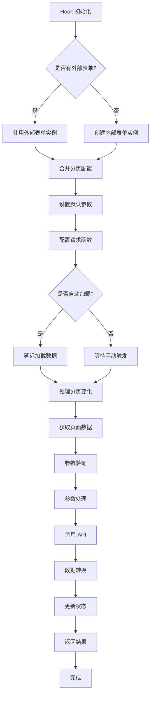

**图表来源**

- [src/hooks/useSearchTable/index.ts](file://src/hooks/useSearchTable/index.ts#L1-L193)

#### 关键配置选项

| 配置项                 | 类型             | 默认值       | 描述                   |
| ---------------------- | ---------------- | ------------ | ---------------------- |
| form                   | FormInstance     | undefined    | 外部传入的表单实例     |
| extraParams            | Record           | undefined    | 额外请求参数           |
| manual                 | boolean          | false        | 是否手动触发首次请求   |
| dispatchParams         | Function         | undefined    | 请求前参数处理函数     |
| serviceProps           | Options          | undefined    | ahooks useRequest 配置 |
| paginationFields       | PaginationFields | 默认分页字段 | 分页字段映射配置       |
| transformRequestParams | Function         | undefined    | 请求参数转换函数       |
| transformResponseData  | Function         | undefined    | 响应数据转换函数       |

#### 返回值结构

| 返回值      | 类型                  | 描述                   |
| ----------- | --------------------- | ---------------------- |
| getPageData | Function              | 手动触发数据加载       |
| handleReset | Function              | 重置搜索并刷新         |
| tableProps  | TableProps            | 直接传给表格组件的属性 |
| dataSource  | any[]                 | 表格数据源             |
| pagination  | TablePaginationConfig | 分页配置               |
| loading     | boolean               | 加载状态               |
| error       | any                   | 错误信息               |
| form        | FormInstance          | 表单实例               |
| formConfig  | Object                | 搜索表单配置           |

**章节来源**

- [src/hooks/useSearchTable/index.ts](file://src/hooks/useSearchTable/index.ts#L1-L193)
- [src/hooks/useSearchTable/types.ts](file://src/hooks/useSearchTable/types.ts#L1-L117)

### SSearchTable 组件分析

SSearchTable 是基于 useSearchTable Hook 的完整业务组件，提供了开箱即用的搜索表格解决方案：

#### 组件架构

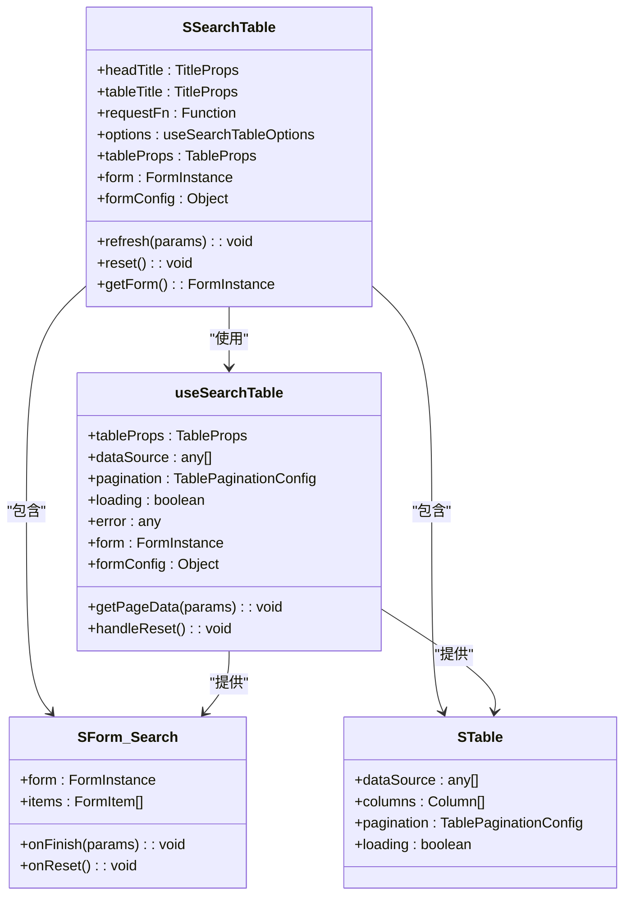

**图表来源**

- [src/components/search-table/index.tsx](file://src/components/search-table/index.tsx#L1-L58)
- [src/hooks/useSearchTable/index.ts](file://src/hooks/useSearchTable/index.ts#L1-L193)

#### 组件生命周期

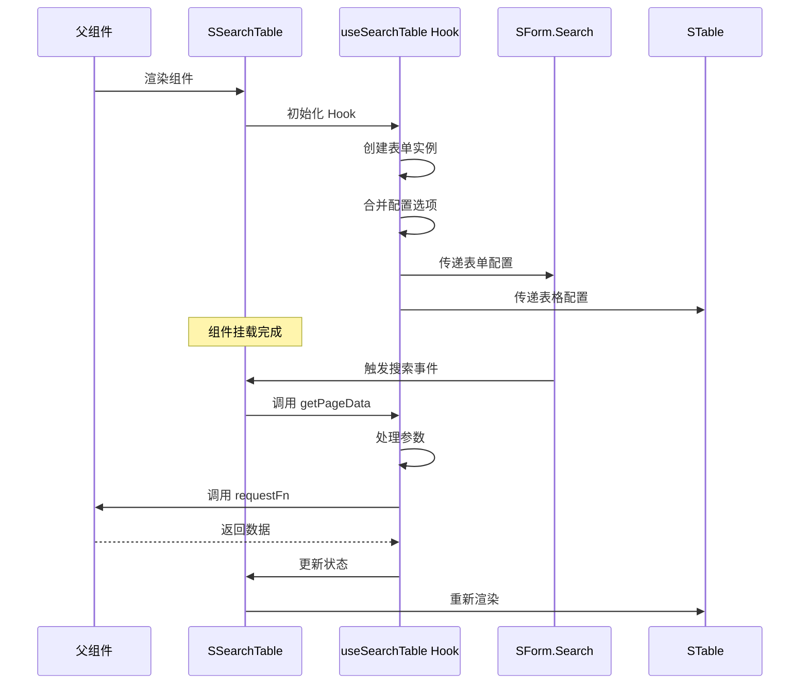

**图表来源**

- [src/components/search-table/index.tsx](file://src/components/search-table/index.tsx#L1-L58)
- [src/hooks/useSearchTable/index.ts](file://src/hooks/useSearchTable/index.ts#L1-L193)

**章节来源**

- [src/components/search-table/index.tsx](file://src/components/search-table/index.tsx#L1-L58)

### 字典处理系统

系统提供了完整的字典处理机制，支持多种数据格式和映射策略：

#### 字典处理流程

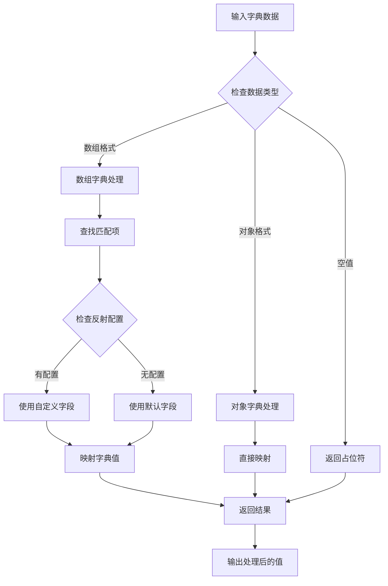

**图表来源**

- [src/utils/dict.ts](file://src/utils/dict.ts#L1-L121)

#### 字典处理函数

| 函数名                   | 参数                              | 返回值 | 描述             |
| ------------------------ | --------------------------------- | ------ | ---------------- |
| dispatchDictData         | dictMap, detailValue, dictReflect | string | 处理单个字典值   |
| dispatchCheckboxDictData | dictMap, detailValue, dictReflect | string | 处理多选框字典值 |
| getDictMap               | {dictMap, globalDict, dictKey}    | Record | 获取字典映射     |

**章节来源**

- [src/utils/dict.ts](file://src/utils/dict.ts#L1-L121)

### 全局配置系统

SConfigProvider 提供了全局配置能力，支持字典数据和上传配置的统一管理：

#### 配置上下文结构

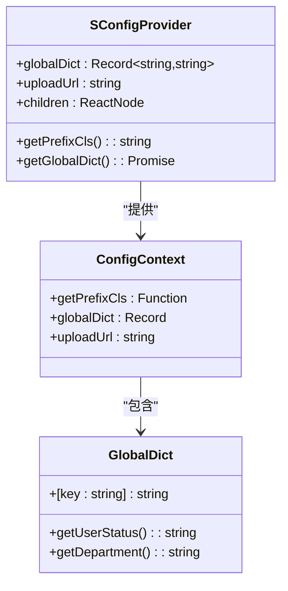

**图表来源**

- [src/components/config-provider/index.tsx](file://src/components/config-provider/index.tsx#L1-L47)

**章节来源**

- [src/components/config-provider/index.tsx](file://src/components/config-provider/index.tsx#L1-L47)

## 依赖关系分析

### 核心依赖关系

系统采用模块化设计，各模块之间保持松耦合：

```mermaid
graph TB
subgraph "运行时依赖"
REACT[react@^18.0.0]
ANT_DESIGN[antd@^5.20.6]
AHOOKS[ahooks@^3.7.4]
AXIOS[axios@^1.13.4]
end
subgraph "开发时依赖"
TYPESCRIPT[typescript@^5]
DUMI[dumi@~2.4.21]
FATHER[father@^4.6.11]
ESLINT[eslint@^8.57.1]
end
subgraph "工具依赖"
LUCID[lucide-react@>=0.500.0]
DAYJS[dayjs@^1.11.0]
ANTD_STYLE[antd-style@^3.6.2]
end
subgraph "业务组件库"
SDESIGN[@dalydb/sdesign]
end
SDESIGN --> REACT
SDESIGN --> ANT_DESIGN
SDESIGN --> AHOOKS
SDESIGN --> AXIOS
DUMI --> TYPESCRIPT
FATHER --> TYPESCRIPT
ESLINT --> TYPESCRIPT
```

**图表来源**

- [package.json](file://package.json#L58-L108)

### 组件间依赖关系

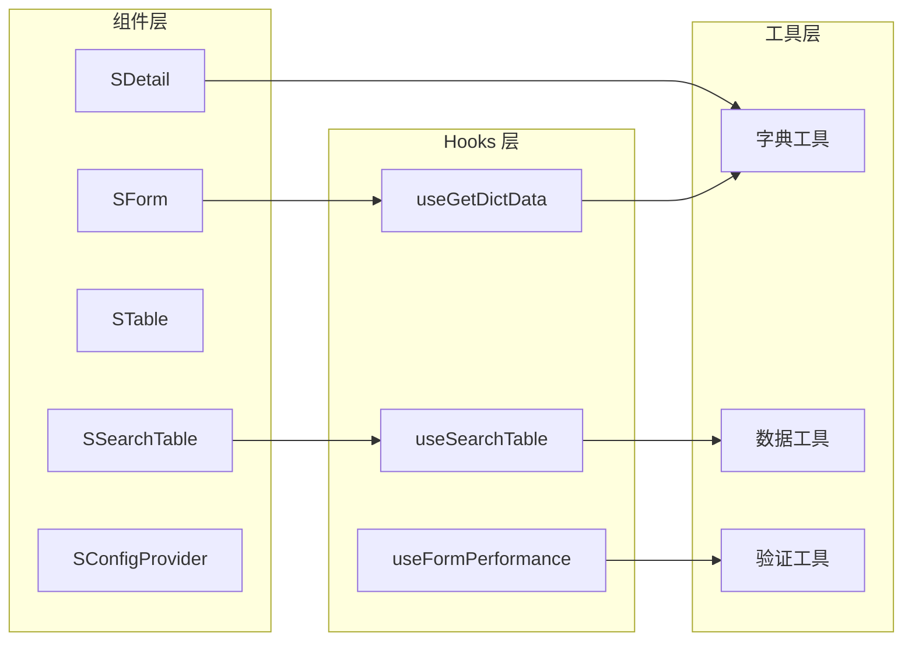

**图表来源**

- [src/components/search-table/index.tsx](file://src/components/search-table/index.tsx#L1-L58)
- [src/hooks/useSearchTable/index.ts](file://src/hooks/useSearchTable/index.ts#L1-L193)
- [src/utils/dict.ts](file://src/utils/dict.ts#L1-L121)

**章节来源**

- [package.json](file://package.json#L58-L108)

## 性能考虑

### 优化策略

1. **按需加载** - 通过 Tree Shaking 减少打包体积
2. **懒加载** - 组件支持动态导入
3. **缓存机制** - useSearchTable 内置请求缓存
4. **虚拟滚动** - 大数据量表格的性能优化
5. **防抖节流** - 搜索表单的输入优化

### 性能监控

系统提供了多种性能监控手段：

- **React DevTools Profiler** - 组件渲染性能分析
- **Bundle Analyzer** - 打包体积分析
- **Network Monitor** - 网络请求监控
- **Memory Profiler** - 内存使用情况监控

## 故障排除指南

### 常见问题及解决方案

#### 组件无法正常渲染

**问题描述**: 组件显示异常或报错

**可能原因**:

1. 缺少必要的依赖包
2. 版本不兼容
3. 配置错误

**解决步骤**:

1. 检查依赖版本是否符合要求
2. 确认组件导入路径正确
3. 验证配置参数有效性

#### 数据加载失败

**问题描述**: 使用 useSearchTable 时数据无法加载

**可能原因**:

1. API 接口地址配置错误
2. 请求参数格式不正确
3. 响应数据格式不符合预期

**解决步骤**:

1. 检查 requestFn 函数实现
2. 验证分页字段映射配置
3. 确认响应数据结构

#### 字典数据不显示

**问题描述**: 字典值显示为占位符

**可能原因**:

1. 字典数据未正确配置
2. 字典映射规则不匹配
3. 数据类型不正确

**解决步骤**:

1. 检查全局字典配置
2. 验证字典映射函数
3. 确认数据格式一致性

**章节来源**

- [src/hooks/useSearchTable/index.ts](file://src/hooks/useSearchTable/index.ts#L1-L193)
- [src/utils/dict.ts](file://src/utils/dict.ts#L1-L121)

## 结论

Business Template System 是一个设计精良的企业级 React 组件库，具有以下特点：

### 优势总结

1. **完整的组件体系** - 覆盖管理后台的各类业务场景
2. **强大的工具库** - 提供丰富的 Hooks 和工具函数
3. **灵活的配置机制** - 支持全局配置和局部定制
4. **良好的性能表现** - 通过多种优化策略提升用户体验
5. **完善的类型支持** - TypeScript 完整类型定义

### 应用场景

- 管理后台系统开发
- 数据展示平台
- 企业级应用界面
- 快速原型开发

### 发展建议

1. **持续优化性能** - 进一步提升大数据量场景下的性能表现
2. **扩展组件生态** - 增加更多业务场景的专用组件
3. **完善文档体系** - 提供更详细的使用指南和最佳实践
4. **加强测试覆盖** - 提升代码质量和稳定性

该系统为企业级前端开发提供了坚实的基础，能够显著提升开发效率和代码质量。
