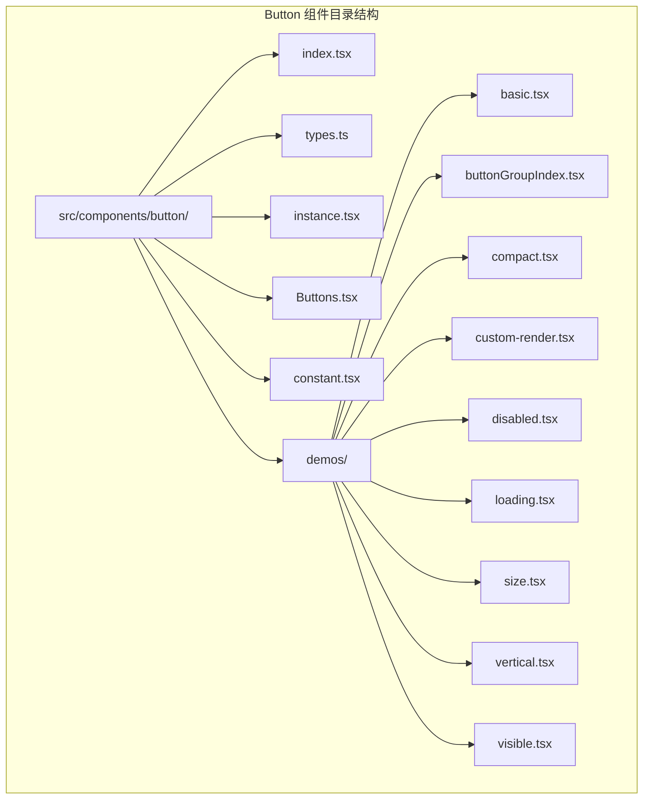
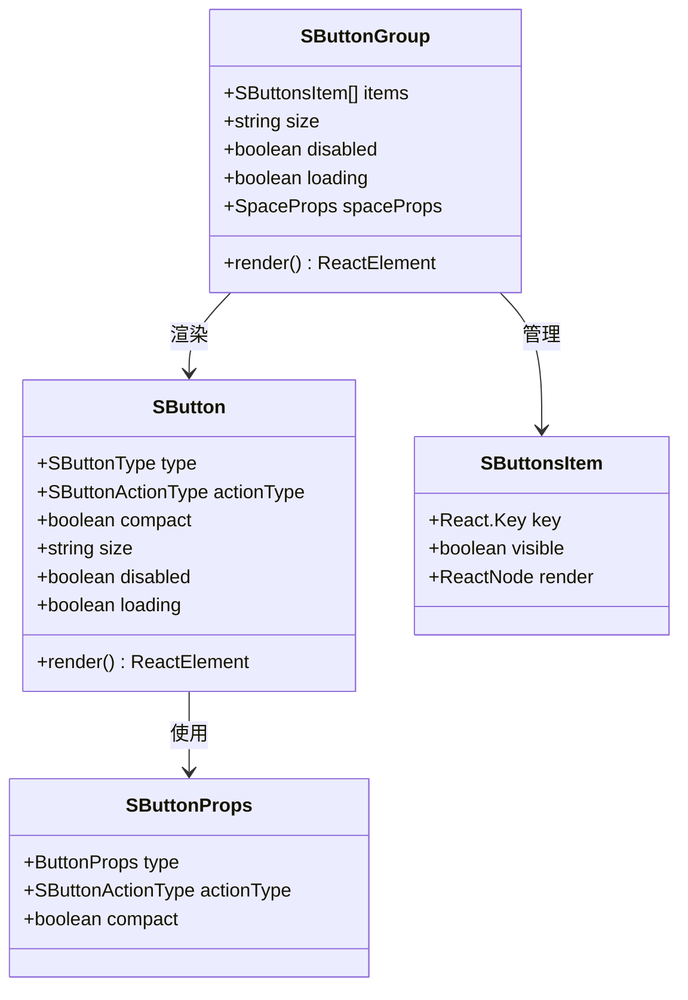
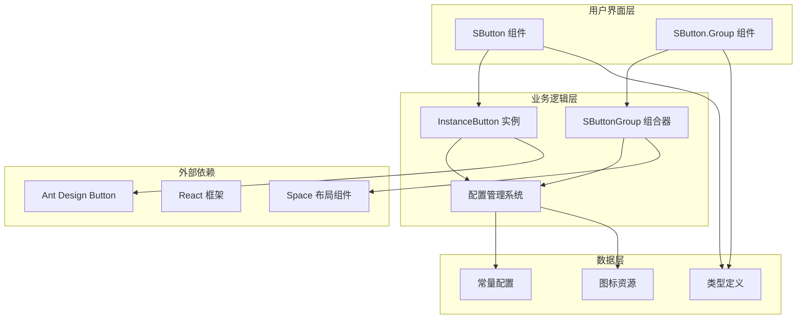
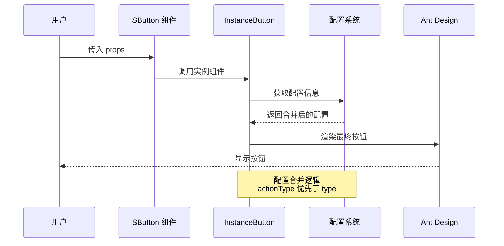
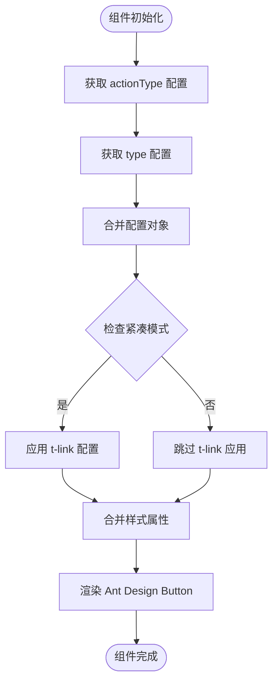
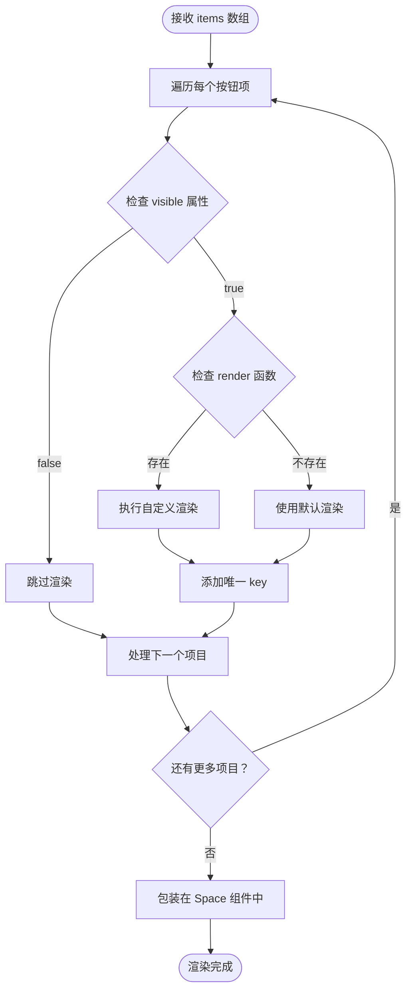
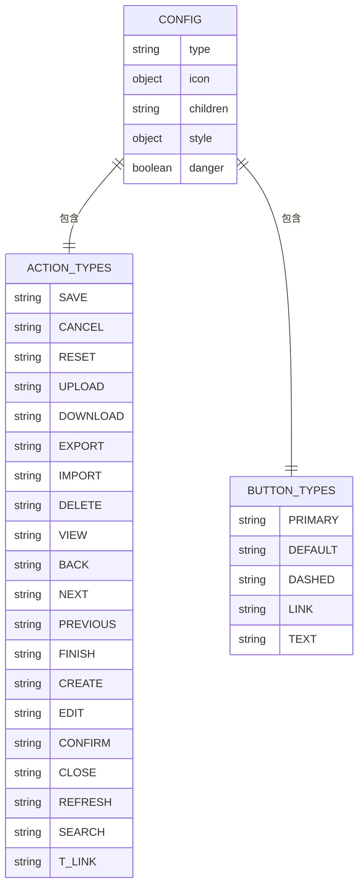
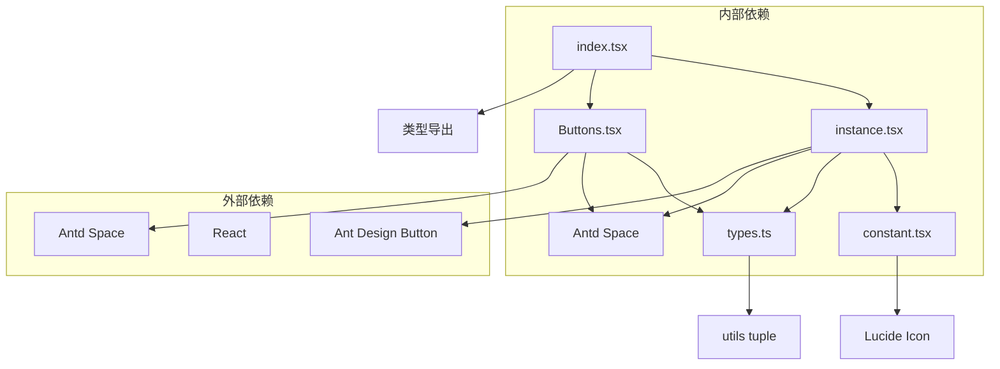

# Button 组件

<cite>
**本文档引用的文件**
- [src/components/button/index.tsx](file://src/components/button/index.tsx)
- [src/components/button/types.ts](file://src/components/button/types.ts)
- [src/components/button/instance.tsx](file://src/components/button/instance.tsx)
- [src/components/button/Buttons.tsx](file://src/components/button/Buttons.tsx)
- [src/components/button/constant.tsx](file://src/components/button/constant.tsx)
- [src/components/button/demos/basic.tsx](file://src/components/button/demos/basic.tsx)
- [src/components/button/demos/buttonGroupIndex.tsx](file://src/components/button/demos/buttonGroupIndex.tsx)
- [src/components/button/demos/compact.tsx](file://src/components/button/demos/compact.tsx)
- [src/components/button/demos/custom-render.tsx](file://src/components/button/demos/custom-render.tsx)
- [src/components/button/demos/disabled.tsx](file://src/components/button/demos/disabled.tsx)
- [src/components/button/demos/loading.tsx](file://src/components/button/demos/loading.tsx)
- [src/components/button/demos/size.tsx](file://src/components/button/demos/size.tsx)
- [src/components/button/demos/vertical.tsx](file://src/components/button/demos/vertical.tsx)
- [src/components/button/demos/visible.tsx](file://src/components/button/demos/visible.tsx)
</cite>

## 更新摘要

**所做更改**

- 更新了 SButtonActionType 枚举，新增 't-link' 操作类型
- 增强了 SButton 组件类型定义说明
- 新增了 SButtonsItem 和 SButtonsProps 接口的详细文档
- 更新了操作类型列表，从 28 种增加到 21 种（包含 t-link）
- 完善了按钮组配置系统的接口文档

## 目录

1. [简介](#简介)
2. [项目结构](#项目结构)
3. [核心组件](#核心组件)
4. [架构概览](#架构概览)
5. [详细组件分析](#详细组件分析)
6. [依赖关系分析](#依赖关系分析)
7. [性能考虑](#性能考虑)
8. [故障排除指南](#故障排除指南)
9. [结论](#结论)

## 简介

Button 组件是 SDesign 设计系统中的核心交互组件，提供了一套完整的按钮解决方案。该组件基于 Ant Design 的 Button 组件进行扩展，增加了操作类型、紧凑模式、图标支持等功能，旨在为开发者提供更加丰富和易用的按钮组件。

主要特性包括：

- 支持多种操作类型（保存、取消、重置、上传、下载、t-link 等）
- 紧凑模式适配密集布局场景
- 内置丰富的图标支持
- 按钮组管理功能
- 完整的状态控制（禁用、加载中）

**更新** 新增了 't-link' 操作类型，扩展了按钮组配置系统的接口文档

## 项目结构

Button 组件采用模块化设计，主要文件结构如下：

**图表来源**

- [src/components/button/index.tsx:1-15](file://src/components/button/index.tsx#L1-L15)
- [src/components/button/types.ts:1-102](file://src/components/button/types.ts#L1-L102)

**章节来源**

- [src/components/button/index.tsx:1-15](file://src/components/button/index.tsx#L1-L15)
- [src/components/button/types.ts:1-102](file://src/components/button/types.ts#L1-L102)

## 核心组件

Button 组件由多个核心部分组成，每个部分都有特定的功能和职责：

### 主要组件层次

**图表来源**

- [src/components/button/instance.tsx:7-36](file://src/components/button/instance.tsx#L7-L36)
- [src/components/button/Buttons.tsx:7-45](file://src/components/button/Buttons.tsx#L7-L45)
- [src/components/button/types.ts:56-74](file://src/components/button/types.ts#L56-L74)

### 操作类型系统

组件支持 21 种预定义的操作类型，每种类型都配有相应的图标和文本：

| 操作类型 | 对应图标     | 显示文本 |
| -------- | ------------ | -------- |
| save     | Save         | 保存     |
| cancel   | CircleX      | 取消     |
| reset    | RotateCcw    | 重置     |
| upload   | Upload       | 上传     |
| download | Download     | 下载     |
| export   | FolderOutput | 导出     |
| import   | Import       | 导入     |
| delete   | Trash        | 删除     |
| view     | Eye          | 查看     |
| back     | ArrowLeft    | 返回     |
| next     | ArrowRight   | 下一页   |
| previous | ArrowLeft    | 上一页   |
| finish   | CheckCircle  | 完成     |
| create   | PlusCircle   | 创建     |
| edit     | Edit         | 编辑     |
| confirm  | Check        | 确认     |
| close    | X            | 关闭     |
| refresh  | RefreshCw    | 刷新     |
| search   | Search       | 查询     |
| t-link   | 自定义       | t-link   |

**更新** 新增了 't-link' 操作类型，用于链接样式的按钮

**章节来源**

- [src/components/button/types.ts:11-32](file://src/components/button/types.ts#L11-L32)
- [src/components/button/constant.tsx:29-148](file://src/components/button/constant.tsx#L29-L148)

## 架构概览

Button 组件采用分层架构设计，确保了良好的可维护性和扩展性：

**图表来源**

- [src/components/button/index.tsx:1-14](file://src/components/button/index.tsx#L1-L14)
- [src/components/button/instance.tsx:1-39](file://src/components/button/instance.tsx#L1-L39)
- [src/components/button/Buttons.tsx:1-48](file://src/components/button/Buttons.tsx#L1-L48)

### 数据流处理

**图表来源**

- [src/components/button/instance.tsx:14-24](file://src/components/button/instance.tsx#L14-L24)
- [src/components/button/constant.tsx:29-48](file://src/components/button/constant.tsx#L29-L48)

## 详细组件分析

### InstanceButton 组件

InstanceButton 是按钮的核心实现组件，负责处理所有按钮的渲染逻辑：

#### 核心功能实现

**图表来源**

- [src/components/button/instance.tsx:14-35](file://src/components/button/instance.tsx#L14-L35)

#### 配置优先级机制

配置系统采用了明确的优先级规则：

1. **actionType 优先级最高**：当同时指定 actionType 和 type 时，actionType 会覆盖 type 的配置
2. **紧凑模式叠加**：compact 模式会在现有配置基础上叠加 t-link 配置
3. **样式合并策略**：最终样式通过对象展开的方式进行合并

**章节来源**

- [src/components/button/instance.tsx:14-35](file://src/components/button/instance.tsx#L14-L35)
- [src/components/button/constant.tsx:29-48](file://src/components/button/constant.tsx#L29-L48)

### SButtonGroup 组件

SButtonGroup 提供了按钮组的管理功能，支持批量配置和统一控制：

#### 渲染逻辑分析

**图表来源**

- [src/components/button/Buttons.tsx:14-44](file://src/components/button/Buttons.tsx#L14-L44)

#### 按钮项配置选项

每个按钮项支持以下配置选项：

| 选项名  | 类型                  | 默认值    | 描述                      |
| ------- | --------------------- | --------- | ------------------------- |
| key     | React.Key             | undefined | 按钮的唯一标识符          |
| visible | boolean               | true      | 控制按钮是否显示          |
| render  | ReactNode \| Function | undefined | 自定义渲染函数或元素      |
| 其他    | SButtonProps          | -         | 继承自 SButton 的所有属性 |

**更新** 完善了 SButtonsItem 接口的文档说明

**章节来源**

- [src/components/button/Buttons.tsx:61-65](file://src/components/button/Buttons.tsx#L61-L65)
- [src/components/button/types.ts:68-74](file://src/components/button/types.ts#L68-L74)

### 配置管理系统

配置系统是按钮组件的核心，提供了丰富的预设配置和动态配置能力：

#### 预设配置结构

**图表来源**

- [src/components/button/constant.tsx:29-148](file://src/components/button/constant.tsx#L29-L148)

#### 图标优化策略

为了提升性能，组件使用了 React.memo 包装所有图标组件：

- **MemoizedSaveIcon** - 保存图标
- **MemoizedRotateCcwIcon** - 重置图标
- **MemoizedUploadIcon** - 上传图标
- **MemoizedDownloadIcon** - 下载图标
- **MemoizedFolderOutputIcon** - 导出图标
- **MemoizedImportIcon** - 导入图标
- **MemoizedTrashIcon** - 删除图标
- **MemoizedPlusCircleIcon** - 创建图标
- **MemoizedEditIcon** - 编辑图标
- **MemoizedArrowRightIcon** - 右箭头图标
- **MemoizedArrowLeftIcon** - 左箭头图标
- **MemoizedCheckCircleIcon** - 完成图标
- **MemoizedCircleXIcon** - 取消图标
- **MemoizedXIcon** - 关闭图标
- **MemoizedCheckIcon** - 确认图标
- **MemoizedEyeIcon** - 查看图标
- **MemoizedRefreshCwIcon** - 刷新图标
- **MemoizedSearchIcon** - 搜索图标

**章节来源**

- [src/components/button/constant.tsx:8-26](file://src/components/button/constant.tsx#L8-L26)

## 依赖关系分析

Button 组件的依赖关系清晰且层次分明：

**图表来源**

- [src/components/button/index.tsx:1-2](file://src/components/button/index.tsx#L1-L2)
- [src/components/button/instance.tsx:1-5](file://src/components/button/instance.tsx#L1-L5)
- [src/components/button/Buttons.tsx:1-5](file://src/components/button/Buttons.tsx#L1-L5)

### 外部依赖分析

| 依赖包                | 版本       | 用途         | 重要性   |
| --------------------- | ---------- | ------------ | -------- |
| antd                  | 最新版本   | 基础 UI 组件 | 核心依赖 |
| react                 | 最新版本   | React 框架   | 核心依赖 |
| @dalydb/sdesign/utils | 自有工具库 | 类型工具函数 | 辅助依赖 |

**章节来源**

- [src/components/button/types.ts:1-4](file://src/components/button/types.ts#L1-L4)
- [src/components/button/instance.tsx:1-5](file://src/components/button/instance.tsx#L1-L5)

## 性能考虑

### 渲染优化策略

1. **组件记忆化**：所有核心组件都使用 React.memo 进行优化
2. **图标缓存**：使用 memo 包装图标组件避免重复创建
3. **配置缓存**：通过 useMemo 优化样式合并计算
4. **条件渲染**：支持按钮可见性控制减少 DOM 节点

### 内存优化

- **图标复用**：单个图标组件实例在多处使用
- **配置对象复用**：预定义配置对象避免重复创建
- **事件处理器缓存**：使用 useCallback 优化回调函数

## 故障排除指南

### 常见问题及解决方案

#### 问题 1：按钮样式异常

**症状**：按钮样式不符合预期
**可能原因**：

- 样式属性被覆盖
- 紧凑模式配置冲突
- 自定义样式未正确传递

**解决方案**：

1. 检查 style 属性的传递顺序
2. 确认 compact 模式的使用场景
3. 验证自定义样式的优先级

#### 问题 2：图标显示错误

**症状**：按钮图标不显示或显示异常
**可能原因**：

- 图标名称拼写错误
- LucideIcon 组件未正确导入
- 图标组件未正确记忆化

**解决方案**：

1. 验证图标名称是否在常量配置中
2. 检查 LucideIcon 组件的导入路径
3. 确认图标组件的 memo 包装

#### 问题 3：按钮组渲染问题

**症状**：按钮组布局异常或按钮不显示
**可能原因**：

- visible 属性设置为 false
- key 属性缺失导致渲染异常
- Space 组件配置错误

**解决方案**：

1. 检查每个按钮项的 visible 属性
2. 为每个按钮项提供唯一的 key
3. 验证 Space 组件的配置参数

**章节来源**

- [src/components/button/Buttons.tsx:14-38](file://src/components/button/Buttons.tsx#L14-L38)
- [src/components/button/constant.tsx:8-26](file://src/components/button/constant.tsx#L8-L26)

## 结论

Button 组件是一个设计精良、功能完善的 UI 组件，具有以下特点：

### 优势总结

1. **设计理念先进**：采用配置驱动的设计模式，易于扩展和维护
2. **功能丰富完整**：支持多种操作类型、状态管理和布局控制
3. **性能优化到位**：通过多种优化策略确保组件的高性能表现
4. **用户体验优秀**：提供直观的 API 和丰富的配置选项

### 技术亮点

- **灵活的配置系统**：支持静态配置和动态配置的混合使用
- **强大的组合能力**：按钮组功能提供了丰富的布局控制
- **完善的类型系统**：完整的 TypeScript 类型定义确保开发体验
- **优秀的扩展性**：清晰的架构设计便于功能扩展

### 发展建议

1. **增加主题定制**：支持更多的主题配置选项
2. **优化响应式设计**：增强移动端适配能力
3. **扩展动画效果**：添加更多的交互反馈效果
4. **完善无障碍支持**：增强屏幕阅读器等辅助技术的支持

Button 组件为 SDesign 设计系统提供了坚实的交互基础，其设计思路和实现方式值得其他组件借鉴和学习.

**更新** 本次更新增强了 SButtonActionType 枚举的完整性，新增了 't-link' 操作类型，并完善了按钮组配置系统的接口文档，提升了组件的实用性和开发体验。
