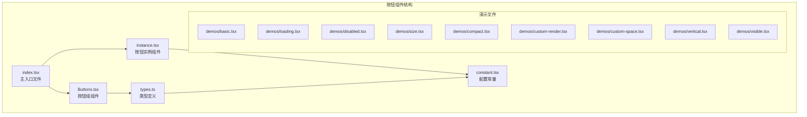
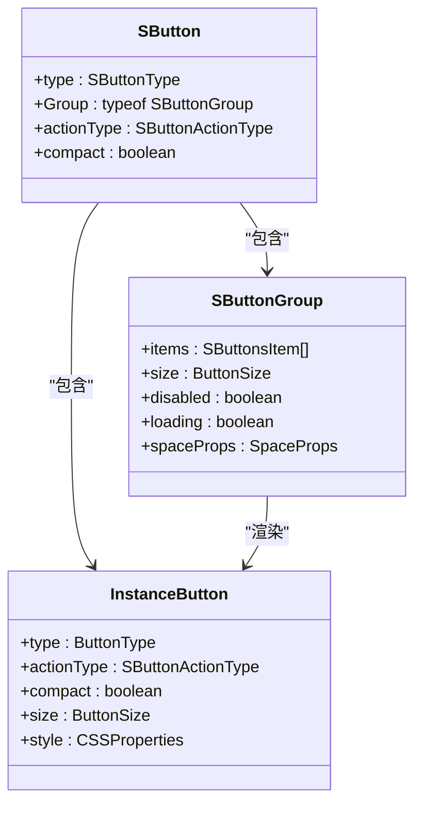
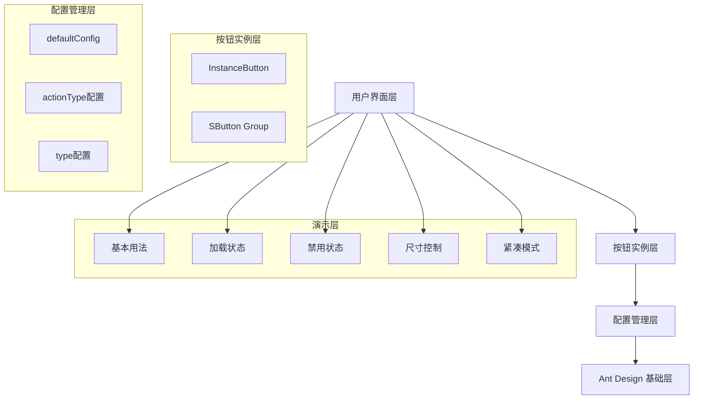
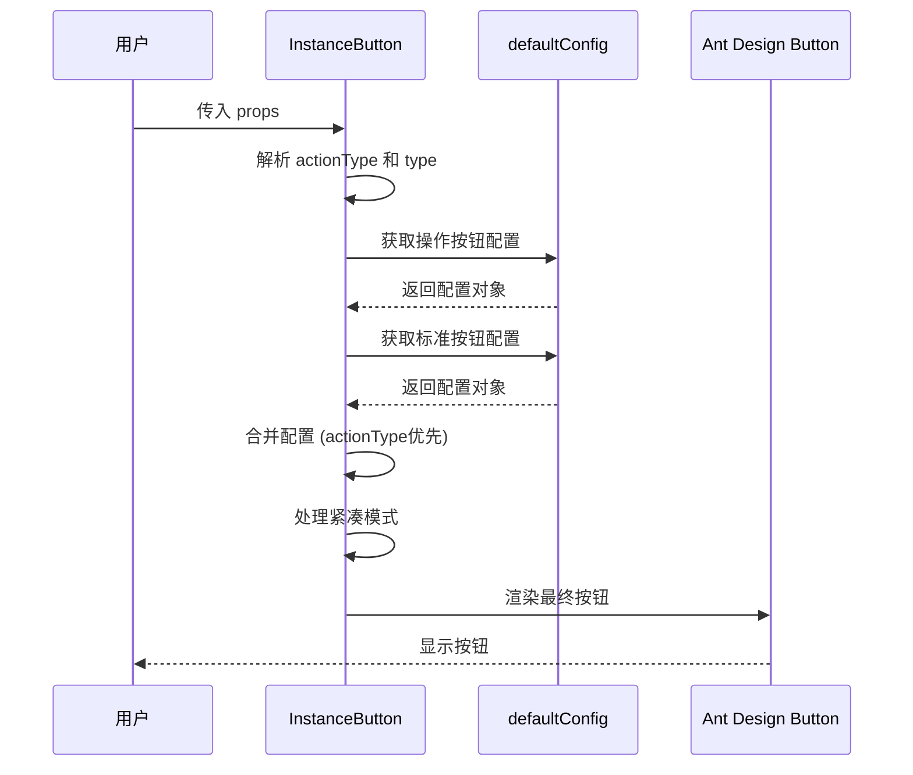
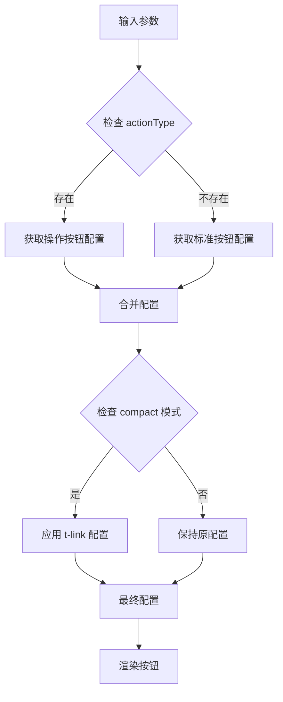
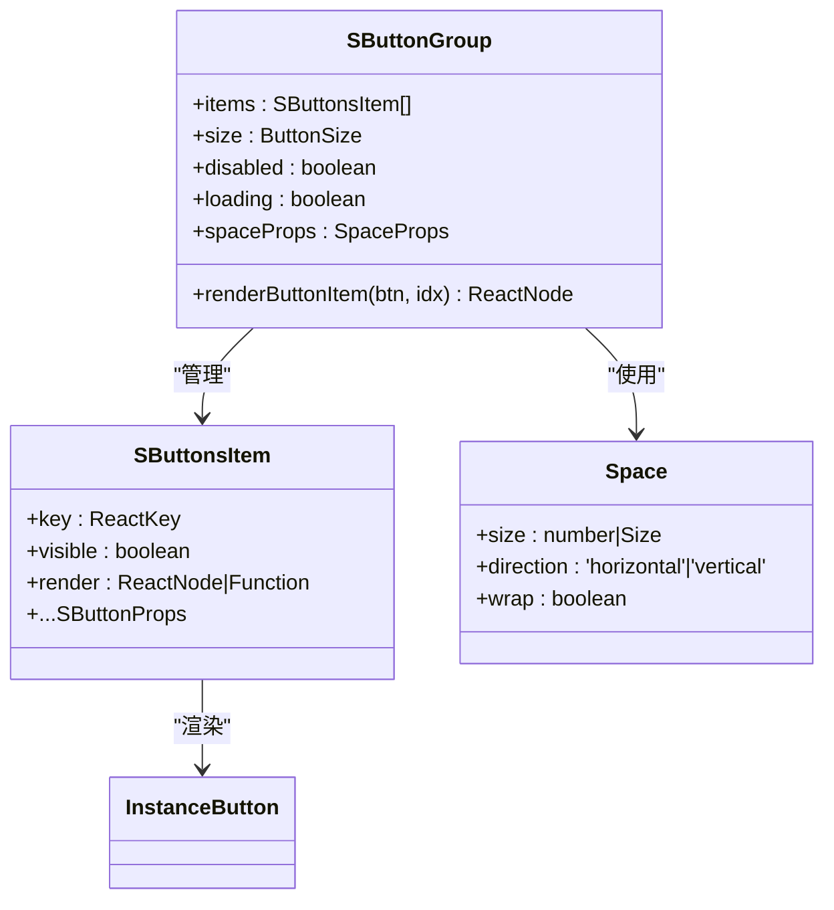
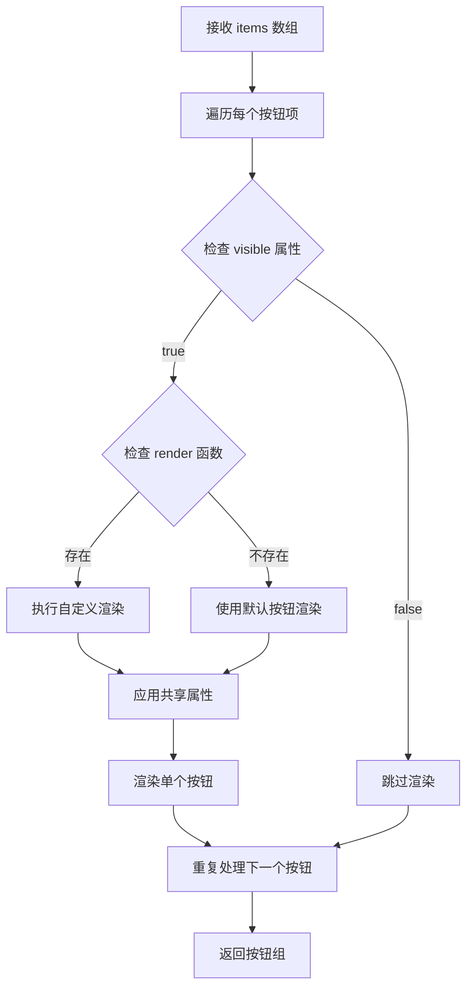
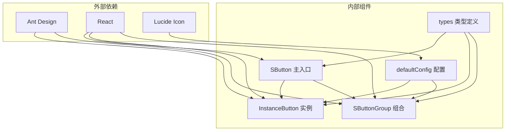

# 按钮演示

<cite>
**本文档引用的文件**
- [src/components/button/index.tsx](file://src/components/button/index.tsx)
- [src/components/button/Buttons.tsx](file://src/components/button/Buttons.tsx)
- [src/components/button/instance.tsx](file://src/components/button/instance.tsx)
- [src/components/button/types.ts](file://src/components/button/types.ts)
- [src/components/button/constant.tsx](file://src/components/button/constant.tsx)
- [src/components/button/demos/basic.tsx](file://src/components/button/demos/basic.tsx)
- [src/components/button/demos/loading.tsx](file://src/components/button/demos/loading.tsx)
- [src/components/button/demos/disabled.tsx](file://src/components/button/demos/disabled.tsx)
- [src/components/button/demos/size.tsx](file://src/components/button/demos/size.tsx)
- [src/components/button/demos/compact.tsx](file://src/components/button/demos/compact.tsx)
- [src/components/button/demos/custom-render.tsx](file://src/components/button/demos/custom-render.tsx)
- [src/components/button/demos/custom-space.tsx](file://src/components/button/demos/custom-space.tsx)
- [src/components/button/demos/vertical.tsx](file://src/components/button/demos/vertical.tsx)
- [src/components/button/demos/visible.tsx](file://src/components/button/demos/visible.tsx)
</cite>

## 目录

1. [简介](#简介)
2. [项目结构](#项目结构)
3. [核心组件](#核心组件)
4. [架构概览](#架构概览)
5. [详细组件分析](#详细组件分析)
6. [依赖关系分析](#依赖关系分析)
7. [性能考虑](#性能考虑)
8. [故障排除指南](#故障排除指南)
9. [结论](#结论)

## 简介

SButton 是一个基于 Ant Design Button 的增强型按钮组件，提供了丰富的操作按钮类型、紧凑模式、加载状态管理等功能。该组件通过统一的配置系统，为常见的业务场景提供了一键式的按钮解决方案。

## 项目结构

按钮组件位于 `src/components/button/` 目录下，采用模块化设计，包含核心组件、演示文件和配置常量：

**图表来源**

- [src/components/button/index.tsx](file://src/components/button/index.tsx#L1-L15)
- [src/components/button/instance.tsx](file://src/components/button/instance.tsx#L1-L39)
- [src/components/button/Buttons.tsx](file://src/components/button/Buttons.tsx#L1-L48)

**章节来源**

- [src/components/button/index.tsx](file://src/components/button/index.tsx#L1-L15)
- [src/components/button/instance.tsx](file://src/components/button/instance.tsx#L1-L39)
- [src/components/button/Buttons.tsx](file://src/components/button/Buttons.tsx#L1-L48)

## 核心组件

### 主入口组件 (SButton)

主入口组件通过组合按钮实例和按钮组组件，提供统一的 API 接口：

**图表来源**

- [src/components/button/index.tsx](file://src/components/button/index.tsx#L6-L14)
- [src/components/button/Buttons.tsx](file://src/components/button/Buttons.tsx#L7-L45)
- [src/components/button/instance.tsx](file://src/components/button/instance.tsx#L7-L36)

### 按钮类型系统

组件支持两种主要的按钮类型系统：

1. **操作按钮类型**：针对常见业务场景的预设配置
2. **标准按钮类型**：基于 Ant Design 的原生按钮类型

**章节来源**

- [src/components/button/types.ts](file://src/components/button/types.ts#L7-L30)
- [src/components/button/types.ts](file://src/components/button/types.ts#L52-L59)

## 架构概览

按钮组件采用分层架构设计，从底层到上层依次为：

**图表来源**

- [src/components/button/instance.tsx](file://src/components/button/instance.tsx#L14-L24)
- [src/components/button/constant.tsx](file://src/components/button/constant.tsx#L29-L148)
- [src/components/button/Buttons.tsx](file://src/components/button/Buttons.tsx#L14-L38)

## 详细组件分析

### 按钮实例组件 (InstanceButton)

InstanceButton 是按钮的核心实现，负责处理配置合并和样式应用：

**图表来源**

- [src/components/button/instance.tsx](file://src/components/button/instance.tsx#L14-L35)

#### 配置合并逻辑

按钮组件实现了灵活的配置合并机制：

**图表来源**

- [src/components/button/instance.tsx](file://src/components/button/instance.tsx#L14-L24)

**章节来源**

- [src/components/button/instance.tsx](file://src/components/button/instance.tsx#L1-L39)

### 按钮组组件 (SButtonGroup)

SButtonGroup 提供了批量按钮管理和布局控制功能：

**图表来源**

- [src/components/button/Buttons.tsx](file://src/components/button/Buttons.tsx#L7-L45)
- [src/components/button/types.ts](file://src/components/button/types.ts#L61-L65)

#### 按钮渲染流程

按钮组组件实现了智能的按钮渲染逻辑：

**图表来源**

- [src/components/button/Buttons.tsx](file://src/components/button/Buttons.tsx#L14-L38)

**章节来源**

- [src/components/button/Buttons.tsx](file://src/components/button/Buttons.tsx#L1-L48)

### 配置常量系统

defaultConfig 提供了完整的按钮配置管理系统：

| 按钮类型   | 颜色方案 | 图标         | 文本   |
| ---------- | -------- | ------------ | ------ |
| `save`     | primary  | Save         | 保存   |
| `cancel`   | default  | CircleX      | 取消   |
| `reset`    | primary  | RotateCcw    | 重置   |
| `upload`   | primary  | Upload       | 上传   |
| `download` | primary  | Download     | 下载   |
| `export`   | primary  | FolderOutput | 导出   |
| `import`   | primary  | Import       | 导入   |
| `delete`   | default  | Trash        | 删除   |
| `create`   | primary  | PlusCircle   | 创建   |
| `edit`     | primary  | Edit         | 编辑   |
| `next`     | primary  | ArrowRight   | 下一页 |
| `previous` | primary  | ArrowLeft    | 上一页 |
| `finish`   | primary  | CheckCircle  | 完成   |
| `back`     | primary  | ArrowLeft    | 返回   |
| `confirm`  | primary  | Check        | 确认   |
| `close`    | default  | X            | 关闭   |
| `view`     | primary  | Eye          | 查看   |
| `refresh`  | primary  | RefreshCw    | 刷新   |
| `search`   | primary  | Search       | 查询   |

**章节来源**

- [src/components/button/constant.tsx](file://src/components/button/constant.tsx#L29-L148)

## 依赖关系分析

### 组件间依赖关系

**图表来源**

- [src/components/button/index.tsx](file://src/components/button/index.tsx#L1-L2)
- [src/components/button/instance.tsx](file://src/components/button/instance.tsx#L1-L5)
- [src/components/button/Buttons.tsx](file://src/components/button/Buttons.tsx#L1-L5)

### 性能优化策略

组件采用了多项性能优化措施：

1. **memo 包装**：对所有组件使用 React.memo 防止不必要的重渲染
2. **useCallback 缓存**：缓存渲染函数避免函数重新创建
3. **useMemo 合并**：合并样式对象避免重复计算
4. **图标记忆化**：使用 memo 包装图标组件

**章节来源**

- [src/components/button/Buttons.tsx](file://src/components/button/Buttons.tsx#L47-L47)
- [src/components/button/instance.tsx](file://src/components/button/instance.tsx#L38-L38)
- [src/components/button/constant.tsx](file://src/components/button/constant.tsx#L8-L26)

## 性能考虑

### 渲染性能优化

按钮组件在设计时充分考虑了性能因素：

- **浅比较优化**：使用 React.memo 进行浅比较，避免不必要的重渲染
- **回调函数缓存**：通过 useCallback 缓存渲染函数，减少函数创建开销
- **样式合并优化**：使用 useMemo 合并样式对象，避免重复的样式计算
- **图标懒加载**：图标组件使用 memo 包装，避免每次渲染都创建新元素

### 内存使用优化

- **配置对象复用**：defaultConfig 中的配置对象在组件初始化时创建并复用
- **事件处理器优化**：按钮组中的渲染函数只在必要的 props 变化时重新创建

## 故障排除指南

### 常见问题及解决方案

#### 1. 按钮样式异常

**问题描述**：按钮样式不符合预期或被覆盖

**可能原因**：

- 自定义样式与默认样式冲突
- 紧凑模式样式叠加问题

**解决方案**：

- 检查自定义样式优先级
- 避免直接修改 t-link 样式配置

#### 2. 按钮组布局问题

**问题描述**：按钮组中的按钮排列不符合预期

**可能原因**：

- Space 组件的 direction 属性设置错误
- 按钮可见性控制导致布局错乱

**解决方案**：

- 检查 spaceProps 配置
- 确认 visible 属性设置

#### 3. 图标显示问题

**问题描述**：按钮图标不显示或显示异常

**可能原因**：

- LucideIcon 组件未正确引入
- 图标名称拼写错误

**解决方案**：

- 确认图标名称在配置中存在
- 检查 LucideIcon 组件的可用性

**章节来源**

- [src/components/button/constant.tsx](file://src/components/button/constant.tsx#L8-L26)
- [src/components/button/Buttons.tsx](file://src/components/button/Buttons.tsx#L40-L44)

## 结论

SButton 按钮组件通过精心设计的架构和丰富的功能特性，为开发者提供了一个强大而易用的按钮解决方案。其核心优势包括：

1. **统一的配置系统**：通过 defaultConfig 提供了一致的按钮行为和外观
2. **灵活的扩展机制**：支持自定义渲染和属性覆盖
3. **优秀的性能表现**：通过多种优化技术确保组件高效运行
4. **完善的演示文档**：提供了全面的使用示例和最佳实践

该组件特别适合需要大量标准化按钮的业务场景，能够显著提高开发效率并保持界面的一致性。
