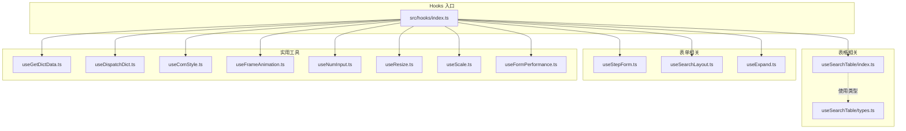
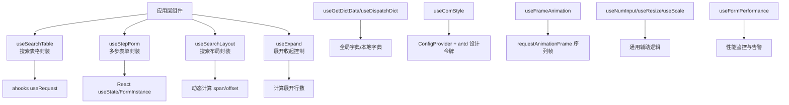
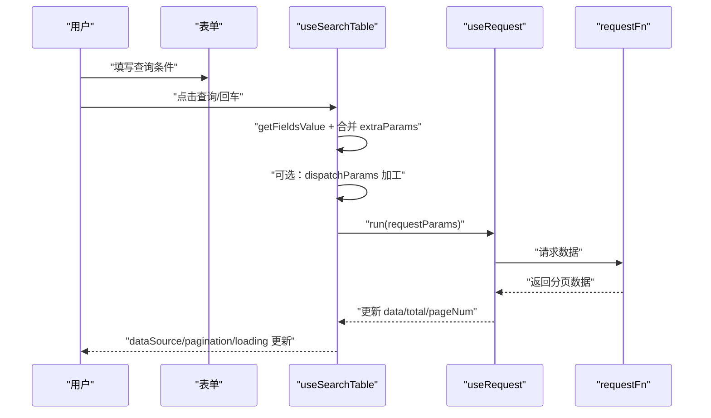
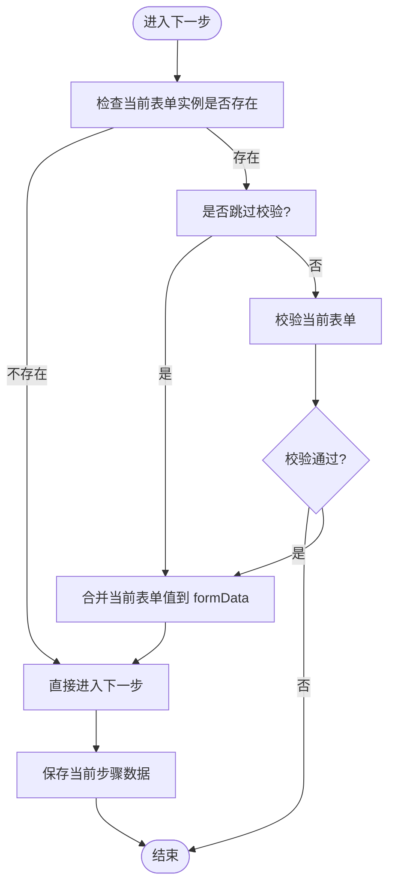
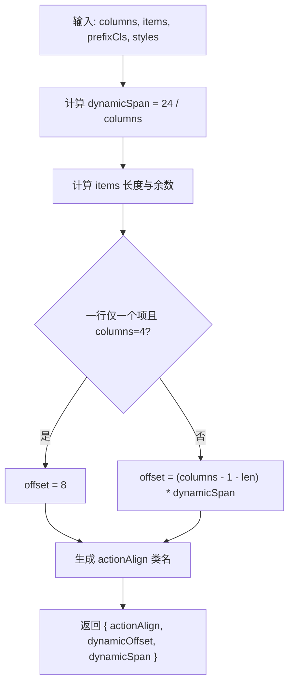
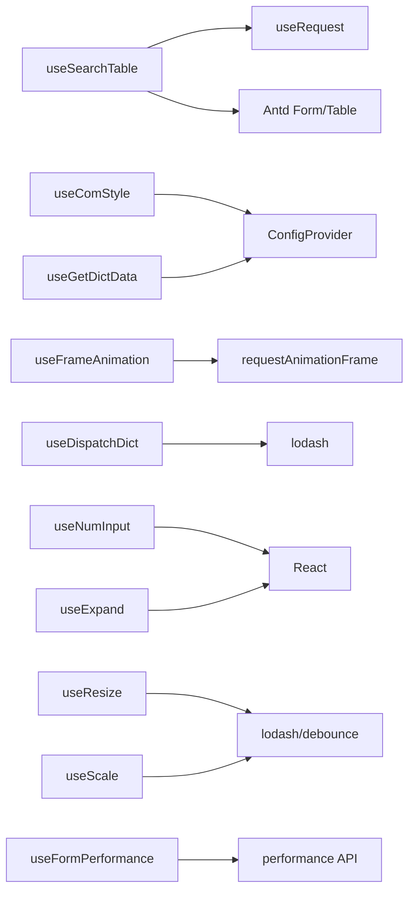

# Hooks 系统

<cite>
**本文引用的文件**
- [src/hooks/index.ts](file://src/hooks/index.ts)
- [src/hooks/useSearchTable/index.ts](file://src/hooks/useSearchTable/index.ts)
- [src/hooks/useSearchTable/types.ts](file://src/hooks/useSearchTable/types.ts)
- [src/hooks/useStepForm.ts](file://src/hooks/useStepForm.ts)
- [src/hooks/useSearchLayout.ts](file://src/hooks/useSearchLayout.ts)
- [src/hooks/useGetDictData.ts](file://src/hooks/useGetDictData.ts)
- [src/hooks/useComStyle.ts](file://src/hooks/useComStyle.ts)
- [src/hooks/useFrameAnimation.ts](file://src/hooks/useFrameAnimation.ts)
- [src/hooks/useDispatchDict.ts](file://src/hooks/useDispatchDict.ts)
- [src/hooks/useExpand.ts](file://src/hooks/useExpand.ts)
- [src/hooks/useNumInput.ts](file://src/hooks/useNumInput.ts)
- [src/hooks/useResize.ts](file://src/hooks/useResize.ts)
- [src/hooks/useScale.ts](file://src/hooks/useScale.ts)
- [src/hooks/useFormPerformance.ts](file://src/hooks/useFormPerformance.ts)
</cite>

## 更新摘要

**所做更改**

- 新增 useComStyle、useDispatchDict、useExpand 等 Hook 的详细类型定义说明
- 完善了 Hook 列表与类型定义章节，补充了完整的 TypeScript 类型接口
- 更新了核心组件概览，增加了新 Hook 的功能描述
- 增强了依赖关系分析，反映了新增 Hook 的依赖关系
- 完善了故障排查指南，增加了新 Hook 的问题排查要点

## 目录

1. [简介](#简介)
2. [项目结构](#项目结构)
3. [核心组件](#核心组件)
4. [架构总览](#架构总览)
5. [详细组件分析](#详细组件分析)
6. [依赖关系分析](#依赖关系分析)
7. [性能考量](#性能考量)
8. [故障排查指南](#故障排查指南)
9. [结论](#结论)
10. [附录](#附录)

## 简介

本文件系统性梳理 SDesign Hooks 系统的设计理念与实现细节，覆盖状态管理、生命周期处理与业务逻辑封装三大主题。重点围绕以下 Hooks 进行深入解析：

- 表格类：useSearchTable
- 表单类：useStepForm、useSearchLayout
- 实用工具类：useGetDictData、useComStyle、useFrameAnimation、useDispatchDict、useExpand、useNumInput、useResize、useScale、useFormPerformance

文档同时提供组合使用最佳实践、常见问题与性能优化建议，帮助开发者在复杂业务场景中高效、稳定地落地。

## 项目结构

SDesign Hooks 按功能域组织，集中于 src/hooks 目录，采用"按功能分文件"的方式组织代码，便于维护与复用。入口导出统一由 src/hooks/index.ts 提供，便于按需引入与 Tree Shaking。

**图表来源**

- [src/hooks/index.ts:1-25](file://src/hooks/index.ts#L1-L25)
- [src/hooks/useSearchTable/index.ts:1-193](file://src/hooks/useSearchTable/index.ts#L1-L193)
- [src/hooks/useSearchTable/types.ts:1-117](file://src/hooks/useSearchTable/types.ts#L1-L117)
- [src/hooks/useStepForm.ts:1-56](file://src/hooks/useStepForm.ts#L1-L56)
- [src/hooks/useSearchLayout.ts:1-53](file://src/hooks/useSearchLayout.ts#L1-L53)
- [src/hooks/useGetDictData.ts:1-28](file://src/hooks/useGetDictData.ts#L1-L28)
- [src/hooks/useDispatchDict.ts:1-99](file://src/hooks/useDispatchDict.ts#L1-L99)
- [src/hooks/useComStyle.ts:1-29](file://src/hooks/useComStyle.ts#L1-L29)
- [src/hooks/useFrameAnimation.ts:1-125](file://src/hooks/useFrameAnimation.ts#L1-L125)
- [src/hooks/useExpand.ts:1-46](file://src/hooks/useExpand.ts#L1-L46)
- [src/hooks/useNumInput.ts:1-23](file://src/hooks/useNumInput.ts#L1-L23)
- [src/hooks/useResize.ts:1-37](file://src/hooks/useResize.ts#L1-L37)
- [src/hooks/useScale.ts:1-43](file://src/hooks/useScale.ts#L1-L43)
- [src/hooks/useFormPerformance.ts:1-35](file://src/hooks/useFormPerformance.ts#L1-L35)

**章节来源**

- [src/hooks/index.ts:1-25](file://src/hooks/index.ts#L1-L25)

## 核心组件

本节对关键 Hooks 的职责、参数、返回值与典型使用场景进行概览式说明，并给出组合使用建议。

- useSearchTable：面向搜索型表格的数据加载与分页控制，内置表单联动、参数派发与初始化请求逻辑。
- useStepForm：多步骤表单的状态与流程控制，支持校验、数据合并与步骤切换。
- useSearchLayout：动态计算表单项跨度与操作按钮偏移，适配不同列数布局。
- useGetDictData：从全局字典或本地字典中获取键值映射，用于下拉、标签等展示。
- useDispatchDict：将字典对象转换为可直接用于选择器的 options，并支持禁用项控制。
- useComStyle：结合 ConfigProvider 与 antd 设计令牌，生成组件样式钩子所需的前缀与类名。
- useFrameAnimation：基于 requestAnimationFrame 的序列帧动画控制，支持水平/垂直方向与帧率配置。
- useExpand：根据列数与表单项数量决定是否显示展开/收起按钮，并控制初始展开行数。
- useNumInput：数字输入规范化，去除前置零与非数字字符，保持纯数字字符串。
- useResize/useScale：窗口宽度监听与缩放策略，用于大屏适配与布局缩放。
- useFormPerformance：表单性能监控，记录渲染时间和表单项数量警告。

**章节来源**

- [src/hooks/useSearchTable/index.ts:1-193](file://src/hooks/useSearchTable/index.ts#L1-L193)
- [src/hooks/useStepForm.ts:1-56](file://src/hooks/useStepForm.ts#L1-L56)
- [src/hooks/useSearchLayout.ts:1-53](file://src/hooks/useSearchLayout.ts#L1-L53)
- [src/hooks/useGetDictData.ts:1-28](file://src/hooks/useGetDictData.ts#L1-L28)
- [src/hooks/useDispatchDict.ts:1-99](file://src/hooks/useDispatchDict.ts#L1-L99)
- [src/hooks/useComStyle.ts:1-29](file://src/hooks/useComStyle.ts#L1-L29)
- [src/hooks/useFrameAnimation.ts:1-125](file://src/hooks/useFrameAnimation.ts#L1-L125)
- [src/hooks/useExpand.ts:1-46](file://src/hooks/useExpand.ts#L1-L46)
- [src/hooks/useNumInput.ts:1-23](file://src/hooks/useNumInput.ts#L1-L23)
- [src/hooks/useResize.ts:1-37](file://src/hooks/useResize.ts#L1-L37)
- [src/hooks/useScale.ts:1-43](file://src/hooks/useScale.ts#L1-L43)
- [src/hooks/useFormPerformance.ts:1-35](file://src/hooks/useFormPerformance.ts#L1-L35)

## 架构总览

SDesign Hooks 以"轻封装、强复用"为核心设计原则，通过以下方式实现：

- 统一依赖：优先复用 ahooks、Ant Design 类型与组件生态，降低学习成本与迁移成本。
- 参数与数据流：通过显式的 options/props 与 useMemoizedFn/回调包装，确保参数转换与副作用可控。
- 可插拔：各 Hooks 独立导出，按需引入；类型定义清晰，便于 IDE 提示与 TS 校验。
- 扩展点：提供 transformRequestParams、transformResponseData、dispatchParams 等扩展点，满足多样化的业务适配需求。

**图表来源**

- [src/hooks/useSearchTable/index.ts:1-193](file://src/hooks/useSearchTable/index.ts#L1-L193)
- [src/hooks/useStepForm.ts:1-56](file://src/hooks/useStepForm.ts#L1-L56)
- [src/hooks/useSearchLayout.ts:1-53](file://src/hooks/useSearchLayout.ts#L1-L53)
- [src/hooks/useExpand.ts:1-46](file://src/hooks/useExpand.ts#L1-L46)
- [src/hooks/useGetDictData.ts:1-28](file://src/hooks/useGetDictData.ts#L1-L28)
- [src/hooks/useDispatchDict.ts:1-99](file://src/hooks/useDispatchDict.ts#L1-L99)
- [src/hooks/useComStyle.ts:1-29](file://src/hooks/useComStyle.ts#L1-L29)
- [src/hooks/useFrameAnimation.ts:1-125](file://src/hooks/useFrameAnimation.ts#L1-L125)
- [src/hooks/useNumInput.ts:1-23](file://src/hooks/useNumInput.ts#L1-L23)
- [src/hooks/useResize.ts:1-37](file://src/hooks/useResize.ts#L1-L37)
- [src/hooks/useScale.ts:1-43](file://src/hooks/useScale.ts#L1-L43)
- [src/hooks/useFormPerformance.ts:1-35](file://src/hooks/useFormPerformance.ts#L1-L35)

## 详细组件分析

### useSearchTable：搜索型表格数据加载

- 设计理念
  - 将表单联动、分页控制与请求发起解耦，提供统一的 getPageData、handleReset、dataSource、pagination、loading。
  - 支持手动/自动初始化、额外参数注入与参数派发器 dispatchParams。
- 关键参数
  - requestFn：请求函数。
  - form：Antd FormInstance，用于读取表单值与重置。
  - extraParams：额外固定参数。
  - manual：是否手动触发首次请求。
  - dispatchParams：参数派发器，允许对请求参数进行二次加工。
  - serviceProps：传递给 useRequest 的选项（如 ready）。
  - paginationFields：分页字段映射配置，支持 current/pageSize/total/list 自定义。
  - transformRequestParams：请求参数转换函数。
  - transformResponseData：响应数据转换函数。
- 返回值
  - getPageData(params?)：触发请求，支持传入分页参数。
  - handleReset()：重置表单并重新请求。
  - dataSource：表格数据源。
  - pagination：分页配置（含 onChange）。
  - loading：请求状态。
  - error：错误信息。
  - tableProps：整合的 table props，包含 dataSource、pagination、loading。
  - form：表单实例，用于外部组件挂载。
  - formConfig：专门为 SForm.Search 设计的配置对象。
- 使用场景
  - 搜索表单 + 列表展示，需要分页、重置、初始化请求控制。
- 交互流程（序列图）

**图表来源**

- [src/hooks/useSearchTable/index.ts:83-116](file://src/hooks/useSearchTable/index.ts#L83-L116)

**章节来源**

- [src/hooks/useSearchTable/index.ts:1-193](file://src/hooks/useSearchTable/index.ts#L1-L193)
- [src/hooks/useSearchTable/types.ts:1-117](file://src/hooks/useSearchTable/types.ts#L1-L117)

### useStepForm：多步骤表单流程控制

- 设计理念
  - 通过 useState 维护当前步骤与合并后的表单数据，提供下一步/上一步的异步流程控制。
  - 支持在下一步前进行表单校验，避免无效数据进入下一步。
- 关键参数
  - formInstanceList：每一步的 FormInstance 数组。
  - dispatchDetailData：可选的数据派发器，用于将当前步骤数据转换为最终提交形态。
- 返回值
  - formData：累计的表单数据。
  - setFormData：设置数据。
  - current：当前步骤索引。
  - handleNext(param?)：下一步，可选跳过校验。
  - handlePrevious()：上一步。
- 使用场景
  - 用户注册、订单下单、审批流程等多步骤场景。
- 流程图（算法）

**图表来源**

- [src/hooks/useStepForm.ts:14-37](file://src/hooks/useStepForm.ts#L14-L37)

**章节来源**

- [src/hooks/useStepForm.ts:1-56](file://src/hooks/useStepForm.ts#L1-L56)

### useSearchLayout：搜索表单布局计算

- 设计理念
  - 根据列数与表单项数量动态计算 span 与 offset，保证操作按钮对齐与布局美观。
- 关键参数
  - columns：每行列数。
  - items：表单项数组。
  - prefixCls：组件前缀，用于生成样式类名。
  - styles：可选样式映射。
- 返回值
  - actionAlign：操作按钮对齐类名。
  - dynamicSpan：动态跨度。
  - dynamicOffset：动态偏移。
- 使用场景
  - 搜索表单在不同列数下的自适应布局。
- 流程图（算法）

**图表来源**

- [src/hooks/useSearchLayout.ts:17-37](file://src/hooks/useSearchLayout.ts#L17-L37)

**章节来源**

- [src/hooks/useSearchLayout.ts:1-53](file://src/hooks/useSearchLayout.ts#L1-L53)

### 字典相关 Hooks：useGetDictData 与 useDispatchDict

- useGetDictData
  - 从全局字典或本地字典中获取映射，优先级：本地 dict > 全局字典键值 > 空对象。
  - 返回值：dictData。
- useDispatchDict
  - 将字典对象转换为 Antd 选择器可用的 options，支持禁用键（字符串或数组）。
  - 返回值：dOptions。
- 使用场景
  - 下拉选择、标签展示、枚举值渲染等。

**章节来源**

- [src/hooks/useGetDictData.ts:1-28](file://src/hooks/useGetDictData.ts#L1-L28)
- [src/hooks/useDispatchDict.ts:1-99](file://src/hooks/useDispatchDict.ts#L1-L99)

### useComStyle：组件样式钩子集成

- 设计理念
  - 结合 ConfigProvider 的 getPrefixCls 与 antd 设计令牌，生成样式钩子所需的前缀与类名。
- 类型定义
  - useComStyleProps：包含 prefixCls（组件前缀）和 useStylesHook（样式钩子函数）两个必需属性。
- 返回值
  - styles、cx、prefixCls、token。
- 使用场景
  - 与按需生成样式的样式钩子配合，确保组件命名空间与主题一致。

**章节来源**

- [src/hooks/useComStyle.ts:1-29](file://src/hooks/useComStyle.ts#L1-L29)

### useFrameAnimation：序列帧动画

- 设计理念
  - 基于 requestAnimationFrame 与背景定位实现序列帧动画，支持水平/垂直方向与帧率控制。
- 类型定义
  - UseFrameAnimationProps：包含 ref（DOM 引用）、imgNumber（总帧数）、direction（动画方向）和 frameNumber（帧率）四个属性。
- 关键参数
  - ref：目标元素引用。
  - imgNumber：总帧数。
  - direction：绘制方向（horizontal/vertical）。
  - frameNumber：每秒帧数。
- 返回值
  - setType：设置动画类型（in/out），用于启动/停止绘制。
- 使用场景
  - 图片序列动画、进度反馈、动效引导等。

**章节来源**

- [src/hooks/useFrameAnimation.ts:1-125](file://src/hooks/useFrameAnimation.ts#L1-L125)

### useExpand：表单项展开/收起

- 设计理念
  - 根据列数与表单项数量决定是否显示展开/收起按钮，并控制初始展开行数。
- 类型定义
  - useExpandProps：包含 columns（列数）、items（表单项数组）、showExpand（显示开关）和 defaultExpand（默认展开状态）四个属性。
- 关键参数
  - columns：每行列数。
  - items：表单项数组。
  - showExpand：外部控制是否展示展开按钮。
  - defaultExpand：默认展开状态。
- 返回值
  - showCollapse、expandNum、collapse、setCollapse。
- 使用场景
  - 表单项较多时的折叠展示与快速展开。

**章节来源**

- [src/hooks/useExpand.ts:1-46](file://src/hooks/useExpand.ts#L1-L46)

### useNumInput：数字输入规范化

- 设计理念
  - 输入时仅保留数字，去除前置零，保持纯数字字符串。
- 返回值
  - [value, onChange]。
- 使用场景
  - 手机号、验证码、编号等纯数字输入。

**章节来源**

- [src/hooks/useNumInput.ts:1-23](file://src/hooks/useNumInput.ts#L1-L23)

### useResize/useScale：窗口尺寸与缩放

- 设计理念
  - 监听窗口 resize，防抖更新宽度；提供 scale 与 transform 缩放策略，便于大屏适配。
- 返回值
  - useResize：{ width }。
  - useScale：{ isScaleScreen, scale }。
- 使用场景
  - 大屏看板、自适应布局、缩放容器。

**章节来源**

- [src/hooks/useResize.ts:1-37](file://src/hooks/useResize.ts#L1-L37)
- [src/hooks/useScale.ts:1-43](file://src/hooks/useScale.ts#L1-L43)

### useFormPerformance：表单性能监控

- 设计理念
  - 监控表单渲染性能，在组件卸载时记录渲染时间并发出警告。
  - 记录表单项数量，超过阈值时给出虚拟化建议。
- 关键参数
  - formName：表单名称，用于日志标识。
- 返回值
  - logItemCount：记录表单项数量的函数。
- 使用场景
  - 大型表单的性能优化与监控。

**章节来源**

- [src/hooks/useFormPerformance.ts:1-35](file://src/hooks/useFormPerformance.ts#L1-L35)

## 依赖关系分析

- 内部依赖
  - useSearchTable 依赖 ahooks 的 useRequest、Antd FormInstance 与 TablePaginationConfig。
  - useComStyle 依赖 ConfigProvider 与 antd theme。
  - useFrameAnimation 依赖浏览器 DOM 与 requestAnimationFrame。
  - useFormPerformance 依赖浏览器 performance API。
  - useExpand 依赖 React 的 useState 与 useMemo。
  - useDispatchDict 依赖 lodash 工具函数。
- 外部依赖
  - lodash：keys、isArray、isString、debounce、isBoolean 等工具函数。
  - antd：Form、Table、Typography 等组件与类型。
  - react：useState、useEffect、useMemo、useCallback、useRef 等 Hook。
- 耦合与内聚
  - 各 Hooks 职责单一、内聚度高，通过类型接口与最小化参数耦合，便于组合使用。
  - 对外暴露清晰的返回值与回调，降低对上层组件的侵入。

**图表来源**

- [src/hooks/useSearchTable/index.ts:1-3](file://src/hooks/useSearchTable/index.ts#L1-L3)
- [src/hooks/useComStyle.ts:1-4](file://src/hooks/useComStyle.ts#L1-L4)
- [src/hooks/useFrameAnimation.ts:1-1](file://src/hooks/useFrameAnimation.ts#L1-L1)
- [src/hooks/useGetDictData.ts:1-4](file://src/hooks/useGetDictData.ts#L1-L4)
- [src/hooks/useDispatchDict.ts:1-6](file://src/hooks/useDispatchDict.ts#L1-L6)
- [src/hooks/useResize.ts:1-2](file://src/hooks/useResize.ts#L1-L2)
- [src/hooks/useScale.ts:1-2](file://src/hooks/useScale.ts#L1-L2)
- [src/hooks/useFormPerformance.ts:1-1](file://src/hooks/useFormPerformance.ts#L1-L1)
- [src/hooks/useExpand.ts:1-1](file://src/hooks/useExpand.ts#L1-L1)

## 性能考量

- 防抖与节流
  - useResize/useScale 使用 lodash.debounce 防抖窗口变化事件，降低频繁重排与重绘开销。
- 回调稳定化
  - useSearchTable 的 getPageData/handleReset 通过 useCallback 包裹，减少闭包重建。
  - useSearchTable 通过 useMemo 计算 dataSource 与 pagination，避免无意义的渲染。
- 渲染优化
  - useSearchTable 通过 useMemo 计算 dataSource 与 pagination，避免无意义的渲染。
  - useExpand 通过 useMemo 计算 expandNum，减少不必要的计算。
  - useFormPerformance 通过 useRef 记录渲染时间，避免重复计算。
- 动画性能
  - useFrameAnimation 使用 requestAnimationFrame 并在组件卸载时取消动画，避免内存泄漏与多余绘制。
- 数据转换
  - useSearchTable 在 transformRequestParams/transformResponseData 仅在提供时执行，避免空操作带来的性能损耗。
- 类型安全
  - 新增的 Hook 都具有完整的 TypeScript 类型定义，提供编译时类型检查，减少运行时错误。
- 建议
  - 合理设置 useFrameAnimation 的 frameNumber，避免过高帧率导致 CPU 占用。
  - 在高频输入场景（如搜索）结合 useSearchTable 的 manual 与防抖策略，减少请求频率。
  - 对字典数据进行缓存与本地化，避免重复计算与全局查找。
  - 使用 useFormPerformance 监控大型表单的渲染性能，必要时考虑虚拟化方案。

## 故障排查指南

- useSearchTable 请求未触发
  - 确认 manual=false 或在组件挂载后主动调用 getPageData。
  - 检查 serviceProps.ready 条件是否满足。
  - 验证分页字段映射配置是否正确。
- useStepForm 校验失败
  - 确认当前表单实例存在，handleNext 默认会进行校验；如需跳过校验，请传入参数。
- useFrameAnimation 无动画
  - 检查 ref 是否指向真实 DOM，imgNumber 是否大于 0，direction 与 frameNumber 是否合理。
- useComStyle 样式类名异常
  - 确认 ConfigProvider 已正确提供 getPrefixCls，且 useStylesHook 接受的 prefixCls 与之对应。
- useExpand 按钮不显示
  - 确认 items.length 大于 columns 且 showExpand 为 true。
- useDispatchDict 选项不正确
  - 检查 dict 参数格式是否正确，disableKeys 格式是否符合要求（字符串或数组）。
- useGetDictData 数据为空
  - 检查 dictKey 是否存在于全局字典，或本地 dict 是否提供有效映射。
- useFormPerformance 性能告警
  - 检查渲染时间是否超过 16ms，表单项数量是否超过 50 个。
  - 考虑使用虚拟化或懒加载优化大型表单。

**章节来源**

- [src/hooks/useSearchTable/index.ts:119-128](file://src/hooks/useSearchTable/index.ts#L119-L128)
- [src/hooks/useStepForm.ts:14-37](file://src/hooks/useStepForm.ts#L14-L37)
- [src/hooks/useFrameAnimation.ts:56-92](file://src/hooks/useFrameAnimation.ts#L56-L92)
- [src/hooks/useComStyle.ts:12-26](file://src/hooks/useComStyle.ts#L12-L26)
- [src/hooks/useExpand.ts:25-31](file://src/hooks/useExpand.ts#L25-L31)
- [src/hooks/useDispatchDict.ts:32-42](file://src/hooks/useDispatchDict.ts#L32-L42)
- [src/hooks/useGetDictData.ts:11-25](file://src/hooks/useGetDictData.ts#L11-L25)
- [src/hooks/useFormPerformance.ts:13-30](file://src/hooks/useFormPerformance.ts#L13-L30)

## 结论

SDesign Hooks 通过"轻封装、强复用"的设计，将表格、表单、字典、样式与动画等常见业务场景抽象为可组合的 Hooks，显著降低了样板代码与心智负担。借助清晰的类型定义、稳定的回调与合理的性能优化策略，开发者可以在复杂业务中快速构建高质量界面与交互。

## 附录

- 组合使用建议
  - 表格搜索：useSearchTable + useSearchLayout，先完成搜索布局再接入数据加载。
  - 多步表单：useStepForm + useSearchTable（在最后一步汇总数据并请求），注意校验与数据合并时机。
  - 字典渲染：useGetDictData + useDispatchDict，统一枚举展示与禁用控制。
  - 动效与主题：useFrameAnimation + useComStyle，确保动画与主题一致。
  - 表单展开：useExpand + useSearchLayout，优化表单项较多时的展示效果。
  - 性能监控：useFormPerformance + 大型表单优化策略，持续监控与改进。
- 最佳实践
  - 将参数转换与数据转换集中在 transformRequestParams/transformResponseData/dispatchParams 中，便于统一治理。
  - 对高频交互使用 useMemo/useCallback 包裹，避免闭包与对象重建。
  - 在组件卸载时及时清理定时器、动画与事件监听，防止内存泄漏。
  - 使用 useFormPerformance 监控关键组件的性能表现，及时发现性能瓶颈。
  - 充分利用 TypeScript 类型定义，提高代码质量和开发体验。
