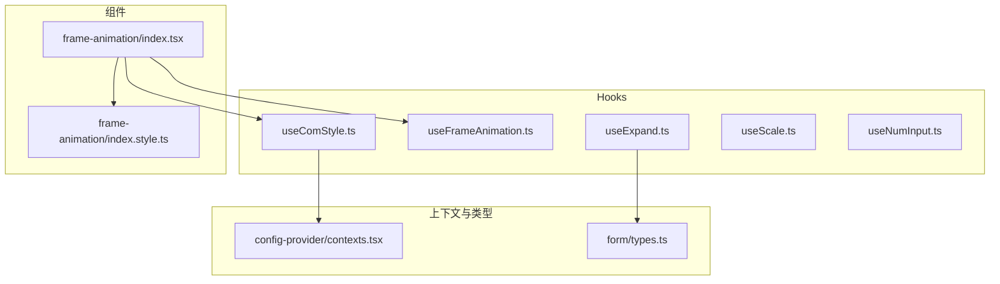
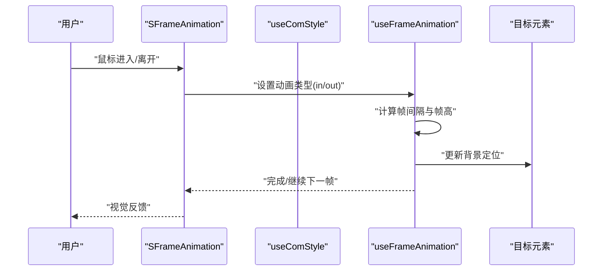
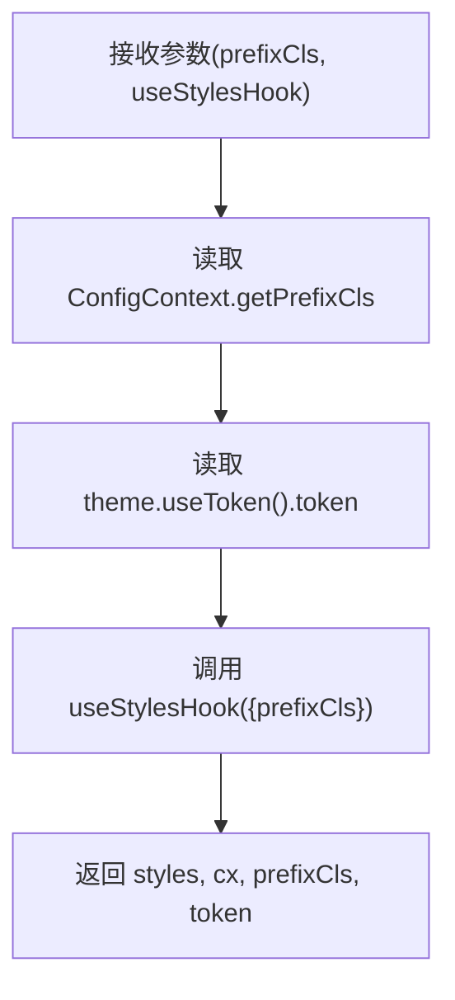
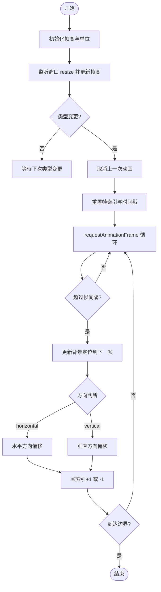
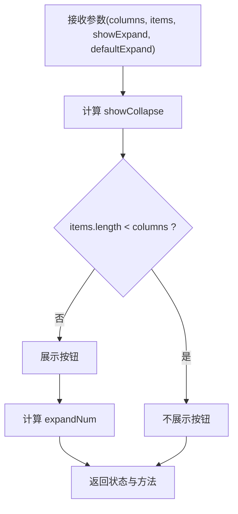
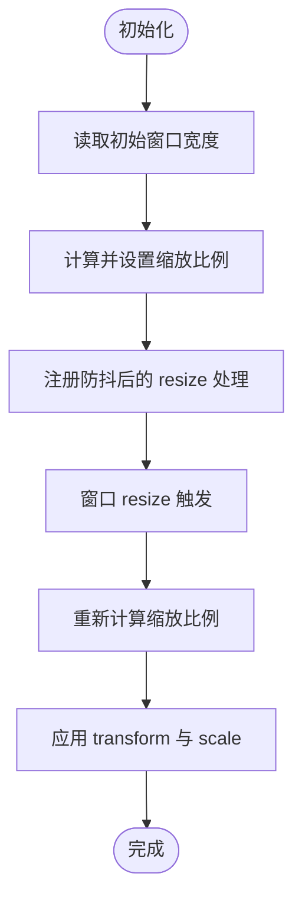
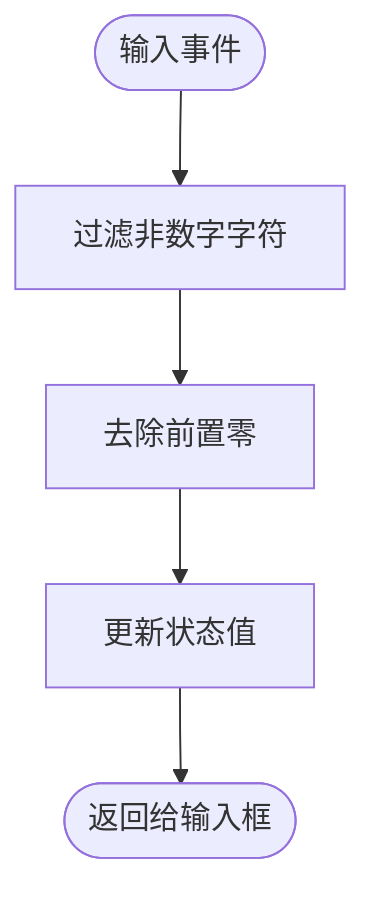
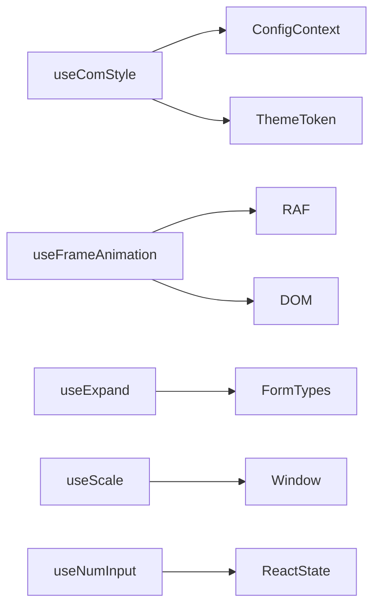

# UI 交互 Hooks

<cite>
**本文引用的文件**
- [useComStyle.ts](file://src/hooks/useComStyle.ts)
- [useFrameAnimation.ts](file://src/hooks/useFrameAnimation.ts)
- [useExpand.ts](file://src/hooks/useExpand.ts)
- [useScale.ts](file://src/hooks/useScale.ts)
- [useNumInput.ts](file://src/hooks/useNumInput.ts)
- [index.tsx](file://src/components/frame-animation/index.tsx)
- [index.style.ts](file://src/components/frame-animation/index.style.ts)
- [contexts.tsx](file://src/components/config-provider/contexts.tsx)
- [types.ts](file://src/components/form/types.ts)
- [index.ts](file://src/hooks/index.ts)
</cite>

## 目录

1. [简介](#简介)
2. [项目结构](#项目结构)
3. [核心组件](#核心组件)
4. [架构总览](#架构总览)
5. [详细组件分析](#详细组件分析)
6. [依赖关系分析](#依赖关系分析)
7. [性能考量](#性能考量)
8. [故障排查指南](#故障排查指南)
9. [结论](#结论)
10. [附录](#附录)

## 简介

本文件聚焦于 UI 交互类 Hooks 的设计与使用，涵盖以下能力：

- useComStyle：统一注入组件前缀与主题变量，简化样式钩子调用与主题适配
- useFrameAnimation：基于背景定位的帧动画控制，支持方向切换、帧率与性能优化
- useExpand：表单项展开/收起逻辑，控制显示数量与状态管理
- useScale：窗口缩放比例计算与响应式缩放
- useNumInput：数字输入规范化处理，去除前置零与非数字字符

目标是帮助开发者快速理解各 Hook 的职责边界、参数含义、内部机制与最佳实践。

## 项目结构

与 UI 交互 Hooks 直接相关的目录与文件如下：

- hooks 目录：存放各类交互型 Hooks，如 useComStyle、useFrameAnimation、useExpand、useScale、useNumInput
- components/frame-animation：演示与使用 useFrameAnimation 的组件与样式
- components/config-provider：提供全局前缀与主题上下文
- components/form：包含表单项类型定义，用于 useExpand 的参数约束

图表来源

- [useComStyle.ts](file://src/hooks/useComStyle.ts#L1-L29)
- [useFrameAnimation.ts](file://src/hooks/useFrameAnimation.ts#L1-L125)
- [useExpand.ts](file://src/hooks/useExpand.ts#L1-L46)
- [useScale.ts](file://src/hooks/useScale.ts#L1-L43)
- [useNumInput.ts](file://src/hooks/useNumInput.ts#L1-L23)
- [index.tsx](file://src/components/frame-animation/index.tsx#L1-L64)
- [index.style.ts](file://src/components/frame-animation/index.style.ts#L1-L14)
- [contexts.tsx](file://src/components/config-provider/contexts.tsx#L1-L20)
- [types.ts](file://src/components/form/types.ts#L1-L155)

章节来源

- [index.ts](file://src/hooks/index.ts#L1-L27)

## 核心组件

本节对每个 Hook 的职责、参数、返回值与典型用法进行概述。

- useComStyle

  - 功能：从全局配置上下文获取组件前缀，从 Ant Design 主题系统获取 token，并将 prefixCls 注入到样式钩子中，返回样式对象、类名合并工具、最终前缀与主题 token
  - 典型用途：所有组件统一前缀与主题变量，避免重复拼装与主题不一致
  - 关键点：依赖 ConfigContext 与 Ant Design theme.useToken

- useFrameAnimation

  - 功能：根据传入的 ref、帧总数、方向与帧率，控制背景定位以实现序列帧动画；支持进入/离开触发不同方向的播放
  - 典型用途：图标悬停播放、加载指示器等
  - 关键点：使用 requestAnimationFrame 驱动，按帧间隔更新背景位置；监听窗口 resize 以同步帧高单位

- useExpand

  - 功能：根据列数与表单项集合，计算是否展示“展开/收起”按钮以及当前应展示的条目数量
  - 典型用途：搜索表单、详情页分组表单等需要折叠/展开的场景
  - 关键点：受外部 showExpand 与默认展开状态影响；内部维护 collapse 状态与可展开数量

- useScale

  - 功能：根据浏览器窗口宽度与基准宽度，计算缩放比例并返回 transform 与 scale 值
  - 典型用途：大屏自适应布局、全屏缩放
  - 关键点：使用防抖减少 resize 回调频率；返回值可用于包裹根节点实现整体缩放

- useNumInput
  - 功能：规范化数字输入，过滤非数字字符并去除前置零
  - 典型用途：金额输入、编号输入等
  - 关键点：返回值为 [状态值, 处理函数]，便于直接绑定到受控输入框

章节来源

- [useComStyle.ts](file://src/hooks/useComStyle.ts#L1-L29)
- [useFrameAnimation.ts](file://src/hooks/useFrameAnimation.ts#L1-L125)
- [useExpand.ts](file://src/hooks/useExpand.ts#L1-L46)
- [useScale.ts](file://src/hooks/useScale.ts#L1-L43)
- [useNumInput.ts](file://src/hooks/useNumInput.ts#L1-L23)

## 架构总览

下图展示了 useFrameAnimation 在组件中的集成方式与数据流：

图表来源

- [index.tsx](file://src/components/frame-animation/index.tsx#L1-L64)
- [useComStyle.ts](file://src/hooks/useComStyle.ts#L1-L29)
- [useFrameAnimation.ts](file://src/hooks/useFrameAnimation.ts#L1-L125)

## 详细组件分析

### useComStyle 组件样式处理 Hooks

- 设计要点
  - 从 ConfigContext 获取组件前缀，确保命名空间一致性
  - 使用 Ant Design 主题 token，保证与全局主题风格一致
  - 将处理后的 prefixCls 传递给样式钩子，返回样式对象与类名合并工具
- 数据结构与复杂度
  - 返回值包含 styles、cx、prefixCls、token，均为常量级操作
- 错误处理与边界
  - 若上下文缺失，需确保在 ConfigProvider 包裹下使用
- 性能影响
  - 仅在上下文变化时重新计算，无额外副作用

图表来源

- [useComStyle.ts](file://src/hooks/useComStyle.ts#L1-L29)
- [contexts.tsx](file://src/components/config-provider/contexts.tsx#L1-L20)

章节来源

- [useComStyle.ts](file://src/hooks/useComStyle.ts#L1-L29)
- [contexts.tsx](file://src/components/config-provider/contexts.tsx#L1-L20)

### useFrameAnimation 帧动画 Hooks

- 实现原理
  - 计算每帧时间间隔，使用 requestAnimationFrame 循环推进
  - 根据方向(horizontal/vertical)更新背景定位，实现逐帧切换
  - 监听窗口 resize 以同步元素高度与单位，避免帧高不一致导致的跳帧
- 参数与行为
  - ref：目标元素引用
  - imgNumber：总帧数
  - direction：帧方向(默认 vertical)
  - frameNumber：每秒帧数(默认 60)
  - 返回值：设置动画类型的函数，支持 'in'/'out'
- 性能优化
  - 使用 requestAnimationFrame 驱动，避免阻塞主线程
  - 在组件卸载时取消动画，防止内存泄漏
  - resize 事件采用防抖策略，降低频繁重排风险
- 兼容性处理
  - 通过 getComputedStyle 获取元素高度，兼容不同容器尺寸
  - 支持 px/% 等多种单位，自动解析并保留单位

图表来源

- [useFrameAnimation.ts](file://src/hooks/useFrameAnimation.ts#L1-L125)

章节来源

- [useFrameAnimation.ts](file://src/hooks/useFrameAnimation.ts#L1-L125)
- [index.tsx](file://src/components/frame-animation/index.tsx#L1-L64)
- [index.style.ts](file://src/components/frame-animation/index.style.ts#L1-L14)

### useExpand 展开收起 Hooks

- 作用与配置
  - 控制表单项的“展开/收起”按钮展示与点击状态
  - 根据列数与表单项数量决定是否展示按钮
  - 内部维护 collapse 状态与可展示数量 expandNum
- 关键参数
  - columns：列数
  - items：表单项数组
  - showExpand：是否允许展示按钮
  - defaultExpand：默认展开状态
- 状态管理与事件
  - 返回 showCollapse、expandNum、collapse、setCollapse
  - 通过 setCollapse 切换展开/收起

图表来源

- [useExpand.ts](file://src/hooks/useExpand.ts#L1-L46)
- [types.ts](file://src/components/form/types.ts#L1-L155)

章节来源

- [useExpand.ts](file://src/hooks/useExpand.ts#L1-L46)
- [types.ts](file://src/components/form/types.ts#L1-L155)

### useScale 缩放控制 Hooks

- 应用场景
  - 大屏自适应布局、全屏缩放、设计稿等比缩放
- 工作原理
  - 监听窗口 resize，计算缩放比例并更新 transform 与 scale
  - 使用防抖降低回调频率，提升性能
- 返回值
  - isScaleScreen：包含 transform 字符串的对象
  - scale：当前缩放比例

图表来源

- [useScale.ts](file://src/hooks/useScale.ts#L1-L43)

章节来源

- [useScale.ts](file://src/hooks/useScale.ts#L1-L43)

### useNumInput 数字输入 Hooks

- 应用场景
  - 金额、编号、计数等纯数字输入
- 行为特征
  - 过滤非数字字符，去除前置零
  - 返回受控状态与处理函数，便于直接绑定到输入框
- 注意事项
  - 仅处理数字输入，不包含小数点与负号；如需更复杂的数值校验，请结合业务场景扩展

图表来源

- [useNumInput.ts](file://src/hooks/useNumInput.ts#L1-L23)

章节来源

- [useNumInput.ts](file://src/hooks/useNumInput.ts#L1-L23)

## 依赖关系分析

- useComStyle 依赖 ConfigContext 与 Ant Design 主题系统
- useFrameAnimation 依赖 DOM 元素与浏览器动画 API
- useExpand 依赖表单项类型定义，用于约束参数与返回值
- useScale 依赖浏览器窗口尺寸与防抖库
- useNumInput 依赖 React 状态管理

图表来源

- [useComStyle.ts](file://src/hooks/useComStyle.ts#L1-L29)
- [useFrameAnimation.ts](file://src/hooks/useFrameAnimation.ts#L1-L125)
- [useExpand.ts](file://src/hooks/useExpand.ts#L1-L46)
- [useScale.ts](file://src/hooks/useScale.ts#L1-L43)
- [useNumInput.ts](file://src/hooks/useNumInput.ts#L1-L23)
- [contexts.tsx](file://src/components/config-provider/contexts.tsx#L1-L20)
- [types.ts](file://src/components/form/types.ts#L1-L155)

章节来源

- [index.ts](file://src/hooks/index.ts#L1-L27)

## 性能考量

- useFrameAnimation
  - 使用 requestAnimationFrame 驱动，避免主线程阻塞
  - 在组件卸载时取消动画，防止内存泄漏
  - resize 防抖降低频繁重排
- useScale
  - resize 防抖减少计算次数
  - 仅在窗口尺寸变化时更新 transform 与 scale
- useExpand
  - 使用 useMemo 缓存计算结果，避免不必要的重渲染
- useComStyle
  - 仅在上下文或主题变化时重新计算
- useNumInput
  - 简单正则过滤与字符串处理，开销极低

## 故障排查指南

- useFrameAnimation 无法播放
  - 检查 ref 是否正确指向目标元素
  - 确认背景图尺寸与帧高一致，避免单位不匹配
  - 确保在鼠标进入/离开时正确调用返回的设置函数
- useExpand 按钮不显示
  - 确认 items 长度大于列数，且 showExpand 为真
  - 检查默认展开状态与外部控制逻辑
- useScale 缩放异常
  - 确认基准宽度与实际设计稿一致
  - 检查是否在根节点应用返回的 transform
- useComStyle 样式未生效
  - 确保在 ConfigProvider 下使用
  - 检查样式钩子是否正确接收 prefixCls
- useNumInput 输入异常
  - 确认返回的状态与处理函数已正确绑定到输入框
  - 如需支持小数或负号，请扩展处理逻辑

章节来源

- [useFrameAnimation.ts](file://src/hooks/useFrameAnimation.ts#L1-L125)
- [useExpand.ts](file://src/hooks/useExpand.ts#L1-L46)
- [useScale.ts](file://src/hooks/useScale.ts#L1-L43)
- [useComStyle.ts](file://src/hooks/useComStyle.ts#L1-L29)
- [useNumInput.ts](file://src/hooks/useNumInput.ts#L1-L23)

## 结论

上述 Hooks 提供了 UI 交互层面的关键能力：统一样式前缀与主题、高性能帧动画、表单项展开控制、屏幕缩放与数字输入规范化。通过合理组合与遵循性能建议，可在复杂交互场景中获得稳定、流畅的用户体验。

## 附录

- 最佳实践
  - 使用 useComStyle 统一组件前缀与主题变量，避免硬编码
  - useFrameAnimation 中优先使用合适的帧率与方向，避免过度绘制
  - useExpand 中结合业务需求设置默认展开与按钮展示条件
  - useScale 中为根容器应用 transform，避免影响布局计算
  - useNumInput 作为受控输入的基础能力，配合表单校验使用
