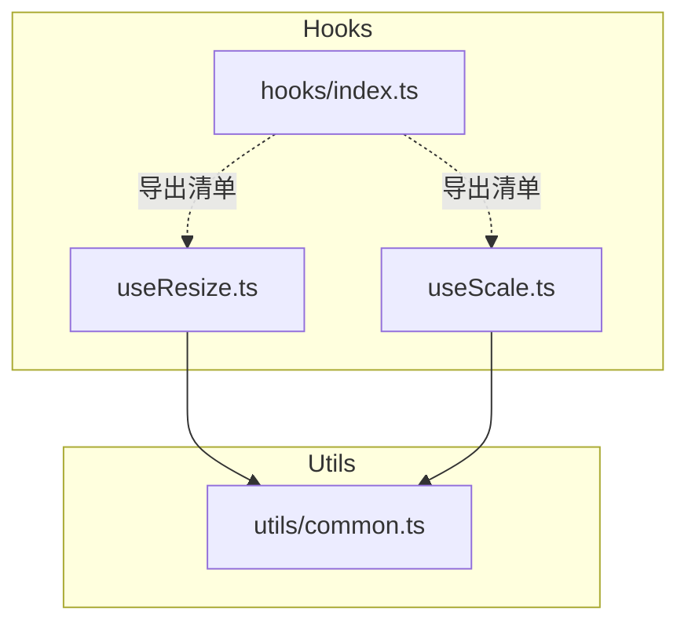
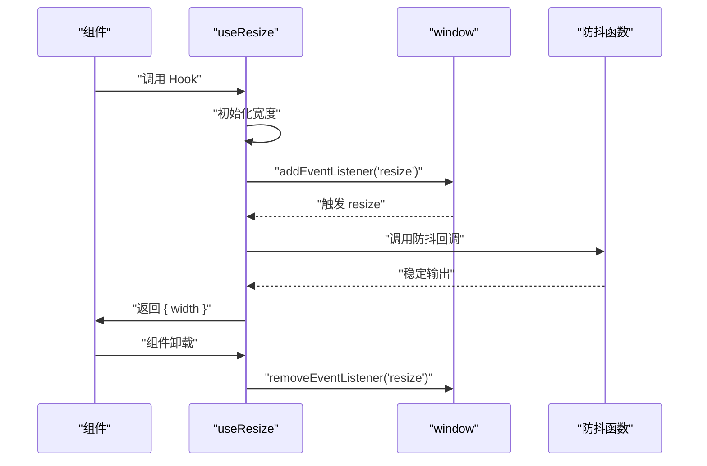
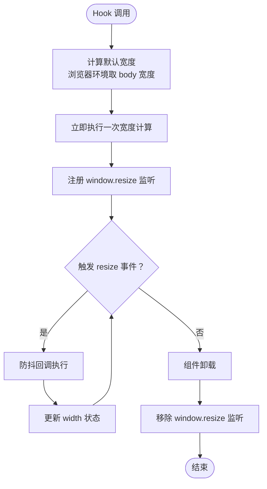
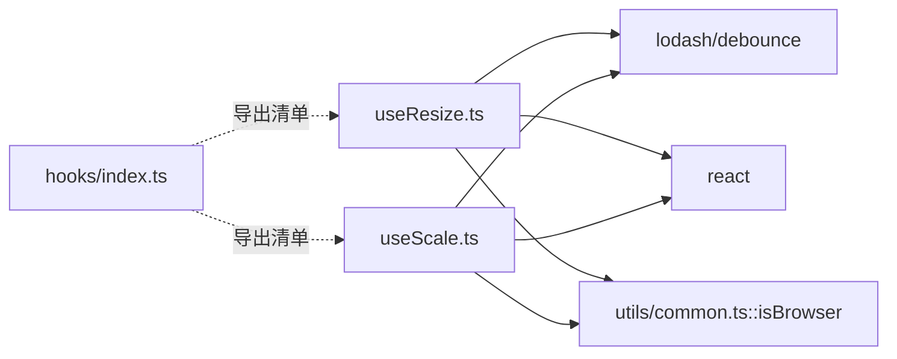

# 工具类 Hooks

<cite>
**本文引用的文件**
- [src/hooks/useResize.ts](file://src/hooks/useResize.ts)
- [src/utils/common.ts](file://src/utils/common.ts)
- [src/hooks/index.ts](file://src/hooks/index.ts)
- [src/hooks/useScale.ts](file://src/hooks/useScale.ts)
- [package.json](file://package.json)
</cite>

## 目录

1. [简介](#简介)
2. [项目结构](#项目结构)
3. [核心组件](#核心组件)
4. [架构总览](#架构总览)
5. [详细组件分析](#详细组件分析)
6. [依赖关系分析](#依赖关系分析)
7. [性能考量](#性能考量)
8. [故障排查指南](#故障排查指南)
9. [结论](#结论)
10. [附录](#附录)

## 简介

本篇文档聚焦于工具类 Hooks 中的 useResize 尺寸监听 Hook。该 Hook 提供对浏览器窗口尺寸变化的监听能力，并内置防抖与内存泄漏防护机制，适用于响应式布局、图表自适应、容器尺寸动态调整等场景。文档将从实现原理、使用方式、性能优化、与其他 Hooks 的组合使用等方面进行系统化说明。

## 项目结构

- useResize 位于 hooks 目录，负责监听窗口宽度并返回当前宽度；
- 依赖 utils 中的 isBrowser 判断运行环境，确保在非浏览器环境下的安全初始化；
- useScale 与 useResize 结构相似，但关注的是缩放比例与 transform 样式，便于整体页面缩放；
- hooks 目录导出清单中未包含 useResize，表明其可能为内部或实验性能力，不对外公开导出。

**图示来源**

- [src/hooks/useResize.ts](file://src/hooks/useResize.ts#L1-L37)
- [src/hooks/useScale.ts](file://src/hooks/useScale.ts#L1-L43)
- [src/hooks/index.ts](file://src/hooks/index.ts#L1-L28)
- [src/utils/common.ts](file://src/utils/common.ts#L184-L207)

**章节来源**

- [src/hooks/useResize.ts](file://src/hooks/useResize.ts#L1-L37)
- [src/hooks/useScale.ts](file://src/hooks/useScale.ts#L1-L43)
- [src/hooks/index.ts](file://src/hooks/index.ts#L1-L28)
- [src/utils/common.ts](file://src/utils/common.ts#L184-L207)

## 核心组件

- useResize：监听窗口 resize 事件，返回当前窗口宽度；内部使用防抖与事件清理，避免频繁重绘与内存泄漏。
- useScale：与 useResize 类似，但返回页面整体缩放比例与 transform 样式，适合全站缩放场景。
- isBrowser：判断当前是否运行在浏览器环境，用于在 SSR/Node 环境下安全初始化。

**章节来源**

- [src/hooks/useResize.ts](file://src/hooks/useResize.ts#L10-L34)
- [src/hooks/useScale.ts](file://src/hooks/useScale.ts#L10-L40)
- [src/utils/common.ts](file://src/utils/common.ts#L197-L207)

## 架构总览

useResize 的工作流围绕“事件监听 + 防抖 + 清理”展开：组件挂载时立即计算一次宽度，随后注册 resize 事件监听器；每次触发时通过防抖函数节流更新状态；组件卸载时移除监听器，防止内存泄漏。

**图示来源**

- [src/hooks/useResize.ts](file://src/hooks/useResize.ts#L15-L31)
- [src/utils/common.ts](file://src/utils/common.ts#L197-L207)

## 详细组件分析

### useResize 组件分析

- 数据结构与返回值
  - 返回对象包含 width 字段，类型为 number，表示当前窗口宽度。
- 处理逻辑
  - 初始化：根据运行环境选择默认宽度（浏览器环境取 body 宽度，否则回退到固定值）。
  - 事件绑定：组件挂载后立即执行一次宽度计算，然后注册 window.resize 事件监听。
  - 防抖策略：对宽度变更回调使用防抖，降低高频 resize 触发带来的性能压力。
  - 内存防护：组件卸载时移除事件监听，避免悬挂监听导致内存泄漏。
- 错误处理与边界条件
  - 在非浏览器环境（如 SSR）下，isBrowser 返回 false，避免访问 window/document 导致异常。
  - 默认宽度回退：当无法获取有效宽度时，使用安全值保证渲染稳定。
- 性能影响
  - 防抖时间窗口为固定值，减少 setState 次数，降低重排/重绘频率。
  - 仅监听 resize 事件，开销较小，适合高频使用场景。

**图示来源**

- [src/hooks/useResize.ts](file://src/hooks/useResize.ts#L10-L31)
- [src/utils/common.ts](file://src/utils/common.ts#L197-L207)

**章节来源**

- [src/hooks/useResize.ts](file://src/hooks/useResize.ts#L10-L34)
- [src/utils/common.ts](file://src/utils/common.ts#L197-L207)

### 与其他 Hooks 的组合使用

- 与 useScale 组合
  - 场景：既需要知道窗口宽度，又需要按基准宽度进行整体缩放。
  - 实践：同时使用 useResize 获取 width，再结合 useScale 的 scale 值进行样式缩放，实现“感知宽度 + 整体缩放”的双重能力。
- 与布局/容器 Hooks 组合
  - 场景：表格、卡片、表单等组件需要根据窗口宽度动态调整列数、间距或布局。
  - 实践：将 width 作为输入，配合布局计算逻辑（如每行列数、偏移量等），在渲染层动态应用样式或布局参数。
- 与动画/图表 Hooks 组合
  - 场景：折线图、柱状图等需要自适应容器宽度。
  - 实践：将 width 传入图表绘制逻辑，重新计算画布尺寸并重绘，确保在窗口变化时保持最佳视觉效果。

**章节来源**

- [src/hooks/useScale.ts](file://src/hooks/useScale.ts#L10-L40)

### 使用示例与最佳实践

- 基础用法
  - 场景：根据窗口宽度切换移动端/桌面端布局。
  - 实践：在组件中调用 useResize，读取 width 并根据阈值切换布局类名或渲染结构。
- 高级配置
  - 场景：需要更精细的控制（如自定义防抖间隔、扩展返回字段）。
  - 实践：基于 useResize 的实现思路，封装自定义 Hook，在内部增加可配置项与更多维度的状态（如高度、方向等）。
- 性能优化
  - 场景：大量组件同时监听 resize，造成卡顿。
  - 实践：统一在根组件或布局组件中使用 useResize，向下传递 width；子组件通过 props 或 context 消费，避免重复监听。
- 内存泄漏防护
  - 场景：组件多次挂载/卸载，未正确清理监听器。
  - 实践：严格遵循 useEffect 的清理函数模式，确保在组件卸载时移除监听器；在 SSR 环境下，利用 isBrowser 判断避免在服务端执行 DOM 操作。

**章节来源**

- [src/hooks/useResize.ts](file://src/hooks/useResize.ts#L15-L31)
- [src/utils/common.ts](file://src/utils/common.ts#L197-L207)

### 原理说明与注意事项

- 原理
  - 通过 window.resize 事件感知窗口尺寸变化；使用防抖降低回调频率；在组件卸载时移除监听器，避免内存泄漏。
- 注意事项
  - SSR 环境：需确保只在浏览器端执行 DOM 相关逻辑，避免在服务端访问 window/document。
  - 防抖参数：当前实现使用固定防抖间隔，若业务对实时性要求更高，可考虑将防抖时间作为可配置项。
  - 返回值单一：当前仅返回 width，若需要更多维度信息（如高度、方向），可在自定义 Hook 中扩展。
- 常见问题与解决方案
  - 问题：在 SSR 下初始化报错。
    - 解决：利用 isBrowser 判断运行环境，避免在服务端访问 window/document。
  - 问题：多个组件重复监听导致性能下降。
    - 解决：集中在一个高层组件中监听并下发 width，子组件消费 props/context。
  - 问题：resize 过于频繁导致卡顿。
    - 解决：使用防抖；必要时在业务层做节流或合并状态更新。

**章节来源**

- [src/hooks/useResize.ts](file://src/hooks/useResize.ts#L15-L31)
- [src/utils/common.ts](file://src/utils/common.ts#L197-L207)

## 依赖关系分析

- 外部依赖
  - lodash/debounce：提供防抖能力，降低 resize 回调频率。
  - react：使用 useState、useCallback、useEffect 生命周期钩子。
- 内部依赖
  - utils/common.ts：提供 isBrowser 判断，保障在非浏览器环境的安全初始化。
- 导出情况
  - hooks/index.ts 未导出 useResize，表明其可能为内部或实验性能力，不对外公开导出。

**图示来源**

- [src/hooks/useResize.ts](file://src/hooks/useResize.ts#L1-L4)
- [src/hooks/useScale.ts](file://src/hooks/useScale.ts#L1-L2)
- [src/hooks/index.ts](file://src/hooks/index.ts#L1-L28)
- [src/utils/common.ts](file://src/utils/common.ts#L197-L207)
- [package.json](file://package.json#L52-L59)

**章节来源**

- [src/hooks/useResize.ts](file://src/hooks/useResize.ts#L1-L4)
- [src/hooks/useScale.ts](file://src/hooks/useScale.ts#L1-L2)
- [src/hooks/index.ts](file://src/hooks/index.ts#L1-L28)
- [src/utils/common.ts](file://src/utils/common.ts#L197-L207)
- [package.json](file://package.json#L52-L59)

## 性能考量

- 防抖策略：通过固定防抖间隔降低 setState 次数，减少重排/重绘频率，适合高频 resize 场景。
- 事件清理：在组件卸载时移除监听器，避免内存泄漏与多余回调。
- SSR 安全：isBrowser 判断避免在服务端执行 DOM 操作，减少不必要的初始化开销。
- 建议
  - 若业务对实时性要求极高，可将防抖间隔作为可配置项。
  - 在大型应用中，建议集中监听并在根组件下发 width，避免多处重复监听。

**章节来源**

- [src/hooks/useResize.ts](file://src/hooks/useResize.ts#L21-L31)
- [src/utils/common.ts](file://src/utils/common.ts#L197-L207)

## 故障排查指南

- 症状：SSR 环境初始化报错或渲染异常。
  - 排查：确认 isBrowser 判断逻辑是否生效；避免在服务端访问 window/document。
- 症状：组件卸载后仍出现 resize 回调。
  - 排查：确认 useEffect 的清理函数是否执行；确保 removeEventListener 被调用。
- 症状：resize 过于频繁导致卡顿。
  - 排查：确认防抖是否生效；必要时在业务层做额外节流或合并更新。
- 症状：useResize 未被外部使用。
  - 排查：hooks/index.ts 未导出 useResize，需在内部直接引用或自行导出。

**章节来源**

- [src/hooks/useResize.ts](file://src/hooks/useResize.ts#L23-L31)
- [src/hooks/index.ts](file://src/hooks/index.ts#L1-L28)
- [src/utils/common.ts](file://src/utils/common.ts#L197-L207)

## 结论

useResize 通过简洁的实现提供了可靠的窗口尺寸监听能力，具备防抖与内存泄漏防护，适合在响应式布局、图表自适应、容器尺寸调整等场景中使用。结合 useScale 可实现“感知宽度 + 整体缩放”的完整方案；在大型应用中建议集中监听并向下传递，以获得更好的性能与可维护性。

## 附录

- 相关文件
  - [src/hooks/useResize.ts](file://src/hooks/useResize.ts#L1-L37)
  - [src/hooks/useScale.ts](file://src/hooks/useScale.ts#L1-L43)
  - [src/utils/common.ts](file://src/utils/common.ts#L184-L207)
  - [src/hooks/index.ts](file://src/hooks/index.ts#L1-L28)
  - [package.json](file://package.json#L52-L59)
