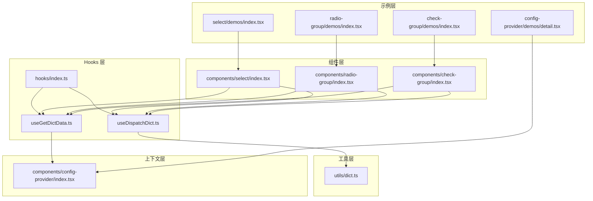
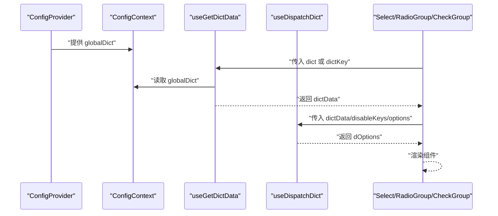
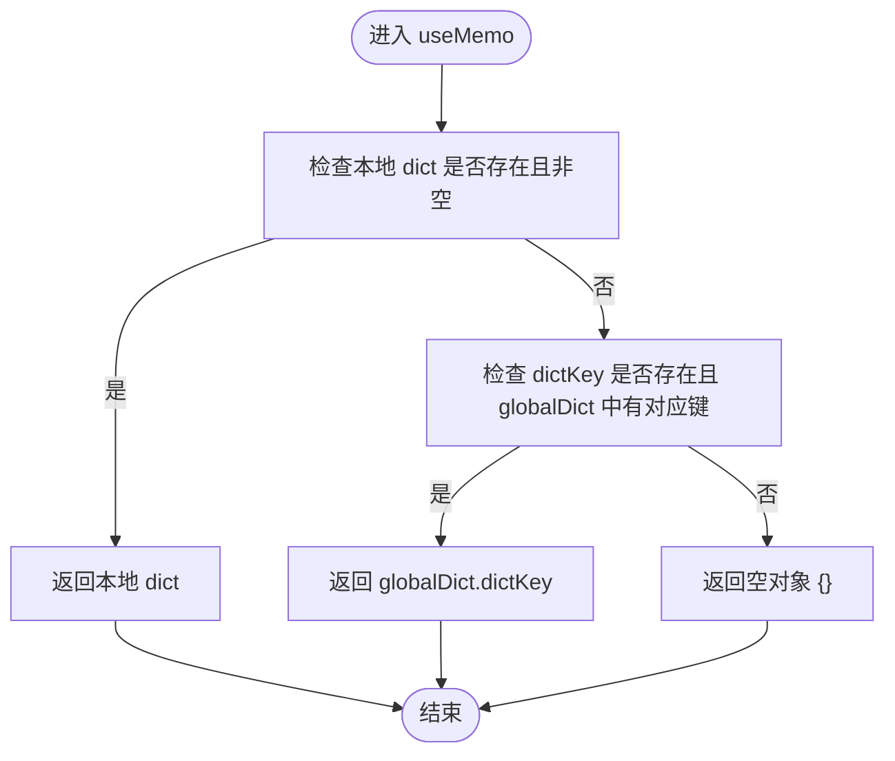
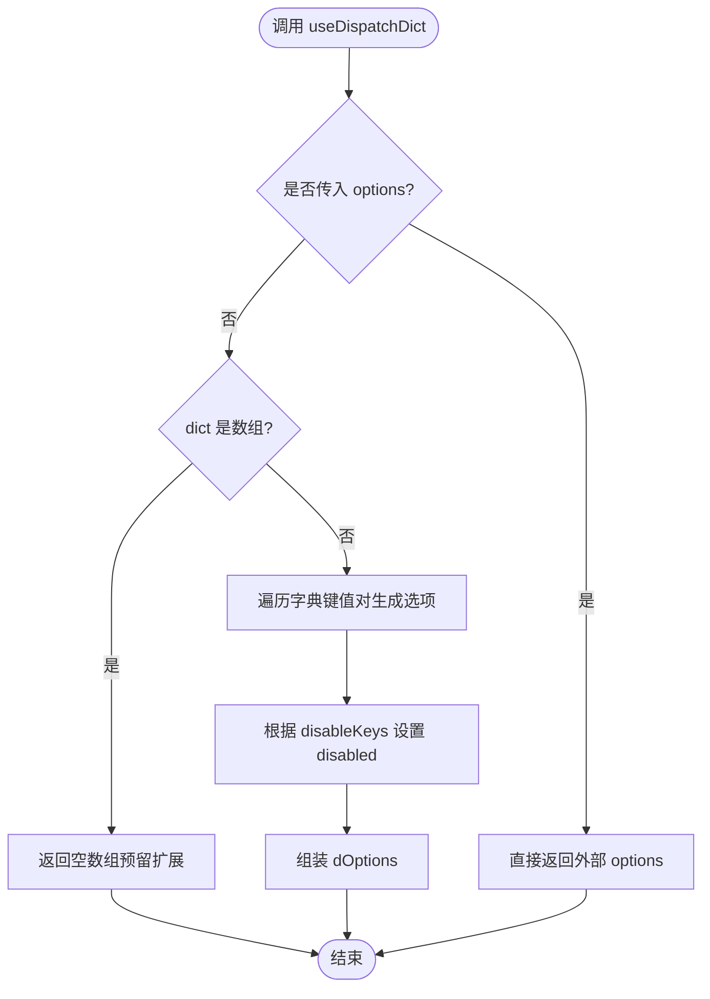
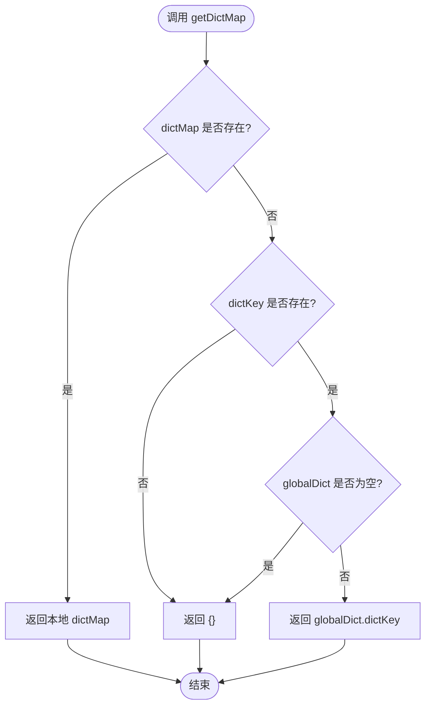
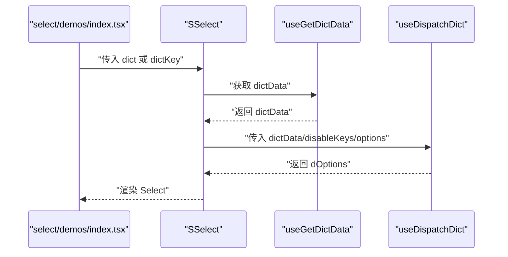
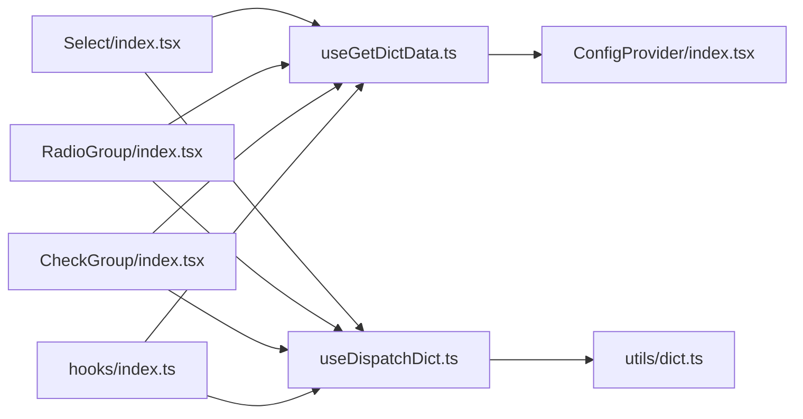

# 数据处理 Hooks

<cite>
**本文引用的文件**
- [useGetDictData.ts](file://src/hooks/useGetDictData.ts)
- [useDispatchDict.ts](file://src/hooks/useDispatchDict.ts)
- [dict.ts](file://src/utils/dict.ts)
- [index.ts](file://src/hooks/index.ts)
- [index.tsx](file://src/components/config-provider/index.tsx)
- [index.tsx](file://src/components/select/index.tsx)
- [index.tsx](file://src/components/check-group/index.tsx)
- [index.tsx](file://src/components/radio-group/index.tsx)
- [types.ts](file://src/components/select/types.ts)
- [types.ts](file://src/components/table/types.ts)
- [index.tsx](file://src/components/select/demos/index.tsx)
- [index.tsx](file://src/components/check-group/demos/index.tsx)
- [index.tsx](file://src/components/radio-group/demos/index.tsx)
- [index.tsx](file://src/components/config-provider/demos/detail.tsx)
</cite>

## 目录

1. [简介](#简介)
2. [项目结构](#项目结构)
3. [核心组件](#核心组件)
4. [架构总览](#架构总览)
5. [详细组件分析](#详细组件分析)
6. [依赖关系分析](#依赖关系分析)
7. [性能考量](#性能考量)
8. [故障排查指南](#故障排查指南)
9. [结论](#结论)
10. [附录](#附录)

## 简介

本文件系统性梳理仓库中的数据处理 Hooks，重点围绕以下目标展开：

- 深入解析 useGetDictData 字典数据获取 Hook 的功能与使用方式：支持从本地 dict 或全局 ConfigProvider 注入的 globalDict 中按 dictKey 获取字典数据；通过 useMemo 实现稳定的数据来源与缓存策略。
- 全面说明 useDispatchDict 字典数据分发 Hook 的职责与配置项：将字典对象转换为组件可用的 options 列表，支持禁用键控制、外部 options 优先级、以及对数组型字典的扩展预留。
- 给出字典数据在表单、选择器、单选/多选框组、详情展示等组件中的实际应用示例路径与最佳实践：包括数据请求优化、错误处理、Loading 状态管理、生命周期与内存优化策略。

## 项目结构

围绕字典数据处理的相关模块分布如下：

- Hooks 层：useGetDictData、useDispatchDict、导出入口 index.ts
- 工具层：dict.ts（字典映射、多选字典映射、全局字典合并）
- 上下文层：ConfigProvider（注入 globalDict）
- 组件层：Select、RadioGroup、CheckGroup 等组件集成上述 Hooks
- 示例层：各组件的演示文件与 ConfigProvider 的演示

图表来源

- [useGetDictData.ts](file://src/hooks/useGetDictData.ts#L1-L28)
- [useDispatchDict.ts](file://src/hooks/useDispatchDict.ts#L1-L99)
- [dict.ts](file://src/utils/dict.ts#L1-L121)
- [index.ts](file://src/hooks/index.ts#L1-L28)
- [index.tsx](file://src/components/config-provider/index.tsx#L1-L47)
- [index.tsx](file://src/components/select/index.tsx#L1-L37)
- [index.tsx](file://src/components/radio-group/index.tsx#L1-L39)
- [index.tsx](file://src/components/check-group/index.tsx#L1-L69)
- [index.tsx](file://src/components/select/demos/index.tsx#L1-L68)
- [index.tsx](file://src/components/radio-group/demos/index.tsx#L1-L21)
- [index.tsx](file://src/components/check-group/demos/index.tsx#L1-L81)
- [index.tsx](file://src/components/config-provider/demos/detail.tsx#L1-L59)

章节来源

- [index.ts](file://src/hooks/index.ts#L1-L28)

## 核心组件

- useGetDictData：从本地 dict 或全局 ConfigProvider 的 globalDict 中按 dictKey 获取字典数据，并通过 useMemo 缓存结果，避免重复计算。
- useDispatchDict：将字典对象转换为组件可直接使用的 options 数组，支持禁用键控制 disableKeys，以及外部 options 的高优先级覆盖。
- utils/dict：提供字典映射、多选字典映射、全局字典合并等通用能力，支撑渲染层的值到标签的转换与多选拼接显示。

章节来源

- [useGetDictData.ts](file://src/hooks/useGetDictData.ts#L1-L28)
- [useDispatchDict.ts](file://src/hooks/useDispatchDict.ts#L1-L99)
- [dict.ts](file://src/utils/dict.ts#L1-L121)

## 架构总览

字典数据在组件中的流转路径如下：

- ConfigProvider 将 globalDict 注入上下文
- 组件通过 useGetDictData 获取 dict 或 globalDict 中的字典数据
- useDispatchDict 将字典数据转换为 options
- 组件最终消费 options 渲染 UI

图表来源

- [index.tsx](file://src/components/config-provider/index.tsx#L1-L47)
- [useGetDictData.ts](file://src/hooks/useGetDictData.ts#L1-L28)
- [useDispatchDict.ts](file://src/hooks/useDispatchDict.ts#L1-L99)
- [index.tsx](file://src/components/select/index.tsx#L1-L37)
- [index.tsx](file://src/components/radio-group/index.tsx#L1-L39)
- [index.tsx](file://src/components/check-group/index.tsx#L1-L69)

## 详细组件分析

### useGetDictData：字典数据获取 Hook

- 功能概述
  - 支持两种数据源：本地 dict 与全局 dictKey 对应的 globalDict
  - 通过 useMemo 基于依赖项进行缓存，避免重复计算
- 关键行为
  - 若本地 dict 存在且非空，则优先使用本地 dict
  - 否则若提供了 dictKey 且 globalDict 中存在对应键，则使用 globalDict.dictKey
  - 否则返回空对象，保证下游逻辑安全
- 性能与缓存
  - 依赖项包含 globalDict、dictKey、dict，确保数据变更时重新计算
  - 返回稳定的 dictData，便于下游组件复用
- 使用建议
  - 在组件初始化阶段传入 dictKey，由 ConfigProvider 提供 globalDict
  - 避免在每次渲染中改变 dictKey 或 dict，减少不必要的重算

图表来源

- [useGetDictData.ts](file://src/hooks/useGetDictData.ts#L14-L20)
- [index.tsx](file://src/components/config-provider/index.tsx#L13-L29)

章节来源

- [useGetDictData.ts](file://src/hooks/useGetDictData.ts#L1-L28)
- [index.tsx](file://src/components/config-provider/index.tsx#L1-L47)

### useDispatchDict：字典数据分发 Hook

- 职责与输出
  - 将字典对象转换为组件可用的 options 数组
  - 支持禁用键控制 disableKeys（字符串或字符串数组）
  - 外部 options 优先级高于内部生成的 dOptions
- 核心流程
  - dispatchObjDict：遍历字典键值对，生成 { label, value, disabled } 结构
  - getDisableByKey：根据 disableKeys 判断是否禁用某键
  - getDictOptions：根据 dict 类型（对象或数组）选择处理分支
  - useMemo：基于 dict、options、disableKeys 计算 dOptions
- 配置项
  - dict：字典对象或 undefined
  - disableKeys：禁用的键（字符串或数组）
  - options：外部传入的选项数组（优先级最高）

图表来源

- [useDispatchDict.ts](file://src/hooks/useDispatchDict.ts#L14-L98)

章节来源

- [useDispatchDict.ts](file://src/hooks/useDispatchDict.ts#L1-L99)

### utils/dict：字典映射与全局字典合并

- dispatchDictData：将原始值映射为标签文本，支持对象与数组两种字典结构
- dispatchCheckboxDictData：将逗号分隔的多选值映射为标签并用“/”连接
- getDictMap：合并本地 dictMap 与全局 globalDict，按 dictKey 获取最终字典映射

图表来源

- [dict.ts](file://src/utils/dict.ts#L104-L120)

章节来源

- [dict.ts](file://src/utils/dict.ts#L1-L121)

### 组件集成与应用示例

#### Select 组件

- 集成方式
  - 通过 useGetDictData 获取 dictData
  - 通过 useDispatchDict 生成 dOptions
  - 将 dOptions 传递给 Ant Design Select 的 options
- 应用示例
  - 本地字典：dict 属性传入对象
  - 外部 options 优先级高于 dict 生成的选项
  - 表单场景：配合 Form.Item 使用

图表来源

- [index.tsx](file://src/components/select/index.tsx#L9-L34)
- [index.tsx](file://src/components/select/demos/index.tsx#L1-L68)

章节来源

- [index.tsx](file://src/components/select/index.tsx#L1-L37)
- [index.tsx](file://src/components/select/demos/index.tsx#L1-L68)

#### RadioGroup 组件

- 集成方式
  - 与 Select 类似，使用 useGetDictData 与 useDispatchDict
  - 通过 options 渲染单选按钮
- 应用示例
  - 本地字典直传，或通过 dictKey 从全局字典获取

章节来源

- [index.tsx](file://src/components/radio-group/index.tsx#L1-L39)
- [index.tsx](file://src/components/radio-group/demos/index.tsx#L1-L21)

#### CheckGroup 组件

- 特殊点
  - 内部处理多选值的初始化与变更（逗号分隔与反向拼接）
  - 仍通过 useDispatchDict 生成 options
- 应用示例
  - 本地字典直传，或通过 dictKey 从全局字典获取
  - 表单场景中 value 与 onChange 的配合

章节来源

- [index.tsx](file://src/components/check-group/index.tsx#L1-L69)
- [index.tsx](file://src/components/check-group/demos/index.tsx#L1-L81)

#### 全局字典注入与使用

- ConfigProvider
  - 将 globalDict 注入上下文，供 useGetDictData 读取
  - 支持异步获取 globalDict 并更新状态
- 示例
  - 在演示中通过 dictKey 在多个组件中共享同一字典

章节来源

- [index.tsx](file://src/components/config-provider/index.tsx#L1-L47)
- [index.tsx](file://src/components/config-provider/demos/detail.tsx#L1-L59)

## 依赖关系分析

- 组件到 Hooks 的依赖
  - Select/RadioGroup/CheckGroup 依赖 useGetDictData 与 useDispatchDict
- Hooks 到工具函数的依赖
  - useDispatchDict 依赖 utils/dict 的字典映射能力
- 上下文依赖
  - useGetDictData 依赖 ConfigContext 提供的 globalDict
- 导出入口
  - hooks/index.ts 统一导出 useGetDictData 与 useDispatchDict

图表来源

- [index.tsx](file://src/components/select/index.tsx#L6-L7)
- [index.tsx](file://src/components/radio-group/index.tsx#L6-L7)
- [index.tsx](file://src/components/check-group/index.tsx#L8-L9)
- [useGetDictData.ts](file://src/hooks/useGetDictData.ts#L4)
- [useDispatchDict.ts](file://src/hooks/useDispatchDict.ts#L1-L99)
- [dict.ts](file://src/utils/dict.ts#L1-L121)
- [index.ts](file://src/hooks/index.ts#L1-L28)

章节来源

- [index.ts](file://src/hooks/index.ts#L1-L28)

## 性能考量

- useMemo 缓存
  - useGetDictData 与 useDispatchDict 均使用 useMemo，依赖项包含 globalDict、dictKey、dict、options、disableKeys，确保数据变更时才重新计算
- 依赖项设计
  - 仅在 dict、dictKey、globalDict 或 disableKeys 变更时触发重算，降低渲染成本
- 外部 options 优先
  - 外部传入的 options 不参与 useMemo 计算，直接返回，避免不必要的映射开销
- 全局字典加载
  - ConfigProvider 支持异步加载 globalDict，首次加载完成后触发一次更新，后续保持稳定

章节来源

- [useGetDictData.ts](file://src/hooks/useGetDictData.ts#L14-L20)
- [useDispatchDict.ts](file://src/hooks/useDispatchDict.ts#L87-L93)
- [index.tsx](file://src/components/config-provider/index.tsx#L16-L29)

## 故障排查指南

- 现象：Select/RadioGroup/CheckGroup 未显示任何选项
  - 排查：确认 dict 或 dictKey 是否正确传入；若使用 dictKey，确保 ConfigProvider 已注入 globalDict 且包含对应键
  - 参考：useGetDictData 的数据源优先级与返回空对象的兜底逻辑
- 现象：外部 options 未生效
  - 排查：确认是否同时传入了 options 与 dict；当 options 存在时，内部不会生成 dOptions
  - 参考：useDispatchDict 的外部 options 优先级逻辑
- 现象：禁用键未生效
  - 排查：确认 disableKeys 的类型（字符串或数组）与字典键一致
  - 参考：useDispatchDict 的 getDisableByKey 逻辑
- 现象：多选值显示异常
  - 排查：确认值是否为逗号分隔；utils/dict 的 dispatchCheckboxDictData 会将多选值映射后用“/”拼接
  - 参考：utils/dict 的多选映射逻辑

章节来源

- [useGetDictData.ts](file://src/hooks/useGetDictData.ts#L14-L20)
- [useDispatchDict.ts](file://src/hooks/useDispatchDict.ts#L87-L93)
- [useDispatchDict.ts](file://src/hooks/useDispatchDict.ts#L32-L42)
- [dict.ts](file://src/utils/dict.ts#L60-L95)

## 结论

- useGetDictData 与 useDispatchDict 形成了清晰的“数据获取—数据分发—组件消费”的闭环，既支持本地字典，也支持全局字典，具备良好的扩展性与性能表现
- 通过 useMemo 与外部 options 优先级等设计，兼顾了易用性与性能
- 在表单、选择器、单选/多选框组等常见场景中，均可通过统一的字典数据处理方案提升开发效率与一致性

## 附录

### API 定义与参数说明

- useGetDictData 参数
  - dictKey：字符串或 undefined，用于从 globalDict 中取值
  - dict：字典对象，优先于 globalDict
- useDispatchDict 参数
  - dict：字典对象或 undefined
  - disableKeys：禁用的键（字符串或字符串数组）
  - options：外部传入的选项数组（优先级最高）

章节来源

- [useGetDictData.ts](file://src/hooks/useGetDictData.ts#L6-L9)
- [useDispatchDict.ts](file://src/hooks/useDispatchDict.ts#L8-L12)

### 在表单、选择器、表格中的应用示例路径

- Select
  - 本地字典示例：[select/demos/index.tsx](file://src/components/select/demos/index.tsx#L10-L16)
  - 外部 options 优先级示例：[select/demos/index.tsx](file://src/components/select/demos/index.tsx#L50-L64)
- RadioGroup
  - 本地字典示例：[radio-group/demos/index.tsx](file://src/components/radio-group/demos/index.tsx#L5-L11)
- CheckGroup
  - 本地字典示例：[check-group/demos/index.tsx](file://src/components/check-group/demos/index.tsx#L10-L16)
- 全局字典注入与使用
  - ConfigProvider 注入 globalDict 示例：[config-provider/demos/detail.tsx](file://src/components/config-provider/demos/detail.tsx#L43-L55)

章节来源

- [index.tsx](file://src/components/select/demos/index.tsx#L1-L68)
- [index.tsx](file://src/components/radio-group/demos/index.tsx#L1-L21)
- [index.tsx](file://src/components/check-group/demos/index.tsx#L1-L81)
- [index.tsx](file://src/components/config-provider/demos/detail.tsx#L1-L59)
