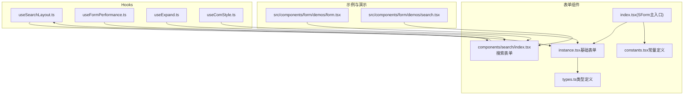
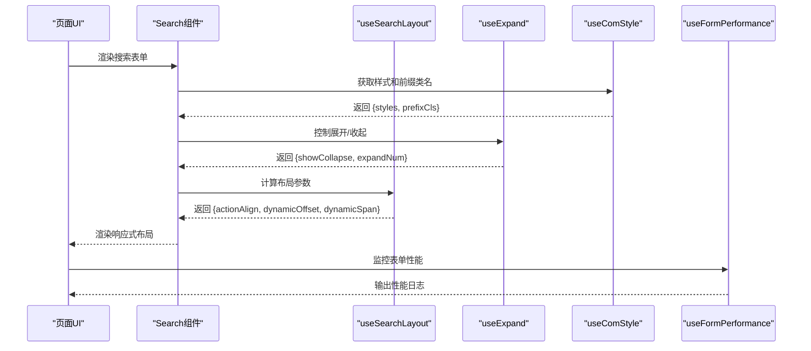
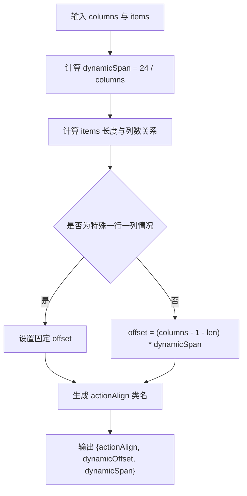
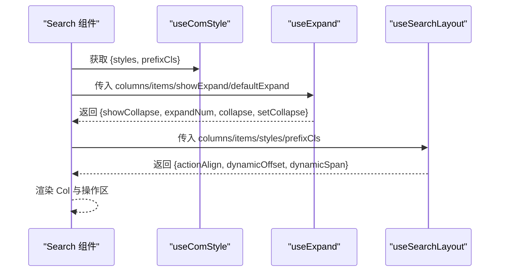
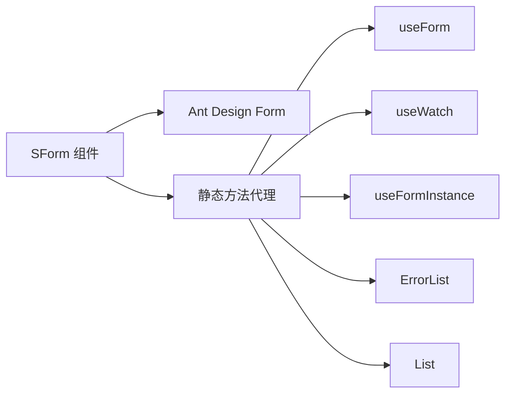
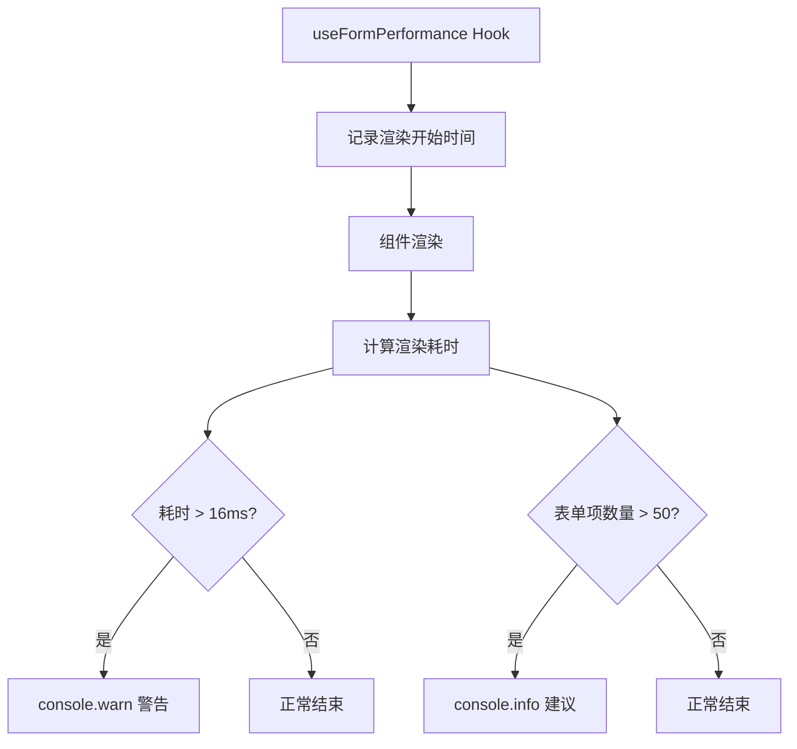
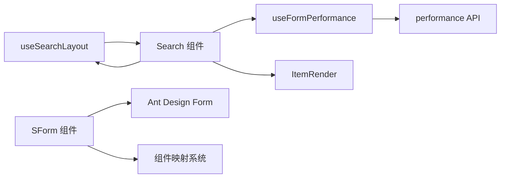

# 表单相关 Hooks

<cite>
**本文引用的文件**
- [useSearchLayout.ts](file://src/hooks/useSearchLayout.ts)
- [useFormPerformance.ts](file://src/hooks/useFormPerformance.ts)
- [index.tsx（搜索表单组件）](file://src/components/form/components/search/index.tsx)
- [instance.tsx（基础表单实例）](file://src/components/form/instance.tsx)
- [index.tsx（SForm 主入口）](file://src/components/form/index.tsx)
- [types.ts（表单类型定义）](file://src/components/form/types.ts)
- [constants.tsx（表单常量）](file://src/components/form/constants.tsx)
- [useExpand.ts](file://src/hooks/useExpand.ts)
- [useComStyle.ts](file://src/hooks/useComStyle.ts)
- [form.tsx（表单演示）](file://src/components/form/demos/form.tsx)
- [search.tsx（搜索表单演示）](file://src/components/form/demos/search.tsx)
</cite>

## 更新摘要

**变更内容**

- useStepForm 钩子已被删除，不再提供多步骤表单状态管理功能
- 保留并强化了 useSearchLayout 和 useFormPerformance 两个核心 Hooks
- 新增了完整的 Ant Design Form 静态方法集成
- 增强了表单组件映射和性能监控系统

## 目录

1. [简介](#简介)
2. [项目结构](#项目结构)
3. [核心组件](#核心组件)
4. [架构总览](#架构总览)
5. [详细组件分析](#详细组件分析)
6. [Ant Design Form 完整集成](#ant-design-form-完整集成)
7. [性能监控与优化](#性能监控与优化)
8. [依赖关系分析](#依赖关系分析)
9. [性能考虑](#性能考虑)
10. [故障排查指南](#故障排查指南)
11. [结论](#结论)
12. [附录](#附录)

## 简介

本文件聚焦于两个与"表单"密切相关的自研 Hooks：useSearchLayout 和 useFormPerformance。前者用于搜索区域的布局计算与响应式排版，后者用于表单性能监控。文档将从实现原理、使用方法、典型场景到最佳实践进行系统化说明，并提供可直接参考的示例路径。

**重要更新** useStepForm 钩子已被移除，不再提供多步骤表单状态管理功能。当前版本专注于搜索表单布局和表单性能监控两大核心能力。

## 项目结构

围绕表单 Hooks 的相关文件主要分布在以下位置：

- Hooks 实现：src/hooks
- 表单组件与类型：src/components/form
- 示例与演示：src/components/form/demos

**图表来源**

- [useSearchLayout.ts:1-53](file://src/hooks/useSearchLayout.ts#L1-L53)
- [useFormPerformance.ts:1-35](file://src/hooks/useFormPerformance.ts#L1-L35)
- [useExpand.ts:1-46](file://src/hooks/useExpand.ts#L1-L46)
- [useComStyle.ts:1-29](file://src/hooks/useComStyle.ts#L1-L29)
- [index.tsx（搜索表单组件）:1-147](file://src/components/form/components/search/index.tsx#L1-L147)
- [instance.tsx（基础表单实例）:1-133](file://src/components/form/instance.tsx#L1-L133)
- [index.tsx（SForm 主入口）:1-34](file://src/components/form/index.tsx#L1-L34)
- [types.ts（表单类型定义）:1-318](file://src/components/form/types.ts#L1-L318)
- [constants.tsx（表单常量）:1-73](file://src/components/form/constants.tsx#L1-L73)
- [form.tsx（表单演示）:1-94](file://src/components/form/demos/form.tsx#L1-L94)
- [search.tsx（搜索表单演示）:1-101](file://src/components/form/demos/search.tsx#L1-L101)

## 核心组件

- **useSearchLayout**：根据列数与表单项数量动态计算每个字段的占比与操作区偏移，同时输出操作区对齐类名，支撑搜索表单的响应式布局。
- **useFormPerformance**：提供表单性能监控能力，记录渲染时间和表单项数量，帮助识别性能瓶颈。

**重要更新** 移除了已废弃的 useStepForm 钩子，当前版本专注于两个核心 Hooks 的深度优化和增强。

**章节来源**

- [useSearchLayout.ts:1-53](file://src/hooks/useSearchLayout.ts#L1-L53)
- [useFormPerformance.ts:1-35](file://src/hooks/useFormPerformance.ts#L1-L35)

## 架构总览

下面展示当前表单 Hooks 的整体架构和数据流。

**图表来源**

- [index.tsx（搜索表单组件）:30-47](file://src/components/form/components/search/index.tsx#L30-L47)
- [useSearchLayout.ts:3-49](file://src/hooks/useSearchLayout.ts#L3-L49)
- [useExpand.ts:16-44](file://src/hooks/useExpand.ts#L16-L44)
- [useComStyle.ts:12-26](file://src/hooks/useComStyle.ts#L12-L26)
- [instance.tsx（基础表单实例）:98-101](file://src/components/form/instance.tsx#L98-L101)

## 详细组件分析

### useSearchLayout 组件分析

- **设计目标**
  - 为搜索表单提供"列数可控、自动换行、操作区右对齐"的布局能力，提升复杂查询场景的可用性。
- **关键能力**
  - 动态占比：根据列数计算每个字段的 span。
  - 动态偏移：根据表单项数量与列数计算操作区的 offset，保证按钮始终位于正确位置。
  - 对齐类名：返回操作区对齐类名，结合样式钩子实现右对齐。
- **使用要点**
  - 输入 items 数组长度需与展开后的项数一致，通常由 useExpand 与展开行数共同决定。
  - 样式类名支持传入自定义样式映射，便于主题定制。
  - 与搜索表单组件配合使用时，会将 dynamicSpan 与 dynamicOffset 注入到 Col 与操作区容器中。

**图表来源**

- [useSearchLayout.ts:17-43](file://src/hooks/useSearchLayout.ts#L17-L43)
- [index.tsx（搜索表单组件）:42-47](file://src/components/form/components/search/index.tsx#L42-L47)

**章节来源**

- [useSearchLayout.ts:1-53](file://src/hooks/useSearchLayout.ts#L1-L53)
- [index.tsx（搜索表单组件）:1-147](file://src/components/form/components/search/index.tsx#L1-L147)
- [index.tsx（SForm 主入口）:9-19](file://src/components/form/index.tsx#L9-L19)

### 搜索表单组件与布局联动

- **搜索表单组件内部流程**
  - 通过 useComStyle 获取样式与前缀类名。
  - 通过 useExpand 控制展开/折叠与显示行数。
  - 通过 useSearchLayout 计算布局参数。
  - 渲染表单项 Col 列与操作区按钮区，支持只读模式、卡片容器等扩展。
- **关键交互**
  - 查询与重置按钮通过 Ant Design Form 的 submit/reset 触发 onFinish/onReset。
  - 支持自定义操作区节点与容器组件，满足复杂布局需求。

**图表来源**

- [index.tsx（搜索表单组件）:30-47](file://src/components/form/components/search/index.tsx#L30-L47)
- [useSearchLayout.ts:3-49](file://src/hooks/useSearchLayout.ts#L3-L49)

**章节来源**

- [index.tsx（搜索表单组件）:1-147](file://src/components/form/components/search/index.tsx#L1-L147)
- [useExpand.ts:16-44](file://src/hooks/useExpand.ts#L16-L44)
- [useComStyle.ts:12-26](file://src/hooks/useComStyle.ts#L12-L26)

### 表单类型与基础表单实例

- **基础表单实例**
  - 支持列数、布局、只读模式等配置，动态计算 Col 占比与间距。
  - 将每个表单项封装为 ItemRender，统一处理默认配置、必填规则与正则规则。
  - 内置性能监控能力，记录渲染时间和表单项数量。
- **类型定义**
  - SFormProps/SearchProps 定义了表单项集合、分组容器、只读模式、嵌套命名空间等能力。
  - 支持自定义渲染、依赖字段、表单校验规则等高级特性。

**章节来源**

- [instance.tsx（基础表单实例）:1-133](file://src/components/form/instance.tsx#L1-L133)
- [types.ts（表单类型定义）:1-318](file://src/components/form/types.ts#L1-L318)

## Ant Design Form 完整集成

### SForm 组件静态方法集成

SForm 组件现在完全集成了 Ant Design Form 的静态方法，提供了完整的表单开发体验：

- **useForm**：创建表单实例，支持外部传入和内部创建两种方式
- **useWatch**：监听字段值变化，提供响应式表单开发能力
- **useFormInstance**：获取当前表单实例，便于在子组件中访问表单状态
- **Form.ErrorList**：错误列表组件，用于显示表单验证错误
- **Form.List**：动态表单列表组件，支持动态添加删除表单项

**图表来源**

- [index.tsx（SForm 主入口）:9-19](file://src/components/form/index.tsx#L9-L19)

**章节来源**

- [index.tsx（SForm 主入口）:1-34](file://src/components/form/index.tsx#L1-L34)
- [types.ts（表单类型定义）:9-19](file://src/components/form/types.ts#L9-L19)

### 组件映射与优化

为了提升性能和可维护性，表单系统引入了组件映射和优化机制：

- **FORM_ITEM_COM_MAP**：完整的组件映射表，支持所有表单组件类型
- **HEAVY_COMPONENTS**：标记重型组件（cascader、table、upload、treeSelect、SCascader）
- **LIGHT_COMPONENTS**：轻量级组件列表，便于性能优化
- **FORM_ITEM_COM_MAP_BY_KEY**：使用 Map 结构优化组件查找性能，从 O(n) 降至 O(1)

**章节来源**

- [constants.tsx（表单常量）:1-73](file://src/components/form/constants.tsx#L1-L73)
- [index.tsx（SForm 主入口）:9-19](file://src/components/form/index.tsx#L9-L19)

## 性能监控与优化

### useFormPerformance Hook

useFormPerformance hook 提供了强大的表单性能监控能力：

- **渲染时间监控**：记录表单组件的渲染开始和结束时间
- **性能阈值告警**：超过 16ms 的渲染时间会发出警告
- **表单项数量统计**：记录表单项数量，超过 50 个时给出性能建议
- **虚拟化建议**：对于大量表单项的场景，建议使用虚拟化技术

**图表来源**

- [useFormPerformance.ts:6-20](file://src/hooks/useFormPerformance.ts#L6-L20)
- [useFormPerformance.ts:22-31](file://src/hooks/useFormPerformance.ts#L22-L31)

### 组件性能优化

表单系统采用了多项性能优化措施：

- **React.memo 和 useMemo**：防止不必要的重新渲染
- **useCallback 优化**：优化事件处理器，减少子组件重新渲染
- **组件查找优化**：使用 Map 结构替代数组查找，提升性能
- **表单项过滤优化**：将过滤逻辑放入 useMemo 中

**章节来源**

- [useFormPerformance.ts:1-35](file://src/hooks/useFormPerformance.ts#L1-L35)
- [instance.tsx（基础表单实例）:16-34](file://src/components/form/instance.tsx#L16-L34)
- [constants.tsx（表单常量）:69-73](file://src/components/form/constants.tsx#L69-L73)

## 依赖关系分析

- **useSearchLayout**
  - 依赖 items 长度与列数计算布局参数。
  - 与搜索表单组件通过 Col 的 span/offset 与操作区类名联动。
- **useFormPerformance**
  - 依赖浏览器 performance API 进行性能监控。
  - 与基础表单组件协同工作，提供性能反馈。
- **SForm 组件**
  - 完全集成 Ant Design Form 的静态方法。
  - 依赖组件映射系统进行组件查找和渲染。

**图表来源**

- [useSearchLayout.ts:1-53](file://src/hooks/useSearchLayout.ts#L1-L53)
- [useFormPerformance.ts:1-35](file://src/hooks/useFormPerformance.ts#L1-L35)
- [index.tsx（搜索表单组件）:1-147](file://src/components/form/components/search/index.tsx#L1-L147)
- [index.tsx（SForm 主入口）:1-34](file://src/components/form/index.tsx#L1-L34)

**章节来源**

- [useSearchLayout.ts:1-53](file://src/hooks/useSearchLayout.ts#L1-L53)
- [useFormPerformance.ts:1-35](file://src/hooks/useFormPerformance.ts#L1-L35)
- [index.tsx（搜索表单组件）:1-147](file://src/components/form/components/search/index.tsx#L1-L147)
- [index.tsx（SForm 主入口）:1-34](file://src/components/form/index.tsx#L1-L34)

## 性能考虑

- **useSearchLayout**
  - dynamicSpan/dynamicOffset/actionAlign 通过 useMemo 缓存，减少重复计算。
  - items 长度变化时才重新计算，避免频繁重渲染。
- **useFormPerformance**
  - 使用 useRef 存储渲染开始时间，避免不必要的状态更新。
  - 通过 useEffect 清理函数计算渲染耗时，确保准确性。
- **SForm 组件**
  - 使用 React.memo 包裹组件，防止不必要的重新渲染。
  - 使用 useCallback 优化事件处理器，减少子组件重新渲染。
  - 组件查找使用 Map 结构，提升性能。

**章节来源**

- [useSearchLayout.ts:17-43](file://src/hooks/useSearchLayout.ts#L17-L43)
- [useFormPerformance.ts:3-20](file://src/hooks/useFormPerformance.ts#L3-L20)
- [instance.tsx（基础表单实例）:16-34](file://src/components/form/instance.tsx#L16-L34)
- [constants.tsx（表单常量）:69-73](file://src/components/form/constants.tsx#L69-L73)

## 故障排查指南

- **搜索表单按钮未右对齐**
  - 检查 useSearchLayout 返回的 actionAlign 类名是否正确应用到容器。
  - 确认样式钩子是否返回了正确的类名映射。
  - 参考路径：[index.tsx（搜索表单组件）:42-47](file://src/components/form/components/search/index.tsx#L42-L47)
- **表单项换行异常**
  - 检查 columns 与 items 长度是否匹配，展开行数是否正确。
  - 参考路径：[index.tsx（搜索表单组件）:35-47](file://src/components/form/components/search/index.tsx#L35-L47)
- **表单校验规则未生效**
  - 确认 ItemRender 中的默认配置与规则合并逻辑是否覆盖了外部 rules。
  - 参考路径：[types.ts（表单类型定义）:123-162](file://src/components/form/types.ts#L123-L162)
- **性能问题排查**
  - 检查控制台是否有 useFormPerformance 的警告信息。
  - 确认表单项数量是否过多，考虑使用虚拟化技术。
  - 参考路径：[useFormPerformance.ts:13-18](file://src/hooks/useFormPerformance.ts#L13-L18)

**章节来源**

- [index.tsx（搜索表单组件）:42-47](file://src/components/form/components/search/index.tsx#L42-L47)
- [index.tsx（搜索表单组件）:35-47](file://src/components/form/components/search/index.tsx#L35-L47)
- [types.ts（表单类型定义）:123-162](file://src/components/form/types.ts#L123-L162)
- [useFormPerformance.ts:13-18](file://src/hooks/useFormPerformance.ts#L13-L18)

## 结论

- **useSearchLayout** 通过动态占比与偏移计算，使搜索表单在不同列数与展开状态下保持一致的视觉与交互体验。
- **useFormPerformance** 提供了完整的表单性能监控能力，帮助开发者识别和解决性能问题。
- **SForm 组件** 完全集成了 Ant Design Form 的静态方法，提供了完整的表单开发体验，包括性能监控和优化。
- 两者与基础表单组件、类型系统协同工作，形成从布局到行为的一体化解决方案。

**重要更新** 本版本移除了已废弃的 useStepForm 功能，专注于搜索表单布局和表单性能监控两大核心能力，提供了更精简和高效的表单开发体验。

## 附录

- **实际开发场景示例**
  - 搜索表单演示：展示不同列数与展开行数下的布局效果。
    - 示例路径：[search.tsx（搜索表单演示）:83-98](file://src/components/form/demos/search.tsx#L83-L98)
  - 基础表单演示：展示表单项类型、只读模式与提交/重置流程。
    - 示例路径：[form.tsx（表单演示）:16-81](file://src/components/form/demos/form.tsx#L16-L81)
  - **性能监控示例**：展示如何使用 useFormPerformance 监控表单性能。
    - 示例路径：[useFormPerformance.ts:1-35](file://src/hooks/useFormPerformance.ts#L1-L35)
  - **Ant Design Form 集成示例**：展示如何使用 SForm 的静态方法。
    - 示例路径：[index.tsx（SForm 主入口）:9-19](file://src/components/form/index.tsx#L9-L19)

**章节来源**

- [search.tsx（搜索表单演示）:83-98](file://src/components/form/demos/search.tsx#L83-L98)
- [form.tsx（表单演示）:16-81](file://src/components/form/demos/form.tsx#L16-L81)
- [useFormPerformance.ts:1-35](file://src/hooks/useFormPerformance.ts#L1-L35)
- [index.tsx（SForm 主入口）:9-19](file://src/components/form/index.tsx#L9-L19)
