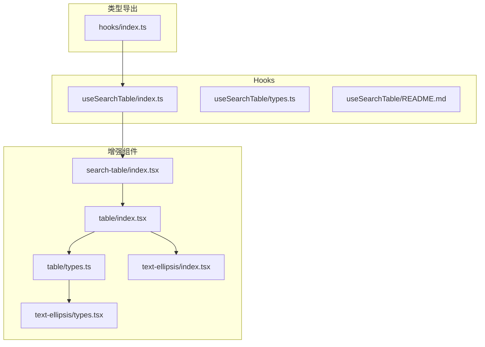
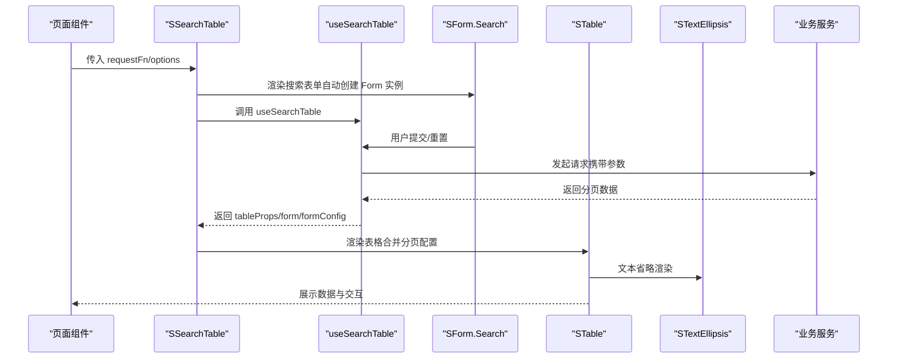
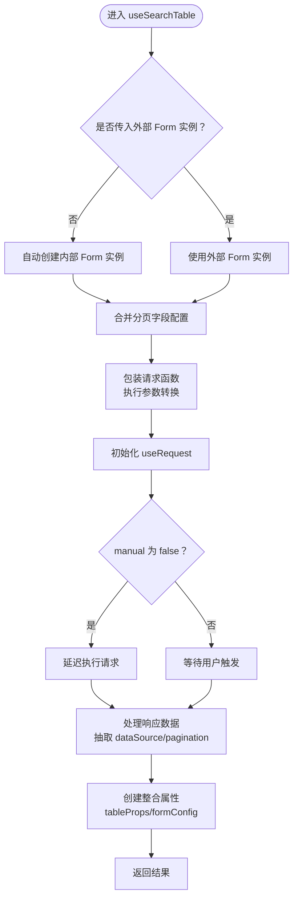
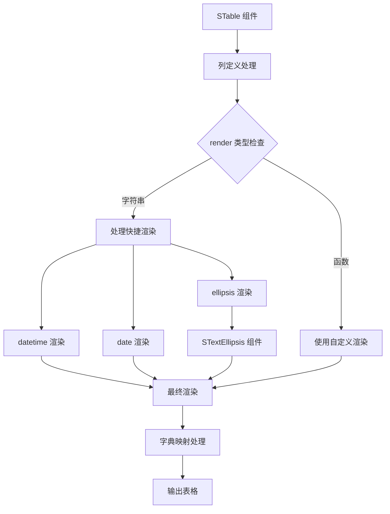
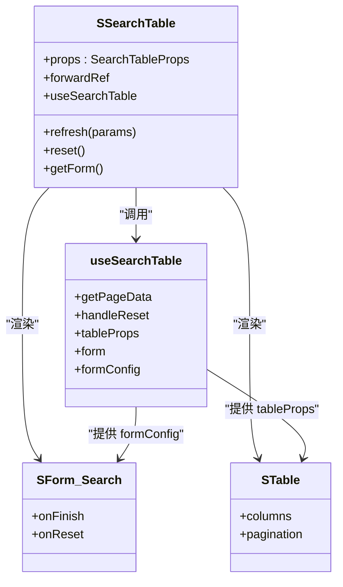
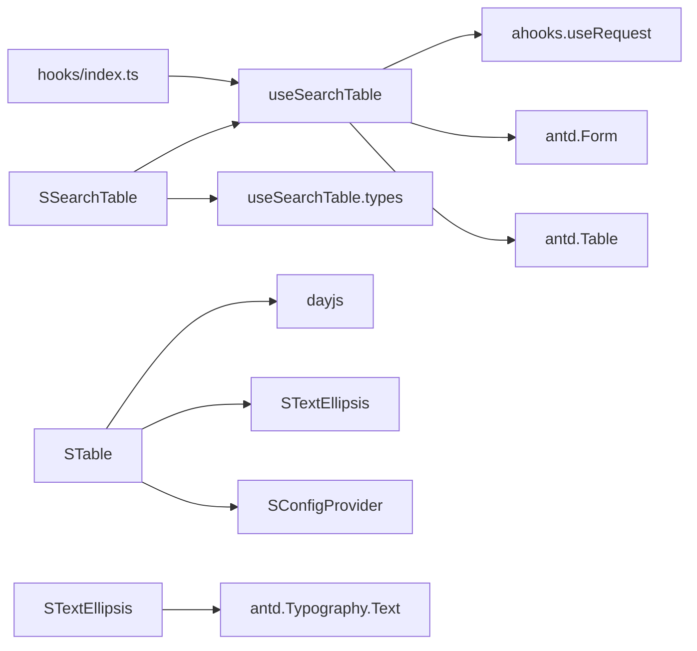

# 表格相关 Hooks

<cite>
**本文引用的文件**
- [useSearchTable/index.ts](file://src/hooks/useSearchTable/index.ts)
- [useSearchTable/types.ts](file://src/hooks/useSearchTable/types.ts)
- [useSearchTable/README.md](file://src/hooks/useSearchTable/README.md)
- [hooks/index.ts](file://src/hooks/index.ts)
- [search-table/index.tsx](file://src/components/search-table/index.tsx)
- [search-table/types.ts](file://src/components/search-table/types.ts)
- [search-table/index.md](file://src/components/search-table/index.md)
- [search-table/demos/base.tsx](file://src/components/search-table/demos/base.tsx)
- [search-table/demos/advanced.tsx](file://src/components/search-table/demos/advanced.tsx)
- [table/index.tsx](file://src/components/table/index.tsx)
- [table/types.ts](file://src/components/table/types.ts)
- [table/constant.ts](file://src/components/table/constant.ts)
- [table/index.md](file://src/components/table/index.md)
- [table/demos/table-cell-ellipsis.tsx](file://src/components/table/demos/table-cell-ellipsis.tsx)
- [table/demos/table-dict.tsx](file://src/components/table/demos/table-dict.tsx)
- [text-ellipsis/index.tsx](file://src/components/text-ellipsis/index.tsx)
- [text-ellipsis/types.tsx](file://src/components/text-ellipsis/types.tsx)
</cite>

## 更新摘要

**所做更改**

- 新增 STable 组件类型定义增强说明，包括 RenderType 枚举和 dictKey 属性
- 新增 STextEllipsis 文本省略组件功能说明
- 更新架构总览，反映 STable 组件的增强功能
- 更新详细组件分析，增加 STable 的新特性说明
- 更新依赖关系分析，包含 STable 和 STextEllipsis 组件
- 更新故障排查指南，增加 STable 相关问题排查
- 更新结论部分，强调 STable 组件的增强功能和 useSearchTable 的完整性

## 目录

1. [简介](#简介)
2. [项目结构](#项目结构)
3. [核心组件](#核心组件)
4. [架构总览](#架构总览)
5. [详细组件分析](#详细组件分析)
6. [依赖关系分析](#依赖关系分析)
7. [性能考量](#性能考量)
8. [故障排查指南](#故障排查指南)
9. [结论](#结论)
10. [附录](#附录)

## 简介

本文件聚焦于当前可用的表格相关 Hooks：useSearchTable。该 Hook 是搜索表格系统的核心实现，提供统一的表格状态管理、分页字段映射、请求/响应参数转换能力。同时，STable 表格组件也进行了重大增强，支持 RenderType 枚举快捷渲染、dictKey 字典映射和 STextEllipsis 文本省略功能。文档将从架构、数据流、处理逻辑、集成点、错误处理到性能优化给出系统性说明，并提供可直接参考的使用示例路径与最佳实践。

**重要更新** 项目已完全移除了对 useSTable 钩子系统的依赖，目前仅提供 useSearchTable 作为表格相关功能的唯一实现。同时，STable 组件获得了显著的功能增强。

## 项目结构

围绕当前搜索表格 Hook 和增强的 STable 组件的关键文件组织如下：

- Hooks 实现：src/hooks/useSearchTable（当前唯一实现）
- 组件增强：src/components/table（STable 组件类型定义和实现）
- 文本省略：src/components/text-ellipsis（STextEllipsis 组件）
- 组件集成：src/components/search-table（基于当前 Hook 重构）
- 类型定义：hooks/index.ts 导出当前 Hook；useSearchTable/types.ts 提供完整的接口约束
- 示例演示：search-table/demos 和 table/demos 下的基础与高级示例

**图表来源**

- [useSearchTable/index.ts](file://src/hooks/useSearchTable/index.ts#L1-L193)
- [useSearchTable/types.ts](file://src/hooks/useSearchTable/types.ts#L1-L73)
- [useSearchTable/README.md](file://src/hooks/useSearchTable/README.md#L1-L286)
- [hooks/index.ts](file://src/hooks/index.ts#L9-L24)
- [search-table/index.tsx](file://src/components/search-table/index.tsx#L1-L58)
- [table/index.tsx](file://src/components/table/index.tsx#L1-L117)
- [table/types.ts](file://src/components/table/types.ts#L1-L75)
- [text-ellipsis/index.tsx](file://src/components/text-ellipsis/index.tsx#L1-L45)

**章节来源**

- [hooks/index.ts](file://src/hooks/index.ts#L1-L26)

## 核心组件

- useSearchTable：当前唯一的搜索表格 Hook，提供完整的表单联动、查询参数处理、分页控制与数据刷新机制。支持自动创建 Form 实例、参数转换、响应数据转换、错误处理和性能优化。
- SSearchTable：基于当前 Hook 重构的容器组件，提供更简洁的 API 和更好的类型安全。
- STable：增强的表格组件，支持 RenderType 枚举快捷渲染、dictKey 字典映射和 STextEllipsis 文本省略功能。
- STextEllipsis：专门的文本省略组件，支持宽度限制和 tooltip 提示。

**重要更新** 完全移除了对 useSTable 的依赖，所有搜索表格功能都由 useSearchTable 提供。STable 组件获得了显著的功能增强。

**章节来源**

- [useSearchTable/index.ts](file://src/hooks/useSearchTable/index.ts#L15-L193)
- [useSearchTable/types.ts](file://src/hooks/useSearchTable/types.ts#L23-L73)
- [search-table/index.tsx](file://src/components/search-table/index.tsx#L7-L58)
- [table/index.tsx](file://src/components/table/index.tsx#L23-L117)
- [table/types.ts](file://src/components/table/types.ts#L14-L44)

## 架构总览

当前的 useSearchTable 与组件层的协作关系以及 STable 组件的增强功能如下：

**图表来源**

- [search-table/index.tsx](file://src/components/search-table/index.tsx#L19-L48)
- [useSearchTable/index.ts](file://src/hooks/useSearchTable/index.ts#L15-L193)
- [useSearchTable/types.ts](file://src/hooks/useSearchTable/types.ts#L47-L73)
- [table/index.tsx](file://src/components/table/index.tsx#L64-L97)

## 详细组件分析

### useSearchTable 组件分析

- 功能定位
  - 当前唯一的搜索表格 Hook，专为搜索场景设计，提供完整的表单联动、请求触发、分页配置与数据源抽取。
  - 支持自动创建 Form 实例、手动传入 Form 实例、参数转换、响应数据转换、错误处理和性能优化。
  - 新增 tableProps、formConfig 等便捷属性，简化组件使用。
- 关键参数
  - requestFn：请求函数，接收参数并返回分页数据。
  - options.form：可选的外部 Form 实例，支持手动传入。
  - options.extraParams：额外固定参数，合并到每次请求。
  - options.manual：是否手动触发请求，默认 false（自动请求）。
  - options.dispatchParams：参数派发器，对请求参数进行最终加工。
  - options.serviceProps：透传给 useRequest 的配置（如 ready）。
  - options.paginationFields：分页字段映射配置，默认 {pageNum/pageSize/totalSize/dataList}。
  - options.transformRequestParams：请求参数转换函数。
  - options.transformResponseData：响应数据转换函数。
- 返回值
  - getPageData(params?)：触发请求，支持传入分页参数。
  - handleReset()：重置表单并重新请求。
  - dataSource：从响应中抽取的数据列表。
  - pagination：分页配置（pageNum/pageSize/total 等）。
  - loading：请求加载状态。
  - error：错误信息（新增）。
  - tableProps：整合的表格属性，直接用于 Ant Design Table 组件。
  - form：表单实例，可用于外部组件挂载。
  - formConfig：专门为 SForm.Search 设计的配置对象。
- 数据处理流程
  - 自动创建 Form 实例：如果没有传入外部 form，自动创建内部 Form 实例。
  - 参数合并：从 form.getFieldsValue() 获取表单值，合并 extraParams、options、params。
  - 参数转换：可选的 transformRequestParams 和 transformResponseData。
  - 分页字段映射：支持自定义分页字段配置。
  - 表格属性整合：生成 tableProps、formConfig 等便捷属性。
- 错误处理
  - 新增 error 返回值，直接从 useRequest 获取错误信息。
  - 建议在 requestFn 内部处理错误并返回标准结构，以便上层组件统一展示。
- 性能与最佳实践
  - 使用 useCallback 包裹 getPageData/handleReset，减少子组件重渲染。
  - 通过 useMemo 抽取 dataSource、pagination、tableProps、formConfig，避免重复计算。
  - 合理设置 manual 与 ready，避免无意义的初始化请求。
  - 使用 dispatchParams 对复杂查询参数进行集中处理，减少重复逻辑。

**图表来源**

- [useSearchTable/index.ts](file://src/hooks/useSearchTable/index.ts#L15-L193)

**章节来源**

- [useSearchTable/index.ts](file://src/hooks/useSearchTable/index.ts#L15-L193)
- [useSearchTable/types.ts](file://src/hooks/useSearchTable/types.ts#L23-L73)
- [useSearchTable/README.md](file://src/hooks/useSearchTable/README.md#L62-L286)

### STable 组件增强分析

- 功能定位
  - 增强的表格组件，继承 Ant Design Table 的全部功能，扩展了快捷渲染、字典映射和文本省略能力。
  - 支持 RenderType 枚举快捷渲染（datetime、date、ellipsis）。
  - 支持 dictKey 字典映射，配合 SConfigProvider 的 globalDict 自动转换。
  - 支持序号列显示和分页计算。
- RenderType 枚举
  - datetime：渲染为日期时间格式（'YYYY-MM-DD HH:mm:ss'）。
  - date：渲染为日期格式（'YYYY-MM-DD'）。
  - ellipsis：超出省略显示，需要配合列宽度使用。
- SColumnsType 接口增强
  - 新增 dictKey 属性，支持字典映射。
  - render 属性支持字符串快捷类型和标准 render 函数。
  - 继承 ColumnGroupType 和 Omit<ColumnType> 的完整类型支持。
- 文本省略功能
  - 通过 STextEllipsis 组件实现智能省略显示。
  - 支持宽度限制和 tooltip 提示。
  - 自动计算省略内容和展开行为。
- 使用场景
  - 快速实现日期时间显示、文本省略、字典值回显等功能。
  - 减少重复的 render 函数编写，提升开发效率。

**图表来源**

- [table/index.tsx](file://src/components/table/index.tsx#L64-L97)
- [table/types.ts](file://src/components/table/types.ts#L14-L44)

**章节来源**

- [table/index.tsx](file://src/components/table/index.tsx#L23-L117)
- [table/types.ts](file://src/components/table/types.ts#L14-L75)
- [text-ellipsis/index.tsx](file://src/components/text-ellipsis/index.tsx#L8-L45)

### 组件集成：SSearchTable

- 作用
  - 基于当前 useSearchTable Hook 重构的容器组件，提供更简洁的 API 和更好的类型安全。
- 关键点
  - 自动创建并管理 useSearchTable 实例，无需手动组合组件。
  - 提供 refresh、reset、getForm 等便捷方法。
  - 内置 SCard 包裹和标题配置，统一样式。
  - 完整的 TypeScript 类型支持，更好的开发体验。
- 使用场景
  - 快速搭建带搜索条件的表格页面，提供最简 API。

**图表来源**

- [search-table/index.tsx](file://src/components/search-table/index.tsx#L7-L58)
- [hooks/index.ts](file://src/hooks/index.ts#L19-L24)

**章节来源**

- [search-table/index.tsx](file://src/components/search-table/index.tsx#L7-L58)
- [search-table/types.ts](file://src/components/search-table/types.ts#L22-L48)

## 依赖关系分析

- useSearchTable 依赖 ahooks 的 useRequest，提供请求管理和状态控制。
- useSearchTable 依赖 antd 的 Form 和 Table 组件，提供表单和表格功能。
- SSearchTable 作为容器组件，依赖 useSearchTable Hook 和相关组件。
- STable 组件依赖 dayjs 进行时间格式化，依赖 STextEllipsis 进行文本省略。
- STextEllipsis 组件依赖 Ant Design 的 Typography.Text 进行文本渲染。
- 类型导出通过 hooks/index.ts 汇总，便于外部统一引入。

**重要更新** 移除了对 useSTable 的依赖，完全基于当前的 useSearchTable 实现。新增了 STable 和 STextEllipsis 组件的依赖关系。

**图表来源**

- [useSearchTable/index.ts](file://src/hooks/useSearchTable/index.ts#L1-L3)
- [hooks/index.ts](file://src/hooks/index.ts#L9-L24)
- [search-table/index.tsx](file://src/components/search-table/index.tsx#L4)
- [table/index.tsx](file://src/components/table/index.tsx#L1-L10)
- [text-ellipsis/index.tsx](file://src/components/text-ellipsis/index.tsx#L1-L4)

**章节来源**

- [hooks/index.ts](file://src/hooks/index.ts#L1-L26)

## 性能考量

- useSearchTable
  - 使用 useRef 跟踪首次加载状态，避免重复初始化。
  - 通过 useCallback 包裹 getPageData/handleReset，减少子组件重渲染。
  - 通过 useMemo 抽取 dataSource、pagination、tableProps、formConfig，避免重复计算。
  - 仅在存在转换函数时执行转换，避免不必要的开销。
  - 支持自动创建 Form 实例，减少外部依赖。
- STable 组件优化
  - RenderType 快捷渲染使用 useCallback 缓存，避免重复创建函数。
  - 文本省略功能仅在列宽度存在时启用，减少不必要的组件渲染。
  - 字典映射使用 useCallback 缓存，避免重复查找。
- 错误处理优化
  - 新增 error 返回值，直接从 useRequest 获取错误信息。
  - 建议在 requestFn 内部处理错误并返回标准结构。
- 通用建议
  - 对高频字段（如 pageNum/pageSize）使用稳定引用，减少依赖抖动。
  - 在请求函数内部进行防抖/节流，避免频繁触发。
  - 使用虚拟滚动或懒加载策略处理大数据集。
  - 合理使用 ellipsis 渲染，避免过度使用导致性能问题。

**重要更新** 新增了 STable 组件的性能优化建议和错误处理机制。

## 故障排查指南

- 分页字段不生效
  - 检查 options.paginationFields 是否正确配置 current/pageSize/total/list。
  - 确认响应数据包含对应字段，否则不会触发字段映射。
- 请求参数不符合预期
  - 检查 transformRequestParams 是否正确转换了分页字段。
  - 确认 dispatchParams 是否覆盖了必要的参数。
- 表格不刷新
  - 确认 manual=false 或调用了 getPageData。
  - 检查 form.getFieldsValue() 是否正确获取了表单值。
- 数据为空但分页显示异常
  - 检查响应结构是否符合约定（如 dataList/totalSize 或 list/total）。
  - 确认 pagination 配置是否正确生成。
- 错误处理
  - 检查 error 返回值，确认是否有错误信息。
  - 建议在 requestFn 内部统一抛错并返回标准结构。
- Form 实例问题
  - 如果手动传入 Form 实例，确保正确初始化。
  - 如果使用自动创建的 Form 实例，检查 formConfig 是否正确传递。
- STable 渲染问题
  - RenderType 快捷渲染不生效：检查列定义中的 render 属性是否正确设置。
  - 文本省略不显示：确认列宽度设置且 render 设置为 'ellipsis'。
  - 字典映射不工作：检查 SConfigProvider 是否正确配置 globalDict。
- 性能问题
  - 表格渲染缓慢：检查是否有过多的 ellipsis 渲染，考虑使用虚拟滚动。
  - 内存泄漏：确认使用了 useCallback 和 useMemo 进行缓存。

**重要更新** 新增了 STable 组件相关的故障排查指南和性能问题排查。

**章节来源**

- [useSearchTable/index.ts](file://src/hooks/useSearchTable/index.ts#L83-L160)
- [useSearchTable/types.ts](file://src/hooks/useSearchTable/types.ts#L47-L73)
- [table/index.tsx](file://src/components/table/index.tsx#L64-L97)

## 结论

- useSearchTable 是当前唯一的搜索表格解决方案，完全替代了原有的 useSTable 依赖。
- 提供了更简洁的 API、更完善的类型支持和更好的开发体验。
- 支持自动创建 Form 实例、参数转换、响应数据转换、错误处理和性能优化。
- 与 SSearchTable 组件无缝集成，快速构建可维护的表格页面。
- STable 组件获得了显著的功能增强，包括 RenderType 快捷渲染、dictKey 字典映射和文本省略功能。
- 建议在实际项目中使用当前的 useSearchTable Hook，并遵循参数转换、分页映射与错误处理的最佳实践。
- 推荐充分利用 STable 的新功能，提升开发效率和用户体验。

**重要更新** 强调了 useSearchTable 作为当前唯一解决方案的优势、STable 组件的增强功能和迁移价值。

## 附录

### 使用示例（路径参考）

- 极简用法（推荐）
  - 示例路径：[useSearchTable/README.md](file://src/hooks/useSearchTable/README.md#L64-L105)
  - 关键点：自动创建 Form 实例、使用 formConfig、直接使用 tableProps。
- 手动传入 Form 实例（向后兼容）
  - 示例路径：[useSearchTable/README.md](file://src/hooks/useSearchTable/README.md#L107-L130)
  - 关键点：手动创建 Form 实例、传入 options.form。
- 自定义分页字段
  - 示例路径：[useSearchTable/README.md](file://src/hooks/useSearchTable/README.md#L132-L144)
  - 关键点：配置 paginationFields、支持不同后端字段格式。
- 参数转换
  - 示例路径：[useSearchTable/README.md](file://src/hooks/useSearchTable/README.md#L146-L179)
  - 关键点：transformRequestParams 和 transformResponseData 的使用。
- 完整示例
  - 示例路径：[useSearchTable/README.md](file://src/hooks/useSearchTable/README.md#L181-L271)
  - 关键点：完整的搜索表格实现，包含多种配置选项。
- 基础搜索表格
  - 示例路径：[search-table/demos/base.tsx](file://src/components/search-table/demos/base.tsx#L52-L171)
  - 关键点：SSearchTable 组件的完整使用示例。
- 高级搜索表格（含行选择、展开行、模态框）
  - 示例路径：[search-table/demos/advanced.tsx](file://src/components/search-table/demos/advanced.tsx#L80-L358)
  - 关键点：复杂搜索条件、批量操作、展开行展示等高级功能。
- STable 文本省略示例
  - 示例路径：[table/demos/table-cell-ellipsis.tsx](file://src/components/table/demos/table-cell-ellipsis.tsx#L1-L114)
  - 关键点：ellipsis 渲染和列宽度设置。
- STable 字典映射示例
  - 示例路径：[table/demos/table-dict.tsx](file://src/components/table/demos/table-dict.tsx#L1-L52)
  - 关键点：dictKey 配置和全局字典设置。

**章节来源**

- [useSearchTable/README.md](file://src/hooks/useSearchTable/README.md#L62-L286)
- [search-table/demos/base.tsx](file://src/components/search-table/demos/base.tsx#L52-L171)
- [search-table/demos/advanced.tsx](file://src/components/search-table/demos/advanced.tsx#L80-L358)
- [table/demos/table-cell-ellipsis.tsx](file://src/components/table/demos/table-cell-ellipsis.tsx#L1-L114)
- [table/demos/table-dict.tsx](file://src/components/table/demos/table-dict.tsx#L1-L52)

### 返回值与事件回调说明

- useSearchTable
  - 返回值结构：getPageData、handleReset、dataSource、pagination、loading、error、tableProps、form、formConfig。
  - 重要：新增 error 返回值，提供完整的错误处理能力。
  - 重要：新增 tableProps 和 formConfig，提供更便捷的使用方式。
- STable
  - 列定义：支持 dictKey 字典映射和 RenderType 快捷渲染。
  - 序号列：通过 isSeq 属性启用，支持分页计算。
  - 文本省略：通过 ellipsis 渲染和列宽度实现。
- 事件回调
  - onFinish/onReset 绑定到 SForm.Search，通过 formConfig 提供。
  - onChange 事件由 STable 处理，useSearchTable 提供分页配置。

**重要更新** 新增了 STable 组件的返回值和事件回调说明，以及 error 返回值的详细说明。

**章节来源**

- [useSearchTable/index.ts](file://src/hooks/useSearchTable/index.ts#L179-L193)
- [useSearchTable/types.ts](file://src/hooks/useSearchTable/types.ts#L47-L73)
- [table/types.ts](file://src/components/table/types.ts#L46-L75)
