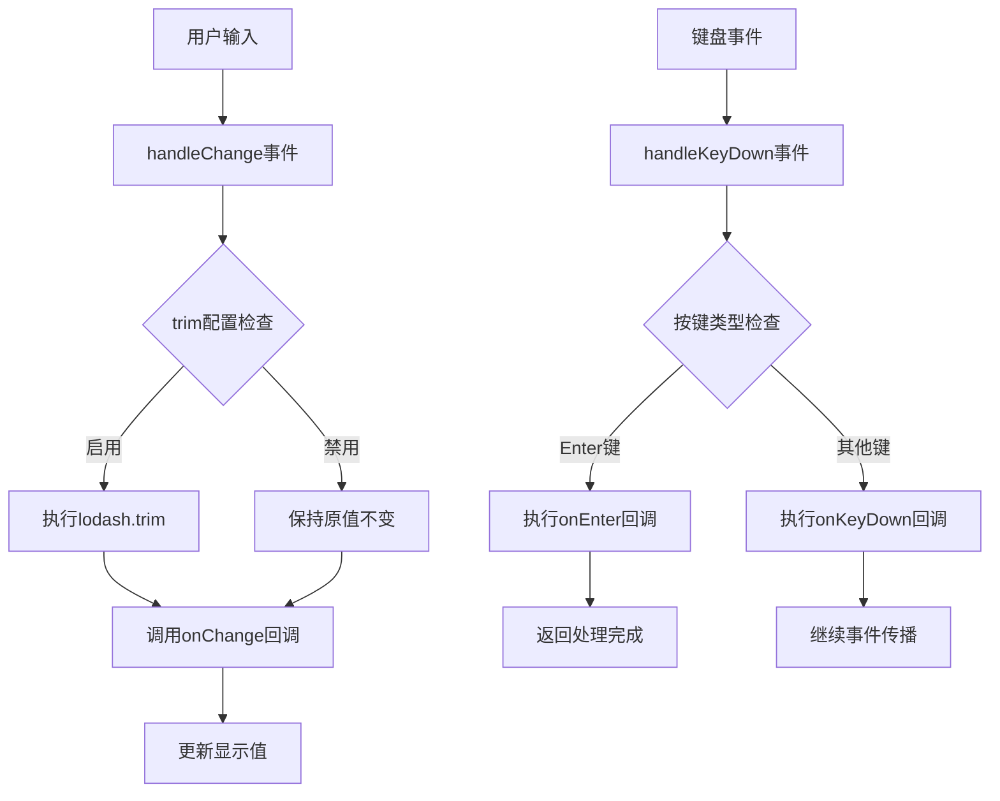
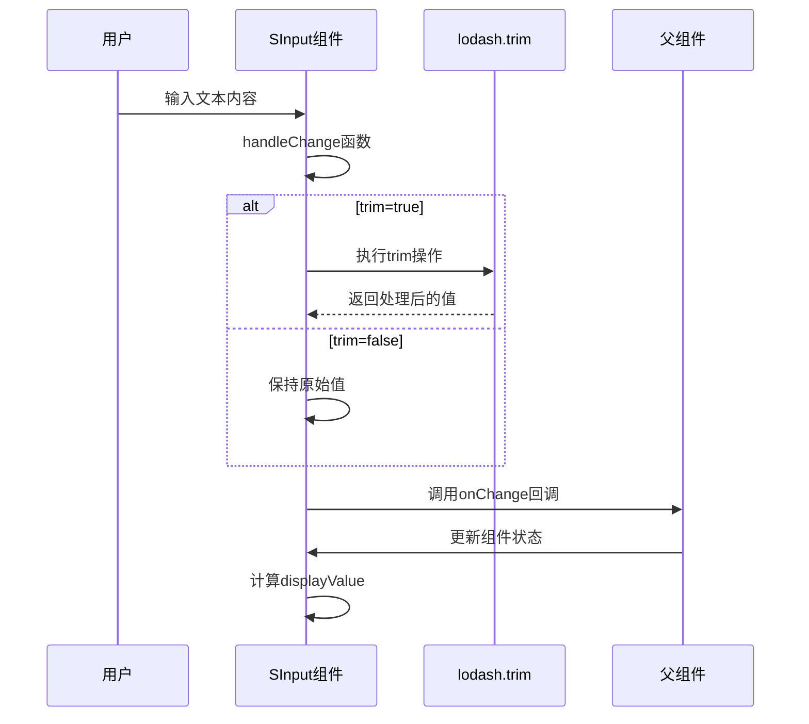
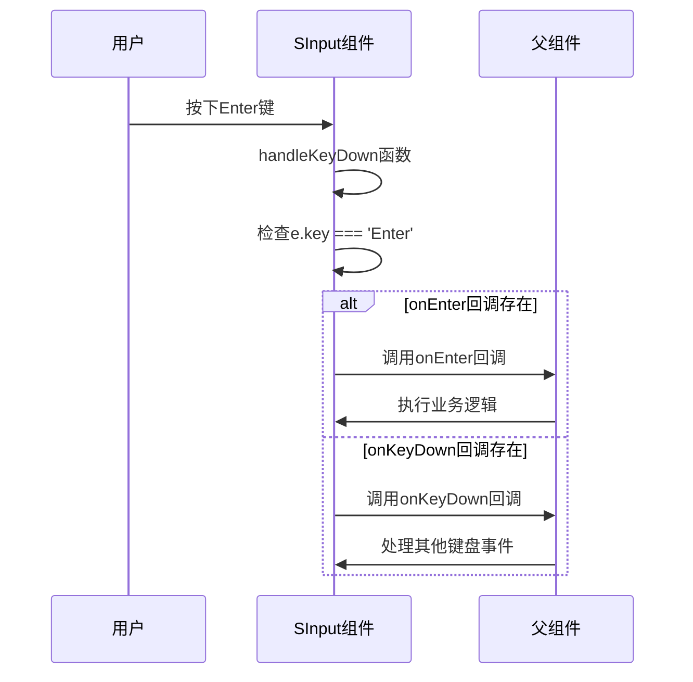
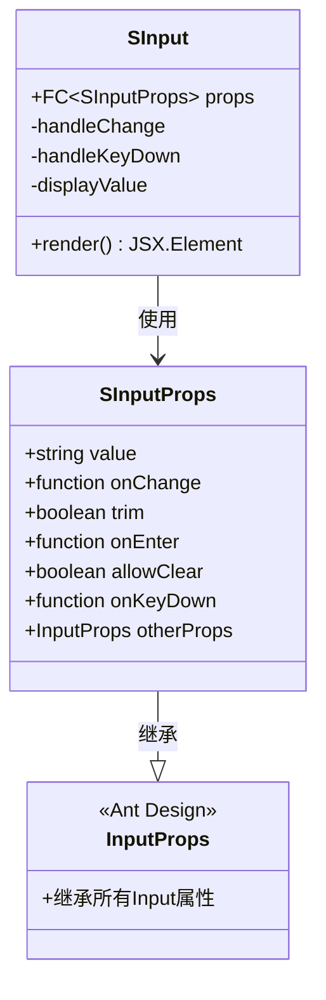

# 输入框组件

<cite>
**本文档引用的文件**
- [src/components/input/index.tsx](file://src/components/input/index.tsx)
- [src/components/input/types.ts](file://src/components/input/types.ts)
- [src/components/input/index.md](file://src/components/input/index.md)
- [ai/components/SInput.md](file://ai/components/SInput.md)
- [src/components/index.ts](file://src/components/index.ts)
- [src/components/form/types.ts](file://src/components/form/types.ts)
- [src/components/form/constants.tsx](file://src/components/form/constants.tsx)
- [package.json](file://package.json)
</cite>

## 更新摘要

**所做更改**

- 新增了详细的 SInput 组件功能说明和使用指南
- 完善了 trim 和 onEnter 等核心特性的技术实现分析
- 增加了完整的 API 参考和类型定义说明
- 补充了实际应用场景和最佳实践指导

## 目录

1. [简介](#简介)
2. [核心特性](#核心特性)
3. [技术实现](#技术实现)
4. [API 参考](#api参考)
5. [使用示例](#使用示例)
6. [应用场景](#应用场景)
7. [最佳实践](#最佳实践)
8. [故障排除](#故障排除)
9. [总结](#总结)

## 简介

SInput 是基于 Ant Design Input 组件封装的增强型输入框组件，专为现代 Web 应用的输入场景而设计。该组件在保持与 Ant Design 完全兼容的基础上，提供了智能化的空格处理和回车键事件管理功能，显著提升了用户体验和开发效率。

作为 sdesign 设计系统的核心基础组件之一，SInput 组件为各种表单输入场景提供了统一的解决方案，支持从简单的文本输入到复杂的搜索功能等多种使用模式。

## 核心特性

### 智能空格处理

- **自动 trim 功能**：可配置是否自动去除输入值的前后空格
- **显示值优化**：在需要时进行 trim 操作但不影响原始值
- **用户体验提升**：避免用户输入时因空格导致的误判

### 回车键事件管理

- **onEnter 回调**：专门的回车键事件处理机制
- **事件优先级**：回车键事件优先于通用键盘事件处理
- **值传递机制**：自动传递当前输入值给回调函数

### 类型安全保证

- **完整 TS 支持**：提供完整的 TypeScript 类型定义
- **接口继承**：完全继承 Ant Design Input 的所有属性
- **onChange 优化**：直接返回字符串值而非事件对象

## 技术实现

### 核心架构设计



**图表来源**

- [src/components/input/index.tsx:16-39](file://src/components/input/index.tsx#L16-L39)

### 关键实现细节

#### 空格处理机制

组件采用了智能的空格处理策略，确保在不影响原始数据的前提下优化显示效果：



**图表来源**

- [src/components/input/index.tsx:16-27](file://src/components/input/index.tsx#L16-L27)
- [src/components/input/index.tsx:41-42](file://src/components/input/index.tsx#L41-L42)

#### 回车键事件处理

组件提供了专门的回车键事件处理机制，确保事件处理的准确性和及时性：



**图表来源**

- [src/components/input/index.tsx:29-39](file://src/components/input/index.tsx#L29-L39)

**章节来源**

- [src/components/input/index.tsx:7-56](file://src/components/input/index.tsx#L7-L56)

## API 参考

### 接口定义

SInputProps 接口完全继承了 Ant Design Input 的所有属性，并添加了特定的功能扩展：

| 属性名     | 类型     | 默认值 | 描述                             |
| ---------- | -------- | ------ | -------------------------------- |
| value      | string   | -      | 输入框当前值                     |
| onChange   | function | -      | 值变更回调函数，直接返回字符串值 |
| trim       | boolean  | false  | 是否自动去除前后空格             |
| onEnter    | function | -      | 回车键回调函数，接收当前输入值   |
| allowClear | boolean  | true   | 是否显示清除按钮                 |
| onKeyDown  | function | -      | 键盘事件回调函数                 |

### 继承关系



**图表来源**

- [src/components/input/types.ts:13-24](file://src/components/input/types.ts#L13-L24)

**章节来源**

- [src/components/input/types.ts:3-24](file://src/components/input/types.ts#L3-L24)

## 使用示例

### 基础用法

```typescript
// 简单的文本输入
<SInput placeholder="请输入内容" />

// 启用自动trim功能
<SInput
  trim
  placeholder="自动去除空格"
  onChange={(value) => console.log(value)}
/>

// 回车键触发搜索
<SInput
  onEnter={(value) => search(value)}
  placeholder="按回车搜索"
/>
```

### 高级用法

```typescript
// 组合使用多个特性
<SInput
  trim
  allowClear
  onEnter={(value) => handleSearch(value)}
  onChange={(value) => validateInput(value)}
  placeholder="综合示例"
/>
```

## 应用场景

### 适用场景

- **文本输入优化**：需要自动去除首尾空格的文本输入场景
- **搜索功能**：需要回车键快速触发搜索的场景
- **表单验证**：需要实时处理输入值的表单场景
- **快捷操作**：通过键盘快捷键提升用户体验的场景

### 不适用场景

- **多行文本输入**：应使用 Ant Design Input.TextArea 组件
- **密码输入**：应使用 AntDesign Input.Password 组件
- **复杂富文本编辑**：应使用专业的富文本编辑器

**章节来源**

- [ai/components/SInput.md:3-11](file://ai/components/SInput.md#L3-L11)

## 最佳实践

### 性能优化建议

1. **合理使用 trim 功能**：仅在需要时启用 trim，避免不必要的字符串处理
2. **事件处理优化**：使用 useCallback 优化 onEnter 和 onChange 回调
3. **条件渲染**：根据实际需求选择是否显示清除按钮

### 开发规范

1. **类型安全**：充分利用 TypeScript 类型定义确保类型安全
2. **事件处理**：遵循 onChange 直接返回字符串值的设计原则
3. **用户体验**：合理配置 allowClear 和 trim 参数提升用户体验

## 故障排除

### 常见问题及解决方案

#### 问题 1：空格处理异常

**症状**：输入值中的空格没有被正确处理
**解决方案**：

- 确认`trim`属性设置为`true`
- 检查父组件的`onChange`回调是否正确处理值

#### 问题 2：回车键事件未触发

**症状**：按下 Enter 键没有触发`onEnter`回调
**解决方案**：

- 确认`onEnter`属性已正确传入
- 检查是否有其他键盘事件阻止了默认行为

#### 问题 3：显示值与实际值不一致

**症状**：显示的值与传入的值存在差异
**解决方案**：

- 检查`trim`配置对显示值的影响
- 确认值的传递和接收流程

**章节来源**

- [src/components/input/index.tsx:20-22](file://src/components/input/index.tsx#L20-L22)
- [src/components/input/index.tsx:30-34](file://src/components/input/index.tsx#L30-L34)

## 总结

SInput 组件作为 sdesign 设计系统的核心基础组件，通过简洁的 API 设计和强大的功能扩展，为开发者提供了优秀的输入框解决方案。其设计理念体现了以下特点：

1. **易用性**：简洁的 API 设计，易于理解和使用
2. **扩展性**：在保持向后兼容的同时提供新功能
3. **性能**：通过合理的优化策略确保良好的性能表现
4. **类型安全**：完整的 TypeScript 支持，提供良好的开发体验

该组件不仅满足了基本的输入需求，还通过智能化的空格处理和事件管理机制，提升了用户的输入体验，是现代前端开发中不可或缺的基础组件。其灵活的配置选项和完善的类型定义，使其能够适应各种复杂的业务场景需求。
