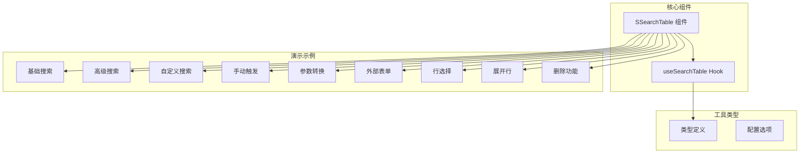
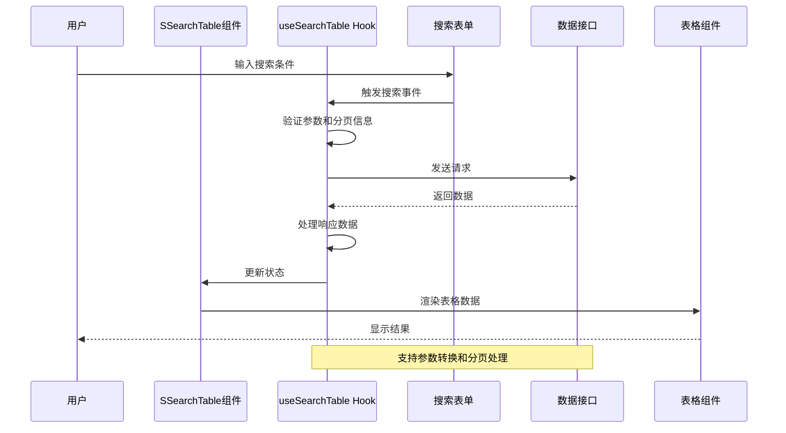
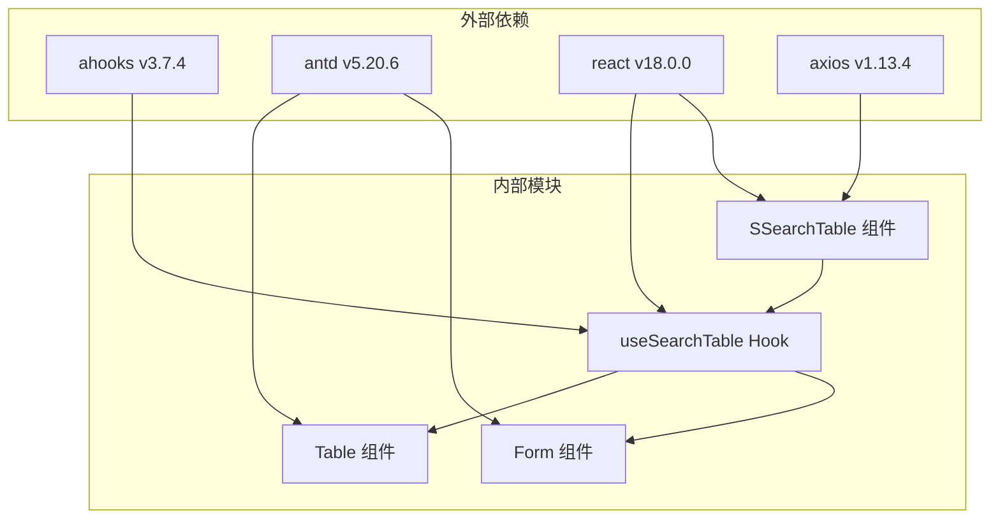

# 搜索表格演示

<cite>
**本文档引用的文件**
- [src/components/search-table/index.tsx](file://src/components/search-table/index.tsx)
- [src/hooks/useSearchTable/index.ts](file://src/hooks/useSearchTable/index.ts)
- [src/hooks/useSearchTable/types.ts](file://src/hooks/useSearchTable/types.ts)
- [src/components/search-table/types.ts](file://src/components/search-table/types.ts)
- [src/components/search-table/index.md](file://src/components/search-table/index.md)
- [src/hooks/useSearchTable/README.md](file://src/hooks/useSearchTable/README.md)
- [src/components/search-table/demos/base.tsx](file://src/components/search-table/demos/base.tsx)
- [src/components/search-table/demos/advanced.tsx](file://src/components/search-table/demos/advanced.tsx)
- [src/components/search-table/demos/custom-search.tsx](file://src/components/search-table/demos/custom-search.tsx)
- [src/components/search-table/demos/manual-trigger.tsx](file://src/components/search-table/demos/manual-trigger.tsx)
- [src/components/search-table/demos/with-parameter-transform.tsx](file://src/components/search-table/demos/with-parameter-transform.tsx)
- [src/components/search-table/demos/with-external-form.tsx](file://src/components/search-table/demos/with-external-form.tsx)
- [src/components/search-table/demos/with-row-selection.tsx](file://src/components/search-table/demos/with-row-selection.tsx)
- [src/components/search-table/demos/with-expanded-row.tsx](file://src/components/search-table/demos/with-expanded-row.tsx)
- [src/components/search-table/demos/with-delete.tsx](file://src/components/search-table/demos/with-delete.tsx)
- [package.json](file://package.json)
</cite>

## 更新摘要

**所做更改**

- 更新了 SSearchTable 组件的架构分析，反映最新的实现细节
- 增强了 useSearchTable Hook 的功能说明和使用指南
- 完善了各种演示示例的详细分析和最佳实践建议
- 更新了依赖关系和性能优化策略
- 增加了故障排除指南的实用解决方案

## 目录

1. [简介](#简介)
2. [项目结构](#项目结构)
3. [核心组件](#核心组件)
4. [架构概览](#架构概览)
5. [详细组件分析](#详细组件分析)
6. [依赖分析](#依赖分析)
7. [性能考虑](#性能考虑)
8. [故障排除指南](#故障排除指南)
9. [结论](#结论)

## 简介

搜索表格演示项目是一个基于 React 和 Ant Design 的企业级组件库，专注于提供强大的搜索表格功能。该项目通过 `SSearchTable` 组件和 `useSearchTable` Hook，为开发者提供了简洁而功能丰富的数据查询和展示解决方案。

该组件库的核心优势在于其高度可定制性和易用性，支持多种搜索场景、复杂的分页处理、参数转换以及丰富的表格功能集成。最新版本进一步优化了组件的封装性和扩展性，为开发者提供了更加完善的开发体验。

## 项目结构

项目采用模块化组织结构，主要包含以下核心目录：

**图表来源**

- [src/components/search-table/index.tsx:1-58](file://src/components/search-table/index.tsx#L1-L58)
- [src/hooks/useSearchTable/index.ts:1-193](file://src/hooks/useSearchTable/index.ts#L1-L193)

**章节来源**

- [src/components/search-table/index.md:1-128](file://src/components/search-table/index.md#L1-L128)
- [package.json:1-121](file://package.json#L1-L121)

## 核心组件

### SSearchTable 组件

`SSearchTable` 是整个搜索表格系统的核心组件，它基于 `useSearchTable` Hook 进行封装，提供了完整的搜索表格功能。

#### 主要特性

1. **自动数据加载**：组件挂载时自动触发数据请求
2. **表单集成**：内置搜索表单，支持多种输入类型
3. **表格渲染**：自动处理分页、排序和数据展示
4. **响应式设计**：支持滚动和自适应布局
5. **类型安全**：完整的 TypeScript 类型支持
6. **Ref 控制**：提供外部控制方法（refresh、reset、getForm）

#### 组件 Props

| 属性名     | 描述                                           | 类型                           | 默认值 |
| ---------- | ---------------------------------------------- | ------------------------------ | ------ |
| headTitle  | 页面标题配置                                   | STitleProps                    | 无     |
| tableTitle | 表格区域标题配置                               | STitleProps                    | 无     |
| requestFn  | 请求函数，用于获取表格数据                     | `(data?: any) => Promise<any>` | 必填   |
| options    | useSearchTable 的配置选项                      | useSearchTableOptions          | `{}`   |
| formProps  | 搜索表单配置                                   | SearchProps                    | 无     |
| tableProps | 表格配置，会合并到 useSearchTable 返回的 props | STableProps                    | 无     |

**章节来源**

- [src/components/search-table/types.ts:59-79](file://src/components/search-table/types.ts#L59-L79)
- [src/components/search-table/index.md:56-76](file://src/components/search-table/index.md#L56-L76)

### useSearchTable Hook

`useSearchTable` 是一个强大的自定义 Hook，负责处理搜索表格的所有数据逻辑。

#### 核心功能

1. **数据请求管理**：基于 `ahooks` 的 `useRequest` 实现
2. **分页参数处理**：支持自定义分页字段映射
3. **参数转换**：请求参数和响应数据的双向转换
4. **表单集成**：与 Ant Design Form 的无缝集成
5. **状态管理**：完整的加载状态和错误处理
6. **性能优化**：支持防抖和缓存机制

**章节来源**

- [src/hooks/useSearchTable/index.ts:15-193](file://src/hooks/useSearchTable/index.ts#L15-L193)
- [src/hooks/useSearchTable/README.md:1-286](file://src/hooks/useSearchTable/README.md#L1-L286)

## 架构概览

**图表来源**

- [src/components/search-table/index.tsx:19-51](file://src/components/search-table/index.tsx#L19-L51)
- [src/hooks/useSearchTable/index.ts:72-116](file://src/hooks/useSearchTable/index.ts#L72-L116)

## 详细组件分析

### 基础搜索演示

基础搜索演示展示了最简单的使用方式，适合初学者快速上手。

#### 关键实现要点

1. **数据模拟**：使用 `generateMockData` 函数生成测试数据
2. **表单配置**：定义了完整的搜索表单项
3. **表格列定义**：设置了基本的表格列配置
4. **分页字段映射**：自定义了分页字段名称

**章节来源**

- [src/components/search-table/demos/base.tsx:1-169](file://src/components/search-table/demos/base.tsx#L1-L169)

### 高级搜索演示

高级搜索演示展示了复杂场景下的使用方式，包含更多功能特性。

#### 主要功能

1. **复杂数据结构**：支持嵌套对象和数组数据
2. **批量操作**：实现了行选择和批量处理功能
3. **模态框交互**：使用 Ant Design Modal 进行详情展示
4. **扩展行功能**：支持表格行的展开显示

**章节来源**

- [src/components/search-table/demos/advanced.tsx:1-358](file://src/components/search-table/demos/advanced.tsx#L1-L358)

### 自定义分页字段演示

此演示展示了如何处理不同后端 API 的分页字段命名差异。

#### 参数映射配置

| 后端字段 | 组件默认值  | 自定义映射 |
| -------- | ----------- | ---------- |
| 当前页码 | `pageNum`   | `current`  |
| 每页数量 | `pageSize`  | `pageSize` |
| 总记录数 | `totalSize` | `total`    |
| 数据列表 | `dataList`  | `list`     |

**章节来源**

- [src/components/search-table/demos/custom-search.tsx:1-117](file://src/components/search-table/demos/custom-search.tsx#L1-L117)

### 手动触发搜索演示

手动触发模式适用于需要精确控制搜索时机的场景。

#### 使用场景

1. **表单验证**：先验证表单再触发搜索
2. **条件筛选**：根据特定条件决定是否搜索
3. **性能优化**：避免频繁的自动搜索请求

**章节来源**

- [src/components/search-table/demos/manual-trigger.tsx:1-117](file://src/components/search-table/demos/manual-trigger.tsx#L1-L117)

### 参数转换演示

参数转换功能允许在请求发送前后对数据进行处理。

#### 转换类型

1. **请求参数转换**：修改发送到服务器的参数格式
2. **响应数据转换**：处理服务器返回的数据结构
3. **字段重命名**：适配不同 API 的字段命名规范

**章节来源**

- [src/components/search-table/demos/with-parameter-transform.tsx:1-151](file://src/components/search-table/demos/with-parameter-transform.tsx#L1-L151)

### 外部表单实例演示

此演示展示了如何使用外部创建的 Form 实例，提供更大的灵活性。

#### 外部控制功能

1. **表单值设置**：通过外部表单实例设置默认值
2. **表单验证**：在搜索前进行表单验证
3. **搜索触发**：通过 ref 方法手动触发搜索

**章节来源**

- [src/components/search-table/demos/with-external-form.tsx:1-194](file://src/components/search-table/demos/with-external-form.tsx#L1-L194)

### 行选择功能演示

行选择功能支持多选操作和批量处理。

#### 选择功能特性

1. **单选和多选**：支持多种选择模式
2. **批量操作**：对选中的行执行批量操作
3. **选择状态管理**：维护选中行的状态

**章节来源**

- [src/components/search-table/demos/with-row-selection.tsx:1-190](file://src/components/search-table/demos/with-row-selection.tsx#L1-L190)

### 展开行功能演示

展开行功能允许在表格中显示更详细的信息。

#### 展开行配置

1. **自定义内容**：可以显示任意类型的展开内容
2. **条件展开**：可以根据条件决定是否允许展开
3. **样式定制**：支持展开行的样式定制

**章节来源**

- [src/components/search-table/demos/with-expanded-row.tsx:1-183](file://src/components/search-table/demos/with-expanded-row.tsx#L1-L183)

### 删除功能演示

删除功能演示了如何在删除数据后刷新列表。

#### 删除流程

1. **单个删除**：支持逐个删除记录
2. **批量删除**：支持同时删除多个记录
3. **列表刷新**：删除后自动刷新表格数据

**章节来源**

- [src/components/search-table/demos/with-delete.tsx:1-244](file://src/components/search-table/demos/with-delete.tsx#L1-L244)

## 依赖分析

### 核心依赖关系

**图表来源**

- [package.json:52-101](file://package.json#L52-L101)

### 版本兼容性

| 依赖包    | 版本要求 | 兼容范围 |
| --------- | -------- | -------- |
| react     | >=18.0.0 | <19.0.0  |
| react-dom | >=18.0.0 | <19.0.0  |
| antd      | >=5.20.6 | <6.0.0   |
| ahooks    | ^3.7.4   | 最新版本 |
| axios     | ^1.13.4  | 最新版本 |

**章节来源**

- [package.json:93-101](file://package.json#L93-L101)

## 性能考虑

### 优化策略

1. **懒加载**：组件按需加载，减少初始包大小
2. **缓存机制**：利用 `ahooks` 的缓存功能提升性能
3. **虚拟滚动**：对于大量数据时考虑使用虚拟滚动
4. **防抖处理**：对频繁触发的搜索进行防抖优化
5. **状态记忆**：使用 `useMemo` 和 `useCallback` 优化渲染性能

### 内存管理

1. **清理定时器**：组件卸载时自动清理定时器
2. **取消请求**：组件卸载时取消未完成的请求
3. **状态清理**：合理管理组件状态，避免内存泄漏

## 故障排除指南

### 常见问题及解决方案

#### 1. 数据格式不匹配

**问题描述**：后端返回的数据格式与组件期望不符

**解决方案**：

- 使用 `transformResponseData` 进行数据格式转换
- 配置正确的 `paginationFields` 映射
- 验证数据结构是否符合预期

#### 2. 搜索无响应

**问题描述**：表单提交后表格不更新

**解决方案**：

- 检查 `onFinish` 和 `onReset` 事件绑定
- 确认 `requestFn` 返回正确的数据结构
- 验证 `formConfig` 配置是否正确传递

#### 3. 分页显示异常

**问题描述**：分页组件显示不正确或无法跳转

**解决方案**：

- 验证后端分页参数的字段名称
- 检查 `paginationFields` 配置是否正确
- 确认 `handleTableChange` 函数是否正常工作

#### 4. 表单验证失败

**问题描述**：表单验证不通过导致搜索失败

**解决方案**：

- 检查表单字段的验证规则
- 确认 `formProps.form` 是否正确传入
- 验证 `formConfig.onFinish` 的调用时机

**章节来源**

- [src/hooks/useSearchTable/index.ts:148-160](file://src/hooks/useSearchTable/index.ts#L148-L160)
- [src/hooks/useSearchTable/types.ts:23-41](file://src/hooks/useSearchTable/types.ts#L23-L41)

## 结论

搜索表格演示项目提供了一个完整的企业级搜索表格解决方案，具有以下特点：

1. **高度可定制**：支持多种配置选项和自定义功能
2. **易于使用**：提供简洁的 API 和丰富的演示示例
3. **性能优秀**：基于现代 React 技术栈，具备良好的性能表现
4. **类型安全**：完整的 TypeScript 支持，提供良好的开发体验
5. **扩展性强**：支持各种高级功能如行选择、展开行、批量操作等

该组件库特别适合需要复杂搜索功能的企业应用，能够显著提升开发效率和用户体验。通过合理的配置和扩展，可以满足各种业务场景下的数据查询和展示需求。最新的版本进一步增强了组件的稳定性和易用性，为开发者提供了更加完善的技术解决方案。
