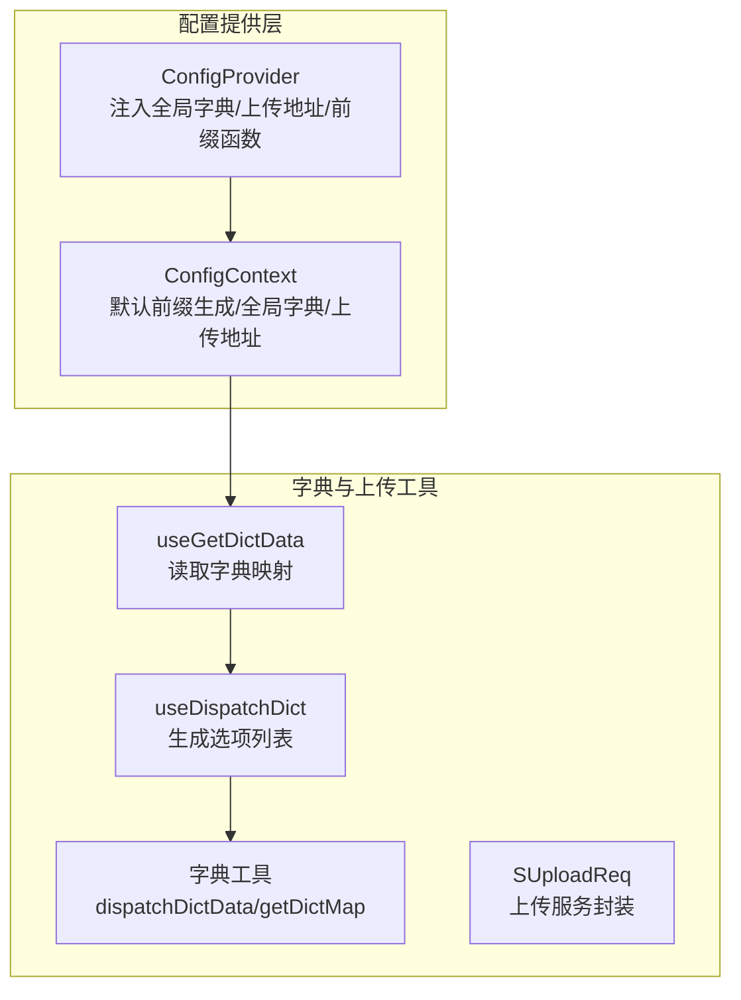
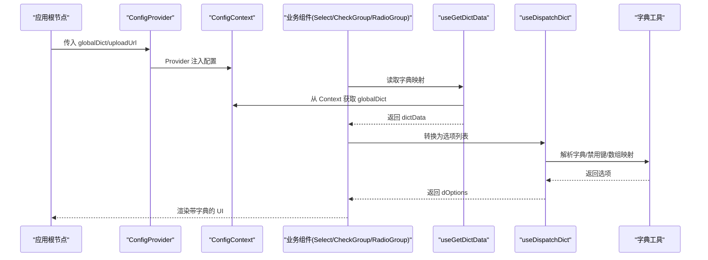
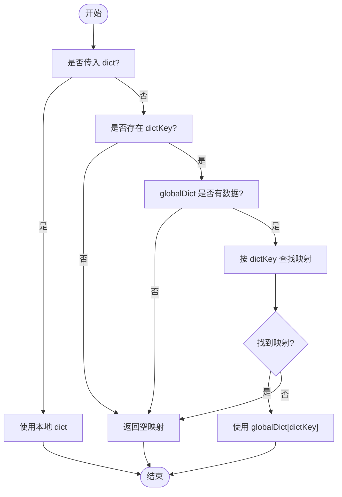
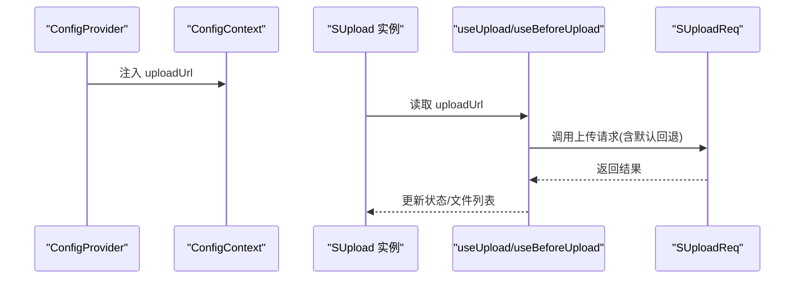
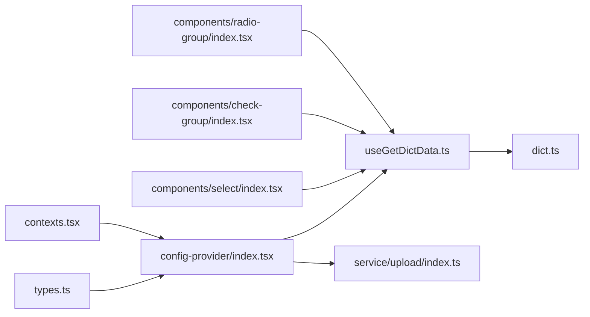

# 全局配置系统

<cite>
**本文引用的文件**
- [src/components/config-provider/index.tsx](file://src/components/config-provider/index.tsx)
- [src/components/config-provider/contexts.tsx](file://src/components/config-provider/contexts.tsx)
- [src/components/config-provider/types.ts](file://src/components/config-provider/types.ts)
- [src/components/config-provider/demos/detail.tsx](file://src/components/config-provider/demos/detail.tsx)
- [src/utils/dict.ts](file://src/utils/dict.ts)
- [src/hooks/useGetDictData.ts](file://src/hooks/useGetDictData.ts)
- [src/hooks/useDispatchDict.ts](file://src/hooks/useDispatchDict.ts)
- [src/service/upload/index.ts](file://src/service/upload/index.ts)
- [config/index.ts](file://config/index.ts)
</cite>

## 更新摘要

**所做更改**

- 更新了配置提供者组件的实现细节，移除了不必要的状态管理
- 简化了导航配置，专注于核心组件文档
- 更新了配置系统的架构图和使用示例
- 强化了配置项的优先级规则说明

## 目录

1. [简介](#简介)
2. [项目结构](#项目结构)
3. [核心组件](#核心组件)
4. [架构总览](#架构总览)
5. [详细组件分析](#详细组件分析)
6. [依赖关系分析](#依赖关系分析)
7. [性能考量](#性能考量)
8. [故障排除指南](#故障排除指南)
9. [结论](#结论)
10. [附录](#附录)

## 简介

本文件系统性阐述 SDesign 的全局配置系统，重点围绕 ConfigProvider 组件的设计理念与使用场景，覆盖以下主题：

- 全局配置管理：如何通过 Provider 在应用根部集中注入配置
- 主题定制：前缀类名生成策略与可定制化入口
- 字典数据管理：全局字典的设置、优先级与在表单项中的使用
- 上传配置：全局上传地址的注入与组件层的消费
- 国际化配置：当前实现未直接暴露国际化配置项，但整体架构支持扩展
- Context 上下文：数据传递机制与子组件访问方式
- 配置示例与最佳实践：启动时配置、动态更新、作用域与继承
- 性能优化与调试：字典处理、Memo 化与日志建议
- 常见问题与排错：典型错误与定位方法

## 项目结构

全局配置系统主要由三部分组成：

- 提供者（ConfigProvider）：负责在根节点注入配置上下文
- 上下文（ConfigContext）：定义默认行为与对外暴露的配置项
- 工具与 Hook：为表单组件提供字典解析与选项转换能力

**图表来源**

- [src/components/config-provider/index.tsx](file://src/components/config-provider/index.tsx#L1-L47)
- [src/components/config-provider/contexts.tsx](file://src/components/config-provider/contexts.tsx#L1-L20)
- [src/utils/dict.ts](file://src/utils/dict.ts#L1-L121)
- [src/hooks/useGetDictData.ts](file://src/hooks/useGetDictData.ts#L1-L28)
- [src/hooks/useDispatchDict.ts](file://src/hooks/useDispatchDict.ts#L1-L99)
- [src/service/upload/index.ts](file://src/service/upload/index.ts#L1-L20)

**章节来源**

- [src/components/config-provider/index.tsx](file://src/components/config-provider/index.tsx#L1-L47)
- [src/components/config-provider/contexts.tsx](file://src/components/config-provider/contexts.tsx#L1-L20)

## 核心组件

- ConfigProvider：接收全局字典、上传地址与子树，通过 Context 将配置向下传递
- ConfigContext：默认前缀类名生成器、全局字典、上传地址
- 类型定义：SConfigProviderType、ConfigContextProps

**章节来源**

- [src/components/config-provider/types.ts](file://src/components/config-provider/types.ts#L1-L33)
- [src/components/config-provider/contexts.tsx](file://src/components/config-provider/contexts.tsx#L1-L20)
- [src/components/config-provider/index.tsx](file://src/components/config-provider/index.tsx#L1-L47)

## 架构总览

ConfigProvider 作为根级容器，将配置注入到 React Context 中；各业务组件通过 Hook 读取配置并进行渲染。字典数据的解析与选项生成由工具与 Hook 完成，上传组件通过统一的服务封装消费上传地址。

**图表来源**

- [src/components/config-provider/index.tsx](file://src/components/config-provider/index.tsx#L1-L47)
- [src/hooks/useGetDictData.ts](file://src/hooks/useGetDictData.ts#L1-L28)
- [src/hooks/useDispatchDict.ts](file://src/hooks/useDispatchDict.ts#L1-L99)
- [src/utils/dict.ts](file://src/utils/dict.ts#L1-L121)

## 详细组件分析

### ConfigProvider 设计与用法

- 设计理念
  - 单一职责：集中注入全局配置，避免分散在各组件中
  - 可组合性：通过 children 承载子树，天然支持按需作用域
  - 默认行为：提供默认前缀类名生成函数，便于主题定制
- 使用场景
  - 应用启动时一次性注入全局字典与上传地址
  - 按页面或模块局部注入，实现作用域隔离
- 关键点
  - 全局字典：支持对象或空值；当传入对象时直接使用，否则清空
  - 上传地址：可为空，组件层会回退到默认值
  - 前缀类名：支持自定义前缀或基于组件类型生成

**更新** 移除了不必要的状态管理，简化了字典获取逻辑

**章节来源**

- [src/components/config-provider/index.tsx](file://src/components/config-provider/index.tsx#L1-L47)
- [src/components/config-provider/contexts.tsx](file://src/components/config-provider/contexts.tsx#L1-L20)
- [src/components/config-provider/types.ts](file://src/components/config-provider/types.ts#L1-L33)

### Context 上下文与数据传递

- ConfigContext 默认导出默认前缀生成函数与空配置对象
- Provider 在渲染时覆写上下文值，向子树提供：
  - getPrefixCls：前缀类名生成器
  - globalDict：全局字典映射
  - uploadUrl：全局上传地址

**章节来源**

- [src/components/config-provider/contexts.tsx](file://src/components/config-provider/contexts.tsx#L1-L20)
- [src/components/config-provider/index.tsx](file://src/components/config-provider/index.tsx#L1-L47)

### 字典数据管理与优先级

- 字典来源优先级
  - 局部传入 dict > 全局字典 globalDict(dictKey) > 空映射
- 字典映射获取逻辑
  - 若组件传入 dict 则直接使用
  - 否则若存在 dictKey，则从 globalDict 中按 key 取值
  - 否则返回空映射
- 字典值处理
  - 支持对象与数组两种形式
  - 数组形式可通过反射字段（name/label）映射为选项
  - 多选场景支持逗号分隔值的批量映射

**图表来源**

- [src/utils/dict.ts](file://src/utils/dict.ts#L104-L120)
- [src/hooks/useGetDictData.ts](file://src/hooks/useGetDictData.ts#L1-L28)

**章节来源**

- [src/utils/dict.ts](file://src/utils/dict.ts#L1-L121)
- [src/hooks/useGetDictData.ts](file://src/hooks/useGetDictData.ts#L1-L28)

### 上传配置与消费

- 全局上传地址注入：ConfigProvider 接收 uploadUrl 并注入上下文
- 组件消费路径：SUpload 内部通过 useUpload/useBeforeUpload 读取上传地址
- 服务封装：SUploadReq 提供统一上传请求封装，默认回退地址

**图表来源**

- [src/components/config-provider/index.tsx](file://src/components/config-provider/index.tsx#L1-L47)
- [src/service/upload/index.ts](file://src/service/upload/index.ts#L1-L20)

**章节来源**

- [src/components/config-provider/demos/detail.tsx](file://src/components/config-provider/demos/detail.tsx#L1-L60)
- [src/service/upload/index.ts](file://src/service/upload/index.ts#L1-L20)

### 表单组件与字典联动

- Select/CheckGroup/RadioGroup 通过 useGetDictData 读取字典映射，再经 useDispatchDict 转为 Ant Design 选项格式
- 支持禁用键 disableKeys 控制选项可用性
- 多选场景自动处理逗号分隔值与回显

**章节来源**

- [src/hooks/useGetDictData.ts](file://src/hooks/useGetDictData.ts#L1-L28)
- [src/hooks/useDispatchDict.ts](file://src/hooks/useDispatchDict.ts#L1-L99)
- [src/utils/dict.ts](file://src/utils/dict.ts#L1-L121)

### 国际化配置现状与扩展建议

- 当前实现未直接暴露国际化配置项
- 若需扩展，可在 ConfigContext 中新增语言与消息映射，并在需要的组件中通过 Context 读取

**章节来源**

- [src/components/config-provider/contexts.tsx](file://src/components/config-provider/contexts.tsx#L1-L20)
- [src/components/config-provider/types.ts](file://src/components/config-provider/types.ts#L1-L33)

## 依赖关系分析

- ConfigProvider 依赖 Context 与类型定义
- 字典相关组件依赖 Hook 与工具函数
- 上传组件依赖上传 Hook 与服务封装
- 组件间耦合度低，通过 Context 与 Hook 解耦

**图表来源**

- [src/components/config-provider/types.ts](file://src/components/config-provider/types.ts#L1-L33)
- [src/components/config-provider/index.tsx](file://src/components/config-provider/index.tsx#L1-L47)
- [src/components/config-provider/contexts.tsx](file://src/components/config-provider/contexts.tsx#L1-L20)
- [src/hooks/useGetDictData.ts](file://src/hooks/useGetDictData.ts#L1-L28)
- [src/utils/dict.ts](file://src/utils/dict.ts#L1-L121)
- [src/service/upload/index.ts](file://src/service/upload/index.ts#L1-L20)

## 性能考量

- Memo 化优化
  - useGetDictData 与 useDispatchDict 均使用 useMemo，依据依赖稳定化减少重算
- 字典处理
  - 对象与数组字典分别处理，避免重复映射
  - 多选场景预处理映射表，降低渲染期计算开销
- 上传路径
  - 组件层回退默认地址，避免每次请求都携带冗余参数
- 建议
  - 将全局字典缓存于 Provider 外部或持久化存储，避免频繁重建
  - 对高频组件的字典映射进行本地缓存

**章节来源**

- [src/hooks/useGetDictData.ts](file://src/hooks/useGetDictData.ts#L1-L28)
- [src/hooks/useDispatchDict.ts](file://src/hooks/useDispatchDict.ts#L1-L99)
- [src/utils/dict.ts](file://src/utils/dict.ts#L1-L121)

## 故障排除指南

- 全局字典未生效
  - 检查 ConfigProvider 是否包裹目标组件
  - 确认 globalDict 传入的是对象且 dictKey 正确
- 字典回显显示占位符
  - 检查 dictKey 是否存在于 globalDict
  - 确认组件传入的值与字典键一致
- 上传失败或地址错误
  - 确认 ConfigProvider 的 uploadUrl 是否正确
  - 检查组件层是否覆盖了 uploadUrl
- 多选回显异常
  - 确认传入值为逗号分隔字符串
  - 检查字典映射是否包含对应键
- 调试建议
  - 在 useGetDictData 与 useDispatchDict 中打印依赖变化
  - 在字典工具函数中增加边界条件日志

**章节来源**

- [src/components/config-provider/demos/detail.tsx](file://src/components/config-provider/demos/detail.tsx#L1-L60)
- [src/hooks/useGetDictData.ts](file://src/hooks/useGetDictData.ts#L1-L28)
- [src/hooks/useDispatchDict.ts](file://src/hooks/useDispatchDict.ts#L1-L99)
- [src/utils/dict.ts](file://src/utils/dict.ts#L1-L121)

## 结论

SDesign 的全局配置系统以 ConfigProvider 为核心，通过 Context 与 Hook 将配置与渲染解耦，实现了：

- 高内聚的配置注入与低耦合的消费机制
- 明确的字典优先级与灵活的映射策略
- 可扩展的上传地址与默认回退
- 可复用的字典处理工具与选项转换 Hook

该体系易于在应用启动阶段集中初始化，并支持按模块/页面的作用域配置，满足复杂业务的全局治理需求。

## 附录

### 配置项与优先级速览

- 字典数据：组件传入 dict > 全局 globalDict(dictKey) > 空映射
- 上传地址：组件传入 > 全局 uploadUrl > 默认回退
- 前缀类名：自定义前缀优先，否则按组件类型生成

**章节来源**

- [src/utils/dict.ts](file://src/utils/dict.ts#L104-L120)
- [src/components/config-provider/index.tsx](file://src/components/config-provider/index.tsx#L1-L47)
- [src/components/config-provider/contexts.tsx](file://src/components/config-provider/contexts.tsx#L1-L20)

### 最佳实践清单

- 在应用入口处仅放置一次 ConfigProvider，避免重复注入
- 将全局字典与上传地址在启动阶段加载并注入
- 对高频字典进行本地缓存，减少重复映射
- 使用作用域 Provider 对特定页面或模块进行局部覆盖
- 为字典与上传地址提供默认值，确保组件健壮性

**章节来源**

- [src/components/config-provider/demos/detail.tsx](file://src/components/config-provider/demos/detail.tsx#L1-L60)

### 导航配置优化

**更新** 简化了导航配置，专注于核心组件文档展示

**章节来源**

- [config/index.ts](file://config/index.ts#L1-L26)
