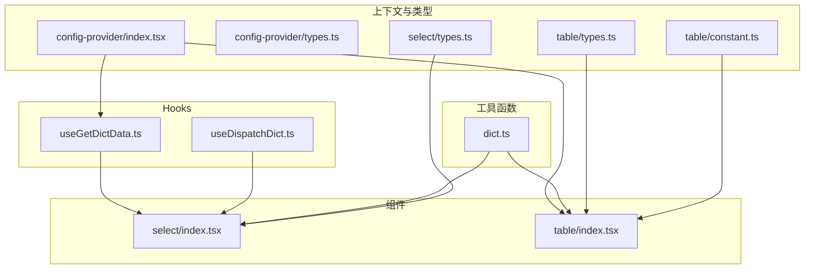
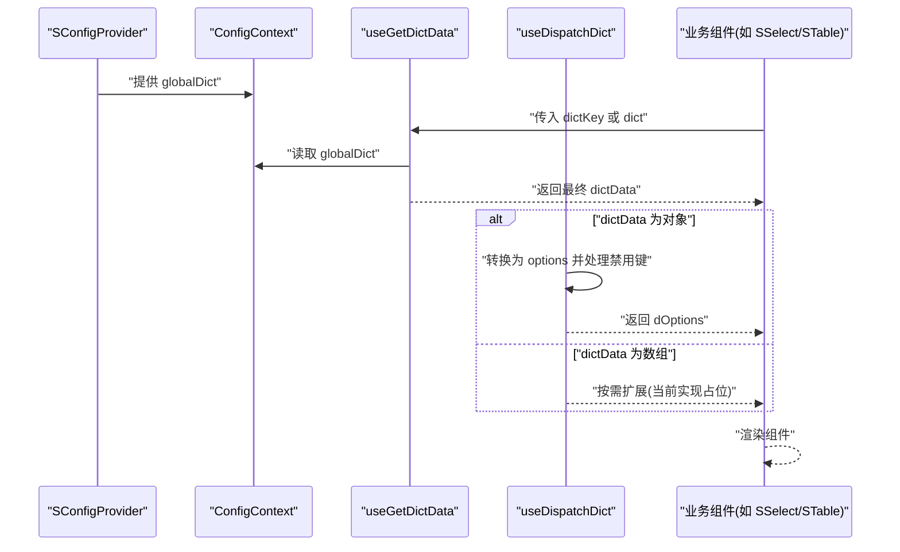
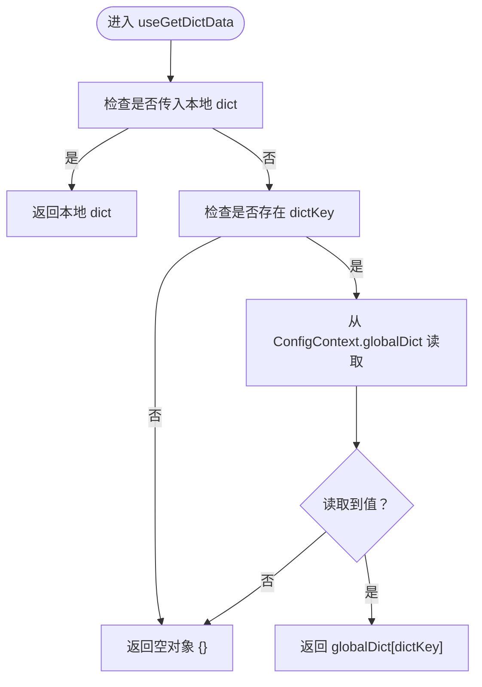
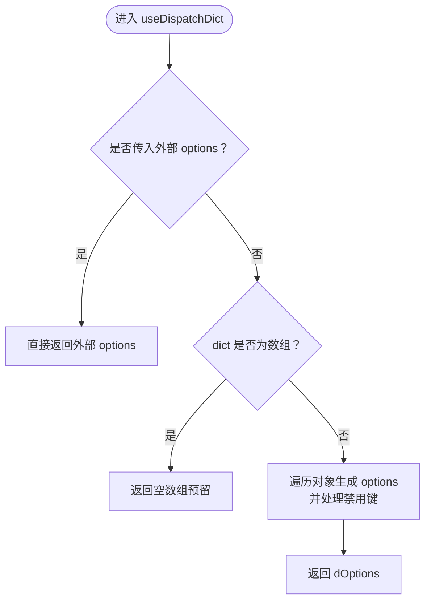
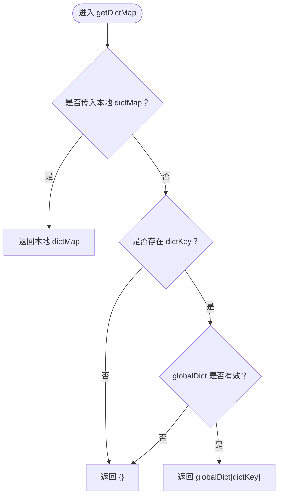
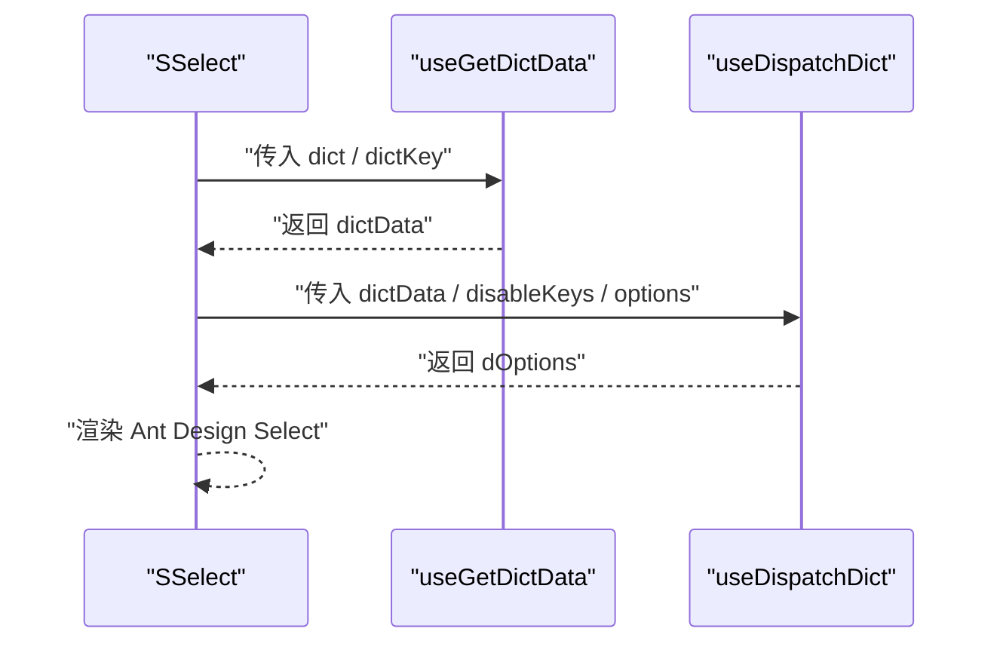
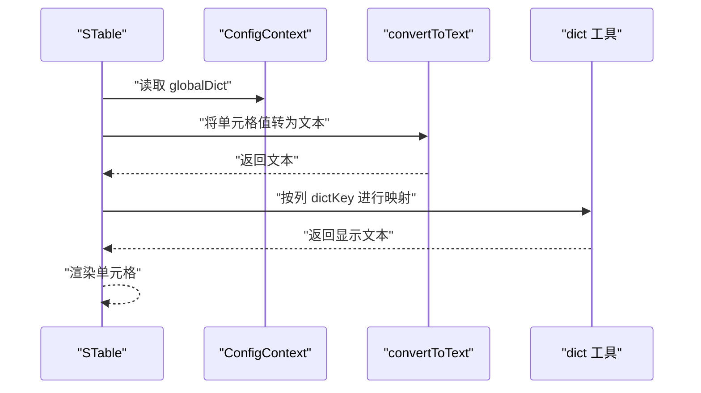
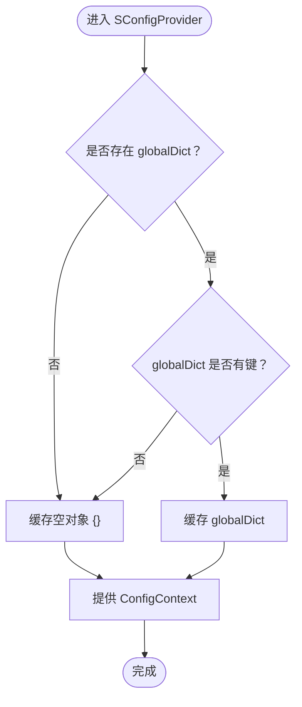
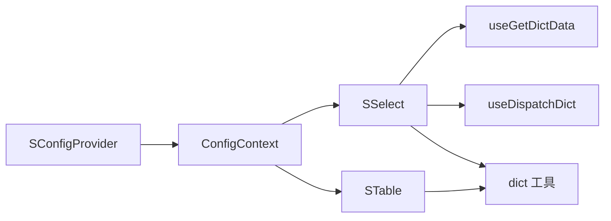

# 字典数据处理

<cite>
**本文引用的文件**
- [useGetDictData.ts](file://src/hooks/useGetDictData.ts)
- [dict.ts](file://src/utils/dict.ts)
- [useDispatchDict.ts](file://src/hooks/useDispatchDict.ts)
- [index.tsx](file://src/components/select/index.tsx)
- [index.tsx](file://src/components/table/index.tsx)
- [index.tsx](file://src/components/config-provider/index.tsx)
- [types.ts](file://src/components/config-provider/types.ts)
- [types.ts](file://src/components/select/types.ts)
- [types.ts](file://src/components/table/types.ts)
- [constant.ts](file://src/components/table/constant.ts)
- [index.tsx](file://src/components/select/demos/index.tsx)
- [table-dict.tsx](file://src/components/table/demos/table-dict.tsx)
- [index.ts](file://src/utils/index.ts)
</cite>

## 目录

1. [简介](#简介)
2. [项目结构](#项目结构)
3. [核心组件](#核心组件)
4. [架构总览](#架构总览)
5. [详细组件分析](#详细组件分析)
6. [依赖分析](#依赖分析)
7. [性能考量](#性能考量)
8. [故障排查指南](#故障排查指南)
9. [结论](#结论)
10. [附录](#附录)

## 简介

本文件系统性梳理字典数据处理能力，覆盖以下主题：

- 如何从全局配置中获取字典数据
- 如何进行字典数据的本地缓存与更新
- 如何将字典数据转换为组件可用的格式
- 在表单组件、选择器组件等业务场景中的使用示例
- 性能优化与错误处理机制

## 项目结构

围绕字典数据处理的关键文件分布如下：

- Hooks：用于在组件内获取与派生字典选项
  - useGetDictData.ts：从全局配置或本地传入字典中获取最终字典数据
  - useDispatchDict.ts：将字典数据转换为组件可消费的 options 列表，并支持禁用键
- 工具函数：通用字典处理与映射
  - dict.ts：提供值映射、多选映射、字典映射获取等方法
- 组件：实际业务组件集成字典能力
  - select/index.tsx：选择器组件，集成 useGetDictData 与 useDispatchDict
  - table/index.tsx：表格组件，基于全局字典进行列渲染回显
- 上下文与类型：全局字典注入与类型约束
  - config-provider/index.tsx：全局字典注入与状态缓存
  - config-provider/types.ts：全局配置与上下文类型
  - select/types.ts、table/types.ts：组件属性类型
  - table/constant.ts：表格列渲染辅助函数

图表来源

- [useGetDictData.ts](file://src/hooks/useGetDictData.ts#L1-L28)
- [useDispatchDict.ts](file://src/hooks/useDispatchDict.ts#L1-L99)
- [dict.ts](file://src/utils/dict.ts#L1-L121)
- [index.tsx](file://src/components/select/index.tsx#L1-L37)
- [index.tsx](file://src/components/table/index.tsx#L1-L135)
- [index.tsx](file://src/components/config-provider/index.tsx#L1-L47)
- [types.ts](file://src/components/config-provider/types.ts#L1-L17)
- [types.ts](file://src/components/select/types.ts#L1-L9)
- [types.ts](file://src/components/table/types.ts#L1-L34)
- [constant.ts](file://src/components/table/constant.ts#L1-L44)

章节来源

- [index.ts](file://src/utils/index.ts#L1-L10)

## 核心组件

- useGetDictData：从全局配置或本地传入字典中获取最终字典数据，具备优先级与兜底策略
- useDispatchDict：将字典对象转换为组件 options 列表，支持禁用键
- dict 工具集：提供值映射、多选映射、字典映射获取等方法
- SSelect：选择器组件，集成 useGetDictData 与 useDispatchDict
- STable：表格组件，基于全局字典进行列渲染回显
- SConfigProvider：全局字典注入与本地缓存

章节来源

- [useGetDictData.ts](file://src/hooks/useGetDictData.ts#L1-L28)
- [useDispatchDict.ts](file://src/hooks/useDispatchDict.ts#L1-L99)
- [dict.ts](file://src/utils/dict.ts#L1-L121)
- [index.tsx](file://src/components/select/index.tsx#L1-L37)
- [index.tsx](file://src/components/table/index.tsx#L1-L135)
- [index.tsx](file://src/components/config-provider/index.tsx#L1-L47)

## 架构总览

字典数据处理的整体流程如下：

- 全局字典通过 SConfigProvider 注入到上下文中，并在组件树内共享
- 业务组件通过 useGetDictData 获取最终字典数据（本地 dict 优先，否则从全局 dictKey 获取）
- 若字典为对象，通过 useDispatchDict 转换为组件可用的 options；若为数组，按需扩展
- 表格列渲染时，若指定 dictKey，则基于全局字典进行回显

图表来源

- [index.tsx](file://src/components/config-provider/index.tsx#L1-L47)
- [useGetDictData.ts](file://src/hooks/useGetDictData.ts#L1-L28)
- [useDispatchDict.ts](file://src/hooks/useDispatchDict.ts#L1-L99)
- [index.tsx](file://src/components/select/index.tsx#L1-L37)
- [index.tsx](file://src/components/table/index.tsx#L1-L135)

## 详细组件分析

### useGetDictData：从全局配置获取字典数据

- 功能要点
  - 本地 dict 优先：若传入 dict 则直接使用
  - 全局 dictKey 回退：若未传入 dict 且存在 dictKey，则从 ConfigContext.globalDict 中取值
  - 兜底策略：若均不可用，返回空对象
- 性能特性
  - 使用 useMemo 缓存结果，依赖 globalDict、dictKey、dict 变更
- 错误处理
  - 当输入为 null/undefined 时，返回空对象，避免运行时异常

图表来源

- [useGetDictData.ts](file://src/hooks/useGetDictData.ts#L1-L28)
- [index.tsx](file://src/components/config-provider/index.tsx#L1-L47)

章节来源

- [useGetDictData.ts](file://src/hooks/useGetDictData.ts#L1-L28)
- [index.tsx](file://src/components/config-provider/index.tsx#L1-L47)

### useDispatchDict：将字典转换为组件选项

- 功能要点
  - 对象字典：遍历键值对，生成包含 label/value/disabled 的选项数组
  - 数组字典：当前实现返回空数组（预留扩展点）
  - 禁用键：支持字符串或数组形式的禁用键，命中即 disabled
  - 优先级：若外部传入 options，则直接使用外部 options
- 性能特性
  - 使用 useMemo 缓存结果，依赖 dict、options、disableKeys 变更
- 错误处理
  - 输入为空时返回空数组，避免渲染异常

图表来源

- [useDispatchDict.ts](file://src/hooks/useDispatchDict.ts#L1-L99)

章节来源

- [useDispatchDict.ts](file://src/hooks/useDispatchDict.ts#L1-L99)

### dict 工具集：字典映射与转换

- dispatchDictData：将原始值映射为显示文本
  - 支持对象与数组两种字典结构
  - 数组结构需提供 name/label 映射键，默认为 name/label
  - 找不到匹配项时返回占位符
- dispatchCheckboxDictData：多选值映射
  - 接受逗号分隔的多选值，逐个映射后以“/”拼接
  - 异常捕获并返回占位符
- getDictMap：统一获取字典映射
  - 优先使用本地 dictMap
  - 否则根据 dictKey 从 globalDict 获取
  - 若无 dictKey 或 globalDict 为空，返回空对象

图表来源

- [dict.ts](file://src/utils/dict.ts#L104-L121)

章节来源

- [dict.ts](file://src/utils/dict.ts#L1-L121)

### SSelect：选择器组件集成字典

- 集成方式
  - 通过 useGetDictData 获取最终字典数据
  - 通过 useDispatchDict 转换为 options
  - 支持外部传入 options 覆盖内部生成
- 使用建议
  - 本地 dict 优先级高于全局 dictKey
  - 多选场景建议使用 dispatchCheckboxDictData 进行回显

图表来源

- [index.tsx](file://src/components/select/index.tsx#L1-L37)
- [useGetDictData.ts](file://src/hooks/useGetDictData.ts#L1-L28)
- [useDispatchDict.ts](file://src/hooks/useDispatchDict.ts#L1-L99)

章节来源

- [index.tsx](file://src/components/select/index.tsx#L1-L37)
- [types.ts](file://src/components/select/types.ts#L1-L9)

### STable：表格列渲染字典回显

- 集成方式
  - 通过 ConfigContext.globalDict 获取字典
  - 列定义中指定 dictKey，渲染时基于字典进行回显
  - 使用 convertToText 将单元格内容转为字符串后再进行字典映射
- 使用建议
  - 仅在列定义中设置 dictKey 即可启用字典回显
  - 若需要复杂渲染，可在列 render 中组合字典映射与其他逻辑

图表来源

- [index.tsx](file://src/components/table/index.tsx#L1-L135)
- [constant.ts](file://src/components/table/constant.ts#L1-L44)
- [dict.ts](file://src/utils/dict.ts#L1-L121)

章节来源

- [index.tsx](file://src/components/table/index.tsx#L1-L135)
- [types.ts](file://src/components/table/types.ts#L1-L34)
- [constant.ts](file://src/components/table/constant.ts#L1-L44)

### SConfigProvider：全局字典注入与缓存

- 功能要点
  - 将 globalDict 注入到 ConfigContext
  - 通过 useState 缓存全局字典，避免重复计算
  - 支持异步加载 globalDict 并更新缓存
- 性能特性
  - 依赖 globalDict 的变化触发重算
- 错误处理
  - globalDict 为空时缓存空对象，保证下游组件稳定

图表来源

- [index.tsx](file://src/components/config-provider/index.tsx#L1-L47)
- [types.ts](file://src/components/config-provider/types.ts#L1-L17)

章节来源

- [index.tsx](file://src/components/config-provider/index.tsx#L1-L47)
- [types.ts](file://src/components/config-provider/types.ts#L1-L17)

## 依赖分析

- 组件耦合
  - SSelect 依赖 useGetDictData 与 useDispatchDict
  - STable 依赖 ConfigContext.globalDict 与 dict 工具
  - SConfigProvider 为全局字典提供者
- 数据流
  - 全局字典经由 SConfigProvider 注入
  - 业务组件通过 hooks 与工具函数进行转换
- 潜在循环依赖
  - 当前模块间为单向依赖，无循环导入风险

图表来源

- [index.tsx](file://src/components/config-provider/index.tsx#L1-L47)
- [index.tsx](file://src/components/select/index.tsx#L1-L37)
- [index.tsx](file://src/components/table/index.tsx#L1-L135)
- [useGetDictData.ts](file://src/hooks/useGetDictData.ts#L1-L28)
- [useDispatchDict.ts](file://src/hooks/useDispatchDict.ts#L1-L99)
- [dict.ts](file://src/utils/dict.ts#L1-L121)

章节来源

- [index.tsx](file://src/components/config-provider/index.tsx#L1-L47)
- [index.tsx](file://src/components/select/index.tsx#L1-L37)
- [index.tsx](file://src/components/table/index.tsx#L1-L135)
- [useGetDictData.ts](file://src/hooks/useGetDictData.ts#L1-L28)
- [useDispatchDict.ts](file://src/hooks/useDispatchDict.ts#L1-L99)
- [dict.ts](file://src/utils/dict.ts#L1-L121)

## 性能考量

- 缓存策略
  - useGetDictData：对最终字典数据进行 memo 化，减少重复计算
  - useDispatchDict：对 options 进行 memo 化，避免每次渲染重建
  - SConfigProvider：对 globalDict 进行本地缓存，避免重复注入
- 渲染优化
  - STable 在列渲染时先进行 convertToText 再映射，降低渲染成本
- 计算复杂度
  - 对象字典转换为 options 的时间复杂度为 O(n)，n 为键数量
  - 数组字典查找为 O(n)，n 为数组长度；建议在上游预处理为对象映射以提升查询效率

## 故障排查指南

- 现象：选择器无选项
  - 检查是否正确传入 dict 或 dictKey
  - 确认 SConfigProvider 是否正确包裹
  - 若传入 options，请确认其结构符合组件要求
- 现象：表格列未回显字典值
  - 检查列定义是否设置 dictKey
  - 确认 globalDict 中是否存在对应键
  - 检查单元格值是否可被 convertToText 正确转换
- 现象：多选回显异常
  - 确认多选值为逗号分隔的字符串
  - 检查字典映射是否为对象结构（dispatchCheckboxDictData 不支持数组）
- 现象：控制台报错
  - dispatchCheckboxDictData 内部有异常捕获，若仍出现错误，检查输入数据类型与字典结构

章节来源

- [useGetDictData.ts](file://src/hooks/useGetDictData.ts#L1-L28)
- [useDispatchDict.ts](file://src/hooks/useDispatchDict.ts#L1-L99)
- [dict.ts](file://src/utils/dict.ts#L1-L121)
- [index.tsx](file://src/components/table/index.tsx#L1-L135)
- [constant.ts](file://src/components/table/constant.ts#L1-L44)

## 结论

本方案通过全局字典注入、本地字典优先、memo 化缓存与工具函数映射，实现了灵活、高性能的字典数据处理能力。选择器与表格等组件均可无缝复用，满足常见业务场景下的字典回显需求。

## 附录

### 使用示例路径

- 选择器组件字典回显
  - [演示文件](file://src/components/select/demos/index.tsx#L1-L68)
- 表格列字典回显
  - [演示文件](file://src/components/table/demos/table-dict.tsx#L1-L52)

### 类型与上下文

- 选择器组件类型
  - [类型定义](file://src/components/select/types.ts#L1-L9)
- 表格组件类型
  - [类型定义](file://src/components/table/types.ts#L1-L34)
- 全局配置上下文类型
  - [类型定义](file://src/components/config-provider/types.ts#L1-L17)
