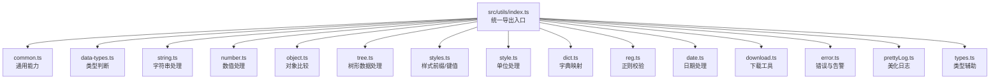
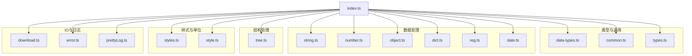
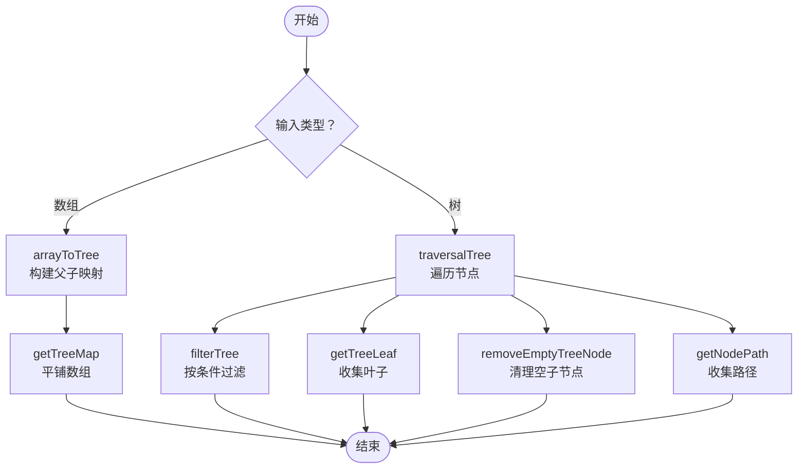
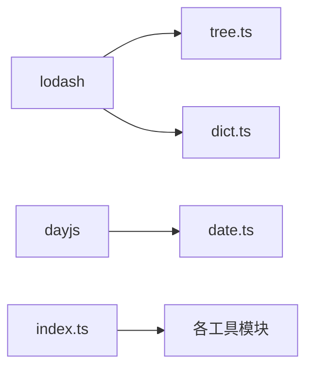

# 工具函数系统

<cite>
**本文档引用的文件**
- [src/utils/index.ts](file://src/utils/index.ts)
- [src/utils/common.ts](file://src/utils/common.ts)
- [src/utils/data-types.ts](file://src/utils/data-types.ts)
- [src/utils/string.ts](file://src/utils/string.ts)
- [src/utils/number.ts](file://src/utils/number.ts)
- [src/utils/object.ts](file://src/utils/object.ts)
- [src/utils/tree.ts](file://src/utils/tree.ts)
- [src/utils/styles.ts](file://src/utils/styles.ts)
- [src/utils/style.ts](file://src/utils/style.ts)
- [src/utils/dict.ts](file://src/utils/dict.ts)
- [src/utils/reg.ts](file://src/utils/reg.ts)
- [src/utils/date.ts](file://src/utils/date.ts)
- [src/utils/download.ts](file://src/utils/download.ts)
- [src/utils/error.ts](file://src/utils/error.ts)
- [src/utils/prettyLog.ts](file://src/utils/prettyLog.ts)
- [src/utils/types.ts](file://src/utils/types.ts)
</cite>

## 目录

1. [简介](#简介)
2. [项目结构](#项目结构)
3. [核心组件](#核心组件)
4. [架构总览](#架构总览)
5. [详细组件分析](#详细组件分析)
6. [依赖关系分析](#依赖关系分析)
7. [性能考虑](#性能考虑)
8. [故障排查指南](#故障排查指南)
9. [结论](#结论)
10. [附录](#附录)

## 简介

本文件系统性梳理 SDesign 工具函数体系，覆盖数据处理、类型判断、样式处理、字典映射、正则校验、日期处理、下载与日志等模块。文档按“设计理念—分类体系—功能说明—使用场景—组合实践—性能特性—注意事项”展开，帮助开发者快速理解与高效使用。

## 项目结构

工具函数集中位于 src/utils 目录，通过统一出口导出，便于按需引入与整体聚合使用。

图表来源

- [src/utils/index.ts](file://src/utils/index.ts#L1-L10)

章节来源

- [src/utils/index.ts](file://src/utils/index.ts#L1-L10)

## 核心组件

- 类型判断与空值处理：提供布尔、数字、字符串、空值、元素、窗口等判断，支持字符串数字识别与属性存在性判断。
- 字符串处理：文本宽度测量、DOM 获取宽度、首字母大写、去空格、字符替换、URL 参数解析、选中文本读取、级联选择器双向转换。
- 数值处理：千分位格式化、从数字生成连续数组。
- 对象处理：深度相等比较（可忽略键、支持 Map/Set/TypedArray/RegExp/自定义 valueOf/toString）。
- 树形数据：数组转树、平铺、路径查找、模糊/精确匹配、遍历、过滤、删除空子节点、获取叶子节点。
- 样式处理：组件类名前缀、单个样式键值生成。
- 单位处理：数值/字符串自动补单位（默认 px），非法值告警。
- 字典映射：字典值映射、多选字典映射、全局字典合并。
- 正则校验：内置常用规则（小数、整数、手机号、邮箱、身份证、车牌、颜色、IP、MAC、URL 等）。
- 日期处理：兼容字符串/数组/Dayjs 的日期值提取。
- 通用工具：唯一码生成、文件名截断、数组创建、文件转 Base64、动态注入脚本、剪贴板复制、环境判断。
- 下载工具：二进制流下载、链接下载。
- 日志与错误：美化日志、调试告警、抛错封装。
- 类型辅助：元组构造、元素类型提取、字面量联合。

章节来源

- [src/utils/data-types.ts](file://src/utils/data-types.ts#L1-L34)
- [src/utils/string.ts](file://src/utils/string.ts#L1-L156)
- [src/utils/number.ts](file://src/utils/number.ts#L1-L18)
- [src/utils/object.ts](file://src/utils/object.ts#L1-L87)
- [src/utils/tree.ts](file://src/utils/tree.ts#L1-L396)
- [src/utils/styles.ts](file://src/utils/styles.ts#L1-L27)
- [src/utils/style.ts](file://src/utils/style.ts#L1-L22)
- [src/utils/dict.ts](file://src/utils/dict.ts#L1-L121)
- [src/utils/reg.ts](file://src/utils/reg.ts#L1-L146)
- [src/utils/date.ts](file://src/utils/date.ts#L1-L44)
- [src/utils/common.ts](file://src/utils/common.ts#L1-L208)
- [src/utils/download.ts](file://src/utils/download.ts#L1-L37)
- [src/utils/error.ts](file://src/utils/error.ts#L1-L25)
- [src/utils/prettyLog.ts](file://src/utils/prettyLog.ts#L1-L110)
- [src/utils/types.ts](file://src/utils/types.ts#L1-L19)

## 架构总览

工具函数采用“按功能域分层”的模块化设计，统一通过 index.ts 导出，降低使用者心智负担；内部依赖 lodash 提供基础类型判断，避免重复造轮子；部分模块（如树、字典、正则）提供可配置参数，增强复用性与扩展性。

图表来源

- [src/utils/index.ts](file://src/utils/index.ts#L1-L10)
- [src/utils/data-types.ts](file://src/utils/data-types.ts#L1-L34)
- [src/utils/common.ts](file://src/utils/common.ts#L1-L208)
- [src/utils/string.ts](file://src/utils/string.ts#L1-L156)
- [src/utils/number.ts](file://src/utils/number.ts#L1-L18)
- [src/utils/object.ts](file://src/utils/object.ts#L1-L87)
- [src/utils/tree.ts](file://src/utils/tree.ts#L1-L396)
- [src/utils/styles.ts](file://src/utils/styles.ts#L1-L27)
- [src/utils/style.ts](file://src/utils/style.ts#L1-L22)
- [src/utils/dict.ts](file://src/utils/dict.ts#L1-L121)
- [src/utils/reg.ts](file://src/utils/reg.ts#L1-L146)
- [src/utils/date.ts](file://src/utils/date.ts#L1-L44)
- [src/utils/download.ts](file://src/utils/download.ts#L1-L37)
- [src/utils/error.ts](file://src/utils/error.ts#L1-L25)
- [src/utils/prettyLog.ts](file://src/utils/prettyLog.ts#L1-L110)
- [src/utils/types.ts](file://src/utils/types.ts#L1-L19)

## 详细组件分析

### 类型判断与空值处理（data-types）

- isUndefined / isBoolean / isNumber：严格类型判断，返回值具备类型守卫。
- isEmpty：对空值、空数组、空对象进行统一判定。
- isElement：跨环境元素判断，兼容无 Element 定义场景。
- isPropAbsent：属性不存在（null/undefined）判断。
- isStringNumber：字符串数字识别（非 NaN）。
- isWindow：窗口对象判断。

适用场景

- 表单/渲染前的类型预检
- 条件分支与默认值设置
- DOM 操作前的安全性检查

复杂度与性能

- 基础类型判断 O(1)，isEmpty 在对象场景为 O(n)（键数量）

章节来源

- [src/utils/data-types.ts](file://src/utils/data-types.ts#L6-L33)

### 字符串处理（string）

- getTextWidth / getTextWidthByDom：Canvas/DOM 两种方式测量文本宽度，适配不同布局需求。
- initialToCapital：首字母大写。
- removeSpaces：移除所有空白字符。
- transFormat：批量字符替换（正则全局替换）。
- getParameters：解析 URL 参数为对象。
- getSelectedText：获取当前选中文本。
- dispatchCascader / echoCascader：级联选择器值的序列化与反序列化（支持多选逗号/斜杠分隔）。

适用场景

- 文案展示宽度控制、防溢出
- 用户输入规范化
- 级联表单数据传输与回填

复杂度与性能

- 文本宽度测量依赖 DOM/CSS 渲染，建议缓存结果
- 级联转换为 O(n)（n 为层级数）

章节来源

- [src/utils/string.ts](file://src/utils/string.ts#L14-L155)

### 数值处理（number）

- formatPrice：千分位格式化（本地化）。
- genArrFromNum：生成 1..n 连续数组。

适用场景

- 金额/统计数字展示
- 生成序号/枚举列表

复杂度与性能

- O(1) 或 O(n)（生成数组）

章节来源

- [src/utils/number.ts](file://src/utils/number.ts#L8-L17)

### 对象处理（object）

- isDeepEqualReact：深度相等比较，支持数组、Map、Set、TypedArray、RegExp、自定义 valueOf/toString，可忽略指定键，支持调试输出。

适用场景

- React 组件 props/state 比较、diff 优化
- 表单字段变更检测

复杂度与性能

- 平均 O(n)，最坏 O(n^2)（嵌套结构深且含数组/集合）
- 建议配合 ignoreKeys 限定比较范围

章节来源

- [src/utils/object.ts](file://src/utils/object.ts#L9-L86)

### 树形数据处理（tree）

- arrayToTree：将扁平数组转树（基于 id/parentId 映射，非递归）。
- getTreeMap：将树平铺为数组，支持剔除 children。
- getNodePath：查找节点路径（返回祖先键序列）。
- fuzzyQueryTree / exactMatchTree：模糊/精确匹配节点。
- traversalTree / traverseTreeNodes：遍历树并回调处理节点属性。
- filterTree：按过滤函数筛选树并返回新树。
- removeEmptyTreeNode：删除空 children。
- getTreeLeaf：获取叶子节点集合。

适用场景

- 权限菜单/组织架构/目录树
- 级联选择/搜索高亮/路径导航

复杂度与性能

- arrayToTree：O(n)
- getTreeMap/traversalTree：O(n)
- getNodePath/fuzzyQueryTree/exactMatchTree：O(n)
- filterTree：O(n)
- removeEmptyTreeNode：O(n)
- getTreeLeaf：O(n)

图表来源

- [src/utils/tree.ts](file://src/utils/tree.ts#L67-L93)
- [src/utils/tree.ts](file://src/utils/tree.ts#L19-L50)
- [src/utils/tree.ts](file://src/utils/tree.ts#L110-L149)
- [src/utils/tree.ts](file://src/utils/tree.ts#L166-L195)
- [src/utils/tree.ts](file://src/utils/tree.ts#L319-L333)
- [src/utils/tree.ts](file://src/utils/tree.ts#L250-L268)
- [src/utils/tree.ts](file://src/utils/tree.ts#L283-L310)
- [src/utils/tree.ts](file://src/utils/tree.ts#L341-L354)
- [src/utils/tree.ts](file://src/utils/tree.ts#L362-L383)

章节来源

- [src/utils/tree.ts](file://src/utils/tree.ts#L1-L396)

### 样式处理（styles）

- getPrefixCls：统一样式前缀（如 sd-）。
- getStyle：按 key/value 生成单个样式对象，空值返回空对象。

适用场景

- 组件样式命名规范
- 动态样式拼装

复杂度与性能

- O(1)

章节来源

- [src/utils/styles.ts](file://src/utils/styles.ts#L8-L26)

### 单位处理（style）

- addUnit：数值/字符串数字自动补默认单位（px），非法值发出调试警告。

适用场景

- 动态内联样式的尺寸赋值

复杂度与性能

- O(1)

章节来源

- [src/utils/style.ts](file://src/utils/style.ts#L9-L21)

### 字典映射（dict）

- dispatchDictData：根据字典映射（对象/数组）获取标签值，支持反射字段名/标签名。
- dispatchCheckboxDictData：多选值映射（逗号分隔键 -> 斜杠分隔标签）。
- getDictMap：合并局部字典与全局字典，按键取值。

适用场景

- 表单/详情页状态/类型展示
- 多选枚举显示

复杂度与性能

- 数组映射 O(n)；对象映射 O(1)

章节来源

- [src/utils/dict.ts](file://src/utils/dict.ts#L30-L120)

### 正则校验（reg）

- REG_KEY_MAP：内置常用规则（小数、整数、手机号、邮箱、身份证、车牌、颜色、IP、MAC、URL 等）。
- validate：按键校验值是否匹配对应正则。

适用场景

- 表单输入校验提示
- 数据质量检查

复杂度与性能

- O(1)

章节来源

- [src/utils/reg.ts](file://src/utils/reg.ts#L4-L145)

### 日期处理（date）

- getDateVal：兼容字符串、数组、Dayjs 实例，统一输出 Dayjs 实例或数组实例，无效值返回 null。

适用场景

- 日期范围/单日期统一处理

复杂度与性能

- O(1) 或 O(n)

章节来源

- [src/utils/date.ts](file://src/utils/date.ts#L21-L43)

### 通用工具（common）

- createCode：生成指定长度的字母数字组合。
- dispatchFileName：文件名超长截断（保留前后各若干字符）。
- createArray：生成 0..n-1 数组。
- getBase64：文件转 Base64（Promise）。
- injectScript：动态注入脚本。
- copyToClipboard：剪贴板写入（带权限检查与回调）。
- isBrowser：浏览器环境判断（含测试环境兼容）。

适用场景

- 业务标识生成、文件展示、运行时脚本注入、复制分享

复杂度与性能

- O(n)（生成/截断/读取文件）

章节来源

- [src/utils/common.ts](file://src/utils/common.ts#L6-L207)

### 下载工具（download）

- downloadBlob：二进制流下载（指定文件名）。
- downloadLink：链接下载（自动推断标题）。

适用场景

- 导出报表/图片/文件

复杂度与性能

- O(1)

章节来源

- [src/utils/download.ts](file://src/utils/download.ts#L6-L36)

### 日志与错误（error/prettyLog）

- debugWarn：开发环境调试告警。
- throwError：抛出带作用域的错误。
- prettyLog：彩色日志、表格、图片占位打印。

适用场景

- 开发调试、问题定位

复杂度与性能

- O(1)

章节来源

- [src/utils/error.ts](file://src/utils/error.ts#L10-L24)
- [src/utils/prettyLog.ts](file://src/utils/prettyLog.ts#L1-L110)

### 类型辅助（types）

- tuple / tupleNum：元组构造。
- ElementOf：提取数组/元组元素类型。
- LiteralUnion：字面量联合类型辅助。

适用场景

- TypeScript 类型约束与推断

复杂度与性能

- O(1)

章节来源

- [src/utils/types.ts](file://src/utils/types.ts#L2-L19)

## 依赖关系分析

- 内部依赖：各模块相对独立，仅在 tree/dict/reg/date 等模块间存在弱耦合（如 tree 使用 lodash 辅助、dict 使用 lodash 判断类型）。
- 外部依赖：主要来自 lodash（isArray/isNil/isObject/isString/isNumber/omit/keys）与 dayjs。
- 出口聚合：index.ts 统一导出，便于按需引入与 Tree-shaking。

图表来源

- [src/utils/tree.ts](file://src/utils/tree.ts#L1-L2)
- [src/utils/dict.ts](file://src/utils/dict.ts#L1-L4)
- [src/utils/date.ts](file://src/utils/date.ts#L1-L1)
- [src/utils/index.ts](file://src/utils/index.ts#L1-L10)

章节来源

- [src/utils/tree.ts](file://src/utils/tree.ts#L1-L2)
- [src/utils/dict.ts](file://src/utils/dict.ts#L1-L4)
- [src/utils/date.ts](file://src/utils/date.ts#L1-L1)
- [src/utils/index.ts](file://src/utils/index.ts#L1-L10)

## 性能考虑

- 避免重复 DOM 测量：文本宽度测量成本较高，建议缓存结果或节流。
- 树操作优先使用非递归实现：arrayToTree、traversalTree 等已采用非递归，减少栈开销。
- 深度比较限定范围：isDeepEqualReact 支持 ignoreKeys，避免不必要的键比较。
- 正则校验与字符串替换：transFormat 使用全局正则，注意大文本性能；必要时拆分或限制长度。
- 单位处理：addUnit 为 O(1)，但频繁调用仍应避免在热路径中重复计算。
- 文件读取：getBase64 为异步，注意并发与内存占用。

## 故障排查指南

- 文本宽度异常
  - 现象：getTextWidth 返回 0 或不准确
  - 排查：确认 Canvas 上下文可用、字体设置一致、页面已渲染
  - 参考：[src/utils/string.ts](file://src/utils/string.ts#L14-L26)
- 级联值转换失败
  - 现象：dispatchCascader/echoCascader 返回 null
  - 排查：确认输入类型与多选标志一致，捕获异常日志
  - 参考：[src/utils/string.ts](file://src/utils/string.ts#L117-L155)
- 树路径为空
  - 现象：getNodePath 返回空数组
  - 排查：确认 nodeKey 与数据一致、children 属性存在
  - 参考：[src/utils/tree.ts](file://src/utils/tree.ts#L110-L149)
- 深度比较误判
  - 现象：isDeepEqualReact 返回期望之外的结果
  - 排查：检查 ignoreKeys、Map/Set/TypedArray/RegExp 等特殊类型
  - 参考：[src/utils/object.ts](file://src/utils/object.ts#L9-L86)
- 单位未生效
  - 现象：传入数字未自动补 px
  - 排查：确认输入为数字或可转数字的字符串
  - 参考：[src/utils/style.ts](file://src/utils/style.ts#L9-L21)
- 剪贴板写入失败
  - 现象：copyToClipboard 抛错或回调 errorCb
  - 排查：确认 HTTPS 环境与 Clipboard API 权限
  - 参考：[src/utils/common.ts](file://src/utils/common.ts#L161-L182)

章节来源

- [src/utils/string.ts](file://src/utils/string.ts#L14-L26)
- [src/utils/string.ts](file://src/utils/string.ts#L117-L155)
- [src/utils/tree.ts](file://src/utils/tree.ts#L110-L149)
- [src/utils/object.ts](file://src/utils/object.ts#L9-L86)
- [src/utils/style.ts](file://src/utils/style.ts#L9-L21)
- [src/utils/common.ts](file://src/utils/common.ts#L161-L182)

## 结论

SDesign 工具函数体系以“清晰分层、统一导出、类型安全、可扩展性强”为核心设计原则，覆盖前端常见数据处理与交互场景。通过合理组合使用（如树 + 字典 + 正则 + 样式），可在保证性能的同时提升开发效率与可维护性。

## 附录

### 组合使用示例与最佳实践

- 表单校验与展示
  - 步骤：正则校验（reg.validate）→ 字典映射（dict.dispatchDictData）→ 文本宽度控制（string.getTextWidth）→ 样式拼装（styles.getStyle）
  - 参考：[src/utils/reg.ts](file://src/utils/reg.ts#L139-L145), [src/utils/dict.ts](file://src/utils/dict.ts#L30-L55), [src/utils/string.ts](file://src/utils/string.ts#L14-L26), [src/utils/styles.ts](file://src/utils/styles.ts#L18-L26)
- 级联选择器
  - 步骤：提交前序列化（string.dispatchCascader）→ 服务端存储 → 回显时反序列化（string.echoCascader）
  - 参考：[src/utils/string.ts](file://src/utils/string.ts#L117-L155)
- 树形菜单/权限
  - 步骤：arrayToTree 构建 → traversalTree 遍历 → filterTree 过滤 → getTreeLeaf 获取叶子 → getNodePath 定位
  - 参考：[src/utils/tree.ts](file://src/utils/tree.ts#L67-L93), [src/utils/tree.ts](file://src/utils/tree.ts#L319-L333), [src/utils/tree.ts](file://src/utils/tree.ts#L283-L310), [src/utils/tree.ts](file://src/utils/tree.ts#L362-L383), [src/utils/tree.ts](file://src/utils/tree.ts#L110-L149)
- 数值展示
  - 步骤：formatPrice 千分位 → addUnit 自动补 px（内联样式）
  - 参考：[src/utils/number.ts](file://src/utils/number.ts#L8-L10), [src/utils/style.ts](file://src/utils/style.ts#L9-L21)
- 文件处理
  - 步骤：getBase64 转换 → downloadBlob 下载
  - 参考：[src/utils/common.ts](file://src/utils/common.ts#L127-L134), [src/utils/download.ts](file://src/utils/download.ts#L6-L15)

### 使用注意事项

- 文本宽度测量依赖页面渲染，应在可见容器中调用。
- 级联值的多选/单选模式需保持前后端一致。
- 树节点的 key 与 children 字段需与实现约定一致。
- 深度比较建议限定比较范围，避免性能问题。
- addUnit 仅对数字/可转数字字符串生效，非法值会触发调试告警。
- 剪贴板 API 仅在 HTTPS 环境可用。
