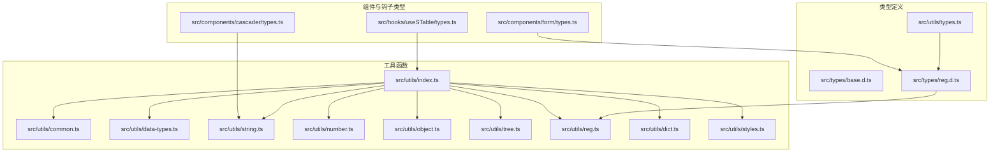
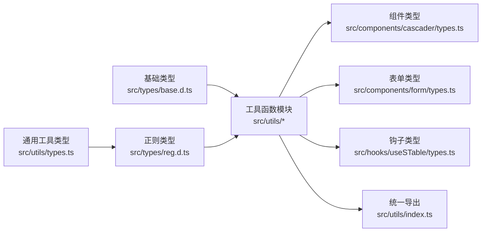
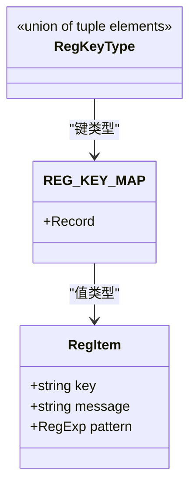
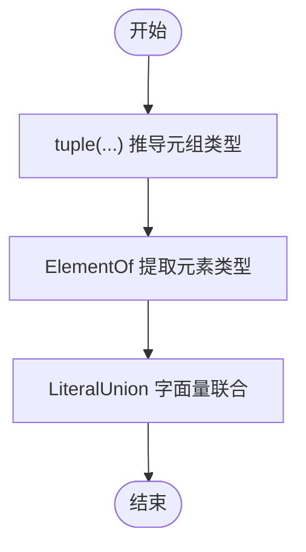
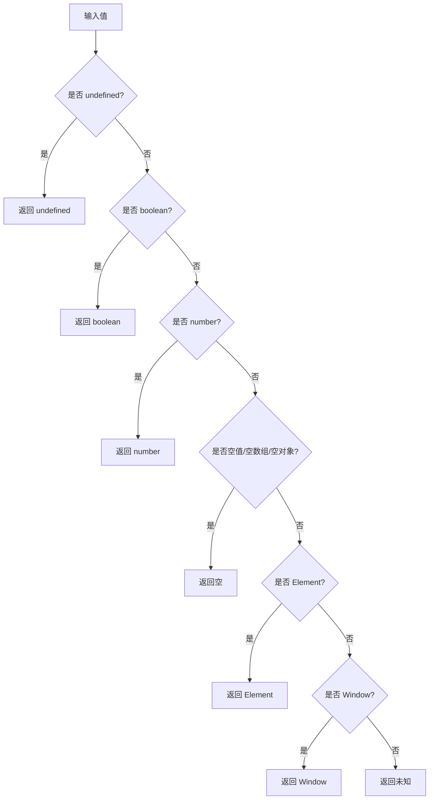
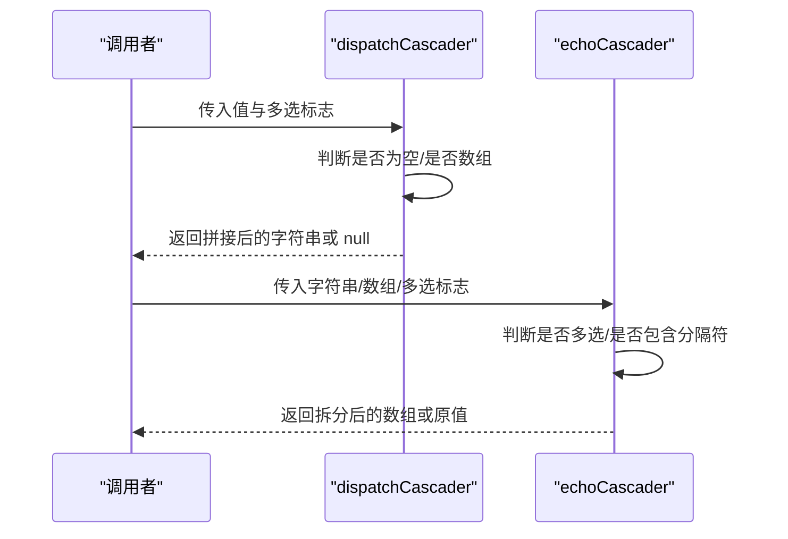
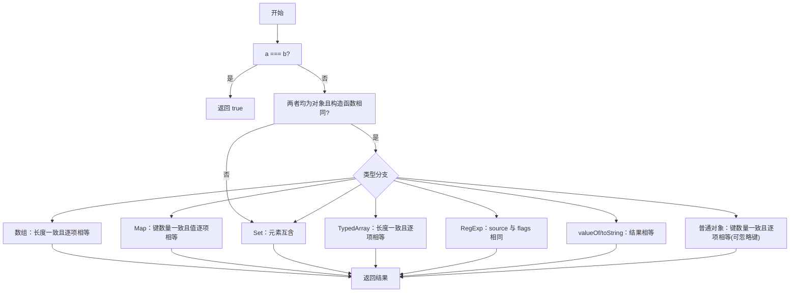
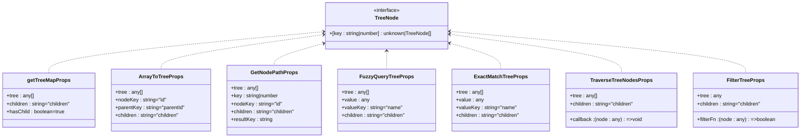
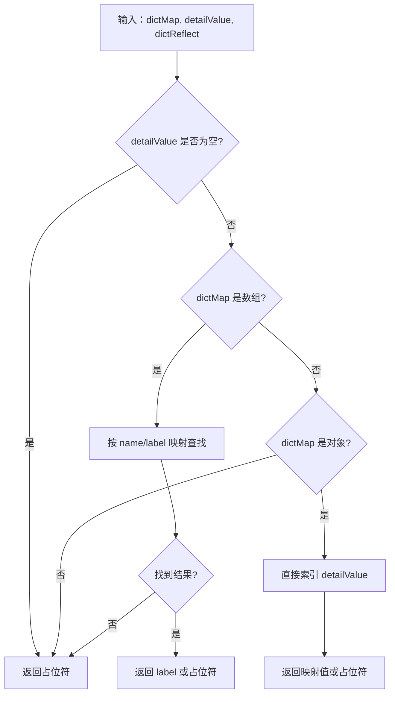
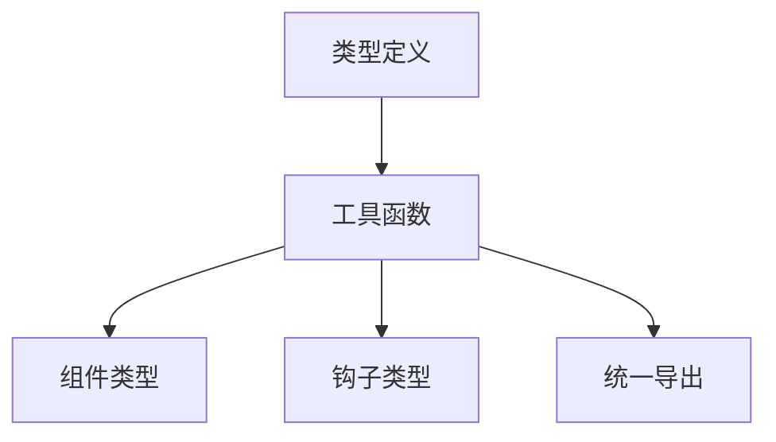

# 工具类型定义

<cite>
**本文档引用的文件**
- [src/types/base.d.ts](file://src/types/base.d.ts)
- [src/types/reg.d.ts](file://src/types/reg.d.ts)
- [src/utils/types.ts](file://src/utils/types.ts)
- [src/utils/index.ts](file://src/utils/index.ts)
- [src/utils/common.ts](file://src/utils/common.ts)
- [src/utils/data-types.ts](file://src/utils/data-types.ts)
- [src/utils/string.ts](file://src/utils/string.ts)
- [src/utils/number.ts](file://src/utils/number.ts)
- [src/utils/object.ts](file://src/utils/object.ts)
- [src/utils/tree.ts](file://src/utils/tree.ts)
- [src/utils/reg.ts](file://src/utils/reg.ts)
- [src/utils/dict.ts](file://src/utils/dict.ts)
- [src/utils/styles.ts](file://src/utils/styles.ts)
- [src/components/cascader/types.ts](file://src/components/cascader/types.ts)
- [src/components/form/types.ts](file://src/components/form/types.ts)
- [src/hooks/useSTable/types.ts](file://src/hooks/useSTable/types.ts)
</cite>

## 目录

1. [简介](#简介)
2. [项目结构](#项目结构)
3. [核心组件](#核心组件)
4. [架构总览](#架构总览)
5. [详细组件分析](#详细组件分析)
6. [依赖关系分析](#依赖关系分析)
7. [性能考虑](#性能考虑)
8. [故障排除指南](#故障排除指南)
9. [结论](#结论)
10. [附录](#附录)

## 简介

本文件系统性梳理了仓库中的工具函数类型定义，涵盖基础类型、正则表达式类型、通用工具类型与泛型约束，并结合实际工具函数的参数、返回值与类型推导规则，给出最佳实践与使用示例。读者可据此在自定义工具函数中正确应用这些类型定义，确保类型安全与可维护性。

## 项目结构

工具类型与工具函数主要分布在以下模块：

- 类型定义：src/types 下的基础类型与正则类型
- 工具函数：src/utils 下按功能划分的模块（common、data-types、string、number、object、tree、reg、dict、styles、index）
- 组件与钩子类型：src/components 与 src/hooks 下与工具类型交互的类型定义

图表来源

- [src/types/base.d.ts](file://src/types/base.d.ts#L1-L6)
- [src/types/reg.d.ts](file://src/types/reg.d.ts#L1-L61)
- [src/utils/types.ts](file://src/utils/types.ts#L1-L19)
- [src/utils/index.ts](file://src/utils/index.ts#L1-L10)
- [src/utils/common.ts](file://src/utils/common.ts#L1-L208)
- [src/utils/data-types.ts](file://src/utils/data-types.ts#L1-L34)
- [src/utils/string.ts](file://src/utils/string.ts#L1-L156)
- [src/utils/number.ts](file://src/utils/number.ts#L1-L18)
- [src/utils/object.ts](file://src/utils/object.ts#L1-L87)
- [src/utils/tree.ts](file://src/utils/tree.ts#L1-L396)
- [src/utils/reg.ts](file://src/utils/reg.ts#L1-L146)
- [src/utils/dict.ts](file://src/utils/dict.ts#L1-L121)
- [src/utils/styles.ts](file://src/utils/styles.ts#L1-L27)
- [src/components/cascader/types.ts](file://src/components/cascader/types.ts#L1-L16)
- [src/components/form/types.ts](file://src/components/form/types.ts#L1-L155)
- [src/hooks/useSTable/types.ts](file://src/hooks/useSTable/types.ts#L1-L34)

章节来源

- [src/types/base.d.ts](file://src/types/base.d.ts#L1-L6)
- [src/types/reg.d.ts](file://src/types/reg.d.ts#L1-L61)
- [src/utils/types.ts](file://src/utils/types.ts#L1-L19)
- [src/utils/index.ts](file://src/utils/index.ts#L1-L10)

## 核心组件

本节聚焦工具函数类型定义与实现的关键点，包括：

- 基础类型：ExtraComType
- 正则类型：RegKeyType、RegItem、RegKey 常量集合与 tuple 泛型
- 通用工具类型：ElementOf、LiteralUnion、tuple、tupleNum
- 数据类型检测：isUndefined、isBoolean、isNumber、isEmpty、isElement、isPropAbsent、isStringNumber、isWindow
- 字符串处理：getTextWidth、getTextWidthByDom、initialToCapital、removeSpaces、transFormat、getParameters、getSelectedText、dispatchCascader、echoCascader
- 数字处理：formatPrice、genArrFromNum
- 对象处理：isDeepEqualReact
- 树处理：多种树操作的接口与泛型
- 正则验证：REG_KEY_MAP 与 validate
- 字典映射：DictMap、dispatchDictData、dispatchCheckboxDictData、getDictMap
- 样式工具：getPrefixCls、getStyle
- 组件与钩子类型：SCascaderProps、FormComType、SFormProps、STableOptions

章节来源

- [src/types/base.d.ts](file://src/types/base.d.ts#L1-L6)
- [src/types/reg.d.ts](file://src/types/reg.d.ts#L1-L61)
- [src/utils/types.ts](file://src/utils/types.ts#L1-L19)
- [src/utils/data-types.ts](file://src/utils/data-types.ts#L1-L34)
- [src/utils/string.ts](file://src/utils/string.ts#L1-L156)
- [src/utils/number.ts](file://src/utils/number.ts#L1-L18)
- [src/utils/object.ts](file://src/utils/object.ts#L1-L87)
- [src/utils/tree.ts](file://src/utils/tree.ts#L1-L396)
- [src/utils/reg.ts](file://src/utils/reg.ts#L1-L146)
- [src/utils/dict.ts](file://src/utils/dict.ts#L1-L121)
- [src/utils/styles.ts](file://src/utils/styles.ts#L1-L27)
- [src/components/cascader/types.ts](file://src/components/cascader/types.ts#L1-L16)
- [src/components/form/types.ts](file://src/components/form/types.ts#L1-L155)
- [src/hooks/useSTable/types.ts](file://src/hooks/useSTable/types.ts#L1-L34)

## 架构总览

工具类型与工具函数之间的关系如下：

- 类型定义模块提供基础类型与正则类型，被各工具函数与组件/钩子类型引用
- 工具函数模块通过导出统一入口聚合，便于按需导入
- 组件与钩子类型依赖工具类型与工具函数，形成“类型驱动实现”的架构

图表来源

- [src/types/base.d.ts](file://src/types/base.d.ts#L1-L6)
- [src/types/reg.d.ts](file://src/types/reg.d.ts#L1-L61)
- [src/utils/types.ts](file://src/utils/types.ts#L1-L19)
- [src/utils/index.ts](file://src/utils/index.ts#L1-L10)
- [src/components/cascader/types.ts](file://src/components/cascader/types.ts#L1-L16)
- [src/components/form/types.ts](file://src/components/form/types.ts#L1-L155)
- [src/hooks/useSTable/types.ts](file://src/hooks/useSTable/types.ts#L1-L34)

## 详细组件分析

### 基础类型：ExtraComType

- 定义了组件扩展类型，包含字典键、字典映射与禁用键集合
- 用途：为组件提供统一的字典与禁用控制能力

章节来源

- [src/types/base.d.ts](file://src/types/base.d.ts#L1-L6)

### 正则类型体系

- RegKeyType：基于元组的联合类型，确保键值来自预定义集合
- RegItem：描述每个正则规则的键、消息与正则表达式
- REG_KEY_MAP：键到 RegItem 的映射，覆盖数字、百分比、手机号、中文、网站、邮箱、身份证、车牌号、十六进制颜色、IP、MAC、URL 等规则
- validate：根据键验证值是否匹配对应正则

图表来源

- [src/types/reg.d.ts](file://src/types/reg.d.ts#L56-L61)
- [src/utils/reg.ts](file://src/utils/reg.ts#L4-L131)

章节来源

- [src/types/reg.d.ts](file://src/types/reg.d.ts#L1-L61)
- [src/utils/reg.ts](file://src/utils/reg.ts#L1-L146)

### 通用工具类型与泛型

- tuple/tupleNum：通过剩余参数推导元组类型，避免枚举开销
- ElementOf：从数组/元组类型中提取元素类型
- LiteralUnion：在字面量联合与更宽类型之间进行联合，保持类型精确性

图表来源

- [src/utils/types.ts](file://src/utils/types.ts#L2-L18)

章节来源

- [src/utils/types.ts](file://src/utils/types.ts#L1-L19)

### 数据类型检测工具

- isUndefined/isBoolean/isNumber：带守卫的类型谓词，实现精准类型收窄
- isEmpty：对空值、空数组、空对象的统一判断
- isElement/isPropAbsent：DOM 元素与属性缺失的判断
- isStringNumber：字符串数字判断
- isWindow：窗口对象判断

图表来源

- [src/utils/data-types.ts](file://src/utils/data-types.ts#L6-L33)

章节来源

- [src/utils/data-types.ts](file://src/utils/data-types.ts#L1-L34)

### 字符串处理工具

- getTextWidth/getTextWidthByDom：Canvas/DOM 两种方式测量文本宽度
- initialToCapital：首字母大写
- removeSpaces：移除空格
- transFormat：全局替换字符
- getParameters：解析 URL 参数为对象
- getSelectedText：获取选中文本
- dispatchCascader/echoCascader：级联值的序列化与反序列化

图表来源

- [src/utils/string.ts](file://src/utils/string.ts#L117-L155)

章节来源

- [src/utils/string.ts](file://src/utils/string.ts#L1-L156)
- [src/components/cascader/types.ts](file://src/components/cascader/types.ts#L3-L4)

### 数字处理工具

- formatPrice：数值千分位格式化
- genArrFromNum：生成从 1 到 n 的数组

章节来源

- [src/utils/number.ts](file://src/utils/number.ts#L1-L18)

### 对象处理工具

- isDeepEqualReact：支持数组、Map、Set、TypedArray、RegExp、Symbol 等的深度比较，可忽略指定键与调试输出

图表来源

- [src/utils/object.ts](file://src/utils/object.ts#L9-L86)

章节来源

- [src/utils/object.ts](file://src/utils/object.ts#L1-L87)

### 树处理工具

- getTreeMap：将树平铺为数组，支持剔除 children
- arrayToTree：将数组转为树（非递归）
- getNodePath：查找节点路径
- fuzzyQueryTree/exactMatchTree：模糊/精确匹配树节点
- traverseTreeNodes/filterTree/traversalTree：遍历与筛选树
- removeEmptyTreeNode/getTreeLeaf：删除空子节点与获取叶子节点

图表来源

- [src/utils/tree.ts](file://src/utils/tree.ts#L4-L101)
- [src/utils/tree.ts](file://src/utils/tree.ts#L102-L202)
- [src/utils/tree.ts](file://src/utils/tree.ts#L238-L274)

章节来源

- [src/utils/tree.ts](file://src/utils/tree.ts#L1-L396)

### 正则验证工具

- REG_KEY_MAP：集中管理各类正则规则
- validate：根据键验证值是否匹配

章节来源

- [src/utils/reg.ts](file://src/utils/reg.ts#L1-L146)
- [src/types/reg.d.ts](file://src/types/reg.d.ts#L56-L61)

### 字典映射工具

- DictMap：字典映射的联合类型
- dispatchDictData：单值映射
- dispatchCheckboxDictData：多值映射（逗号分隔）
- getDictMap：优先使用局部字典，否则回退到全局字典

图表来源

- [src/utils/dict.ts](file://src/utils/dict.ts#L30-L55)

章节来源

- [src/utils/dict.ts](file://src/utils/dict.ts#L1-L121)

### 样式工具

- getPrefixCls：统一样式前缀
- getStyle：按键值对生成内联样式对象

章节来源

- [src/utils/styles.ts](file://src/utils/styles.ts#L1-L27)

### 组件与钩子类型

- SCascaderProps：级联组件的扩展属性，包含 onChange/value/multiple 等
- FormComType/SFormProps：表单组件类型与表单属性，支持 regKey 等校验字段
- STableOptions/STableResult：表格钩子的扩展选项与结果类型

章节来源

- [src/components/cascader/types.ts](file://src/components/cascader/types.ts#L1-L16)
- [src/components/form/types.ts](file://src/components/form/types.ts#L1-L155)
- [src/hooks/useSTable/types.ts](file://src/hooks/useSTable/types.ts#L1-L34)

## 依赖关系分析

- 类型依赖：正则类型依赖通用工具类型（tuple），工具函数依赖类型定义
- 实现依赖：工具函数通过统一导出模块聚合，组件与钩子类型依赖工具类型与工具函数
- 循环依赖：未发现循环依赖迹象

图表来源

- [src/utils/index.ts](file://src/utils/index.ts#L1-L10)
- [src/types/reg.d.ts](file://src/types/reg.d.ts#L1-L61)
- [src/utils/types.ts](file://src/utils/types.ts#L1-L19)

章节来源

- [src/utils/index.ts](file://src/utils/index.ts#L1-L10)

## 性能考虑

- 使用 ElementOf/LiteralUnion 等工具类型可减少运行时开销，提升编译期类型推断效率
- 树处理函数采用非递归实现（如 arrayToTree），降低栈溢出风险
- 正则验证使用预构建映射，避免重复构造正则表达式
- DOM 测量文本宽度时建议缓存 Canvas 上下文，减少频繁创建

## 故障排除指南

- 正则验证失败：检查键是否在 RegKeyType 预定义集合中，确认 REG_KEY_MAP 中对应规则存在
- 级联值处理异常：确认传入值类型与 multiple 标志一致，避免混用字符串与数组
- 字典映射无结果：检查 dictReflect 的 name/label 键是否与数据结构一致
- 深度比较误判：若忽略特定键，请确保 ignoreKeys 设置正确；调试模式下可启用日志定位

章节来源

- [src/utils/reg.ts](file://src/utils/reg.ts#L139-L145)
- [src/utils/string.ts](file://src/utils/string.ts#L117-L155)
- [src/utils/dict.ts](file://src/utils/dict.ts#L30-L55)
- [src/utils/object.ts](file://src/utils/object.ts#L9-L86)

## 结论

本文件系统化梳理了工具函数类型定义与实现，明确了基础类型、正则类型、通用工具类型与泛型约束，并结合实际工具函数展示了参数、返回值与类型推导规则。遵循本文档的最佳实践，可在自定义工具函数中正确使用这些类型定义，提升类型安全与可维护性。

## 附录

- 最佳实践
  - 使用 tuple/tupleNum 定义有限枚举，避免字符串字面量散落
  - 使用 ElementOf 提取数组/元组元素类型，配合 LiteralUnion 精准表达联合类型
  - 在组件与钩子类型中优先使用已定义的 RegKeyType，确保正则规则一致性
  - 对复杂数据结构（树、字典）使用明确的接口与泛型，增强可读性与可测试性
- 使用示例（路径指引）
  - 正则验证：[src/utils/reg.ts](file://src/utils/reg.ts#L139-L145)
  - 级联值处理：[src/utils/string.ts](file://src/utils/string.ts#L117-L155)
  - 字典映射：[src/utils/dict.ts](file://src/utils/dict.ts#L30-L55)
  - 深度比较：[src/utils/object.ts](file://src/utils/object.ts#L9-L86)
  - 树处理：[src/utils/tree.ts](file://src/utils/tree.ts#L19-L50)
