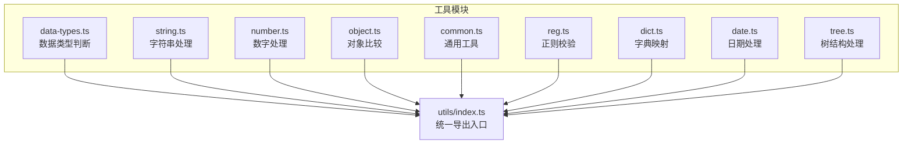
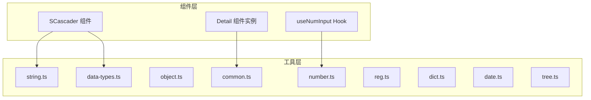
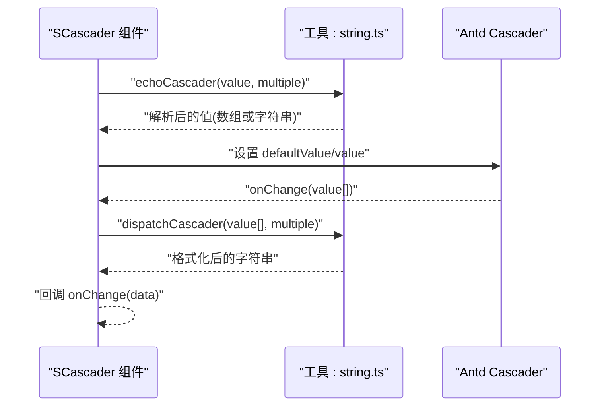
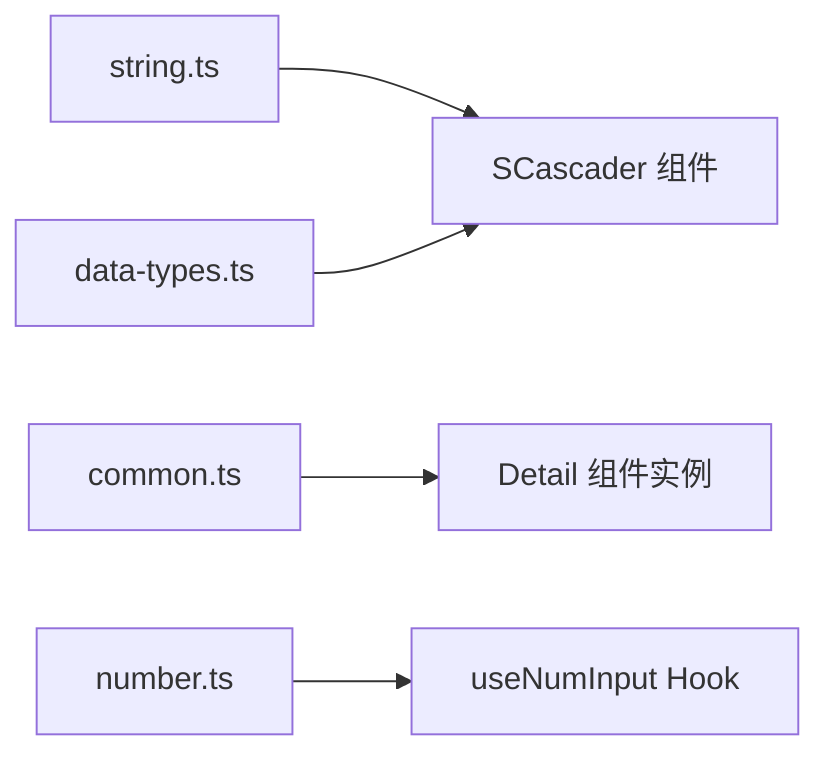

# 数据处理工具

<cite>
**本文引用的文件**
- [src/utils/data-types.ts](file://src/utils/data-types.ts)
- [src/utils/string.ts](file://src/utils/string.ts)
- [src/utils/number.ts](file://src/utils/number.ts)
- [src/utils/object.ts](file://src/utils/object.ts)
- [src/utils/common.ts](file://src/utils/common.ts)
- [src/utils/index.ts](file://src/utils/index.ts)
- [src/utils/date.ts](file://src/utils/date.ts)
- [src/utils/reg.ts](file://src/utils/reg.ts)
- [src/utils/tree.ts](file://src/utils/tree.ts)
- [src/utils/dict.ts](file://src/utils/dict.ts)
- [src/components/cascader/index.tsx](file://src/components/cascader/index.tsx)
- [src/components/cascader/types.ts](file://src/components/cascader/types.ts)
- [src/components/detail/instance.tsx](file://src/components/detail/instance.tsx)
- [src/hooks/useNumInput.ts](file://src/hooks/useNumInput.ts)
</cite>

## 目录

1. [简介](#简介)
2. [项目结构](#项目结构)
3. [核心组件](#核心组件)
4. [架构总览](#架构总览)
5. [详细组件分析](#详细组件分析)
6. [依赖关系分析](#依赖关系分析)
7. [性能考量](#性能考量)
8. [故障排查指南](#故障排查指南)
9. [结论](#结论)
10. [附录](#附录)

## 简介

本文件系统性梳理仓库中的数据处理工具函数，覆盖数据类型判断、字符串处理、数字处理、对象操作与通用工具，并结合组件使用场景给出最佳实践与调用流程图示。目标是帮助开发者快速理解各工具函数的用途、参数、返回值与适用场景，确保在组件开发中正确、高效地使用这些工具。

## 项目结构

数据处理工具集中位于 src/utils 目录，按功能域拆分模块并通过统一出口导出，便于按需导入与整体聚合使用。

图表来源

- [src/utils/index.ts](file://src/utils/index.ts#L1-L10)

章节来源

- [src/utils/index.ts](file://src/utils/index.ts#L1-L10)

## 核心组件

本节概览各工具模块提供的关键函数及其职责边界，便于快速定位所需能力。

- 数据类型判断
  - isUndefined、isBoolean、isNumber、isString、isEmpty、isElement、isPropAbsent、isStringNumber、isWindow
- 字符串处理
  - getTextWidth、getTextWidthByDom、initialToCapital、removeSpaces、transFormat、getParameters、getSelectedText、dispatchCascader、echoCascader
- 数字处理
  - formatPrice、genArrFromNum
- 对象操作
  - isDeepEqualReact（深度相等判断）
- 通用工具
  - createCode、dispatchFileName、createArray、getBase64、injectScript、copyToClipboard、isBrowser

章节来源

- [src/utils/data-types.ts](file://src/utils/data-types.ts#L6-L34)
- [src/utils/string.ts](file://src/utils/string.ts#L14-L156)
- [src/utils/number.ts](file://src/utils/number.ts#L8-L18)
- [src/utils/object.ts](file://src/utils/object.ts#L9-L86)
- [src/utils/common.ts](file://src/utils/common.ts#L6-L208)

## 架构总览

工具模块之间低耦合，通过统一导出入口对外暴露。组件层在需要时按需导入，减少打包体积并提升可维护性。

图表来源

- [src/components/cascader/index.tsx](file://src/components/cascader/index.tsx#L9-L9)
- [src/components/detail/instance.tsx](file://src/components/detail/instance.tsx#L97-L97)
- [src/hooks/useNumInput.ts](file://src/hooks/useNumInput.ts#L14-L14)

## 详细组件分析

### 数据类型判断工具（data-types.ts）

- 函数清单与用途
  - isUndefined(val): 判断值是否为 undefined
  - isBoolean(val): 判断布尔类型
  - isNumber(val): 判断数值类型
  - isEmpty(val): 判断空值（包含空字符串、空数组、空对象、0 等）
  - isElement(e): 判断是否为 DOM 元素
  - isPropAbsent(prop): 判断属性是否为 null 或 undefined
  - isStringNumber(val): 判断字符串是否可解析为有效数字
  - isWindow(val): 判断是否为 window 对象
- 参数与返回值
  - 所有函数均接收单一参数，返回布尔值或类型守卫断言
- 实际应用
  - 在组件初始化与变更时，用于安全判断输入形态，避免运行时错误
- 复杂度与性能
  - 基本为 O(1)，无额外内存开销
- 最佳实践
  - 优先使用类型守卫函数进行分支收敛，减少隐式类型转换带来的风险

章节来源

- [src/utils/data-types.ts](file://src/utils/data-types.ts#L6-L34)

### 字符串处理工具（string.ts）

- 函数清单与用途
  - getTextWidth(text, font): Canvas 测量文本宽度
  - getTextWidthByDom(text, font): DOM 测量文本宽度
  - initialToCapital(str): 首字母大写
  - removeSpaces(str): 去除所有空白字符
  - transFormat(str, oldChar, newChar): 全部替换指定字符
  - getParameters(paramStr): 解析 URL 参数为对象
  - getSelectedText(): 获取当前选中文本
  - dispatchCascader(value, multiple): 级联选择器值格式化（输出字符串）
  - echoCascader(value, multiple): 级联选择器值反向解析（支持多选）
- 参数与返回值
  - 多数函数接受字符串与样式/标志位，返回字符串或解析结果
  - 级联处理函数在多选与单选场景下返回不同结构
- 实际应用
  - 文本宽度测量用于布局自适应
  - 级联处理函数用于与 Ant Design Cascader 的双向数据桥接
- 复杂度与性能
  - 除 Canvas/DOM 测量外，其余为 O(n) 或 O(1)
- 最佳实践
  - 在高频测量场景优先考虑缓存策略
  - 级联处理建议在组件层统一收敛，避免散落逻辑

图表来源

- [src/components/cascader/index.tsx](file://src/components/cascader/index.tsx#L34-L56)
- [src/utils/string.ts](file://src/utils/string.ts#L117-L155)

章节来源

- [src/utils/string.ts](file://src/utils/string.ts#L14-L156)
- [src/components/cascader/index.tsx](file://src/components/cascader/index.tsx#L34-L56)
- [src/components/cascader/types.ts](file://src/components/cascader/types.ts#L3-L4)

### 数字处理工具（number.ts）

- 函数清单与用途
  - formatPrice(price): 数值本地化千分位格式
  - genArrFromNum(num): 生成从 1 到 n 的递增数组
- 参数与返回值
  - formatPrice 接受数值，返回字符串
  - genArrFromNum 接受整数，返回数组
- 实际应用
  - 价格展示与表格序号生成
- 复杂度与性能
  - O(1) 与 O(n) 不等长数组构造

章节来源

- [src/utils/number.ts](file://src/utils/number.ts#L8-L18)

### 对象操作工具（object.ts）

- 函数清单与用途
  - isDeepEqualReact(a, b, ignoreKeys?, debug?): 深度比较两对象（含数组、Map、Set、TypedArray、RegExp、valueOf/toString 等）
- 参数与返回值
  - 支持忽略特定键与调试模式
- 实际应用
  - 组件渲染优化、状态对比、事件去重
- 复杂度与性能
  - 平均 O(n)，最坏 O(n^2)（嵌套结构）
- 最佳实践
  - 合理使用 ignoreKeys，避免误判
  - 大对象深比较建议配合浅比较先行过滤

章节来源

- [src/utils/object.ts](file://src/utils/object.ts#L9-L86)

### 通用工具（common.ts）

- 函数清单与用途
  - createCode(num): 生成指定长度的字母数字组合
  - dispatchFileName(name, nameLimit): 文件名截断显示（前后各保留固定长度）
  - createArray(num): 生成 0..n-1 的数组
  - getBase64(file): 文件转 Base64（Promise）
  - injectScript(src): 动态注入脚本
  - copyToClipboard(text, successCb?, errorCb?): 写入剪贴板（带权限检查）
  - isBrowser(): 判断是否在浏览器环境（含测试环境特判）
- 参数与返回值
  - getBase64 返回 Promise<string>
  - copyToClipboard 返回 Promise<void>
  - isBrowser 返回 boolean
- 实际应用
  - 组件 ID 生成、文件名省略、动态脚本加载、剪贴板交互
- 复杂度与性能
  - 除文件读取外均为 O(1)/O(n)
- 最佳实践
  - 剪贴板写入需处理权限与降级
  - 动态脚本注入注意顺序与错误处理

章节来源

- [src/utils/common.ts](file://src/utils/common.ts#L6-L208)

### 正则校验工具（reg.ts）

- 能力概述
  - 提供常用业务正则集合（如手机号、邮箱、身份证、百分比、IP、MAC、颜色等）
  - validate(key, value): 校验值是否符合预设规则
- 应用场景
  - 表单校验、输入限制、数据清洗
- 最佳实践
  - 结合组件的 regKey 字段使用，避免重复定义

章节来源

- [src/utils/reg.ts](file://src/utils/reg.ts#L4-L146)

### 字典映射工具（dict.ts）

- 能力概述
  - dispatchDictData(dictMap, detailValue, dictReflect?): 单值映射
  - dispatchCheckboxDictData(dictMap, detailValue, dictReflect?): 多值映射（逗号分隔）
  - getDictMap({ dictMap, globalDict, dictKey }): 获取字典映射
- 实际应用
  - 列表/详情页展示值美化
- 最佳实践
  - 明确 dictReflect 的 name/label 映射，保证一致性

章节来源

- [src/utils/dict.ts](file://src/utils/dict.ts#L30-L120)

### 日期处理工具（date.ts）

- 能力概述
  - getDateVal(data): 将多种日期输入标准化为 Day.js 实例或数组
- 实际应用
  - 表单日期控件的输入兼容与统一处理
- 最佳实践
  - 输入校验与默认值兜底

章节来源

- [src/utils/date.ts](file://src/utils/date.ts#L21-L43)

### 树结构处理工具（tree.ts）

- 能力概述
  - getTreeMap、arrayToTree、getNodePath、fuzzyQueryTree、exactMatchTree、traverseTreeNodes、filterTree、traversalTree、removeEmptyTreeNode、getTreeLeaf
- 实际应用
  - 权限菜单、组织架构、目录树、搜索与筛选
- 最佳实践
  - 大树结构建议配合分页/懒加载与缓存

章节来源

- [src/utils/tree.ts](file://src/utils/tree.ts#L19-L395)

## 依赖关系分析

- 工具模块内部低耦合，通过统一出口导出
- 组件层仅依赖工具层接口，不直接依赖第三方库细节
- 级联组件与字符串工具形成稳定契约，便于扩展

图表来源

- [src/components/cascader/index.tsx](file://src/components/cascader/index.tsx#L9-L9)
- [src/components/detail/instance.tsx](file://src/components/detail/instance.tsx#L97-L97)
- [src/hooks/useNumInput.ts](file://src/hooks/useNumInput.ts#L14-L14)

章节来源

- [src/utils/index.ts](file://src/utils/index.ts#L1-L10)

## 性能考量

- 字符串测量
  - Canvas 与 DOM 两种方案，建议在可预测字体时优先 Canvas，动态字体时使用 DOM
- 深度比较
  - 大对象建议先浅比较，再对差异部分深比较
- 正则校验
  - 复用 REG_KEY_MAP，避免重复构造正则
- 动态脚本
  - 注入脚本需注意执行顺序与错误回退

## 故障排查指南

- 级联组件值异常
  - 确认输入形态（字符串/数组），必要时使用 echoCascader 与 dispatchCascader 进行双向转换
- 文本宽度测量为 0
  - 检查字体参数与上下文是否存在
- 剪贴板写入失败
  - 确认浏览器支持与权限状态，提供 errorCb 进行降级处理
- 深度比较误判
  - 使用 ignoreKeys 排除不稳定字段，或开启 debug 输出差异键

章节来源

- [src/utils/string.ts](file://src/utils/string.ts#L117-L155)
- [src/utils/common.ts](file://src/utils/common.ts#L161-L182)
- [src/utils/object.ts](file://src/utils/object.ts#L9-L86)

## 结论

本工具集覆盖了前端常见数据处理需求：类型判断、字符串与数字格式化、对象比较、通用环境与资源处理，以及与业务密切相关的正则校验、字典映射与树结构处理。通过统一导出与清晰的契约，既保证了组件层的简洁，也提升了可维护性与复用性。建议在组件开发中遵循“先类型守卫、再格式化、后渲染”的流程，配合缓存与降级策略，获得更稳健的用户体验。

## 附录

- 常用工具函数速查
  - 类型判断：isUndefined、isBoolean、isNumber、isEmpty、isElement、isPropAbsent、isStringNumber、isWindow
  - 字符串：getTextWidth、getTextWidthByDom、initialToCapital、removeSpaces、transFormat、getParameters、getSelectedText、dispatchCascader、echoCascader
  - 数字：formatPrice、genArrFromNum
  - 对象：isDeepEqualReact
  - 通用：createCode、dispatchFileName、createArray、getBase64、injectScript、copyToClipboard、isBrowser
- 组件使用参考
  - 级联组件：SCascader 与字符串工具协作完成双向数据桥接
  - 详情组件：使用通用工具生成组件 ID 与克隆配置
  - 数字输入 Hook：使用数字工具进行输入规范化
