# 树形数据处理

<cite>
**本文引用的文件**
- [src/utils/tree.ts](file://src/utils/tree.ts)
- [src/utils/index.ts](file://src/utils/index.ts)
- [src/components/cascader/demos/constant.ts](file://src/components/cascader/demos/constant.ts)
- [src/components/cascader/index.tsx](file://src/components/cascader/index.tsx)
- [src/components/cascader/types.ts](file://src/components/cascader/types.ts)
</cite>

## 目录

1. [简介](#简介)
2. [项目结构](#项目结构)
3. [核心组件](#核心组件)
4. [架构总览](#架构总览)
5. [详细组件分析](#详细组件分析)
6. [依赖关系分析](#依赖关系分析)
7. [性能考量](#性能考量)
8. [故障排查指南](#故障排查指南)
9. [结论](#结论)
10. [附录](#附录)

## 简介

本文件系统性梳理仓库中的树形数据处理工具函数，覆盖以下能力与场景：

- 扁平化数据转树形（非递归）
- 树形数据平铺为数组
- 路径查找（从根到目标节点的键序列）
- 模糊查询与精确匹配
- 遍历与节点属性批量修改
- 过滤（保留满足条件的节点及其祖先链）
- 叶子节点提取
- 空子节点清理
- 实际应用：菜单/组织架构/分类等常见业务场景

上述能力均来自统一的工具模块，并通过导出入口集中暴露，便于在组件层按需使用。

## 项目结构

与树形处理相关的核心位置如下：

- 工具函数：src/utils/tree.ts
- 工具导出入口：src/utils/index.ts
- 组件示例（级联选择器）：src/components/cascader/\*
  - 示例数据：src/components/cascader/demos/constant.ts
  - 组件实现：src/components/cascader/index.tsx
  - 类型定义：src/components/cascader/types.ts

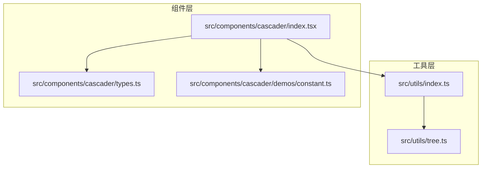

图表来源

- [src/utils/tree.ts](file://src/utils/tree.ts#L1-L396)
- [src/utils/index.ts](file://src/utils/index.ts#L1-L10)
- [src/components/cascader/index.tsx](file://src/components/cascader/index.tsx#L1-L77)
- [src/components/cascader/types.ts](file://src/components/cascader/types.ts#L1-L16)
- [src/components/cascader/demos/constant.ts](file://src/components/cascader/demos/constant.ts#L1-L88)

章节来源

- [src/utils/tree.ts](file://src/utils/tree.ts#L1-L396)
- [src/utils/index.ts](file://src/utils/index.ts#L1-L10)

## 核心组件

本节对树形处理工具函数进行逐项说明，包括输入参数、行为特征、时间复杂度与典型用法要点。

- 扁平数组转树（非递归）

  - 函数名：arrayToTree
  - 关键参数：nodeKey（节点标识字段，默认 id）、parentKey（父节点标识字段，默认 parentId）、children（子节点集合字段，默认 children）
  - 行为：基于映射表建立父子关系，将无父节点的项作为根节点输出
  - 复杂度：O(n)，空间 O(n)
  - 典型用途：后端返回的层级扁平数据转前端树形结构

- 树平铺为数组

  - 函数名：getTreeMap
  - 关键参数：children、hasChild（是否保留 children 字段）
  - 行为：深度优先遍历，收集节点；可选移除 children 字段
  - 复杂度：O(n)
  - 典型用途：将树展开为列表，便于渲染或导出

- 路径查找（从根到目标节点的键序列）

  - 函数名：getNodePath
  - 关键参数：key（目标节点键值）、nodeKey（节点键字段，默认 id）、children
  - 行为：先序遍历记录路径，命中即返回路径数组；未命中返回空数组
  - 复杂度：最坏 O(n)
  - 典型用途：定位面包屑、高亮路径、回显选中状态

- 模糊查询

  - 函数名：fuzzyQueryTree
  - 关键参数：value（查询值）、valueKey（用于匹配的字段，默认 name）、children
  - 行为：对每个节点执行包含式匹配，若子树命中则合并结果
  - 复杂度：最坏 O(n)
  - 典型用途：搜索框联动、筛选列表

- 精确匹配

  - 函数名：exactMatchTree
  - 关键参数：value、valueKey、children
  - 行为：返回首个完全匹配的节点或 null
  - 复杂度：最坏 O(n)
  - 典型用途：根据唯一标识获取节点对象

- 遍历与节点属性批量修改

  - 函数名：traverseTreeNodes、traversalTree
  - 关键参数：callback（回调函数）、children
  - 行为：对每个节点执行回调；traverseTreeNodes 返回原树，traversalTree 原地修改
  - 复杂度：O(n)
  - 典型用途：批量设置状态、打标、格式化字段

- 过滤（保留满足条件的节点及其祖先链）

  - 函数名：filterTree
  - 关键参数：filterFn（过滤函数）、children
  - 行为：自顶向下递归，仅保留满足条件的节点及包含其后代的分支
  - 复杂度：O(n)
  - 典型用途：权限控制、动态筛选

- 叶子节点提取

  - 函数名：getTreeLeaf
  - 关键参数：children
  - 行为：收集所有叶子节点
  - 复杂度：O(n)
  - 典型用途：统计末级节点、构建只读列表

- 空子节点清理
  - 函数名：removeEmptyTreeNode
  - 关键参数：children
  - 行为：删除空 children 或不存在 children 的字段，保持结构简洁
  - 复杂度：O(n)
  - 典型用途：去除冗余字段、减少序列化体积

章节来源

- [src/utils/tree.ts](file://src/utils/tree.ts#L52-L93)
- [src/utils/tree.ts](file://src/utils/tree.ts#L19-L50)
- [src/utils/tree.ts](file://src/utils/tree.ts#L110-L149)
- [src/utils/tree.ts](file://src/utils/tree.ts#L166-L195)
- [src/utils/tree.ts](file://src/utils/tree.ts#L210-L236)
- [src/utils/tree.ts](file://src/utils/tree.ts#L250-L268)
- [src/utils/tree.ts](file://src/utils/tree.ts#L319-L333)
- [src/utils/tree.ts](file://src/utils/tree.ts#L283-L310)
- [src/utils/tree.ts](file://src/utils/tree.ts#L362-L383)
- [src/utils/tree.ts](file://src/utils/tree.ts#L341-L354)

## 架构总览

工具函数统一由工具模块导出，组件层通过导出入口按需引入。组件示例展示了如何结合树形数据处理能力完成业务交互。

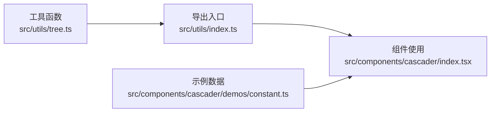

图表来源

- [src/utils/tree.ts](file://src/utils/tree.ts#L385-L395)
- [src/utils/index.ts](file://src/utils/index.ts#L1-L10)
- [src/components/cascader/index.tsx](file://src/components/cascader/index.tsx#L1-L77)
- [src/components/cascader/demos/constant.ts](file://src/components/cascader/demos/constant.ts#L1-L88)

## 详细组件分析

### 扁平数组转树（非递归）

- 设计要点
  - 使用映射表快速定位父节点，避免重复扫描
  - 无父节点的元素直接作为根节点加入结果
- 复杂度
  - 时间：O(n)
  - 空间：O(n)
- 典型场景
  - 后端返回的层级扁平数据（如地区、部门、分类）转树
  - 与后端接口约定一致的字段名时，可直接使用默认键名

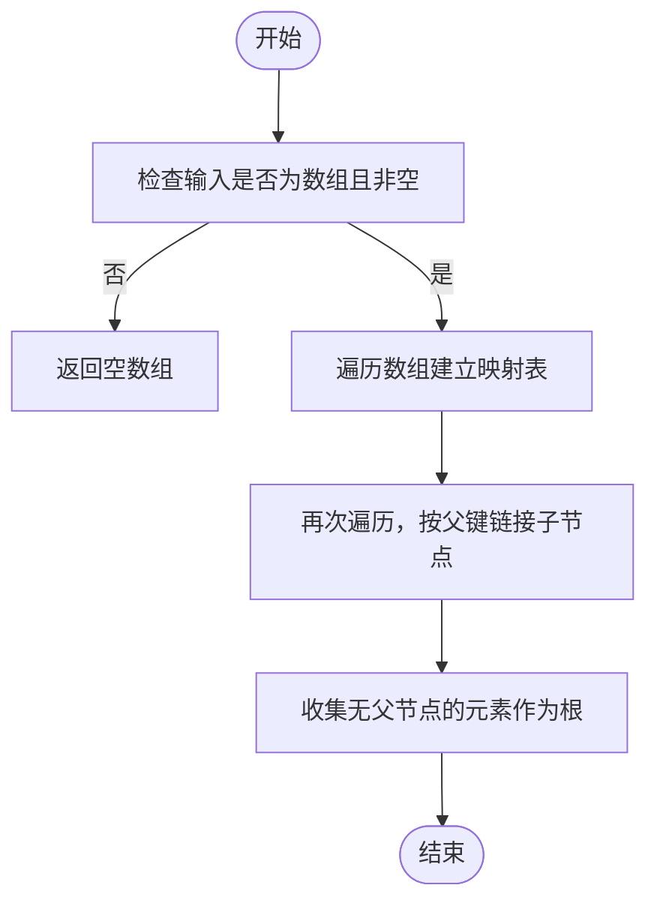

图表来源

- [src/utils/tree.ts](file://src/utils/tree.ts#L67-L93)

章节来源

- [src/utils/tree.ts](file://src/utils/tree.ts#L67-L93)

### 树平铺为数组

- 设计要点
  - 支持是否保留 children 字段
  - 采用递归拼接子树结果
- 复杂度
  - 时间：O(n)
  - 空间：O(n)（不含递归栈）

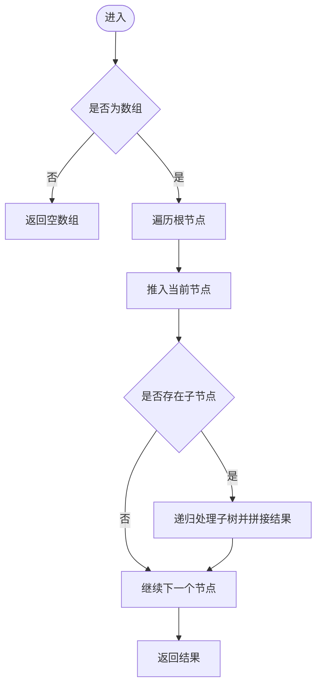

图表来源

- [src/utils/tree.ts](file://src/utils/tree.ts#L19-L50)

章节来源

- [src/utils/tree.ts](file://src/utils/tree.ts#L19-L50)

### 路径查找（从根到目标节点）

- 设计要点
  - 使用先序遍历记录路径，命中即返回
  - 未命中时回溯弹出路径
- 复杂度
  - 最坏 O(n)

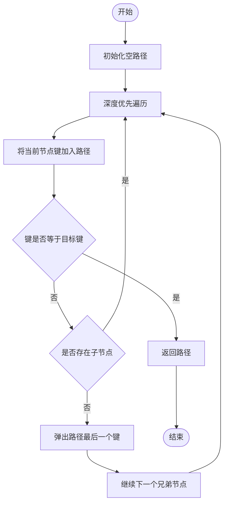

图表来源

- [src/utils/tree.ts](file://src/utils/tree.ts#L110-L149)

章节来源

- [src/utils/tree.ts](file://src/utils/tree.ts#L110-L149)

### 模糊查询与精确匹配

- 模糊查询
  - 行为：对每个节点执行包含式匹配，若子树命中则合并结果
  - 复杂度：最坏 O(n)
- 精确匹配
  - 行为：返回首个完全匹配的节点或 null
  - 复杂度：最坏 O(n)

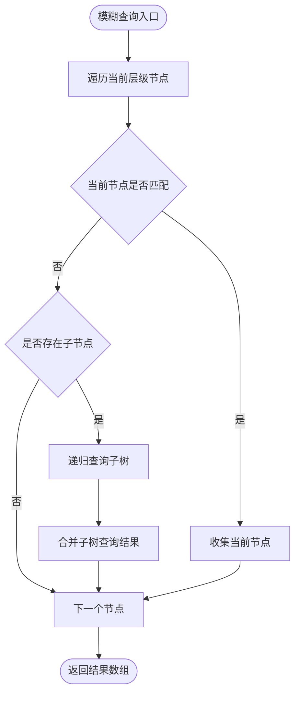

图表来源

- [src/utils/tree.ts](file://src/utils/tree.ts#L166-L195)

章节来源

- [src/utils/tree.ts](file://src/utils/tree.ts#L166-L195)
- [src/utils/tree.ts](file://src/utils/tree.ts#L210-L236)

### 遍历与节点属性批量修改

- traverseTreeNodes
  - 行为：对每个节点执行回调，返回原树
  - 复杂度：O(n)
- traversalTree
  - 行为：原地遍历并执行回调
  - 复杂度：O(n)

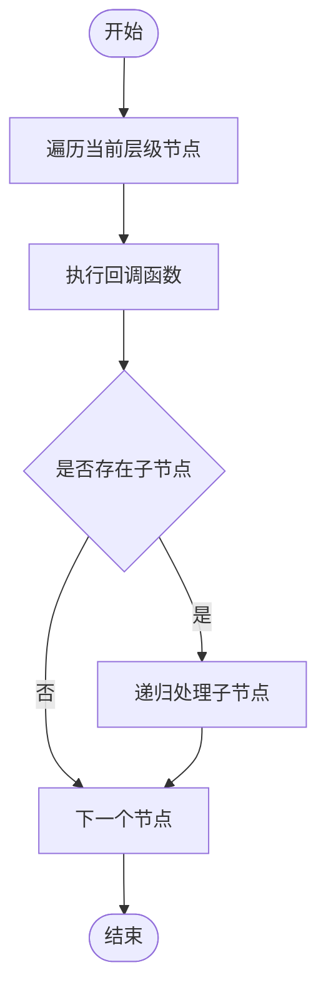

图表来源

- [src/utils/tree.ts](file://src/utils/tree.ts#L250-L268)
- [src/utils/tree.ts](file://src/utils/tree.ts#L319-L333)

章节来源

- [src/utils/tree.ts](file://src/utils/tree.ts#L250-L268)
- [src/utils/tree.ts](file://src/utils/tree.ts#L319-L333)

### 过滤（保留满足条件的节点及其祖先链）

- 行为：自顶向下递归，仅保留满足条件的节点及包含其后代的分支
- 复杂度：O(n)

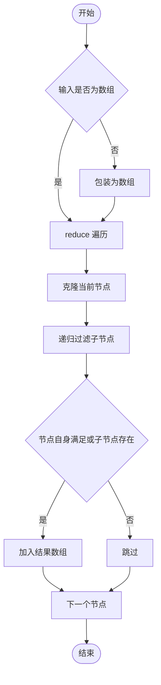

图表来源

- [src/utils/tree.ts](file://src/utils/tree.ts#L283-L310)

章节来源

- [src/utils/tree.ts](file://src/utils/tree.ts#L283-L310)

### 叶子节点提取与空子节点清理

- getTreeLeaf
  - 行为：收集所有叶子节点
  - 复杂度：O(n)
- removeEmptyTreeNode
  - 行为：删除空 children 或不存在 children 的字段
  - 复杂度：O(n)

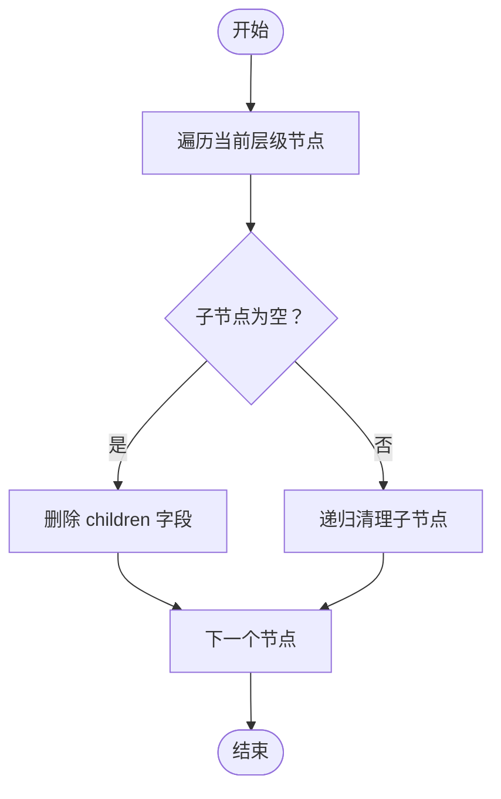

图表来源

- [src/utils/tree.ts](file://src/utils/tree.ts#L341-L354)

章节来源

- [src/utils/tree.ts](file://src/utils/tree.ts#L362-L383)
- [src/utils/tree.ts](file://src/utils/tree.ts#L341-L354)

### 组件集成示例（级联选择器）

- 示例数据
  - 提供了包含多层级 children 的示例树，字段包含 id、value、label、children
- 组件职责
  - 根据传入的字符串/数字/数组值进行解析与回显
  - 通过 onChange 回调将内部值转换为业务所需的字符串形式
- 与树形工具的关系
  - 示例数据可直接用于演示树形处理函数的能力
  - 组件本身不直接调用树形工具，但示例数据与工具函数配合可用于更复杂的级联逻辑

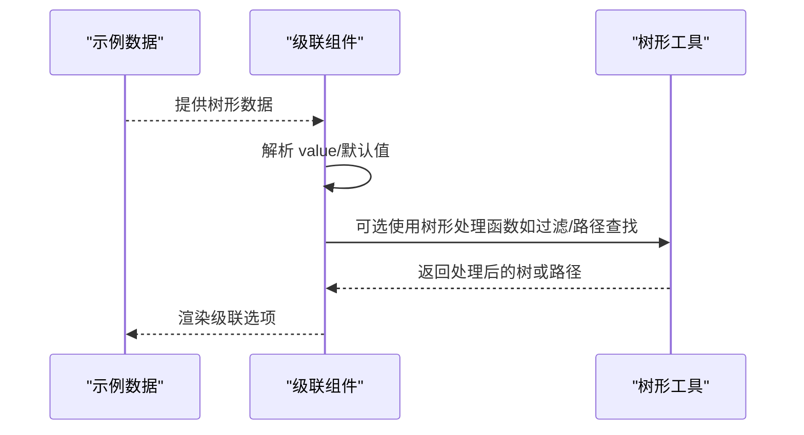

图表来源

- [src/components/cascader/demos/constant.ts](file://src/components/cascader/demos/constant.ts#L1-L88)
- [src/components/cascader/index.tsx](file://src/components/cascader/index.tsx#L1-L77)
- [src/utils/tree.ts](file://src/utils/tree.ts#L1-L396)

章节来源

- [src/components/cascader/demos/constant.ts](file://src/components/cascader/demos/constant.ts#L1-L88)
- [src/components/cascader/index.tsx](file://src/components/cascader/index.tsx#L1-L77)
- [src/components/cascader/types.ts](file://src/components/cascader/types.ts#L1-L16)

## 依赖关系分析

- 导出关系
  - 工具函数统一在工具模块内实现并导出
  - 工具导出入口集中 re-export，组件通过入口按需引入
- 组件与工具的耦合
  - 组件示例使用示例数据进行渲染演示
  - 组件本身不直接依赖树形工具，但示例数据与工具函数配合可用于更复杂的业务逻辑

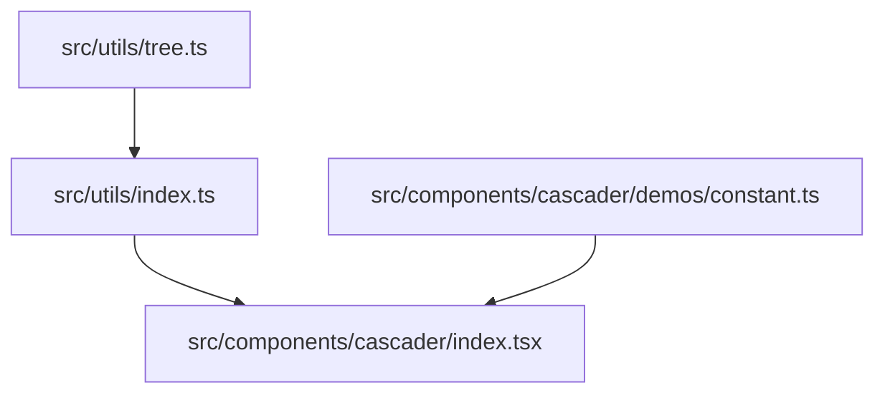

图表来源

- [src/utils/tree.ts](file://src/utils/tree.ts#L385-L395)
- [src/utils/index.ts](file://src/utils/index.ts#L1-L10)
- [src/components/cascader/index.tsx](file://src/components/cascader/index.tsx#L1-L77)
- [src/components/cascader/demos/constant.ts](file://src/components/cascader/demos/constant.ts#L1-L88)

章节来源

- [src/utils/index.ts](file://src/utils/index.ts#L1-L10)

## 性能考量

- 时间复杂度
  - 多数函数为 O(n)，其中 n 为节点总数
  - 路径查找、模糊查询、精确匹配在最坏情况下为 O(n)
- 空间复杂度
  - 递归函数的调用栈深度与树高相关，最坏 O(n)
  - 非递归转树使用映射表，空间 O(n)
- 优化建议
  - 大数据量场景下优先使用非递归转树（已实现）
  - 避免在高频回调中进行深层复制，必要时复用节点引用
  - 对频繁查询的场景，可预先构建索引（如按 valueKey 建立映射），以降低查询成本
  - 在过滤/查询前先做预处理（如去空子节点、标准化字段），减少后续遍历开销

## 故障排查指南

- 输入类型错误
  - 确保传入的树为数组；对于非数组输入，多数函数会直接返回空结果
- 键名不匹配
  - 当节点键与默认键（如 id、parentId、name）不一致时，需显式传入对应键名参数
- 空子节点导致结构冗余
  - 使用空子节点清理函数去除空 children 字段，保持结构简洁
- 路径查找失败
  - 检查目标键是否存在重复；路径查找返回首个匹配路径
- 过滤结果异常
  - 确认过滤函数的判定逻辑是否覆盖“自身满足”和“子树存在满足项”的两种情况

章节来源

- [src/utils/tree.ts](file://src/utils/tree.ts#L19-L50)
- [src/utils/tree.ts](file://src/utils/tree.ts#L110-L149)
- [src/utils/tree.ts](file://src/utils/tree.ts#L166-L195)
- [src/utils/tree.ts](file://src/utils/tree.ts#L210-L236)
- [src/utils/tree.ts](file://src/utils/tree.ts#L250-L268)
- [src/utils/tree.ts](file://src/utils/tree.ts#L283-L310)
- [src/utils/tree.ts](file://src/utils/tree.ts#L341-L354)
- [src/utils/tree.ts](file://src/utils/tree.ts#L362-L383)

## 结论

本工具集提供了完整的树形数据处理能力，涵盖转换、查询、遍历、过滤、提取与清理等常用操作。通过非递归转树、深度优先遍历与过滤等设计，兼顾性能与易用性。结合示例数据与组件使用方式，可在菜单、组织架构、分类等业务场景中快速落地。

## 附录

- 常见业务场景建议
  - 菜单数据处理：使用过滤与路径查找实现权限控制与面包屑；使用平铺函数导出菜单结构
  - 组织架构数据处理：使用扁平转树与空子节点清理，确保前后端结构一致
  - 分类数据处理：使用模糊查询与精确匹配实现搜索与回显；使用叶子节点提取统计末级分类
