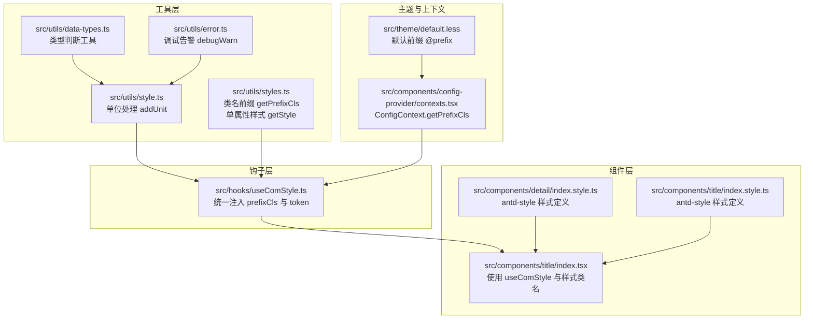
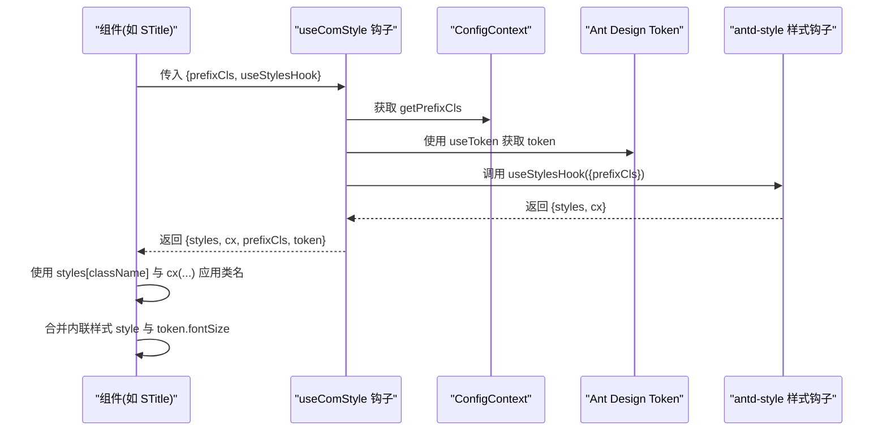
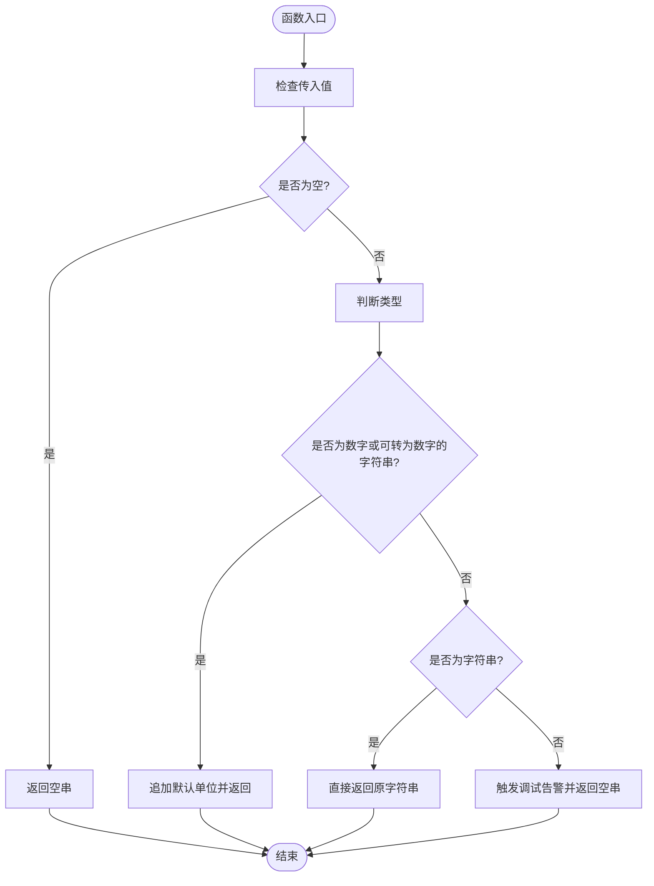
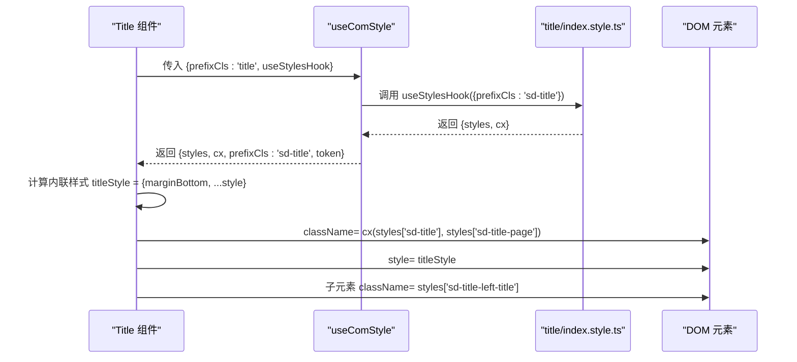
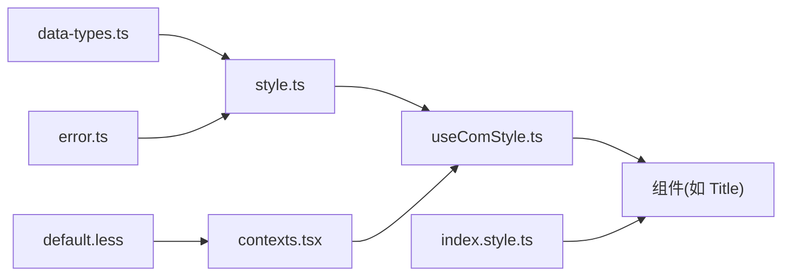

# 样式处理工具

<cite>
**本文引用的文件**
- [src/utils/style.ts](file://src/utils/style.ts)
- [src/utils/styles.ts](file://src/utils/styles.ts)
- [src/utils/data-types.ts](file://src/utils/data-types.ts)
- [src/utils/error.ts](file://src/utils/error.ts)
- [src/hooks/useComStyle.ts](file://src/hooks/useComStyle.ts)
- [src/components/config-provider/contexts.tsx](file://src/components/config-provider/contexts.tsx)
- [src/theme/default.less](file://src/theme/default.less)
- [src/components/title/index.tsx](file://src/components/title/index.tsx)
- [src/components/title/index.style.ts](file://src/components/title/index.style.ts)
- [src/components/detail/index.style.ts](file://src/components/detail/index.style.ts)
</cite>

## 目录

1. [简介](#简介)
2. [项目结构](#项目结构)
3. [核心组件](#核心组件)
4. [架构总览](#架构总览)
5. [详细组件分析](#详细组件分析)
6. [依赖关系分析](#依赖关系分析)
7. [性能考量](#性能考量)
8. [故障排查指南](#故障排查指南)
9. [结论](#结论)
10. [附录](#附录)

## 简介

本文件系统性梳理并说明样式处理工具的设计与实现，涵盖以下方面：

- CSS 类名处理：统一前缀、命名规范与动态拼接
- 内联样式合并与冲突处理：键值映射与安全合并策略
- 主题变量使用：基于 Ant Design Token 的主题定制
- 样式定制能力：通过配置上下文与样式钩子实现可扩展的主题与类名体系
- 实际应用示例：组件中条件样式、响应式处理与主题切换的实践
- 性能特性与最佳实践：避免重复计算、减少重排与合理使用缓存

## 项目结构

样式工具相关的核心位置如下：

- 工具层：位于 src/utils 下，提供基础样式工具（单位添加、类名前缀、单属性样式生成）
- 主题与上下文：位于 src/theme 与 src/components/config-provider，提供默认前缀与全局配置
- 组件层：位于 src/components/\*，通过 antd-style 的 createStyles 定义样式，并结合 useComStyle 钩子注入前缀与主题 Token
- 钩子层：位于 src/hooks，封装统一的样式注入流程，简化组件使用



图表来源

- [src/utils/style.ts](file://src/utils/style.ts#L1-L22)
- [src/utils/styles.ts](file://src/utils/styles.ts#L1-L27)
- [src/utils/data-types.ts](file://src/utils/data-types.ts#L1-L34)
- [src/utils/error.ts](file://src/utils/error.ts#L1-L25)
- [src/theme/default.less](file://src/theme/default.less#L1-L2)
- [src/components/config-provider/contexts.tsx](file://src/components/config-provider/contexts.tsx#L1-L20)
- [src/hooks/useComStyle.ts](file://src/hooks/useComStyle.ts#L1-L29)
- [src/components/detail/index.style.ts](file://src/components/detail/index.style.ts#L1-L13)
- [src/components/title/index.style.ts](file://src/components/title/index.style.ts#L1-L37)
- [src/components/title/index.tsx](file://src/components/title/index.tsx#L1-L149)

章节来源

- [src/utils/style.ts](file://src/utils/style.ts#L1-L22)
- [src/utils/styles.ts](file://src/utils/styles.ts#L1-L27)
- [src/utils/data-types.ts](file://src/utils/data-types.ts#L1-L34)
- [src/utils/error.ts](file://src/utils/error.ts#L1-L25)
- [src/theme/default.less](file://src/theme/default.less#L1-L2)
- [src/components/config-provider/contexts.tsx](file://src/components/config-provider/contexts.tsx#L1-L20)
- [src/hooks/useComStyle.ts](file://src/hooks/useComStyle.ts#L1-L29)
- [src/components/detail/index.style.ts](file://src/components/detail/index.style.ts#L1-L13)
- [src/components/title/index.style.ts](file://src/components/title/index.style.ts#L1-L37)
- [src/components/title/index.tsx](file://src/components/title/index.tsx#L1-L149)

## 核心组件

- 单位处理工具：为数值型尺寸自动追加默认单位，字符串原样返回，非法类型发出调试告警
- 类名前缀工具：统一下划线前缀，确保组件类名具备唯一性与可读性
- 单属性样式生成：将 CSS 属性与其值映射为内联样式对象，便于按需注入
- 统一样式注入钩子：从 ConfigContext 获取前缀，从 Ant Design Token 中取主题值，结合 antd-style 的 useStylesHook 返回 styles 与 cx，简化组件使用

章节来源

- [src/utils/style.ts](file://src/utils/style.ts#L9-L21)
- [src/utils/styles.ts](file://src/utils/styles.ts#L8-L10)
- [src/utils/styles.ts](file://src/utils/styles.ts#L18-L26)
- [src/hooks/useComStyle.ts](file://src/hooks/useComStyle.ts#L12-L26)

## 架构总览

样式体系采用“工具层 → 上下文/主题 → 钩子 → 组件”的分层设计：

- 工具层提供通用能力（单位、前缀、单属性样式）
- 上下文/主题层提供全局前缀与主题 Token
- 钩子层负责将前缀与 Token 注入到样式钩子中，输出 styles 与 cx
- 组件层通过 styles 与 cx 应用类名，通过内联样式合并实现条件与响应式效果



图表来源

- [src/hooks/useComStyle.ts](file://src/hooks/useComStyle.ts#L12-L26)
- [src/components/config-provider/contexts.tsx](file://src/components/config-provider/contexts.tsx#L7-L15)
- [src/components/title/index.tsx](file://src/components/title/index.tsx#L19-L22)
- [src/components/title/index.style.ts](file://src/components/title/index.style.ts#L4-L11)

## 详细组件分析

### 工具层：样式处理函数

- addUnit：对空值返回空串；对数字或可转为数字的字符串追加默认单位；对字符串直接返回；其他类型触发调试告警
- getPrefixCls：为任意类名添加统一前缀，保证组件间类名不冲突
- getStyle：将单个 CSS 属性与其值映射为内联样式对象，支持空值安全返回



图表来源

- [src/utils/style.ts](file://src/utils/style.ts#L9-L21)
- [src/utils/data-types.ts](file://src/utils/data-types.ts#L24-L29)
- [src/utils/error.ts](file://src/utils/error.ts#L16-L24)

章节来源

- [src/utils/style.ts](file://src/utils/style.ts#L9-L21)
- [src/utils/styles.ts](file://src/utils/styles.ts#L8-L10)
- [src/utils/styles.ts](file://src/utils/styles.ts#L18-L26)
- [src/utils/data-types.ts](file://src/utils/data-types.ts#L24-L29)
- [src/utils/error.ts](file://src/utils/error.ts#L16-L24)

### 上下文与主题：类名前缀与 Token 注入

- 默认前缀：通过 less 变量定义统一前缀，确保所有组件类名具有统一前缀
- ConfigContext：提供 getPrefixCls，默认返回形如 sd-xxx 的类名；支持自定义前缀覆盖
- useComStyle：从 ConfigContext 获取前缀，从 Ant Design Token 中取 token，调用样式钩子返回 styles 与 cx

```mermaid
classDiagram
class ConfigContext {
+getPrefixCls(suffixCls, customizePrefixCls) string
}
class useComStyle {
+prefixCls : string
+token : object
+styles : object
+cx(...args) string
}
class ThemeLess {
+@prefix : string
}
ConfigContext --> useComStyle : "提供 getPrefixCls"
ThemeLess --> ConfigContext : "默认前缀来源"
useComStyle --> "antd-style" : "调用 useStylesHook"
```

图表来源

- [src/components/config-provider/contexts.tsx](file://src/components/config-provider/contexts.tsx#L7-L15)
- [src/theme/default.less](file://src/theme/default.less#L1-L2)
- [src/hooks/useComStyle.ts](file://src/hooks/useComStyle.ts#L12-L26)

章节来源

- [src/components/config-provider/contexts.tsx](file://src/components/config-provider/contexts.tsx#L7-L15)
- [src/theme/default.less](file://src/theme/default.less#L1-L2)
- [src/hooks/useComStyle.ts](file://src/hooks/useComStyle.ts#L12-L26)

### 组件层：样式应用与主题定制

- 样式定义：使用 antd-style 的 createStyles，接收 { prefixCls } 并基于该前缀生成类选择器
- 类名应用：组件通过 styles[className] 与 cx(...) 同时应用静态与动态类名
- 主题定制：通过 token.fontSize 等主题变量动态调整字号等样式，实现主题一致性与可定制性
- 条件样式与内联样式合并：组件内部将外部传入的 style 与计算后的内联样式合并，实现条件样式与响应式布局



图表来源

- [src/components/title/index.tsx](file://src/components/title/index.tsx#L19-L22)
- [src/components/title/index.tsx](file://src/components/title/index.tsx#L115-L120)
- [src/components/title/index.tsx](file://src/components/title/index.tsx#L122-L144)
- [src/components/title/index.style.ts](file://src/components/title/index.style.ts#L4-L11)
- [src/hooks/useComStyle.ts](file://src/hooks/useComStyle.ts#L12-L26)

章节来源

- [src/components/title/index.tsx](file://src/components/title/index.tsx#L19-L22)
- [src/components/title/index.tsx](file://src/components/title/index.tsx#L71-L78)
- [src/components/title/index.tsx](file://src/components/title/index.tsx#L115-L120)
- [src/components/title/index.tsx](file://src/components/title/index.tsx#L122-L144)
- [src/components/title/index.style.ts](file://src/components/title/index.style.ts#L4-L11)
- [src/hooks/useComStyle.ts](file://src/hooks/useComStyle.ts#L12-L26)

### 示例：详情组件样式

- 通过 createStyles 基于 prefixCls 动态生成类选择器，实现组件内部布局与间距的统一控制

章节来源

- [src/components/detail/index.style.ts](file://src/components/detail/index.style.ts#L4-L11)

## 依赖关系分析

- 工具层依赖：
  - addUnit 依赖数据类型判断工具与调试告警工具
  - getPrefixCls 与 getStyle 为纯函数，无副作用
- 钩子层依赖：
  - useComStyle 依赖 ConfigContext 与 Ant Design Token，耦合上下文与主题
- 组件层依赖：
  - 通过 antd-style 的样式钩子生成 styles 与 cx，依赖前缀与 Token



图表来源

- [src/utils/style.ts](file://src/utils/style.ts#L1-L21)
- [src/utils/data-types.ts](file://src/utils/data-types.ts#L24-L29)
- [src/utils/error.ts](file://src/utils/error.ts#L16-L24)
- [src/hooks/useComStyle.ts](file://src/hooks/useComStyle.ts#L12-L26)
- [src/components/config-provider/contexts.tsx](file://src/components/config-provider/contexts.tsx#L7-L15)
- [src/theme/default.less](file://src/theme/default.less#L1-L2)
- [src/components/title/index.style.ts](file://src/components/title/index.style.ts#L4-L11)

章节来源

- [src/utils/style.ts](file://src/utils/style.ts#L1-L21)
- [src/utils/data-types.ts](file://src/utils/data-types.ts#L24-L29)
- [src/utils/error.ts](file://src/utils/error.ts#L16-L24)
- [src/hooks/useComStyle.ts](file://src/hooks/useComStyle.ts#L12-L26)
- [src/components/config-provider/contexts.tsx](file://src/components/config-provider/contexts.tsx#L7-L15)
- [src/theme/default.less](file://src/theme/default.less#L1-L2)
- [src/components/title/index.style.ts](file://src/components/title/index.style.ts#L4-L11)

## 性能考量

- 避免重复计算：组件内部对样式与渲染内容使用 useMemo 包裹，减少不必要的重渲染
- 合理使用 cx：通过 cx(...) 合并多个类名，避免字符串拼接带来的不可控开销
- 主题变量复用：优先使用 token.fontSize 等主题变量，减少硬编码样式导致的维护成本与重绘成本
- 单位处理：addUnit 在数值与字符串之间做最小化转换，避免多余字符串处理
- 事件节流：与尺寸相关的钩子使用防抖，降低 resize 等高频事件对性能的影响

## 故障排查指南

- 调试告警：当传入 addUnit 的值既不是数字也不是可转为数字的字符串时，会触发调试告警，建议检查传参类型
- 类名冲突：确保所有组件类名均通过 getPrefixCls 或 useComStyle 注入前缀，避免全局污染
- 主题未生效：确认 ConfigContext 提供的 getPrefixCls 与主题 Token 正常注入，且组件正确使用 styles 与 token
- 内联样式冲突：组件内部对 style 进行合并，若出现样式覆盖异常，检查传入 style 的键值是否与计算样式冲突

章节来源

- [src/utils/error.ts](file://src/utils/error.ts#L16-L24)
- [src/utils/style.ts](file://src/utils/style.ts#L20-L21)
- [src/hooks/useComStyle.ts](file://src/hooks/useComStyle.ts#L12-L26)
- [src/components/title/index.tsx](file://src/components/title/index.tsx#L71-L78)

## 结论

本样式处理工具通过“工具层 + 上下文/主题 + 钩子 + 组件”的分层设计，实现了：

- 统一的类名前缀与命名规范
- 安全的内联样式生成与合并策略
- 基于 Ant Design Token 的主题定制能力
- 易于扩展与维护的组件样式体系

在实际开发中，建议遵循以下最佳实践：

- 使用 useComStyle 统一注入前缀与 Token
- 通过 styles 与 cx 应用类名，避免手动拼接
- 将条件样式与响应式逻辑集中在组件内部，保持样式声明清晰
- 对高频更新的样式使用 useMemo 优化性能

## 附录

- 关键 API 摘要
  - addUnit：为数值型尺寸追加默认单位
  - getPrefixCls：为类名添加统一前缀
  - getStyle：将单个 CSS 属性映射为内联样式对象
  - useComStyle：注入前缀与 Token，返回 styles 与 cx

章节来源

- [src/utils/style.ts](file://src/utils/style.ts#L9-L21)
- [src/utils/styles.ts](file://src/utils/styles.ts#L8-L10)
- [src/utils/styles.ts](file://src/utils/styles.ts#L18-L26)
- [src/hooks/useComStyle.ts](file://src/hooks/useComStyle.ts#L12-L26)
