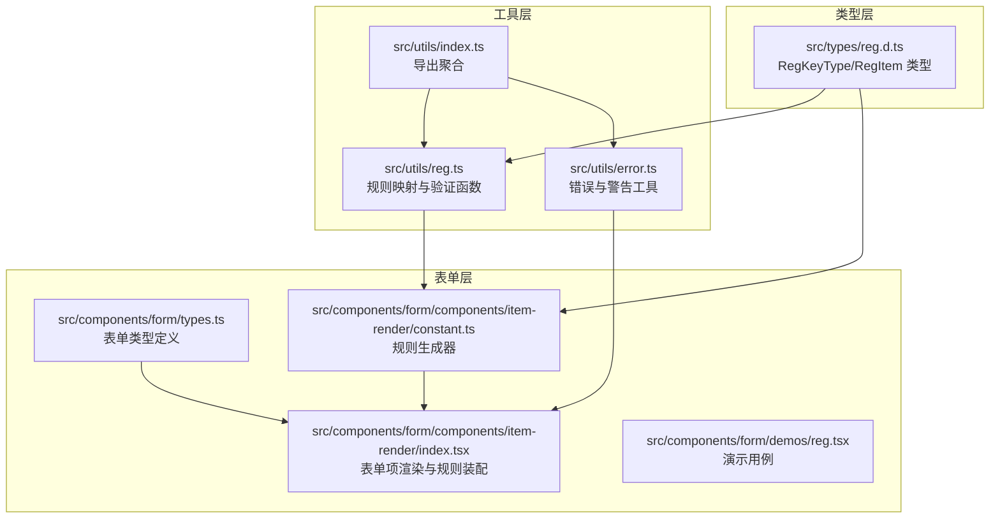
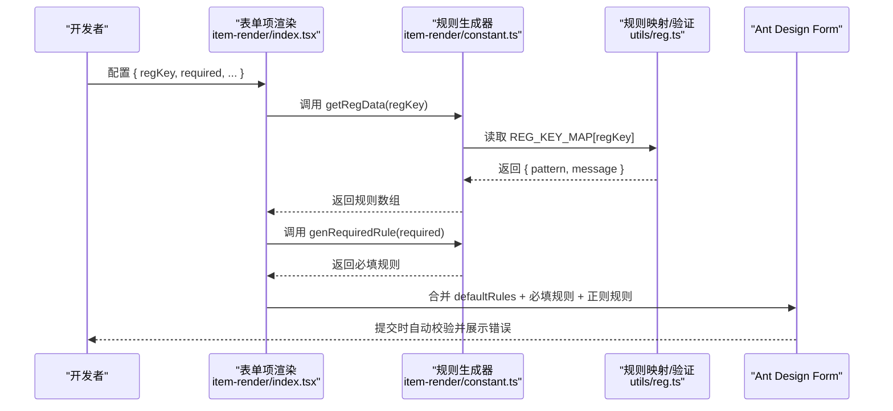
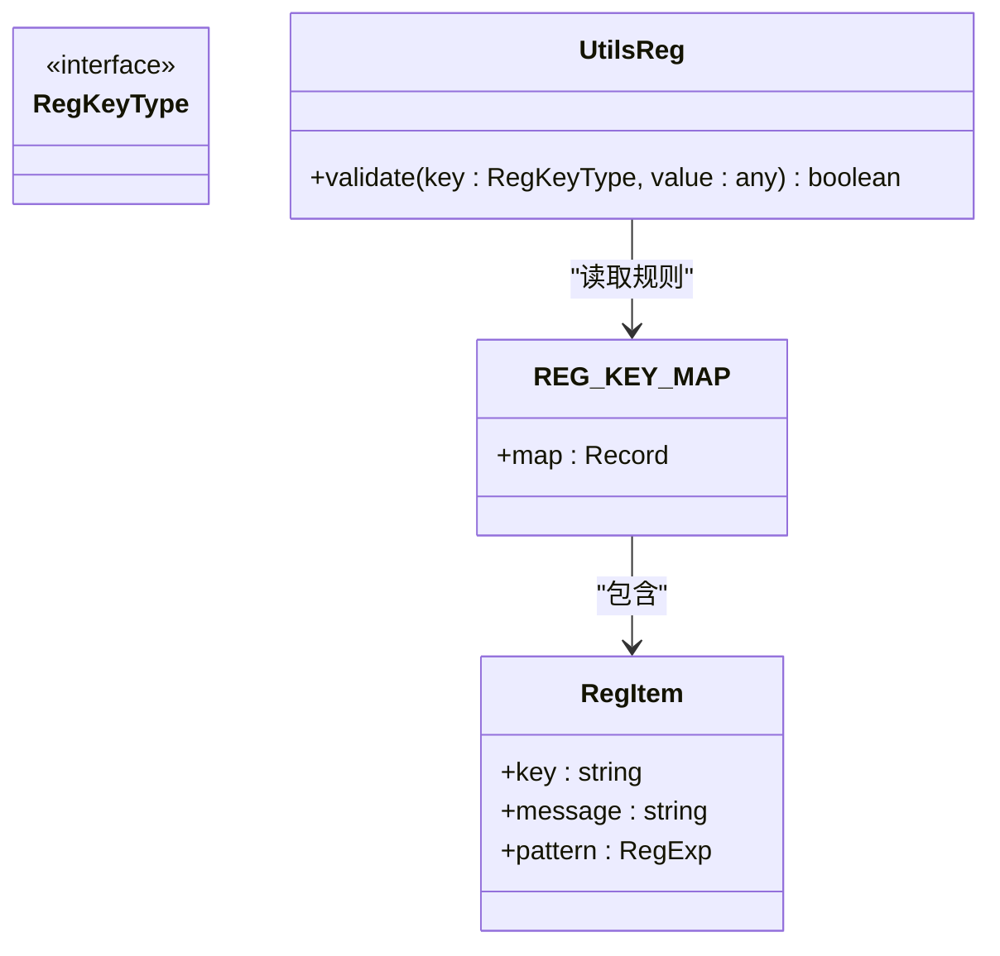
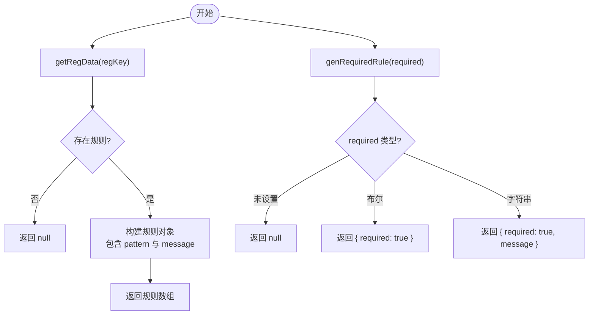
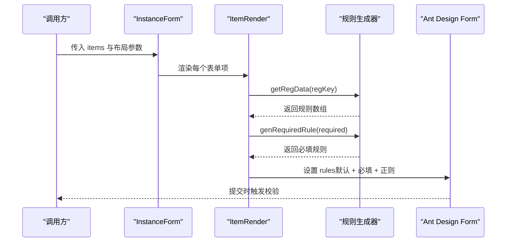
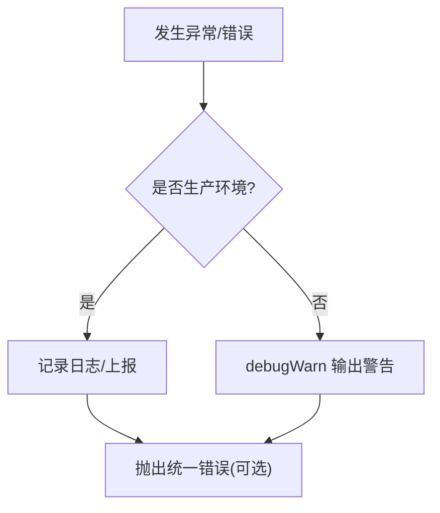
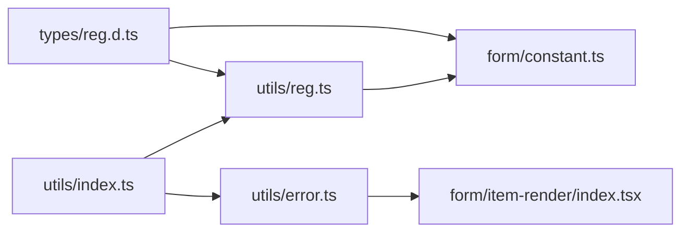

# 验证工具

<cite>
**本文引用的文件**
- [src/utils/reg.ts](file://src/utils/reg.ts)
- [src/types/reg.d.ts](file://src/types/reg.d.ts)
- [src/utils/error.ts](file://src/utils/error.ts)
- [src/components/form/components/item-render/index.tsx](file://src/components/form/components/item-render/index.tsx)
- [src/components/form/components/item-render/constant.ts](file://src/components/form/components/item-render/constant.ts)
- [src/components/form/types.ts](file://src/components/form/types.ts)
- [src/components/form/demos/reg.tsx](file://src/components/form/demos/reg.tsx)
- [src/utils/index.ts](file://src/utils/index.ts)
</cite>

## 目录

1. [简介](#简介)
2. [项目结构](#项目结构)
3. [核心组件](#核心组件)
4. [架构总览](#架构总览)
5. [详细组件分析](#详细组件分析)
6. [依赖关系分析](#依赖关系分析)
7. [性能考虑](#性能考虑)
8. [故障排查指南](#故障排查指南)
9. [结论](#结论)
10. [附录](#附录)

## 简介

本文件系统性梳理验证工具函数的设计与实现，覆盖以下主题：

- 正则表达式验证：统一的规则映射、验证函数与规则生成器
- 错误处理与异常管理：统一的错误抛出与调试告警机制
- 常用数据验证规则：邮箱、手机号、身份证号、车牌号、IP/MAC/URL 等
- 表单组件集成：如何在表单中声明式地绑定规则并进行统一错误提示

## 项目结构

验证能力主要由三部分构成：

- 规则定义与验证函数：位于工具模块
- 表单组件与规则装配：位于表单组件层
- 类型与导出：统一暴露接口

图表来源

- [src/utils/reg.ts](file://src/utils/reg.ts#L1-L146)
- [src/utils/error.ts](file://src/utils/error.ts#L1-L25)
- [src/utils/index.ts](file://src/utils/index.ts#L1-L10)
- [src/types/reg.d.ts](file://src/types/reg.d.ts#L1-L61)
- [src/components/form/types.ts](file://src/components/form/types.ts#L1-L155)
- [src/components/form/components/item-render/index.tsx](file://src/components/form/components/item-render/index.tsx#L1-L112)
- [src/components/form/components/item-render/constant.ts](file://src/components/form/components/item-render/constant.ts#L123-L162)
- [src/components/form/demos/reg.tsx](file://src/components/form/demos/reg.tsx#L1-L44)

章节来源

- [src/utils/reg.ts](file://src/utils/reg.ts#L1-L146)
- [src/types/reg.d.ts](file://src/types/reg.d.ts#L1-L61)
- [src/utils/error.ts](file://src/utils/error.ts#L1-L25)
- [src/components/form/components/item-render/index.tsx](file://src/components/form/components/item-render/index.tsx#L1-L112)
- [src/components/form/components/item-render/constant.ts](file://src/components/form/components/item-render/constant.ts#L123-L162)
- [src/components/form/types.ts](file://src/components/form/types.ts#L1-L155)
- [src/components/form/demos/reg.tsx](file://src/components/form/demos/reg.tsx#L1-L44)
- [src/utils/index.ts](file://src/utils/index.ts#L1-L10)

## 核心组件

- 规则映射与验证函数
  - REG_KEY_MAP：集中维护所有正则规则键、对应正则与提示语
  - validate：基于键名执行正则匹配，返回布尔结果
- 规则生成器（表单侧）
  - getRegData：将规则键转换为 Ant Design Form 的规则数组
  - genRequiredRule：生成必填规则（支持自定义提示）
- 错误处理工具
  - throwError：抛出带作用域的统一错误
  - debugWarn：开发环境下的统一警告输出

章节来源

- [src/utils/reg.ts](file://src/utils/reg.ts#L4-L145)
- [src/components/form/components/item-render/constant.ts](file://src/components/form/components/item-render/constant.ts#L139-L162)
- [src/utils/error.ts](file://src/utils/error.ts#L10-L24)

## 架构总览

验证工具在表单中的工作流如下：

图表来源

- [src/components/form/components/item-render/index.tsx](file://src/components/form/components/item-render/index.tsx#L39-L48)
- [src/components/form/components/item-render/constant.ts](file://src/components/form/components/item-render/constant.ts#L139-L162)
- [src/utils/reg.ts](file://src/utils/reg.ts#L4-L145)

## 详细组件分析

### 规则映射与验证函数（REG_KEY_MAP 与 validate）

- 设计要点
  - 使用键值映射统一管理规则，便于扩展与复用
  - 每条规则包含键名、正则与提示语，便于直接生成表单规则
  - validate 函数提供独立的业务侧验证入口
- 常见规则类别
  - 数值类：保留两位小数、整数、负整数、非负浮点数、百分比
  - 文本类：中文、中英文混合、中文姓名、英文名、中文数字字母混合、数字字母组合
  - 地址类：邮箱、网址、统一社会信用代码、IP/IPv4、MAC、URL
  - 证件类：身份证
  - 其他：手机号、车牌号、十六进制颜色
- 复杂度与性能
  - REG_KEY_MAP 查询为 O(1)，validate 为 O(n)（n 为规则正则长度），通常可忽略
  - 建议在高频调用场景下缓存 REG_KEY_MAP 访问

图表来源

- [src/utils/reg.ts](file://src/utils/reg.ts#L4-L145)
- [src/types/reg.d.ts](file://src/types/reg.d.ts#L56-L61)

章节来源

- [src/utils/reg.ts](file://src/utils/reg.ts#L4-L145)
- [src/types/reg.d.ts](file://src/types/reg.d.ts#L3-L54)

### 规则生成器（getRegData 与 genRequiredRule）

- getRegData
  - 输入：规则键
  - 输出：规则数组，包含 pattern 与 message；message 采用“请输入正确的 + 规则中文描述”的格式
- genRequiredRule
  - 输入：required 支持布尔或字符串
  - 输出：必填规则数组，字符串时作为自定义提示
- 在表单项中的装配
  - 将默认 rules、必填规则与正则规则合并，形成最终的校验规则集

图表来源

- [src/components/form/components/item-render/constant.ts](file://src/components/form/components/item-render/constant.ts#L139-L162)

章节来源

- [src/components/form/components/item-render/constant.ts](file://src/components/form/components/item-render/constant.ts#L139-L162)

### 表单组件中的应用（SForm + ItemRender）

- 组件职责
  - ItemRender：根据 type 渲染不同输入组件，并注入规则与依赖
  - InstanceForm：布局与列数控制，透传 onFinish/onReset 等事件
- 规则装配流程
  - 从 props 读取 regKey 与 required
  - 调用规则生成器得到规则数组
  - 合并默认 rules，形成最终 rules 并传递给 Ant Design Form.Item
- 错误边界
  - 使用错误边界组件包裹，避免单个表单项异常影响整体

图表来源

- [src/components/form/instance.tsx](file://src/components/form/instance.tsx#L66-L95)
- [src/components/form/components/item-render/index.tsx](file://src/components/form/components/item-render/index.tsx#L39-L48)
- [src/components/form/components/item-render/constant.ts](file://src/components/form/components/item-render/constant.ts#L139-L162)

章节来源

- [src/components/form/instance.tsx](file://src/components/form/instance.tsx#L1-L99)
- [src/components/form/components/item-render/index.tsx](file://src/components/form/components/item-render/index.tsx#L1-L112)
- [src/components/form/types.ts](file://src/components/form/types.ts#L71-L97)

### 错误处理与异常管理（throwError 与 debugWarn）

- throwError
  - 抛出带作用域的错误，便于定位问题来源
- debugWarn
  - 开发环境下输出统一格式的警告，支持两种重载签名
- 在表单中的使用
  - 通过错误边界捕获子组件异常，避免中断用户交互
  - 结合统一的错误提示策略，提升用户体验

图表来源

- [src/utils/error.ts](file://src/utils/error.ts#L10-L24)
- [src/components/form/components/item-render/index.tsx](file://src/components/form/components/item-render/index.tsx#L86-L106)

章节来源

- [src/utils/error.ts](file://src/utils/error.ts#L1-L25)
- [src/components/form/components/item-render/index.tsx](file://src/components/form/components/item-render/index.tsx#L86-L106)

### 常用验证规则详解

以下规则均来自规则映射，建议在表单中通过 regKey 直接引用，无需手写正则。

- 数值与百分比
  - 保留两位小数、数字、正整数、负整数、非负浮点数、百分比
- 文本与姓名
  - 中文、中英文混合、中文姓名、英文名、中文数字字母混合、数字字母组合
- 地址与网络
  - 邮箱、网址、统一社会信用代码、IP/IPv4、MAC、URL
- 证件与号码
  - 身份证、手机号、车牌号
- 其他
  - 十六进制颜色

章节来源

- [src/utils/reg.ts](file://src/utils/reg.ts#L4-L131)

### 表单验证规则在组件中的实际应用

- 在表单项中设置 regKey 即可启用对应规则
- 通过 required 控制是否必填，支持布尔或自定义提示
- 可叠加自定义 rules，实现复杂校验逻辑

章节来源

- [src/components/form/demos/reg.tsx](file://src/components/form/demos/reg.tsx#L14-L43)
- [src/components/form/components/item-render/index.tsx](file://src/components/form/components/item-render/index.tsx#L39-L48)
- [src/components/form/components/item-render/constant.ts](file://src/components/form/components/item-render/constant.ts#L154-L162)

## 依赖关系分析

- 类型依赖
  - RegKeyType 来源于类型定义文件，确保规则键的类型安全
- 工具依赖
  - 规则生成器依赖 REG_KEY_MAP 进行规则装配
  - 表单组件依赖规则生成器与类型定义
- 导出聚合
  - utils/index.ts 将 reg 与 error 等工具统一导出，便于上层按需引入

图表来源

- [src/types/reg.d.ts](file://src/types/reg.d.ts#L1-L61)
- [src/utils/reg.ts](file://src/utils/reg.ts#L1-L146)
- [src/utils/error.ts](file://src/utils/error.ts#L1-L25)
- [src/components/form/components/item-render/constant.ts](file://src/components/form/components/item-render/constant.ts#L139-L162)
- [src/components/form/components/item-render/index.tsx](file://src/components/form/components/item-render/index.tsx#L1-L112)
- [src/utils/index.ts](file://src/utils/index.ts#L1-L10)

章节来源

- [src/types/reg.d.ts](file://src/types/reg.d.ts#L1-L61)
- [src/utils/reg.ts](file://src/utils/reg.ts#L1-L146)
- [src/utils/error.ts](file://src/utils/error.ts#L1-L25)
- [src/utils/index.ts](file://src/utils/index.ts#L1-L10)

## 性能考虑

- 规则映射查询为 O(1)，validate 为 O(n)，通常可忽略
- 建议在高频场景下：
  - 缓存 REG_KEY_MAP 的访问
  - 合理拆分规则，避免一次性加载过多规则
  - 将 validate 仅用于必要路径，常规输入可通过 Ant Design 的内置规则完成

## 故障排查指南

- 规则未生效
  - 检查 regKey 是否在类型定义范围内
  - 确认 getRegData 返回的规则数组已合并到 rules
- 提示文案不符合预期
  - message 由“请输入正确的 + 规则中文描述”拼接，如需自定义请在 rules 中覆盖
- 开发环境告警
  - 使用 debugWarn 输出统一格式的警告，便于定位
- 异常导致页面崩溃
  - 确保使用了错误边界组件包裹表单项
  - 对于不可恢复错误，使用 throwError 抛出并记录

章节来源

- [src/components/form/components/item-render/constant.ts](file://src/components/form/components/item-render/constant.ts#L139-L162)
- [src/utils/error.ts](file://src/utils/error.ts#L10-L24)
- [src/components/form/components/item-render/index.tsx](file://src/components/form/components/item-render/index.tsx#L86-L106)

## 结论

该验证体系通过“规则映射 + 规则生成器 + 表单装配”的方式，实现了高内聚、低耦合的验证能力。配合统一的错误处理与调试告警机制，既保证了开发体验，也提升了运行时的稳定性。建议在业务中优先使用 regKey 声明式地配置规则，减少重复实现与维护成本。

## 附录

- 类型定义参考
  - RegKeyType：规则键的联合类型
  - RegItem：规则项的结构定义
- 导出聚合参考
  - utils/index.ts 将 reg 与 error 等工具统一导出

章节来源

- [src/types/reg.d.ts](file://src/types/reg.d.ts#L3-L61)
- [src/utils/index.ts](file://src/utils/index.ts#L1-L10)
