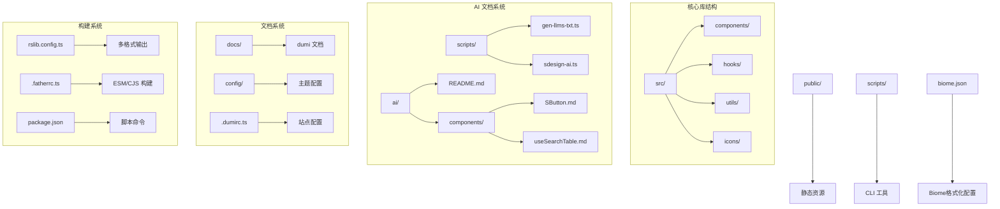
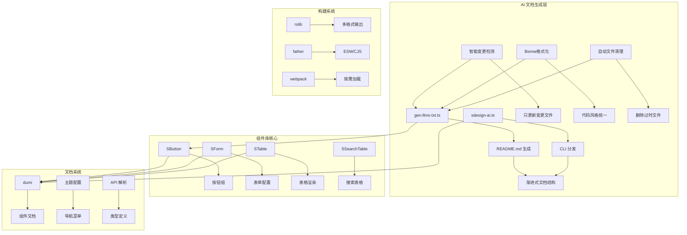
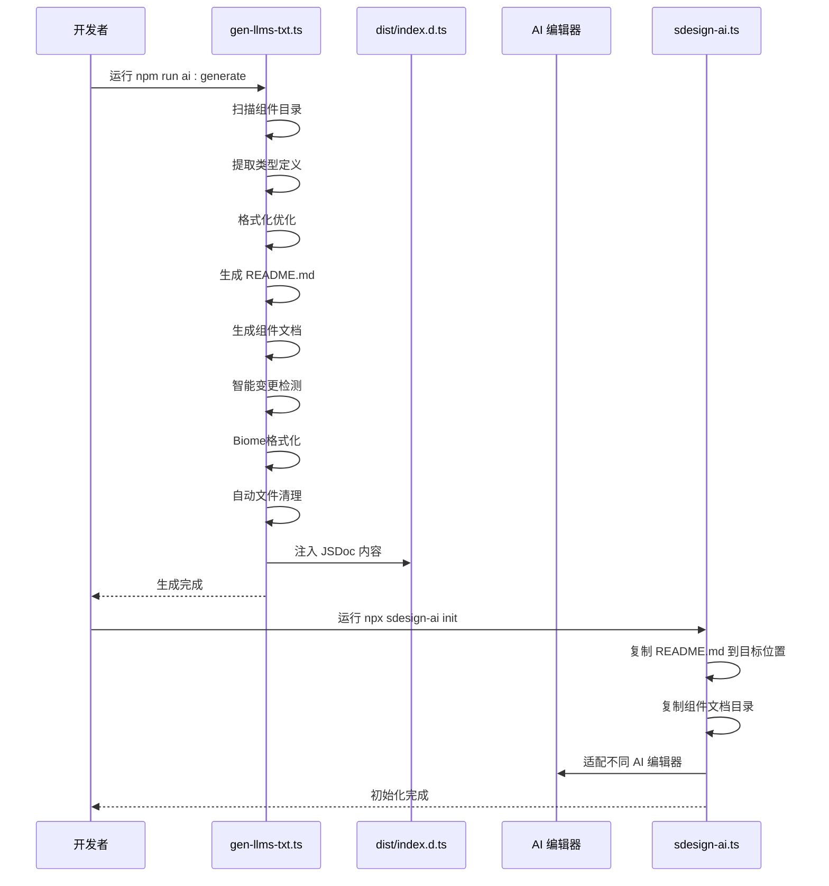
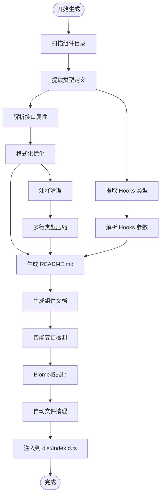
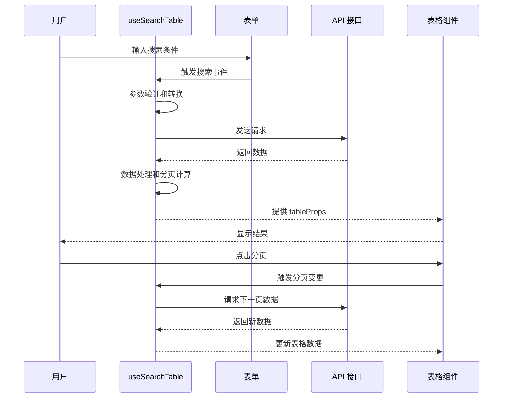
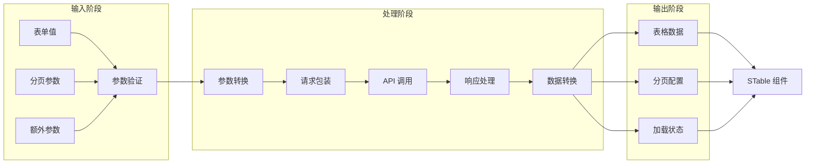
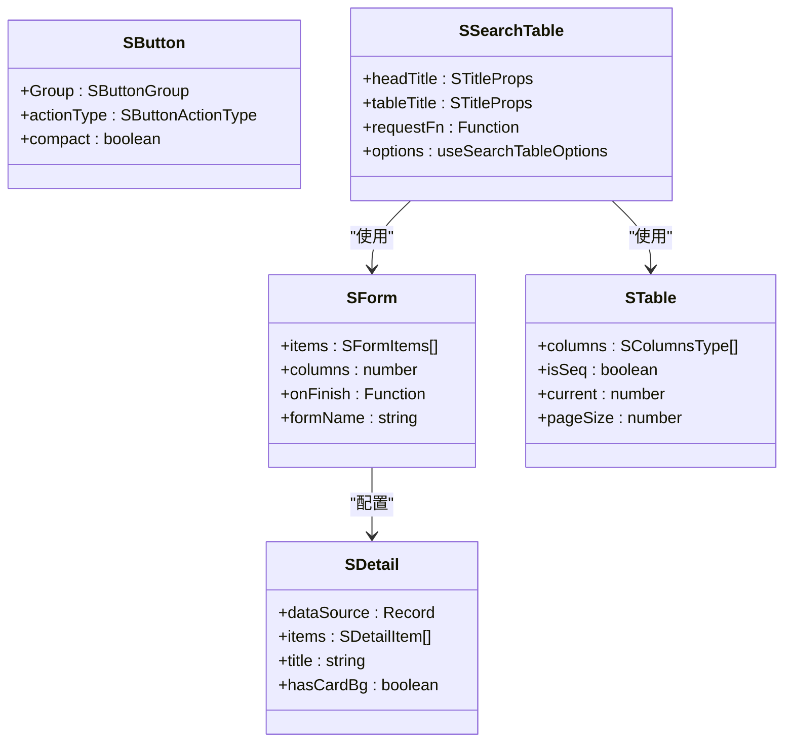

# AI 文档生成系统

<cite>
**本文档引用的文件**
- [package.json](file://package.json)
- [README.md](file://README.md)
- [src/index.ts](file://src/index.ts)
- [scripts/cli/sdesign-ai.ts](file://scripts/cli/sdesign-ai.ts)
- [scripts/gen-llms-txt.ts](file://scripts/gen-llms-txt.ts)
- [ai/README.md](file://ai/README.md)
- [ai/components/SButton.md](file://ai/components/SButton.md)
- [ai/components/useSearchTable.md](file://ai/components/useSearchTable.md)
- [config/index.ts](file://config/index.ts)
- [.dumirc.ts](file://.dumirc.ts)
- [rslib.config.ts](file://rslib.config.ts)
- [.fatherrc.ts](file://.fatherrc.ts)
- [src/hooks/useSearchTable/index.ts](file://src/hooks/useSearchTable/index.ts)
- [src/components/button/index.tsx](file://src/components/button/index.tsx)
- [docs/index.md](file://docs/index.md)
- [docs/introduce-cn/index.md](file://docs/introduce-cn/index.md)
- [docs/template/index.md](file://docs/template/index.md)
- [src/hooks/index.ts](file://src/hooks/index.ts)
- [src/components/form/types.ts](file://src/components/form/types.ts)
- [src/components/detail/types.ts](file://src/components/detail/types.ts)
- [src/hooks/useSearchTable/types.ts](file://src/hooks/useSearchTable/types.ts)
- [src/components/button/types.ts](file://src/components/button/types.ts)
- [biome.json](file://biome.json)
- [src/components/button/metadata.json](file://src/components/button/metadata.json)
- [src/components/form/metadata.json](file://src/components/form/metadata.json)
- [src/hooks/useSearchTable/README.md](file://src/hooks/useSearchTable/README.md)
</cite>

## 更新摘要

**变更内容**

- AI 文档生成系统实现重大架构升级，从简单的 llms.txt 索引文件转变为综合的 README.md 项目结构文档
- **版本号更新**：从 1.3.2 升级至 1.3.3，反映最新的 AI 文档格式化改进
- **新增智能变更检测**：系统现在能够检测文件内容变化，只更新有变更的文档，避免不必要的文件修改
- **集成 Biome 格式化工具**：自动格式化生成的 AI 文档，确保代码风格一致性
- **增强自动文件清理功能**：清理过时的 AI 文档文件，保持项目整洁
- **重构文档结构**：采用渐进式文档结构，包含 README.md 索引和 ai/components/详细文档
- **改进类型定义格式化**：将多行类型定义压缩为单行，移除内部注释，避免 JSDoc 解析错误
- **增强注释清理功能**：智能提取和清理 JSDoc 注释，移除@符号标记和多余注释内容
- **改进的 dist/index.d.ts 注入机制**：自动清理旧的 JSDoc 注释块并注入新的 AI 文档内容
- **提升文档一致性和可读性**：通过格式化优化确保 AI 系统能够准确解析组件类型定义

## 目录

1. [简介](#简介)
2. [项目结构](#项目结构)
3. [核心组件](#核心组件)
4. [架构总览](#架构总览)
5. [详细组件分析](#详细组件分析)
6. [依赖关系分析](#依赖关系分析)
7. [性能考虑](#性能考虑)
8. [故障排除指南](#故障排除指南)
9. [结论](#结论)

## 简介

本项目是一个基于 Ant Design 5.x 的企业级 React 组件库，名为 @dalydb/sdesign。它提供了丰富的 S 前缀组件、强大的 Hooks 工具库以及完善的文档系统。项目的核心亮点包括：

- 50+ 企业级组件，覆盖常见业务场景
- 基于 Ant Design 5.x，无缝集成
- 完善的 Hooks 和工具函数库
- 支持按需加载，减少打包体积
- TypeScript 完整类型支持
- 灵活的主题配置和样式扩展

该项目还实现了智能化的 AI 文档生成系统，通过自动化脚本生成精简版 README.md 文档，为 AI 编辑器提供统一的组件库上下文。**最新版本 1.3.3**中，AI 文档生成系统得到了重大改进，采用渐进式文档结构，包含 README.md 索引和 ai/components/详细文档目录，为 LLM 提供了更准确、更全面的组件信息。

## 项目结构

项目采用模块化的组织方式，主要分为以下几个核心部分：



**图表来源**

- [src/index.ts:1-5](file://src/index.ts#L1-L5)
- [scripts/gen-llms-txt.ts:1-966](file://scripts/gen-llms-txt.ts#L1-L966)
- [config/index.ts:1-27](file://config/index.ts#L1-L27)
- [biome.json:1-37](file://biome.json#L1-L37)

**章节来源**

- [package.json:1-128](file://package.json#L1-L128)
- [src/index.ts:1-5](file://src/index.ts#L1-L5)
- [config/index.ts:1-27](file://config/index.ts#L1-L27)

## 核心组件

项目的核心组件体系围绕 S 前缀命名规范构建，主要包括以下几类：

### 基础组件

- **SButton**: 增强按钮，支持 actionType 预设操作类型和按钮组
- **SInput**: 增强输入框，支持 trim、onEnter
- **SCard**: 卡片容器，内置错误边界
- **SCascader**: 增强级联选择器
- **SCheckGroup**: 复选框组
- **SRadioGroup**: 单选框组

### 业务组件

- **SForm**: 配置化表单，items 数组声明 22 种控件、联动、分组、搜索
- **STable**: 增强表格，支持 dictKey 字典映射、render 快捷类型、序号列
- **SSearchTable**: SForm.Search + STable 一体化，列表页首选
- **SDetail**: 详情展示，支持 8 种渲染类型（text/dict/file/img 等）

### 布局组件

- **STitle**: 标题组件（page/table/form 三种类型）
- **SDynamicContainer**: 动态容器
- **SCollapse**: 折叠面板

**章节来源**

- [ai/README.md:20-39](file://ai/README.md#L20-L39)
- [src/components/button/index.tsx:1-15](file://src/components/button/index.tsx#L1-L15)

## 架构总览

项目采用现代化的前端技术栈，结合 AI 文档生成机制，形成了完整的组件库生态系统：



**图表来源**

- [scripts/gen-llms-txt.ts:868-966](file://scripts/gen-llms-txt.ts#L868-L966)
- [scripts/cli/sdesign-ai.ts:66-110](file://scripts/cli/sdesign-ai.ts#L66-L110)
- [.dumirc.ts:1-22](file://.dumirc.ts#L1-L22)

## 详细组件分析

### AI 文档生成系统

AI 文档生成系统是项目的核心创新之一，通过完全自动化的脚本生成精简版 README.md 文档，为 AI 编辑器提供统一的组件库上下文。**最新版本 1.3.3**中，系统得到了重大改进，采用渐进式文档结构，包含 README.md 索引和 ai/components/详细文档目录。

#### 核心流程



**图表来源**

- [scripts/gen-llms-txt.ts:868-966](file://scripts/gen-llms-txt.ts#L868-L966)
- [scripts/cli/sdesign-ai.ts:66-110](file://scripts/cli/sdesign-ai.ts#L66-L110)

#### 生成逻辑分析



**图表来源**

- [scripts/gen-llms-txt.ts:199-294](file://scripts/gen-llms-txt.ts#L199-L294)
- [scripts/gen-llms-txt.ts:567-671](file://scripts/gen-llms-txt.ts#L567-L671)

#### 智能变更检测系统

**最新版本 1.3.3**中，系统实现了智能变更检测功能，能够：

1. **检测文件内容变化**：比较生成内容与现有文件内容，只更新有变更的部分
2. **避免不必要的文件修改**：减少磁盘写入操作，提高生成效率
3. **保持文件完整性**：只更新实际发生变化的文档，其他文件保持不变
4. **优化 CI/CD 流程**：在自动化构建中减少文件变更，提高构建速度

#### Biome 格式化集成

系统集成了 Biome 格式化工具，提供统一的代码风格：

1. **自动格式化生成文件**：使用 Biome 格式化生成的 AI 文档
2. **配置文件支持**：基于 biome.json 配置进行格式化
3. **错误处理**：Biome 格式化失败不影响主流程
4. **代码风格一致性**：确保生成的文档具有统一的格式

#### 自动文件清理功能

系统实现了智能的文件清理机制：

1. **清理过时文件**：删除不再需要的 AI 文档文件
2. **保持项目整洁**：定期清理过期的组件文档
3. **避免文件冗余**：防止项目中积累大量过时文档

#### 类型定义格式化优化系统

**最新版本 1.3.3**中，系统实现了完全自动化的类型提取系统，能够：

1. **智能扫描组件目录**：自动发现所有组件的 types.ts 和 index.tsx 文件
2. **深度解析 TypeScript 类型**：支持 interface、type alias、泛型、extends 等复杂类型
3. **提取 JSDoc 注释**：自动解析组件和属性的文档注释
4. **生成完整类型定义**：包含所有 Props、接口、枚举的详细信息
5. **支持 Hook 类型提取**：自动解析 10 个核心 Hook 的参数和返回值类型
6. **新增类型定义格式化优化**：将多行类型定义压缩为单行，移除内部注释，避免 JSDoc 解析错误
7. **新增注释清理功能**：智能提取和清理 JSDoc 注释，移除 @ 符号标记和多余注释内容
8. **提升文档一致性**：通过格式化优化确保 AI 系统能够准确解析组件类型定义

#### 注释清理和格式化优化功能

系统实现了先进的注释清理和格式化优化功能：

**注释清理功能**：

- 智能提取紧贴在某位置之前的 JSDoc 注释文本
- 移除 @ 符号标记（如 @param、@returns、@example 等）
- 清理多余的空白字符和换行符
- 保持注释内容的连贯性和可读性

**类型定义格式化优化**：

- 将多行类型定义压缩为单行，移除内部注释
- 避免 JSDoc 解析错误，确保 AI 系统正确理解类型结构
- 优化类型定义的显示格式，提升可读性

**章节来源**

- [scripts/gen-llms-txt.ts:1-966](file://scripts/gen-llms-txt.ts#L1-L966)
- [scripts/cli/sdesign-ai.ts:1-110](file://scripts/cli/sdesign-ai.ts#L1-L110)
- [ai/README.md:1-208](file://ai/README.md#L1-L208)

### useSearchTable Hook 分析

useSearchTable 是项目中最复杂的 Hooks 之一，提供了完整的搜索表格数据管理能力。

#### 核心功能流程



**图表来源**

- [src/hooks/useSearchTable/index.ts:15-193](file://src/hooks/useSearchTable/index.ts#L15-L193)

#### 数据流处理



**图表来源**

- [src/hooks/useSearchTable/index.ts:46-109](file://src/hooks/useSearchTable/index.ts#L46-L109)

**章节来源**

- [src/hooks/useSearchTable/index.ts:1-193](file://src/hooks/useSearchTable/index.ts#L1-L193)

### 组件导出结构

项目采用统一的导出策略，确保组件库的易用性和一致性。



**图表来源**

- [src/components/button/index.tsx:1-15](file://src/components/button/index.tsx#L1-L15)
- [ai/README.md:158-164](file://ai/README.md#L158-L164)

**章节来源**

- [src/components/button/index.tsx:1-15](file://src/components/button/index.tsx#L1-L15)
- [ai/README.md:158-164](file://ai/README.md#L158-L164)

### Hook 列表与类型定义

**最新版本 1.3.3**中，AI 文档系统新增了完整的 Hook 列表和类型定义，包括：

- **useComStyle**: 组件样式钩子
- **useDispatchDict**: 字典分发钩子
- **useExpand**: 展开收起钩子
- **useFrameAnimation**: 帧动画钩子
- **useGetDictData**: 字典数据获取钩子
- **useScale**: 缩放钩子
- **useSearchLayout**: 搜索布局钩子
- **useSearchTable**: 搜索表格钩子
- **useFormPerformance**: 表单性能钩子

每个 Hook 都包含了详细的类型定义和签名说明，为开发者提供了完整的类型安全支持。

**章节来源**

- [src/hooks/index.ts:1-21](file://src/hooks/index.ts#L1-L21)
- [ai/README.md:190-201](file://ai/README.md#L190-L201)

## 依赖关系分析

项目的技术栈和依赖关系体现了现代化前端开发的最佳实践：

```mermaid
graph TB
subgraph "运行时依赖"
A[react >=18.0.0] --> D[组件渲染]
B[antd >=5.20.6] --> E[UI 组件库]
C[lodash ^4.17.21] --> F[工具函数]
G[axios ^1.13.4] --> H[HTTP 请求]
I[ahooks ^3.7.4] --> J[Hooks 工具]
K[react-error-boundary 6.0.0] --> L[错误边界]
end
subgraph "开发依赖"
M[dumi ~2.4.21] --> N[文档生成]
O[father ^4.6.11] --> P[构建工具]
Q[@rslib/core ^0.18.5] --> R[现代化构建]
S[typescript ^5] --> T[类型检查]
U[eslint ^8.57.1] --> V[代码规范]
W[biome ^1.9.4] --> X[Biome格式化]
end
subgraph "主题和样式"
Y[antd-style ^3.6.2] --> Z[CSS-in-JS]
AA[less] --> BB[样式编译]
end
A --> M
B --> O
G --> Q
S --> U
W --> X
```

**图表来源**

- [package.json:58-99](file://package.json#L58-L99)

**章节来源**

- [package.json:1-128](file://package.json#L1-L128)

## 性能考虑

项目在性能优化方面采用了多项策略：

### 按需加载优化

- 支持 tree-shaking，减少打包体积
- 组件库设计遵循按需导入原则
- 使用现代构建工具优化资源加载

### AI 文档生成优化

- 采用渐进式文档结构，README.md 仅包含索引信息
- 自动生成 ai/components/详细文档，按需读取
- 智能变更检测，只更新有变更的文件
- 集成 Biome 格式化，统一代码风格
- 自动文件清理，删除过时文件
- 增强的类型提取逻辑，支持复杂类型定义
- **新增** 类型定义格式化优化，提升 AI 系统解析效率
- **新增** 注释清理功能，减少冗余信息
- **版本 1.3.3**中进一步提升了文档的一致性和可读性

### 构建性能优化

- rslib 多格式输出，支持 ESM 和 CJS
- 源码映射启用，便于调试
- 忽略不必要的文件类型（.md、demo 等）

## 故障排除指南

### AI 文档生成问题

1. **README.md 生成失败**

   - 确保已运行 `npm run build` 生成 dist 文件
   - 检查 dist/index.d.ts 是否存在
   - 运行 `npm run ai:generate` 重新生成

2. **CLI 工具无法找到 README.md**

   - 先运行 `npm run ai:generate` 生成文件
   - 检查 ai/README.md 是否存在于项目根目录

3. **Biome 格式化失败**
   - 确保已安装 Biome 工具
   - 检查 biome.json 配置文件
   - Biome 格式化失败不会影响主流程

### 构建问题

1. **dumi 文档构建失败**

   - 检查 .dumirc.ts 配置是否正确
   - 确保组件目录结构符合要求
   - 运行 `npm run doctor` 检查项目健康状况

2. **类型定义问题**
   - 确保 TypeScript 版本兼容
   - 检查组件类型定义文件完整性
   - 运行类型检查修复

**章节来源**

- [scripts/gen-llms-txt.ts:538-565](file://scripts/gen-llms-txt.ts#L538-L565)
- [scripts/cli/sdesign-ai.ts:31-41](file://scripts/cli/sdesign-ai.ts#L31-L41)

## 结论

@dalydb/sdesign 组件库通过其智能化的 AI 文档生成系统，为开发者提供了卓越的开发体验。**最新版本 1.3.3**中，系统得到了重大改进，不仅具备完整的企业级组件库功能，还创新性地集成了 AI 辅助开发能力，显著提升了开发效率和文档质量。

### 主要优势

- **完整的组件生态**: 50+ 组件覆盖常见业务场景
- **智能文档系统**: 自动生成 AI 友好的文档内容，包含 README.md 索引和 ai/components/详细文档
- **现代化技术栈**: 基于最新前端技术构建
- **优秀的开发体验**: TypeScript 完整支持，按需加载
- **灵活的配置能力**: 支持主题定制和样式扩展
- **全面的 Hook 支持**: 10 个核心 Hook 提供完整的数据管理能力
- **完全自动化的类型提取**: 从硬编码转向智能化生成
- **新增智能变更检测**: 只更新有变更的文件，提高生成效率
- **集成 Biome 格式化**: 统一代码风格，提升文档质量
- **新增自动文件清理**: 删除过时文件，保持项目整洁
- **新增类型定义格式化优化**: 提升 AI 系统解析效率和准确性
- **新增注释清理功能**: 移除冗余信息，提供更纯净的文档内容
- **版本 1.3.3**中进一步提升了文档的一致性和可读性

### 应用场景

- 企业管理后台快速开发
- 中大型项目的组件复用
- AI 辅助开发环境集成
- 团队协作和知识共享

### 升级价值

**版本 1.3.3**中，AI 文档生成系统提供了更加完整和准确的组件信息，包括：

- README.md 索引文件，包含每个组件的用途和使用边界
- ai/components/详细文档目录，包含完整的类型定义和使用示例
- 智能变更检测，只更新有变更的文件
- Biome 格式化集成，统一代码风格
- 自动文件清理，删除过时文件
- 增强的自动化文档生成能力
- 更好的 AI 编辑器适配支持
- 支持复杂类型的深度解析
- **新增** 智能变更检测功能
- **新增** Biome 格式化集成
- **新增** 自动文件清理功能
- **新增** 类型定义格式化优化功能
- **新增** 注释清理功能，提供更纯净的文档内容
- **版本 1.3.3**中进一步提升了文档的一致性和可读性

该项目代表了现代前端组件库的发展方向，将传统组件库与 AI 技术有机结合，为未来的前端开发提供了新的可能性。
