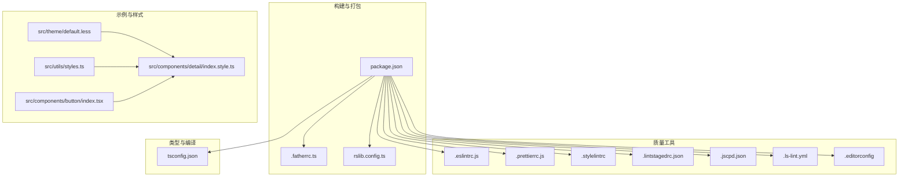
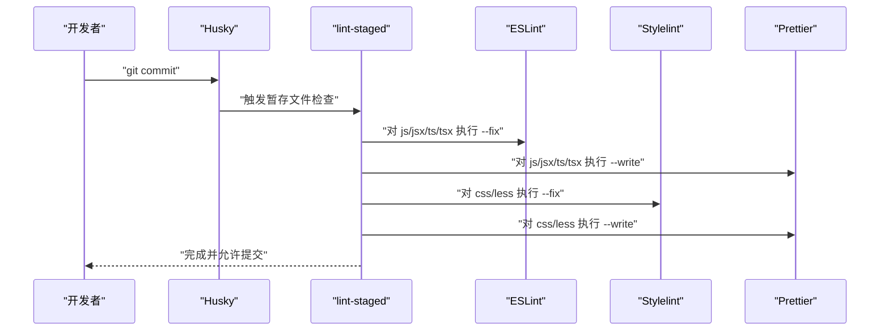
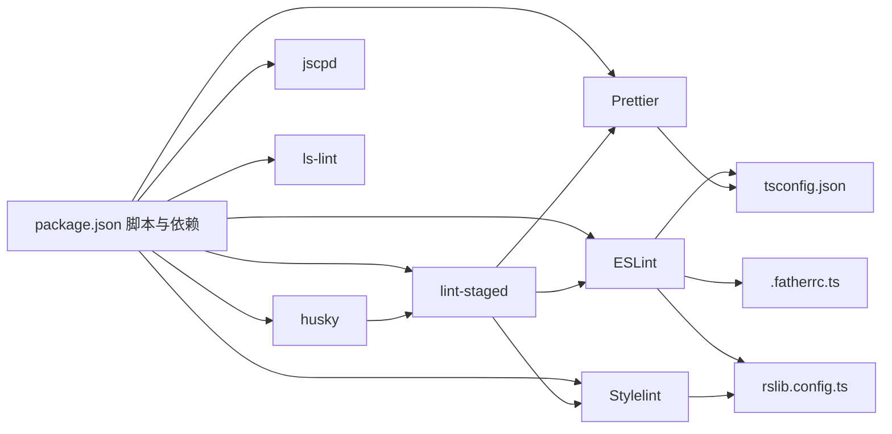

# 代码质量保证

<cite>
**本文引用的文件**
- [.eslintrc.js](file://.eslintrc.js)
- [.prettierrc.js](file://.prettierrc.js)
- [.stylelintrc](file://.stylelintrc)
- [.lintstagedrc.json](file://.lintstagedrc.json)
- [.jscpd.json](file://.jscpd.json)
- [.ls-lint.yml](file://.ls-lint.yml)
- [.editorconfig](file://.editorconfig)
- [package.json](file://package.json)
- [.fatherrc.ts](file://.fatherrc.ts)
- [rslib.config.ts](file://rslib.config.ts)
- [tsconfig.json](file://tsconfig.json)
- [src/theme/default.less](file://src/theme/default.less)
- [src/utils/styles.ts](file://src/utils/styles.ts)
- [src/components/detail/index.style.ts](file://src/components/detail/index.style.ts)
- [src/components/button/index.tsx](file://src/components/button/index.tsx)
</cite>

## 目录

1. [简介](#简介)
2. [项目结构](#项目结构)
3. [核心组件](#核心组件)
4. [架构总览](#架构总览)
5. [详细组件分析](#详细组件分析)
6. [依赖关系分析](#依赖关系分析)
7. [性能考量](#性能考量)
8. [故障排查指南](#故障排查指南)
9. [结论](#结论)
10. [附录](#附录)

## 简介

本指南面向 SDesign 组件库的代码质量保障，系统梳理并解释当前仓库中的 ESLint、Prettier、Stylelint、Git 钩子（husky + lint-staged）、代码复制检测（jscpd）、命名规范（ls-lint）以及 EditorConfig 等质量工具链配置与实践。同时给出可操作的改进建议与最佳实践，帮助团队在开发过程中保持一致的风格、稳定的构建与可靠的审查流程。

## 项目结构

围绕代码质量的关键配置文件分布如下：

- 质量工具配置：.eslintrc.js、.prettierrc.js、.stylelintrc、.lintstagedrc.json、.jscpd.json、.ls-lint.yml、.editorconfig
- 构建与打包：package.json（脚本与依赖）、.fatherrc.ts、rslib.config.ts
- 类型与编译：tsconfig.json
- 示例与样式：src/theme/default.less、src/utils/styles.ts、src/components/detail/index.style.ts、src/components/button/index.tsx

图表来源

- [package.json](file://package.json#L26-L51)
- [.eslintrc.js](file://.eslintrc.js#L1-L45)
- [.prettierrc.js](file://.prettierrc.js#L1-L22)
- [.stylelintrc](file://.stylelintrc#L1-L8)
- [.lintstagedrc.json](file://.lintstagedrc.json#L1-L7)
- [.jscpd.json](file://.jscpd.json#L1-L13)
- [.ls-lint.yml](file://.ls-lint.yml#L1-L13)
- [.editorconfig](file://.editorconfig#L1-L14)
- [.fatherrc.ts](file://.fatherrc.ts#L1-L13)
- [rslib.config.ts](file://rslib.config.ts#L1-L79)
- [tsconfig.json](file://tsconfig.json#L1-L26)
- [src/theme/default.less](file://src/theme/default.less#L1-L2)
- [src/utils/styles.ts](file://src/utils/styles.ts#L1-L27)
- [src/components/detail/index.style.ts](file://src/components/detail/index.style.ts#L1-L13)
- [src/components/button/index.tsx](file://src/components/button/index.tsx#L1-L15)

章节来源

- [package.json](file://package.json#L26-L51)
- [.eslintrc.js](file://.eslintrc.js#L1-L45)
- [.prettierrc.js](file://.prettierrc.js#L1-L22)
- [.stylelintrc](file://.stylelintrc#L1-L8)
- [.lintstagedrc.json](file://.lintstagedrc.json#L1-L7)
- [.jscpd.json](file://.jscpd.json#L1-L13)
- [.ls-lint.yml](file://.ls-lint.yml#L1-L13)
- [.editorconfig](file://.editorconfig#L1-L14)
- [.fatherrc.ts](file://.fatherrc.ts#L1-L13)
- [rslib.config.ts](file://rslib.config.ts#L1-L79)
- [tsconfig.json](file://tsconfig.json#L1-L26)

## 核心组件

- ESLint：基于 @umijs/lint 的基础配置，扩展 import 插件，启用 TypeScript 解析器与解析器，支持自定义导入顺序等规则（当前注释保留，便于后续启用）。
- Prettier：统一缩进、单引号、尾随逗号；对 Markdown 使用特定换行策略；内置 organize-imports 与 packagejson 插件；忽略 node_modules。
- Stylelint：继承 @umijs/lint 的默认规则，关闭 vendor 前缀校验，颜色函数使用 legacy 语法。
- Git 钩子：husky 安装与 dumi setup 在 prepare 中执行；lint-staged 针对不同后缀文件分别执行 eslint、stylelint、prettier。
- 代码复制检测：jscpd HTML/控制台/徽章报告，忽略快照、测试、node_modules、icons、demos。
- 命名规范：ls-lint 校验 src 目录下目录命名风格，忽略 .git、node_modules、.umi、.umi-production、services。
- 编辑器配置：EditorConfig 统一空格缩进、LF 行尾、UTF-8、去除尾随空白、结尾换行。

章节来源

- [.eslintrc.js](file://.eslintrc.js#L1-L45)
- [.prettierrc.js](file://.prettierrc.js#L1-L22)
- [.stylelintrc](file://.stylelintrc#L1-L8)
- [.lintstagedrc.json](file://.lintstagedrc.json#L1-L7)
- [.jscpd.json](file://.jscpd.json#L1-L13)
- [.ls-lint.yml](file://.ls-lint.yml#L1-L13)
- [.editorconfig](file://.editorconfig#L1-L14)
- [package.json](file://package.json#L40-L42)

## 架构总览

整体质量保障流程由“本地提交前检查”和“CI 自动化检查”两部分组成。本地通过 husky + lint-staged 在暂存区运行 ESLint、Stylelint、Prettier；远端 CI 可复用相同命令实现一致性。

图表来源

- [package.json](file://package.json#L40-L42)
- [.lintstagedrc.json](file://.lintstagedrc.json#L1-L7)

章节来源

- [package.json](file://package.json#L40-L42)
- [.lintstagedrc.json](file://.lintstagedrc.json#L1-L7)

## 详细组件分析

### ESLint 配置与规则

- 基础扩展：继承 @umijs/lint 的 ESLint 配置，确保与项目构建工具链一致。
- 导入解析：启用 import 插件与 TypeScript 解析器，配合 resolver 支持 TS 与 Node 解析。
- 自定义规则：导入顺序规则已预留注释模板，便于后续启用；可按 groups、pathGroups、字母排序等策略细化。
- 推荐实践：
  - 启用导入顺序规则，提升可读性与维护性。
  - 结合 TypeScript 规则，避免类型相关错误。
  - 在 CI 中强制执行 --fix，减少本地差异。

章节来源

- [.eslintrc.js](file://.eslintrc.js#L1-L45)
- [package.json](file://package.json#L75-L77)

### Prettier 代码格式化

- 统一风格：printWidth 80、singleQuote、trailingComma 全部开启；Markdown 使用 preserve 换行策略。
- 插件增强：prettier-plugin-organize-imports、prettier-plugin-packagejson 自动整理导入与 package.json。
- 忽略策略：过滤 node_modules；可通过 overrides 扩展更多文件类型。
- 推荐实践：
  - 团队统一 editorconfig 与 prettier 配置，避免 IDE 差异。
  - 在 CI 中增加 --check 模式，防止格式漂移。

章节来源

- [.prettierrc.js](file://.prettierrc.js#L1-L22)
- [.editorconfig](file://.editorconfig#L1-L14)

### Stylelint 样式检查

- 默认继承：基于 @umijs/lint 的 stylelint 配置，覆盖 CSS-in-JS 与 Less 场景。
- 规则定制：关闭 vendor 前缀校验，颜色函数使用 legacy 语法，适配现有样式书写习惯。
- 推荐实践：
  - 在组件样式中统一使用 antd-style 的 createStyles 与前缀策略。
  - 对 Less 文件启用自动修复，确保变量与命名一致性。

章节来源

- [.stylelintrc](file://.stylelintrc#L1-L8)
- [src/components/detail/index.style.ts](file://src/components/detail/index.style.ts#L1-L13)
- [src/theme/default.less](file://src/theme/default.less#L1-L2)

### Git 钩子与代码复制检测

- 钩子安装：prepare 脚本中安装 husky 并执行 dumi setup，确保本地环境初始化。
- 暂存检查：lint-staged 针对不同后缀文件执行对应工具，TS 使用 typescript 解析器写入。
- 代码复制检测：jscpd 开启 HTML/控制台/徽章报告，忽略快照、测试、node_modules、icons、demos，避免误报。
- 命名规范：ls-lint 校验目录命名风格，忽略 .git、node_modules、.umi、.umi-production、services。
- 推荐实践：
  - 在 CI 中同样运行 jscpd，形成前后端一致的质量门槛。
  - 将 ls-lint 作为 PR 检查的一部分，确保目录命名一致性。

章节来源

- [package.json](file://package.json#L40-L42)
- [.lintstagedrc.json](file://.lintstagedrc.json#L1-L7)
- [.jscpd.json](file://.jscpd.json#L1-L13)
- [.ls-lint.yml](file://.ls-lint.yml#L1-L13)

### TypeScript 与构建配置

- tsconfig：严格模式、声明生成、跳过库检查、Node 解析、ES2020 目标、React JSX、路径映射。
- rslib：多格式输出（ESM/CJS）、外部化依赖（react、antd 等）、Less/React 插件、忽略 demo 文档与 md 文件。
- fatherrc：仅构建 ESM，排除 tests 与 _tests_。
- 推荐实践：
  - 在 CI 中加入 tsc --noEmit，确保类型安全。
  - 对样式文件统一使用 antd-style，减少 CSS-in-JS 的复杂度。

章节来源

- [tsconfig.json](file://tsconfig.json#L1-L26)
- [rslib.config.ts](file://rslib.config.ts#L1-L79)
- [.fatherrc.ts](file://.fatherrc.ts#L1-L13)

### 样式前缀与组件样式示例

- 统一样式前缀：getPrefixCls 统一为组件类名添加前缀，避免冲突。
- CSS-in-JS：createStyles 结合 prefixCls 使用，确保样式作用域与主题一致。
- Less：default.less 提供全局变量前缀，便于主题扩展。

章节来源

- [src/utils/styles.ts](file://src/utils/styles.ts#L1-L27)
- [src/components/detail/index.style.ts](file://src/components/detail/index.style.ts#L1-L13)
- [src/theme/default.less](file://src/theme/default.less#L1-L2)

### 组件导出与类型设计

- 组件聚合：按钮组件通过组合实例与 Group，形成复合导出结构，便于按需引入与扩展。
- 类型约束：通过类型断言与组合，确保导出类型与实现一致。

章节来源

- [src/components/button/index.tsx](file://src/components/button/index.tsx#L1-L15)

## 依赖关系分析

质量工具链与构建工具之间的耦合关系如下：

图表来源

- [package.json](file://package.json#L26-L51)
- [.eslintrc.js](file://.eslintrc.js#L1-L45)
- [.prettierrc.js](file://.prettierrc.js#L1-L22)
- [.stylelintrc](file://.stylelintrc#L1-L8)
- [.lintstagedrc.json](file://.lintstagedrc.json#L1-L7)
- [.fatherrc.ts](file://.fatherrc.ts#L1-L13)
- [rslib.config.ts](file://rslib.config.ts#L1-L79)
- [tsconfig.json](file://tsconfig.json#L1-L26)

章节来源

- [package.json](file://package.json#L26-L51)
- [.eslintrc.js](file://.eslintrc.js#L1-L45)
- [.prettierrc.js](file://.prettierrc.js#L1-L22)
- [.stylelintrc](file://.stylelintrc#L1-L8)
- [.lintstagedrc.json](file://.lintstagedrc.json#L1-L7)
- [.fatherrc.ts](file://.fatherrc.ts#L1-L13)
- [rslib.config.ts](file://rslib.config.ts#L1-L79)
- [tsconfig.json](file://tsconfig.json#L1-L26)

## 性能考量

- 本地检查性能：lint-staged 仅对暂存文件执行，避免全量扫描；建议在大型仓库中进一步拆分检查范围。
- 格式化性能：Prettier 插件组织导入与包文件格式化开销较小，但应避免对大体积 JSON 频繁写入。
- 样式检查性能：Stylelint 在 CSS/LESS 上开销较低，建议结合缓存与增量检查。
- 构建性能：rslib 多格式输出与外部化依赖减少打包体积与时间；注意忽略 demo 与 md 文件以降低构建负担。

## 故障排查指南

- 提交被拒绝或格式异常
  - 检查 husky 是否正确安装与激活（prepare 脚本）。
  - 查看 lint-staged 配置是否覆盖目标文件类型。
  - 在本地执行相应工具命令验证：ESLint、Stylelint、Prettier。
- 样式规则冲突
  - 检查 Stylelint 规则是否与 antd-style 使用方式冲突。
  - 确认 createStyles 传入的 prefixCls 是否正确。
- 类型检查失败
  - 确认 tsconfig 严格模式与路径映射配置。
  - 在 CI 中增加 tsc --noEmit，提前暴露类型问题。
- 代码复制检测告警
  - 检查 jscpd 忽略列表是否合理，避免误报。
  - 对确需复制的逻辑，补充注释说明原因。

章节来源

- [package.json](file://package.json#L40-L42)
- [.lintstagedrc.json](file://.lintstagedrc.json#L1-L7)
- [.stylelintrc](file://.stylelintrc#L1-L8)
- [tsconfig.json](file://tsconfig.json#L1-L26)
- [.jscpd.json](file://.jscpd.json#L1-L13)

## 结论

SDesign 当前已建立较为完善的前端质量工具链：ESLint、Prettier、Stylelint、husky + lint-staged、jscpd、ls-lint 与 EditorConfig 形成了从本地到 CI 的闭环。建议在现有基础上逐步启用导入顺序规则、完善 CI 的类型检查与复制检测，并统一团队对样式前缀与组件导出结构的理解，持续提升代码一致性与可维护性。

## 附录

- 术语
  - ESM：ECMAScript Module
  - CJS：CommonJS
  - CI：Continuous Integration
  - TS：TypeScript
- 参考路径
  - ESLint 配置：[.eslintrc.js](file://.eslintrc.js#L1-L45)
  - Prettier 配置：[.prettierrc.js](file://.prettierrc.js#L1-L22)
  - Stylelint 配置：[.stylelintrc](file://.stylelintrc#L1-L8)
  - Git 钩子与暂存检查：[package.json](file://package.json#L40-L42)、[.lintstagedrc.json](file://.lintstagedrc.json#L1-L7)
  - 代码复制检测：[.jscpd.json](file://.jscpd.json#L1-L13)
  - 命名规范：[.ls-lint.yml](file://.ls-lint.yml#L1-L13)
  - 编辑器配置：[.editorconfig](file://.editorconfig#L1-L14)
  - 构建与打包：[rslib.config.ts](file://rslib.config.ts#L1-L79)、[.fatherrc.ts](file://.fatherrc.ts#L1-L13)
  - 类型与编译：[tsconfig.json](file://tsconfig.json#L1-L26)
  - 样式示例：[src/components/detail/index.style.ts](file://src/components/detail/index.style.ts#L1-L13)、[src/theme/default.less](file://src/theme/default.less#L1-L2)
  - 组件导出示例：[src/components/button/index.tsx](file://src/components/button/index.tsx#L1-L15)
