# 开发指南

<cite>
**本文引用的文件**
- [package.json](file://package.json)
- [.fatherrc.ts](file://.fatherrc.ts)
- [.dumirc.ts](file://.dumirc.ts)
- [rslib.config.ts](file://rslib.config.ts)
- [.eslintrc.js](file://.eslintrc.js)
- [.prettierrc.js](file://.prettierrc.js)
- [.stylelintrc](file://.stylelintrc)
- [tsconfig.json](file://tsconfig.json)
- [global.d.ts](file://global.d.ts)
- [config/index.ts](file://config/index.ts)
- [src/index.ts](file://src/index.ts)
- [src/components/button/index.md](file://src/components/button/index.md)
- [src/components/button/demos/basic.tsx](file://src/components/button/demos/basic.tsx)
- [src/components/index.md](file://src/components/index.md)
- [docs/index.md](file://docs/index.md)
- [.lintstagedrc.json](file://.lintstagedrc.json)
- [.jscpd.json](file://.jscpd.json)
- [.husky/pre-commit](file://.husky/pre-commit)
- [README.md](file://README.md)
- [scripts/gen-llms-txt.ts](file://scripts/gen-llms-txt.ts)
- [scripts/cli/sdesign-ai.ts](file://scripts/cli/sdesign-ai.ts)
- [ai/README.md](file://ai/README.md)
- [ai/components/SButton.md](file://ai/components/SButton.md)
- [biome.json](file://biome.json)
</cite>

## 更新摘要

**所做更改**

- 更新 AI 文档生成系统章节，反映从 llms.txt 到 README.md 的格式变更
- 新增 Biome 格式化配置和使用说明
- 更新智能变更检测和自动文件管理功能描述
- 更新文件分发配置，包含新的 ai/README.md 结构
- 新增 Biome 格式化在 AI 文档生成流程中的应用

## 目录

1. [简介](#简介)
2. [项目结构](#项目结构)
3. [核心组件](#核心组件)
4. [架构总览](#架构总览)
5. [详细组件分析](#详细组件分析)
6. [AI 文档生成系统](#ai-文档生成系统)
7. [依赖关系分析](#依赖关系分析)
8. [性能考虑](#性能考虑)
9. [故障排查指南](#故障排查指南)
10. [结论](#结论)
11. [附录](#附录)

## 简介

本指南面向 SDesign 组件库的开发者与维护者，系统阐述开发环境搭建、构建配置与发布流程；详解 Dumi 文档系统与示例代码组织方式；介绍 Father 与 Rslib 的多目标构建策略与打包优化；提供组件开发标准流程、代码规范与质量保障机制；并提供版本管理与 NPM 发布建议及团队协作最佳实践。

**更新** 新增 AI 文档生成系统，提供智能化的组件文档生成与分发能力，采用渐进式文档结构和智能变更检测机制。

## 项目结构

仓库采用"组件 + 文档 + 工具链配置 + AI 文档"的清晰分层：

- 源码位于 src，按功能域拆分为 components、hooks、icons、plugins、service、theme、types、utils 等子目录
- 文档位于 docs，配合 Dumi 使用组件级文档与示例
- AI 文档位于 ai 目录，包含自动生成的 README.md 和组件级详细文档
- 构建与质量工具通过根目录配置文件统一管理

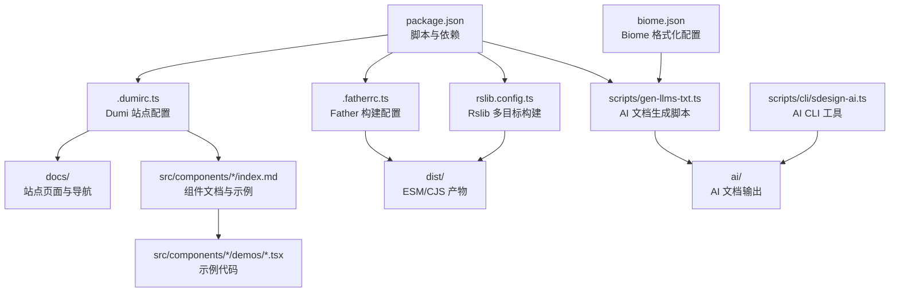

**图示来源**

- [package.json:26-52](file://package.json#L26-L52)
- [.dumirc.ts:5-21](file://.dumirc.ts#L5-L21)
- [.fatherrc.ts:3-12](file://.fatherrc.ts#L3-L12)
- [rslib.config.ts:5-78](file://rslib.config.ts#L5-L78)
- [scripts/gen-llms-txt.ts:1-966](file://scripts/gen-llms-txt.ts#L1-L966)
- [scripts/cli/sdesign-ai.ts:1-110](file://scripts/cli/sdesign-ai.ts#L1-L110)
- [biome.json:1-37](file://biome.json#L1-L37)

**章节来源**

- [package.json:1-128](file://package.json#L1-L128)
- [.dumirc.ts:1-22](file://.dumirc.ts#L1-L22)
- [.fatherrc.ts:1-13](file://.fatherrc.ts#L1-L13)
- [rslib.config.ts:1-79](file://rslib.config.ts#L1-L79)

## 核心组件

- 文档系统：Dumi 负责组件文档与示例演示，自动解析 src/components 下的组件文档与示例
- 构建系统：Father 用于 ESM 构建与发布前校验；Rslib 用于多格式（ESM/CJS）与声明文件生成
- AI 文档系统：自动生成渐进式组件文档结构，包含索引 README.md 和组件级详细文档
- 规范体系：ESLint、Stylelint、Prettier、Biome、lint-staged、Husky、JSCPD 等保障代码质量与一致性
- 类型系统：TypeScript 严格模式与全局模块声明，确保样式与资源模块类型安全

**章节来源**

- [.dumirc.ts:9-17](file://.dumirc.ts#L9-L17)
- [.fatherrc.ts:5-11](file://.fatherrc.ts#L5-L11)
- [rslib.config.ts:36-71](file://rslib.config.ts#L36-L71)
- [scripts/gen-llms-txt.ts:90-124](file://scripts/gen-llms-txt.ts#L90-L124)
- [.eslintrc.js:1-45](file://.eslintrc.js#L1-L45)
- [.prettierrc.js:1-22](file://.prettierrc.js#L1-L22)
- [.stylelintrc:1-8](file://.stylelintrc#L1-L8)
- [tsconfig.json:1-26](file://tsconfig.json#L1-L26)
- [global.d.ts:1-20](file://global.d.ts#L1-L20)

## 架构总览

下图展示了从开发到发布的整体流程，以及各工具在其中的角色与交互，包括新增的 AI 文档生成流程。

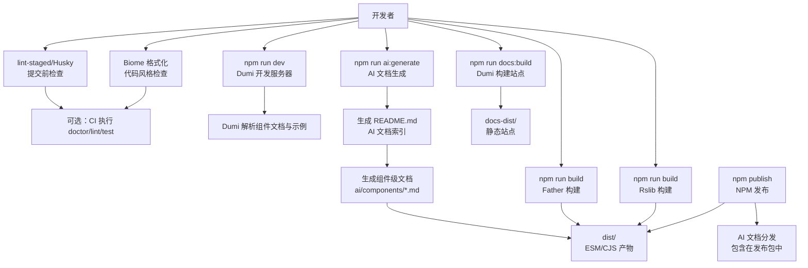

**图示来源**

- [package.json:31-51](file://package.json#L31-L51)
- [.dumirc.ts:5-21](file://.dumirc.ts#L5-L21)
- [.fatherrc.ts:3-12](file://.fatherrc.ts#L3-L12)
- [rslib.config.ts:5-78](file://rslib.config.ts#L5-L78)
- [scripts/gen-llms-txt.ts:634-966](file://scripts/gen-llms-txt.ts#L634-L966)
- [biome.json:1-37](file://biome.json#L1-L37)

## 详细组件分析

### Dumi 文档系统配置与使用

- 站点基础配置：站点路径别名、组件文档目录、输出目录、主题配置、Favicon 等
- 组件文档规范：每个组件的 index.md 作为文档入口，使用 <code> 标签引用 demos 下的示例文件
- 示例组织：示例以独立 TSX 文件存在，便于在线预览与交互调试
- 主题与导航：通过 config/index.ts 提供导航、API 解析入口与 RTL 支持

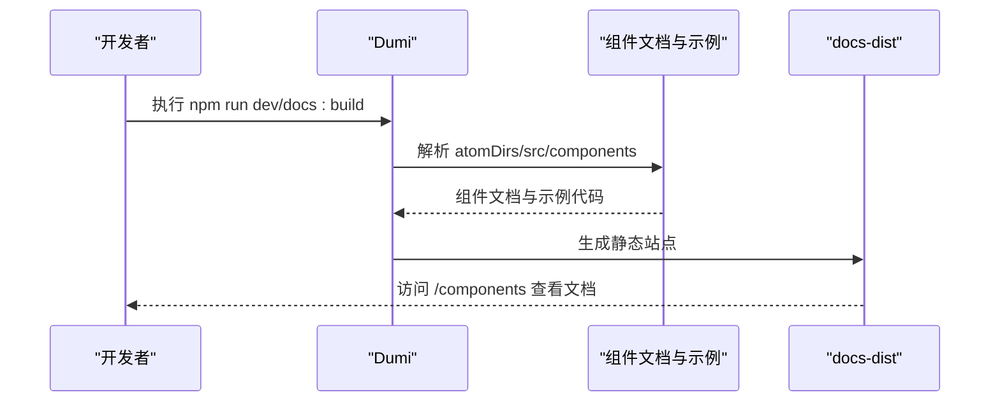

**图示来源**

- [.dumirc.ts:5-21](file://.dumirc.ts#L5-L21)
- [config/index.ts:1-27](file://config/index.ts#L1-L27)
- [src/components/button/index.md:1-78](file://src/components/button/index.md#L1-L78)

**章节来源**

- [.dumirc.ts:1-22](file://.dumirc.ts#L1-L22)
- [config/index.ts:1-27](file://config/index.ts#L1-L27)
- [src/components/button/index.md:1-78](file://src/components/button/index.md#L1-L78)
- [src/components/button/demos/basic.tsx:1-29](file://src/components/button/demos/basic.tsx#L1-L29)
- [src/components/index.md:1-35](file://src/components/index.md#L1-L35)
- [docs/index.md:1-9](file://docs/index.md#L1-L9)

### Father 构建工具配置与使用

- 目标：仅生成 ESM 产物，排除测试与内部测试文件
- 输出：dist 目录，包含构建产物与可选 SourceMap
- 发布前校验：通过 prepublishOnly 调用 doctor 与 build，确保发布质量

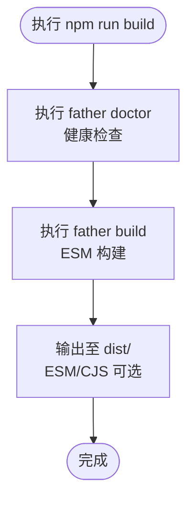

**图示来源**

- [package.json:40-41](file://package.json#L40-L41)
- [.fatherrc.ts:3-12](file://.fatherrc.ts#L3-L12)

**章节来源**

- [.fatherrc.ts:1-13](file://.fatherrc.ts#L1-L13)
- [package.json:26-52](file://package.json#L26-L52)

### Rslib 多目标构建与打包优化

- 多目标：同时生成 ESM 与 CJS，均输出声明文件（dts），并对外部依赖进行显式声明
- 忽略策略：通过 IgnorePlugin 与 ignore-loader 排除 md、demo、demos 等非产物文件
- 外部化：对 react、react-dom、antd、dayjs、lucide-react、@ant-design/icons 等进行外部化，减小包体
- 输出：dist/esm 与 dist/cjs，便于下游按需选择

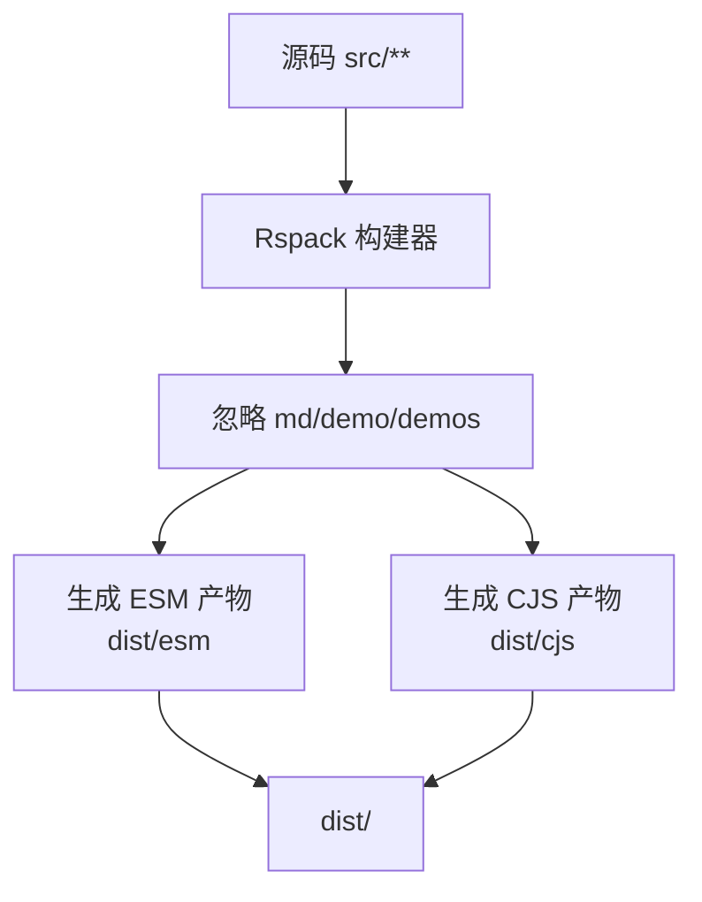

**图示来源**

- [rslib.config.ts:5-78](file://rslib.config.ts#L5-L78)

**章节来源**

- [rslib.config.ts:1-79](file://rslib.config.ts#L1-L79)

### 组件开发标准流程

- 设计：明确组件职责、API 设计与交互行为，参考现有组件文档与示例风格
- 实现：在 src/components/<组件名>/ 下创建 index.tsx、types.ts、index.md 与 demos
- 测试：在 demos 中补充覆盖场景，必要时添加单元测试（如存在）
- 文档：完善 index.md 的"基本用法""API"等章节，并通过 <code> 引用示例
- 预览：本地运行 npm run dev，确认文档与示例正常渲染
- 构建：执行 npm run build 或 npm run docs:build，确保产物与站点可用

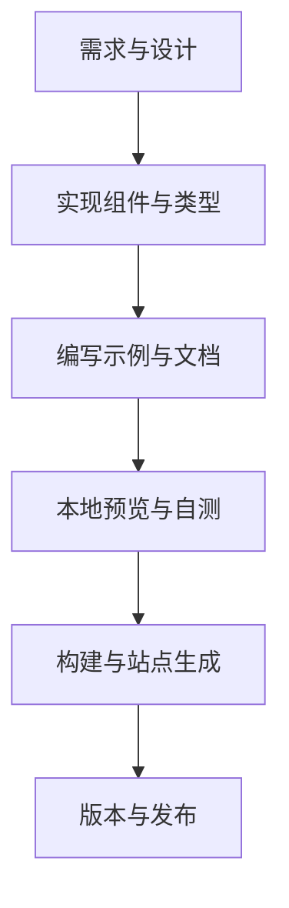

**章节来源**

- [src/components/button/index.md:1-78](file://src/components/button/index.md#L1-L78)
- [src/components/button/demos/basic.tsx:1-29](file://src/components/button/demos/basic.tsx#L1-L29)
- [.dumirc.ts:9-17](file://.dumirc.ts#L9-L17)

### 代码规范与质量保证

- ESLint：继承 @umijs/lint，启用 import 规则与 TypeScript 解析
- Stylelint：继承 @umijs/lint 并调整部分规则
- Prettier：统一缩进、引号、尾逗号等风格，支持 organize-imports 与 packagejson 插件
- Biome：现代化代码格式化和质量检查工具，支持 JavaScript/TypeScript 格式化
- 提交前检查：Husky + lint-staged 在提交时自动格式化与修复
- 重复代码检测：JSCPD 配置忽略测试与示例目录，定期扫描报告

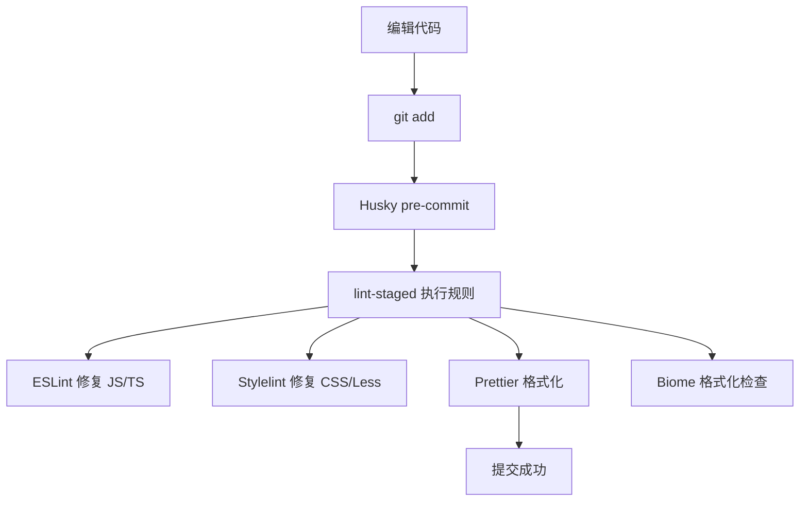

**图示来源**

- [.lintstagedrc.json:1-7](file://.lintstagedrc.json#L1-L7)
- [.husky/pre-commit:1-5](file://.husky/pre-commit#L1-L5)
- [.eslintrc.js:1-45](file://.eslintrc.js#L1-L45)
- [.prettierrc.js:1-22](file://.prettierrc.js#L1-L22)
- [.stylelintrc:1-8](file://.stylelintrc#L1-L8)
- [.jscpd.json:1-13](file://.jscpd.json#L1-L13)
- [biome.json:1-37](file://biome.json#L1-L37)

**章节来源**

- [.eslintrc.js:1-45](file://.eslintrc.js#L1-L45)
- [.prettierrc.js:1-22](file://.prettierrc.js#L1-L22)
- [.stylelintrc:1-8](file://.stylelintrc#L1-L8)
- [.lintstagedrc.json:1-7](file://.lintstagedrc.json#L1-L7)
- [.husky/pre-commit:1-5](file://.husky/pre-commit#L1-L5)
- [.jscpd.json:1-13](file://.jscpd.json#L1-L13)
- [biome.json:1-37](file://biome.json#L1-L37)

### 版本管理与发布流程

- 版本命令：提供 major/minor/patch 三类版本更新脚本
- 发布前校验：prepublishOnly 钩子执行 doctor、build 和 ai:generate，确保产物与 AI 文档正确
- 发布：使用 npm publish（已配置公开访问）

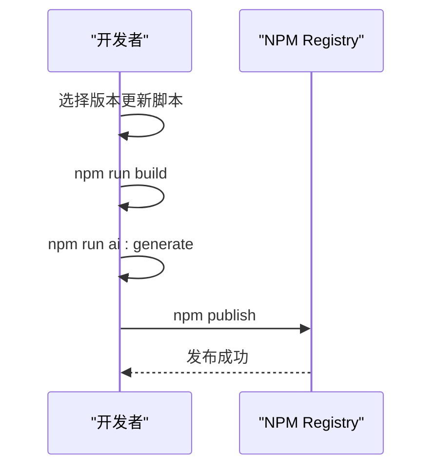

**图示来源**

- [package.json:43-51](file://package.json#L43-L51)
- [package.json:40-41](file://package.json#L40-L41)

**章节来源**

- [package.json:26-52](file://package.json#L26-L52)

### 团队协作最佳实践与代码审查

- 分支策略：master（无用）、prod（正式）、dev（开发）、feature\_\*（功能）
- 提交规范：使用 commitlint（Conventional Commits）
- 代码审查：结合 ESLint、Stylelint、Prettier、Biome 与 JSCPD 的自动化检查，减少人工负担
- 文档与示例：统一遵循组件文档与示例组织规范，便于他人理解与复用

**章节来源**

- [README.md:46-62](file://README.md#L46-L62)

## AI 文档生成系统

### AI 文档生成脚本

- 脚本名称：ai:generate
- 执行方式：npx tsx scripts/gen-llms-txt.ts
- 功能概述：自动生成渐进式 AI 文档结构，包含 README.md 索引和 ai/components/ 组件级详细文档
- 输出位置：ai/README.md 和 ai/components/\*.md

**更新** 从原来的 llms.txt 格式改为 README.md 格式的渐进式文档结构，提供更好的可读性和维护性。

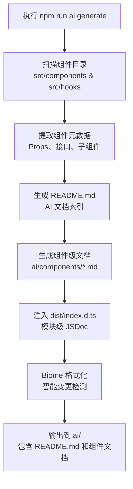

**图示来源**

- [scripts/gen-llms-txt.ts:634-966](file://scripts/gen-llms-txt.ts#L634-L966)
- [scripts/gen-llms-txt.ts:90-124](file://scripts/gen-llms-txt.ts#L90-L124)

**章节来源**

- [scripts/gen-llms-txt.ts:1-966](file://scripts/gen-llms-txt.ts#L1-L966)
- [package.json:31-32](file://package.json#L31-L32)

### AI CLI 工具

- 二进制入口点：sdesign-ai
- 安装方式：npx sdesign-ai
- 功能特性：
  - init：初始化 AI 文档到项目
  - update：更新现有 AI 文档
  - 支持多 AI 编辑器格式：Cursor、Claude、GitHub Copilot
- 输出格式：README.md、ai/components/ 目录结构

**更新** CLI 工具现在支持新的 README.md 格式，提供更灵活的文档分发方式。

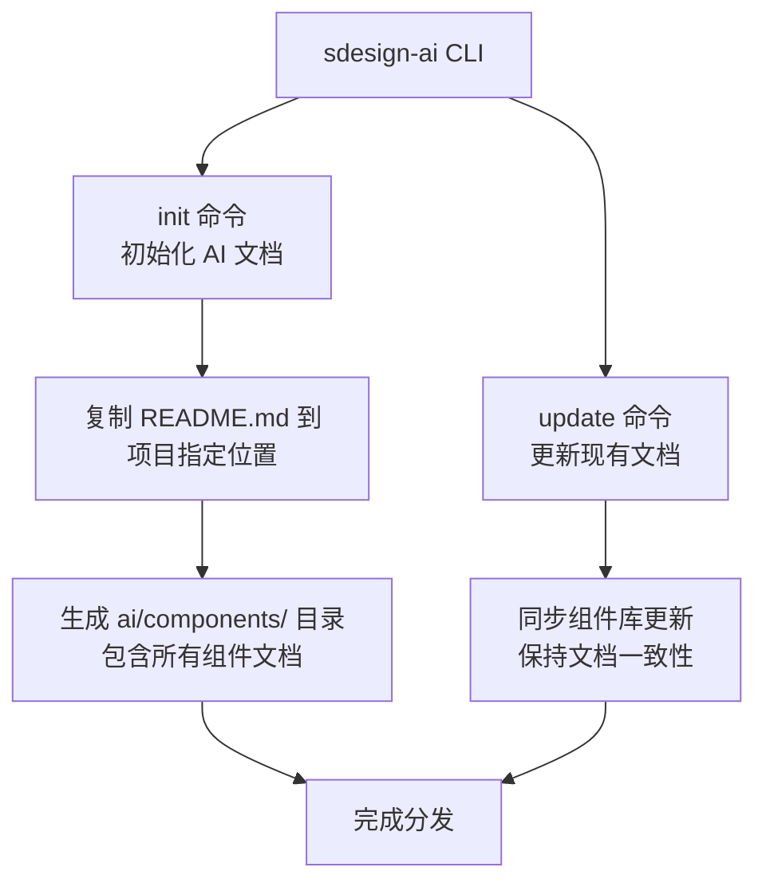

**图示来源**

- [scripts/cli/sdesign-ai.ts:43-107](file://scripts/cli/sdesign-ai.ts#L43-L107)

**章节来源**

- [scripts/cli/sdesign-ai.ts:1-110](file://scripts/cli/sdesign-ai.ts#L1-L110)
- [package.json:19-21](file://package.json#L19-L21)

### 文件分发配置

- 发布包含：dist、ai、scripts/cli 目录
- AI 文档格式：README.md（渐进式索引）+ ai/components/（组件级详细文档）
- CLI 工具：sdesign-ai.ts（Node.js 脚本）

**更新** 发布配置现在包含新的 ai/README.md 和完整的 ai/components/ 目录结构。

**章节来源**

- [package.json:26-30](file://package.json#L26-L30)

### AI 文档格式规范

- 结构组成：组件概览、核心组件 Props、关键配置类型、使用示例、注意事项
- 生成策略：基于 TypeScript 声明文件的 JSDoc 提取
- 适配性：支持主流 AI 编辑器的文档格式要求
- 渐进式结构：README.md 作为索引，ai/components/ 作为详细文档，按需读取

**更新** 采用新的 README.md 格式，提供更好的可读性和维护性，支持智能变更检测和自动文件管理。

**章节来源**

- [ai/README.md:1-208](file://ai/README.md#L1-L208)
- [scripts/gen-llms-txt.ts:337-966](file://scripts/gen-llms-txt.ts#L337-L966)

### 智能变更检测与自动文件管理

- 内容比较：只在文档内容真正变化时才写入文件，避免不必要的文件修改
- 自动清理：删除不再需要的过时文件，保持文档目录整洁
- Biome 集成：自动格式化生成的 AI 文档文件
- 文件跟踪：记录需要格式化的文件列表，统一执行格式化操作

**新增** 新增的智能变更检测机制显著提高了 AI 文档生成的效率和可靠性。

**章节来源**

- [scripts/gen-llms-txt.ts:583-588](file://scripts/gen-llms-txt.ts#L583-L588)
- [scripts/gen-llms-txt.ts:688-699](file://scripts/gen-llms-txt.ts#L688-L699)
- [scripts/gen-llms-txt.ts:800-809](file://scripts/gen-llms-txt.ts#L800-L809)
- [scripts/gen-llms-txt.ts:846-855](file://scripts/gen-llms-txt.ts#L846-L855)
- [scripts/gen-llms-txt.ts:859-863](file://scripts/gen-llms-txt.ts#L859-L863)

## 依赖关系分析

- 运行时依赖：react、antd、dayjs、lucide-react、@ant-design/icons 等
- 开发依赖：dumi、father、@umijs/lint、eslint、stylelint、prettier、husky、lint-staged、biome 等
- AI 相关依赖：tsx（运行 AI 生成脚本）、AI 文档格式化工具
- 类型与工具：typescript、@types/_、@rsbuild/_、@rslib/\* 等

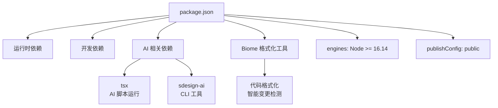

**图示来源**

- [package.json:52-108](file://package.json#L52-L108)

**章节来源**

- [package.json:1-128](file://package.json#L1-L128)

## 性能考虑

- 外部化策略：将 React 生态与 UI 框架标记为外部依赖，降低包体积
- 忽略策略：排除 md、demo、demos 等非产物文件，避免冗余进入构建
- 源码映射：开启 SourceMap 便于调试与定位问题
- 多目标构建：分别输出 ESM/CJS，满足不同运行时需求
- AI 文档优化：README.md 约 2.7K token，适合大语言模型处理
- 智能缓存：通过内容比较避免重复写入，提高生成效率

**更新** 新增智能变更检测机制，显著提升 AI 文档生成的性能表现。

**章节来源**

- [rslib.config.ts:36-71](file://rslib.config.ts#L36-L71)
- [rslib.config.ts:12-34](file://rslib.config.ts#L12-L34)
- [scripts/gen-llms-txt.ts:623-628](file://scripts/gen-llms-txt.ts#L623-L628)
- [scripts/gen-llms-txt.ts:583-588](file://scripts/gen-llms-txt.ts#L583-L588)

## 故障排查指南

- 构建失败
  - 使用 npm run doctor 检查项目健康状况
  - 确认 tsconfig 与全局类型声明是否正确
- 文档无法预览
  - 检查 .dumirc.ts 的 atomDirs 与 alias 配置
  - 确保组件文档与示例文件命名与路径一致
- 提交被拒绝
  - 检查 lint-staged 与 husky 是否正确安装与执行
  - 修复 ESLint、Stylelint、Prettier、Biome 报错后再提交
- 包体积过大
  - 检查外部化配置与忽略规则
  - 合理拆分组件与按需加载
- AI 文档生成失败
  - 确认 TypeScript 声明文件完整性
  - 检查组件 types.ts 文件中的 JSDoc 注释
  - 验证 dist/index.d.ts 是否正确生成
  - 检查 Biome 配置是否正确
  - 确认智能变更检测机制正常工作

**更新** 新增 Biome 相关故障排查指导和智能变更检测问题诊断。

**章节来源**

- [package.json:40-41](file://package.json#L40-L41)
- [.dumirc.ts:9-17](file://.dumirc.ts#L9-L17)
- [.lintstagedrc.json:1-7](file://.lintstagedrc.json#L1-L7)
- [.husky/pre-commit:1-5](file://.husky/pre-commit#L1-L5)
- [rslib.config.ts:12-34](file://rslib.config.ts#L12-L34)
- [scripts/gen-llms-txt.ts:97-124](file://scripts/gen-llms-txt.ts#L97-L124)
- [biome.json:1-37](file://biome.json#L1-L37)

## 结论

本指南提供了从开发、构建、文档到发布的完整工作流与最佳实践。通过 Dumi 与 Father/Rslib 的协同，既能高效产出高质量组件，又能保持文档与示例的一致性。新增的 AI 文档生成系统进一步提升了组件的智能化程度，采用渐进式文档结构和智能变更检测机制，通过自动生成的 README.md 文档为 AI 编辑器提供精确的 API 说明。配合完善的代码规范与质量保障机制，包括新增的 Biome 格式化工具，可显著提升团队协作效率与代码可维护性。

## 附录

- 开发与构建常用命令
  - 安装依赖：pnpm install
  - 开发文档：npm run dev
  - 构建库：npm run build
  - 监听构建：npm run build:watch
  - 构建文档：npm run docs:build
  - 健康检查：npm run doctor
  - AI 文档生成：npm run ai:generate
  - 代码检查：npm run lint
  - Biome 格式化：npm run biome
  - Biome 检查：npm run lint:biome
  - Biome 修复：npm run lint-fix:biome
  - 格式化：npm run format
  - 版本更新：npm version major/minor/patch
- 类型与资源声明
  - 全局类型：global.d.ts
  - TypeScript 配置：tsconfig.json
- AI 文档相关
  - AI 文档生成：scripts/gen-llms-txt.ts
  - AI CLI 工具：scripts/cli/sdesign-ai.ts
  - 生成文档：ai/README.md
  - 组件文档：ai/components/\*.md
- 质量工具
  - Biome 配置：biome.json

**章节来源**

- [README.md:13-33](file://README.md#L13-L33)
- [global.d.ts:1-20](file://global.d.ts#L1-L20)
- [tsconfig.json:1-26](file://tsconfig.json#L1-L26)
- [scripts/gen-llms-txt.ts:1-966](file://scripts/gen-llms-txt.ts#L1-L966)
- [scripts/cli/sdesign-ai.ts:1-110](file://scripts/cli/sdesign-ai.ts#L1-L110)
- [ai/README.md:1-208](file://ai/README.md#L1-L208)
- [biome.json:1-37](file://biome.json#L1-L37)
