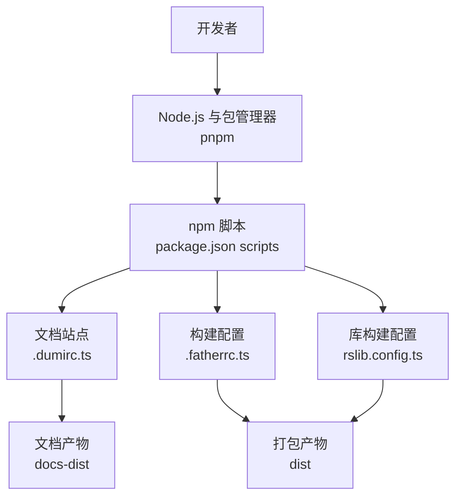
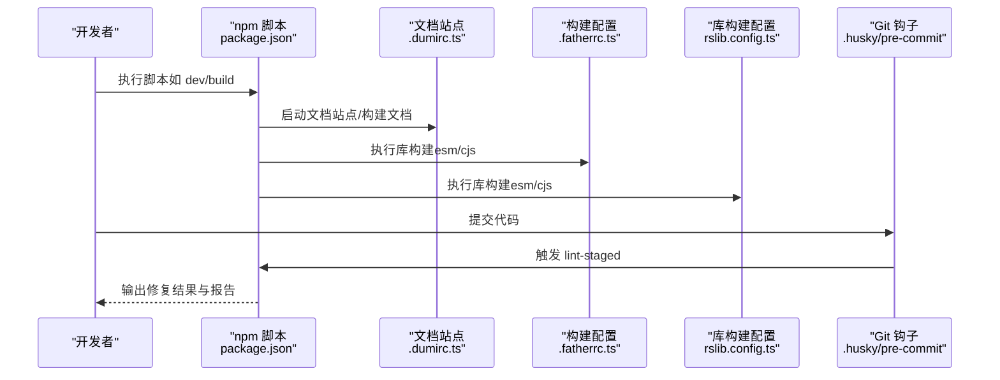
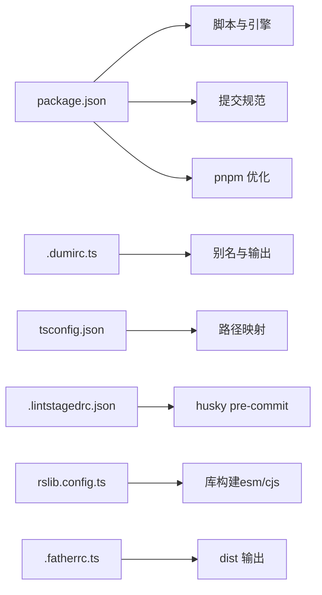

# 开发环境搭建

<cite>
**本文档引用的文件**
- [package.json](file://package.json)
- [tsconfig.json](file://tsconfig.json)
- [.prettierrc.js](file://.prettierrc.js)
- [.eslintrc.js](file://.eslintrc.js)
- [.fatherrc.ts](file://.fatherrc.ts)
- [rslib.config.ts](file://rslib.config.ts)
- [.editorconfig](file://.editorconfig)
- [.stylelintrc](file://.stylelintrc)
- [.lintstagedrc.json](file://.lintstagedrc.json)
- [.husky/pre-commit](file://.husky/pre-commit)
- [.npmrc](file://.npmrc)
- [.vscode/settings.json](file://.vscode/settings.json)
- [.dumirc.ts](file://.dumirc.ts)
- [README.md](file://README.md)
</cite>

## 目录

1. [简介](#简介)
2. [项目结构](#项目结构)
3. [核心组件](#核心组件)
4. [架构总览](#架构总览)
5. [详细组件分析](#详细组件分析)
6. [依赖关系分析](#依赖关系分析)
7. [性能考虑](#性能考虑)
8. [故障排查指南](#故障排查指南)
9. [结论](#结论)
10. [附录](#附录)

## 简介

本指南面向 SDesign 组件库的开发者，帮助你在本地快速搭建并理解开发环境。内容涵盖 Node.js 与包管理器选择（重点推荐 pnpm）、依赖安装与区分（开发依赖与运行时依赖）、TypeScript 编译与路径映射、IDE 配置（VS Code 插件与工作区设置）、代码格式化（Prettier、ESLint、Stylelint）以及 Git 工作流（提交规范与代码审查）。文中所有技术细节均来自仓库现有配置文件，确保可操作与可追溯。

## 项目结构

该仓库采用“组件库 + 文档站点 + 构建工具”的典型前端工程组织方式：

- 源码位于 src，按功能模块拆分组件与 hooks
- 文档站点使用 dumi，入口为 .dumirc.ts
- 构建系统由 father 与 rslib 协同完成，分别负责打包与库构建
- 质量保障通过 ESLint、Stylelint、Prettier、lint-staged、husky 等工具链实现

图表来源

- [package.json](file://package.json#L26-L46)
- [.dumirc.ts](file://.dumirc.ts#L5-L21)
- [.fatherrc.ts](file://.fatherrc.ts#L3-L12)
- [rslib.config.ts](file://rslib.config.ts#L5-L78)

章节来源

- [README.md](file://README.md#L13-L33)
- [package.json](file://package.json#L26-L46)

## 核心组件

- Node.js 与包管理器：要求 Node 版本满足引擎约束；推荐使用 pnpm，具备更快安装速度、严格一致性与工作空间支持等优势。
- TypeScript：通过 tsconfig.json 定义严格模式、声明生成、路径映射与包含/排除规则。
- 文档与构建：dumi 提供组件文档与示例展示；father 与 rslib 负责库打包与发布前校验。
- 质量工具：ESLint、Stylelint、Prettier、lint-staged、husky 组成自动化质量门禁。
- IDE：VS Code 推荐插件与工作区设置，提升开发体验与一致性。

章节来源

- [package.json](file://package.json#L102-L104)
- [tsconfig.json](file://tsconfig.json#L1-L26)
- [.dumirc.ts](file://.dumirc.ts#L5-L21)
- [.fatherrc.ts](file://.fatherrc.ts#L3-L12)
- [rslib.config.ts](file://rslib.config.ts#L5-L78)
- [.eslintrc.js](file://.eslintrc.js#L1-L45)
- [.stylelintrc](file://.stylelintrc#L1-L8)
- [.prettierrc.js](file://.prettierrc.js#L1-L22)
- [.lintstagedrc.json](file://.lintstagedrc.json#L1-L7)
- [.husky/pre-commit](file://.husky/pre-commit#L1-L5)
- [.vscode/settings.json](file://.vscode/settings.json#L1-L29)

## 架构总览

下图展示了从开发到发布的整体流程：本地开发启动文档站点与热更新；构建阶段通过 father 与 rslib 产出多格式产物；质量门禁在提交前自动执行。

图表来源

- [package.json](file://package.json#L26-L46)
- [.dumirc.ts](file://.dumirc.ts#L5-L21)
- [.fatherrc.ts](file://.fatherrc.ts#L3-L12)
- [rslib.config.ts](file://rslib.config.ts#L36-L71)
- [.husky/pre-commit](file://.husky/pre-commit#L4-L4)

章节来源

- [package.json](file://package.json#L26-L46)
- [.dumirc.ts](file://.dumirc.ts#L5-L21)
- [.fatherrc.ts](file://.fatherrc.ts#L3-L12)
- [rslib.config.ts](file://rslib.config.ts#L36-L71)
- [.husky/pre-commit](file://.husky/pre-commit#L1-L5)

## 详细组件分析

### Node.js 与包管理器（pnpm）

- Node 版本要求：满足引擎约束，确保兼容性。
- pnpm 优势：
  - 更快安装速度与更小磁盘占用
  - 严格的依赖解析与一致性
  - 支持工作空间与 monorepo 场景
- 仓库已启用 pnpm 的仅构建优化列表，减少不必要的二进制安装。
- .npmrc 中配置了 registry 与 peer 依赖策略，便于国内网络与依赖管理。

章节来源

- [package.json](file://package.json#L102-L104)
- [package.json](file://package.json#L108-L118)
- [.npmrc](file://.npmrc#L1-L4)

### 依赖安装与区分（开发依赖 vs 运行时依赖）

- 运行时依赖：组件库对外暴露的 React 生态与业务基础库，需随包发布。
- 开发依赖：构建、测试、质量工具与类型定义，仅在开发环境使用。
- peerDependencies：声明与宿主应用一致的外部依赖版本范围，避免重复打包与冲突。
- 仓库通过 engines 与 peerDependencies 确保使用者环境一致性。

章节来源

- [package.json](file://package.json#L52-L60)
- [package.json](file://package.json#L61-L92)
- [package.json](file://package.json#L93-L101)
- [package.json](file://package.json#L102-L104)

### TypeScript 配置（tsconfig.json）

- 编译选项要点：
  - 严格模式与声明文件生成，保证类型安全与 API 友好
  - 跳过库检查、模块解析策略与目标语言版本
  - JSX 使用 react，便于组件开发
- 路径映射：
  - baseUrl 与 paths 实现别名与相对路径简化
  - dumi 临时目录与组件库别名统一引用风格
- include/exclude 控制编译范围，排除文档 Markdown 文件

章节来源

- [tsconfig.json](file://tsconfig.json#L2-L16)
- [tsconfig.json](file://tsconfig.json#L17-L25)
- [.dumirc.ts](file://.dumirc.ts#L13-L17)

### 文档与构建（dumi、father、rslib）

- dumi：
  - 文档站点基座，配置组件文档目录、输出路径、别名与主题
  - 用于本地开发与文档构建
- father：
  - ESM 构建配置，输出至 dist，忽略测试目录
- rslib：
  - 以库模式构建，同时产出 esm 与 cjs 两种格式
  - 自动外部化 React/Ant Design 等依赖，保留类型声明
  - 忽略 md 与 demo 目录，避免打包无关资源

章节来源

- [.dumirc.ts](file://.dumirc.ts#L5-L21)
- [.fatherrc.ts](file://.fatherrc.ts#L3-L12)
- [rslib.config.ts](file://rslib.config.ts#L36-L71)

### 代码格式化与质量工具（Prettier、ESLint、Stylelint）

- Prettier：
  - 组织导入与 package.json 插件启用
  - 行宽、单引号、尾逗号等规则
  - Markdown 与 node_modules 的特殊处理
- ESLint：
  - 基于 @umijs/lint 的默认配置
  - 导入解析器开启 TypeScript 与 Node 解析
  - 可扩展 import 分组与排序规则（注释部分为示例）
- Stylelint：
  - 基于 @umijs/lint 的默认配置
  - 允许特定厂商前缀与颜色函数记法
- lint-staged：
  - 针对不同文件类型执行对应修复命令
  - 在提交前统一格式化与修复

章节来源

- [.prettierrc.js](file://.prettierrc.js#L1-L22)
- [.eslintrc.js](file://.eslintrc.js#L1-L45)
- [.stylelintrc](file://.stylelintrc#L1-L8)
- [.lintstagedrc.json](file://.lintstagedrc.json#L1-L7)

### IDE 配置（VS Code）

- 词典扩展：将项目专有名词加入拼写检查字典，减少误报
- 保存时自动修复：组织导入与统一修复
- 语言对转换：辅助语言对齐（如 TypeScript）

章节来源

- [.vscode/settings.json](file://.vscode/settings.json#L1-L29)

### Git 配置与分支管理

- 提交前钩子：husky 在 pre-commit 阶段调用 lint-staged，自动格式化与修复
- 提交规范：commitlint 继承 conventional 规范，建议遵循 type(scope): subject 的格式
- 分支策略：master（无用）、prod（正式）、dev（开发）、feature\_\*（功能分支）

章节来源

- [.husky/pre-commit](file://.husky/pre-commit#L1-L5)
- [package.json](file://package.json#L47-L51)
- [README.md](file://README.md#L46-L54)

## 依赖关系分析

下图展示关键配置文件之间的依赖关系与交互：

图表来源

- [package.json](file://package.json#L26-L51)
- [package.json](file://package.json#L108-L118)
- [.dumirc.ts](file://.dumirc.ts#L13-L17)
- [tsconfig.json](file://tsconfig.json#L11-L15)
- [.lintstagedrc.json](file://.lintstagedrc.json#L1-L7)
- [.husky/pre-commit](file://.husky/pre-commit#L4-L4)
- [rslib.config.ts](file://rslib.config.ts#L36-L71)
- [.fatherrc.ts](file://.fatherrc.ts#L5-L8)

章节来源

- [package.json](file://package.json#L26-L51)
- [.dumirc.ts](file://.dumirc.ts#L13-L17)
- [tsconfig.json](file://tsconfig.json#L11-L15)
- [.lintstagedrc.json](file://.lintstagedrc.json#L1-L7)
- [.husky/pre-commit](file://.husky/pre-commit#L1-L5)
- [rslib.config.ts](file://rslib.config.ts#L36-L71)
- [.fatherrc.ts](file://.fatherrc.ts#L3-L12)

## 性能考虑

- 使用 pnpm 与仅构建优化列表，降低安装与打包时间
- rslib 库构建关闭 bundle，减少体积与提升缓存命中
- 忽略 md 与 demo 目录，避免无关资源进入构建流程
- lint-staged 仅对变更文件执行修复，缩短 CI 时间

章节来源

- [package.json](file://package.json#L108-L118)
- [rslib.config.ts](file://rslib.config.ts#L12-L35)
- [rslib.config.ts](file://rslib.config.ts#L36-L71)
- [.lintstagedrc.json](file://.lintstagedrc.json#L1-L7)

## 故障排查指南

- Node 版本不满足引擎约束
  - 现象：安装或运行失败
  - 处理：升级 Node 至满足 >=16.14
- husky 安装失败或 pre-commit 未触发
  - 现象：提交无任何动作
  - 处理：确认 husky 安装脚本与 Git 钩子存在，重新执行安装
- lint-staged 未识别文件类型
  - 现象：某些文件未被修复
  - 处理：检查匹配模式与文件路径，确保在 .lintstagedrc.json 中正确配置
- TypeScript 路径解析异常
  - 现象：导入别名无法解析
  - 处理：核对 tsconfig.json 的 baseUrl 与 paths，确保与 dumi 别名一致
- 文档站点无法访问或样式异常
  - 现象：本地开发或构建后页面空白
  - 处理：清理缓存、重新安装依赖，检查 dumi 与主题插件版本

章节来源

- [package.json](file://package.json#L102-L104)
- [.husky/pre-commit](file://.husky/pre-commit#L1-L5)
- [.lintstagedrc.json](file://.lintstagedrc.json#L1-L7)
- [tsconfig.json](file://tsconfig.json#L11-L15)
- [.dumirc.ts](file://.dumirc.ts#L5-L21)

## 结论

通过 pnpm、TypeScript、dumi、father 与 rslib 的组合，SDesign 形成了高效、可维护且可发布的开发与构建体系。配合 ESLint、Stylelint、Prettier 与 lint-staged 的质量门禁，以及 husky 的提交前拦截，能够显著提升团队协作效率与代码质量。建议在新成员入职时，优先完成 Node 与 pnpm 的安装，并按照本文档逐步配置 IDE 与 Git 工作流。

## 附录

- 常用脚本速览（来自 package.json）
  - 开发：启动文档站点与热更新
  - 构建：打包库与文档
  - 质量：ESLint、Stylelint、Biome 格式化与检查
  - 发布前检查：doctor 与构建校验
- 分支命名与用途参考 README 的分支说明

章节来源

- [package.json](file://package.json#L26-L46)
- [README.md](file://README.md#L46-L54)
