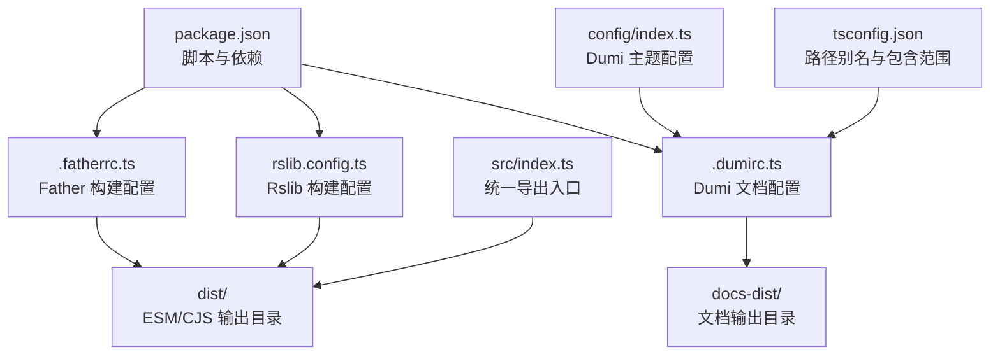
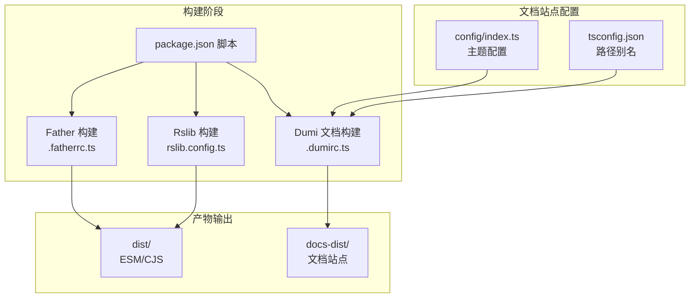
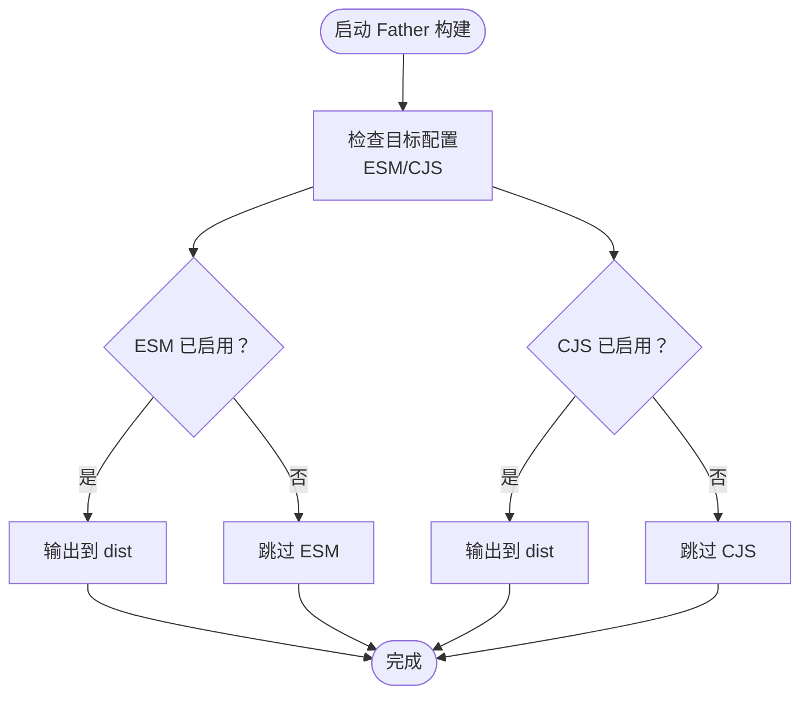
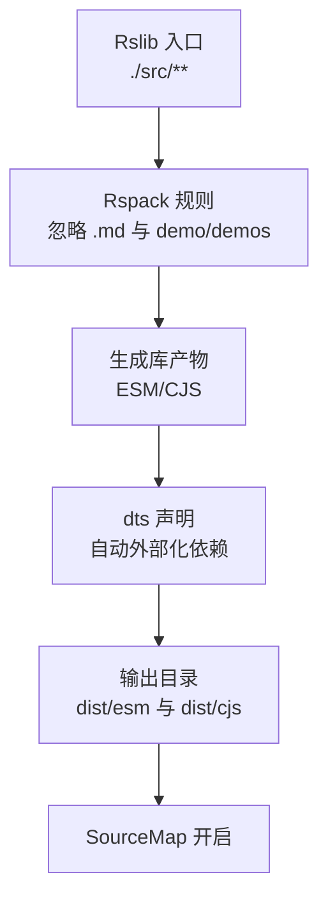
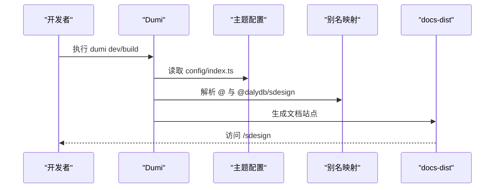
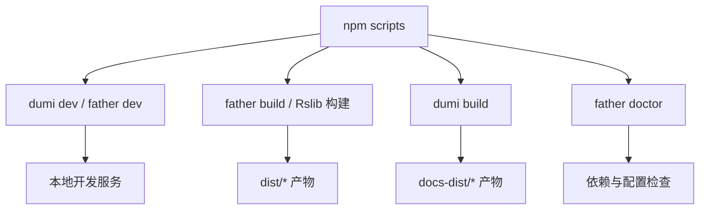
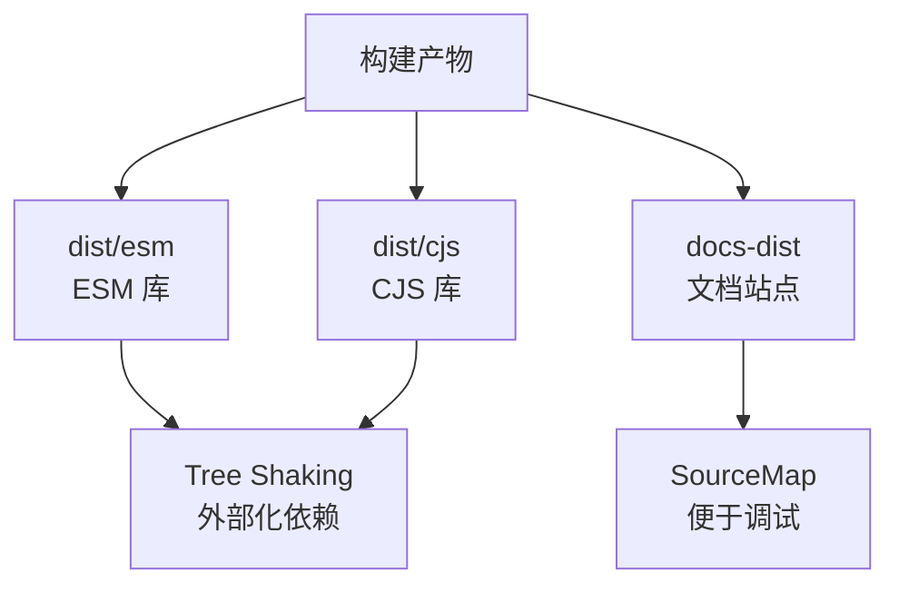
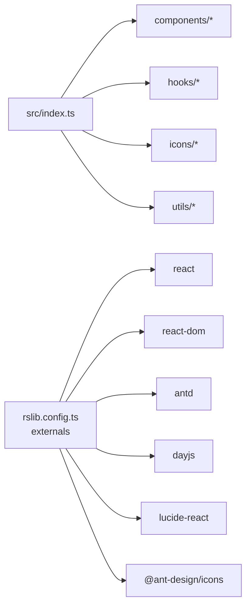

# 构建配置

<cite>
**本文引用的文件**
- [.fatherrc.ts](file://.fatherrc.ts)
- [rslib.config.ts](file://rslib.config.ts)
- [.dumirc.ts](file://.dumirc.ts)
- [package.json](file://package.json)
- [config/index.ts](file://config/index.ts)
- [tsconfig.json](file://tsconfig.json)
- [src/index.ts](file://src/index.ts)
- [src/components/button/index.md](file://src/components/button/index.md)
- [src/components/form/index.md](file://src/components/form/index.md)
</cite>

## 目录

1. [简介](#简介)
2. [项目结构](#项目结构)
3. [核心组件](#核心组件)
4. [架构总览](#架构总览)
5. [详细组件分析](#详细组件分析)
6. [依赖分析](#依赖分析)
7. [性能考虑](#性能考虑)
8. [故障排查指南](#故障排查指南)
9. [结论](#结论)
10. [附录](#附录)

## 简介

本文件系统性梳理 SDesign 组件库的构建配置，覆盖以下方面：

- 使用 Father 构建工具进行多目标构建（ESM），并说明 CJS 的可用配置与输出目录。
- 使用 Rslib 构建库产物，包含开发/生产构建、忽略规则、外部化依赖、输出目录等。
- 使用 Dumi 构建文档站点，涵盖基础路径、输出目录、组件解析规则、别名与主题配置。
- 提供构建脚本的使用方法与命令说明。
- 解释构建产物结构与优化策略（代码分割、Tree Shaking、压缩、SourceMap）。
- 总结构建性能优化技巧（缓存、并行构建、忽略规则等）。

## 项目结构

仓库采用“组件库 + 文档站点”的双构建体系：

- 组件库源码位于 src 目录，按功能模块拆分组件、Hooks、Icons、Utils 等。
- 文档站点位于 docs 目录，配合 Dumi 使用 Markdown + Demo 的方式组织文档。
- 构建配置分别由三个文件管理：.fatherrc.ts（Father）、rslib.config.ts（Rslib）、.dumirc.ts（Dumi）。

**图示来源**

- [package.json](file://package.json#L26-L46)
- [.fatherrc.ts](file://.fatherrc.ts#L3-L12)
- [rslib.config.ts](file://rslib.config.ts#L5-L78)
- [.dumirc.ts](file://.dumirc.ts#L5-L21)
- [config/index.ts](file://config/index.ts#L1-L27)
- [tsconfig.json](file://tsconfig.json#L1-L26)

**章节来源**

- [package.json](file://package.json#L26-L46)
- [.fatherrc.ts](file://.fatherrc.ts#L1-L13)
- [rslib.config.ts](file://rslib.config.ts#L1-L79)
- [.dumirc.ts](file://.dumirc.ts#L1-L22)
- [config/index.ts](file://config/index.ts#L1-L27)
- [tsconfig.json](file://tsconfig.json#L1-L26)

## 核心组件

本节聚焦三大构建工具的配置要点与职责边界。

- Father（.fatherrc.ts）

  - 当前启用 ESM 目标，输出到 dist 目录，并排除测试与内部测试文件。
  - CJS 目标已注释，如需启用可在配置中取消注释并指定输出目录。
  - SourceMap 默认未开启，如需调试可添加相应配置。

- Rslib（rslib.config.ts）

  - 定义入口为 src 下全部文件，通过 Rspack 的 ignore-loader 与 IgnorePlugin 排除 .md 与 demo/demos 目录。
  - 生成两套库产物：ESM 与 CJS，均声明 dts 与自动外部化依赖。
  - 输出目录分别为 dist/esm 与 dist/cjs；同时全局输出 distPath 为 dist。
  - 启用 React 与 Less 插件，支持样式与组件开发。

- Dumi（.dumirc.ts）
  - 站点基础路径 base 与 publicPath 均指向 /sdesign，适配部署在子路径场景。
  - 文档输出目录 outputPath 为 docs-dist。
  - 组件解析规则通过 atomDirs 指向 src/components。
  - 配置 alias 将 @ 与 @dalydb/sdesign 映射至 src，便于文档与示例引用。
  - 引入主题配置 config/index.ts 并启用分析插件 analyze。

**章节来源**

- [.fatherrc.ts](file://.fatherrc.ts#L3-L12)
- [rslib.config.ts](file://rslib.config.ts#L5-L78)
- [.dumirc.ts](file://.dumirc.ts#L5-L21)
- [config/index.ts](file://config/index.ts#L1-L27)

## 架构总览

下图展示构建流程与产物流向，帮助理解各配置之间的协作关系。

**图示来源**

- [package.json](file://package.json#L26-L46)
- [.fatherrc.ts](file://.fatherrc.ts#L3-L12)
- [rslib.config.ts](file://rslib.config.ts#L5-L78)
- [.dumirc.ts](file://.dumirc.ts#L5-L21)
- [config/index.ts](file://config/index.ts#L1-L27)
- [tsconfig.json](file://tsconfig.json#L1-L26)

## 详细组件分析

### Father 构建配置（.fatherrc.ts）

- 多目标构建
  - ESM 目标已启用，输出目录为 dist，排除测试与内部测试文件。
  - CJS 目标已注释，如需启用可在配置中取消注释并设置输出目录。
- SourceMap
  - 默认未开启，如需调试可添加 sourcemap 配置项。
- 适用场景
  - 适用于需要同时产出 ESM/CJS 的库项目，或仅需 ESM 的现代打包场景。

**图示来源**

- [.fatherrc.ts](file://.fatherrc.ts#L3-L12)

**章节来源**

- [.fatherrc.ts](file://.fatherrc.ts#L3-L12)

### Rslib 构建配置（rslib.config.ts）

- 入口与忽略规则
  - 入口为 src 下全部文件，通过 Rspack 规则与 IgnorePlugin 排除 .md 与 demo/demos 目录，避免将文档与演示文件打包进库。
- 库产物
  - 两套库：ESM 与 CJS，均生成 d.ts 并声明外部化依赖（react、react-dom、antd、dayjs、lucide-react、@ant-design/icons）。
  - ESM 输出到 dist/esm，CJS 输出到 dist/cjs。
- 插件与目标
  - 启用 React 与 Less 插件，目标平台为 web。
- SourceMap
  - 全局开启 sourceMap，便于调试与定位问题。

**图示来源**

- [rslib.config.ts](file://rslib.config.ts#L5-L78)

**章节来源**

- [rslib.config.ts](file://rslib.config.ts#L5-L78)

### Dumi 文档站点配置（.dumirc.ts）

- 基础路径与输出
  - base 与 publicPath 均为 /sdesign，适合部署在子路径。
  - outputPath 为 docs-dist，构建后生成静态站点。
- 组件解析
  - atomDirs 指定组件文档目录为 src/components，Dumi 将自动解析组件与示例。
- 别名与主题
  - alias 将 @ 与 @dalydb/sdesign 指向 src，便于文档与示例引用组件。
  - 引入 config/index.ts 作为主题配置，启用 analyze 分析插件。
- 资源与图标
  - 配置 favicons 指向 /sdesign/favicon.ico。

**图示来源**

- [.dumirc.ts](file://.dumirc.ts#L5-L21)
- [config/index.ts](file://config/index.ts#L1-L27)

**章节来源**

- [.dumirc.ts](file://.dumirc.ts#L5-L21)
- [config/index.ts](file://config/index.ts#L1-L27)

### 构建脚本与命令（package.json）

- 开发构建
  - dumi dev：启动文档站点开发服务器。
  - father dev：启动 Father 开发模式（监听与增量构建）。
- 生产构建
  - father build：执行 Father 生产构建（默认 ESM 目标）。
  - Rslib 构建：可通过 Rslib 的构建命令生成库产物（ESM/CJS）。
- 文档构建
  - dumi build：构建文档站点到 docs-dist。
- 其他常用脚本
  - doctor：运行 Father Doctor 检查依赖与配置。
  - prepublishOnly：发布前检查与构建。

**图示来源**

- [package.json](file://package.json#L26-L46)

**章节来源**

- [package.json](file://package.json#L26-L46)

### 构建产物结构与优化策略

- 产物结构
  - ESM/CJS：分别位于 dist/esm 与 dist/cjs，包含编译后的 JS 与 d.ts。
  - 文档：位于 docs-dist，包含静态页面与资源。
- 优化策略
  - 代码分割：Rslib 以模块为单位构建，天然具备良好的模块化与分割能力。
  - Tree Shaking：通过 ESM 导出与外部化依赖，提升 Tree Shaking 效果。
  - 压缩：Rslib 默认启用压缩，减少体积。
  - SourceMap：Rslib 开启 sourceMap，便于调试；Father 默认未开启，如需可补充配置。
  - 忽略规则：Rslib 通过 Rspack 规则与 IgnorePlugin 排除 .md 与 demo/demos，避免非必要文件进入产物。

**图示来源**

- [rslib.config.ts](file://rslib.config.ts#L5-L78)
- [.fatherrc.ts](file://.fatherrc.ts#L3-L12)

**章节来源**

- [rslib.config.ts](file://rslib.config.ts#L5-L78)
- [.fatherrc.ts](file://.fatherrc.ts#L3-L12)

## 依赖分析

- 外部化依赖
  - Rslib 对 react、react-dom、antd、dayjs、lucide-react、@ant-design/icons 进行外部化处理，降低库体积并避免重复打包。
- 路径别名
  - tsconfig.json 与 Dumi 的 alias 配置共同确保 @ 与 @dalydb/sdesign 指向 src，简化导入路径。
- 组件入口
  - src/index.ts 统一导出 components、hooks、icons、utils，便于使用者按需引入。

**图示来源**

- [src/index.ts](file://src/index.ts#L1-L5)
- [rslib.config.ts](file://rslib.config.ts#L42-L51)

**章节来源**

- [src/index.ts](file://src/index.ts#L1-L5)
- [rslib.config.ts](file://rslib.config.ts#L42-L51)

## 性能考虑

- 忽略规则
  - Rslib 通过 ignore-loader 与 IgnorePlugin 排除 .md 与 demo/demos，显著减少打包体积与时间。
- 外部化依赖
  - 将常用依赖外部化，减少库体积，提高加载速度。
- SourceMap
  - Rslib 开启 sourceMap，便于调试；Father 默认未开启，如需可补充配置。
- 缓存与并行
  - 使用 pnpm 的 onlyBuiltDependencies 与构建器缓存机制，提升安装与构建效率。
- 并行构建
  - 在 CI 环境中建议开启并行构建，缩短整体构建时间。

[本节为通用性能建议，无需特定文件引用]

## 故障排查指南

- 文档无法访问 /sdesign
  - 检查 .dumirc.ts 的 base 与 publicPath 是否一致且正确。
  - 确认部署路径与 base/publicPath 匹配。
- 组件示例无法加载
  - 检查 .dumirc.ts 的 alias 与 tsconfig.json 的路径映射是否一致。
  - 确保 atomDirs 正确指向 src/components。
- 构建报错或缺少类型
  - 确认 Rslib 的 dts 生成与 externals 配置是否正确。
  - 检查 tsconfig.json 的 include/exclude 是否包含所需文件。
- 产物过大
  - 检查 externals 是否覆盖了应外部化的依赖。
  - 确认忽略规则是否正确排除了 .md 与 demo/demos。

**章节来源**

- [.dumirc.ts](file://.dumirc.ts#L5-L21)
- [tsconfig.json](file://tsconfig.json#L1-L26)
- [rslib.config.ts](file://rslib.config.ts#L5-L78)

## 结论

SDesign 的构建体系以 Father、Rslib、Dumi 为核心，分别负责库构建、文档站点与多目标产物输出。通过合理的忽略规则、外部化依赖与路径别名，既保证了构建效率，也提升了最终产物的可维护性与可分发性。建议在团队协作中统一构建脚本与配置，确保开发与发布的稳定性。

[本节为总结性内容，无需特定文件引用]

## 附录

- 示例文档页面
  - 组件文档示例：button 与 form 的 Markdown 文档，展示了如何在文档中嵌入示例代码与 API 表格。
- 主题配置
  - config/index.ts 提供导航、API 解析入口与 RTL 支持等主题配置。

**章节来源**

- [src/components/button/index.md](file://src/components/button/index.md#L1-L78)
- [src/components/form/index.md](file://src/components/form/index.md#L1-L158)
- [config/index.ts](file://config/index.ts#L1-L27)
