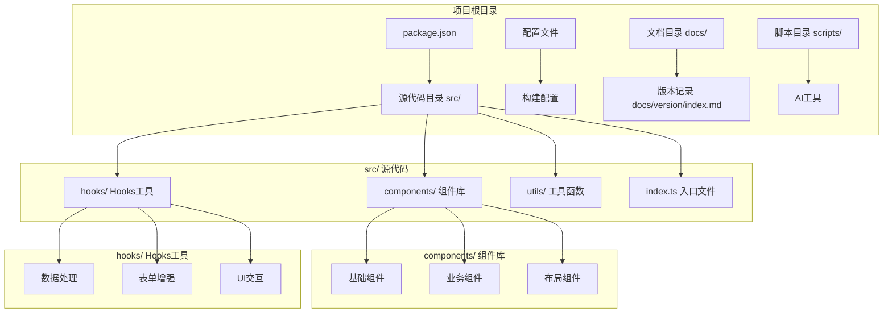
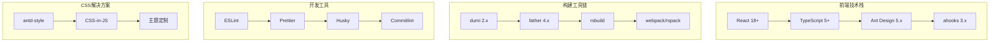
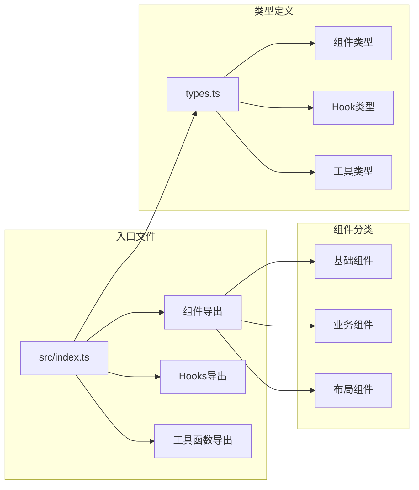
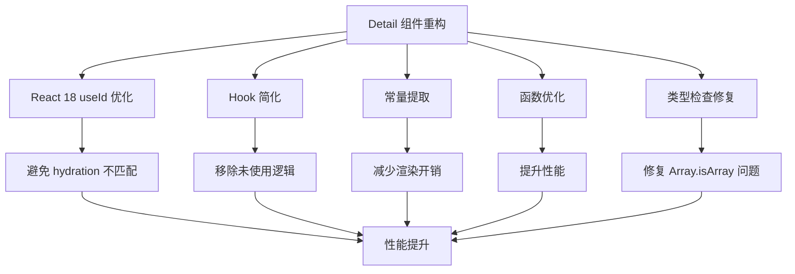
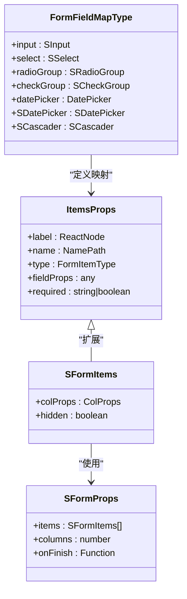
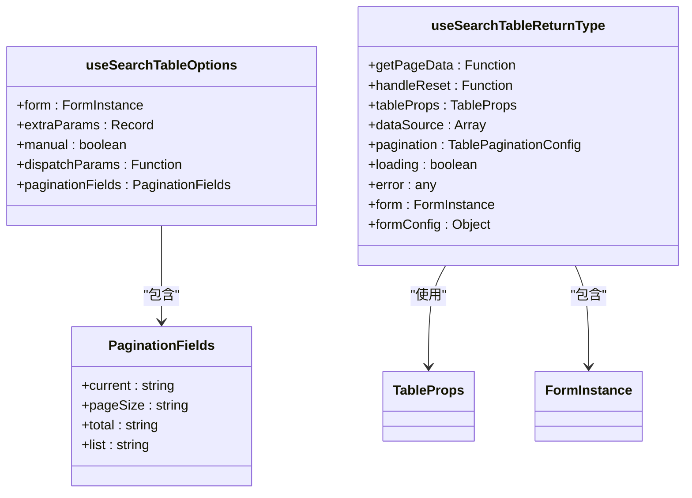
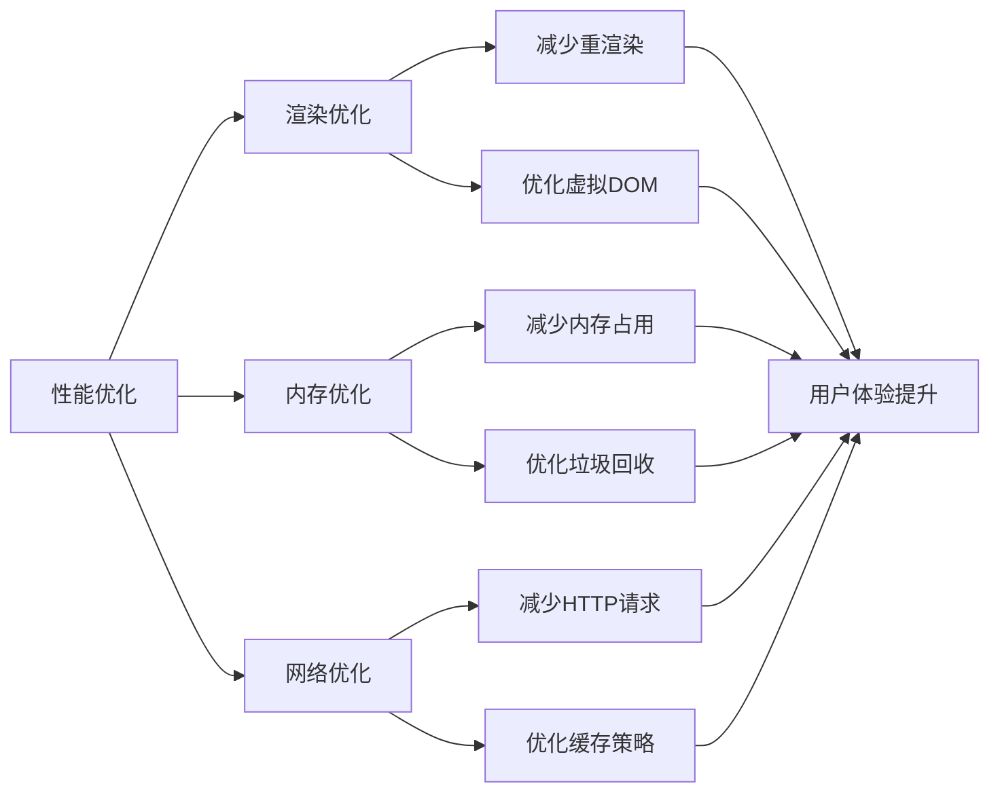
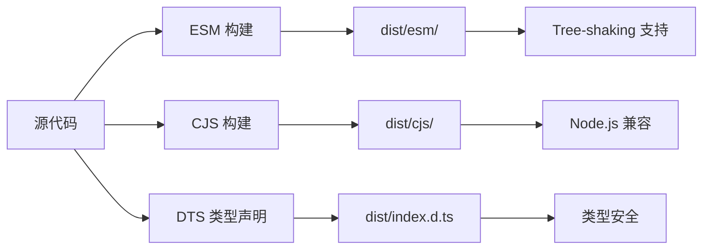
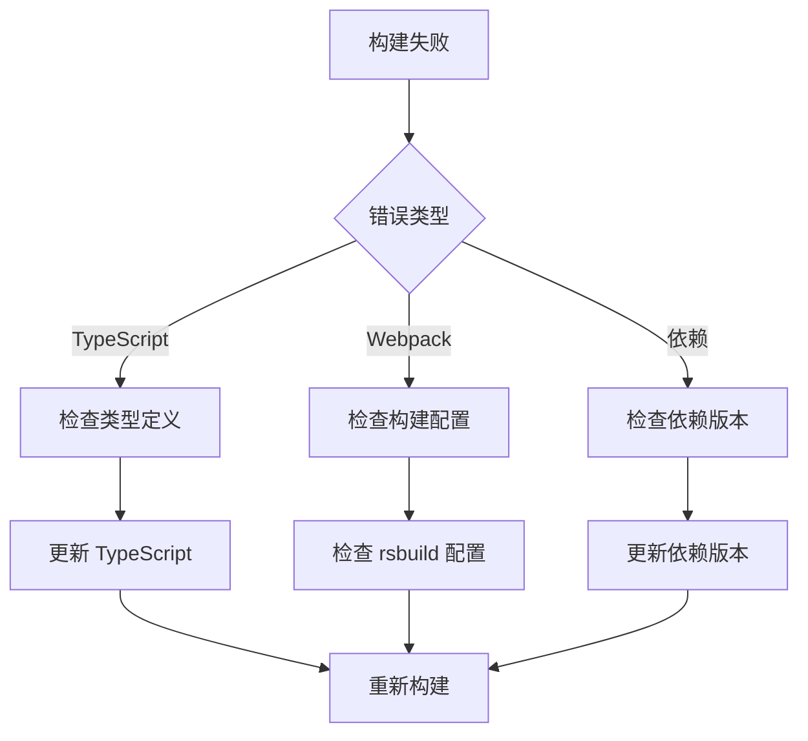

# 版本发布说明

<cite>
**本文档引用的文件**
- [package.json](file://package.json)
- [docs/version/index.md](file://docs/version/index.md)
- [README.md](file://README.md)
- [src/index.ts](file://src/index.ts)
- [src/components/index.ts](file://src/components/index.ts)
- [src/hooks/index.ts](file://src/hooks/index.ts)
- [src/components/detail/types.ts](file://src/components/detail/types.ts)
- [src/hooks/useSearchTable/types.ts](file://src/hooks/useSearchTable/types.ts)
- [src/components/form/types.ts](file://src/components/form/types.ts)
- [.fatherrc.ts](file://.fatherrc.ts)
- [rslib.config.ts](file://rslib.config.ts)
- [.dumirc.ts](file://.dumirc.ts)
- [config/index.ts](file://config/index.ts)
</cite>

## 更新摘要

**所做更改**

- 更新版本管理策略，反映 RELEASE.md 文件已被删除，版本发布说明迁移到 docs/version/index.md
- 更新当前版本信息，反映最新的 1.3.1 版本
- 更新版本历史记录，基于新的 docs/version/index.md 文件内容
- 更新文档结构以反映新的版本管理策略

## 目录

1. [简介](#简介)
2. [项目结构](#项目结构)
3. [核心组件](#核心组件)
4. [架构概览](#架构概览)
5. [详细组件分析](#详细组件分析)
6. [依赖分析](#依赖分析)
7. [性能考虑](#性能考虑)
8. [故障排除指南](#故障排除指南)
9. [结论](#结论)
10. [附录](#附录)

## 简介

@dalydb/sdesign 是一个基于 Ant Design 二次封装的企业级 React 组件库，专注于提升管理后台开发效率。该组件库提供了 50+ 个企业级组件，覆盖常见业务场景，支持 TypeScript、按需加载和灵活的主题配置。

**章节来源**

- [README.md](file://README.md#L1-L242)
- [package.json](file://package.json#L1-L128)

## 项目结构

项目采用模块化的组织方式，主要包含以下核心目录：



**图表来源**

- [src/index.ts](file://src/index.ts#L1-L5)
- [src/components/index.ts](file://src/components/index.ts#L1-L78)
- [src/hooks/index.ts](file://src/hooks/index.ts#L1-L25)

**章节来源**

- [src/index.ts](file://src/index.ts#L1-L5)
- [src/components/index.ts](file://src/components/index.ts#L1-L78)
- [src/hooks/index.ts](file://src/hooks/index.ts#L1-L25)

## 核心组件

### 组件体系

@dalydb/sdesign 提供了完整的组件体系，涵盖三个主要类别：

#### 基础组件

- **SButton** - 增强按钮组件
- **SForm** - 配置化表单组件
- **STable** - 数据表格组件
- **SSelect** - 下拉选择器组件
- **SInput** - 输入框组件

#### 业务组件

- **SSearchTable** - 搜索表格一体化组件
- **SDetail** - 详情展示组件
- **SFile** - 文件处理组件
- **SCard** - 卡片布局组件

#### 布局组件

- **STitle** - 标题组件
- **SDynamicContainer** - 动态容器组件
- **SErrorBoundary** - 错误边界组件

### Hooks 工具

组件库提供了丰富的 Hooks 工具，主要包括：

- **数据处理** - useSearchTable、useSearchLayout
- **表单增强** - useFormPerformance、useDispatchDict
- **UI 交互** - useExpand、useFrameAnimation、useScale

**章节来源**

- [src/components/index.ts](file://src/components/index.ts#L1-L78)
- [src/hooks/index.ts](file://src/hooks/index.ts#L1-L25)

## 架构概览

### 技术栈架构



**图表来源**

- [README.md](file://README.md#L159-L166)
- [package.json](file://package.json#L67-L98)

### 组件导出架构



**图表来源**

- [src/index.ts](file://src/index.ts#L1-L5)
- [src/components/index.ts](file://src/components/index.ts#L1-L78)

**章节来源**

- [README.md](file://README.md#L159-L166)
- [package.json](file://package.json#L67-L98)

## 详细组件分析

### Detail 组件优化

#### 组件重构要点

v1.3.0 版本对 Detail 组件进行了全面重构优化：



**图表来源**

- [docs/version/index.md](file://docs/version/index.md#L15-L21)

#### 性能优化指标

- **性能提升**：减少不必要的重渲染
- **代码量减少**：约 108 行代码
- **可维护性**：更好的类型定义和代码结构

**章节来源**

- [docs/version/index.md](file://docs/version/index.md#L15-L21)

### Form 组件增强

#### 功能扩展

Form 组件在 v1.3.0 版本中增强了以下功能：

- **Ant Design Form 集成**：完全兼容 Ant Design Form 的方法和组件
- **性能监控**：内置性能监控功能
- **丰富示例**：提供完整的使用示例文档

#### 类型系统优化



**图表来源**

- [src/components/form/types.ts](file://src/components/form/types.ts#L50-L97)
- [src/components/form/types.ts](file://src/components/form/types.ts#L132-L186)
- [src/components/form/types.ts](file://src/components/form/types.ts#L206-L231)

**章节来源**

- [docs/version/index.md](file://docs/version/index.md#L23-L27)
- [src/components/form/types.ts](file://src/components/form/types.ts#L50-L97)

### SearchTable 组件改进

#### 功能增强

SearchTable 组件在 v1.3.0 版本中实现了多项改进：

- **自动刷新**：删除数据后自动刷新表格
- **外部表单集成**：支持与外部表单实例集成
- **自动初始化**：支持自动初始化数据请求
- **错误处理优化**：增强错误处理机制

#### 类型定义完善



**图表来源**

- [src/hooks/useSearchTable/types.ts](file://src/hooks/useSearchTable/types.ts#L47-L67)
- [src/hooks/useSearchTable/types.ts](file://src/hooks/useSearchTable/types.ts#L9-L30)
- [src/hooks/useSearchTable/types.ts](file://src/hooks/useSearchTable/types.ts#L88-L116)

**章节来源**

- [docs/version/index.md](file://docs/version/index.md#L29-L33)
- [src/hooks/useSearchTable/types.ts](file://src/hooks/useSearchTable/types.ts#L47-L67)

### 性能优化策略

#### 组件级优化

v1.3.0 版本实施了多项性能优化措施：

- **Button 组件紧凑模式**：优化按钮布局和渲染
- **Input 组件 useCallback 优化**：减少不必要的重新渲染
- **Form 组件性能提升**：整体性能优化

#### 优化效果



**图表来源**

- [docs/version/index.md](file://docs/version/index.md#L42-L46)

**章节来源**

- [docs/version/index.md](file://docs/version/index.md#L42-L46)

## 依赖分析

### 核心依赖关系

```mermaid
graph TB
subgraph "运行时依赖"
A[@dalydb/sdesign] --> B[react >=18.0.0]
A --> C[antd >=5.20.6]
A --> D[dayjs ^1.11.0]
A --> E[lucide-react >=0.500.0]
A --> F[ahooks ^3.7.4]
A --> G[antd-style ^3.6.2]
A --> H[axios ^1.13.4]
end
subgraph "开发依赖"
I[dumi ~2.4.21] --> J[文档生成]
K[father ^4.6.11] --> L[构建工具]
M[rsbuild] --> N[现代化构建]
O[typescript ^5] --> P[类型检查]
end
subgraph "工具链"
Q[eslint] --> R[代码规范]
S[prettier] --> T[代码格式化]
U[husky] --> V[Git钩子]
W[commitlint] --> X[提交规范]
end
```

**图表来源**

- [package.json](file://package.json#L58-L108)
- [package.json](file://package.json#L67-L98)

### 构建配置分析

#### 多格式输出

组件库采用多格式构建策略：



**图表来源**

- [rslib.config.ts](file://rslib.config.ts#L36-L71)
- [.fatherrc.ts](file://.fatherrc.ts#L3-L12)

**章节来源**

- [package.json](file://package.json#L58-L108)
- [rslib.config.ts](file://rslib.config.ts#L36-L71)
- [.fatherrc.ts](file://.fatherrc.ts#L3-L12)

## 性能考虑

### 构建性能优化

组件库在构建阶段采用了多项优化策略：

- **按需构建**：忽略测试文件和演示文件
- **外部化依赖**：将 React 生态系统依赖标记为外部依赖
- **多格式输出**：同时生成 ESM 和 CJS 格式
- **类型声明**：自动生成 TypeScript 类型声明

### 运行时性能优化

- **React 18 新特性**：利用 React 18 的并发特性和新的调度算法
- **memo 优化**：合理使用 React.memo 减少不必要的渲染
- **useCallback 优化**：使用 useCallback 缓存回调函数
- **懒加载**：支持组件的懒加载和按需加载

## 故障排除指南

### 常见问题解决

#### 版本兼容性问题

当遇到版本兼容性问题时，建议：

1. **检查 Node.js 版本**：确保 Node.js 版本满足引擎要求
2. **清理缓存**：执行 `pnpm store prune` 清理缓存
3. **重新安装依赖**：删除 `node_modules` 和 `pnpm-lock.yaml` 重新安装

#### 构建失败排查



#### 性能问题诊断

1. **使用 React DevTools** 分析组件渲染情况
2. **检查内存泄漏**：使用浏览器性能面板分析内存使用
3. **优化重渲染**：使用 React.memo 和 useCallback 优化组件

**章节来源**

- [package.json](file://package.json#L109-L111)

## 结论

@dalydb/sdesign v1.3.1 版本代表了组件库的重要里程碑，主要体现在：

### 主要成就

1. **Detail 组件重构**：通过 React 18 新特性优化，显著提升了组件性能和稳定性
2. **性能全面提升**：多个核心组件的性能优化，包括 Button、Input、Form 等
3. **文档完善**：新增大量技术文档，提升开发体验
4. **架构优化**：改进了组件设计和类型系统
5. **版本管理策略更新**：版本发布说明集中管理，便于维护

### 技术特色

- **现代化技术栈**：基于 React 18、TypeScript 5、Ant Design 5
- **完善的开发工具链**：从开发到发布的完整工具链支持
- **优秀的开发者体验**：丰富的示例、详细的文档和良好的类型支持
- **高性能设计**：注重性能优化和用户体验
- **集中化版本管理**：统一的版本发布说明管理

### 未来展望

随着 v1.3.1 版本的发布，@dalydb/sdesign 为管理后台开发提供了更加稳定、高效的解决方案。后续版本将继续优化性能、扩展功能，并保持与最新前端技术的同步发展。

## 附录

### 版本历史

| 版本  | 发布日期   | 主要变更                                        |
| ----- | ---------- | ----------------------------------------------- |
| 1.3.1 | 2025-03-02 | AI 生成知识库逻辑优化                           |
| 1.3.0 | 2025-03-02 | Detail 组件重构、性能优化、文档完善             |
| 1.2.0 | 2026-02-25 | useSearchTable 重构、搜索表格改进、上传组件移除 |
| 1.1.6 | 2026-02-01 | 组件性能优化、按钮组件重命名                    |

### 安装和升级

```bash
# 新安装
pnpm add @dalydb/sdesign

# 升级
pnpm update @dalydb/sdesign

# 指定版本
pnpm add @dalydb/sdesign@1.3.1
```

**章节来源**

- [docs/version/index.md](file://docs/version/index.md#L1-L131)
- [README.md](file://README.md#L64-L75)
- [package.json](file://package.json#L3)

### 版本管理策略

**更新** 组件库已更新版本管理策略，版本发布说明集中管理在 docs/version/index.md 文件中，替代了之前的独立 RELEASE.md 文件。这种集中化管理方式提供了更好的版本控制和文档维护体验。

**章节来源**

- [docs/version/index.md](file://docs/version/index.md#L1-L131)
