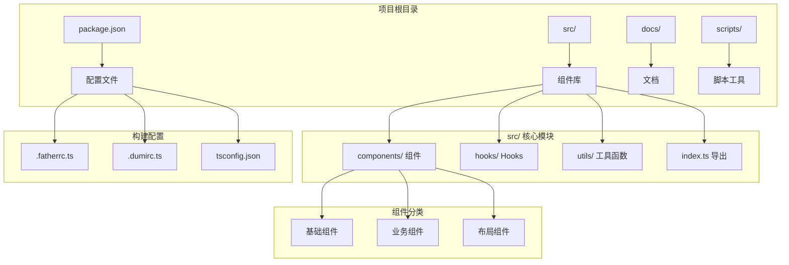
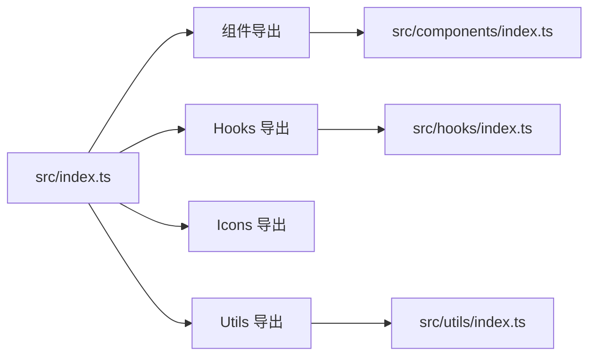
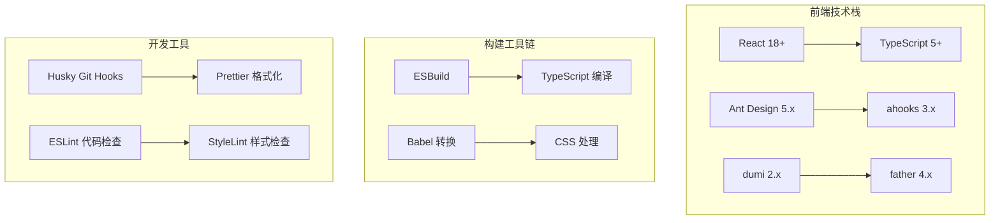
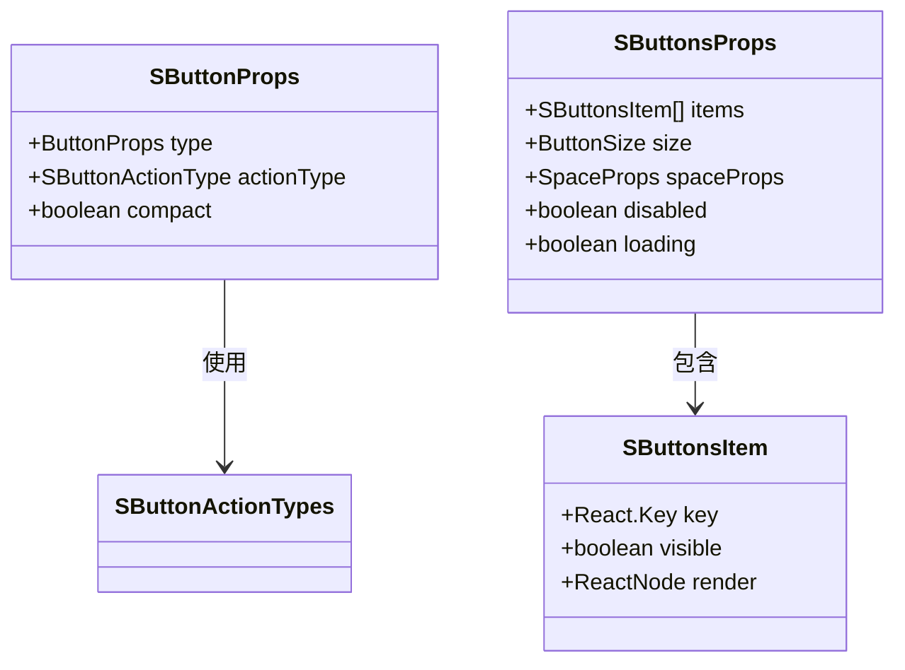
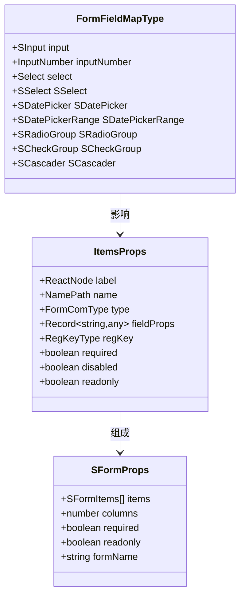
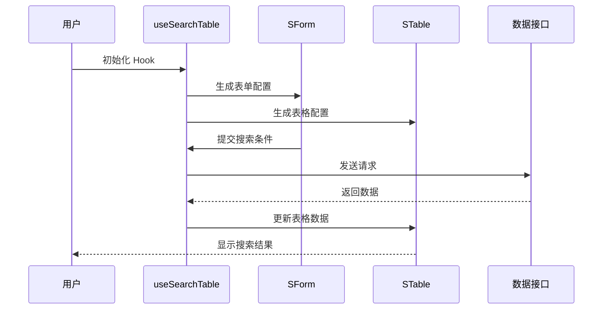
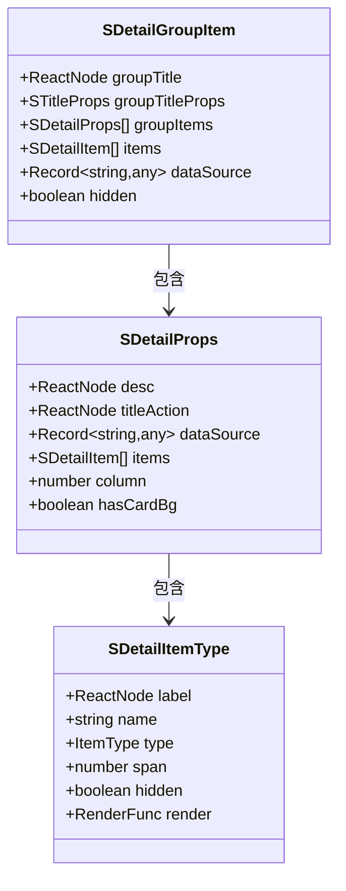
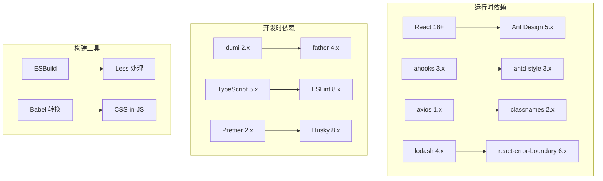
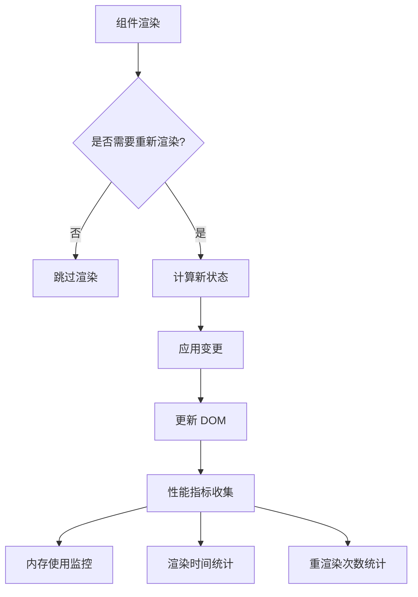

# 版本更新记录

<cite>
**本文档引用的文件**
- [package.json](file://package.json)
- [docs/version/index.md](file://docs/version/index.md)
- [README.md](file://README.md)
- [.fatherrc.ts](file://.fatherrc.ts)
- [.dumirc.ts](file://.dumirc.ts)
- [tsconfig.json](file://tsconfig.json)
- [src/index.ts](file://src/index.ts)
- [src/components/index.ts](file://src/components/index.ts)
- [src/hooks/index.ts](file://src/hooks/index.ts)
- [src/utils/index.ts](file://src/utils/index.ts)
- [src/components/button/types.ts](file://src/components/button/types.ts)
- [src/hooks/useSearchTable/types.ts](file://src/hooks/useSearchTable/types.ts)
- [src/components/form/types.ts](file://src/components/form/types.ts)
- [src/components/detail/types.ts](file://src/components/detail/types.ts)
</cite>

## 目录

1. [简介](#简介)
2. [项目结构](#项目结构)
3. [核心组件](#核心组件)
4. [架构概览](#架构概览)
5. [详细组件分析](#详细组件分析)
6. [依赖分析](#依赖分析)
7. [性能考虑](#性能考虑)
8. [故障排除指南](#故障排除指南)
9. [结论](#结论)

## 简介

@Dalydb/sdesign 是一个基于 Ant Design 二次封装的企业级 React 组件库，专注于提升管理后台开发效率。该项目提供了丰富的组件体系、强大的工具函数库以及完善的 Hooks 生态系统。

**章节来源**

- [README.md](file://README.md#L1-L242)

## 项目结构

项目采用模块化的组织方式，主要包含以下核心目录：

**图表来源**

- [src/index.ts](file://src/index.ts#L1-L5)
- [.fatherrc.ts](file://.fatherrc.ts#L1-L13)
- [.dumirc.ts](file://.dumirc.ts#L1-L22)

**章节来源**

- [src/index.ts](file://src/index.ts#L1-L5)
- [src/components/index.ts](file://src/components/index.ts#L1-L78)
- [src/hooks/index.ts](file://src/hooks/index.ts#L1-L25)

## 核心组件

### 组件体系概览

项目提供超过 50 个企业级组件，涵盖以下主要类别：

| 组件类别 | 主要组件                        | 功能特点                |
| -------- | ------------------------------- | ----------------------- |
| 基础组件 | Button、Form、Table、Select     | Ant Design 5.x 无缝集成 |
| 业务组件 | SearchTable、Detail、FileUpload | 业务场景专用组件        |
| 布局组件 | Card、Title、Container          | 页面布局辅助组件        |

### 核心导出结构

**图表来源**

- [src/index.ts](file://src/index.ts#L1-L5)
- [src/components/index.ts](file://src/components/index.ts#L1-L78)

**章节来源**

- [src/components/index.ts](file://src/components/index.ts#L1-L78)
- [src/hooks/index.ts](file://src/hooks/index.ts#L1-L25)

## 架构概览

### 技术栈架构

**图表来源**

- [README.md](file://README.md#L159-L167)
- [package.json](file://package.json#L67-L99)

### 版本管理策略

项目采用语义化版本控制，提供专门的版本升级脚本：

| 脚本命令      | 版本升级类型 | 用途               |
| ------------- | ------------ | ------------------ |
| version:patch | 补丁版本     | 修复 bug，向后兼容 |
| version:minor | 次要版本     | 新功能，向后兼容   |
| version:major | 主要版本     | 破坏性变更         |

**章节来源**

- [package.json](file://package.json#L49-L51)

## 详细组件分析

### Button 组件分析

Button 组件是项目的核心基础组件之一，提供了丰富的预设操作类型和紧凑模式支持。

**图表来源**

- [src/components/button/types.ts](file://src/components/button/types.ts#L56-L102)

#### 预设操作类型

Button 组件支持 17 种预设操作类型，每种类型都预设了相应的文字、图标和样式：

| 操作类型 | 功能描述 | 使用场景           |
| -------- | -------- | ------------------ |
| save     | 保存操作 | 表单提交、数据保存 |
| cancel   | 取消操作 | 弹窗关闭、表单重置 |
| delete   | 删除操作 | 数据删除确认       |
| export   | 导出操作 | 数据导出功能       |
| create   | 创建操作 | 新建页面           |
| edit     | 编辑操作 | 修改现有数据       |
| search   | 搜索操作 | 查询功能           |

**章节来源**

- [src/components/button/types.ts](file://src/components/button/types.ts#L11-L32)

### Form 组件分析

Form 组件提供了声明式的表单配置能力，支持多种表单控件类型。

**图表来源**

- [src/components/form/types.ts](file://src/components/form/types.ts#L50-L97)

#### 支持的表单控件类型

Form 组件支持 20 多种表单控件类型，包括：

| 控件类型   | 对应组件    | 功能特性                                |
| ---------- | ----------- | --------------------------------------- |
| input      | SInput      | 增强文本输入，支持 trim/onEnter         |
| select     | SSelect     | 增强下拉选择器                          |
| datePicker | SDatePicker | 增强日期选择器，onChange 直接返回字符串 |
| radioGroup | SRadioGroup | 单选按钮组                              |
| checkGroup | SCheckGroup | 复选框组                                |
| cascader   | SCascader   | 增强级联选择器                          |

**章节来源**

- [src/components/form/types.ts](file://src/components/form/types.ts#L49-L97)

### useSearchTable Hook 分析

useSearchTable 是项目的核心 Hooks，提供了完整的搜索表格解决方案。

**图表来源**

- [src/hooks/useSearchTable/types.ts](file://src/hooks/useSearchTable/types.ts#L88-L117)

#### 返回值结构

useSearchTable Hook 返回多个重要对象：

| 返回值      | 类型         | 用途                         |
| ----------- | ------------ | ---------------------------- |
| tableProps  | TableProps   | 直接传递给 STable/antd Table |
| formConfig  | Object       | 搜索表单配置对象             |
| form        | FormInstance | 表单实例                     |
| getPageData | Function     | 手动触发数据加载             |
| handleReset | Function     | 重置搜索并刷新               |

**章节来源**

- [src/hooks/useSearchTable/types.ts](file://src/hooks/useSearchTable/types.ts#L88-L117)

### Detail 组件分析

Detail 组件提供了灵活的数据详情展示能力，支持多种数据类型的自动渲染。

**图表来源**

- [src/components/detail/types.ts](file://src/components/detail/types.ts#L51-L171)

#### 支持的渲染类型

Detail 组件支持 8 种数据类型自动渲染：

| 类型      | 功能描述     | 使用场景           |
| --------- | ------------ | ------------------ |
| text      | 纯文本渲染   | 基础文本信息展示   |
| dict      | 字典映射渲染 | 状态码、枚举值转换 |
| file      | 文件列表渲染 | 附件、文档展示     |
| img       | 图片渲染     | 图片、头像展示     |
| rangeTime | 时间范围渲染 | 开始时间到结束时间 |
| checkbox  | 多选值渲染   | 复选框组合值展示   |

**章节来源**

- [src/components/detail/types.ts](file://src/components/detail/types.ts#L8-L31)

## 依赖分析

### 核心依赖关系

**图表来源**

- [package.json](file://package.json#L58-L99)

### 版本兼容性

项目严格控制依赖版本范围以确保兼容性：

| 依赖包       | 版本范围            | 用途      |
| ------------ | ------------------- | --------- |
| react        | >=18.0.0 <19.0.0    | 核心框架  |
| antd         | >=5.20.6 <6.0.0     | UI 组件库 |
| dayjs        | ^1.11.0             | 日期处理  |
| lucide-react | >=0.500.0 <=0.572.0 | 图标库    |
| typescript   | ^5                  | 类型支持  |

**章节来源**

- [package.json](file://package.json#L100-L108)

## 性能考虑

### 优化策略

项目在多个层面实施了性能优化：

1. **Tree Shaking 支持**：组件库支持按需加载，减少打包体积
2. **React 18 新特性**：利用并发特性和 Suspense 提升用户体验
3. **类型安全**：完整的 TypeScript 类型定义，编译时发现潜在问题
4. **构建优化**：使用 ESBuild 进行快速构建

### 性能监控

## 故障排除指南

### 常见问题解决

| 问题类型            | 症状             | 解决方案                     |
| ------------------- | ---------------- | ---------------------------- |
| 组件导入失败        | Module not found | 检查版本兼容性和安装依赖     |
| 样式不生效          | 样式缺失或冲突   | 确认 CSS-in-JS 配置正确      |
| TypeScript 类型错误 | 编译报错         | 更新到最新版本或检查类型定义 |
| 性能问题            | 页面卡顿         | 启用按需加载和优化渲染       |

### 调试工具

项目提供了多种调试和诊断工具：

- **开发者工具**：Chrome DevTools 进行组件检查
- **性能分析**：React DevTools Profiler
- **网络监控**：浏览器网络面板
- **日志输出**：prettyLog 工具函数

## 结论

@Dalydb/sdesign 组件库通过精心设计的架构和丰富的功能特性，为企业级应用开发提供了强有力的支持。其模块化的组件体系、完善的 Hooks 生态以及优秀的性能表现，使其成为管理后台开发的理想选择。

随着版本的持续演进，项目在保持向后兼容性的基础上，不断引入新的功能和优化，为开发者提供了更好的开发体验和更高效的开发效率。
