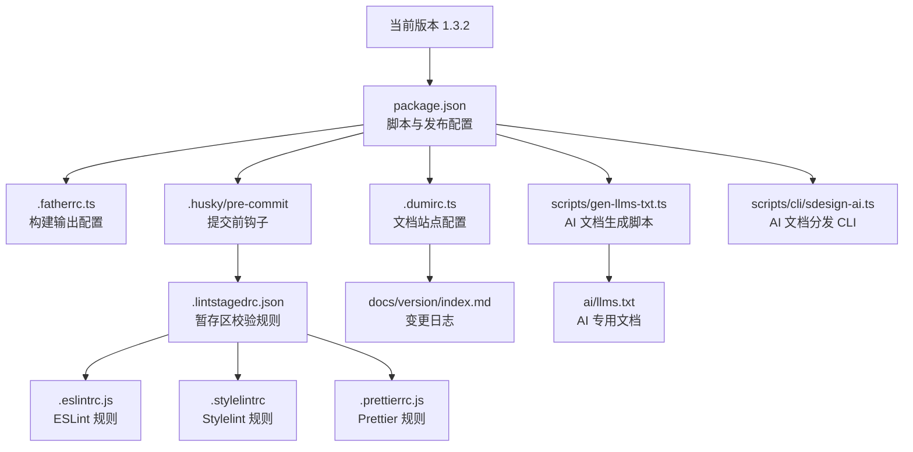
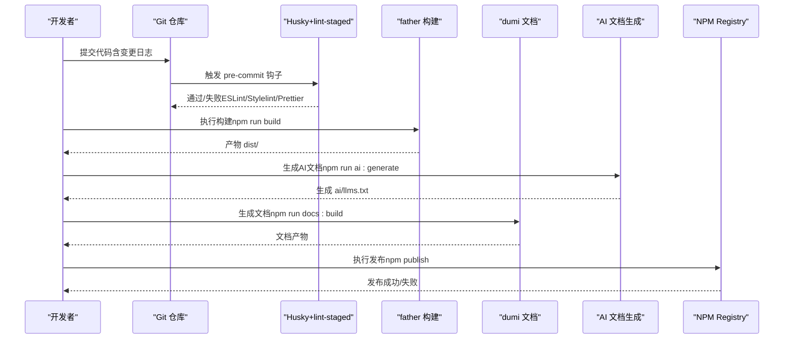
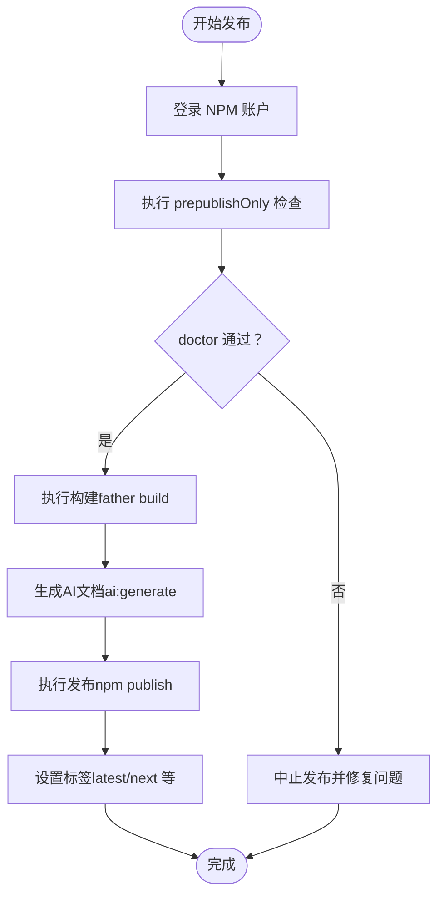
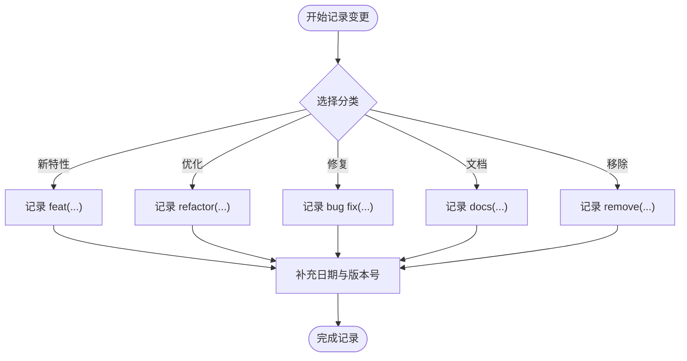
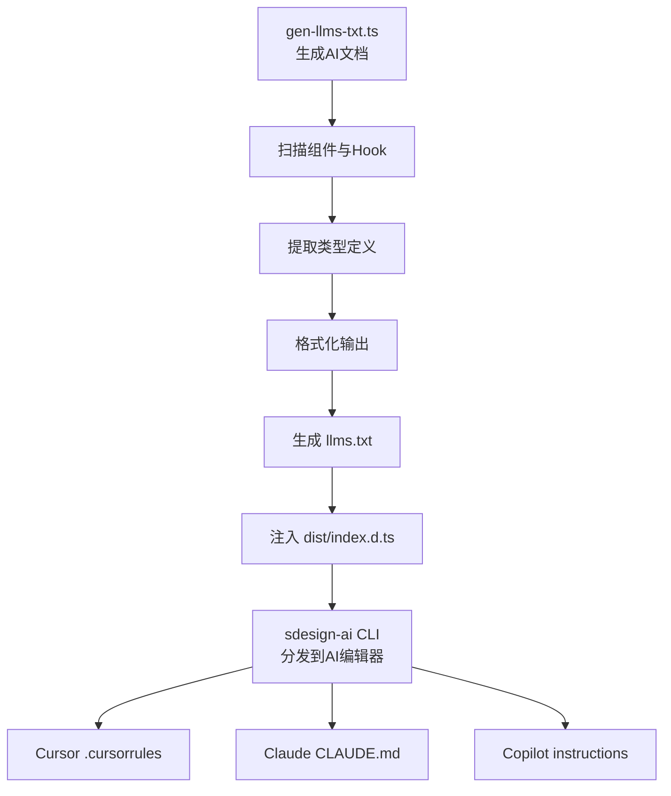
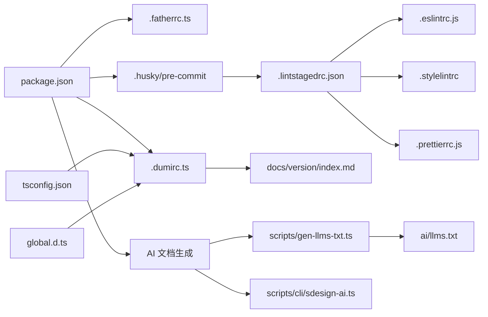

# 版本管理与发布

<cite>
**本文引用的文件**
- [package.json](file://package.json)
- [.fatherrc.ts](file://.fatherrc.ts)
- [.dumirc.ts](file://.dumirc.ts)
- [README.md](file://README.md)
- [docs/version/index.md](file://docs/version/index.md)
- [scripts/gen-llms-txt.ts](file://scripts/gen-llms-txt.ts)
- [scripts/cli/sdesign-ai.ts](file://scripts/cli/sdesign-ai.ts)
- [ai/llms.txt](file://ai/llms.txt)
- [.eslintrc.js](file://.eslintrc.js)
- [.prettierrc.js](file://.prettierrc.js)
- [.lintstagedrc.json](file://.lintstagedrc.json)
- [.husky/pre-commit](file://.husky/pre-commit)
- [.stylelintrc](file://.stylelintrc)
- [tsconfig.json](file://tsconfig.json)
- [global.d.ts](file://global.d.ts)
- [.npmrc](file://.npmrc)
</cite>

## 更新摘要

**所做更改**

- 更新版本号从 1.3.1 到 1.3.2
- 新增 AI 文档生成系统的优化改进
- 更新 AI 脚本的版本管理和分发机制
- 完善 AI 文档生成的自动化流程

## 目录

1. [简介](#简介)
2. [项目结构](#项目结构)
3. [核心组件](#核心组件)
4. [架构总览](#架构总览)
5. [详细组件分析](#详细组件分析)
6. [依赖分析](#依赖分析)
7. [性能考量](#性能考量)
8. [故障排查指南](#故障排查指南)
9. [结论](#结论)
10. [附录](#附录)

## 简介

本指南面向 SDesign 组件库的版本管理与发布流程，结合仓库现有配置与脚本，系统阐述以下主题：

- 语义化版本控制（SemVer）在本项目的使用方式与发布时机建议
- NPM 包发布流程（登录认证、标签与发布命令）
- 版本号管理策略（同步与依赖更新）
- 变更日志维护规范（分类与描述格式）
- 预发布版本（alpha、beta、rc）的管理建议
- 发布前检查清单（测试验证与文档更新）
- 回滚策略与紧急修复流程
- 多包管理的考虑与最佳实践
- AI 文档生成系统的优化与自动化

本指南以仓库现有配置为依据，避免臆测，确保可操作性与一致性。

## 项目结构

SDesign 是一个基于 React 的组件库，采用 dumi 构建文档站点，使用 father 进行构建打包，并通过 Husky + lint-staged 在提交前执行代码质量检查。核心发布相关配置集中在 package.json、.fatherrc.ts 与 .dumirc.ts 中。新增的 AI 文档生成功能通过专门的脚本和 CLI 工具实现自动化。

**图表来源**

- [package.json](file://package.json#L2-L3)
- [.fatherrc.ts](file://.fatherrc.ts#L3-L12)
- [.dumirc.ts](file://.dumirc.ts#L5-L21)
- [.husky/pre-commit](file://.husky/pre-commit#L1-L5)
- [.lintstagedrc.json](file://.lintstagedrc.json#L1-L7)
- [.eslintrc.js](file://.eslintrc.js#L1-L45)
- [.stylelintrc](file://.stylelintrc#L1-L8)
- [.prettierrc.js](file://.prettierrc.js#L1-L22)
- [docs/version/index.md](file://docs/version/index.md#L1-L96)
- [scripts/gen-llms-txt.ts](file://scripts/gen-llms-txt.ts#L1-L793)
- [scripts/cli/sdesign-ai.ts](file://scripts/cli/sdesign-ai.ts#L1-L82)
- [ai/llms.txt](file://ai/llms.txt#L1-L612)

**章节来源**

- [package.json](file://package.json#L1-L128)
- [.fatherrc.ts](file://.fatherrc.ts#L1-L13)
- [.dumirc.ts](file://.dumirc.ts#L1-L22)
- [README.md](file://README.md#L1-L62)
- [docs/version/index.md](file://docs/version/index.md#L1-L131)
- [scripts/gen-llms-txt.ts](file://scripts/gen-llms-txt.ts#L1-L793)
- [scripts/cli/sdesign-ai.ts](file://scripts/cli/sdesign-ai.ts#L1-L82)
- [ai/llms.txt](file://ai/llms.txt#L1-L612)

## 核心组件

- 版本号与发布脚本：通过 npm scripts 提供版本号递增与发布前置检查，如 prepublishOnly、version:major、version:minor、version:patch。
- 构建与打包：father 负责 ESM 构建输出到 dist 目录；dumi 负责文档站点生成。
- 提交前质量门禁：Husky + lint-staged 自动运行 ESLint、Stylelint、Prettier，保证提交质量。
- 变更日志：docs/version/index.md 采用分类化的版本记录，便于维护与发布说明。
- **新增** AI 文档生成系统：通过 gen-llms-txt.ts 自动生成 AI 专用文档，通过 sdesign-ai CLI 分发到各 AI 编辑器。

**章节来源**

- [package.json](file://package.json#L31-L51)
- [.fatherrc.ts](file://.fatherrc.ts#L3-L12)
- [.dumirc.ts](file://.dumirc.ts#L5-L21)
- [.husky/pre-commit](file://.husky/pre-commit#L1-L5)
- [.lintstagedrc.json](file://.lintstagedrc.json#L1-L7)
- [docs/version/index.md](file://docs/version/index.md#L1-L131)
- [scripts/gen-llms-txt.ts](file://scripts/gen-llms-txt.ts#L1-L793)
- [scripts/cli/sdesign-ai.ts](file://scripts/cli/sdesign-ai.ts#L1-L82)

## 架构总览

下图展示从开发到发布的整体流程，涵盖版本号管理、构建、文档生成与发布前置检查，以及新增的 AI 文档生成流程。

**图表来源**

- [package.json](file://package.json#L31-L51)
- [.husky/pre-commit](file://.husky/pre-commit#L1-L5)
- [.fatherrc.ts](file://.fatherrc.ts#L3-L12)
- [.dumirc.ts](file://.dumirc.ts#L5-L21)
- [scripts/gen-llms-txt.ts](file://scripts/gen-llms-txt.ts#L707-L793)

## 详细组件分析

### 语义化版本控制（SemVer）与发布时机

- 当引入破坏性变更（不兼容升级）时，提升主版本号。
- 当向下兼容地新增功能时，提升次版本号。
- 当修复向后兼容的问题时，提升补丁版本号。
- 预发布版本可通过在主/次/补丁号后追加后缀（如 -alpha.1、-beta.2、-rc.0）进行标识，正式发布前去除后缀并同步变更日志。

本项目已提供版本号递增脚本，便于自动化触发版本更新与 tag 创建。

**章节来源**

- [package.json](file://package.json#L49-L51)

### NPM 包发布流程

- 登录认证：使用 npm login 或配置 .npmrc 与 CI 凭证。
- 标签设置：默认使用 latest 标签；若需预发布，可使用 npm publish --tag next 或其它标签名。
- 发布命令：执行 npm publish（或在 CI 中自动执行）。
- 发布前置检查：prepublishOnly 钩子会先执行 father doctor 与构建，确保产物可用。

**图表来源**

- [package.json](file://package.json#L47-L47)

**章节来源**

- [package.json](file://package.json#L47-L47)

### 版本号管理策略

- 同步策略：变更日志与 package.json 中的 version 字段保持一致；每次发布前统一更新。
- 依赖更新：在升级 peerDependencies 或 dependencies 时，遵循 SemVer 并更新变更日志中的"优化/修复/移除"等分类。
- 预发布版本：通过 -alpha、-beta、-rc 后缀区分；正式发布前清理后缀并合并到主版本线。
- **更新** 当前版本：从 1.3.1 升级到 1.3.2，保持与 AI 文档版本同步。

**章节来源**

- [package.json](file://package.json#L2-L3)
- [docs/version/index.md](file://docs/version/index.md#L1-L131)
- [ai/llms.txt](file://ai/llms.txt#L1-L1)

### 变更日志维护规范

- 分类：新特性（🌟）、优化（🔧）、修复（🐛）、文档（📚）、移除（🗑️）。
- 格式：每个版本条目包含日期与改动列表；组件级改动建议以 `组件名: 描述` 的形式呈现。
- 位置：docs/version/index.md 作为官方变更日志，发布时可直接用于发布说明。

**图表来源**

- [docs/version/index.md](file://docs/version/index.md#L1-L131)

**章节来源**

- [docs/version/index.md](file://docs/version/index.md#L1-L131)

### 预发布版本管理

- 使用场景：alpha（内部测试）、beta（公开测试）、rc（候选发布）。
- 命令建议：在本地或 CI 中使用 npm version prerelease --preid=alpha/beta/rc，随后 npm publish --tag alpha/beta/rc。
- 正式发布：在稳定后执行 npm version patch/postrelease 清理预发布后缀并发布到 latest 标签。

**章节来源**

- [package.json](file://package.json#L49-L51)

### 发布前检查清单

- 代码质量：ESLint、Stylelint、Prettier 通过；husky 钩子正常执行。
- 构建产物：father 构建成功，dist 目录存在且包含必要文件。
- 文档站点：dumi 文档构建成功，无构建错误。
- 变更日志：docs/version/index.md 已更新，版本号与 package.json 一致。
- 依赖与兼容：peerDependencies 与 dependencies 符合预期，无破坏性变更。
- 测试：如有单元测试或集成测试，应在发布前执行并通过。
- **新增** AI 文档：ai/llms.txt 生成成功，版本号与主版本同步。

**章节来源**

- [.husky/pre-commit](file://.husky/pre-commit#L1-L5)
- [.lintstagedrc.json](file://.lintstagedrc.json#L1-L7)
- [.fatherrc.ts](file://.fatherrc.ts#L3-L12)
- [.dumirc.ts](file://.dumirc.ts#L5-L21)
- [package.json](file://package.json#L47-L47)
- [docs/version/index.md](file://docs/version/index.md#L1-L131)
- [scripts/gen-llms-txt.ts](file://scripts/gen-llms-txt.ts#L707-L793)
- [ai/llms.txt](file://ai/llms.txt#L1-L1)

### 回滚策略与紧急修复流程

- 回滚策略：若发布后发现严重问题，优先通过发布更高补丁版本进行修复；如需撤销，可使用 npm unpublish（注意时效窗口与风险）。
- 紧急修复：在修复完成后，按 SemVer 发布新补丁版本，并在变更日志中标注紧急修复项。

**章节来源**

- [package.json](file://package.json#L49-L51)
- [docs/version/index.md](file://docs/version/index.md#L1-L131)

### 多包管理的考虑与最佳实践

- 单包模型：当前仓库为单包（@dalydb/sdesign），无需多包管理工具。
- 若扩展为多包：建议引入 monorepo 管理（如 pnpm workspaces + changesets 或 independent 模式），统一版本与发布流程，并在 CI 中实现批量发布。

**章节来源**

- [package.json](file://package.json#L1-L128)

### AI 文档生成系统优化

#### AI 文档生成脚本

- **功能**：自动生成 AI 专用的 llms.txt 文档，包含完整的组件类型定义和使用示例。
- **自动化**：通过 npm run ai:generate 命令自动扫描所有组件和 Hook，提取类型定义。
- **输出**：生成 ai/llms.txt 文件，包含导入示例、组件列表、类型定义和使用示例。

#### AI 文档分发 CLI

- **功能**：将生成的 llms.txt 分发到不同 AI 编辑器的约定位置。
- **支持**：支持 Cursor、Claude、GitHub Copilot 等 AI 编辑器的文件格式。
- **命令**：npx sdesign-ai init/update 命令自动分发到各编辑器位置。

#### 版本同步机制

- **自动版本**：AI 文档版本与主版本号保持同步（1.3.2）。
- **注入机制**：自动生成的 AI 文档会注入到 dist/index.d.ts 中，便于 IDE 智能提示。

**图表来源**

- [scripts/gen-llms-txt.ts](file://scripts/gen-llms-txt.ts#L1-L793)
- [scripts/cli/sdesign-ai.ts](file://scripts/cli/sdesign-ai.ts#L1-L82)
- [ai/llms.txt](file://ai/llms.txt#L1-L612)

**章节来源**

- [scripts/gen-llms-txt.ts](file://scripts/gen-llms-txt.ts#L1-L793)
- [scripts/cli/sdesign-ai.ts](file://scripts/cli/sdesign-ai.ts#L1-L82)
- [ai/llms.txt](file://ai/llms.txt#L1-L612)

## 依赖分析

- 构建链路：father 负责 ESM 输出；dumi 负责文档站点；tsconfig/global.d.ts 提供类型与别名支持。
- 质量工具：ESLint、Stylelint、Prettier 通过 lint-staged 与 husky 在提交阶段强制执行。
- 文档与版本：docs/version/index.md 与 .dumirc.ts 的 base/publicPath/outputPath 影响文档发布路径与资源加载。
- **新增** AI 依赖：tsx、@types/node 等依赖支持 AI 文档生成脚本运行。

**图表来源**

- [package.json](file://package.json#L31-L51)
- [.fatherrc.ts](file://.fatherrc.ts#L3-L12)
- [.dumirc.ts](file://.dumirc.ts#L5-L21)
- [.husky/pre-commit](file://.husky/pre-commit#L1-L5)
- [.lintstagedrc.json](file://.lintstagedrc.json#L1-L7)
- [.eslintrc.js](file://.eslintrc.js#L1-L45)
- [.stylelintrc](file://.stylelintrc#L1-L8)
- [.prettierrc.js](file://.prettierrc.js#L1-L22)
- [docs/version/index.md](file://docs/version/index.md#L1-L131)
- [tsconfig.json](file://tsconfig.json#L1-L26)
- [global.d.ts](file://global.d.ts#L1-L20)
- [scripts/gen-llms-txt.ts](file://scripts/gen-llms-txt.ts#L1-L793)
- [scripts/cli/sdesign-ai.ts](file://scripts/cli/sdesign-ai.ts#L1-L82)
- [ai/llms.txt](file://ai/llms.txt#L1-L612)

**章节来源**

- [package.json](file://package.json#L31-L51)
- [.fatherrc.ts](file://.fatherrc.ts#L3-L12)
- [.dumirc.ts](file://.dumirc.ts#L5-L21)
- [.husky/pre-commit](file://.husky/pre-commit#L1-L5)
- [.lintstagedrc.json](file://.lintstagedrc.json#L1-L7)
- [.eslintrc.js](file://.eslintrc.js#L1-L45)
- [.stylelintrc](file://.stylelintrc#L1-L8)
- [.prettierrc.js](file://.prettierrc.js#L1-L22)
- [docs/version/index.md](file://docs/version/index.md#L1-L131)
- [tsconfig.json](file://tsconfig.json#L1-L26)
- [global.d.ts](file://global.d.ts#L1-L20)
- [scripts/gen-llms-txt.ts](file://scripts/gen-llms-txt.ts#L1-L793)
- [scripts/cli/sdesign-ai.ts](file://scripts/cli/sdesign-ai.ts#L1-L82)
- [ai/llms.txt](file://ai/llms.txt#L1-L612)

## 性能考量

- 构建性能：合理利用 father 的增量构建与缓存；减少不必要的依赖与无用文件进入 dist。
- 文档性能：dumi 的 analyze 可用于分析包体构成；在 CI 中开启构建分析有助于定位体积增长点。
- 代码质量：lint-staged 仅对暂存文件执行检查，降低提交等待时间。
- **新增** AI 文档性能：AI 文档生成脚本采用增量扫描和缓存机制，避免重复解析大型组件库。

**章节来源**

- [.fatherrc.ts](file://.fatherrc.ts#L3-L12)
- [.dumirc.ts](file://.dumirc.ts#L19-L19)
- [.lintstagedrc.json](file://.lintstagedrc.json#L1-L7)
- [scripts/gen-llms-txt.ts](file://scripts/gen-llms-txt.ts#L1-L793)

## 故障排查指南

- 提交被拒绝：检查 .husky/pre-commit 是否正确安装与执行；确认 lint-staged 规则覆盖当前文件类型。
- 构建失败：查看 father 构建日志；确保 tsconfig 与 global.d.ts 配置正确。
- 文档无法访问：核对 .dumirc.ts 的 base/publicPath/outputPath；确认 docs-dist 产物存在。
- 发布失败：确认 prepublishOnly 是否通过 doctor 与构建；检查 .npmrc 与 NPM 认证状态。
- **新增** AI 文档生成失败：检查 gen-llms-txt.ts 脚本权限和 Node.js 版本；确认组件目录结构正确。

**章节来源**

- [.husky/pre-commit](file://.husky/pre-commit#L1-L5)
- [.lintstagedrc.json](file://.lintstagedrc.json#L1-L7)
- [.fatherrc.ts](file://.fatherrc.ts#L3-L12)
- [.dumirc.ts](file://.dumirc.ts#L5-L21)
- [package.json](file://package.json#L47-L47)
- [scripts/gen-llms-txt.ts](file://scripts/gen-llms-txt.ts#L1-L793)

## 结论

本指南基于仓库现有配置，提供了从版本规划、变更日志维护到发布与回滚的完整流程建议。随着 1.3.2 版本的发布，新增的 AI 文档生成功能进一步完善了组件库的开发体验。建议团队在日常迭代中坚持：

- 严格的 SemVer 与变更日志规范
- 提交前质量门禁与构建产物校验
- 明确的预发布与标签策略
- 完整的发布前检查清单
- **新增** AI 文档生成与分发的自动化流程

## 附录

- 关键文件速览
  - 版本与脚本：package.json
  - 构建配置：.fatherrc.ts
  - 文档配置：.dumirc.ts
  - 提交前检查：.husky/pre-commit、.lintstagedrc.json
  - 代码风格：.eslintrc.js、.stylelintrc、.prettierrc.js
  - 类型与别名：tsconfig.json、global.d.ts
  - 变更日志：docs/version/index.md
  - **新增** AI 文档生成：scripts/gen-llms-txt.ts、scripts/cli/sdesign-ai.ts、ai/llms.txt
  - **新增** NPM 配置：.npmrc

**章节来源**

- [package.json](file://package.json#L1-L128)
- [.fatherrc.ts](file://.fatherrc.ts#L1-L13)
- [.dumirc.ts](file://.dumirc.ts#L1-L22)
- [.husky/pre-commit](file://.husky/pre-commit#L1-L5)
- [.lintstagedrc.json](file://.lintstagedrc.json#L1-L7)
- [.eslintrc.js](file://.eslintrc.js#L1-L45)
- [.stylelintrc](file://.stylelintrc#L1-L8)
- [.prettierrc.js](file://.prettierrc.js#L1-L22)
- [tsconfig.json](file://tsconfig.json#L1-L26)
- [global.d.ts](file://global.d.ts#L1-L20)
- [docs/version/index.md](file://docs/version/index.md#L1-L131)
- [scripts/gen-llms-txt.ts](file://scripts/gen-llms-txt.ts#L1-L793)
- [scripts/cli/sdesign-ai.ts](file://scripts/cli/sdesign-ai.ts#L1-L82)
- [ai/llms.txt](file://ai/llms.txt#L1-L612)
- [.npmrc](file://.npmrc#L1-L4)
