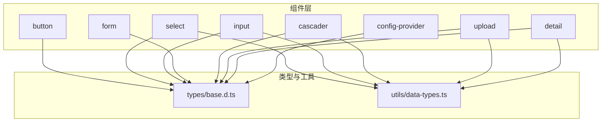
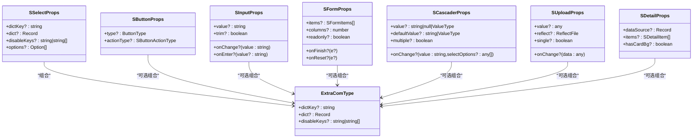
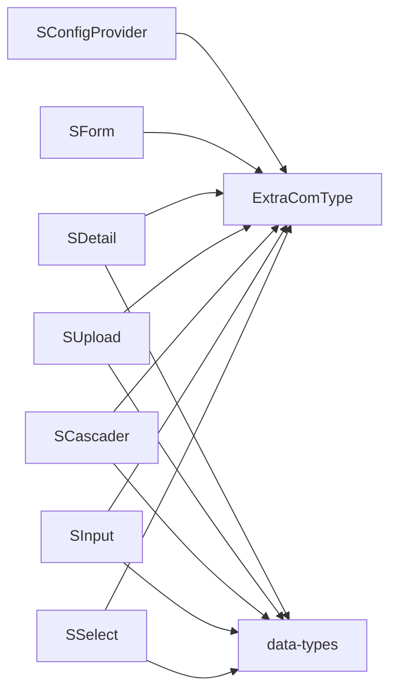

# API 设计规范

<cite>
**本文引用的文件**
- [src/components/button/types.ts](file://src/components/button/types.ts)
- [src/components/select/types.ts](file://src/components/select/types.ts)
- [src/components/input/types.ts](file://src/components/input/types.ts)
- [src/components/form/types.ts](file://src/components/form/types.ts)
- [src/components/cascader/types.ts](file://src/components/cascader/types.ts)
- [src/components/upload/types.ts](file://src/components/upload/types.ts)
- [src/components/detail/types.ts](file://src/components/detail/types.ts)
- [src/components/config-provider/types.ts](file://src/components/config-provider/types.ts)
- [src/components/button/index.tsx](file://src/components/button/index.tsx)
- [src/components/select/index.tsx](file://src/components/select/index.tsx)
- [src/components/input/index.tsx](file://src/components/input/index.tsx)
- [src/components/form/index.tsx](file://src/components/form/index.tsx)
- [src/components/cascader/index.tsx](file://src/components/cascader/index.tsx)
- [src/types/base.d.ts](file://src/types/base.d.ts)
- [src/utils/data-types.ts](file://src/utils/data-types.ts)
</cite>

## 目录

1. [引言](#引言)
2. [项目结构](#项目结构)
3. [核心组件](#核心组件)
4. [架构总览](#架构总览)
5. [详细组件分析](#详细组件分析)
6. [依赖分析](#依赖分析)
7. [性能考虑](#性能考虑)
8. [故障排查指南](#故障排查指南)
9. [结论](#结论)
10. [附录：API 设计示例](#附录api-设计示例)

## 引言

本规范旨在统一 SDesign 组件库的 API 设计风格，明确 props 类型定义、事件回调命名与参数传递、默认值策略、受控/非受控组件设计原则、扩展属性透传、国际化支持等关键要素，并通过真实组件实现给出可复用的最佳实践模式。

## 项目结构

SDesign 采用按功能域分层的组件组织方式：每个组件拥有独立的 types 定义、实现入口与演示目录；公共类型与工具位于统一路径下，便于跨组件复用。

图表来源

- [src/components/button/types.ts](file://src/components/button/types.ts#L1-L72)
- [src/components/select/types.ts](file://src/components/select/types.ts#L1-L9)
- [src/components/input/types.ts](file://src/components/input/types.ts#L1-L9)
- [src/components/form/types.ts](file://src/components/form/types.ts#L1-L155)
- [src/components/cascader/types.ts](file://src/components/cascader/types.ts#L1-L16)
- [src/components/upload/types.ts](file://src/components/upload/types.ts#L1-L66)
- [src/components/detail/types.ts](file://src/components/detail/types.ts#L1-L80)
- [src/components/config-provider/types.ts](file://src/components/config-provider/types.ts#L1-L17)
- [src/types/base.d.ts](file://src/types/base.d.ts#L1-L6)
- [src/utils/data-types.ts](file://src/utils/data-types.ts#L1-L34)

章节来源

- [src/components/button/types.ts](file://src/components/button/types.ts#L1-L72)
- [src/components/select/types.ts](file://src/components/select/types.ts#L1-L9)
- [src/components/input/types.ts](file://src/components/input/types.ts#L1-L9)
- [src/components/form/types.ts](file://src/components/form/types.ts#L1-L155)
- [src/components/cascader/types.ts](file://src/components/cascader/types.ts#L1-L16)
- [src/components/upload/types.ts](file://src/components/upload/types.ts#L1-L66)
- [src/components/detail/types.ts](file://src/components/detail/types.ts#L1-L80)
- [src/components/config-provider/types.ts](file://src/components/config-provider/types.ts#L1-L17)
- [src/types/base.d.ts](file://src/types/base.d.ts#L1-L6)
- [src/utils/data-types.ts](file://src/utils/data-types.ts#L1-L34)

## 核心组件

本节聚焦于组件 API 的关键设计点：类型定义、事件回调、默认值、受控/非受控、扩展透传与国际化支持。

- 类型定义与继承

  - 大多数组件通过 Omit/Partial/HTMLAttributes<ComponentProps> 等组合现有 Ant Design 类型，确保与生态一致且可扩展。
  - 通过 ExtraComType 等通用类型注入字典、禁用键等通用能力，避免重复定义。

- 事件回调命名与参数

  - 以“onXxx”命名，参数遵循“值变更优先”的最小必要原则；如输入框 onChange 接收字符串，回车 onEnter 可选传当前值。
  - 对于复杂场景（如级联），onChange 返回业务友好的值（例如字符串或数组），并在内部完成与底层组件的转换。

- 默认值策略

  - 明确区分 defaultValue 与 value：前者用于非受控初始化，后者用于受控更新。
  - 在组件内部对 value/defaultValue 进行类型归一化处理，保证对外暴露的一致性。

- 受控/非受控

  - 提供 value 与 onChange 即为受控；仅提供 defaultValue 即为非受控。
  - 内部使用受控状态同步 props，避免“悬挂值”。

- 扩展透传

  - 通过 ...props 将通用属性（className、style、aria-\* 等）透传到底层组件，保持外观与行为一致性。

- 国际化支持
  - 通过 ConfigProvider 注入全局前缀与字典，组件内部按需读取。
  - 文案默认值尽量可覆盖，避免硬编码。

章节来源

- [src/components/button/types.ts](file://src/components/button/types.ts#L52-L71)
- [src/components/select/types.ts](file://src/components/select/types.ts#L6-L8)
- [src/components/input/types.ts](file://src/components/input/types.ts#L3-L8)
- [src/components/form/types.ts](file://src/components/form/types.ts#L104-L117)
- [src/components/cascader/types.ts](file://src/components/cascader/types.ts#L6-L15)
- [src/components/upload/types.ts](file://src/components/upload/types.ts#L21-L35)
- [src/components/detail/types.ts](file://src/components/detail/types.ts#L49-L62)
- [src/components/config-provider/types.ts](file://src/components/config-provider/types.ts#L12-L16)
- [src/types/base.d.ts](file://src/types/base.d.ts#L1-L6)

## 架构总览

SDesign 的组件 API 设计遵循“类型安全 + 生态对齐 + 可扩展 + 可维护”的原则。下图展示了组件类型与通用类型的协作关系：

图表来源

- [src/components/button/types.ts](file://src/components/button/types.ts#L52-L71)
- [src/components/select/types.ts](file://src/components/select/types.ts#L6-L8)
- [src/components/input/types.ts](file://src/components/input/types.ts#L3-L8)
- [src/components/form/types.ts](file://src/components/form/types.ts#L104-L117)
- [src/components/cascader/types.ts](file://src/components/cascader/types.ts#L6-L15)
- [src/components/upload/types.ts](file://src/components/upload/types.ts#L21-L35)
- [src/components/detail/types.ts](file://src/components/detail/types.ts#L49-L62)
- [src/types/base.d.ts](file://src/types/base.d.ts#L1-L6)

## 详细组件分析

### 按钮组件（SButton）

- 类型设计
  - 继承 Ant Design ButtonProps，并新增 actionType 字段用于语义化操作类型。
- 事件与默认值
  - 无自定义事件回调，直接透传 Ant Design 行为。
- 受控/非受控
  - 由 Ant Design 内部控制，SButtonProps 仅透传类型。
- 扩展透传
  - 支持 className、style 等通用属性透传。
- 国际化
  - 文案由上层业务决定，组件不内置硬编码文案。

章节来源

- [src/components/button/types.ts](file://src/components/button/types.ts#L52-L71)
- [src/components/button/index.tsx](file://src/components/button/index.tsx#L1-L15)

### 下拉选择（SSelect）

- 类型设计
  - 通过 SSelectProps 组合 Ant Design Select 的类型与 ExtraComType，支持字典、禁用键等通用能力。
- 事件与默认值
  - 默认 allowClear 为 true，placeholder 默认“请选择”，体现易用性。
- 受控/非受控
  - 通过 useGetDict 与 useDispatchDict 获取选项数据，内部不引入额外受控状态。
- 扩展透传
  - 透传 ...props 到底层 Select。
- 国际化
  - 默认占位符文案可被上层覆盖。

章节来源

- [src/components/select/types.ts](file://src/components/select/types.ts#L6-L8)
- [src/components/select/index.tsx](file://src/components/select/index.tsx#L9-L36)

### 输入框（SInput）

- 类型设计
  - 继承 InputProps 并重新定义 onChange/value 参数类型为字符串，增加 trim 与 onEnter。
- 事件与默认值
  - 默认 allowClear 为 true；trim 控制是否自动去空白；onEnter 在按下回车时触发。
- 受控/非受控
  - 内部 useState 同步 value，实现受控行为；defaultValue 场景由父组件传入。
- 扩展透传
  - 透传其他属性到 Input。
- 国际化
  - 无内置文案，依赖外部配置。

章节来源

- [src/components/input/types.ts](file://src/components/input/types.ts#L3-L8)
- [src/components/input/index.tsx](file://src/components/input/index.tsx#L7-L54)

### 表单（SForm）

- 类型设计
  - FormItem 与 SFormProps 组合 Ant Design Form 类型，新增列布局、只读、嵌套表单名等能力。
- 事件与默认值
  - 提供 onFinish/onReset 回调；columns 控制栅格列数；readonly 控制整体只读。
- 受控/非受控
  - 由 Ant Design Form 管理状态，SFormProps 仅透传类型与增强。
- 扩展透传
  - 透传 ...props 到底层 Form。
- 国际化
  - 通过 ConfigProvider 注入全局字典与前缀，提升一致性。

章节来源

- [src/components/form/types.ts](file://src/components/form/types.ts#L104-L117)
- [src/components/form/index.tsx](file://src/components/form/index.tsx#L1-L21)

### 级联选择（SCascader）

- 类型设计
  - 重写 onChange/value/defaultValue/multiple，使对外值更贴近业务使用（字符串或数组）。
- 事件与默认值
  - 默认 allowClear 为 true；内部根据 defaultValue/value 归一化初始值。
- 受控/非受控
  - 内部 useState 管理 cascaderValue，支持多种输入类型（数字、字符串、数组）。
- 扩展透传
  - 透传 ...restProps 到底层 Cascader。
- 国际化
  - 依赖 Ant Design 默认本地化。

章节来源

- [src/components/cascader/types.ts](file://src/components/cascader/types.ts#L6-L15)
- [src/components/cascader/index.tsx](file://src/components/cascader/index.tsx#L11-L76)

### 上传（SUpload）

- 类型设计
  - 重写 onChange，提供更友好的数据结构；支持单文件、限制大小、图标映射等。
- 事件与默认值
  - 默认 single 为 false；limitSizeType 默认为空；acceptList 默认为空数组。
- 受控/非受控
  - 通过 value/onChange 实现受控；内部不引入额外状态。
- 扩展透传
  - 透传 ...props 到底层 Upload。
- 国际化
  - 通过 ConfigProvider 与全局字典统一文案与前缀。

章节来源

- [src/components/upload/types.ts](file://src/components/upload/types.ts#L21-L35)
- [src/components/upload/types.ts](file://src/components/upload/types.ts#L44-L65)

### 详情（SDetail）

- 类型设计
  - 通过 SDetailProps 组合 Ant Design Descriptions 类型，新增字典映射、文件展示、卡片背景等能力。
- 事件与默认值
  - 默认 hasCardBg 为 false；支持 dataSource 与 items 的灵活组合。
- 受控/非受控
  - 无内部状态，完全由外部数据驱动。
- 扩展透传
  - 透传 ...props 到底层 Descriptions。
- 国际化
  - 通过字典与全局配置实现多语言展示。

章节来源

- [src/components/detail/types.ts](file://src/components/detail/types.ts#L49-L62)
- [src/components/detail/types.ts](file://src/components/detail/types.ts#L64-L79)

### 配置提供者（SConfigProvider）

- 类型设计
  - 提供 globalDict、uploadUrl、prefixCls 等全局配置。
- 国际化
  - 提供 getPrefixCls 工具方法，统一组件前缀。

章节来源

- [src/components/config-provider/types.ts](file://src/components/config-provider/types.ts#L3-L16)

## 依赖分析

- 组件间耦合
  - 多数组件通过 ExtraComType 注入通用能力，降低重复定义，提升复用性。
  - 表单相关组件（SForm、SInput、SSelect、SCascader、SUpload 等）围绕 Ant Design 类型进行组合，保持生态一致性。
- 外部依赖
  - 依赖 Ant Design 组件库与 Lodash 工具集，确保类型与工具链稳定。
- 循环依赖
  - 当前结构未见循环导入，类型与实现分离清晰。

图表来源

- [src/components/select/types.ts](file://src/components/select/types.ts#L6-L8)
- [src/components/input/types.ts](file://src/components/input/types.ts#L3-L8)
- [src/components/cascader/types.ts](file://src/components/cascader/types.ts#L6-L15)
- [src/components/upload/types.ts](file://src/components/upload/types.ts#L21-L35)
- [src/components/detail/types.ts](file://src/components/detail/types.ts#L49-L62)
- [src/components/form/types.ts](file://src/components/form/types.ts#L104-L117)
- [src/components/config-provider/types.ts](file://src/components/config-provider/types.ts#L12-L16)
- [src/types/base.d.ts](file://src/types/base.d.ts#L1-L6)
- [src/utils/data-types.ts](file://src/utils/data-types.ts#L1-L34)

章节来源

- [src/components/select/types.ts](file://src/components/select/types.ts#L6-L8)
- [src/components/input/types.ts](file://src/components/input/types.ts#L3-L8)
- [src/components/cascader/types.ts](file://src/components/cascader/types.ts#L6-L15)
- [src/components/upload/types.ts](file://src/components/upload/types.ts#L21-L35)
- [src/components/detail/types.ts](file://src/components/detail/types.ts#L49-L62)
- [src/components/form/types.ts](file://src/components/form/types.ts#L104-L117)
- [src/components/config-provider/types.ts](file://src/components/config-provider/types.ts#L12-L16)
- [src/types/base.d.ts](file://src/types/base.d.ts#L1-L6)
- [src/utils/data-types.ts](file://src/utils/data-types.ts#L1-L34)

## 性能考虑

- 渲染优化
  - 优先使用受控组件，减少内部状态抖动。
  - 对复杂列表/表格类组件，建议通过外部状态管理与分页/虚拟滚动优化。
- 事件处理
  - onChange 等高频事件应避免在回调中执行重计算，必要时使用 useMemo/useCallback。
- 数据转换
  - 在级联/字典等场景，尽量将转换逻辑前置到数据层，避免在渲染阶段重复计算。
- 资源加载
  - 上传组件支持单文件与限制大小，结合懒加载与 CDN 可显著降低首屏压力。

## 故障排查指南

- 常见问题定位
  - 级联值类型不一致：检查 value/defaultValue 的传入类型，确保与 SCascaderProps 的约束一致。
  - 输入框值不同步：确认 SInput 的 value 是否为受控，onChange 是否正确回传。
  - 下拉选项不显示：检查字典注入与禁用键过滤逻辑，确保选项已正确合并。
- 工具辅助
  - 使用 isUndefined/isBoolean/isNumber 等类型判断工具，快速识别异常值。
  - 使用 isPropAbsent 统一处理 null/undefined 场景，避免条件分支遗漏。

章节来源

- [src/components/cascader/types.ts](file://src/components/cascader/types.ts#L6-L15)
- [src/components/input/types.ts](file://src/components/input/types.ts#L3-L8)
- [src/components/select/types.ts](file://src/components/select/types.ts#L6-L8)
- [src/utils/data-types.ts](file://src/utils/data-types.ts#L6-L22)

## 结论

SDesign 的 API 设计以类型安全为核心，通过与 Ant Design 生态对齐、通用类型复用与受控组件原则，实现了高内聚、低耦合的组件体系。遵循本文规范可在保证一致性的同时提升开发效率与可维护性。

## 附录：API 设计示例

以下示例展示高质量组件 API 的设计模式与最佳实践（以路径代替具体代码内容）：

- 受控输入框

  - 类型定义参考：[src/components/input/types.ts](file://src/components/input/types.ts#L3-L8)
  - 实现参考：[src/components/input/index.tsx](file://src/components/input/index.tsx#L7-L54)
  - 关键点：value 与 onChange 成对出现；trim 与 onEnter 提升易用性；默认值与透传属性清晰。

- 下拉选择（带字典）

  - 类型定义参考：[src/components/select/types.ts](file://src/components/select/types.ts#L6-L8)
  - 实现参考：[src/components/select/index.tsx](file://src/components/select/index.tsx#L9-L36)
  - 关键点：ExtraComType 注入字典与禁用键；默认占位符可覆盖；...props 透传。

- 级联选择（对外值友好）

  - 类型定义参考：[src/components/cascader/types.ts](file://src/components/cascader/types.ts#L6-L15)
  - 实现参考：[src/components/cascader/index.tsx](file://src/components/cascader/index.tsx#L11-L76)
  - 关键点：onChange 返回业务值；内部归一化 value/defaultValue；默认 allowClear。

- 表单（栅格与只读）

  - 类型定义参考：[src/components/form/types.ts](file://src/components/form/types.ts#L104-L117)
  - 实现参考：[src/components/form/index.tsx](file://src/components/form/index.tsx#L1-L21)
  - 关键点：columns 控制布局；readonly 控制整体只读；onFinish/onReset 回调。

- 上传（单文件与限制）

  - 类型定义参考：[src/components/upload/types.ts](file://src/components/upload/types.ts#L21-L35)
  - 关键点：onChange 返回统一数据结构；single/limit/limitSizeType 控制行为；reflect 支持回显。

- 详情（字典映射与卡片）

  - 类型定义参考：[src/components/detail/types.ts](file://src/components/detail/types.ts#L49-L62)
  - 关键点：dataSource 与 items 组合；dictKey/dictMap 支持多语言；hasCardBg 控制样式。

- 配置提供者（全局字典与前缀）
  - 类型定义参考：[src/components/config-provider/types.ts](file://src/components/config-provider/types.ts#L12-L16)
  - 关键点：globalDict/uploadUrl/prefixCls；getPrefixCls 统一样式前缀。
