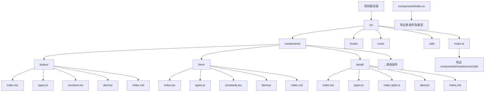
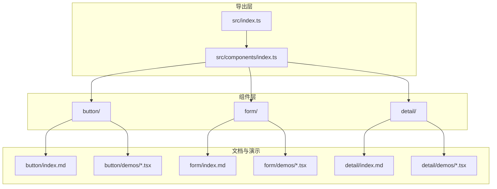
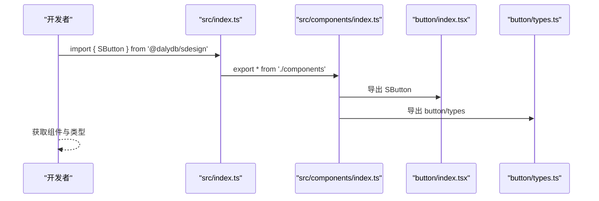
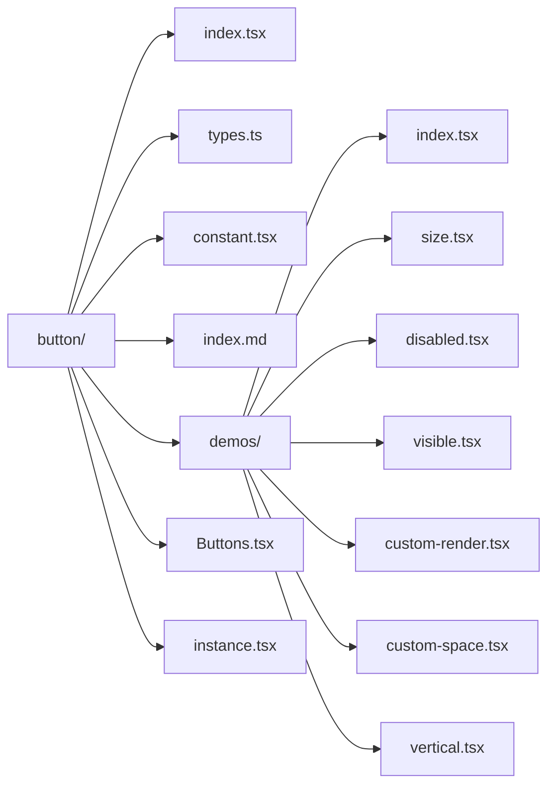
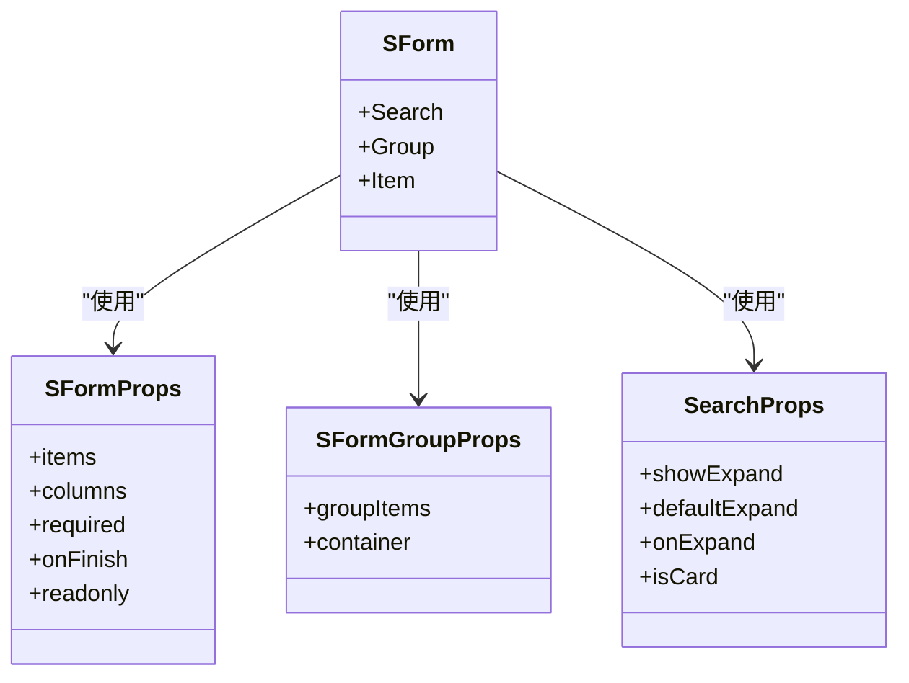
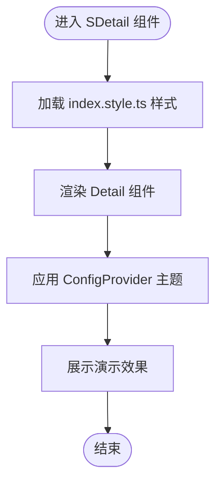
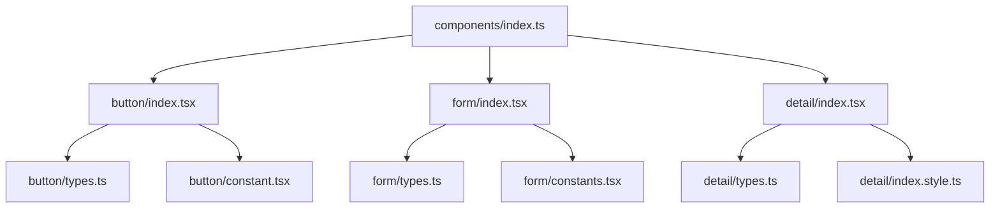

# 文件结构规范

<cite>
**本文引用的文件**
- [package.json](file://package.json)
- [src/index.ts](file://src/index.ts)
- [src/components/index.ts](file://src/components/index.ts)
- [src/components/button/index.tsx](file://src/components/button/index.tsx)
- [src/components/button/types.ts](file://src/components/button/types.ts)
- [src/components/button/constant.tsx](file://src/components/button/constant.tsx)
- [src/components/button/index.md](file://src/components/button/index.md)
- [src/components/button/demos/index.tsx](file://src/components/button/demos/index.tsx)
- [src/components/form/index.tsx](file://src/components/form/index.tsx)
- [src/components/form/types.ts](file://src/components/form/types.ts)
- [src/components/form/constants.tsx](file://src/components/form/constants.tsx)
- [src/components/form/index.md](file://src/components/form/index.md)
- [src/components/form/demos/form.tsx](file://src/components/form/demos/form.tsx)
- [src/components/detail/index.tsx](file://src/components/detail/index.tsx)
- [src/components/detail/types.ts](file://src/components/detail/types.ts)
- [src/components/detail/index.style.ts](file://src/components/detail/index.style.ts)
- [src/components/detail/demos/detail.tsx](file://src/components/detail/demos/detail.tsx)
</cite>

## 目录

1. [简介](#简介)
2. [项目结构](#项目结构)
3. [核心组件](#核心组件)
4. [架构总览](#架构总览)
5. [组件详细分析](#组件详细分析)
6. [依赖关系分析](#依赖关系分析)
7. [性能考量](#性能考量)
8. [故障排查指南](#故障排查指南)
9. [结论](#结论)
10. [附录](#附录)

## 简介

本规范旨在统一 SDesign 组件库的文件组织方式与命名约定，确保每个组件具备清晰的职责边界、一致的导出策略与完善的文档与演示体系。通过对现有组件的结构与导出方式进行系统梳理，形成可复制、可维护、可扩展的文件结构模板，帮助开发者快速创建高质量组件。

## 项目结构

SDesign 采用“按组件分目录”的组织方式，根目录包含组件实现、Hooks、图标、工具与文档等模块；组件层以 src/components 下的子目录为单位，每个组件目录内包含主组件文件、类型定义、常量、演示与文档等文件；顶层统一导出入口负责聚合导出。

**图示来源**

- [src/index.ts](file://src/index.ts#L1-L5)
- [src/components/index.ts](file://src/components/index.ts#L1-L81)
- [src/components/button/index.tsx](file://src/components/button/index.tsx#L1-L15)
- [src/components/form/index.tsx](file://src/components/form/index.tsx#L1-L21)
- [src/components/detail/index.tsx](file://src/components/detail/index.tsx#L1-L19)

**章节来源**

- [src/index.ts](file://src/index.ts#L1-L5)
- [src/components/index.ts](file://src/components/index.ts#L1-L81)

## 核心组件

- 统一导出入口：顶层 index.ts 负责导出 components、hooks、icons、utils 四大模块，便于外部按需或整体引入。
- 组件聚合导出：components/index.ts 将各组件与其类型统一导出，保证类型与实现的一致性与可发现性。
- 包配置：package.json 中 main/module/types 指向构建产物，scripts 定义开发与构建流程，确保发布与本地开发一致性。

**章节来源**

- [src/index.ts](file://src/index.ts#L1-L5)
- [src/components/index.ts](file://src/components/index.ts#L1-L81)
- [package.json](file://package.json#L16-L18)
- [package.json](file://package.json#L26-L46)

## 架构总览

组件导出与文档生成遵循“组件目录内聚、顶层出口开放”的原则。组件内部通过类型与实现分离、演示与文档并行的方式，形成“可复用、可演示、可说明”的闭环。

**图示来源**

- [src/index.ts](file://src/index.ts#L1-L5)
- [src/components/index.ts](file://src/components/index.ts#L1-L81)
- [src/components/button/index.md](file://src/components/button/index.md#L1-L78)
- [src/components/form/index.md](file://src/components/form/index.md#L1-L158)
- [src/components/detail/index.tsx](file://src/components/detail/index.tsx#L1-L19)

## 组件详细分析

### 组件文件命名与职责规范

- 主组件文件：index.tsx，负责组件主体逻辑与子组件挂载（如 Group、Item 等），并通过类型断言与属性合并实现扩展能力。
- 类型定义文件：types.ts，集中声明组件对外暴露的 Props、Item 类型、枚举与映射类型，确保类型安全与可维护性。
- 常量与配置：constant.ts 或 constants.ts，存放组件默认配置、映射表、字典等静态数据，便于复用与替换。
- 演示文件夹：demos/，按功能维度拆分子示例，文件名语义化，配合 index.md 中的 <code src="..."> 引用。
- 文档文件：index.md，采用 dumi 标准文档格式，包含“介绍、基本用法、API、示例”等模块，支持 toc 与 group 分类。
- 样式文件：index.style.ts（若需要），使用 antd-style 的 createStyles 进行主题化样式管理。

**章节来源**

- [src/components/button/index.tsx](file://src/components/button/index.tsx#L1-L15)
- [src/components/button/types.ts](file://src/components/button/types.ts#L1-L72)
- [src/components/button/constant.tsx](file://src/components/button/constant.tsx#L1-L131)
- [src/components/button/index.md](file://src/components/button/index.md#L1-L78)
- [src/components/form/index.tsx](file://src/components/form/index.tsx#L1-L21)
- [src/components/form/types.ts](file://src/components/form/types.ts#L1-L155)
- [src/components/form/constants.tsx](file://src/components/form/constants.tsx#L1-L58)
- [src/components/form/index.md](file://src/components/form/index.md#L1-L158)
- [src/components/detail/index.tsx](file://src/components/detail/index.tsx#L1-L19)
- [src/components/detail/types.ts](file://src/components/detail/types.ts#L1-L80)
- [src/components/detail/index.style.ts](file://src/components/detail/index.style.ts#L1-L13)

### 演示文件组织与分类

- 基础示例：覆盖组件最常用的能力与默认行为，文件名如 basic.tsx、index.tsx。
- 高级示例：展示复杂配置、联动逻辑、主题定制等，文件名如 form.tsx、detail.tsx。
- 交互示例：强调用户交互反馈与状态变化，文件名如 loading.tsx、disabled.tsx、custom-render.tsx。
- 示例标题与描述：使用注释块为每个演示文件添加 title 与 description，便于文档生成与检索。

**章节来源**

- [src/components/button/demos/index.tsx](file://src/components/button/demos/index.tsx#L1-L63)
- [src/components/form/demos/form.tsx](file://src/components/form/demos/form.tsx#L1-L94)
- [src/components/detail/demos/detail.tsx](file://src/components/detail/demos/detail.tsx#L1-L165)

### 文档文件编写规范

- 头部元信息：使用 YAML 头部声明 toc 与 group，group.title 用于分类，group.order 用于排序。
- 结构化内容：包含“介绍、基本用法、不同尺寸/布局、全局禁用/加载、自定义渲染、API”等模块。
- 代码块引用：<code src="..."> 指向对应 demos 子文件，确保文档与示例同步。
- API 表格：使用表格形式列出属性名、描述、类型与默认值，必要时补充链接指向底层组件文档。

**章节来源**

- [src/components/button/index.md](file://src/components/button/index.md#L1-L78)
- [src/components/form/index.md](file://src/components/form/index.md#L1-L158)

### 组件导出规范

- 组件聚合导出：components/index.ts 对外导出各组件与类型，保证使用者可通过单一入口访问组件与类型。
- 类型导出：对 types.ts 的类型进行重新导出，避免使用者直接引用内部路径。
- 顶层统一导出：src/index.ts 将 components、hooks、icons、utils 整体导出，简化外部依赖路径。

**图示来源**

- [src/index.ts](file://src/index.ts#L1-L5)
- [src/components/index.ts](file://src/components/index.ts#L1-L81)
- [src/components/button/index.tsx](file://src/components/button/index.tsx#L1-L15)
- [src/components/button/types.ts](file://src/components/button/types.ts#L1-L72)

**章节来源**

- [src/index.ts](file://src/index.ts#L1-L5)
- [src/components/index.ts](file://src/components/index.ts#L1-L81)

### 组件目录结构示例（以 button 为例）

- button/
  - index.tsx：组件主体与 Group 子组件挂载
  - types.ts：组件 Props、Item 类型与枚举
  - constant.tsx：默认配置与图标映射
  - index.md：组件文档
  - demos/
    - index.tsx：基础使用
    - size.tsx：不同尺寸
    - disabled.tsx：全局禁用
    - visible.tsx：可见性控制
    - custom-render.tsx：自定义渲染
    - custom-space.tsx：自定义间距
    - vertical.tsx：垂直排列
  - Buttons.tsx：按钮组实现
  - instance.tsx：实例化组件
  - styles/：样式文件（如存在）

**图示来源**

- [src/components/button/index.tsx](file://src/components/button/index.tsx#L1-L15)
- [src/components/button/types.ts](file://src/components/button/types.ts#L1-L72)
- [src/components/button/constant.tsx](file://src/components/button/constant.tsx#L1-L131)
- [src/components/button/index.md](file://src/components/button/index.md#L1-L78)
- [src/components/button/demos/index.tsx](file://src/components/button/demos/index.tsx#L1-L63)

**章节来源**

- [src/components/button/index.tsx](file://src/components/button/index.tsx#L1-L15)
- [src/components/button/types.ts](file://src/components/button/types.ts#L1-L72)
- [src/components/button/constant.tsx](file://src/components/button/constant.tsx#L1-L131)
- [src/components/button/index.md](file://src/components/button/index.md#L1-L78)
- [src/components/button/demos/index.tsx](file://src/components/button/demos/index.tsx#L1-L63)

### 组件类型与实现关系（以 form 为例）

- index.tsx：将实例组件与子组件（Group、Item、Search）挂载到统一导出对象上，形成“命名空间式”导出。
- types.ts：集中定义 Form、Group、Search 相关 Props 与映射类型，确保类型与实现解耦。
- constants.tsx：定义表单项组件映射表，便于运行时根据 type 动态渲染。

**图示来源**

- [src/components/form/index.tsx](file://src/components/form/index.tsx#L1-L21)
- [src/components/form/types.ts](file://src/components/form/types.ts#L104-L155)
- [src/components/form/constants.tsx](file://src/components/form/constants.tsx#L30-L57)

**章节来源**

- [src/components/form/index.tsx](file://src/components/form/index.tsx#L1-L21)
- [src/components/form/types.ts](file://src/components/form/types.ts#L1-L155)
- [src/components/form/constants.tsx](file://src/components/form/constants.tsx#L1-L58)

### 组件样式与主题化（以 detail 为例）

- index.tsx：导出实例组件，并挂载 Group 与 Item 子组件。
- types.ts：定义 Detail、Group、Item 相关 Props 与类型。
- index.style.ts：使用 antd-style 的 createStyles 进行主题化样式管理，提升可定制性。
- demos：通过 ConfigProvider 等方式演示主题切换与样式效果。

**图示来源**

- [src/components/detail/index.tsx](file://src/components/detail/index.tsx#L1-L19)
- [src/components/detail/types.ts](file://src/components/detail/types.ts#L1-L80)
- [src/components/detail/index.style.ts](file://src/components/detail/index.style.ts#L1-L13)
- [src/components/detail/demos/detail.tsx](file://src/components/detail/demos/detail.tsx#L1-L165)

**章节来源**

- [src/components/detail/index.tsx](file://src/components/detail/index.tsx#L1-L19)
- [src/components/detail/types.ts](file://src/components/detail/types.ts#L1-L80)
- [src/components/detail/index.style.ts](file://src/components/detail/index.style.ts#L1-L13)
- [src/components/detail/demos/detail.tsx](file://src/components/detail/demos/detail.tsx#L1-L165)

## 依赖关系分析

- 组件间依赖：组件内部通过 types.ts 与 constants.tsx 定义的类型与映射降低耦合；子组件（如 Group、Item、Search）通过 index.tsx 挂载到统一命名空间。
- 导出链路：components/index.ts 聚合导出组件与类型，src/index.ts 再统一导出四大模块，形成清晰的依赖与使用路径。
- 外部依赖：package.json 中声明 peerDependencies 与 dependencies，确保运行时环境满足要求。

**图示来源**

- [src/components/index.ts](file://src/components/index.ts#L1-L81)
- [src/components/button/index.tsx](file://src/components/button/index.tsx#L1-L15)
- [src/components/form/index.tsx](file://src/components/form/index.tsx#L1-L21)
- [src/components/detail/index.tsx](file://src/components/detail/index.tsx#L1-L19)

**章节来源**

- [src/components/index.ts](file://src/components/index.ts#L1-L81)
- [package.json](file://package.json#L93-L101)

## 性能考量

- 按需导出：通过统一导出入口减少重复导入，避免全量引入导致的包体增大。
- 类型与实现分离：将类型定义独立于实现，有助于 TypeScript 编译器进行更精确的类型检查与优化。
- 样式主题化：使用 antd-style 的 createStyles 在运行时注入样式，避免全局污染并支持主题切换。
- 演示与文档解耦：demos 仅用于展示，不参与生产构建，减少打包体积。

## 故障排查指南

- 导出缺失：若外部无法找到某组件类型，请检查 components/index.ts 是否正确 re-export 对应 types。
- 类型不匹配：若 props 报错，请核对 types.ts 中的接口定义与实际使用是否一致。
- 文档示例不显示：确认 index.md 中 <code src="..."> 的路径与 demos 子文件是否存在且命名正确。
- 样式异常：检查 index.style.ts 是否正确加载，以及 antd-style 版本与主题配置是否兼容。

**章节来源**

- [src/components/index.ts](file://src/components/index.ts#L1-L81)
- [src/components/button/types.ts](file://src/components/button/types.ts#L1-L72)
- [src/components/button/index.md](file://src/components/button/index.md#L1-L78)
- [src/components/detail/index.style.ts](file://src/components/detail/index.style.ts#L1-L13)

## 结论

通过统一的文件结构与导出规范，SDesign 组件库实现了“高内聚、低耦合、易维护、可扩展”的目标。建议在新增组件时严格遵循本文档的命名、组织与导出约定，确保团队协作效率与用户体验一致。

## 附录

- 命名与职责速查
  - index.tsx：组件主体与子组件挂载
  - types.ts：对外类型定义
  - constant.ts / constants.ts：默认配置与映射
  - index.md：组件文档
  - demos/：演示示例
  - index.style.ts：主题化样式（可选）
- 导出路径建议
  - 顶层导出：src/index.ts
  - 组件导出：src/components/index.ts
  - 类型导出：各组件 types.ts
