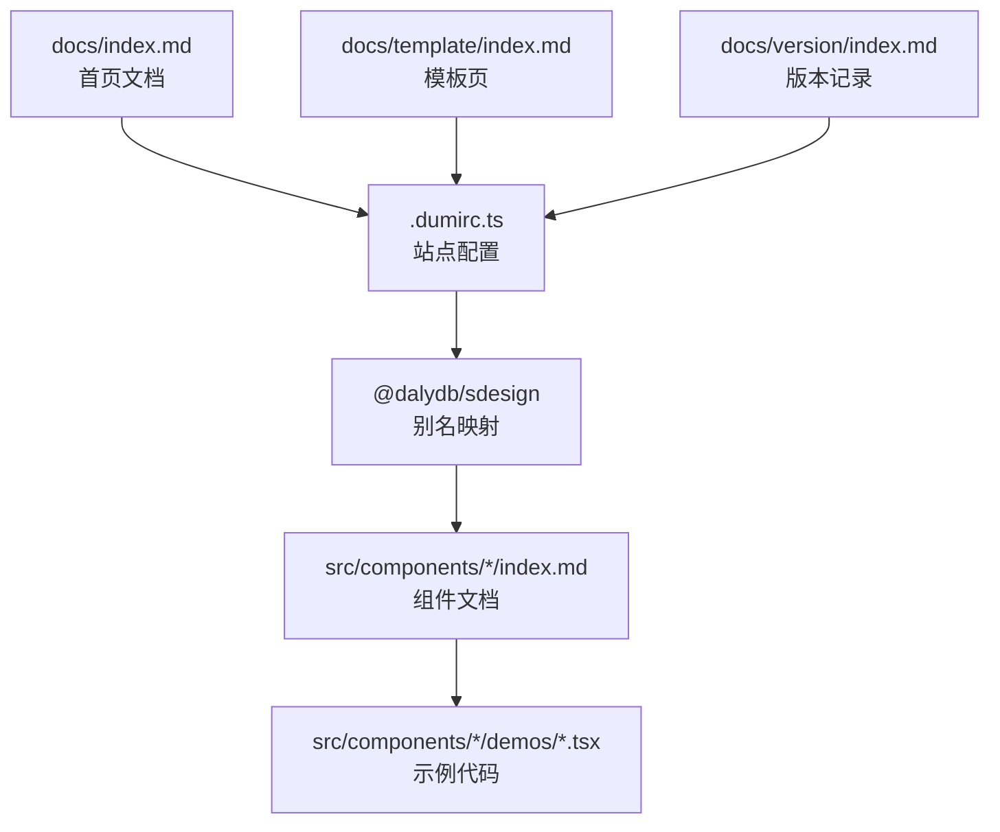
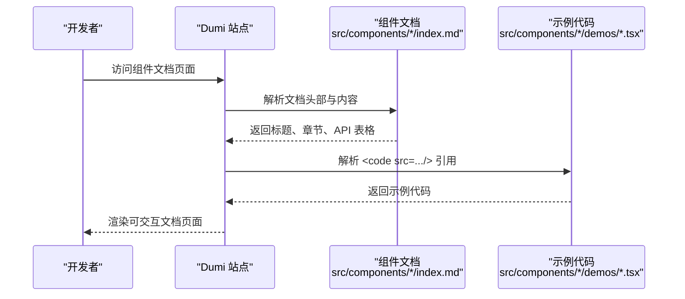
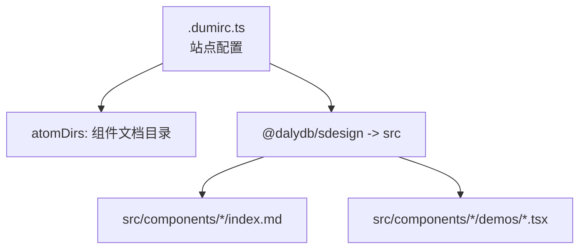

# 文档编写规范

<cite>
**本文引用的文件**
- [README.md](file://README.md)
- [.dumirc.ts](file://.dumirc.ts)
- [docs/index.md](file://docs/index.md)
- [docs/template/index.md](file://docs/template/index.md)
- [docs/version/index.md](file://docs/version/index.md)
- [src/components/button/index.md](file://src/components/button/index.md)
- [src/components/form/index.md](file://src/components/form/index.md)
- [src/components/card/index.md](file://src/components/card/index.md)
- [src/components/detail/index.md](file://src/components/detail/index.md)
- [src/components/upload/index.md](file://src/components/upload/index.md)
- [src/components/select/index.md](file://src/components/select/index.md)
- [src/components/cascader/index.md](file://src/components/cascader/index.md)
- [src/components/button/demos/basic.tsx](file://src/components/button/demos/basic.tsx)
- [src/components/form/demos/form.tsx](file://src/components/form/demos/form.tsx)
- [src/components/upload/demos/index.tsx](file://src/components/upload/demos/index.tsx)
</cite>

## 目录

1. [引言](#引言)
2. [项目结构](#项目结构)
3. [核心组件](#核心组件)
4. [架构总览](#架构总览)
5. [详细组件分析](#详细组件分析)
6. [依赖分析](#依赖分析)
7. [性能考虑](#性能考虑)
8. [故障排查指南](#故障排查指南)
9. [结论](#结论)
10. [附录](#附录)

## 引言

本规范旨在统一 SDesign 组件库的文档编写风格，确保文档在结构、格式、示例组织与 API 表达上保持一致，便于开发者快速理解与使用组件。本文结合仓库中的现有文档与示例，总结出一套可落地的编写标准，并提供模板与最佳实践，帮助团队高效产出高质量组件文档。

## 项目结构

SDesign 的文档由 dumi 驱动生成，组件文档位于 src/components/<组件名>/index.md，示例代码位于 src/components/<组件名>/demos 下。站点入口与别名在 .dumirc.ts 中配置，首页文档位于 docs/index.md，模板与版本记录分别位于 docs/template 与 docs/version。

**图示来源**

- [.dumirc.ts](file://.dumirc.ts#L1-L22)
- [docs/index.md](file://docs/index.md#L1-L9)
- [docs/template/index.md](file://docs/template/index.md#L1-L8)
- [docs/version/index.md](file://docs/version/index.md#L1-L96)

**章节来源**

- [.dumirc.ts](file://.dumirc.ts#L1-L22)
- [docs/index.md](file://docs/index.md#L1-L9)
- [docs/template/index.md](file://docs/template/index.md#L1-L8)
- [docs/version/index.md](file://docs/version/index.md#L1-L96)

## 核心组件

本节从文档规范角度，提炼组件文档应包含的关键要素与呈现方式，结合现有组件文档进行说明。

- 文档头部元信息
  - toc: content 控制目录生成
  - group: title/order 定义分组与排序
  - 示例：参见 [src/components/button/index.md](file://src/components/button/index.md#L1-L6)
- 标题层级
  - 主标题：# 组件名
  - 章节：## 介绍、## 基本用法、## API 等
  - 子章节：### SButton.Group、### SDetailItem 等
  - 示例：参见 [src/components/button/index.md](file://src/components/button/index.md#L8-L78)
- 段落与说明
  - 使用简洁明了的语言描述组件能力与使用场景
  - 示例：参见 [src/components/button/index.md](file://src/components/button/index.md#L10-L16)
- 代码块与演示
  - 使用 <code src="..."/> 嵌入示例代码
  - 示例：参见 [src/components/button/index.md](file://src/components/button/index.md#L16-L62)
- API 表格
  - 属性名、描述、类型、默认值四列
  - 示例：参见 [src/components/button/index.md](file://src/components/button/index.md#L64-L78)

**章节来源**

- [src/components/button/index.md](file://src/components/button/index.md#L1-L78)

## 架构总览

下图展示了文档生成与示例运行的整体流程：dumi 读取组件文档与示例，解析并渲染为可交互的文档页面。

**图示来源**

- [.dumirc.ts](file://.dumirc.ts#L9-L12)
- [src/components/button/index.md](file://src/components/button/index.md#L16-L62)

## 详细组件分析

### 文档结构与示例组织规范

- 文档头部
  - 必填：toc: content
  - 可选：group.title、group.order
  - 示例：参见 [src/components/button/index.md](file://src/components/button/index.md#L1-L6)
- 标题层级
  - # 组件名
  - ## 介绍
  - ## 基本用法/不同尺寸/全局禁用与 loading/自定义按钮显示/自定义渲染/自定义间距/垂直排列
  - ## API
  - ## SButton.Group（子组件 API）
- 段落与说明
  - 使用简短语句说明组件用途与注意事项
  - 示例：参见 [src/components/button/index.md](file://src/components/button/index.md#L10-L16)
- 示例代码组织
  - 基础示例：<code src="./demos/basic.tsx"/>
  - 高级示例：<code src="./demos/disabled.tsx"/><code src="./demos/visible.tsx"/>
  - 子组件示例：<code src="./demos/buttonGroupIndex.tsx"/>
  - 示例文件命名建议：basic.tsx、size.tsx、disabled.tsx、custom-render.tsx、custom-space.tsx、vertical.tsx、visible.tsx
  - 示例文件路径：src/components/<组件>/demos/<示例名>.tsx
  - 示例文件导出：默认导出 React 组件
  - 示例文件注释：title、description（用于文档侧边栏与标题）
  - 示例：参见 [src/components/button/demos/basic.tsx](file://src/components/button/demos/basic.tsx#L1-L29)

**章节来源**

- [src/components/button/index.md](file://src/components/button/index.md#L1-L78)
- [src/components/button/demos/basic.tsx](file://src/components/button/demos/basic.tsx#L1-L29)

### API 表格编写规范

- 表头：属性名、描述、类型、默认值
- 类型表达
  - 基础类型：boolean、number、string
  - 联合类型：'large' | 'middle' | 'small'
  - 复杂类型：对象、数组、ReactNode、函数签名
  - 外链：通过链接指向 antd 或内部组件文档
- 默认值
  - 明确列出默认值；未设置时留空
- 示例：参见 [src/components/button/index.md](file://src/components/button/index.md#L64-L78)

**章节来源**

- [src/components/button/index.md](file://src/components/button/index.md#L64-L78)

### 交互演示实现方法

- 在文档中嵌入示例
  - 使用 <code src="..."/> 引用 demos 目录下的示例文件
  - 示例：参见 [src/components/button/index.md](file://src/components/button/index.md#L16-L62)
- 示例文件要求
  - 导出默认组件
  - 注释包含 title 与 description
  - 示例：参见 [src/components/form/demos/form.tsx](file://src/components/form/demos/form.tsx#L1-L94)

**章节来源**

- [src/components/button/index.md](file://src/components/button/index.md#L16-L62)
- [src/components/form/demos/form.tsx](file://src/components/form/demos/form.tsx#L1-L94)

### 版本更新记录编写规范

- 格式
  - 标题：# 版本更新记录
  - 版本条目：## x.x.x (YYYY-MM-DD)
  - 分类：
    - 🌟 新特性
    - 🔧 优化
    - 🐛 修复
    - 📚 文档
    - 🗑️ 移除
- 示例：参见 [docs/version/index.md](file://docs/version/index.md#L1-L96)

**章节来源**

- [docs/version/index.md](file://docs/version/index.md#L1-L96)

### 多语言文档支持策略

- 现状
  - 组件文档采用中文命名与内容（如 index.md、demos/\*.tsx）
- 建议
  - 保持中文文档为主，英文文档作为补充
  - 通过目录区分：docs/en-US 与 docs/zh-CN
  - 统一命名规范：index.md、组件名/index.md
  - 保持示例与 API 说明同步更新
- 说明：本仓库未提供英文文档目录，建议按上述策略逐步完善

**章节来源**

- [src/components/button/index.md](file://src/components/button/index.md#L1-L78)

### 完整文档示例与最佳实践

- 模板页
  - 文档头部关闭目录生成：toc: false
  - 可开启 defaultImport：apiHeader.defaultImport: true/false
  - 示例：参见 [docs/template/index.md](file://docs/template/index.md#L1-L8)
- 首页文档
  - hero.title、hero.description、actions.link
  - 示例：参见 [docs/index.md](file://docs/index.md#L1-L9)
- 组件文档示例
  - 按“介绍—基础示例—高级示例—API”顺序组织
  - 示例：参见 [src/components/form/index.md](file://src/components/form/index.md#L1-L158)
- 上传组件示例
  - 使用 SConfigProvider 全局配置 uploadUrl
  - 示例：参见 [src/components/upload/demos/index.tsx](file://src/components/upload/demos/index.tsx#L1-L40)

**章节来源**

- [docs/template/index.md](file://docs/template/index.md#L1-L8)
- [docs/index.md](file://docs/index.md#L1-L9)
- [src/components/form/index.md](file://src/components/form/index.md#L1-L158)
- [src/components/upload/demos/index.tsx](file://src/components/upload/demos/index.tsx#L1-L40)

## 依赖分析

- 文档生成依赖
  - dumi：站点构建与文档解析
  - 组件文档：src/components/\*/index.md
  - 示例代码：src/components/_/demos/_.tsx
- 站点配置
  - atomDirs：组件文档目录
  - alias：@dalydb/sdesign 指向 src
- 示例：参见 [.dumirc.ts](file://.dumirc.ts#L5-L21)

**图示来源**

- [.dumirc.ts](file://.dumirc.ts#L5-L21)

**章节来源**

- [.dumirc.ts](file://.dumirc.ts#L5-L21)

## 性能考虑

- 文档加载
  - 控制示例数量与复杂度，避免一次性渲染过多重型示例
- 代码块
  - 使用 <code src="..."/> 引用外部示例，减少文档体积
- 构建优化
  - 合理拆分组件文档，按需加载

## 故障排查指南

- 示例无法渲染
  - 检查 <code src="..."/> 路径是否正确
  - 确认示例文件导出默认组件且包含 title/description 注释
  - 示例：参见 [src/components/form/demos/form.tsx](file://src/components/form/demos/form.tsx#L1-L94)
- 文档头部配置错误
  - 确保 toc: content 与 group.title/order 正确
  - 示例：参见 [src/components/button/index.md](file://src/components/button/index.md#L1-L6)
- 站点无法访问
  - 检查 .dumirc.ts 中 base、publicPath、alias 配置
  - 示例：参见 [.dumirc.ts](file://.dumirc.ts#L5-L21)

**章节来源**

- [src/components/form/demos/form.tsx](file://src/components/form/demos/form.tsx#L1-L94)
- [src/components/button/index.md](file://src/components/button/index.md#L1-L6)
- [.dumirc.ts](file://.dumirc.ts#L5-L21)

## 结论

通过统一的文档结构、示例组织与 API 表达规范，SDesign 组件库能够为使用者提供清晰、一致、易用的文档体验。建议团队在新增或修订组件文档时，严格遵循本文档规范，并结合示例模板与最佳实践，持续提升文档质量与维护效率。

## 附录

- 快速检查清单
  - 文档头部：toc: content、group.title、group.order
  - 标题层级：# 组件名 → ## 介绍 → ## 基本用法 → ## API
  - 示例：使用 <code src="..."/> 引用 demos/\*.tsx
  - API 表格：属性名、描述、类型、默认值四列
  - 版本记录：按分类与日期格式书写
  - 多语言：中文为主，英文为辅，目录分离
