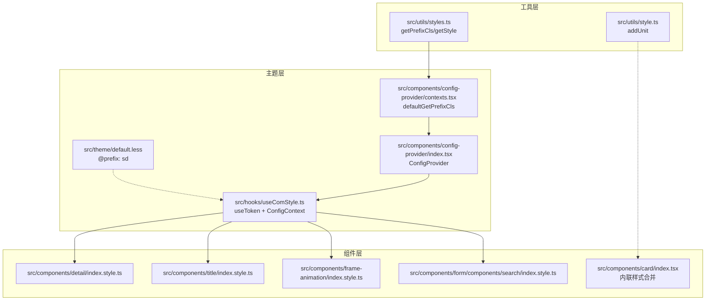
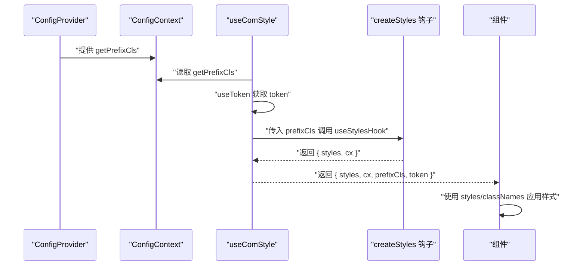
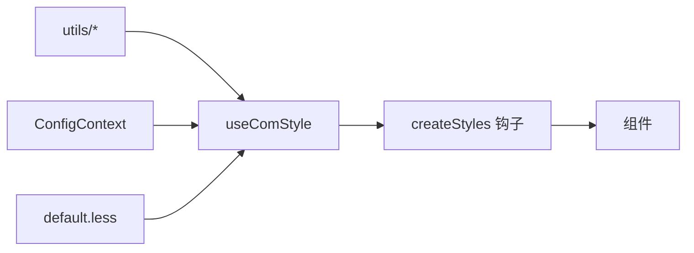

# 样式编写规范

<cite>
**本文档引用的文件**
- [src/utils/style.ts](file://src/utils/style.ts)
- [src/utils/styles.ts](file://src/utils/styles.ts)
- [src/hooks/useComStyle.ts](file://src/hooks/useComStyle.ts)
- [src/components/config-provider/contexts.tsx](file://src/components/config-provider/contexts.tsx)
- [src/components/config-provider/index.tsx](file://src/components/config-provider/index.tsx)
- [src/theme/default.less](file://src/theme/default.less)
- [src/components/detail/index.style.ts](file://src/components/detail/index.style.ts)
- [src/components/title/index.style.ts](file://src/components/title/index.style.ts)
- [src/components/frame-animation/index.style.ts](file://src/components/frame-animation/index.style.ts)
- [src/components/form/components/search/index.style.ts](file://src/components/form/components/search/index.style.ts)
- [src/components/card/index.tsx](file://src/components/card/index.tsx)
</cite>

## 目录

1. [引言](#引言)
2. [项目结构](#项目结构)
3. [核心组件](#核心组件)
4. [架构总览](#架构总览)
5. [详细组件分析](#详细组件分析)
6. [依赖关系分析](#依赖关系分析)
7. [性能考量](#性能考量)
8. [故障排查指南](#故障排查指南)
9. [结论](#结论)
10. [附录](#附录)

## 引言

本规范旨在统一 SDesign 组件库的样式编写方式，确保样式具备良好的可维护性、可扩展性和一致性。内容涵盖 CSS-in-JS 使用规范、主题变量与 token 系统的引用方式、响应式与移动端适配策略、样式模块化与冲突规避、动画与过渡效果的实现与性能优化、可访问性样式设计（焦点、对比度、视觉反馈），并提供基于仓库现有实现的示例路径与最佳实践。

## 项目结构

SDesign 的样式体系以“CSS-in-JS + 主题系统 + 前缀命名空间”为核心，结合工具函数与上下文提供一致的样式注入与命名规范。整体结构如下：

- 工具层：提供样式前缀生成、单位处理、单属性样式构造等通用能力
- 主题层：通过 antd-style 的 createStyles 与 ConfigProvider 的 prefixCls 注入，形成统一的样式作用域
- 组件层：每个组件独立的样式文件（index.style.ts）与组件主体（index.tsx）配合使用
- 主题变量：默认 less 前缀与 token 系统协同工作

图表来源

- [src/utils/styles.ts](file://src/utils/styles.ts#L1-L27)
- [src/utils/style.ts](file://src/utils/style.ts#L1-L22)
- [src/hooks/useComStyle.ts](file://src/hooks/useComStyle.ts#L1-L29)
- [src/components/config-provider/contexts.tsx](file://src/components/config-provider/contexts.tsx#L1-L20)
- [src/components/config-provider/index.tsx](file://src/components/config-provider/index.tsx#L1-L47)
- [src/theme/default.less](file://src/theme/default.less#L1-L2)
- [src/components/detail/index.style.ts](file://src/components/detail/index.style.ts#L1-L13)
- [src/components/title/index.style.ts](file://src/components/title/index.style.ts#L1-L37)
- [src/components/frame-animation/index.style.ts](file://src/components/frame-animation/index.style.ts#L1-L14)
- [src/components/form/components/search/index.style.ts](file://src/components/form/components/search/index.style.ts#L1-L13)
- [src/components/card/index.tsx](file://src/components/card/index.tsx#L1-L35)

章节来源

- [src/utils/styles.ts](file://src/utils/styles.ts#L1-L27)
- [src/utils/style.ts](file://src/utils/style.ts#L1-L22)
- [src/hooks/useComStyle.ts](file://src/hooks/useComStyle.ts#L1-L29)
- [src/components/config-provider/contexts.tsx](file://src/components/config-provider/contexts.tsx#L1-L20)
- [src/components/config-provider/index.tsx](file://src/components/config-provider/index.tsx#L1-L47)
- [src/theme/default.less](file://src/theme/default.less#L1-L2)
- [src/components/detail/index.style.ts](file://src/components/detail/index.style.ts#L1-L13)
- [src/components/title/index.style.ts](file://src/components/title/index.style.ts#L1-L37)
- [src/components/frame-animation/index.style.ts](file://src/components/frame-animation/index.style.ts#L1-L14)
- [src/components/form/components/search/index.style.ts](file://src/components/form/components/search/index.style.ts#L1-L13)
- [src/components/card/index.tsx](file://src/components/card/index.tsx#L1-L35)

## 核心组件

- 样式前缀与单属性样式
  - getPrefixCls：为组件生成统一前缀，避免类名冲突
  - getStyle：按需返回单个 CSS 属性键值对，便于条件样式拼装
- 单位处理
  - addUnit：自动为数值型尺寸添加默认单位，支持字符串原样返回或警告
- 主题与上下文
  - useComStyle：封装 antd 的 useToken 与 ConfigProvider 的 getPrefixCls，输出带前缀的样式、类名组合器与 token
  - ConfigProvider：提供全局前缀与上下文，供 useComStyle 注入
- 默认主题变量
  - default.less：定义 CSS 变量前缀，作为主题系统的基础

章节来源

- [src/utils/styles.ts](file://src/utils/styles.ts#L1-L27)
- [src/utils/style.ts](file://src/utils/style.ts#L1-L22)
- [src/hooks/useComStyle.ts](file://src/hooks/useComStyle.ts#L1-L29)
- [src/components/config-provider/contexts.tsx](file://src/components/config-provider/contexts.tsx#L1-L20)
- [src/components/config-provider/index.tsx](file://src/components/config-provider/index.tsx#L1-L47)
- [src/theme/default.less](file://src/theme/default.less#L1-L2)

## 架构总览

下图展示了从上下文到样式钩子再到组件的调用链路，体现 CSS-in-JS 的注入流程与命名空间管理。

图表来源

- [src/components/config-provider/index.tsx](file://src/components/config-provider/index.tsx#L1-L47)
- [src/components/config-provider/contexts.tsx](file://src/components/config-provider/contexts.tsx#L1-L20)
- [src/hooks/useComStyle.ts](file://src/hooks/useComStyle.ts#L1-L29)

章节来源

- [src/components/config-provider/index.tsx](file://src/components/config-provider/index.tsx#L1-L47)
- [src/components/config-provider/contexts.tsx](file://src/components/config-provider/contexts.tsx#L1-L20)
- [src/hooks/useComStyle.ts](file://src/hooks/useComStyle.ts#L1-L29)

## 详细组件分析

### 样式对象组织与动态样式实现

- 组织结构
  - 每个组件在同级目录下提供 index.style.ts，导出由 createStyles 包裹的 useStyles 钩子，内部通过 prefixCls 限定作用域
  - 组件主体通过 useComStyle 获取 styles 与 cx，并结合 props 动态应用
- 动态样式
  - 通过 getStyle 返回单属性对象，按条件拼装，实现 hover/focus/disabled 等状态的差异化
  - 通过 token 提供尺寸、颜色、字号等动态值，避免硬编码

示例路径

- [src/components/detail/index.style.ts](file://src/components/detail/index.style.ts#L1-L13)
- [src/components/title/index.style.ts](file://src/components/title/index.style.ts#L1-L37)
- [src/components/frame-animation/index.style.ts](file://src/components/frame-animation/index.style.ts#L1-L14)
- [src/components/form/components/search/index.style.ts](file://src/components/form/components/search/index.style.ts#L1-L13)
- [src/utils/styles.ts](file://src/utils/styles.ts#L1-L27)

章节来源

- [src/components/detail/index.style.ts](file://src/components/detail/index.style.ts#L1-L13)
- [src/components/title/index.style.ts](file://src/components/title/index.style.ts#L1-L37)
- [src/components/frame-animation/index.style.ts](file://src/components/frame-animation/index.style.ts#L1-L14)
- [src/components/form/components/search/index.style.ts](file://src/components/form/components/search/index.style.ts#L1-L13)
- [src/utils/styles.ts](file://src/utils/styles.ts#L1-L27)

### 主题变量引用规范

- token 系统
  - 使用 useToken 获取 token，按需读取尺寸、颜色、字体等变量，保证主题一致性
- 自定义主题变量
  - default.less 定义 CSS 变量前缀，建议在 less 文件中集中声明变量并通过主题系统暴露给 JS
- 命名空间
  - 通过 ConfigContext 的 getPrefixCls 与 useComStyle 统一注入 prefixCls，避免类名冲突

示例路径

- [src/hooks/useComStyle.ts](file://src/hooks/useComStyle.ts#L1-L29)
- [src/components/config-provider/contexts.tsx](file://src/components/config-provider/contexts.tsx#L1-L20)
- [src/theme/default.less](file://src/theme/default.less#L1-L2)

章节来源

- [src/hooks/useComStyle.ts](file://src/hooks/useComStyle.ts#L1-L29)
- [src/components/config-provider/contexts.tsx](file://src/components/config-provider/contexts.tsx#L1-L20)
- [src/theme/default.less](file://src/theme/default.less#L1-L2)

### 响应式设计与移动端适配

- 断点与媒体查询
  - 在 index.style.ts 中使用 createStyles 的返回对象直接书写媒体查询规则，保持样式与组件耦合度低
- 移动端适配策略
  - 建议优先使用相对单位（如 rem/em/%）与 flex/grid 布局，减少固定像素带来的适配成本
  - 对于交互细节，可通过 token 的字号与间距变量统一调整

示例路径

- [src/components/title/index.style.ts](file://src/components/title/index.style.ts#L1-L37)

章节来源

- [src/components/title/index.style.ts](file://src/components/title/index.style.ts#L1-L37)

### 样式模块化与冲突规避

- 模块化
  - 每个组件独立的 index.style.ts，职责单一，便于维护与复用
- 冲突规避
  - 统一使用 getPrefixCls 与 useComStyle 注入前缀，确保类名唯一
  - 通过 getStyle 条件拼装，避免重复覆盖

示例路径

- [src/utils/styles.ts](file://src/utils/styles.ts#L1-L27)
- [src/hooks/useComStyle.ts](file://src/hooks/useComStyle.ts#L1-L29)

章节来源

- [src/utils/styles.ts](file://src/utils/styles.ts#L1-L27)
- [src/hooks/useComStyle.ts](file://src/hooks/useComStyle.ts#L1-L29)

### 动画与过渡效果实现

- 实现方式
  - 在 index.style.ts 中定义动画与过渡属性，结合组件状态切换触发
- 性能优化
  - 优先使用 transform 与 opacity，避免频繁触发布局与重绘
  - 控制动画时长与缓动曲线，减少主线程压力
- 浏览器兼容性
  - 使用标准属性名与必要的前缀，确保在目标浏览器中的表现一致

示例路径

- [src/components/frame-animation/index.style.ts](file://src/components/frame-animation/index.style.ts#L1-L14)

章节来源

- [src/components/frame-animation/index.style.ts](file://src/components/frame-animation/index.style.ts#L1-L14)

### 可访问性样式设计

- 焦点状态
  - 为可交互元素提供清晰的焦点样式，避免默认 outline 被清除导致不可见
- 对比度
  - 使用 token 中的颜色变量，确保文本与背景满足对比度要求
- 视觉反馈
  - hover/focus/active 状态使用统一的过渡时间与色值，提升一致性与可预期性

示例路径

- [src/components/title/index.style.ts](file://src/components/title/index.style.ts#L1-L37)

章节来源

- [src/components/title/index.style.ts](file://src/components/title/index.style.ts#L1-L37)

### 实际样式编写示例与常见问题解决

- 示例：卡片组件的内联样式合并
  - 通过组件内部将默认样式与外部传入 style 合并，确保灵活性与一致性
- 示例：搜索表单动作区域对齐
  - 在样式文件中定义容器类名，组件主体仅负责渲染与类名应用
- 常见问题
  - 类名冲突：统一使用前缀与 useComStyle 注入
  - 单位不一致：使用 addUnit 处理数值型尺寸
  - 样式分散：将样式收敛至 index.style.ts，避免在组件中散落

示例路径

- [src/components/card/index.tsx](file://src/components/card/index.tsx#L1-L35)
- [src/components/form/components/search/index.style.ts](file://src/components/form/components/search/index.style.ts#L1-L13)
- [src/utils/style.ts](file://src/utils/style.ts#L1-L22)

章节来源

- [src/components/card/index.tsx](file://src/components/card/index.tsx#L1-L35)
- [src/components/form/components/search/index.style.ts](file://src/components/form/components/search/index.style.ts#L1-L13)
- [src/utils/style.ts](file://src/utils/style.ts#L1-L22)

## 依赖关系分析

- 组件对样式钩子的依赖
  - 所有组件通过 useComStyle 获取 styles 与 token，再由各自的 index.style.ts 提供具体样式规则
- 工具函数的依赖
  - getPrefixCls 与 getStyle 为样式注入与条件拼装提供基础能力
- 主题变量的依赖
  - default.less 与 useToken 形成变量来源，确保跨组件一致性

图表来源

- [src/utils/styles.ts](file://src/utils/styles.ts#L1-L27)
- [src/utils/style.ts](file://src/utils/style.ts#L1-L22)
- [src/hooks/useComStyle.ts](file://src/hooks/useComStyle.ts#L1-L29)
- [src/components/config-provider/contexts.tsx](file://src/components/config-provider/contexts.tsx#L1-L20)
- [src/theme/default.less](file://src/theme/default.less#L1-L2)

章节来源

- [src/utils/styles.ts](file://src/utils/styles.ts#L1-L27)
- [src/utils/style.ts](file://src/utils/style.ts#L1-L22)
- [src/hooks/useComStyle.ts](file://src/hooks/useComStyle.ts#L1-L29)
- [src/components/config-provider/contexts.tsx](file://src/components/config-provider/contexts.tsx#L1-L20)
- [src/theme/default.less](file://src/theme/default.less#L1-L2)

## 性能考量

- 减少重排重绘
  - 优先使用 transform 与 opacity；避免频繁修改布局相关属性
- 控制样式规模
  - 将样式收敛至组件级样式文件，避免全局污染与无谓的样式计算
- 合理使用 token
  - 通过 token 统一变量，减少重复计算与多处修改的成本
- 渐进增强
  - 在移动端优先采用更轻量的动画与过渡，保证流畅度

## 故障排查指南

- 类名冲突
  - 检查是否正确使用 getPrefixCls 与 useComStyle 注入前缀
- 单位错误
  - 数值型尺寸未加单位：使用 addUnit 自动补全
- 样式不生效
  - 确认组件是否正确调用 useStyles 并将 styles 应用于节点
- 主题不一致
  - 检查 ConfigProvider 是否正确包裹应用，以及 token 是否被正确消费

章节来源

- [src/utils/styles.ts](file://src/utils/styles.ts#L1-L27)
- [src/utils/style.ts](file://src/utils/style.ts#L1-L22)
- [src/hooks/useComStyle.ts](file://src/hooks/useComStyle.ts#L1-L29)
- [src/components/config-provider/index.tsx](file://src/components/config-provider/index.tsx#L1-L47)

## 结论

通过统一的 CSS-in-JS 实践、严格的命名空间与主题系统、模块化的样式组织方式，SDesign 能够在复杂业务场景中保持样式的高一致性与高可维护性。遵循本规范，可在保证开发效率的同时，兼顾性能与可访问性。

## 附录

- 快速检查清单
  - 是否使用 getPrefixCls 与 useComStyle
  - 是否通过 token 获取变量而非硬编码
  - 是否将样式收敛至 index.style.ts
  - 是否使用 addUnit 处理尺寸
  - 是否为交互元素提供清晰的焦点与对比度
