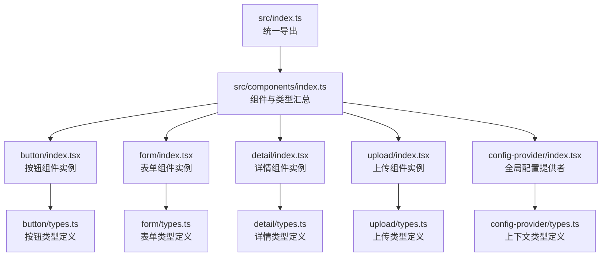
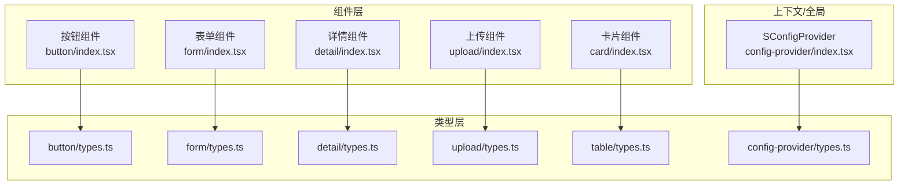
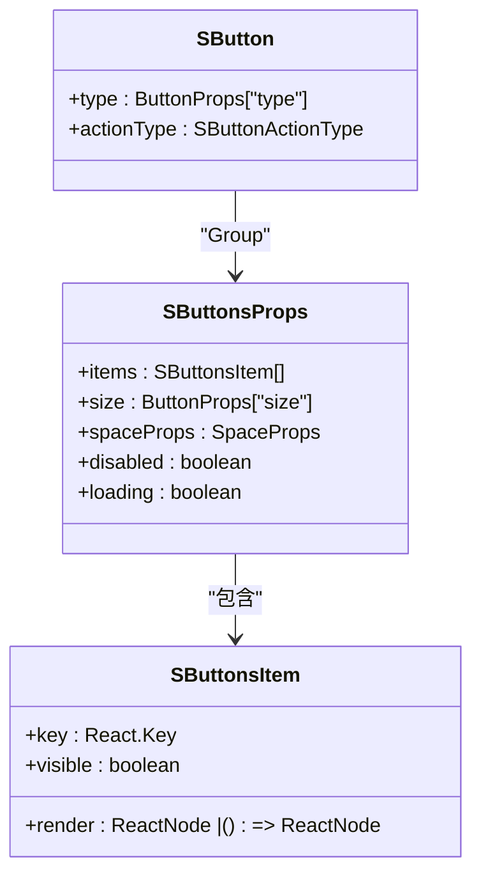
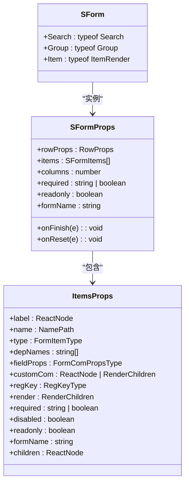
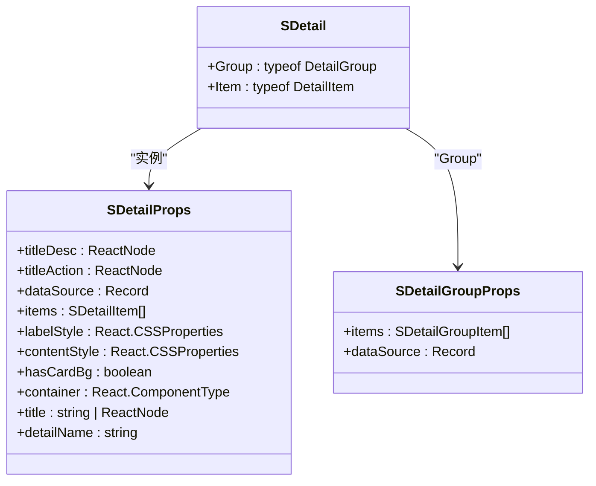
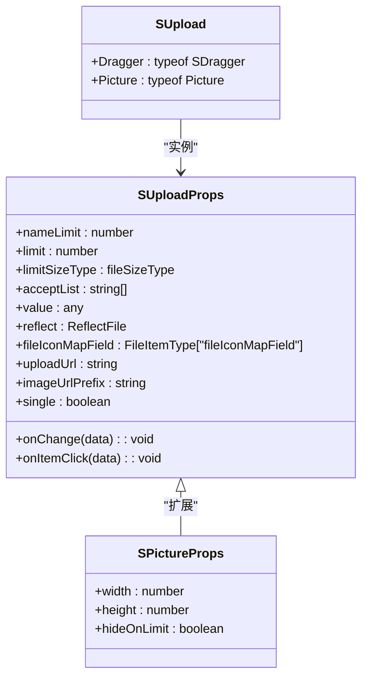
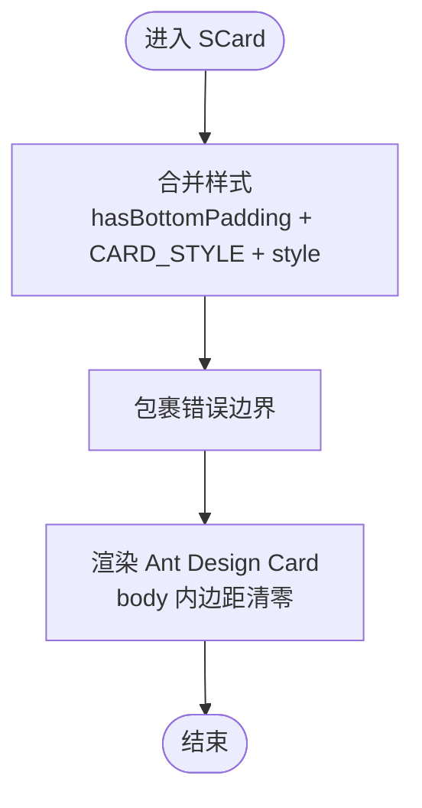
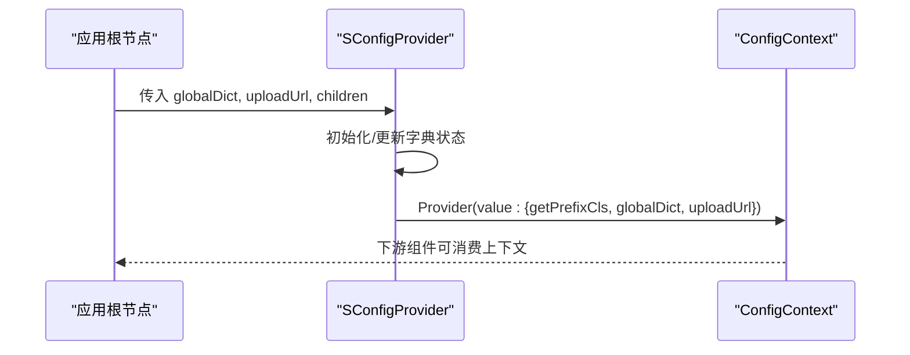
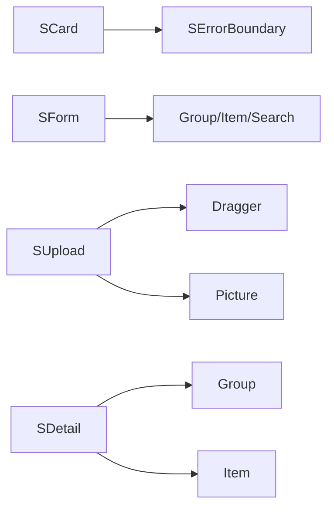

# 组件开发规范

<cite>
**本文档引用的文件**
- [package.json](file://package.json)
- [README.md](file://README.md)
- [src/index.ts](file://src/index.ts)
- [src/components/index.ts](file://src/components/index.ts)
- [src/components/button/index.tsx](file://src/components/button/index.tsx)
- [src/components/button/types.ts](file://src/components/button/types.ts)
- [src/components/card/index.tsx](file://src/components/card/index.tsx)
- [src/components/form/index.tsx](file://src/components/form/index.tsx)
- [src/components/form/types.ts](file://src/components/form/types.ts)
- [src/components/detail/index.tsx](file://src/components/detail/index.tsx)
- [src/components/detail/types.ts](file://src/components/detail/types.ts)
- [src/components/upload/index.tsx](file://src/components/upload/index.tsx)
- [src/components/upload/types.ts](file://src/components/upload/types.ts)
- [src/components/table/types.ts](file://src/components/table/types.ts)
- [src/components/config-provider/index.tsx](file://src/components/config-provider/index.tsx)
- [src/components/config-provider/types.ts](file://src/components/config-provider/types.ts)
</cite>

## 目录

1. [引言](#引言)
2. [项目结构](#项目结构)
3. [核心组件](#核心组件)
4. [架构总览](#架构总览)
5. [详细组件分析](#详细组件分析)
6. [依赖分析](#依赖分析)
7. [性能考虑](#性能考虑)
8. [故障排查指南](#故障排查指南)
9. [结论](#结论)
10. [附录](#附录)

## 引言

本规范面向 SDesign 组件库的开发者与维护者，系统阐述组件设计原则、架构模式、文件结构标准、开发流程、API 设计规范、样式编写规范、测试指南与文档编写规范。目标是统一团队开发节奏，提升可维护性与一致性，降低学习成本。

## 项目结构

SDesign 采用“按功能域分层 + 组合优先”的组织方式：组件以目录为单位聚合，每个组件包含类型定义、演示、样式与实例实现；顶层导出统一聚合，便于按需引入与全量发布。

- 根级脚本与依赖
  - 构建与开发：使用 father 与 dumi，支持 watch 模式与文档构建。
  - 依赖与运行时：基于 React 18+、Ant Design 5、antd-style 等。
- 组件目录组织
  - 每个组件一个目录，包含：
    - index.tsx 实例实现
    - types.ts 类型定义
    - demos 子目录用于演示
    - 样式文件（如存在）
- 聚合导出
  - src/index.ts 导出 components、hooks、icons、utils
  - src/components/index.ts 汇总导出各组件与类型

图表来源

- [src/index.ts](file://src/index.ts#L1-L5)
- [src/components/index.ts](file://src/components/index.ts#L1-L81)
- [src/components/button/index.tsx](file://src/components/button/index.tsx#L1-L15)
- [src/components/button/types.ts](file://src/components/button/types.ts#L1-L72)
- [src/components/form/index.tsx](file://src/components/form/index.tsx#L1-L21)
- [src/components/form/types.ts](file://src/components/form/types.ts#L1-L155)
- [src/components/detail/index.tsx](file://src/components/detail/index.tsx#L1-L19)
- [src/components/detail/types.ts](file://src/components/detail/types.ts#L1-L80)
- [src/components/upload/index.tsx](file://src/components/upload/index.tsx#L1-L18)
- [src/components/upload/types.ts](file://src/components/upload/types.ts#L1-L66)
- [src/components/config-provider/index.tsx](file://src/components/config-provider/index.tsx#L1-L47)
- [src/components/config-provider/types.ts](file://src/components/config-provider/types.ts#L1-L17)

章节来源

- [package.json](file://package.json#L26-L46)
- [README.md](file://README.md#L13-L33)
- [src/index.ts](file://src/index.ts#L1-L5)
- [src/components/index.ts](file://src/components/index.ts#L1-L81)

## 核心组件

- 单一职责原则
  - 每个组件聚焦单一职责，通过组合扩展能力（如按钮的 Group、表单的 Search/Group/Item、详情的 Group/Item、上传的 Dragger/Picture）。
- 组合优于继承
  - 通过高阶类型与静态属性挂载实现子模块暴露，避免类继承带来的紧耦合。
- 类型驱动
  - 所有对外 API 以 TypeScript 类型约束，确保调用方与实现方契约清晰。

章节来源

- [src/components/button/index.tsx](file://src/components/button/index.tsx#L1-L15)
- [src/components/form/index.tsx](file://src/components/form/index.tsx#L1-L21)
- [src/components/detail/index.tsx](file://src/components/detail/index.tsx#L1-L19)
- [src/components/upload/index.tsx](file://src/components/upload/index.tsx#L1-L18)

## 架构总览

SDesign 的架构围绕“组件实例 + 类型定义 + 演示 + 上下文/全局配置”展开。组件实例负责渲染与交互，类型定义保证 API 稳定，演示文件验证行为，全局配置提供统一的主题与字典等资源。

图表来源

- [src/components/button/index.tsx](file://src/components/button/index.tsx#L1-L15)
- [src/components/button/types.ts](file://src/components/button/types.ts#L1-L72)
- [src/components/form/index.tsx](file://src/components/form/index.tsx#L1-L21)
- [src/components/form/types.ts](file://src/components/form/types.ts#L1-L155)
- [src/components/detail/index.tsx](file://src/components/detail/index.tsx#L1-L19)
- [src/components/detail/types.ts](file://src/components/detail/types.ts#L1-L80)
- [src/components/upload/index.tsx](file://src/components/upload/index.tsx#L1-L18)
- [src/components/upload/types.ts](file://src/components/upload/types.ts#L1-L66)
- [src/components/table/types.ts](file://src/components/table/types.ts#L1-L34)
- [src/components/config-provider/index.tsx](file://src/components/config-provider/index.tsx#L1-L47)
- [src/components/config-provider/types.ts](file://src/components/config-provider/types.ts#L1-L17)

## 详细组件分析

### 按钮组件（SButton）

- 设计要点
  - 通过静态属性挂载 Group 子模块，体现组合优于继承。
  - 类型定义中对 actionType 进行枚举约束，保证语义化操作类型。
- API 规范
  - 继承 Ant Design Button Props，新增 actionType 字段。
  - Group 接受 items 数组，支持 size、spaceProps、disabled、loading 等控制。
- 演示建议
  - 基础按钮、尺寸、禁用、加载、按钮组、垂直排列、可见性控制等。

图表来源

- [src/components/button/types.ts](file://src/components/button/types.ts#L52-L72)
- [src/components/button/index.tsx](file://src/components/button/index.tsx#L1-L15)

章节来源

- [src/components/button/index.tsx](file://src/components/button/index.tsx#L1-L15)
- [src/components/button/types.ts](file://src/components/button/types.ts#L1-L72)

### 表单组件（SForm）

- 设计要点
  - 通过高阶类型挂载 Search、Group、Item 子模块，形成“表单 + 渲染器 + 分组”的组合体系。
  - FormFieldMapType 将多种输入组件映射为统一的表单项类型，便于扩展与维护。
- API 规范
  - SFormProps 支持列数、只读、嵌套命名空间、完成/重置回调等。
  - ItemsProps 支持自定义渲染、依赖字段、正则校验键、禁用/只读等。
  - SearchProps 在表单基础上增加展开/收起、卡片容器等特性。
- 演示建议
  - 基础表单、内联/纵向布局、分组表单、搜索表单、依赖联动、占位符等。

图表来源

- [src/components/form/index.tsx](file://src/components/form/index.tsx#L1-L21)
- [src/components/form/types.ts](file://src/components/form/types.ts#L104-L155)

章节来源

- [src/components/form/index.tsx](file://src/components/form/index.tsx#L1-L21)
- [src/components/form/types.ts](file://src/components/form/types.ts#L1-L155)

### 详情组件（SDetail）

- 设计要点
  - 通过 Group 与 Item 子模块实现“分组 + 条目渲染”的组合。
  - 支持字典映射、文件列表、图片、时间范围等多种展示类型。
- API 规范
  - SDetailProps 支持标题描述、动作节点、数据源、标签/内容样式、卡片背景等。
  - SDetailGroupProps 支持分组标题、容器、条目集合与隐藏控制。
- 演示建议
  - 基础详情、复杂详情、分组详情、隐藏分组、空态占位等。

图表来源

- [src/components/detail/index.tsx](file://src/components/detail/index.tsx#L1-L19)
- [src/components/detail/types.ts](file://src/components/detail/types.ts#L49-L80)

章节来源

- [src/components/detail/index.tsx](file://src/components/detail/index.tsx#L1-L19)
- [src/components/detail/types.ts](file://src/components/detail/types.ts#L1-L80)

### 上传组件（SUpload）

- 设计要点
  - 通过 Dragger 与 Picture 子模块实现拖拽与图片上传两种形态。
  - 支持反射回显、图标映射、尺寸限制、单文件模式等。
- API 规范
  - SUploadProps 支持名称限制、数量限制、大小类型、接受类型、回显映射、上传地址前缀、单文件模式等。
  - SPictureProps 在 SUploadProps 基础上增加宽高与达到上限隐藏按钮等。
- 演示建议
  - 基础上传、拖拽上传、图片上传、回显上传、限制数量/大小等。

图表来源

- [src/components/upload/index.tsx](file://src/components/upload/index.tsx#L1-L18)
- [src/components/upload/types.ts](file://src/components/upload/types.ts#L21-L43)

章节来源

- [src/components/upload/index.tsx](file://src/components/upload/index.tsx#L1-L18)
- [src/components/upload/types.ts](file://src/components/upload/types.ts#L1-L66)

### 卡片组件（SCard）

- 设计要点
  - 包裹 Ant Design Card，注入统一内边距与圆角，并在底部可选增加间距。
  - 内部包裹错误边界，提升稳定性。
- API 规范
  - 支持 hasBottomPadding 控制底部间距，style 合并覆盖。
- 演示建议
  - 基础卡片、带底部间距、自定义样式等。

图表来源

- [src/components/card/index.tsx](file://src/components/card/index.tsx#L8-L32)

章节来源

- [src/components/card/index.tsx](file://src/components/card/index.tsx#L1-L35)

### 全局配置提供者（SConfigProvider）

- 设计要点
  - 提供全局字典、上传地址、前缀类名生成等上下文能力。
  - 通过 Context 对下游组件开放统一资源。
- API 规范
  - SConfigProviderType 支持 globalDict、uploadUrl、prefixCls 等。
  - ConfigContextProps 提供 getPrefixCls、globalDict、uploadUrl。
- 演示建议
  - 全局字典注入、上传地址配置、前缀类名策略等。

图表来源

- [src/components/config-provider/index.tsx](file://src/components/config-provider/index.tsx#L8-L42)
- [src/components/config-provider/types.ts](file://src/components/config-provider/types.ts#L3-L17)

章节来源

- [src/components/config-provider/index.tsx](file://src/components/config-provider/index.tsx#L1-L47)
- [src/components/config-provider/types.ts](file://src/components/config-provider/types.ts#L1-L17)

## 依赖分析

- 组件间关系
  - SCard 依赖错误边界组件，增强健壮性。
  - SForm 依赖多类子组件（Group/Item/Search/Upload 等），体现组合扩展。
  - SUpload 依赖内部 Dragger/Picture 子模块。
  - SDetail 依赖 Group/Item 子模块。
- 外部依赖
  - React 18+、Ant Design 5、antd-style、classnames、axios、lodash、react-error-boundary 等。
- 聚合导出
  - src/components/index.ts 汇总导出所有组件与类型，便于统一管理。

图表来源

- [src/components/card/index.tsx](file://src/components/card/index.tsx#L4-L31)
- [src/components/form/index.tsx](file://src/components/form/index.tsx#L1-L21)
- [src/components/upload/index.tsx](file://src/components/upload/index.tsx#L1-L18)
- [src/components/detail/index.tsx](file://src/components/detail/index.tsx#L1-L19)

章节来源

- [src/components/index.ts](file://src/components/index.ts#L1-L81)
- [package.json](file://package.json#L52-L101)

## 性能考虑

- 组件拆分与懒加载
  - 将大型组件拆分为多个子模块，按需引入，减少初始包体。
- 样式优化
  - 使用 antd-style 进行 CSS-in-JS，结合主题变量与动态样式，避免全局污染。
- 渲染优化
  - 对高频渲染的子项使用 memo 或浅比较，减少重渲染。
- 请求与缓存
  - 全局配置提供统一上传地址与字典，减少重复请求与配置分散。

## 故障排查指南

- 错误边界
  - SCard 内部包裹错误边界，可捕获并降级渲染，避免整页崩溃。
- 上下文缺失
  - 若使用依赖全局配置的组件，请确保根节点已包裹 SConfigProvider。
- 类型不匹配
  - 严格遵循 types.ts 中的类型约束，避免运行时异常。
- 样式冲突
  - 使用 antd-style 的主题变量与作用域隔离，避免与第三方样式冲突。

章节来源

- [src/components/card/index.tsx](file://src/components/card/index.tsx#L25-L31)
- [src/components/config-provider/index.tsx](file://src/components/config-provider/index.tsx#L31-L42)

## 结论

本规范以单一职责与组合优先为核心设计思想，配合严格的类型约束与统一的文件结构，确保组件库在可维护性、可扩展性与一致性方面达到工程化标准。建议在新组件开发中遵循本文档的流程与规范，逐步完善演示与文档，保障交付质量。

## 附录

### 组件文件结构标准

- 目录命名
  - 使用小写英文，必要时使用短横线分隔（如 check-group）。
- 文件命名
  - 实例：index.tsx
  - 类型：types.ts
  - 演示：demos/\*.tsx
  - 样式：index.style.ts（如存在）
- 导出规范
  - 组件实例导出默认值，同时通过高阶类型挂载子模块。
  - 类型通过 src/components/index.ts 统一导出。

章节来源

- [src/components/button/index.tsx](file://src/components/button/index.tsx#L1-L15)
- [src/components/form/index.tsx](file://src/components/form/index.tsx#L1-L21)
- [src/components/detail/index.tsx](file://src/components/detail/index.tsx#L1-L19)
- [src/components/upload/index.tsx](file://src/components/upload/index.tsx#L1-L18)
- [src/components/index.ts](file://src/components/index.ts#L1-L81)

### 组件开发流程（从需求到发布）

- 需求分析
  - 明确单一职责，拆解子模块与组合关系。
- 设计 API
  - 定义 props、事件回调、默认值与类型约束。
- 编写实现
  - 实现组件实例，按需引入错误边界与上下文。
- 编写类型
  - 在 types.ts 中声明完整类型，确保对外 API 稳定。
- 编写演示
  - 在 demos 目录补充基础、边界与场景化示例。
- 样式与主题
  - 使用 antd-style 与主题变量，保证一致风格与响应式。
- 测试
  - 编写单元测试与快照测试，覆盖关键路径与边界条件。
- 文档
  - 在组件同级目录编写 index.md，组织示例与说明。
- 发布
  - 本地构建与文档构建，执行 doctor 校验，提交版本与发布。

章节来源

- [README.md](file://README.md#L13-L33)
- [package.json](file://package.json#L26-L46)

### 组件 API 设计规范

- Props 类型定义
  - 优先继承 Ant Design 对应组件的 Props，再扩展自有字段。
  - 使用枚举 tuple 约束可选值，保证语义化与可维护性。
- 事件回调约定
  - 回调参数尽量携带必要上下文，保持一致命名（如 onFinish/onReset/onExpand）。
- 默认值设置
  - 在组件内部设置合理默认值，避免外部传参过多。
- 只读/禁用/隐藏
  - 提供 readonly、disabled、hidden 等通用控制字段，统一行为。

章节来源

- [src/components/button/types.ts](file://src/components/button/types.ts#L52-L72)
- [src/components/form/types.ts](file://src/components/form/types.ts#L71-L117)
- [src/components/detail/types.ts](file://src/components/detail/types.ts#L49-L80)
- [src/components/upload/types.ts](file://src/components/upload/types.ts#L21-L43)

### 组件样式编写规范

- CSS-in-JS
  - 使用 antd-style，结合主题变量与动态样式，避免全局污染。
- 主题变量引用
  - 通过主题系统统一颜色、尺寸、字体等，保证视觉一致性。
- 响应式设计
  - 在组件样式中考虑不同屏幕尺寸下的表现，必要时提供断点策略。
- 样式隔离
  - 通过作用域与命名空间隔离，避免与其他组件样式冲突。

章节来源

- [README.md](file://README.md#L35-L40)

### 组件测试指南

- 单元测试
  - 覆盖 props 变更、事件触发、渲染结果等关键路径。
- 快照测试
  - 对演示场景进行快照对比，防止 UI 回退。
- 模拟与夹具
  - 使用 mock 数据与工具函数，稳定测试环境。

章节来源

- [package.json](file://package.json#L34-L40)

### 文档编写规范

- Markdown 格式
  - 使用标题层级与简洁语言描述组件用途与行为。
- 示例组织
  - 将演示文件与文档关联，示例文件命名与目录结构保持一致。
- API 说明
  - 逐项列出 props、事件、默认值与类型，标注必填与可选。

章节来源

- [src/components/button/index.tsx](file://src/components/button/index.tsx#L1-L15)
- [src/components/form/index.tsx](file://src/components/form/index.tsx#L1-L21)
- [src/components/detail/index.tsx](file://src/components/detail/index.tsx#L1-L19)
- [src/components/upload/index.tsx](file://src/components/upload/index.tsx#L1-L18)
