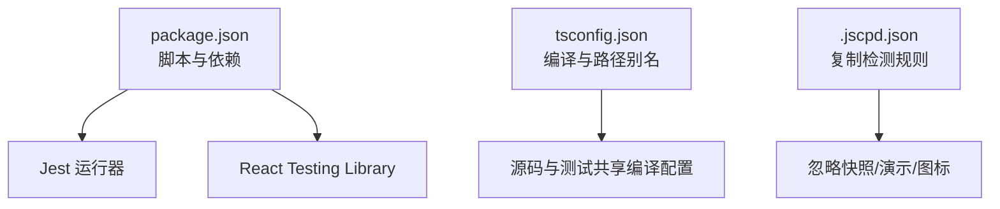
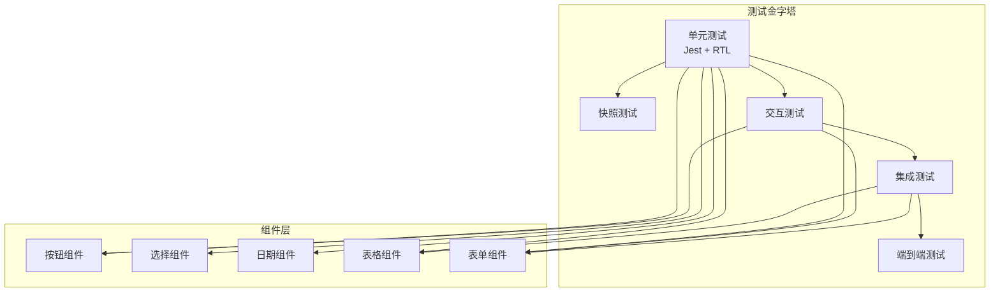
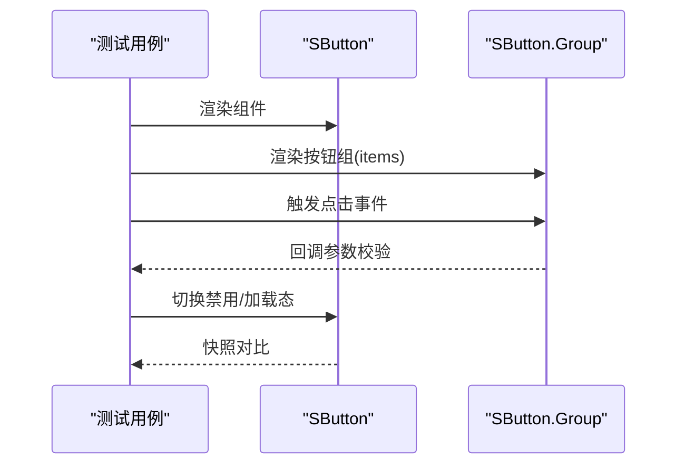
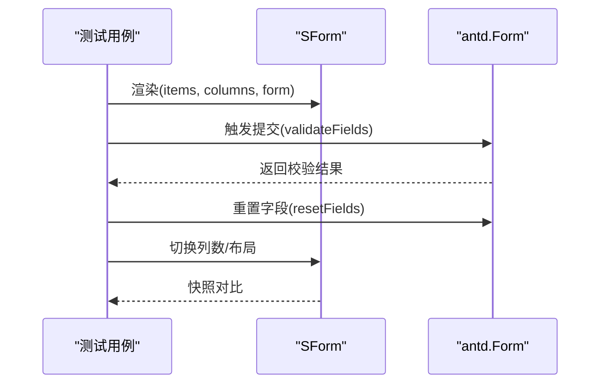
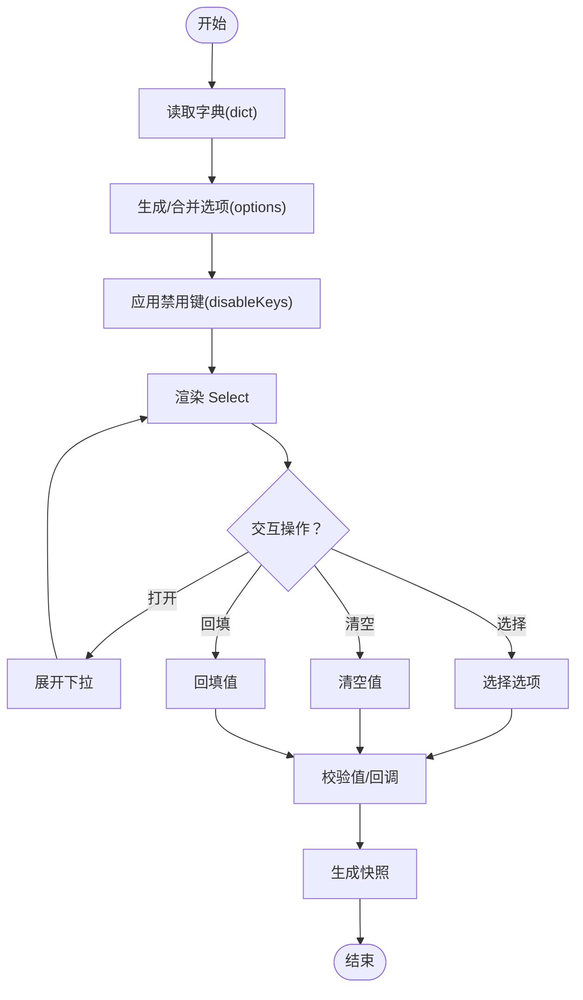
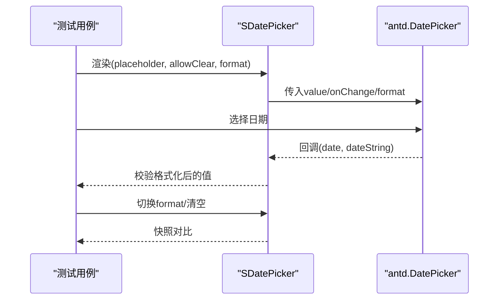
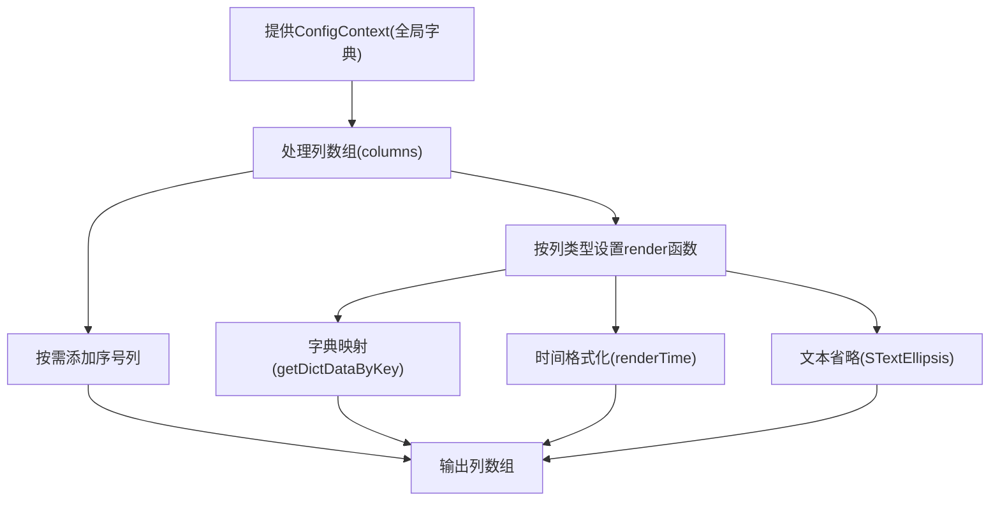
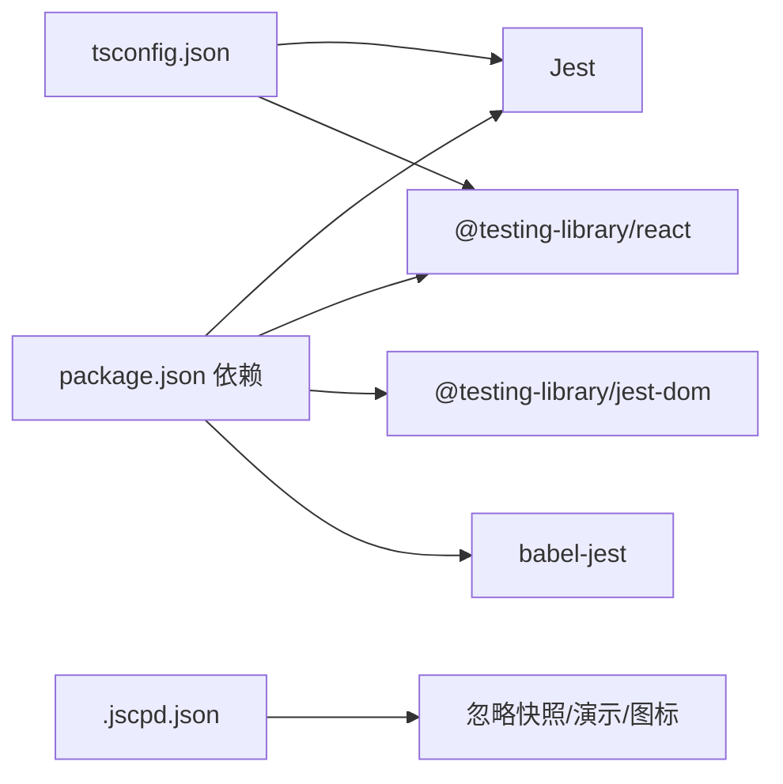

# 组件测试规范

<cite>
**本文引用的文件**
- [package.json](file://package.json)
- [tsconfig.json](file://tsconfig.json)
- [.jscpd.json](file://.jscpd.json)
- [src/components/button/index.tsx](file://src/components/button/index.tsx)
- [src/components/form/index.tsx](file://src/components/form/index.tsx)
- [src/components/select/index.tsx](file://src/components/select/index.tsx)
- [src/components/date-picker/index.tsx](file://src/components/date-picker/index.tsx)
- [src/components/table/index.tsx](file://src/components/table/index.tsx)
- [src/components/button/demos/basic.tsx](file://src/components/button/demos/basic.tsx)
- [src/components/select/demos/index.tsx](file://src/components/select/demos/index.tsx)
- [src/components/date-picker/demos/index.tsx](file://src/components/date-picker/demos/index.tsx)
- [src/components/form/demos/form.tsx](file://src/components/form/demos/form.tsx)
</cite>

## 目录

1. 引言
2. 项目结构
3. 核心组件
4. 架构总览
5. 详细组件分析
6. 依赖分析
7. 性能考虑
8. 故障排查指南
9. 结论
10. 附录

## 引言

本规范面向 SDesign 组件库的测试工作，目标是建立统一、可维护、高覆盖率的组件测试体系。内容覆盖单元测试（Jest + React Testing Library）、快照测试、交互测试、集成测试与端到端测试策略、测试覆盖率与质量标准、测试数据准备与环境配置，并提供完整示例路径，帮助开发者编写高质量的组件测试。

## 项目结构

- 测试相关脚本与依赖集中在 package.json 中；Jest 作为核心测试运行器与断言框架，React Testing Library 用于渲染与查询 DOM。
- tsconfig.json 配置了 TypeScript 编译选项与路径别名，确保测试与源码一致的编译行为。
- .jscpd.json 配置了复制检测规则，忽略快照、演示与图标等目录，避免误报。

**图示来源**

- [package.json](file://package.json#L26-L46)
- [tsconfig.json](file://tsconfig.json#L1-L26)
- [.jscpd.json](file://.jscpd.json#L1-L12)

**章节来源**

- [package.json](file://package.json#L26-L46)
- [tsconfig.json](file://tsconfig.json#L1-L26)
- [.jscpd.json](file://.jscpd.json#L1-L12)

## 核心组件

- 按钮组件：支持按钮组聚合导出，便于组合测试与交互验证。
- 表单组件：提供表单项渲染、分组、搜索等能力，适合复杂交互与联动场景的测试。
- 下拉选择组件：基于字典动态生成选项，支持外部 options 覆盖，适合边界条件与字典切换测试。
- 日期选择组件：封装 antd 日期选择器，提供格式化与回调转换，适合时间格式与事件触发测试。
- 表格组件：内置字典映射、序号列、文本省略等增强逻辑，适合渲染与上下文注入测试。

**章节来源**

- [src/components/button/index.tsx](file://src/components/button/index.tsx#L1-L15)
- [src/components/form/index.tsx](file://src/components/form/index.tsx#L1-L21)
- [src/components/select/index.tsx](file://src/components/select/index.tsx#L1-L37)
- [src/components/date-picker/index.tsx](file://src/components/date-picker/index.tsx#L1-L39)
- [src/components/table/index.tsx](file://src/components/table/index.tsx#L1-L135)

## 架构总览

测试架构围绕“单元测试 + 快照测试 + 交互测试 + 集成测试”的分层设计展开，结合组件特性与依赖关系，形成从原子到组合再到端到端的测试金字塔。

## 详细组件分析

### 按钮组件测试要点

- 导出结构：按钮组件通过组合导出 Group 子模块，测试时应分别验证主组件与子模块的行为。
- 交互测试：模拟点击事件，验证回调触发与状态变化；对按钮组进行组合渲染与点击序列测试。
- 快照测试：在不同尺寸、禁用、加载态等状态下生成快照，确保 UI 稳定性。

**图示来源**

- [src/components/button/index.tsx](file://src/components/button/index.tsx#L1-L15)
- [src/components/button/demos/basic.tsx](file://src/components/button/demos/basic.tsx#L1-L29)

**章节来源**

- [src/components/button/index.tsx](file://src/components/button/index.tsx#L1-L15)
- [src/components/button/demos/basic.tsx](file://src/components/button/demos/basic.tsx#L1-L29)

### 表单组件测试要点

- 组合渲染：根据 items 动态渲染多种字段类型，测试项包含输入、选择、字典、日期等。
- 交互测试：表单提交、重置、必填校验、联动字段更新等。
- 集成测试：与 antd Form、字典服务、表单实例协作，验证整体流程。

**图示来源**

- [src/components/form/index.tsx](file://src/components/form/index.tsx#L1-L21)
- [src/components/form/demos/form.tsx](file://src/components/form/demos/form.tsx#L1-L94)

**章节来源**

- [src/components/form/index.tsx](file://src/components/form/index.tsx#L1-L21)
- [src/components/form/demos/form.tsx](file://src/components/form/demos/form.tsx#L1-L94)

### 选择组件测试要点

- 字典驱动：根据 dict 生成 options，同时支持外部 options 覆盖，需测试优先级与禁用键过滤。
- 交互测试：打开下拉、选择选项、清空、回填值等。
- 边界测试：空字典、空选项、禁用键集合、非法值等。

**图示来源**

- [src/components/select/index.tsx](file://src/components/select/index.tsx#L1-L37)
- [src/components/select/demos/index.tsx](file://src/components/select/demos/index.tsx#L1-L68)

**章节来源**

- [src/components/select/index.tsx](file://src/components/select/index.tsx#L1-L37)
- [src/components/select/demos/index.tsx](file://src/components/select/demos/index.tsx#L1-L68)

### 日期组件测试要点

- 格式化与回调：封装 onChange，将值转换为字符串或 dayjs，测试不同 format 场景。
- 交互测试：选择日期、清空、格式化输出。
- 边界测试：非法日期、空值、回调为空等。

**图示来源**

- [src/components/date-picker/index.tsx](file://src/components/date-picker/index.tsx#L1-L39)
- [src/components/date-picker/demos/index.tsx](file://src/components/date-picker/demos/index.tsx#L1-L43)

**章节来源**

- [src/components/date-picker/index.tsx](file://src/components/date-picker/index.tsx#L1-L39)
- [src/components/date-picker/demos/index.tsx](file://src/components/date-picker/demos/index.tsx#L1-L43)

### 表格组件测试要点

- 上下文注入：依赖 ConfigProvider 注入全局字典，测试时需提供上下文。
- 渲染增强：序号列、字典映射、时间格式化、省略渲染等。
- 性能与稳定性：memo 化与列计算，关注重复渲染与列变更。

**图示来源**

- [src/components/table/index.tsx](file://src/components/table/index.tsx#L1-L135)

**章节来源**

- [src/components/table/index.tsx](file://src/components/table/index.tsx#L1-L135)

## 依赖分析

- 测试运行时依赖：Jest、@testing-library/react、@testing-library/jest-dom、babel-jest 等。
- TypeScript 支持：通过 tsconfig.json 的路径别名与编译选项，保证测试与源码一致。
- 复制检测：.jscpd.json 忽略快照、演示与图标目录，避免误报。

**图示来源**

- [package.json](file://package.json#L61-L92)
- [tsconfig.json](file://tsconfig.json#L1-L26)
- [.jscpd.json](file://.jscpd.json#L1-L12)

**章节来源**

- [package.json](file://package.json#L61-L92)
- [tsconfig.json](file://tsconfig.json#L1-L26)
- [.jscpd.json](file://.jscpd.json#L1-L12)

## 性能考虑

- 单元测试性能：优先使用轻量渲染与最小化依赖，减少不必要的重渲染。
- 快照测试：控制快照数量与复杂度，避免过度渲染导致的快照膨胀。
- 集成测试：尽量隔离外部依赖，使用内存态或本地桩，提升执行速度与稳定性。

## 故障排查指南

- 快照不一致：检查组件渲染差异、上下文注入、国际化与字典数据变化。
- 交互失败：确认事件绑定、回调触发顺序、受控与非受控状态一致性。
- 集成异常：核对 antd 组件版本兼容性、样式与主题变量、路由与上下文提供者。

## 结论

通过分层测试策略与规范化的测试数据准备，SDesign 可以在保证功能正确性的前提下，持续提升测试效率与质量。建议在团队内推广统一的测试命名、目录结构与断言风格，配合覆盖率与复制检测工具，形成可持续演进的测试体系。

## 附录

### 单元测试编写规范（Jest + React Testing Library）

- 命名与组织：每个组件对应一个测试文件，按功能拆分子用例；使用 describe/it/test 分层组织。
- 渲染与查询：使用 screen.getByRole/getByLabelText/getByText 等语义化查询；避免脆弱选择器。
- 事件模拟：fireEvent/click/focus 等；对受控组件，需同步更新状态后再断言。
- 断言：优先断言可见性与可访问性，其次断言行为与副作用；避免断言实现细节。

### 快照测试规范

- 何时使用：UI 稳定、结构清晰、无频繁变动的组件；避免对动态内容做快照。
- 维护策略：当 UI 变更合理且必要时，先更新快照再回归；对不稳定区域采用像素对比或局部截图。
- 目录管理：快照文件与测试文件同目录，命名含组件名与场景标识。

### 交互测试指南

- 用户交互模拟：模拟点击、输入、选择、滚动等；对表单类组件，模拟提交与重置。
- 事件触发：验证回调参数、错误提示、状态切换；对异步操作，等待 Promise 完成。
- 状态验证：断言 DOM 文本、类名、属性、aria-\* 等可访问性属性。

### 集成测试策略

- 组件组合测试：将多个组件组合使用，验证协作行为与数据流；如表单与表格联动。
- 端到端测试：覆盖真实用户路径，验证从页面到后端的关键链路；建议使用独立的 e2e 工具与环境。

### 测试覆盖率与质量标准

- 关键路径：核心交互、错误分支、边界输入、国际化与主题切换。
- 覆盖率：语句、分支、函数、行的覆盖率目标建议不低于 80%，关键模块不低于 90%。
- 质量门禁：复制检测阈值为 0，忽略快照与演示；CI 中强制执行 ESLint、Stylelint 与测试。

### 测试数据准备规范

- Mock 数据：按场景构造最小化、可复用的数据集；对外部接口使用内存桩或静态响应。
- 环境配置：统一 tsconfig 与 jest 配置；在 CI 中固定 Node 版本与依赖版本。

### 示例路径（不含代码片段）

- 按钮组件交互与快照：[src/components/button/demos/basic.tsx](file://src/components/button/demos/basic.tsx#L1-L29)
- 表单组件组合渲染与提交：[src/components/form/demos/form.tsx](file://src/components/form/demos/form.tsx#L1-L94)
- 选择组件字典与覆盖优先级：[src/components/select/demos/index.tsx](file://src/components/select/demos/index.tsx#L1-L68)
- 日期组件格式化与回调：[src/components/date-picker/demos/index.tsx](file://src/components/date-picker/demos/index.tsx#L1-L43)
