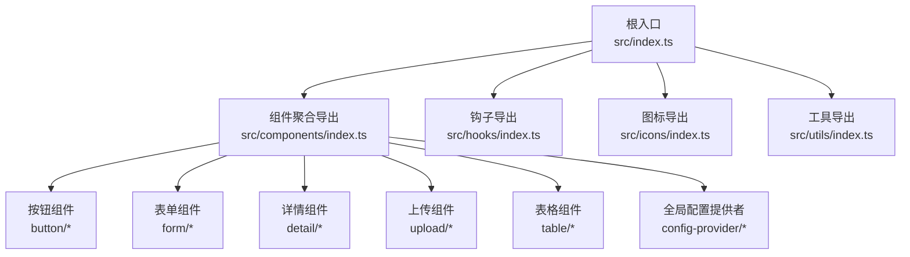
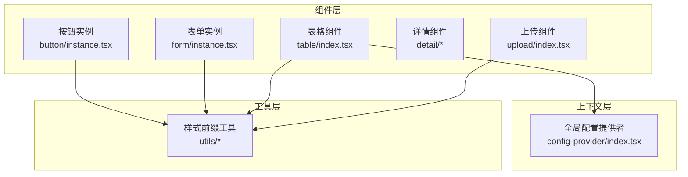
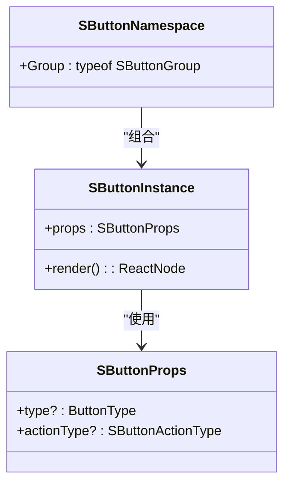
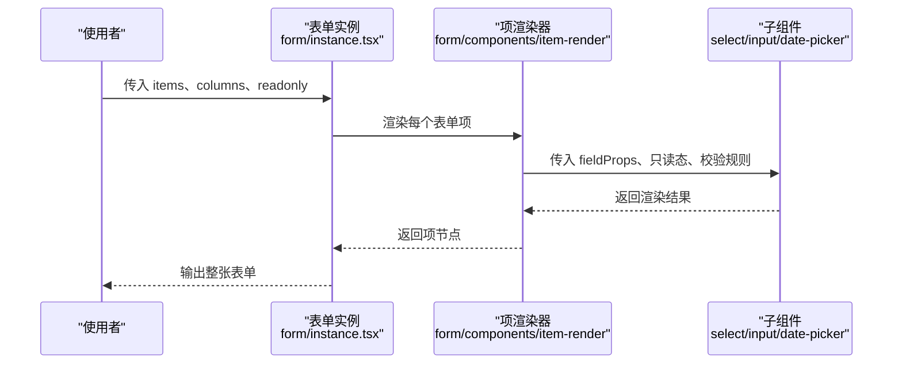
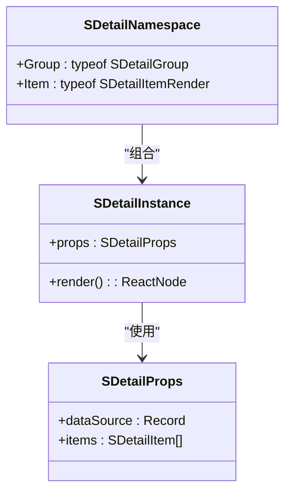
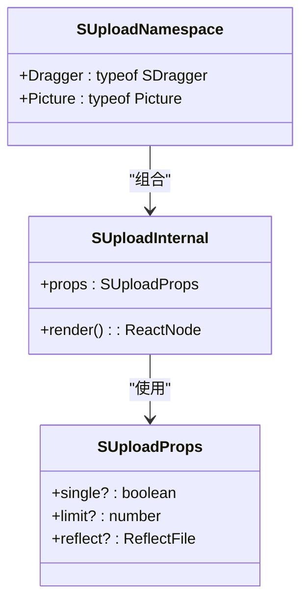
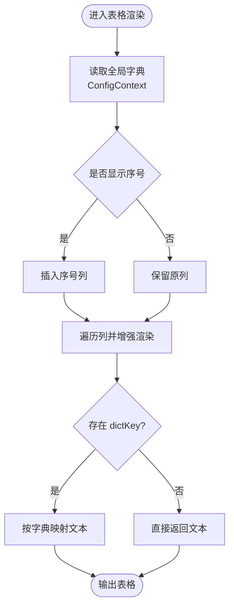
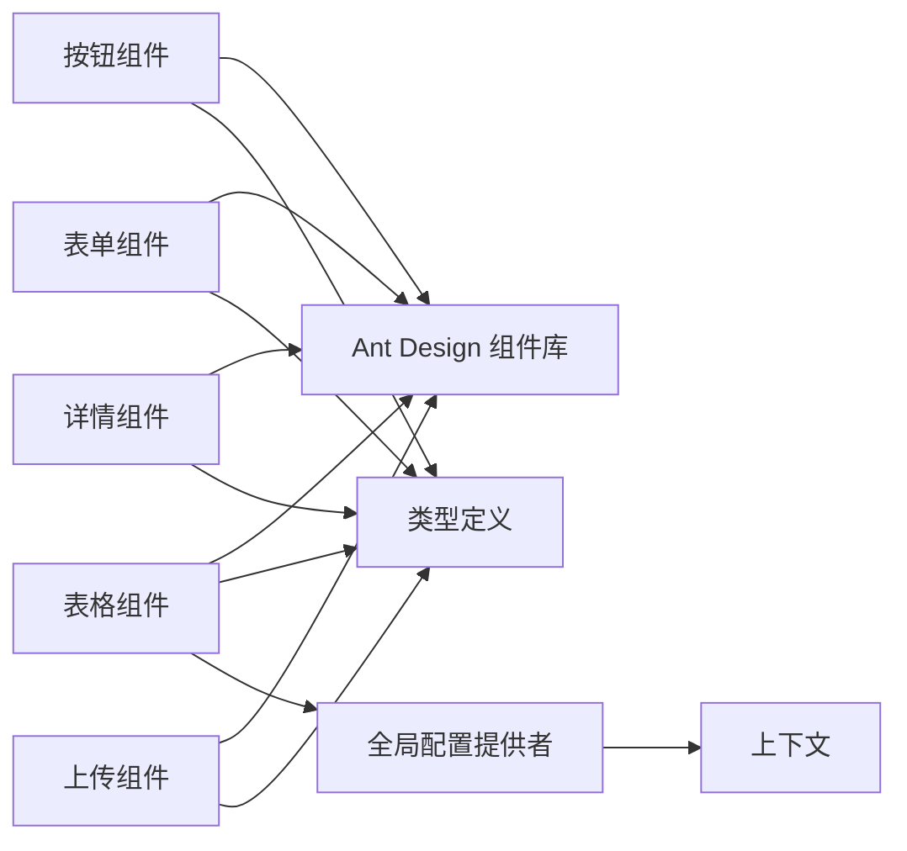

# 设计原则

<cite>
**本文引用的文件**
- [src/index.ts](file://src/index.ts)
- [src/components/index.ts](file://src/components/index.ts)
- [src/components/button/index.tsx](file://src/components/button/index.tsx)
- [src/components/button/instance.tsx](file://src/components/button/instance.tsx)
- [src/components/button/types.ts](file://src/components/button/types.ts)
- [src/components/form/index.tsx](file://src/components/form/index.tsx)
- [src/components/form/instance.tsx](file://src/components/form/instance.tsx)
- [src/components/form/types.ts](file://src/components/form/types.ts)
- [src/components/detail/index.tsx](file://src/components/detail/index.tsx)
- [src/components/detail/types.ts](file://src/components/detail/types.ts)
- [src/components/upload/index.tsx](file://src/components/upload/index.tsx)
- [src/components/upload/types.ts](file://src/components/upload/types.ts)
- [src/components/table/index.tsx](file://src/components/table/index.tsx)
- [src/components/table/types.ts](file://src/components/table/types.ts)
- [src/components/config-provider/index.tsx](file://src/components/config-provider/index.tsx)
</cite>

## 目录

1. 引言
2. 项目结构
3. 核心组件
4. 架构总览
5. 详细组件分析
6. 依赖关系分析
7. 性能考量
8. 故障排查指南
9. 结论
10. 附录

## 引言

本文件围绕 SDesign 组件库的设计原则进行系统化梳理与实践说明，重点覆盖以下主题：

- 单一职责原则：如何确保每个组件聚焦于一个明确的功能领域
- 组合优于继承：通过 Props Drilling 与 Render Props 模式实现灵活组合
- 可复用性设计：通用属性抽象、事件回调标准化、状态提升策略
- 一致性原则：命名约定、API 设计与用户体验一致性
- 可访问性设计：语义化标签、键盘导航与屏幕阅读器支持
- 实际示例：提供符合设计原则的正向实现与违反设计原则的反面案例路径指引

## 项目结构

SDesign 采用“按功能域分层 + 组件聚合导出”的组织方式：

- 根入口统一导出 components、hooks、icons、utils，便于上层按需引入
- components 目录下以功能域划分子目录（如 button、form、table 等），每个子目录内包含组件实例、类型定义、演示与文档
- 多数组件通过“实例 + 命名空间扩展”的方式导出，既保持单一职责，又提供组合能力

图表来源

- [src/index.ts](file://src/index.ts#L1-L5)
- [src/components/index.ts](file://src/components/index.ts#L1-L81)

章节来源

- [src/index.ts](file://src/index.ts#L1-L5)
- [src/components/index.ts](file://src/components/index.ts#L1-L81)

## 核心组件

本节聚焦体现设计原则的关键组件与模式，包括：

- 单一职责：按钮、表单、详情、上传、表格等组件各自承担独立职责
- 组合优先：通过命名空间扩展（Group、Item、Dragger、Picture）与内部实例分离，实现组合与复用
- 一致性：统一的 props 抽象、事件回调命名与布局策略
- 可访问性：基于 Ant Design 的语义化组件封装，遵循键盘与无障碍最佳实践

章节来源

- [src/components/button/index.tsx](file://src/components/button/index.tsx#L1-L15)
- [src/components/form/index.tsx](file://src/components/form/index.tsx#L1-L21)
- [src/components/detail/index.tsx](file://src/components/detail/index.tsx#L1-L19)
- [src/components/upload/index.tsx](file://src/components/upload/index.tsx#L1-L18)
- [src/components/table/index.tsx](file://src/components/table/index.tsx#L1-L135)

## 架构总览

SDesign 的架构以“组件实例 + 上下文 + 工具”为核心：

- 组件实例负责具体渲染与交互逻辑
- 上下文（如 ConfigProvider）提供全局配置（前缀、字典、上传地址等）
- 工具函数（如 getPrefixCls）统一命名与样式前缀
- 表单、表格等复合组件通过内部实例与子组件组合实现高复用

图表来源

- [src/components/button/instance.tsx](file://src/components/button/instance.tsx#L1-L46)
- [src/components/form/instance.tsx](file://src/components/form/instance.tsx#L1-L99)
- [src/components/table/index.tsx](file://src/components/table/index.tsx#L1-L135)
- [src/components/config-provider/index.tsx](file://src/components/config-provider/index.tsx#L1-L47)

## 详细组件分析

### 按钮组件：单一职责与组合模式

- 单一职责：按钮实例仅负责根据 actionType/type 合并配置并渲染 Ant Design Button；按钮组、按钮集合等通过命名空间扩展实现
- 组合优先：通过 index.tsx 将实例与 Group 扩展绑定，形成“实例 + 命名空间”的组合形态
- 可复用性：统一的 SButtonProps 抽象 actionType，结合默认配置常量，减少重复逻辑
- 一致性：与 Ant Design Button 的 props 对齐，保证 API 一致性

图表来源

- [src/components/button/index.tsx](file://src/components/button/index.tsx#L1-L15)
- [src/components/button/instance.tsx](file://src/components/button/instance.tsx#L1-L46)
- [src/components/button/types.ts](file://src/components/button/types.ts#L52-L57)

章节来源

- [src/components/button/index.tsx](file://src/components/button/index.tsx#L1-L15)
- [src/components/button/instance.tsx](file://src/components/button/instance.tsx#L1-L46)
- [src/components/button/types.ts](file://src/components/button/types.ts#L1-L72)

### 表单组件：组合优先与 Render Props

- 单一职责：表单实例负责布局、列数、只读态、事件透传与子项渲染；搜索、分组、自定义渲染由子模块承担
- 组合优先：通过命名空间扩展 Search、Group、Item，实现“表单 + 子组件”的组合
- Render Props：ItemRender 支持 render 回调与自定义容器，满足复杂渲染场景
- 一致性：统一的 onFinish/onReset 命名与只读态配置，降低学习成本

图表来源

- [src/components/form/instance.tsx](file://src/components/form/instance.tsx#L1-L99)
- [src/components/form/index.tsx](file://src/components/form/index.tsx#L1-L21)
- [src/components/form/types.ts](file://src/components/form/types.ts#L71-L117)

章节来源

- [src/components/form/index.tsx](file://src/components/form/index.tsx#L1-L21)
- [src/components/form/instance.tsx](file://src/components/form/instance.tsx#L1-L99)
- [src/components/form/types.ts](file://src/components/form/types.ts#L1-L155)

### 详情组件：分组与项渲染的组合

- 单一职责：详情实例负责数据源、标题、容器与分组渲染；Group/Item 作为子模块承担分组与单项渲染
- 组合优先：通过命名空间扩展 Group、Item，实现“详情 + 分组 + 项”的层级组合
- 可复用性：支持 dictKey 映射、文件渲染、占位符等通用能力

图表来源

- [src/components/detail/index.tsx](file://src/components/detail/index.tsx#L1-L19)
- [src/components/detail/types.ts](file://src/components/detail/types.ts#L49-L62)

章节来源

- [src/components/detail/index.tsx](file://src/components/detail/index.tsx#L1-L19)
- [src/components/detail/types.ts](file://src/components/detail/types.ts#L1-L80)

### 上传组件：多形态组合与状态管理

- 单一职责：上传实例负责限制、反射、图标映射与回调；拖拽上传、图片墙通过命名空间扩展
- 组合优先：通过 Dragger、Picture 扩展不同上传形态，统一通过 Hook 管理状态
- 可复用性：统一的 SUploadProps 抽象，支持单文件、尺寸限制、接受类型等

图表来源

- [src/components/upload/index.tsx](file://src/components/upload/index.tsx#L1-L18)
- [src/components/upload/types.ts](file://src/components/upload/types.ts#L21-L35)

章节来源

- [src/components/upload/index.tsx](file://src/components/upload/index.tsx#L1-L18)
- [src/components/upload/types.ts](file://src/components/upload/types.ts#L1-L66)

### 表格组件：上下文注入与默认渲染策略

- 单一职责：表格组件负责序号列、字典映射、时间格式化、省略渲染等增强逻辑
- 组合优先：通过 ConfigProvider 注入全局字典，结合 TextEllipsis 实现单元格省略
- 一致性：统一的列渲染策略与分页参数透传，保证行为一致

图表来源

- [src/components/table/index.tsx](file://src/components/table/index.tsx#L12-L135)
- [src/components/config-provider/index.tsx](file://src/components/config-provider/index.tsx#L1-L47)

章节来源

- [src/components/table/index.tsx](file://src/components/table/index.tsx#L1-L135)
- [src/components/table/types.ts](file://src/components/table/types.ts#L1-L34)
- [src/components/config-provider/index.tsx](file://src/components/config-provider/index.tsx#L1-L47)

## 依赖关系分析

- 组件间耦合度低：各组件通过 props 与上下文交互，避免深层继承
- 统一导出：根入口与组件聚合导出，便于按需引入与 Tree Shaking
- 类型复用：表单、详情、上传等组件共享统一的类型抽象，降低维护成本

图表来源

- [src/components/button/instance.tsx](file://src/components/button/instance.tsx#L1-L46)
- [src/components/form/instance.tsx](file://src/components/form/instance.tsx#L1-L99)
- [src/components/table/index.tsx](file://src/components/table/index.tsx#L1-L135)
- [src/components/config-provider/index.tsx](file://src/components/config-provider/index.tsx#L1-L47)

章节来源

- [src/components/index.ts](file://src/components/index.ts#L1-L81)
- [src/index.ts](file://src/index.ts#L1-L5)

## 性能考量

- 记忆化优化：按钮与表格组件广泛使用 useMemo 缓存计算结果，减少重渲染
- 列表渲染：表格列增强与字典映射在渲染阶段完成，避免运行时重复计算
- 事件透传：表单实例对 onFinish/onReset 进行轻量包装，避免额外闭包开销
- 组合渲染：通过子组件拆分与命名空间扩展，降低单组件体积与复杂度

章节来源

- [src/components/button/instance.tsx](file://src/components/button/instance.tsx#L20-L25)
- [src/components/table/index.tsx](file://src/components/table/index.tsx#L112-L122)
- [src/components/form/instance.tsx](file://src/components/form/instance.tsx#L41-L47)

## 故障排查指南

- 表单只读态不生效：检查 readonly 参数是否正确传递至表单实例，确认只读态配置是否被覆盖
- 上传限制未生效：核对 SUploadProps 中的 limit、single、acceptList 等参数是否正确设置
- 表格字典映射缺失：确认 ConfigProvider 是否正确注入 globalDict，列定义中 dictKey 是否匹配
- 按钮样式异常：检查 actionType/type 配置合并顺序，以及 style 的透传是否被覆盖

章节来源

- [src/components/form/instance.tsx](file://src/components/form/instance.tsx#L25-L32)
- [src/components/upload/types.ts](file://src/components/upload/types.ts#L21-L35)
- [src/components/table/index.tsx](file://src/components/table/index.tsx#L33-L40)
- [src/components/button/instance.tsx](file://src/components/button/instance.tsx#L14-L18)

## 结论

SDesign 在组件设计中贯彻了单一职责、组合优先、可复用性与一致性原则，并通过上下文与工具函数实现可访问性与性能的平衡。建议在后续迭代中持续：

- 保持单一职责边界清晰，避免“上帝组件”
- 优先使用组合而非继承，通过命名空间扩展与 Render Props 提升灵活性
- 统一事件回调命名与参数结构，降低学习与迁移成本
- 加强可访问性测试与键盘导航验证，确保无障碍体验

## 附录

- 正向示例路径（不展示代码内容，仅提供定位）：
  - 按钮实例与命名空间扩展：[src/components/button/index.tsx](file://src/components/button/index.tsx#L1-L15)，[src/components/button/instance.tsx](file://src/components/button/instance.tsx#L1-L46)
  - 表单实例与子组件组合：[src/components/form/index.tsx](file://src/components/form/index.tsx#L1-L21)，[src/components/form/instance.tsx](file://src/components/form/instance.tsx#L1-L99)
  - 详情分组与项渲染：[src/components/detail/index.tsx](file://src/components/detail/index.tsx#L1-L19)，[src/components/detail/types.ts](file://src/components/detail/types.ts#L49-L62)
  - 上传多形态组合：[src/components/upload/index.tsx](file://src/components/upload/index.tsx#L1-L18)，[src/components/upload/types.ts](file://src/components/upload/types.ts#L21-L35)
  - 表格上下文注入与默认渲染：[src/components/table/index.tsx](file://src/components/table/index.tsx#L1-L135)，[src/components/config-provider/index.tsx](file://src/components/config-provider/index.tsx#L1-L47)
- 反面案例路径（应避免的做法，仅提供定位）：
  - 深度继承导致的紧耦合：避免在组件中直接继承第三方组件的内部实现
  - 过度合并 props 导致的冲突：避免在多层组件中重复透传同名 props 且无明确优先级
  - 缺乏上下文注入的硬编码：避免在组件中直接写死全局配置或外部资源地址
