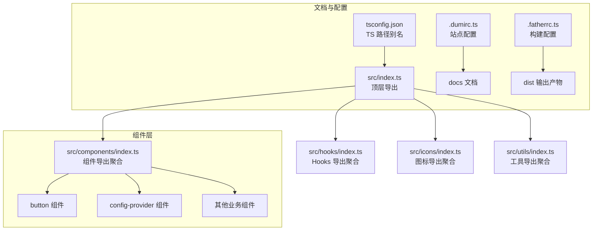
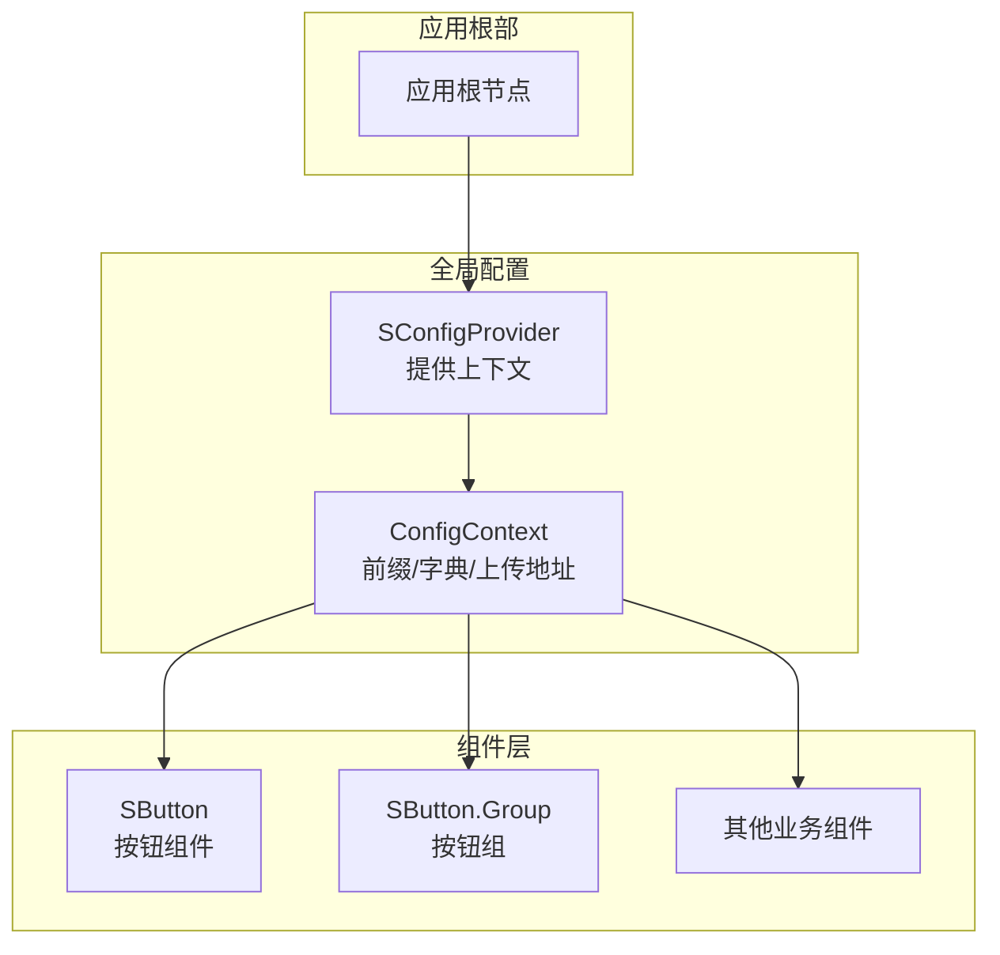
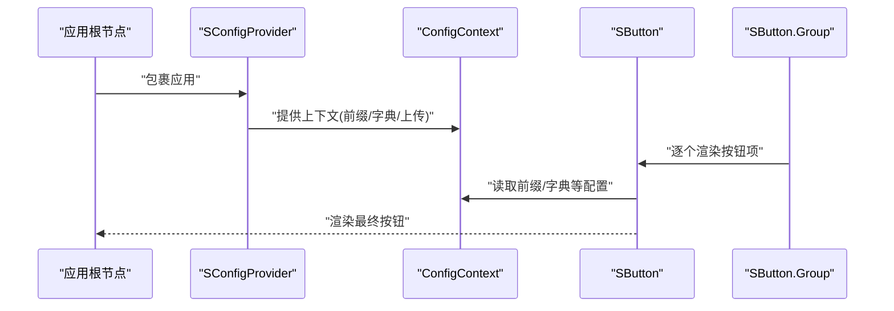
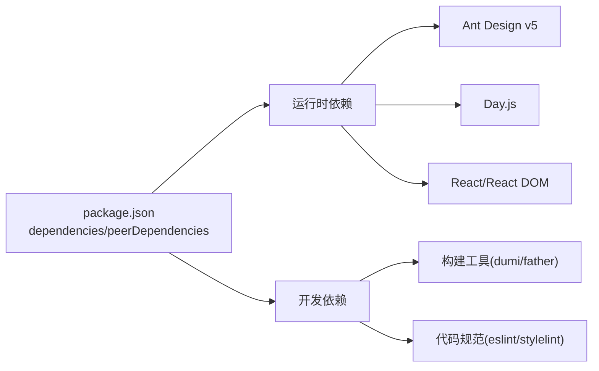

# 快速开始

<cite>
**本文引用的文件**
- [package.json](file://package.json)
- [README.md](file://README.md)
- [.dumirc.ts](file://.dumirc.ts)
- [src/index.ts](file://src/index.ts)
- [src/components/index.ts](file://src/components/index.ts)
- [src/components/button/index.tsx](file://src/components/button/index.tsx)
- [src/components/button/types.ts](file://src/components/button/types.ts)
- [src/components/button/demos/basic.tsx](file://src/components/button/demos/basic.tsx)
- [src/components/config-provider/index.tsx](file://src/components/config-provider/index.tsx)
- [src/theme/default.less](file://src/theme/default.less)
- [.fatherrc.ts](file://.fatherrc.ts)
- [tsconfig.json](file://tsconfig.json)
- [docs/introduce-cn/index.md](file://docs/introduce-cn/index.md)
</cite>

## 目录

1. [简介](#简介)
2. [项目结构](#项目结构)
3. [核心组件](#核心组件)
4. [架构总览](#架构总览)
5. [详细组件分析](#详细组件分析)
6. [依赖分析](#依赖分析)
7. [性能考虑](#性能考虑)
8. [故障排查指南](#故障排查指南)
9. [结论](#结论)
10. [附录](#附录)

## 简介

本指南面向首次接触 SDesign 组件库的开发者，帮助你在最短时间内完成安装、配置与首个组件的使用。SDesign 是基于 Ant Design 的业务组件库，提供统一的主题与国际化能力，并通过 CSS-in-JS 方案增强样式可维护性。

## 项目结构

SDesign 采用“组件+Hooks+工具”的分层组织方式，顶层导出聚合了所有模块，便于按需或整体引入。文档站点由 dumi 提供，支持本地开发与构建。

图表来源

- [src/index.ts](file://src/index.ts#L1-L5)
- [src/components/index.ts](file://src/components/index.ts#L1-L81)
- [.dumirc.ts](file://.dumirc.ts#L1-L22)
- [tsconfig.json](file://tsconfig.json#L1-L26)
- [.fatherrc.ts](file://.fatherrc.ts#L1-L13)

章节来源

- [src/index.ts](file://src/index.ts#L1-L5)
- [src/components/index.ts](file://src/components/index.ts#L1-L81)
- [.dumirc.ts](file://.dumirc.ts#L1-L22)
- [tsconfig.json](file://tsconfig.json#L1-L26)
- [.fatherrc.ts](file://.fatherrc.ts#L1-L13)

## 核心组件

- 组件导出：通过顶层导出统一暴露组件、Hooks、图标与工具，便于集中引入与按需使用。
- 类型导出：组件类型定义随组件一起导出，确保 TypeScript 场景下的类型安全。
- 示例演示：每个组件提供 demos 目录，展示典型用法与参数组合。

章节来源

- [src/index.ts](file://src/index.ts#L1-L5)
- [src/components/index.ts](file://src/components/index.ts#L1-L81)

## 架构总览

SDesign 的运行时架构围绕“全局配置提供者 + 组件 + Hooks + 工具”展开。全局配置提供者负责注入前缀、全局字典与上传地址等上下文；组件通过上下文读取配置；Hooks 则提供状态与交互逻辑的抽象。

图表来源

- [src/components/config-provider/index.tsx](file://src/components/config-provider/index.tsx#L1-L47)
- [src/components/button/index.tsx](file://src/components/button/index.tsx#L1-L15)

章节来源

- [src/components/config-provider/index.tsx](file://src/components/config-provider/index.tsx#L1-L47)
- [src/components/button/index.tsx](file://src/components/button/index.tsx#L1-L15)

## 详细组件分析

### 按钮组件（SButton）与按钮组（SButton.Group）

- 设计要点
  - SButton 为实例化按钮，同时挂载 Group 子组件，形成“实例 + 组合”的导出模式。
  - SButton 接受 Ant Design Button 的原生属性，并扩展 actionType 字段以表达业务动作语义。
  - SButton.Group 接收一组按钮项，支持尺寸、间距与禁用/加载态的整体控制。
- 使用流程
  - 在应用根部包裹 SConfigProvider，确保全局上下文可用。
  - 引入 SButton 并通过 Group 传入 items 渲染一组业务按钮。
  - 如需自定义渲染或可见性控制，可通过 items 的 render/visible 字段实现。

图表来源

- [src/components/config-provider/index.tsx](file://src/components/config-provider/index.tsx#L1-L47)
- [src/components/button/index.tsx](file://src/components/button/index.tsx#L1-L15)
- [src/components/button/types.ts](file://src/components/button/types.ts#L52-L71)

章节来源

- [src/components/button/index.tsx](file://src/components/button/index.tsx#L1-L15)
- [src/components/button/types.ts](file://src/components/button/types.ts#L1-L72)
- [src/components/button/demos/basic.tsx](file://src/components/button/demos/basic.tsx#L1-L29)

### 全局配置提供者（SConfigProvider）

- 职责
  - 提供 getPrefixCls、globalDict、uploadUrl 等全局配置。
  - 通过 React Context 向下传递，使子组件无需感知具体实现。
- 最佳实践
  - 将 SConfigProvider 放置在应用根部，确保全站生效。
  - 通过 globalDict 注入字典数据，减少组件内重复请求。

章节来源

- [src/components/config-provider/index.tsx](file://src/components/config-provider/index.tsx#L1-L47)

### 主题与国际化

- 主题变量
  - 默认主题文件提供命名空间前缀，便于 CSS 变量隔离。
- 国际化
  - 文档站点与组件库均基于 Ant Design，遵循其国际化约定。可在应用侧通过 Ant Design 的 ConfigProvider 进行语言切换。

章节来源

- [src/theme/default.less](file://src/theme/default.less#L1-L2)

## 依赖分析

- 运行时依赖
  - react、react-dom、antd、dayjs、@ant-design/icons、lucide-react、ahooks、antd-style、axios、classnames、copy-to-clipboard、lodash、react-error-boundary 等。
- 对外声明依赖
  - peerDependencies 明确要求 React、ReactDOM、Ant Design v5、Day.js、Lucide React、React Router 等版本范围。
- 开发与构建
  - dumi、father、@rsbuild 插件、TypeScript、ESLint、Stylelint 等工具链参与开发与构建。

图表来源

- [package.json](file://package.json#L52-L101)

章节来源

- [package.json](file://package.json#L52-L101)

## 性能考虑

- 按需引入：优先使用按需导入，避免整包引入导致体积膨胀。
- 组件懒加载：对重型组件（如表格、表单）结合路由或条件渲染实现懒加载。
- 样式优化：利用 antd-style 的 CSS-in-JS 能力，避免全局污染并提升样式复用效率。
- 缓存策略：合理缓存字典与静态资源，减少重复请求。

## 故障排查指南

- 安装与构建
  - 若安装失败，请确认 Node 版本满足最低要求，并优先使用 pnpm 进行依赖安装。
  - 构建失败时，先执行“健康检查”脚本，定位潜在问题。
- 文档与示例
  - 文档站点无法访问：检查 dumi 配置与输出目录，确认本地开发与构建命令正确。
- 运行时错误
  - 未包裹全局配置提供者：SButton 等组件可能无法读取前缀或字典，导致样式或行为异常。
  - 类型报错：确保 TypeScript 路径别名与导出一致，必要时清理编译缓存后重试。

章节来源

- [README.md](file://README.md#L13-L33)
- [.dumirc.ts](file://.dumirc.ts#L1-L22)
- [tsconfig.json](file://tsconfig.json#L1-L26)

## 结论

通过本指南，你已掌握 SDesign 的安装、依赖要求、基础配置与首个组件的使用方法。建议在实际项目中：

- 在应用根部引入 SConfigProvider；
- 从 SButton 开始，逐步引入更多业务组件；
- 善用 Hooks 与工具函数，提升开发效率；
- 关注构建与文档工具链，保障开发体验与质量。

## 附录

### 安装与初始化

- 安装命令（任选其一）
  - npm：参考文档中的安装示例。
  - pnpm：参考文档中的安装示例。
- 初始化步骤
  - 在应用根部引入 SConfigProvider，注入必要的全局配置。
  - 引入所需组件（例如 SButton），并在页面中直接使用。

章节来源

- [docs/introduce-cn/index.md](file://docs/introduce-cn/index.md#L15-L27)

### 基础配置

- 全局配置提供者
  - 在应用根部包裹 SConfigProvider，设置前缀、字典与上传地址等。
- 主题与国际化
  - 主题变量前缀位于默认主题文件；国际化遵循 Ant Design 的约定。

章节来源

- [src/components/config-provider/index.tsx](file://src/components/config-provider/index.tsx#L1-L47)
- [src/theme/default.less](file://src/theme/default.less#L1-L2)

### 第一个组件：按钮（SButton）

- 基本用法
  - 通过 SButton.Group 传入 items，渲染一组业务按钮。
  - 可根据需要设置尺寸、间距与禁用/加载态。
- 进阶用法
  - 自定义渲染与可见性控制：通过 items 的 render/visible 实现灵活布局。
  - 业务动作语义：使用 actionType 表达保存、取消、删除等业务动作。

章节来源

- [src/components/button/demos/basic.tsx](file://src/components/button/demos/basic.tsx#L1-L29)
- [src/components/button/types.ts](file://src/components/button/types.ts#L52-L71)

### 开发环境与调试

- 本地开发
  - 使用文档站点进行组件演示与调试。
- 构建与发布
  - 通过构建脚本生成产物，确保类型与样式正确输出。
- 健康检查
  - 使用“健康检查”脚本排查潜在问题，保证发布质量。

章节来源

- [README.md](file://README.md#L13-L33)
- [.fatherrc.ts](file://.fatherrc.ts#L1-L13)
