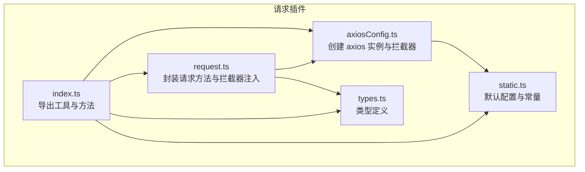
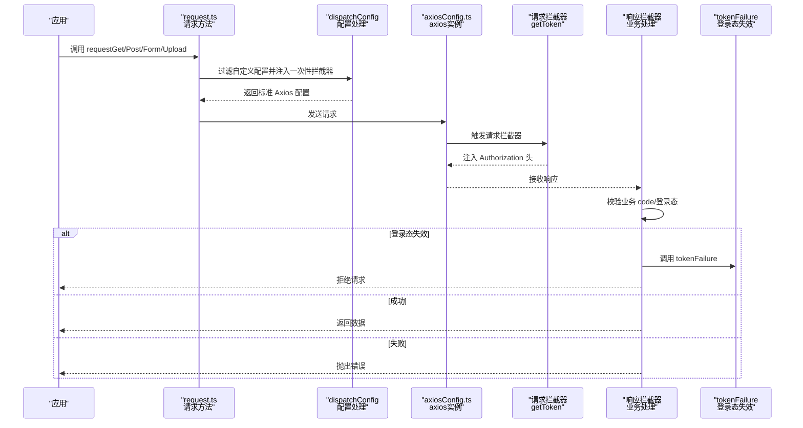
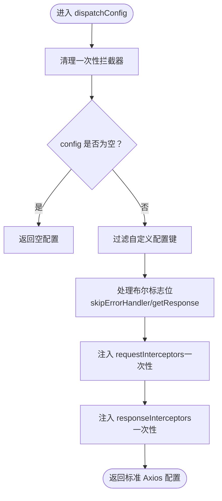
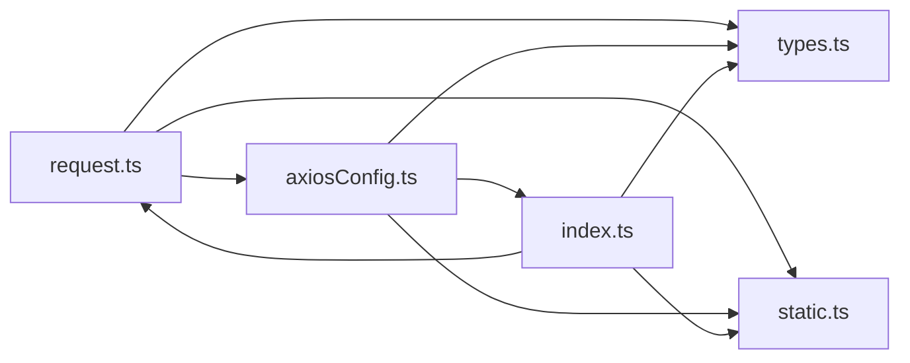

# HTTP 请求插件

<cite>
**本文档引用的文件**
- [src/plugins/request/index.ts](file://src/plugins/request/index.ts)
- [src/plugins/request/request.ts](file://src/plugins/request/request.ts)
- [src/plugins/request/axiosConfig.ts](file://src/plugins/request/axiosConfig.ts)
- [src/plugins/request/types.ts](file://src/plugins/request/types.ts)
- [src/plugins/request/static.ts](file://src/plugins/request/static.ts)
</cite>

## 目录

1. [简介](#简介)
2. [项目结构](#项目结构)
3. [核心组件](#核心组件)
4. [架构总览](#架构总览)
5. [详细组件分析](#详细组件分析)
6. [依赖关系分析](#依赖关系分析)
7. [性能考虑](#性能考虑)
8. [故障排除指南](#故障排除指南)
9. [结论](#结论)
10. [附录](#附录)

## 简介

本文件系统性地文档化了基于 axios 的 HTTP 请求插件，涵盖请求配置、拦截器设置、响应处理机制以及核心方法的使用方式。重点包括：

- 前置拦截器 getToken 的实现原理与认证机制
- 后置拦截器 tokenFailure 的错误处理逻辑
- 请求配置选项、超时设置、重试机制与错误处理策略
- requestGet、requestPost、requestForm、requestUpload 等核心方法的使用与参数配置
- 实际使用示例路径与最佳实践
- 性能优化建议与调试方法

## 项目结构

该插件位于 src/plugins/request 目录下，采用模块化设计，职责清晰：

- axiosConfig.ts：创建 axios 实例并统一配置请求/响应拦截器
- request.ts：封装 GET、POST、表单提交、文件上传等核心方法，并支持一次性拦截器注入
- index.ts：导出工具函数（如 getToken、tokenFailure）与核心方法
- types.ts：定义请求/响应类型与配置接口
- static.ts：默认配置常量与错误映射表

图表来源

- [src/plugins/request/axiosConfig.ts](file://src/plugins/request/axiosConfig.ts#L1-L120)
- [src/plugins/request/request.ts](file://src/plugins/request/request.ts#L1-L175)
- [src/plugins/request/index.ts](file://src/plugins/request/index.ts#L1-L33)
- [src/plugins/request/types.ts](file://src/plugins/request/types.ts#L1-L28)
- [src/plugins/request/static.ts](file://src/plugins/request/static.ts#L1-L33)

章节来源

- [src/plugins/request/axiosConfig.ts](file://src/plugins/request/axiosConfig.ts#L1-L120)
- [src/plugins/request/request.ts](file://src/plugins/request/request.ts#L1-L175)
- [src/plugins/request/index.ts](file://src/plugins/request/index.ts#L1-L33)
- [src/plugins/request/types.ts](file://src/plugins/request/types.ts#L1-L28)
- [src/plugins/request/static.ts](file://src/plugins/request/static.ts#L1-L33)

## 核心组件

- axios 实例与拦截器
  - 在 axiosConfig.ts 中创建 axios 实例，默认超时为 10000ms；注册请求/响应拦截器。
  - 请求拦截器：调用 getToken 将本地 token 注入 Authorization 头。
  - 响应拦截器：根据业务 code 判断成功/失败，处理登录态失效、消息提示与错误抛出。
- 请求方法封装
  - request.ts 提供 requestGet、requestPost、requestForm、requestUpload 四类方法，统一处理配置过滤、一次性拦截器注入与 FormData 构造。
- 工具函数
  - index.ts 导出 getToken（从 localStorage 获取 token 并写入 Authorization）、tokenFailure（登录态失效时的消息提示与日志输出）。
- 类型与常量
  - types.ts 定义响应结构、请求配置接口与自定义头字段类型。
  - static.ts 定义默认状态码、错误映射与自定义配置键列表。

章节来源

- [src/plugins/request/axiosConfig.ts](file://src/plugins/request/axiosConfig.ts#L1-L120)
- [src/plugins/request/request.ts](file://src/plugins/request/request.ts#L1-L175)
- [src/plugins/request/index.ts](file://src/plugins/request/index.ts#L1-L33)
- [src/plugins/request/types.ts](file://src/plugins/request/types.ts#L1-L28)
- [src/plugins/request/static.ts](file://src/plugins/request/static.ts#L1-L33)

## 架构总览

请求插件的整体流程如下：

- 应用通过 requestGet/requestPost/requestForm/requestUpload 发起请求
- dispatchConfig 过滤自定义配置并注入一次性拦截器
- axios 实例在请求拦截器阶段注入 Authorization 头
- 服务器返回后，响应拦截器根据业务 code 决定返回数据或抛出错误
- 若登录态失效，触发 tokenFailure 并拒绝请求

图表来源

- [src/plugins/request/request.ts](file://src/plugins/request/request.ts#L41-L108)
- [src/plugins/request/axiosConfig.ts](file://src/plugins/request/axiosConfig.ts#L15-L117)
- [src/plugins/request/index.ts](file://src/plugins/request/index.ts#L9-L23)

## 详细组件分析

### axiosConfig.ts：实例创建与拦截器

- 实例创建
  - 创建 axios 实例，设置默认超时时间（毫秒），不设置 baseURL（避免代理场景下的冲突）。
- 请求拦截器
  - 在请求发送前调用 getToken，将 token 写入 Authorization 头；若请求本身出错，统一提示并拒绝。
- 响应拦截器
  - 解析自定义头字段（getResponse、skipErrorHandler），用于决定返回完整响应还是仅返回 data 字段。
  - 登录态失效判断：当响应 code 属于登录态失效列表时，调用 tokenFailure 并拒绝请求。
  - Blob 类型响应直接透传。
  - 成功条件：业务 code 等于默认成功码时返回数据；否则根据 status 或错误信息提示并拒绝。
  - 错误处理：根据响应状态码映射到友好文案，或兜底“网络异常”提示。

章节来源

- [src/plugins/request/axiosConfig.ts](file://src/plugins/request/axiosConfig.ts#L1-L120)

### request.ts：请求方法与拦截器注入

- 清理一次性拦截器
  - 每次请求前清理上一次注入的一次性拦截器，避免重复叠加。
- dispatchConfig：配置处理
  - 过滤自定义配置键（skipErrorHandler、getResponse、requestInterceptors、responseInterceptors）。
  - 将布尔值转换为字符串写入 headers 对应键，供响应拦截器读取。
  - 注入 requestInterceptors 与 responseInterceptors 为一次性拦截器，支持数组形式（含错误回调）。
- requestGet
  - 支持两种调用方式：传入 params 使用通用 http(url, options)；否则使用 http.get(url, options)。
- requestPost
  - 直接使用 http.post(url, data, options)。
- requestForm
  - 构造 FormData，自动设置 content-type 为 multipart/form-data，适合普通键值表单提交。
- requestUpload
  - 构造 FormData，自动设置 content-type 为 multipart/form-data，适合文件上传场景。

图表来源

- [src/plugins/request/request.ts](file://src/plugins/request/request.ts#L20-L108)

章节来源

- [src/plugins/request/request.ts](file://src/plugins/request/request.ts#L1-L175)

### index.ts：工具函数与导出

- getToken
  - 从 localStorage 获取 token，存在则写入 config.headers.Authorization。
- tokenFailure
  - 通过消息提示与控制台输出响应信息，用于登录态失效场景。

章节来源

- [src/plugins/request/index.ts](file://src/plugins/request/index.ts#L1-L33)

### types.ts：类型定义

- ResponseStructure：统一响应结构（success、data、code、msg）
- RequestConfig：请求配置接口（skipErrorHandler、getResponse、requestInterceptors、responseInterceptors）
- CustomizeResultHeader：自定义响应头字段类型（'0'/'1'）
- RequestType：RequestConfig 与 AxiosRequestConfig 的联合类型

章节来源

- [src/plugins/request/types.ts](file://src/plugins/request/types.ts#L1-L28)

### static.ts：默认配置与常量

- ERROR_MESSAGE_MAP：HTTP 状态码到友好文案的映射
- DEFAULT_CONFIG：默认成功码、超时时间、登录态失效 code 列表
- CUSTOMIZE_CONFIG：自定义配置键列表（用于过滤）

章节来源

- [src/plugins/request/static.ts](file://src/plugins/request/static.ts#L1-L33)

## 依赖关系分析

- 模块耦合
  - request.ts 依赖 axiosConfig.ts（http 实例）、static.ts（常量）、types.ts（类型）。
  - axiosConfig.ts 依赖 index.ts（getToken、tokenFailure）、static.ts、types.ts。
  - index.ts 依赖 request.ts（导出方法）、types.ts。
- 关键依赖链
  - request.ts -> axiosConfig.ts -> index.ts -> types.ts、static.ts
  - axiosConfig.ts -> static.ts、types.ts

图表来源

- [src/plugins/request/request.ts](file://src/plugins/request/request.ts#L1-L10)
- [src/plugins/request/axiosConfig.ts](file://src/plugins/request/axiosConfig.ts#L1-L8)
- [src/plugins/request/index.ts](file://src/plugins/request/index.ts#L1-L6)
- [src/plugins/request/types.ts](file://src/plugins/request/types.ts#L1-L28)
- [src/plugins/request/static.ts](file://src/plugins/request/static.ts#L1-L33)

章节来源

- [src/plugins/request/request.ts](file://src/plugins/request/request.ts#L1-L10)
- [src/plugins/request/axiosConfig.ts](file://src/plugins/request/axiosConfig.ts#L1-L8)
- [src/plugins/request/index.ts](file://src/plugins/request/index.ts#L1-L6)
- [src/plugins/request/types.ts](file://src/plugins/request/types.ts#L1-L28)
- [src/plugins/request/static.ts](file://src/plugins/request/static.ts#L1-L33)

## 性能考虑

- 超时设置
  - 默认超时 10000ms，可根据接口特性调整；对长耗时接口可适当提高。
- 一次性拦截器
  - 每次请求前清理上一次注入的拦截器，避免重复叠加导致性能下降与内存泄漏风险。
- 数据体积
  - 表单与文件上传建议分批提交，避免一次性传输过大数据。
- 缓存策略
  - 对频繁查询的 GET 接口，可在上层结合缓存策略减少重复请求。
- 日志与监控
  - 在开发环境开启必要的日志输出，生产环境谨慎记录敏感信息。

## 故障排除指南

- 登录态失效
  - 现象：响应 code 属于登录态失效列表时，触发 tokenFailure 并拒绝请求。
  - 处理：确保本地 token 存储正确，必要时刷新 token 或引导重新登录。
- 错误处理跳过
  - 当设置 skipErrorHandler 为真时，错误不会被统一处理，需自行捕获并处理。
- 响应数据结构
  - 若期望返回完整响应而非 data 字段，设置 getResponse 为真。
- 网络异常
  - 无 response 且存在 message 时，统一提示“网络异常”，检查网络与代理配置。
- 状态码映射
  - 参考 ERROR_MESSAGE_MAP 映射到友好文案，便于前端提示与定位问题。

章节来源

- [src/plugins/request/axiosConfig.ts](file://src/plugins/request/axiosConfig.ts#L39-L117)
- [src/plugins/request/static.ts](file://src/plugins/request/static.ts#L1-L33)

## 结论

该 HTTP 请求插件以 axios 为基础，提供了统一的请求封装与拦截器机制，具备以下优势：

- 明确的认证流程（Authorization 头注入）
- 可配置的错误处理与响应数据结构
- 支持一次性拦截器注入，满足灵活扩展需求
- 清晰的类型定义与默认配置，便于维护与二次开发

## 附录

### 核心方法与参数说明

- requestGet(url, params?, config?)
  - 用途：GET 请求
  - 参数：
    - url：请求地址
    - params：查询参数（可选）
    - config：请求配置（可选），支持 skipErrorHandler、getResponse、requestInterceptors、responseInterceptors
- requestPost(url, data, config?)
  - 用途：POST 请求（JSON）
  - 参数：
    - url：请求地址
    - data：请求体
    - config：请求配置（可选）
- requestForm(url, data, config?)
  - 用途：表单提交（multipart/form-data）
  - 参数：
    - url：请求地址
    - data：键值对象
    - config：请求配置（可选）
- requestUpload(url, data, config?)
  - 用途：文件上传（multipart/form-data）
  - 参数：
    - url：请求地址
    - data：键值对象（包含文件字段）
    - config：请求配置（可选）

章节来源

- [src/plugins/request/request.ts](file://src/plugins/request/request.ts#L110-L172)

### 使用示例（路径）

- GET 请求
  - 示例路径：[src/plugins/request/request.ts](file://src/plugins/request/request.ts#L110-L122)
- POST 请求
  - 示例路径：[src/plugins/request/request.ts](file://src/plugins/request/request.ts#L124-L132)
- 表单提交
  - 示例路径：[src/plugins/request/request.ts](file://src/plugins/request/request.ts#L134-L152)
- 文件上传
  - 示例路径：[src/plugins/request/request.ts](file://src/plugins/request/request.ts#L154-L172)

### 认证机制与错误处理

- 认证机制
  - 前置拦截器：从 localStorage 读取 token 并写入 Authorization 头
  - 参考路径：[src/plugins/request/index.ts](file://src/plugins/request/index.ts#L9-L17)
- 登录态失效处理
  - 响应拦截器检测登录态失效 code，调用 tokenFailure 并拒绝请求
  - 参考路径：[src/plugins/request/axiosConfig.ts](file://src/plugins/request/axiosConfig.ts#L46-L49)
- 错误处理策略
  - 统一错误提示与日志输出，支持跳过错误处理
  - 参考路径：[src/plugins/request/axiosConfig.ts](file://src/plugins/request/axiosConfig.ts#L70-L117)
