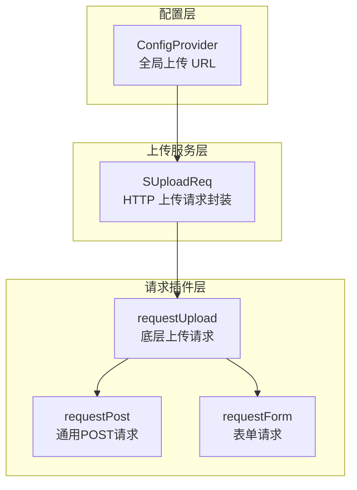
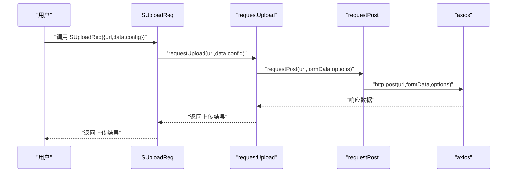
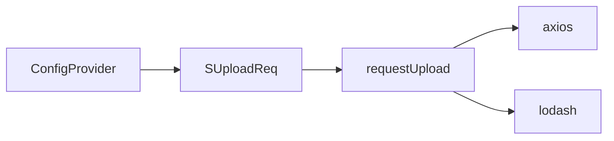

# 上传服务插件

<cite>
**本文档引用的文件**
- [src/service/upload/index.ts](file://src/service/upload/index.ts)
- [src/plugins/request/index.ts](file://src/plugins/request/index.ts)
- [src/plugins/request/request.ts](file://src/plugins/request/request.ts)
- [src/components/config-provider/index.md](file://src/components/config-provider/index.md)
- [src/components/config-provider/types.ts](file://src/components/config-provider/types.ts)
- [docs/version/index.md](file://docs/version/index.md)
</cite>

## 更新摘要

**所做更改**

- 更新上传服务插件文档以反映上传组件系统的完全移除
- 修订架构概述以体现从完整上传组件到仅剩底层上传请求服务的变化
- 更新核心组件部分以说明当前可用的 SUploadReq 服务
- 修改详细组件分析以反映服务层的简化架构
- 更新依赖关系分析以体现移除的组件依赖
- 更新故障排查指南以适应新的服务架构
- 更新附录部分以提供基于现有服务的新示例

## 目录

1. [简介](#简介)
2. [项目结构](#项目结构)
3. [核心组件](#核心组件)
4. [架构总览](#架构总览)
5. [详细组件分析](#详细组件分析)
6. [依赖关系分析](#依赖关系分析)
7. [性能考虑](#性能考虑)
8. [故障排查指南](#故障排查指南)
9. [结论](#结论)
10. [附录：完整示例与最佳实践](#附录完整示例与最佳实践)

## 简介

**更新** 本文件系统性介绍基于 HTTP 请求插件的文件上传服务架构。由于整个上传组件系统已被完全移除，当前仅提供底层的上传请求服务封装，包括上传配置、进度监控和文件处理流程。通过统一的 SUploadReq 服务，实现从基础文件上传到进度监控的完整服务支持。

## 项目结构

**更新** 上传服务插件位于 service/upload 目录，采用"服务封装 + 请求插件"的简化设计：

- 服务层：SUploadReq（HTTP 上传请求封装），提供文件上传的核心功能
- 请求插件：@dalydb/sdesign/plugins/request，提供底层的请求基础设施
- 配置层：ConfigProvider（全局上传 URL 注入），通过 uploadUrl 属性提供上传路径配置

**图表来源**

- [src/service/upload/index.ts](file://src/service/upload/index.ts#L1-L20)
- [src/plugins/request/request.ts](file://src/plugins/request/request.ts#L154-L172)
- [src/plugins/request/index.ts](file://src/plugins/request/index.ts#L25-L32)

**章节来源**

- [src/service/upload/index.ts](file://src/service/upload/index.ts#L1-L20)
- [src/plugins/request/index.ts](file://src/plugins/request/index.ts#L1-L33)
- [src/plugins/request/request.ts](file://src/plugins/request/request.ts#L1-L175)
- [src/components/config-provider/index.md](file://src/components/config-provider/index.md#L1-L20)

## 核心组件

**更新** 由于上传组件系统已被移除，当前仅提供以下核心组件：

- SUploadReq：HTTP 上传请求封装，提供文件上传的核心功能
- requestUpload：底层上传请求函数，基于 axios 实现
- ConfigProvider：全局上传 URL 配置，通过 uploadUrl 属性提供上传路径

**章节来源**

- [src/service/upload/index.ts](file://src/service/upload/index.ts#L1-L20)
- [src/plugins/request/request.ts](file://src/plugins/request/request.ts#L154-L172)
- [src/components/config-provider/index.md](file://src/components/config-provider/index.md#L16-L19)

## 架构总览

**更新** 上传流程从调用 SUploadReq 开始，通过 requestUpload 发起 HTTP POST 请求，支持进度回调和配置参数传递。

**图表来源**

- [src/service/upload/index.ts](file://src/service/upload/index.ts#L13-L19)
- [src/plugins/request/request.ts](file://src/plugins/request/request.ts#L154-L172)
- [src/plugins/request/request.ts](file://src/plugins/request/request.ts#L124-L132)

## 详细组件分析

### SUploadReq：上传请求封装

**更新** 作为唯一的上传服务组件，SUploadReq 负责：

- 统一处理上传请求参数（url、data、config）
- 提供默认上传路径：/gateway/program/attachment/upload
- 支持自定义上传 URL 覆盖默认路径
- 透传配置参数给底层请求插件

关键特性：

- 参数解析：接收 url、data、config 三个参数
- 默认值处理：当 url 未提供时使用默认上传路径
- 配置透传：将 config 参数直接传递给 requestUpload 函数

**章节来源**

- [src/service/upload/index.ts](file://src/service/upload/index.ts#L4-L19)

### 底层请求插件：requestUpload

**更新** requestUpload 是上传功能的底层实现：

- 基于 axios 的 HTTP POST 请求
- 自动处理 FormData 格式
- 设置正确的 content-type 头部
- 支持自定义请求配置
- 提供进度回调支持

实现细节：

- 创建 FormData 对象并填充数据
- 设置 headers.content-type 为 multipart/form-data
- 调用 http.post 发送请求
- 返回 Promise 处理异步响应

**章节来源**

- [src/plugins/request/request.ts](file://src/plugins/request/request.ts#L154-L172)

### ConfigProvider：全局配置

**更新** ConfigProvider 仍保留 uploadUrl 配置项：

- 提供全局上传 URL 配置
- 作为 SUploadReq 的后备 URL 源
- 支持在组件树中注入上传路径

配置项：

- uploadUrl：文件上传路径字符串
- 其他配置项保持不变

**章节来源**

- [src/components/config-provider/index.md](file://src/components/config-provider/index.md#L16-L19)
- [src/components/config-provider/types.ts](file://src/components/config-provider/types.ts#L6-L7)

## 依赖关系分析

**更新** 由于上传组件系统被移除，当前依赖关系大幅简化：

- SUploadReq 依赖 @dalydb/sdesign/plugins/request 的 requestUpload
- requestUpload 依赖 axios 和 lodash 工具库
- ConfigProvider 依赖 antd 的 message 组件（用于错误提示）

**图表来源**

- [src/service/upload/index.ts](file://src/service/upload/index.ts#L1-L2)
- [src/plugins/request/request.ts](file://src/plugins/request/request.ts#L1-L9)
- [src/plugins/request/index.ts](file://src/plugins/request/index.ts#L1-L6)

**章节来源**

- [src/service/upload/index.ts](file://src/service/upload/index.ts#L1-L2)
- [src/plugins/request/request.ts](file://src/plugins/request/request.ts#L1-L9)
- [src/plugins/request/index.ts](file://src/plugins/request/index.ts#L1-L6)

## 性能考虑

**更新** 当前架构的性能优化建议：

- 请求配置缓存：合理使用 ConfigProvider 缓存上传 URL 配置
- 数据格式优化：确保上传数据格式正确，避免不必要的数据转换
- 进度回调优化：在前端按需处理进度回调，避免频繁 UI 更新
- 错误处理：利用 ConfigProvider 的全局错误处理机制
- 内存管理：及时清理上传过程中的临时数据和事件监听器

## 故障排查指南

**更新** 当前架构的故障排查：

- 上传 URL 配置问题
  - 现象：上传请求失败或使用错误的上传路径
  - 处理：检查 ConfigProvider 的 uploadUrl 配置或直接传入 url 参数
- 请求配置问题
  - 现象：上传请求格式错误或缺少必要的头部信息
  - 处理：确认 data 参数格式正确，确保包含必要的上传字段
- 网络连接问题
  - 现象：请求超时或网络错误
  - 处理：检查网络连接和服务器状态
- 权限认证问题
  - 现象：401 或 403 错误
  - 处理：检查 Token 配置和权限设置

**章节来源**

- [src/components/config-provider/index.md](file://src/components/config-provider/index.md#L16-L19)
- [src/plugins/request/request.ts](file://src/plugins/request/request.ts#L154-L172)

## 结论

**更新** 上传服务插件已从完整的上传组件系统简化为仅剩的 SUploadReq 服务。虽然移除了复杂的组件封装和 Hooks 抽象，但保留了核心的上传请求能力。当前架构更加简洁，专注于提供可靠的上传服务封装，开发者可以直接使用 SUploadReq 进行文件上传操作。

## 附录：完整示例与最佳实践

### 基础上传服务使用

**更新** 使用 SUploadReq 进行文件上传：

- 基本用法：直接调用 SUploadReq({ data, config })
- 自定义 URL：SUploadReq({ url: '/custom/upload', data, config })
- 进度监控：通过 config.onUploadProgress 监控上传进度

### 与 ConfigProvider 集成

**更新** 通过 ConfigProvider 提供全局上传配置：

- 在应用根部配置 ConfigProvider
- 设置 uploadUrl 属性提供默认上传路径
- 子组件可通过 SUploadReq 直接使用全局配置

### 错误处理最佳实践

**更新** 使用 ConfigProvider 的全局错误处理：

- 利用 ConfigProvider 的 tokenFailure 处理认证错误
- 通过 config.skipErrorHandler 控制错误处理行为
- 结合 axios 的拦截器实现统一的请求处理

### 性能优化建议

**更新** 当前架构的性能优化：

- 合理使用 ConfigProvider 缓存配置
- 优化上传数据格式，减少不必要的数据传输
- 实现适当的进度回调节流，避免频繁 UI 更新
- 使用 axios 的请求/响应拦截器实现统一的性能监控

**章节来源**

- [src/service/upload/index.ts](file://src/service/upload/index.ts#L13-L19)
- [src/components/config-provider/index.md](file://src/components/config-provider/index.md#L16-L19)
- [src/plugins/request/index.ts](file://src/plugins/request/index.ts#L20-L23)
