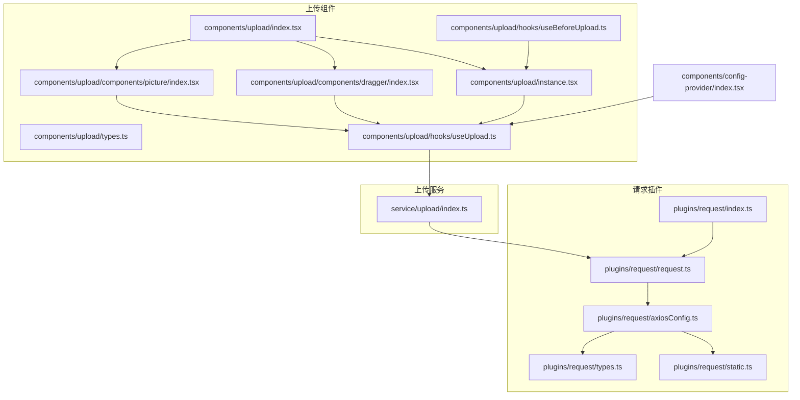
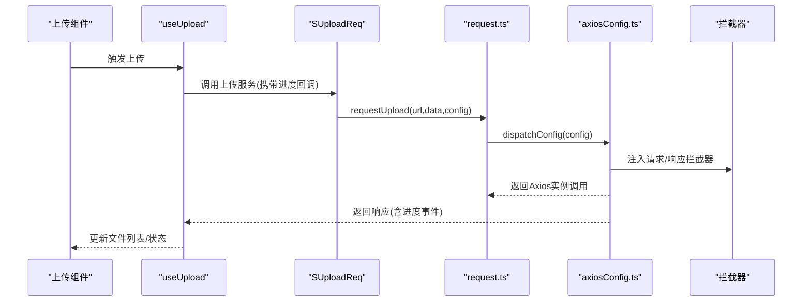
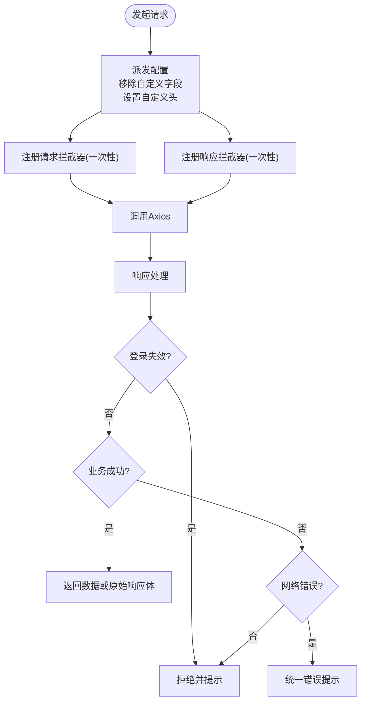
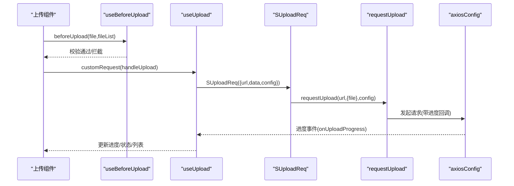
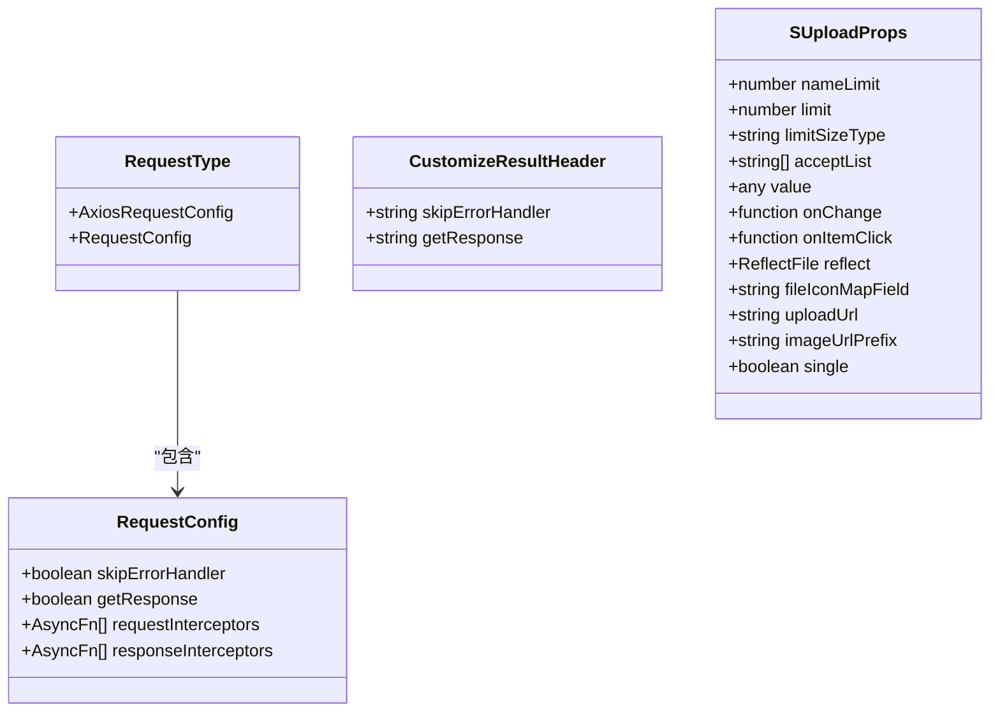
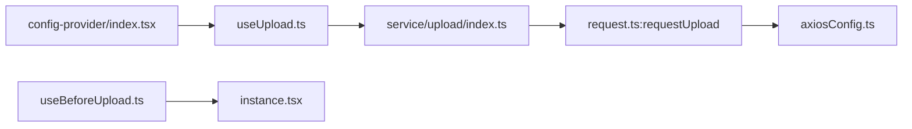

# 插件系统

<cite>
**本文引用的文件**
- [src/plugins/request/index.ts](file://src/plugins/request/index.ts)
- [src/plugins/request/request.ts](file://src/plugins/request/request.ts)
- [src/plugins/request/axiosConfig.ts](file://src/plugins/request/axiosConfig.ts)
- [src/plugins/request/static.ts](file://src/plugins/request/static.ts)
- [src/plugins/request/types.ts](file://src/plugins/request/types.ts)
- [src/service/upload/index.ts](file://src/service/upload/index.ts)
- [src/components/upload/index.tsx](file://src/components/upload/index.tsx)
- [src/components/upload/instance.tsx](file://src/components/upload/instance.tsx)
- [src/components/upload/hooks/useUpload.ts](file://src/components/upload/hooks/useUpload.ts)
- [src/components/upload/hooks/useBeforeUpload.ts](file://src/components/upload/hooks/useBeforeUpload.ts)
- [src/components/upload/components/dragger/index.tsx](file://src/components/upload/components/dragger/index.tsx)
- [src/components/upload/components/picture/index.tsx](file://src/components/upload/components/picture/index.tsx)
- [src/components/upload/types.ts](file://src/components/upload/types.ts)
- [src/components/config-provider/index.tsx](file://src/components/config-provider/index.tsx)
- [package.json](file://package.json)
</cite>

## 目录

1. [简介](#简介)
2. [项目结构](#项目结构)
3. [核心组件](#核心组件)
4. [架构总览](#架构总览)
5. [详细组件分析](#详细组件分析)
6. [依赖分析](#依赖分析)
7. [性能考虑](#性能考虑)
8. [故障排除指南](#故障排除指南)
9. [结论](#结论)
10. [附录](#附录)

## 简介

本文件系统性梳理 SDesign 插件系统的插件化架构与扩展机制，重点覆盖以下方面：

- HTTP 请求插件：统一的请求封装、拦截器机制、错误处理策略与可配置项
- 上传插件：文件处理流程、进度监控、前置校验与配置选项
- 插件注册与生命周期：拦截器的注册与清理、请求配置的派发与转换
- 开发最佳实践：如何创建自定义插件、集成第三方服务
- 性能优化与调试：拦截器开销控制、错误处理与日志建议
- 故障排除：常见问题定位与解决思路

## 项目结构

SDesign 的插件系统主要由“请求插件”和“上传插件”两大模块构成，并通过 React 组件与 Hooks 完成 UI 层集成。整体结构如下：

图表来源

- [src/plugins/request/index.ts](file://src/plugins/request/index.ts#L1-L33)
- [src/plugins/request/request.ts](file://src/plugins/request/request.ts#L1-L175)
- [src/plugins/request/axiosConfig.ts](file://src/plugins/request/axiosConfig.ts#L1-L120)
- [src/plugins/request/static.ts](file://src/plugins/request/static.ts#L1-L33)
- [src/plugins/request/types.ts](file://src/plugins/request/types.ts#L1-L28)
- [src/service/upload/index.ts](file://src/service/upload/index.ts#L1-L20)
- [src/components/upload/index.tsx](file://src/components/upload/index.tsx#L1-L18)
- [src/components/upload/instance.tsx](file://src/components/upload/instance.tsx#L1-L80)
- [src/components/upload/hooks/useUpload.ts](file://src/components/upload/hooks/useUpload.ts#L1-L292)
- [src/components/upload/hooks/useBeforeUpload.ts](file://src/components/upload/hooks/useBeforeUpload.ts#L1-L177)
- [src/components/upload/components/dragger/index.tsx](file://src/components/upload/components/dragger/index.tsx#L1-L102)
- [src/components/upload/components/picture/index.tsx](file://src/components/upload/components/picture/index.tsx#L1-L135)
- [src/components/upload/types.ts](file://src/components/upload/types.ts#L1-L66)
- [src/components/config-provider/index.tsx](file://src/components/config-provider/index.tsx#L1-L47)

章节来源

- [src/plugins/request/index.ts](file://src/plugins/request/index.ts#L1-L33)
- [src/plugins/request/request.ts](file://src/plugins/request/request.ts#L1-L175)
- [src/plugins/request/axiosConfig.ts](file://src/plugins/request/axiosConfig.ts#L1-L120)
- [src/plugins/request/static.ts](file://src/plugins/request/static.ts#L1-L33)
- [src/plugins/request/types.ts](file://src/plugins/request/types.ts#L1-L28)
- [src/service/upload/index.ts](file://src/service/upload/index.ts#L1-L20)
- [src/components/upload/index.tsx](file://src/components/upload/index.tsx#L1-L18)
- [src/components/upload/instance.tsx](file://src/components/upload/instance.tsx#L1-L80)
- [src/components/upload/hooks/useUpload.ts](file://src/components/upload/hooks/useUpload.ts#L1-L292)
- [src/components/upload/hooks/useBeforeUpload.ts](file://src/components/upload/hooks/useBeforeUpload.ts#L1-L177)
- [src/components/upload/components/dragger/index.tsx](file://src/components/upload/components/dragger/index.tsx#L1-L102)
- [src/components/upload/components/picture/index.tsx](file://src/components/upload/components/picture/index.tsx#L1-L135)
- [src/components/upload/types.ts](file://src/components/upload/types.ts#L1-L66)
- [src/components/config-provider/index.tsx](file://src/components/config-provider/index.tsx#L1-L47)

## 核心组件

- 请求插件
  - 统一导出：请求方法、拦截器工具、错误处理入口
  - 关键能力：前置/后置拦截器注册与清理、请求配置派发、响应结果解析与错误提示
- 上传插件
  - 服务层：封装上传请求，支持进度回调
  - 组件层：拖拽上传、图片墙上传、通用上传容器
  - Hooks：上传逻辑、前置校验、进度与状态管理

章节来源

- [src/plugins/request/index.ts](file://src/plugins/request/index.ts#L1-L33)
- [src/plugins/request/request.ts](file://src/plugins/request/request.ts#L1-L175)
- [src/plugins/request/axiosConfig.ts](file://src/plugins/request/axiosConfig.ts#L1-L120)
- [src/service/upload/index.ts](file://src/service/upload/index.ts#L1-L20)
- [src/components/upload/index.tsx](file://src/components/upload/index.tsx#L1-L18)
- [src/components/upload/instance.tsx](file://src/components/upload/instance.tsx#L1-L80)
- [src/components/upload/hooks/useUpload.ts](file://src/components/upload/hooks/useUpload.ts#L1-L292)
- [src/components/upload/hooks/useBeforeUpload.ts](file://src/components/upload/hooks/useBeforeUpload.ts#L1-L177)

## 架构总览

请求插件基于 Axios，提供统一的请求封装与拦截器机制；上传插件通过 Hooks 将上传流程与 UI 解耦，结合全局配置提供灵活的上传体验。

图表来源

- [src/components/upload/hooks/useUpload.ts](file://src/components/upload/hooks/useUpload.ts#L167-L214)
- [src/service/upload/index.ts](file://src/service/upload/index.ts#L13-L19)
- [src/plugins/request/request.ts](file://src/plugins/request/request.ts#L154-L172)
- [src/plugins/request/axiosConfig.ts](file://src/plugins/request/axiosConfig.ts#L15-L117)

## 详细组件分析

### 请求插件：HTTP 请求插件

- 设计理念
  - 以 Axios 为基础，提供统一的 GET/POST/Form/Upload 方法
  - 支持一次性前置/后置拦截器注册，自动清理避免重复注入
  - 通过自定义配置头实现“跳过错误处理”“返回原始响应体”等行为
- 关键接口
  - requestGet / requestPost / requestForm / requestUpload
  - requestInterceptors / responseInterceptors
  - skipErrorHandler / getResponse
- 错误处理
  - 登录态失效：统一提示并拒绝
  - 业务错误：根据状态码与消息提示
  - 网络异常：统一兜底提示
- 使用方式
  - 在组件中直接调用 requestXxx 或通过 SUploadReq 封装的上传服务调用 requestUpload

图表来源

- [src/plugins/request/request.ts](file://src/plugins/request/request.ts#L41-L108)
- [src/plugins/request/axiosConfig.ts](file://src/plugins/request/axiosConfig.ts#L39-L117)
- [src/plugins/request/static.ts](file://src/plugins/request/static.ts#L19-L33)

章节来源

- [src/plugins/request/index.ts](file://src/plugins/request/index.ts#L8-L32)
- [src/plugins/request/request.ts](file://src/plugins/request/request.ts#L110-L172)
- [src/plugins/request/axiosConfig.ts](file://src/plugins/request/axiosConfig.ts#L15-L117)
- [src/plugins/request/static.ts](file://src/plugins/request/static.ts#L1-L33)
- [src/plugins/request/types.ts](file://src/plugins/request/types.ts#L15-L28)

### 上传插件：上传插件

- 功能概览
  - 支持拖拽上传、图片墙上传、通用上传容器
  - 前置校验：类型、大小、数量、图片尺寸
  - 进度监控：基于 AxiosProgressEvent 回传百分比
  - 数据映射：支持 reflect 字段映射 fileName/fileUrl
- 组件与 Hooks
  - InternalUpload：通用上传容器，组合 useUpload/useBeforeUpload
  - SDragger：拖拽上传变体
  - Picture：图片墙上传变体
  - useUpload：上传主逻辑、进度、状态、删除
  - useBeforeUpload：前置校验与拦截
- 配置选项
  - 上传地址：uploadUrl 或全局 ConfigProvider 提供的 uploadUrl
  - 限制：maxCount、limit、limitSizeType、accept
  - 行为：single、reflect、nameLimit、imageUrlPrefix
  - 图片：width/height、hideOnLimit

图表来源

- [src/components/upload/hooks/useBeforeUpload.ts](file://src/components/upload/hooks/useBeforeUpload.ts#L135-L169)
- [src/components/upload/hooks/useUpload.ts](file://src/components/upload/hooks/useUpload.ts#L167-L214)
- [src/service/upload/index.ts](file://src/service/upload/index.ts#L13-L19)
- [src/plugins/request/request.ts](file://src/plugins/request/request.ts#L154-L172)
- [src/plugins/request/axiosConfig.ts](file://src/plugins/request/axiosConfig.ts#L15-L24)

章节来源

- [src/components/upload/index.tsx](file://src/components/upload/index.tsx#L1-L18)
- [src/components/upload/instance.tsx](file://src/components/upload/instance.tsx#L11-L77)
- [src/components/upload/components/dragger/index.tsx](file://src/components/upload/components/dragger/index.tsx#L11-L99)
- [src/components/upload/components/picture/index.tsx](file://src/components/upload/components/picture/index.tsx#L12-L132)
- [src/components/upload/hooks/useUpload.ts](file://src/components/upload/hooks/useUpload.ts#L15-L292)
- [src/components/upload/hooks/useBeforeUpload.ts](file://src/components/upload/hooks/useBeforeUpload.ts#L8-L177)
- [src/components/upload/types.ts](file://src/components/upload/types.ts#L21-L66)
- [src/components/config-provider/index.tsx](file://src/components/config-provider/index.tsx#L8-L42)
- [src/service/upload/index.ts](file://src/service/upload/index.ts#L1-L20)

### 类型与配置模型

- 请求类型与配置
  - RequestConfig：skipErrorHandler、getResponse、requestInterceptors、responseInterceptors
  - RequestType：继承 AxiosRequestConfig 并融合 RequestConfig
  - CustomizeResultHeader：从响应头读取自定义开关
- 上传类型与配置
  - SUploadProps：上传组件对外暴露的属性集合
  - UploadHookType：useUpload 的内部参数
  - UseBeforeUploadType：useBeforeUpload 的内部参数

图表来源

- [src/plugins/request/types.ts](file://src/plugins/request/types.ts#L15-L28)
- [src/components/upload/types.ts](file://src/components/upload/types.ts#L21-L42)

章节来源

- [src/plugins/request/types.ts](file://src/plugins/request/types.ts#L1-L28)
- [src/components/upload/types.ts](file://src/components/upload/types.ts#L1-L66)

## 依赖分析

- 内部依赖
  - 上传服务依赖请求插件的 requestUpload
  - 上传组件通过 Hooks 调用上传服务
  - 全局配置通过 ConfigProvider 提供 uploadUrl
- 外部依赖
  - axios、lodash、antd、react 等

图表来源

- [src/components/upload/hooks/useUpload.ts](file://src/components/upload/hooks/useUpload.ts#L12-L13)
- [src/service/upload/index.ts](file://src/service/upload/index.ts#L1-L2)
- [src/plugins/request/request.ts](file://src/plugins/request/request.ts#L154-L172)
- [src/plugins/request/axiosConfig.ts](file://src/plugins/request/axiosConfig.ts#L1-L120)
- [src/components/config-provider/index.tsx](file://src/components/config-provider/index.tsx#L10-L36)

章节来源

- [src/components/upload/hooks/useUpload.ts](file://src/components/upload/hooks/useUpload.ts#L1-L292)
- [src/service/upload/index.ts](file://src/service/upload/index.ts#L1-L20)
- [src/plugins/request/request.ts](file://src/plugins/request/request.ts#L1-L175)
- [src/plugins/request/axiosConfig.ts](file://src/plugins/request/axiosConfig.ts#L1-L120)
- [src/components/config-provider/index.tsx](file://src/components/config-provider/index.tsx#L1-L47)
- [package.json](file://package.json#L52-L99)

## 性能考虑

- 拦截器清理
  - 一次性拦截器注册后会缓存句柄并在下次调用前清理，避免重复注入导致的性能损耗
- 进度回调
  - 仅在上传场景启用 onUploadProgress，避免在其他请求中产生不必要的回调开销
- 响应解析
  - 通过 getResponse 控制返回原始响应体或 data 字段，减少二次解析成本
- 前置校验
  - 在客户端尽早拦截不符合条件的文件，降低无效请求次数

章节来源

- [src/plugins/request/request.ts](file://src/plugins/request/request.ts#L20-L34)
- [src/plugins/request/axiosConfig.ts](file://src/plugins/request/axiosConfig.ts#L70-L117)
- [src/components/upload/hooks/useUpload.ts](file://src/components/upload/hooks/useUpload.ts#L170-L174)

## 故障排除指南

- 未配置上传地址
  - 现象：上传前拦截，提示未配置 uploadUrl 或全局 uploadUrl
  - 处理：在 ConfigProvider 中设置 uploadUrl，或在组件上传属性中传入 uploadUrl
- 登录态失效
  - 现象：响应 code 属于登录失效列表，统一提示并拒绝
  - 处理：触发登录流程或刷新 token
- 业务错误
  - 现象：响应 code 非成功，提示 msg 并拒绝
  - 处理：根据 msg 修复请求参数或服务端问题
- 网络异常
  - 现象：无 response 且 message 存在，统一提示网络异常
  - 处理：检查网络、代理、跨域与服务端状态
- 前置校验失败
  - 现象：类型不符、大小超限、数量超限、图片尺寸不满足
  - 处理：调整 accept、limit、maxCount、width/height 等配置

章节来源

- [src/components/upload/hooks/useBeforeUpload.ts](file://src/components/upload/hooks/useBeforeUpload.ts#L135-L169)
- [src/plugins/request/axiosConfig.ts](file://src/plugins/request/axiosConfig.ts#L46-L117)
- [src/components/config-provider/index.tsx](file://src/components/config-provider/index.tsx#L13-L42)

## 结论

SDesign 插件系统通过“请求插件 + 上传插件”的分层设计，实现了高内聚、低耦合的扩展能力。请求插件提供统一的拦截器与错误处理机制，上传插件通过 Hooks 将上传流程与 UI 解耦，配合全局配置实现灵活的上传体验。遵循本文的配置与最佳实践，可快速扩展自定义插件并集成第三方服务。

## 附录

- 开发最佳实践
  - 自定义请求拦截器：通过 requestInterceptors / responseInterceptors 注册一次性拦截器，注意在合适时机清理
  - 自定义错误处理：利用 skipErrorHandler 跳过统一错误处理，自行处理特定错误分支
  - 上传进度：在上传场景开启 onUploadProgress，确保 UI 实时反馈
  - 前置校验：充分利用 useBeforeUpload 的校验能力，减少无效请求
- 扩展指南
  - 新增请求方法：在 request.ts 中新增方法，复用 dispatchConfig 与 axiosConfig
  - 新增上传变体：参考 SDragger/Picture 的实现，组合 useUpload/useBeforeUpload
  - 集成第三方服务：在 SUploadReq 中替换底层请求实现，保持对外接口一致
