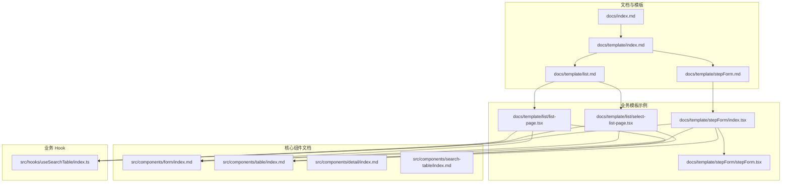
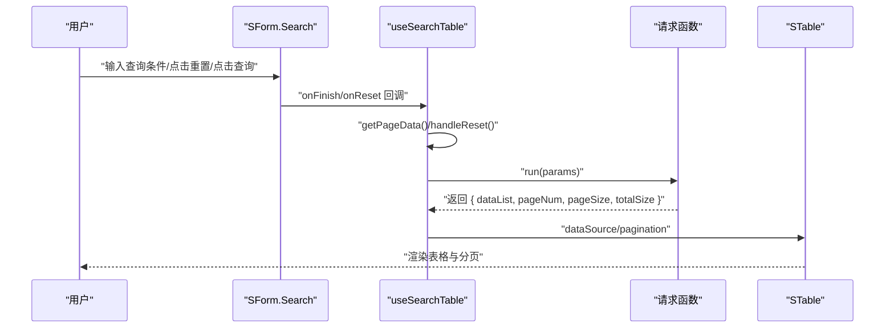
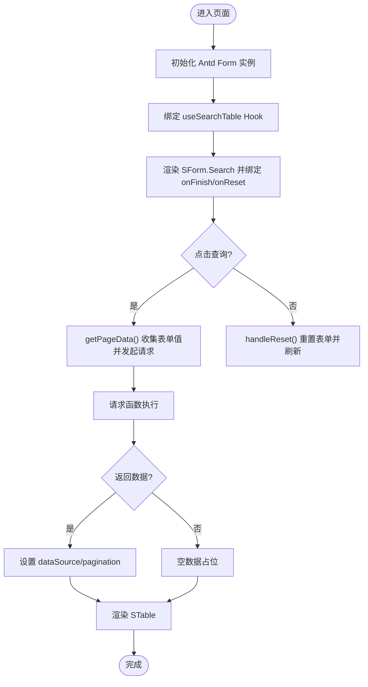
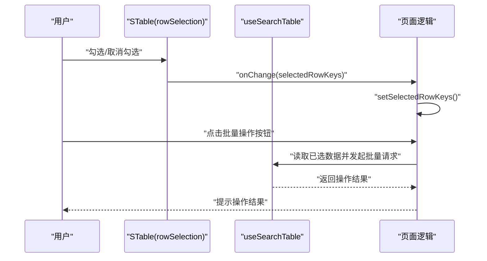
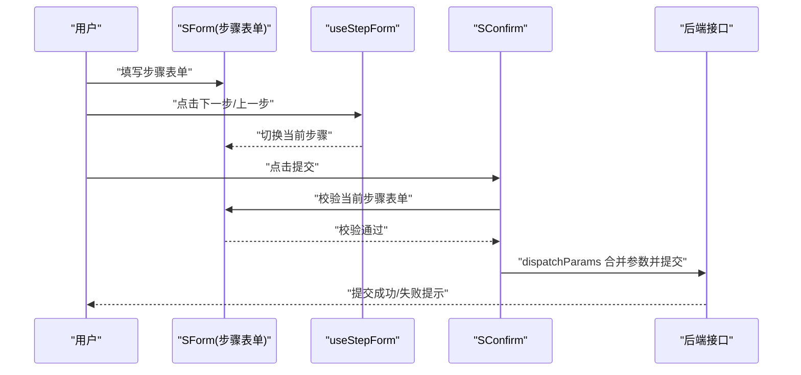
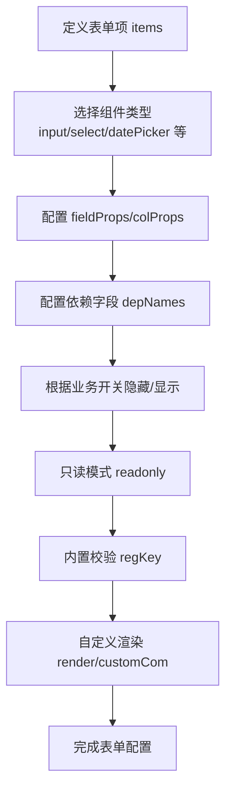
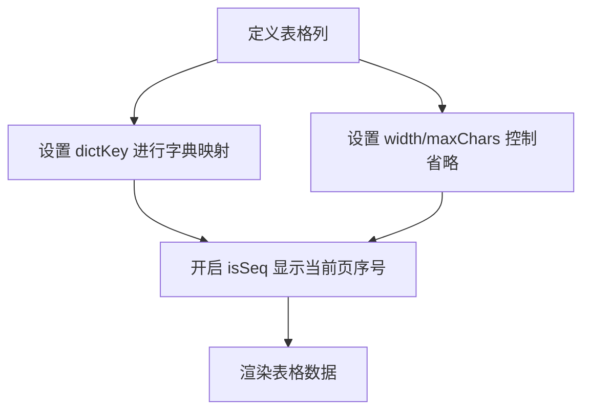
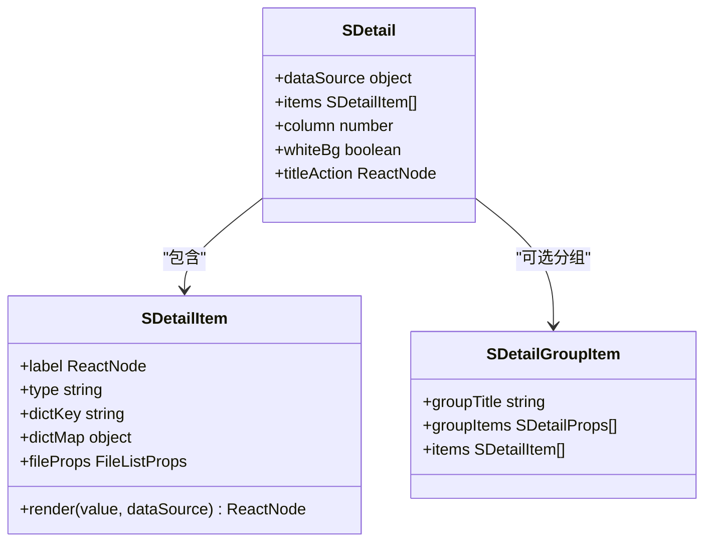
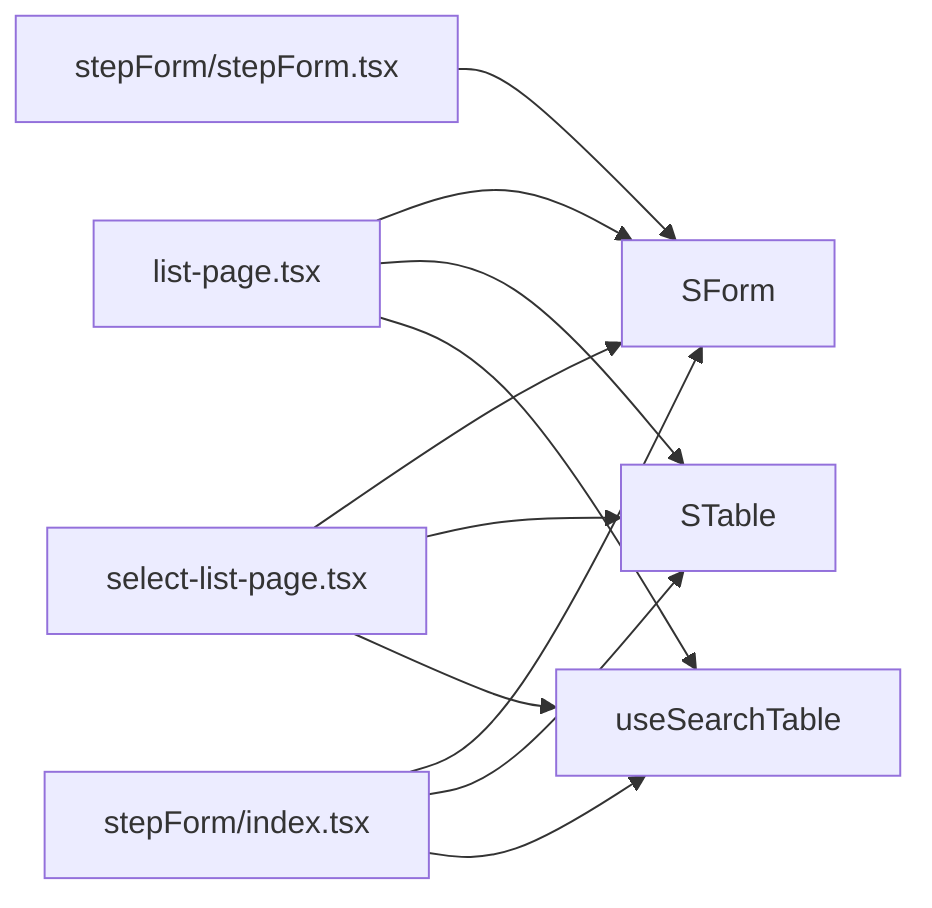

# 业务场景实现

<cite>
**本文引用的文件**
- [README.md](file://README.md)
- [docs/index.md](file://docs/index.md)
- [docs/template/index.md](file://docs/template/index.md)
- [docs/template/list.md](file://docs/template/list.md)
- [docs/template/stepForm.md](file://docs/template/stepForm.md)
- [docs/template/list/list-page.tsx](file://docs/template/list/list-page.tsx)
- [docs/template/list/select-list-page.tsx](file://docs/template/list/select-list-page.tsx)
- [docs/template/stepForm/index.tsx](file://docs/template/stepForm/index.tsx)
- [docs/template/stepForm/stepForm.tsx](file://docs/template/stepForm/stepForm.tsx)
- [src/components/form/index.md](file://src/components/form/index.md)
- [src/components/table/index.md](file://src/components/table/index.md)
- [src/components/detail/index.md](file://src/components/detail/index.md)
- [src/components/search-table/index.md](file://src/components/search-table/index.md)
- [src/hooks/useSearchTable/index.ts](file://src/hooks/useSearchTable/index.ts)
</cite>

## 目录

1. [引言](#引言)
2. [项目结构](#项目结构)
3. [核心组件](#核心组件)
4. [架构总览](#架构总览)
5. [详细组件分析](#详细组件分析)
6. [依赖关系分析](#依赖关系分析)
7. [性能考量](#性能考量)
8. [故障排查指南](#故障排查指南)
9. [结论](#结论)
10. [附录](#附录)

## 引言

本指南面向使用 SDesign 组件库进行管理后台业务开发的工程师，聚焦“业务场景实现”。围绕典型管理场景，系统讲解如何通过 SForm、STable、SDetail、SSearchTable 等组件与配套 Hook，快速搭建表单设计、数据表格、详情展示、分步表单、查询列表等常用功能；并给出复杂业务流程（多步骤表单、动态表单、条件渲染）的组合使用范式，以及权限控制、数据验证、批量操作、字典映射、上传文件、搜索过滤等企业级能力的最佳实践。

## 项目结构

SDesign 是基于 Ant Design 的业务组件库，采用“按组件分目录”的组织方式，文档与示例集中在 docs 与各组件 demos 中，核心业务能力通过 hooks 提供，便于在页面中组合使用。

**图示来源**

- [docs/index.md](file://docs/index.md#L1-L9)
- [docs/template/index.md](file://docs/template/index.md#L1-L8)
- [docs/template/list.md](file://docs/template/list.md#L1-L17)
- [docs/template/stepForm.md](file://docs/template/stepForm.md#L1-L13)
- [docs/template/list/list-page.tsx](file://docs/template/list/list-page.tsx#L1-L86)
- [docs/template/list/select-list-page.tsx](file://docs/template/list/select-list-page.tsx#L1-L99)
- [docs/template/stepForm/index.tsx](file://docs/template/stepForm/index.tsx#L1-L154)
- [docs/template/stepForm/stepForm.tsx](file://docs/template/stepForm/stepForm.tsx#L1-L33)
- [src/components/form/index.md](file://src/components/form/index.md#L1-L158)
- [src/components/table/index.md](file://src/components/table/index.md#L1-L42)
- [src/components/detail/index.md](file://src/components/detail/index.md#L1-L109)
- [src/components/search-table/index.md](file://src/components/search-table/index.md#L1-L25)
- [src/hooks/useSearchTable/index.ts](file://src/hooks/useSearchTable/index.ts#L1-L104)

**章节来源**

- [README.md](file://README.md#L1-L62)
- [docs/index.md](file://docs/index.md#L1-L9)

## 核心组件

- SForm：统一表单配置与渲染，支持布局、只读、隐藏、依赖联动、内置校验、占位、搜索等能力。
- STable：轻量表格，聚焦长文本省略、跨页序号、字典映射等场景。
- SDetail：属性回显，支持字典、文件、图片、时间范围、多选回显等类型。
- SSearchTable：查询列表一体化组件，整合表单、表格、分页与 Hook。
- useSearchTable：查询列表通用 Hook，封装分页、加载态、重置、请求派发等逻辑。

**章节来源**

- [src/components/form/index.md](file://src/components/form/index.md#L1-L158)
- [src/components/table/index.md](file://src/components/table/index.md#L1-L42)
- [src/components/detail/index.md](file://src/components/detail/index.md#L1-L109)
- [src/components/search-table/index.md](file://src/components/search-table/index.md#L1-L25)
- [src/hooks/useSearchTable/index.ts](file://src/hooks/useSearchTable/index.ts#L1-L104)

## 架构总览

下图展示了“查询列表页面”从用户交互到数据渲染的整体流程，体现组件与 Hook 的协作关系。

**图示来源**

- [docs/template/list/list-page.tsx](file://docs/template/list/list-page.tsx#L55-L85)
- [src/hooks/useSearchTable/index.ts](file://src/hooks/useSearchTable/index.ts#L8-L101)

## 详细组件分析

### 查询列表页面（基础模板）

- 场景目标：快速搭建“查询表单 + 列表表格”的管理页面，支持分页、重置、加载态。
- 关键点：
  - 使用 SForm.Search 承载查询项，绑定 Antd Form 实例。
  - 使用 useSearchTable Hook 封装请求、分页、重置与数据转换。
  - STable 渲染数据，isSeq 支持当前页序号。
- 实现要点：
  - 表单项配置通过 items 定义，支持多种组件类型与布局。
  - Hook 返回 dataSource、pagination、loading、getPageData、handleReset。
  - 可通过 extraParams 与 dispatchParams 注入或转换请求参数。

**图示来源**

- [docs/template/list/list-page.tsx](file://docs/template/list/list-page.tsx#L55-L85)
- [src/hooks/useSearchTable/index.ts](file://src/hooks/useSearchTable/index.ts#L26-L92)

**章节来源**

- [docs/template/list.md](file://docs/template/list.md#L1-L17)
- [docs/template/list/list-page.tsx](file://docs/template/list/list-page.tsx#L1-L86)
- [src/hooks/useSearchTable/index.ts](file://src/hooks/useSearchTable/index.ts#L1-L104)

### 多选列表页面（批量操作）

- 场景目标：在查询列表基础上增加多选能力，支持批量导出、批量删除等企业级操作。
- 关键点：
  - 在 STable 上启用 rowSelection，维护 selectedRowKeys。
  - 结合 useSearchTable 的 dataSource 与 pagination，实现全选/反选、批量操作按钮。
- 实现要点：
  - onSelectChange 回调中同步选中项，用于后续批量操作。
  - 与 SForm.Search、STable、SCard、STitle 组合，保持一致的页面风格。

**图示来源**

- [docs/template/list/select-list-page.tsx](file://docs/template/list/select-list-page.tsx#L64-L98)

**章节来源**

- [docs/template/list/select-list-page.tsx](file://docs/template/list/select-list-page.tsx#L1-L99)

### 分步表单（多步骤表单）

- 场景目标：将复杂表单拆分为多个步骤，逐步收集数据，支持上一步/下一步/保存草稿/最终提交。
- 关键点：
  - 使用 useStepForm 管理多个 Form 实例与当前步骤。
  - 通过 SForm 与 SCard、SErrorBoundary、SConfirm 组合，构建步骤面板与操作区。
  - 在提交阶段对当前步骤表单进行校验。
- 实现要点：
  - 步骤项配置由 stepsItems 定义，当前步骤通过 current 控制渲染。
  - dispatchParams 合并全局 formData 与当前步骤表单值，形成最终提交参数。
  - 支持详情回显：在挂载时拉取详情并 setFieldsValue。

**图示来源**

- [docs/template/stepForm/index.tsx](file://docs/template/stepForm/index.tsx#L31-L97)
- [docs/template/stepForm/stepForm.tsx](file://docs/template/stepForm/stepForm.tsx#L25-L32)

**章节来源**

- [docs/template/stepForm.md](file://docs/template/stepForm.md#L1-L13)
- [docs/template/stepForm/index.tsx](file://docs/template/stepForm/index.tsx#L1-L154)
- [docs/template/stepForm/stepForm.tsx](file://docs/template/stepForm/stepForm.tsx#L1-L33)

### 表单设计（布局、只读、隐藏、依赖、校验）

- 场景目标：在管理后台中快速构建各类表单，满足不同业务形态（新增、编辑、详情只读、条件渲染）。
- 关键点：
  - SForm 支持垂直/内联布局、只读模式、隐藏项、依赖联动、内置正则校验、占位类型。
  - SForm.Group 与 SForm.Search 提升复杂表单的分组与查询能力。
- 实现要点：
  - 通过 items 配置 type、name、label、fieldProps、depNames、hidden、readonly、regKey 等。
  - 依赖联动：当 depNames 对应字段变化时，当前字段动态更新（render 或字段行为）。
  - 搜索表单：SForm.Search 提供展开/收起、默认背景、列数控制等。

**图示来源**

- [src/components/form/index.md](file://src/components/form/index.md#L110-L158)

**章节来源**

- [src/components/form/index.md](file://src/components/form/index.md#L1-L158)

### 数据表格（省略、字典映射、序号）

- 场景目标：在后台列表中高效展示大量文本信息，同时支持字典值映射与跨页序号。
- 关键点：
  - maxChars 与 width 控制文本省略策略，hover 展示完整内容。
  - isSeq 支持当前页序号，跨页排序需配合 pagination 的 current/pageSize。
  - columns.dictKey 支持字典映射。
- 实现要点：
  - 针对长文本列设置合理宽度与 maxChars，避免遮挡。
  - 使用自定义 render 处理数组/对象等复杂类型。

**图示来源**

- [src/components/table/index.md](file://src/components/table/index.md#L27-L42)

**章节来源**

- [src/components/table/index.md](file://src/components/table/index.md#L1-L42)

### 详情展示（字典、文件、图片、时间范围）

- 场景目标：在详情页以“标签+值”的形式清晰回显数据，支持多种类型与分组展示。
- 关键点：
  - SDetail 支持 dict、file、img、rangeTime、checkbox 等类型。
  - SDetail.Group 支持分组标题、分组容器与分组项。
  - 支持白底背景、标题描述、标题操作栏等增强展示。
- 实现要点：
  - 通过 items 与 dataSource 绑定，dictKey 优先使用 ConfigProvider 注入的字典。
  - 自定义 render 优先级最高，可覆盖默认渲染。

**图示来源**

- [src/components/detail/index.md](file://src/components/detail/index.md#L32-L109)

**章节来源**

- [src/components/detail/index.md](file://src/components/detail/index.md#L1-L109)

### 查询列表一体化（SSearchTable）

- 场景目标：将表单、表格、分页、标题等组合为一个组件，减少样板代码。
- 关键点：
  - 通过 headTitle、tableTitle、formProps、tableProps、serviceProps 统一配置。
  - serviceProps.service 与 serviceProps.serviceProps 透传给底层请求与表格选项。
- 实现要点：
  - 适合标准的“查询 + 列表 + 分页”页面，降低耦合度与重复实现。

**章节来源**

- [src/components/search-table/index.md](file://src/components/search-table/index.md#L1-L25)

## 依赖关系分析

- 组件层：SForm、STable、SDetail、SSearchTable 作为页面核心组件，分别负责“表单配置与渲染”“表格展示”“详情回显”“查询列表一体化”。
- Hook 层：useSearchTable 抽象查询列表的通用逻辑，降低页面复杂度。
- 模板层：list 与 stepForm 模板示例展示典型业务流程的组合方式。

**图示来源**

- [docs/template/list/list-page.tsx](file://docs/template/list/list-page.tsx#L55-L85)
- [docs/template/list/select-list-page.tsx](file://docs/template/list/select-list-page.tsx#L55-L98)
- [docs/template/stepForm/index.tsx](file://docs/template/stepForm/index.tsx#L31-L97)
- [docs/template/stepForm/stepForm.tsx](file://docs/template/stepForm/stepForm.tsx#L25-L32)

**章节来源**

- [src/hooks/useSearchTable/index.ts](file://src/hooks/useSearchTable/index.ts#L1-L104)

## 性能考量

- 列表分页与懒加载
  - 使用 useSearchTable 的分页配置与 onChange，避免一次性加载全部数据。
  - 合理设置 pageSize，结合服务端分页接口，控制网络与内存占用。
- 表格渲染优化
  - 长文本列设置 width 与 maxChars，减少 DOM 节点尺寸与重排。
  - 复杂列使用自定义 render，避免深层嵌套导致的重渲染。
- 表单与联动
  - 依赖联动尽量使用受控字段与最小化 re-render，避免频繁 validate。
  - 大字段使用节流/防抖（如远程搜索），减少请求频率。
- 详情与文件
  - 文件/图片回显建议按需加载缩略图，避免大图阻塞首屏。
- 缓存与重用
  - 字典数据通过 ConfigProvider 注入，避免重复请求。
  - 表单与表格状态尽量持久化在页面级状态中，减少重复初始化。

## 故障排查指南

- 表单未触发查询
  - 检查 SForm.Search 的 onFinish 是否正确绑定到 useSearchTable 的 getPageData。
  - 确认表单实例 form 已正确传入 Hook。
- 分页无效或页码异常
  - 确认请求返回结构包含 pageNum、pageSize、totalSize。
  - 检查 useSearchTable 的 pagination 配置是否被正确设置。
- 表格列显示异常
  - 长文本列需设置 width 或 maxChars；否则可能出现省略不生效或布局错乱。
  - 自定义 render 中避免直接输出大对象/数组，建议序列化或截断。
- 详情字典不显示
  - 确认 dictKey 或 dictMap 已正确配置；若使用 ConfigProvider，请检查注入的字典是否可用。
- 分步表单提交失败
  - 提交前确保当前步骤表单 validateFields 已通过。
  - 检查 dispatchParams 是否正确合并全局 formData 与当前步骤表单值。
- 权限与可见性
  - 通过表单项 hidden/readonly 控制字段可见与可编辑；在按钮层面结合权限位控制操作按钮显示。

**章节来源**

- [src/hooks/useSearchTable/index.ts](file://src/hooks/useSearchTable/index.ts#L68-L92)
- [src/components/form/index.md](file://src/components/form/index.md#L110-L158)
- [src/components/detail/index.md](file://src/components/detail/index.md#L48-L109)
- [docs/template/stepForm/index.tsx](file://docs/template/stepForm/index.tsx#L60-L80)

## 结论

SDesign 通过“组件 + Hook + 模板”的方式，将管理后台常见的业务场景标准化、模块化。借助 SForm、STable、SDetail、SSearchTable 与 useSearchTable，开发者可以在保证一致性的同时，快速实现从基础查询列表到复杂分步表单的多种业务需求。建议在实际项目中：

- 优先使用 SSearchTable 与 useSearchTable 构建标准查询页面；
- 通过 SForm 的依赖联动与只读/隐藏能力，实现动态表单与条件渲染；
- 在详情页使用 SDetail 的字典与文件回显，提升信息可读性；
- 对复杂流程采用分步表单模板，结合 useStepForm 与 SConfirm，保障用户体验与数据安全。

## 附录

- 快速开始
  - 安装与开发命令见根目录说明。
- 版本与分支
  - 参考 README 中的分支说明与版本要求，确保模板与组件版本匹配。
- 示例路径
  - 列表模板：docs/template/list/\*.tsx
  - 分步表单模板：docs/template/stepForm/\*.tsx
  - 组件文档：src/components/\*/index.md

**章节来源**

- [README.md](file://README.md#L13-L33)
- [docs/template/index.md](file://docs/template/index.md#L1-L8)
