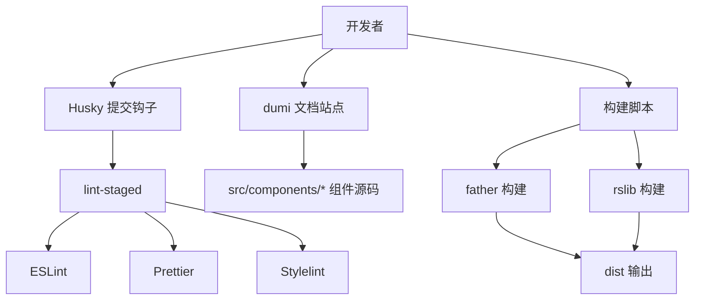
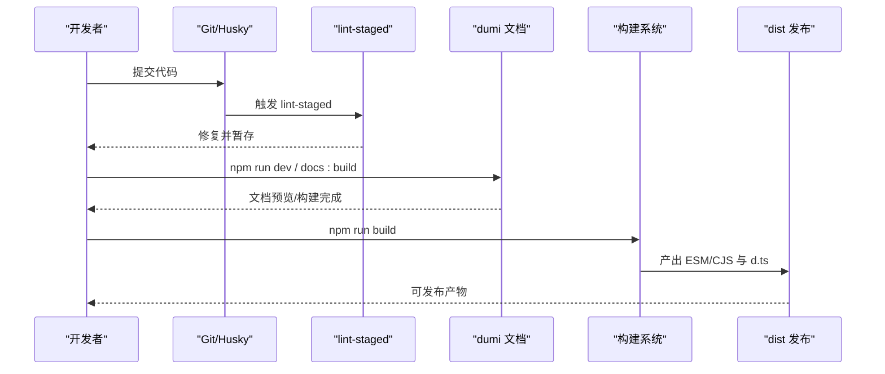
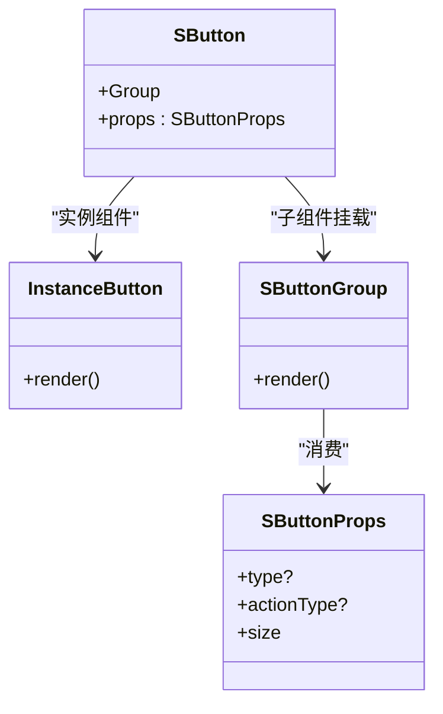
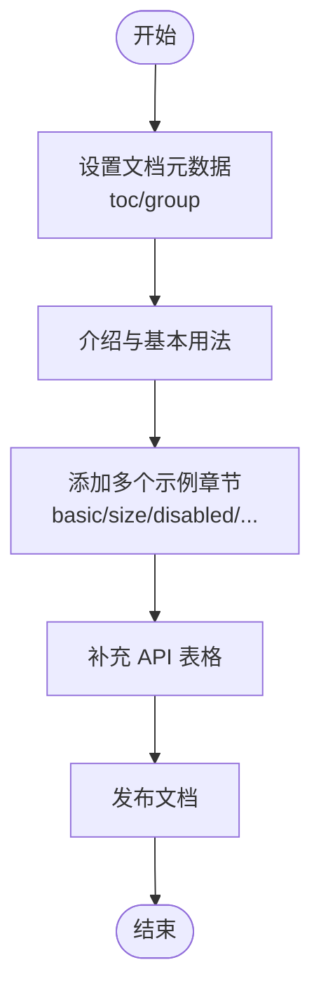
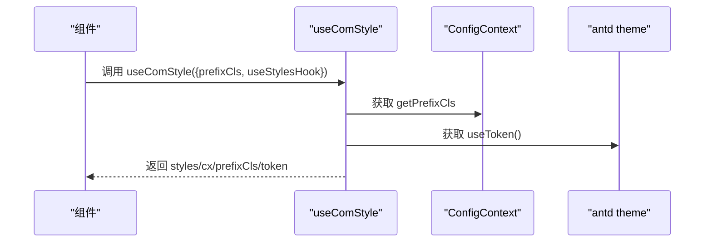
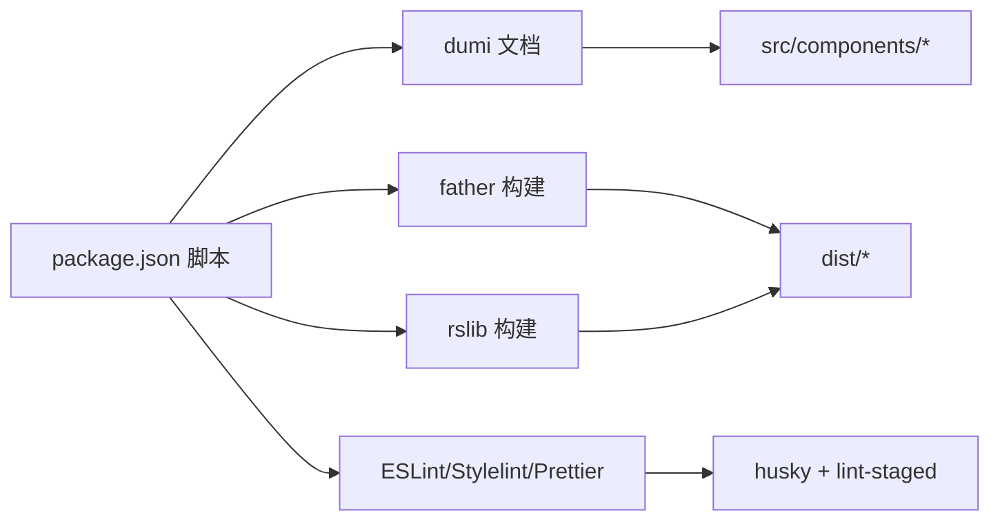
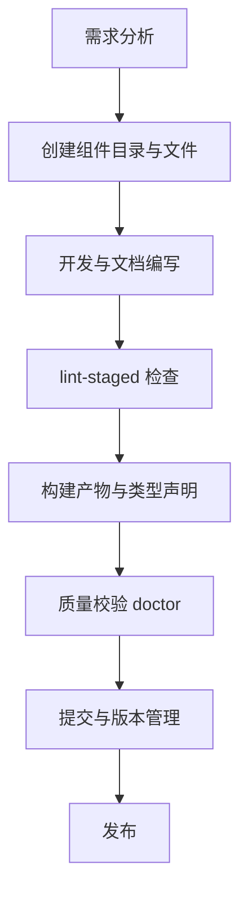

# 团队协作规范

<cite>
**本文引用的文件**
- [package.json](file://package.json)
- [.eslintrc.js](file://.eslintrc.js)
- [.prettierrc.js](file://.prettierrc.js)
- [.editorconfig](file://.editorconfig)
- [.lintstagedrc.json](file://.lintstagedrc.json)
- [.ls-lint.yml](file://.ls-lint.yml)
- [.dumirc.ts](file://.dumirc.ts)
- [.fatherrc.ts](file://.fatherrc.ts)
- [rslib.config.ts](file://rslib.config.ts)
- [README.md](file://README.md)
- [src/components/button/index.md](file://src/components/button/index.md)
- [src/components/button/index.tsx](file://src/components/button/index.tsx)
- [src/components/button/Buttons.tsx](file://src/components/button/Buttons.tsx)
- [src/components/button/instance.tsx](file://src/components/button/instance.tsx)
- [src/components/button/types.ts](file://src/components/button/types.ts)
- [src/hooks/useComStyle.ts](file://src/hooks/useComStyle.ts)
- [src/utils/common.ts](file://src/utils/common.ts)
- [docs/template/index.md](file://docs/template/index.md)
</cite>

## 目录

1. 引言
2. 项目结构
3. 核心组件
4. 架构总览
5. 详细组件分析
6. 依赖分析
7. 性能考虑
8. 故障排查指南
9. 结论
10. 附录

## 引言

本指南面向 SDesign 组件库团队，旨在建立统一的开发标准与协作流程，覆盖代码风格、命名约定、组件开发流程、代码评审、文档规范、版本与分支管理、发布流程及团队培训建议。目标是提升代码质量、可维护性与团队协作效率。

## 项目结构

SDesign 采用多包/多产物构建模式，结合文档站点与组件库打包工具，形成“文档演示 + 组件库构建”的一体化工程体系。关键特性：

- 使用 dumi 作为文档与演示站点，自动解析组件目录生成文档页
- 使用 father 与 rslib 进行多格式（ESM/CJS）与类型声明（d.ts）输出
- 通过 husky + lint-staged 在提交前进行静态检查与格式化
- 通过 commitlint 规范提交信息，配合语义化版本脚本

**图示来源**

- [.dumirc.ts](file://.dumirc.ts#L1-L22)
- [.fatherrc.ts](file://.fatherrc.ts#L1-L13)
- [rslib.config.ts](file://rslib.config.ts#L1-L79)
- [package.json](file://package.json#L26-L46)

**章节来源**

- [README.md](file://README.md#L1-L62)
- [.dumirc.ts](file://.dumirc.ts#L1-L22)
- [.fatherrc.ts](file://.fatherrc.ts#L1-L13)
- [rslib.config.ts](file://rslib.config.ts#L1-L79)
- [package.json](file://package.json#L26-L46)

## 核心组件

- 组件入口与导出：组件通常以 index.tsx 导出主组件，并挂载子组件（如 Group）。例如按钮组件通过组合实例组件与按钮组组件对外暴露统一 API。
- 组件文档：每个组件在 index.md 中提供 API 表格、示例与说明，文档由 dumi 解析并渲染。
- 工具与样式：提供通用工具函数与样式钩子，便于组件共享逻辑与主题适配。

**章节来源**

- [src/components/button/index.tsx](file://src/components/button/index.tsx#L1-L15)
- [src/components/button/Buttons.tsx](file://src/components/button/Buttons.tsx#L1-L42)
- [src/components/button/instance.tsx](file://src/components/button/instance.tsx#L1-L46)
- [src/components/button/types.ts](file://src/components/button/types.ts#L1-L72)
- [src/components/button/index.md](file://src/components/button/index.md#L1-L78)
- [src/hooks/useComStyle.ts](file://src/hooks/useComStyle.ts#L1-L29)
- [src/utils/common.ts](file://src/utils/common.ts#L1-L208)

## 架构总览

SDesign 的整体架构围绕“文档驱动开发 + 多产物构建”展开。开发者在本地运行文档站点进行组件演示与调试；提交代码触发 lint-staged 自动修复；构建阶段分别产出 ESM/CJS 与类型声明，供下游项目按需使用。

**图示来源**

- [package.json](file://package.json#L26-L46)
- [.lintstagedrc.json](file://.lintstagedrc.json#L1-L7)
- [.dumirc.ts](file://.dumirc.ts#L1-L22)
- [.fatherrc.ts](file://.fatherrc.ts#L1-L13)
- [rslib.config.ts](file://rslib.config.ts#L1-L79)

## 详细组件分析

### 组件开发与导出规范

- 主组件导出：组件入口文件负责聚合实例组件与子组件（如 Group），并通过类型合并暴露完整 API。
- 子组件挂载：子组件以独立文件存在，通过主组件文件挂载，保持 API 清晰与可发现性。
- 类型定义：Props 接口与枚举类型集中定义，避免分散与重复。

**图示来源**

- [src/components/button/index.tsx](file://src/components/button/index.tsx#L1-L15)
- [src/components/button/instance.tsx](file://src/components/button/instance.tsx#L1-L46)
- [src/components/button/Buttons.tsx](file://src/components/button/Buttons.tsx#L1-L42)
- [src/components/button/types.ts](file://src/components/button/types.ts#L52-L72)

**章节来源**

- [src/components/button/index.tsx](file://src/components/button/index.tsx#L1-L15)
- [src/components/button/Buttons.tsx](file://src/components/button/Buttons.tsx#L1-L42)
- [src/components/button/instance.tsx](file://src/components/button/instance.tsx#L1-L46)
- [src/components/button/types.ts](file://src/components/button/types.ts#L1-L72)

### 文档与示例规范

- 文档结构：每个组件的 index.md 采用统一的头部元数据与分组信息，包含“基本用法”“不同尺寸”“全局禁用与 loading”“自定义渲染/间距/垂直排列”等章节，并提供对应示例。
- 示例组织：示例文件位于 demos 目录，文档通过 code 标签引用示例文件路径。
- API 表格：文档末尾提供清晰的属性表格，便于查阅。

**图示来源**

- [src/components/button/index.md](file://src/components/button/index.md#L1-L78)

**章节来源**

- [src/components/button/index.md](file://src/components/button/index.md#L1-L78)
- [docs/template/index.md](file://docs/template/index.md#L1-L8)

### 样式与主题规范

- 样式钩子：通过 useComStyle 获取主题 token 与前缀，保证组件在不同主题下的一致表现。
- 主题上下文：组件通过 ConfigProvider 上下文注入前缀，确保样式命名空间一致。

**图示来源**

- [src/hooks/useComStyle.ts](file://src/hooks/useComStyle.ts#L1-L29)

**章节来源**

- [src/hooks/useComStyle.ts](file://src/hooks/useComStyle.ts#L1-L29)

### 工具函数与通用能力

- 通用工具：提供生成验证码、文件名截断、数组创建、文件转 Base64、动态脚本注入、剪贴板复制、环境判断等工具函数，便于组件与业务层复用。
- 设计原则：函数职责单一、输入输出明确、错误处理清晰。

**章节来源**

- [src/utils/common.ts](file://src/utils/common.ts#L1-L208)

## 依赖分析

- 构建工具链：father 与 rslib 并行使用，前者侧重 ESM/CJS 产物与忽略测试目录，后者侧重 React/Less 插件与外部依赖排除。
- 文档站点：dumi 自动扫描 src/components 下的组件目录，生成文档页。
- 质量保障：ESLint、Stylelint、Prettier、lint-staged、husky、commitlint 形成完整的质量闭环。
- 运行时依赖：antd、react、dayjs、lucide-react 等作为 peerDependencies，避免重复打包与版本冲突。

**图示来源**

- [package.json](file://package.json#L26-L46)
- [.dumirc.ts](file://.dumirc.ts#L1-L22)
- [.fatherrc.ts](file://.fatherrc.ts#L1-L13)
- [rslib.config.ts](file://rslib.config.ts#L1-L79)

**章节来源**

- [package.json](file://package.json#L26-L46)
- [.fatherrc.ts](file://.fatherrc.ts#L1-L13)
- [rslib.config.ts](file://rslib.config.ts#L1-L79)
- [.dumirc.ts](file://.dumirc.ts#L1-L22)

## 性能考虑

- 构建优化：通过 rslib 的 IgnorePlugin 与 loader 排除 md/demo/demos 目录，减少无关资源进入打包流程。
- 外部化依赖：将 react、antd、dayjs 等标记为 external，降低产物体积并避免重复打包。
- 按需加载：组件内部按需引入样式与图标，避免全量引入导致体积膨胀。
- 主题与样式：通过 useToken 与 antd-style 获取主题变量，避免硬编码样式，提升可维护性。

**章节来源**

- [rslib.config.ts](file://rslib.config.ts#L11-L35)
- [rslib.config.ts](file://rslib.config.ts#L43-L70)
- [src/hooks/useComStyle.ts](file://src/hooks/useComStyle.ts#L1-L29)

## 故障排查指南

- 提交被拒绝：检查 lint-staged 是否报错，确认已安装 husky 并执行过 dumi setup；修复 ESLint/Stylelint/Prettier 报错后重新提交。
- 构建失败：检查 father 与 rslib 配置，确认忽略规则与外部依赖列表正确；运行 doctor 检查潜在问题。
- 文档不更新：确认 dumi 配置的 atomDirs 与 alias 设置正确，组件目录命名与文件结构符合规范。
- 重复代码检测：使用 jscpd 对 src 目录进行扫描，识别高相似度片段并进行重构。

**章节来源**

- [package.json](file://package.json#L40-L46)
- [.lintstagedrc.json](file://.lintstagedrc.json#L1-L7)
- [.dumirc.ts](file://.dumirc.ts#L1-L22)
- [README.md](file://README.md#L55-L62)

## 结论

通过统一的代码风格、严格的构建与文档规范、完善的质量保障与版本管理策略，SDesign 能够持续产出高质量、可维护、易使用的组件库。建议团队在日常协作中严格遵循本规范，并结合实际场景持续优化流程与工具链。

## 附录

### 一、代码风格与命名约定

- 缩进与换行：统一使用空格缩进，行宽不超过 80 字符，结尾插入换行。
- 文件命名：目录与文件采用 kebab-case；测试目录以 _test_ 命名。
- TypeScript：使用类型别名与接口，枚举使用 tuple 辅助工具约束取值。
- CSS/Less：统一使用 Prettier 与 Stylelint，避免多余逗号与空白。

**章节来源**

- [.editorconfig](file://.editorconfig#L1-L14)
- [.ls-lint.yml](file://.ls-lint.yml#L1-L13)
- [.prettierrc.js](file://.prettierrc.js#L1-L22)
- [src/components/button/types.ts](file://src/components/button/types.ts#L7-L28)

### 二、组件开发流程（从需求到发布）

- 需求分析：明确组件功能边界、交互行为与 API 设计。
- 目录与文件：在 src/components 下创建组件目录，包含 index.tsx、index.md、types.ts、demos/\* 示例。
- 开发与联调：在 docs 中编写文档与示例，实时验证组件行为。
- 质量检查：通过 lint-staged 自动修复，确保代码风格与规范一致。
- 构建与校验：运行构建脚本，检查产物与类型声明；使用 doctor 检查潜在问题。
- 提交与发布：遵循 commitlint 规范提交，使用语义化版本脚本进行版本升级与发布。

**图示来源**

- [README.md](file://README.md#L13-L33)
- [package.json](file://package.json#L26-L46)

**章节来源**

- [README.md](file://README.md#L13-L33)
- [package.json](file://package.json#L26-L46)

### 三、代码审查标准与检查清单

- 代码风格：是否符合 EditorConfig、Prettier、ESLint、Stylelint 规范。
- 类型安全：Props 接口是否完整，枚举取值是否受控。
- 文档完整性：组件是否提供 index.md，示例是否覆盖主要场景。
- 性能与体积：是否避免重复引入，是否使用 external 依赖。
- 可测试性：是否具备可测试的最小单元，必要时提供简单测试用例。

**章节来源**

- [.editorconfig](file://.editorconfig#L1-L14)
- [.prettierrc.js](file://.prettierrc.js#L1-L22)
- [.eslintrc.js](file://.eslintrc.js#L1-L45)
- [src/components/button/index.md](file://src/components/button/index.md#L1-L78)

### 四、文档编写规范与模板

- 模板字段：使用 apiHeader 控制默认导入方式与页面标题。
- 组件文档：包含“介绍”“基本用法”“不同尺寸/状态”“自定义渲染/间距/布局”“API 表格”等章节。
- 示例组织：示例文件位于 demos 目录，文档通过 code 标签引用。

**章节来源**

- [docs/template/index.md](file://docs/template/index.md#L1-L8)
- [src/components/button/index.md](file://src/components/button/index.md#L1-L78)

### 五、版本管理、分支管理与发布流程

- 分支策略：master（无用）、prod（正式）、dev（开发）、feature\_\*（功能分支）。
- 版本脚本：提供 major/minor/patch 语义化版本脚本，配合 npm version 使用。
- 发布前置：prepublishOnly 钩子执行 doctor 与构建，确保产物可用。

**章节来源**

- [README.md](file://README.md#L46-L54)
- [package.json](file://package.json#L43-L45)
- [package.json](file://package.json#L40-L41)

### 六、团队培训与知识分享建议

- 新人入门：提供 README 的开发与构建指引，帮助快速搭建环境。
- 工具链培训：讲解 husky、lint-staged、ESLint、Stylelint、Prettier 的作用与配置。
- 组件开发工作坊：以按钮组件为例，演示从需求到文档再到构建的全流程。
- 定期分享：围绕主题系统、样式钩子、性能优化等主题开展分享。

**章节来源**

- [README.md](file://README.md#L13-L33)
- [src/hooks/useComStyle.ts](file://src/hooks/useComStyle.ts#L1-L29)
