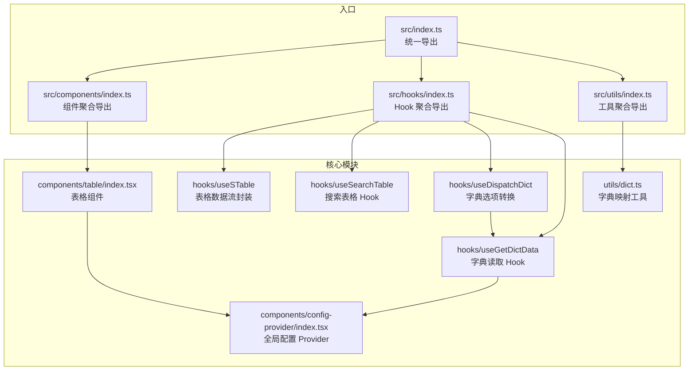
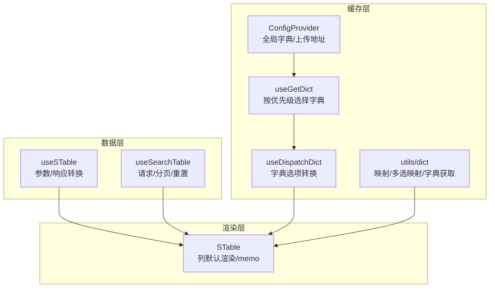
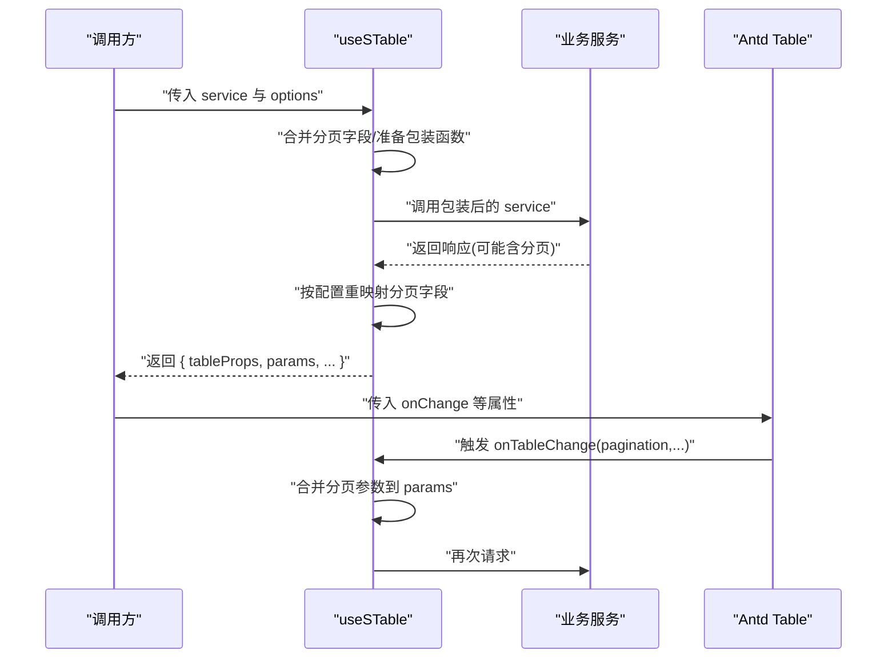
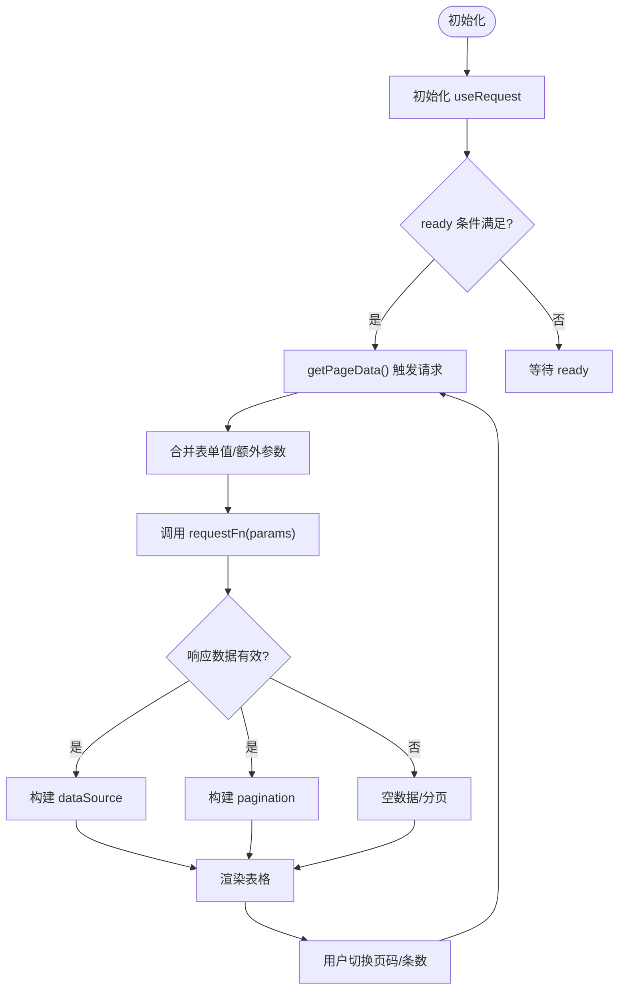
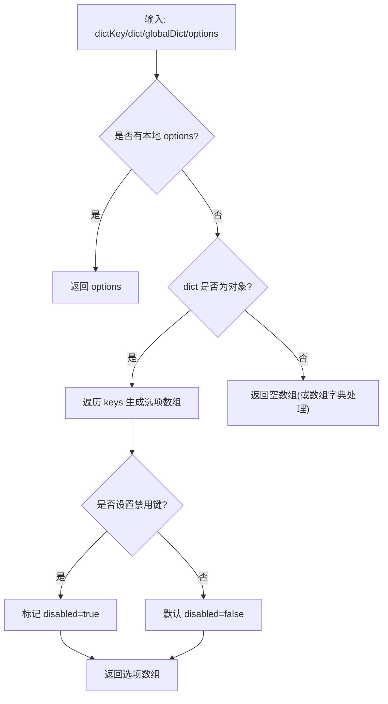
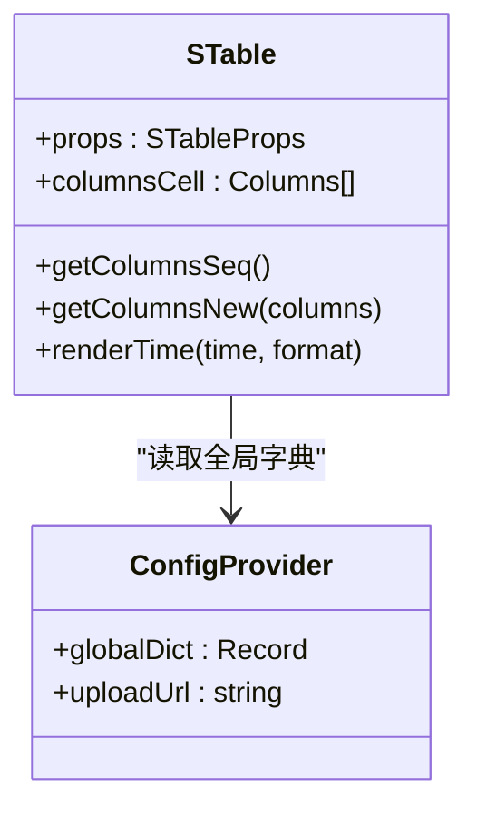
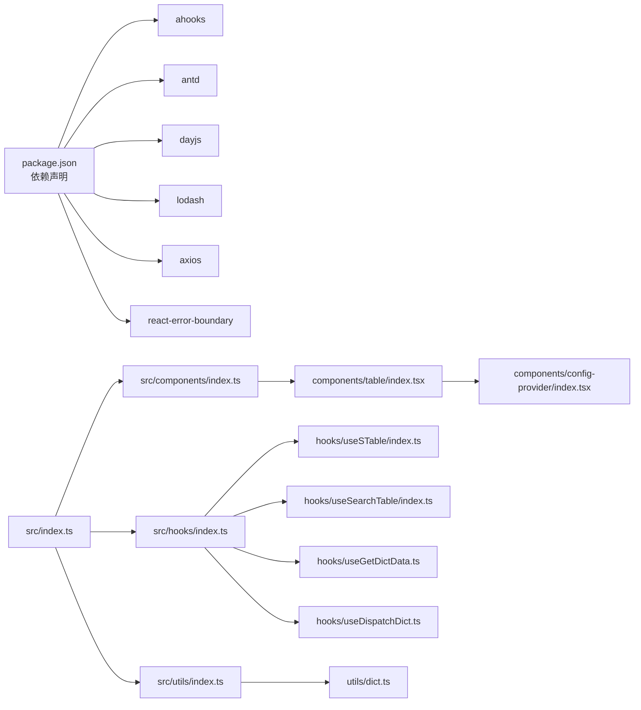

# 性能优化指南

<cite>
**本文引用的文件**
- [package.json](file://package.json)
- [src/index.ts](file://src/index.ts)
- [src/components/index.ts](file://src/components/index.ts)
- [src/hooks/index.ts](file://src/hooks/index.ts)
- [src/utils/index.ts](file://src/utils/index.ts)
- [src/hooks/useSTable/index.ts](file://src/hooks/useSTable/index.ts)
- [src/hooks/useSearchTable/index.ts](file://src/hooks/useSearchTable/index.ts)
- [src/hooks/useDispatchDict.ts](file://src/hooks/useDispatchDict.ts)
- [src/hooks/useGetDictData.ts](file://src/hooks/useGetDictData.ts)
- [src/utils/dict.ts](file://src/utils/dict.ts)
- [src/components/table/index.tsx](file://src/components/table/index.tsx)
- [src/components/form/index.tsx](file://src/components/form/index.tsx)
- [src/components/upload/index.tsx](file://src/components/upload/index.tsx)
- [src/components/detail/index.tsx](file://src/components/detail/index.tsx)
- [src/components/config-provider/index.tsx](file://src/components/config-provider/index.tsx)
</cite>

## 目录

1. [简介](#简介)
2. [项目结构](#项目结构)
3. [核心组件](#核心组件)
4. [架构总览](#架构总览)
5. [详细组件分析](#详细组件分析)
6. [依赖分析](#依赖分析)
7. [性能考量](#性能考量)
8. [故障排查指南](#故障排查指南)
9. [结论](#结论)
10. [附录](#附录)

## 简介

本指南面向使用 SDesign 组件库的开发者与技术负责人，系统梳理组件库在实际工程中的性能优化策略与最佳实践。内容覆盖组件渲染优化、内存管理、事件处理优化、大数据量表格虚拟滚动方案、复杂表单懒加载策略、图片上传性能优化、组件缓存机制（字典数据缓存、表单状态缓存）、以及性能监控与调试方法（React DevTools 使用技巧与性能分析工具应用）。文档以仓库现有实现为依据，结合可落地的改进建议，帮助在保证功能正确性的前提下提升运行效率与用户体验。

## 项目结构

SDesign 采用按功能域划分的模块化组织方式：components、hooks、utils、icons、plugins 等目录清晰分离职责；入口文件统一导出，便于按需引入与 Tree Shaking。

图表来源

- [src/index.ts](file://src/index.ts#L1-L5)
- [src/components/index.ts](file://src/components/index.ts#L1-L81)
- [src/hooks/index.ts](file://src/hooks/index.ts#L1-L28)
- [src/utils/index.ts](file://src/utils/index.ts#L1-L10)
- [src/hooks/useSTable/index.ts](file://src/hooks/useSTable/index.ts#L1-L143)
- [src/hooks/useSearchTable/index.ts](file://src/hooks/useSearchTable/index.ts#L1-L104)
- [src/hooks/useDispatchDict.ts](file://src/hooks/useDispatchDict.ts#L1-L99)
- [src/hooks/useGetDictData.ts](file://src/hooks/useGetDictData.ts#L1-L28)
- [src/utils/dict.ts](file://src/utils/dict.ts#L1-L121)
- [src/components/table/index.tsx](file://src/components/table/index.tsx#L1-L135)
- [src/components/config-provider/index.tsx](file://src/components/config-provider/index.tsx#L1-L47)

章节来源

- [src/index.ts](file://src/index.ts#L1-L5)
- [src/components/index.ts](file://src/components/index.ts#L1-L81)
- [src/hooks/index.ts](file://src/hooks/index.ts#L1-L28)
- [src/utils/index.ts](file://src/utils/index.ts#L1-L10)

## 核心组件

- 表格与数据流：useSTable、useSearchTable 提供请求封装、参数转换、分页映射与变更回调，降低重复逻辑与副作用。
- 字典与缓存：useGetDict、useDispatchDict、utils/dict 提供字典读取、映射与选项转换，配合 ConfigProvider 的全局字典状态，减少重复计算与网络请求。
- 渲染优化：STable 对列渲染进行 memo 化与默认行为封装，避免不必要的重渲染。
- 上传与详情：SUpload、SDetail 作为聚合导出，便于按需引入与 Tree Shaking。

章节来源

- [src/hooks/useSTable/index.ts](file://src/hooks/useSTable/index.ts#L1-L143)
- [src/hooks/useSearchTable/index.ts](file://src/hooks/useSearchTable/index.ts#L1-L104)
- [src/hooks/useDispatchDict.ts](file://src/hooks/useDispatchDict.ts#L1-L99)
- [src/hooks/useGetDictData.ts](file://src/hooks/useGetDictData.ts#L1-L28)
- [src/utils/dict.ts](file://src/utils/dict.ts#L1-L121)
- [src/components/table/index.tsx](file://src/components/table/index.tsx#L1-L135)
- [src/components/config-provider/index.tsx](file://src/components/config-provider/index.tsx#L1-L47)

## 架构总览

SDesign 的性能优化围绕“数据层”“渲染层”“缓存层”三部分协同展开：

- 数据层：通过 useSTable/useSearchTable 将请求参数标准化、分页字段映射、响应数据转换，减少重复封装与错误传播。
- 渲染层：STable 对列渲染进行默认处理与 memo 化，避免每次渲染都重新构造列配置。
- 缓存层：ConfigProvider 统一维护全局字典，useGetDict 与 useDispatchDict 基于 useMemo 避免重复计算，utils/dict 提供稳定的映射函数。

图表来源

- [src/hooks/useSTable/index.ts](file://src/hooks/useSTable/index.ts#L1-L143)
- [src/hooks/useSearchTable/index.ts](file://src/hooks/useSearchTable/index.ts#L1-L104)
- [src/components/config-provider/index.tsx](file://src/components/config-provider/index.tsx#L1-L47)
- [src/hooks/useGetDictData.ts](file://src/hooks/useGetDictData.ts#L1-L28)
- [src/hooks/useDispatchDict.ts](file://src/hooks/useDispatchDict.ts#L1-L99)
- [src/utils/dict.ts](file://src/utils/dict.ts#L1-L121)
- [src/components/table/index.tsx](file://src/components/table/index.tsx#L1-L135)

## 详细组件分析

### useSTable：表格数据流与分页优化

- 参数转换与响应映射：在包装服务函数中对请求参数与响应数据进行转换，避免在业务层重复处理字段差异。
- 分页字段映射：支持自定义 current/pageSize/total 映射，减少后端接口差异带来的适配成本。
- 变更回调封装：重写 onChange，确保分页参数合并到已有参数集合，避免丢失历史查询条件。
- 性能要点：使用 useMemoizedFn 包裹回调，减少闭包重建；仅在需要时执行转换逻辑，降低无效计算。

图表来源

- [src/hooks/useSTable/index.ts](file://src/hooks/useSTable/index.ts#L1-L143)

章节来源

- [src/hooks/useSTable/index.ts](file://src/hooks/useSTable/index.ts#L1-L143)

### useSearchTable：搜索表格 Hook

- 请求封装：基于 useRequest，支持手动/自动触发、ready 条件控制、额外参数合并。
- 表单联动：从 Form 中读取字段值，与额外参数合并生成请求参数。
- 分页配置：根据响应数据动态生成分页配置，支持快速跳转与页码切换。
- 性能要点：使用 useMemo 缓存 dataSource 与 pagination，避免无谓重算；useCallback 包裹 getPageData 与 handleTableChange，减少子组件重渲染。

图表来源

- [src/hooks/useSearchTable/index.ts](file://src/hooks/useSearchTable/index.ts#L1-L104)

章节来源

- [src/hooks/useSearchTable/index.ts](file://src/hooks/useSearchTable/index.ts#L1-L104)

### 字典缓存与映射：useGetDict、useDispatchDict、utils/dict

- useGetDict：按优先级选择本地字典或全局字典，使用 useMemo 缓存结果，避免重复查找。
- useDispatchDict：将字典对象转换为选项数组，支持禁用键过滤，使用 useMemo 缓存转换结果。
- utils/dict：提供单值与多选映射函数，支持对象与数组两种字典格式，内置空值兜底与异常保护。

图表来源

- [src/hooks/useGetDictData.ts](file://src/hooks/useGetDictData.ts#L1-L28)
- [src/hooks/useDispatchDict.ts](file://src/hooks/useDispatchDict.ts#L1-L99)
- [src/utils/dict.ts](file://src/utils/dict.ts#L1-L121)

章节来源

- [src/hooks/useGetDictData.ts](file://src/hooks/useGetDictData.ts#L1-L28)
- [src/hooks/useDispatchDict.ts](file://src/hooks/useDispatchDict.ts#L1-L99)
- [src/utils/dict.ts](file://src/utils/dict.ts#L1-L121)

### STable：渲染优化与默认行为

- 列默认渲染：对 datetime/date/ellipsis 等常见场景提供默认渲染器，减少业务侧样板代码。
- 序号列：可选的序号列，结合分页信息计算序号，避免额外数据处理。
- 字典映射：列定义中可指定 dictKey，自动从全局字典映射显示值。
- 性能要点：列配置与序号列通过 useMemo 计算，整体渲染使用 memo 包裹，降低重渲染频率。

图表来源

- [src/components/table/index.tsx](file://src/components/table/index.tsx#L1-L135)
- [src/components/config-provider/index.tsx](file://src/components/config-provider/index.tsx#L1-L47)

章节来源

- [src/components/table/index.tsx](file://src/components/table/index.tsx#L1-L135)
- [src/components/config-provider/index.tsx](file://src/components/config-provider/index.tsx#L1-L47)

### 复杂表单的懒加载策略（建议）

- 按需渲染：将非首屏必填字段延迟到用户交互后渲染，减少初始渲染节点数量。
- 动态导入：对重型校验器或复杂组件使用动态导入，按需加载。
- 表单状态缓存：使用 useLocalStorage 或轻量缓存策略保存表单中间态，避免刷新丢失。
- 事件节流：对高频输入事件进行节流/防抖，降低渲染压力。
- 依赖联动：利用 SForm 的依赖关系与受控更新，避免全量重算。

[本节为通用建议，不直接分析具体文件，故无章节来源]

### 大数据量表格的虚拟滚动实现方案（建议）

- 方案一：使用固定高度容器 + 仅渲染可视区域行，结合滚动位置计算偏移。
- 方案二：引入虚拟列表库（如 react-window），对行进行虚拟化，保持 DOM 节点数量稳定。
- 方案三：分页 + 懒加载：在滚动接近底部时再请求下一页，控制单页大小与批量渲染。
- 与 STable 结合：在列渲染中保留 ellipsis 等轻量处理，避免虚拟化后仍做重型计算。

[本节为通用建议，不直接分析具体文件，故无章节来源]

### 图片上传的性能优化技巧（建议）

- 前端压缩：在上传前对图片进行尺寸与质量压缩，减少带宽与服务器压力。
- 分片上传：大文件分片上传，支持断点续传与并发控制。
- 预览优化：缩略图生成与预览缓存，避免重复计算。
- 并发限制：限制同时上传的任务数，避免浏览器限流与内存峰值。
- 进度与回退：提供进度反馈与失败重试，增强用户体验。

[本节为通用建议，不直接分析具体文件，故无章节来源]

## 依赖分析

- 外部依赖：ahooks、antd、dayjs、lodash、axios、react-error-boundary 等，为性能优化提供基础能力（如 useMemoizedFn、useAntdTable、useRequest）。
- 内部依赖：components、hooks、utils 之间通过上下文与 Hook 协作，形成清晰的数据-渲染-缓存链路。

图表来源

- [package.json](file://package.json#L52-L101)
- [src/index.ts](file://src/index.ts#L1-L5)
- [src/components/index.ts](file://src/components/index.ts#L1-L81)
- [src/hooks/index.ts](file://src/hooks/index.ts#L1-L28)
- [src/utils/index.ts](file://src/utils/index.ts#L1-L10)
- [src/components/table/index.tsx](file://src/components/table/index.tsx#L1-L135)
- [src/hooks/useSTable/index.ts](file://src/hooks/useSTable/index.ts#L1-L143)
- [src/hooks/useSearchTable/index.ts](file://src/hooks/useSearchTable/index.ts#L1-L104)
- [src/hooks/useGetDictData.ts](file://src/hooks/useGetDictData.ts#L1-L28)
- [src/hooks/useDispatchDict.ts](file://src/hooks/useDispatchDict.ts#L1-L99)
- [src/utils/dict.ts](file://src/utils/dict.ts#L1-L121)
- [src/components/config-provider/index.tsx](file://src/components/config-provider/index.tsx#L1-L47)

章节来源

- [package.json](file://package.json#L52-L101)
- [src/index.ts](file://src/index.ts#L1-L5)

## 性能考量

- 渲染优化
  - 使用 memo 与 useMemo 缓存列配置与字典转换结果，避免重复计算。
  - 在 STable 中对列渲染进行默认处理，减少业务侧重复逻辑。
- 内存管理
  - 合理使用 useMemo/useCallback，避免闭包持有过期引用导致内存泄漏。
  - 在复杂表单中及时清理未使用的中间态，避免长生命周期持有。
- 事件处理优化
  - 使用 useMemoizedFn 包裹回调，减少函数重建引发的子组件重渲染。
  - 对高频事件进行节流/防抖，降低渲染压力。
- 数据请求与缓存
  - useSTable/useSearchTable 统一参数与分页处理，减少重复封装。
  - 字典数据通过 ConfigProvider 全局缓存，useGetDict 与 useDispatchDict 基于 useMemo 缓存转换结果。
- 大数据量表格
  - 建议引入虚拟滚动或分页懒加载，控制单次渲染节点数量。
- 图片上传
  - 前端压缩与分片上传，限制并发，提供进度反馈。

[本节为通用指导，不直接分析具体文件，故无章节来源]

## 故障排查指南

- 字典不生效
  - 检查 ConfigProvider 是否正确包裹应用根节点，globalDict 是否已加载。
  - 使用 useGetDict 校验 dictKey 与全局字典映射是否存在。
- 表格渲染异常
  - 确认列配置是否包含 dictKey 且全局字典已就绪。
  - 检查分页字段映射是否与后端一致，避免 total/current/pageSize 错配。
- 请求未触发或参数缺失
  - 确认 useSearchTable 的 ready 条件与手动/自动模式配置。
  - 检查 dispatchParams 是否正确合并额外参数。
- 性能问题定位
  - 使用 React DevTools Profiler 分析组件渲染次数与耗时。
  - 关注 useMemo/useMemoizedFn 的依赖项变化，避免意外重算。

章节来源

- [src/components/config-provider/index.tsx](file://src/components/config-provider/index.tsx#L1-L47)
- [src/hooks/useGetDictData.ts](file://src/hooks/useGetDictData.ts#L1-L28)
- [src/hooks/useSearchTable/index.ts](file://src/hooks/useSearchTable/index.ts#L1-L104)
- [src/hooks/useSTable/index.ts](file://src/hooks/useSTable/index.ts#L1-L143)

## 结论

SDesign 在数据流、字典缓存与渲染层面提供了良好的性能基线。通过合理使用 useSTable/useSearchTable、useGetDict/useDispatchDict、STable 的默认渲染与 memo 化，以及在复杂场景下引入虚拟滚动与懒加载策略，可以在保证开发体验的同时显著提升运行效率。建议团队在日常迭代中持续关注 React DevTools 的性能分析结果，结合 useMemo/useCallback 的依赖管理，逐步完善组件库的性能体系。

## 附录

- 快速检查清单
  - 是否使用 useSTable/useSearchTable 统一处理请求与分页？
  - 是否通过 ConfigProvider 提供全局字典并使用 useGetDict/useDispatchDict 缓存转换结果？
  - 是否对高频渲染组件使用 memo 与 useMemo？
  - 是否对复杂表单与大表格引入懒加载/虚拟滚动/分页策略？
  - 是否对图片上传进行前端压缩与分片控制？

[本节为通用建议，不直接分析具体文件，故无章节来源]
