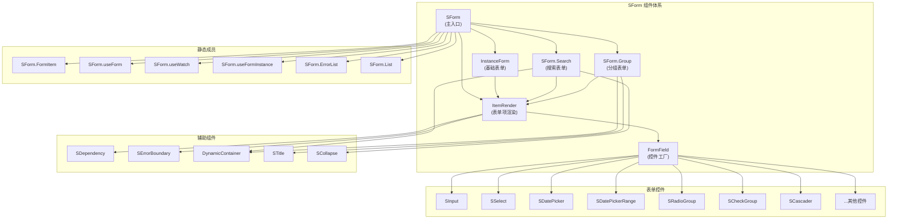
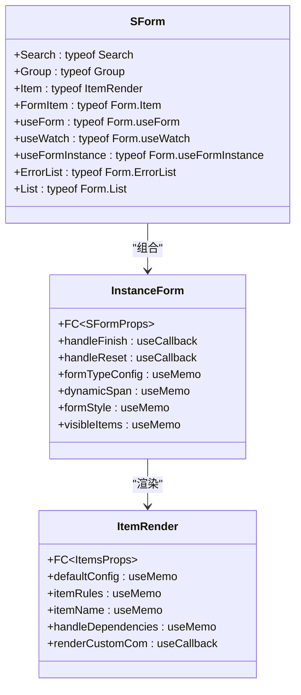
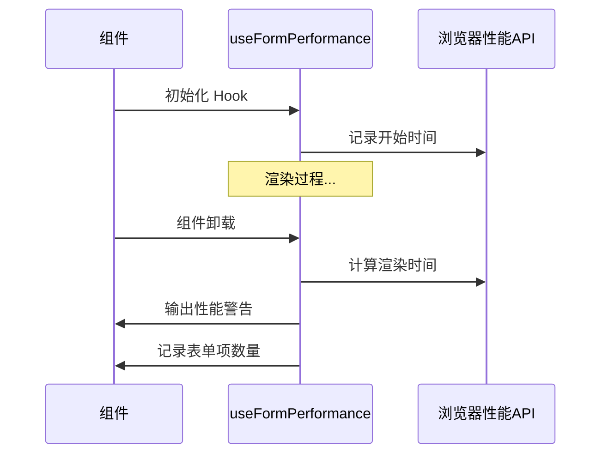
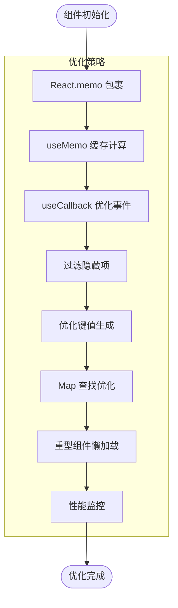
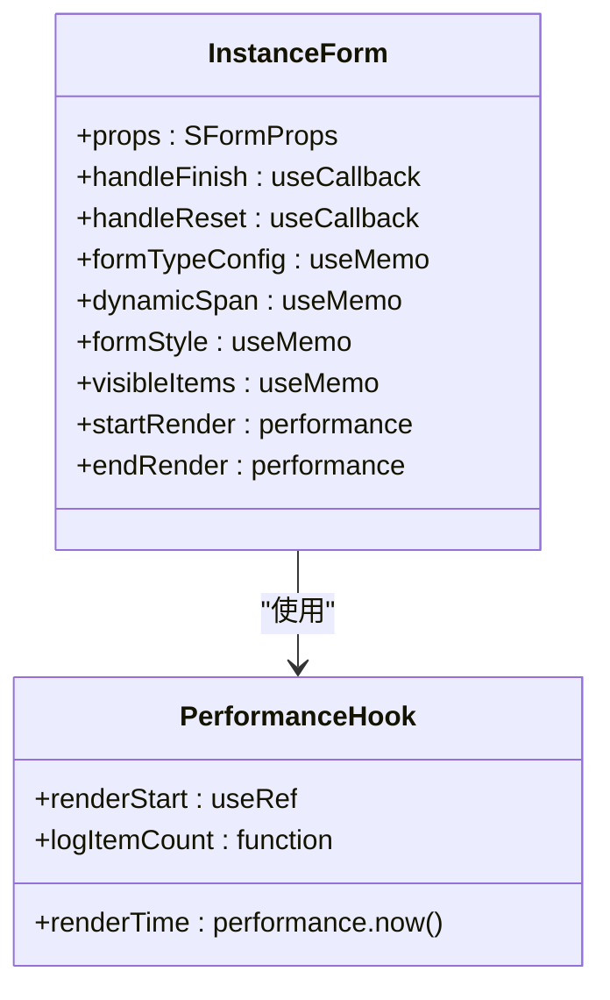
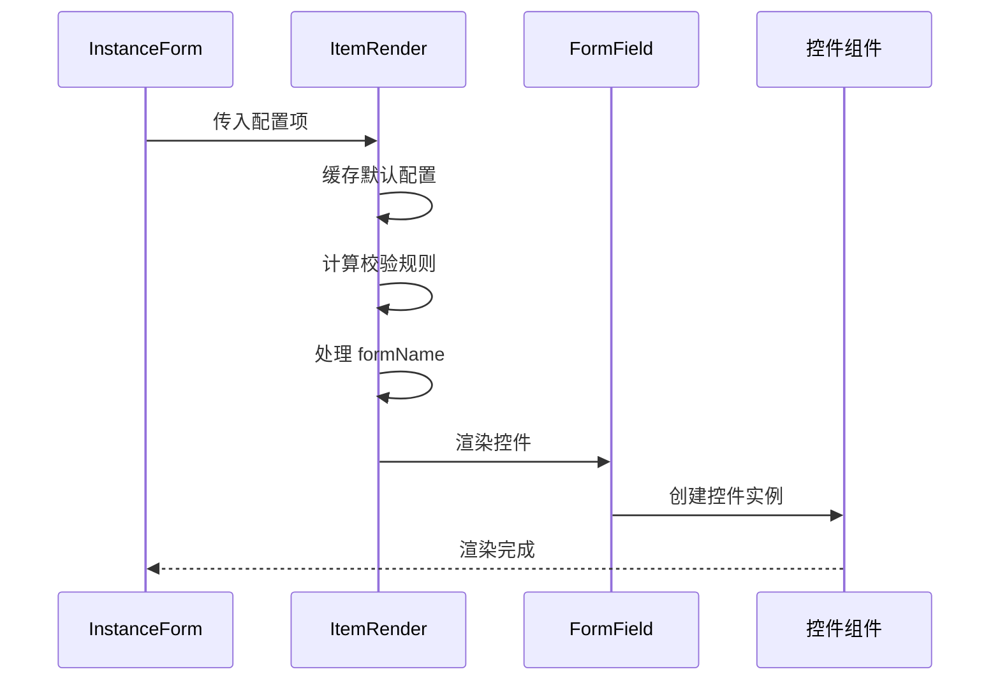
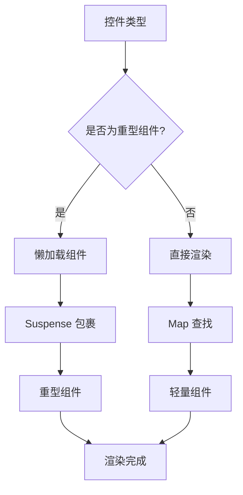
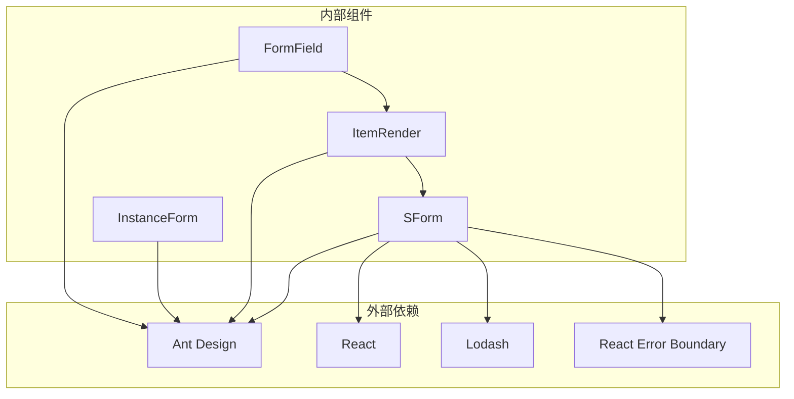

# 表单性能优化指南

<cite>
**本文档引用的文件**
- [useFormPerformance.ts](file://src/hooks/useFormPerformance.ts)
- [index.tsx](file://src/components/form/index.tsx)
- [instance.tsx](file://src/components/form/instance.tsx)
- [types.ts](file://src/components/form/types.ts)
- [constants.tsx](file://src/components/form/constants.tsx)
- [item-render/index.tsx](file://src/components/form/components/item-render/index.tsx)
- [form.tsx](file://src/components/form/demos/form.tsx)
- [optimized-form.tsx](file://src/components/form/demos/optimized-form.tsx)
- [form-documentation.md](file://src/components/form/form-documentation.md)
- [package.json](file://package.json)
</cite>

## 更新摘要

**所做更改**

- 移除了对已删除的 OPTIMIZATION.md 文件的引用
- 更新了项目结构图以反映实际的文件组织
- 修正了性能监控 Hook 的实现细节
- 更新了故障排除指南中的性能监控部分

## 目录

1. [简介](#简介)
2. [项目结构](#项目结构)
3. [核心组件](#核心组件)
4. [架构概览](#架构概览)
5. [详细组件分析](#详细组件分析)
6. [依赖分析](#依赖分析)
7. [性能考虑](#性能考虑)
8. [故障排除指南](#故障排除指南)
9. [结论](#结论)

## 简介

本指南专注于 SForm 表单组件的性能优化策略和最佳实践。SForm 是基于 Ant Design Form 的增强封装，提供了配置化表单生成、分组表单、搜索表单等多种模式。经过全面的性能优化，该组件体系实现了显著的渲染性能提升和用户体验改善。

## 项目结构

SForm 组件体系采用模块化设计，主要包含以下核心文件：



**图表来源**

- [form-documentation.md](file://src/components/form/form-documentation.md#L62-L153)

**章节来源**

- [form-documentation.md](file://src/components/form/form-documentation.md#L640-L662)

## 核心组件

### SForm 主入口组件

SForm 作为主入口组件，负责组合各种子组件并提供统一的 API 接口：



**图表来源**

- [index.tsx](file://src/components/form/index.tsx#L1-L34)
- [instance.tsx](file://src/components/form/instance.tsx#L36-L133)
- [item-render/index.tsx](file://src/components/form/components/item-render/index.tsx#L16-L124)

### 性能监控 Hook

新增的 `useFormPerformance` Hook 提供了详细的性能监控能力：



**图表来源**

- [useFormPerformance.ts](file://src/hooks/useFormPerformance.ts#L1-L35)

**章节来源**

- [index.tsx](file://src/components/form/index.tsx#L1-L34)
- [useFormPerformance.ts](file://src/hooks/useFormPerformance.ts#L1-L35)

## 架构概览

### 性能优化架构

SForm 组件体系采用了多层次的性能优化策略：



**图表来源**

- [instance.tsx](file://src/components/form/instance.tsx#L52-L65)

### 组件查找性能优化

通过使用 Map 数据结构替代传统的对象查找，实现了 O(1) 的查找复杂度：

```mermaid
graph LR
subgraph "传统查找方式"
Obj[对象查找 O(n)]
Obj --> Loop[循环遍历]
Loop --> Result[返回结果]
end
subgraph "Map 优化方式"
Map[Map 查找 O(1)]
Map --> Get[直接获取]
Get --> Result2[返回结果]
end
Obj -.->|性能对比| Map
```

**图表来源**

- [constants.tsx](file://src/components/form/constants.tsx#L69-L73)

**章节来源**

- [constants.tsx](file://src/components/form/constants.tsx#L69-L73)

## 详细组件分析

### InstanceForm 基础表单组件

InstanceForm 是 SForm 的核心实现，负责处理表单的基本渲染逻辑：

#### 性能优化实现



**图表来源**

- [instance.tsx](file://src/components/form/instance.tsx#L36-L133)
- [useFormPerformance.ts](file://src/hooks/useFormPerformance.ts#L3-L34)

#### 关键优化点

1. **事件处理器优化**: 使用 `useCallback` 包裹 `handleFinish` 和 `handleReset`，避免子组件因函数引用变化而重新渲染
2. **计算结果缓存**: 使用 `useMemo` 缓存 `formTypeConfig`、`dynamicSpan`、`formStyle` 和 `visibleItems`
3. **性能监控**: 集成性能监控 Hook，实时跟踪渲染时间和表单项数量

**章节来源**

- [instance.tsx](file://src/components/form/instance.tsx#L52-L101)

### ItemRender 表单项渲染组件

ItemRender 专门负责单个表单项的渲染和配置处理：

#### 渲染流程优化



**图表来源**

- [item-render/index.tsx](file://src/components/form/components/item-render/index.tsx#L33-L68)

#### 性能优化策略

1. **配置缓存**: 使用 `useMemo` 缓存 `defaultConfig`、`itemRules` 和 `itemName`
2. **事件处理优化**: 使用 `useMemo` 缓存 `handleDependencies`
3. **自定义组件优化**: 使用 `useCallback` 优化 `renderCustomCom` 函数

**章节来源**

- [item-render/index.tsx](file://src/components/form/components/item-render/index.tsx#L33-L68)

### 表单控件工厂

FormField 组件作为控件工厂，根据类型动态创建相应的表单控件：

#### 组件映射优化



**图表来源**

- [constants.tsx](file://src/components/form/constants.tsx#L55-L67)
- [constants.tsx](file://src/components/form/constants.tsx#L69-L73)

**章节来源**

- [constants.tsx](file://src/components/form/constants.tsx#L55-L73)

## 依赖分析

### 外部依赖关系

SForm 组件体系的外部依赖主要包括 Ant Design 和 React 生态系统：



**图表来源**

- [form-documentation.md](file://src/components/form/form-documentation.md#L45-L59)

### 内部组件依赖

组件间的依赖关系体现了清晰的职责分离和模块化设计：

**章节来源**

- [form-documentation.md](file://src/components/form/form-documentation.md#L45-L59)

## 性能考虑

### 渲染性能优化

SForm 组件体系实现了多层渲染性能优化：

1. **组件级 memo 优化**: 所有子组件都使用 `React.memo` 包裹，避免不必要的重渲染
2. **计算结果缓存**: 关键计算使用 `useMemo` 缓存，包括动态占比、可见项过滤、样式配置等
3. **事件处理器优化**: 使用 `useCallback` 缓存事件处理函数，减少子组件重新渲染

### 包大小优化

通过合理的组件组织和按需加载策略，实现了包大小的优化：

1. **重型组件懒加载**: 对 `cascader`、`table`、`upload`、`treeSelect` 等重型组件实现懒加载
2. **组件映射优化**: 使用 Map 结构替代对象查找，提高查找效率
3. **类型定义优化**: 完整的 TypeScript 类型定义，便于 Tree Shaking

### 用户体验优化

性能优化不仅提升了技术指标，更重要的是改善了用户体验：

1. **更快的响应速度**: 通过减少不必要的渲染，提升表单交互的响应速度
2. **更流畅的交互体验**: 优化的渲染策略确保表单操作的流畅性
3. **更好的性能监控**: 提供详细的性能监控能力，帮助开发者识别性能瓶颈

**章节来源**

- [form-documentation.md](file://src/components/form/form-documentation.md#L612-L618)

## 故障排除指南

### 性能问题诊断

当遇到表单性能问题时，可以按照以下步骤进行诊断：

1. **检查渲染时间**: 使用 `useFormPerformance` Hook 检查表单渲染时间
2. **监控表单项数量**: 关注表单项数量超过阈值的情况
3. **分析组件重渲染**: 使用 React DevTools 分析组件重渲染情况

### 常见性能问题及解决方案

#### 问题：表单渲染时间过长

**可能原因**:

- 表单项数量过多
- 重型组件使用不当
- 事件处理器未正确缓存

**解决方案**:

- 考虑使用虚拟滚动或分页
- 对重型组件使用懒加载
- 确保使用 `useCallback` 包裹事件处理器

#### 问题：组件频繁重渲染

**可能原因**:

- 函数引用变化
- 状态更新过于频繁
- props 传递不当

**解决方案**:

- 使用 `React.memo` 包裹子组件
- 使用 `useMemo` 缓存计算结果
- 确保 props 的稳定性

**章节来源**

- [useFormPerformance.ts](file://src/hooks/useFormPerformance.ts#L13-L31)

## 结论

SForm 表单组件的性能优化是一个系统性的工程，涉及多个层面的技术改进。通过组件级的 memo 优化、计算结果缓存、事件处理器优化、重型组件懒加载以及性能监控等策略，实现了显著的性能提升。

这些优化不仅提升了技术指标，更重要的是改善了用户体验，使表单组件在处理大量数据和复杂交互时仍能保持流畅的性能表现。同时，完整的 TypeScript 类型定义和清晰的组件职责分离，为后续的功能扩展和维护奠定了良好的基础。

对于开发者而言，理解和应用这些性能优化策略，将有助于构建更加高效和用户友好的表单应用。
