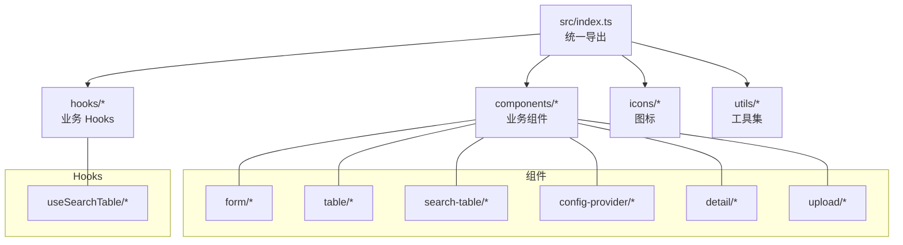
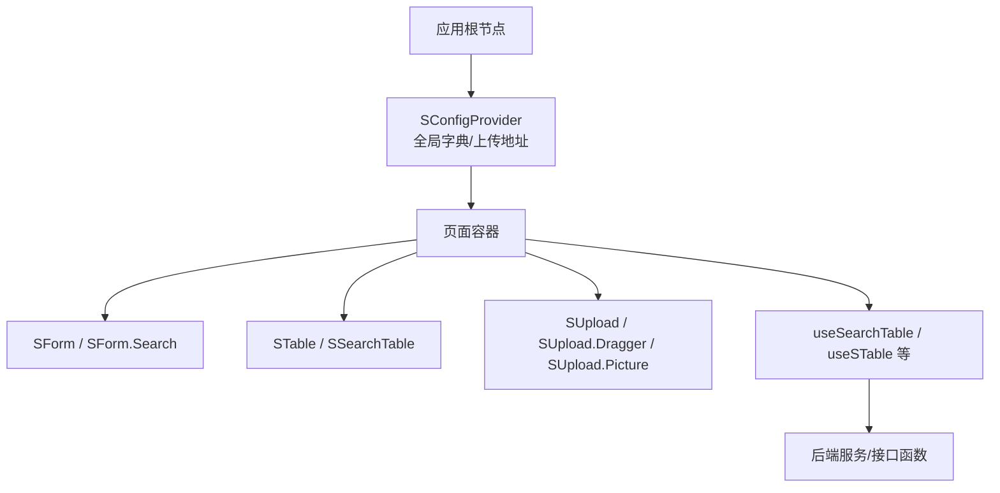
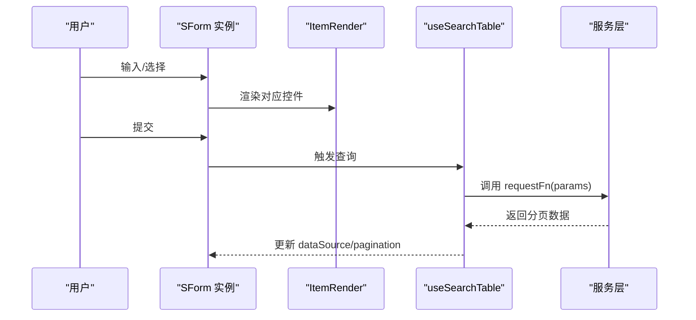
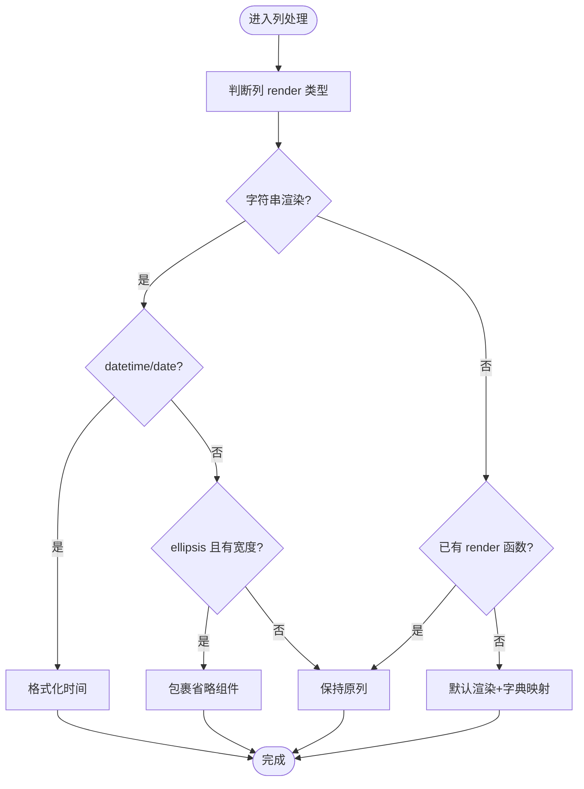
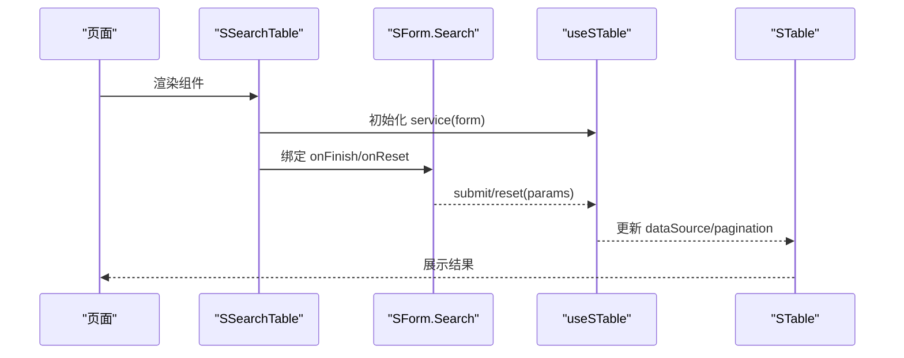
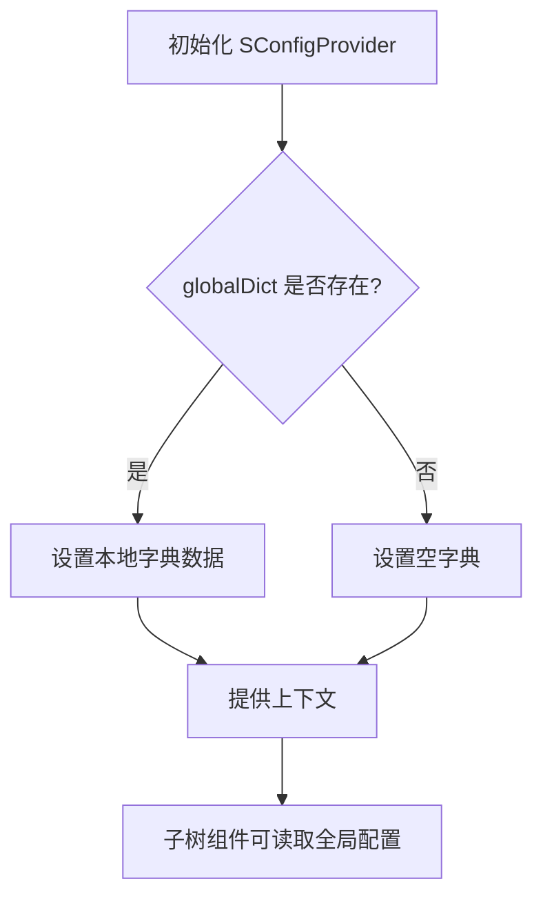
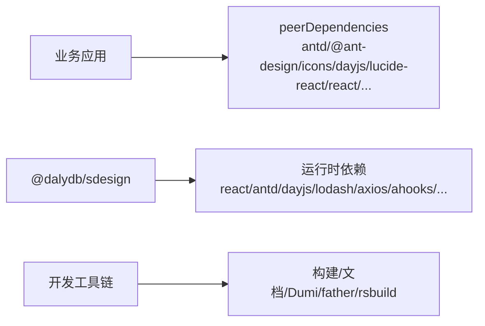

# 最佳实践

<cite>
**本文引用的文件**
- [package.json](file://package.json)
- [README.md](file://README.md)
- [src/index.ts](file://src/index.ts)
- [src/components/form/index.tsx](file://src/components/form/index.tsx)
- [src/components/form/instance.tsx](file://src/components/form/instance.tsx)
- [src/components/table/index.tsx](file://src/components/table/index.tsx)
- [src/components/config-provider/index.tsx](file://src/components/config-provider/index.tsx)
- [src/hooks/useSearchTable/index.ts](file://src/hooks/useSearchTable/index.ts)
- [src/components/search-table/index.tsx](file://src/components/search-table/index.tsx)
- [src/components/detail/index.tsx](file://src/components/detail/index.tsx)
- [src/components/upload/index.tsx](file://src/components/upload/index.tsx)
- [.eslintrc.js](file://.eslintrc.js)
- [docs/introduce-cn/practical-projects.md](file://docs/introduce-cn/practical-projects.md)
- [docs/index.md](file://docs/index.md)
</cite>

## 目录

1. [简介](#简介)
2. [项目结构](#项目结构)
3. [核心组件](#核心组件)
4. [架构总览](#架构总览)
5. [详细组件分析](#详细组件分析)
6. [依赖分析](#依赖分析)
7. [性能考虑](#性能考虑)
8. [故障排除指南](#故障排除指南)
9. [结论](#结论)
10. [附录](#附录)

## 简介

本指南面向在实际项目中使用 SDesign 组件库的团队与个人，围绕“项目集成、性能优化、代码组织、典型业务场景实现、组件组合最佳实践、团队协作规范与常见问题排查”展开。内容基于仓库中的组件、Hooks、配置与文档，帮助你在管理后台、表单设计、数据表格、权限与上传等场景高效落地。

## 项目结构

SDesign 采用按功能域划分的组件组织方式，核心导出入口统一，便于按需引入；配套 Hooks 提供搜索表格、字典映射、上传等能力；文档站点基于 Dumi 构建，提供示例与说明。

图表来源

- [src/index.ts](file://src/index.ts#L1-L5)

章节来源

- [src/index.ts](file://src/index.ts#L1-L5)
- [README.md](file://README.md#L1-L62)

## 核心组件

- 表单 SForm：支持栅格布局、只读模式、动态列数、子项渲染与分组，适配复杂业务表单。
- 数据表格 STable：内置字典映射、时间格式化、省略显示、序号列等增强，降低重复开发成本。
- 搜索表格 SSearchTable：整合表单搜索、表格展示与分页，快速搭建查询列表页。
- 配置提供者 SConfigProvider：集中注入全局字典、上传地址等上下文配置。
- 详情 SDetail：用于只读信息展示，支持分组与条目渲染。
- 上传 SUpload：提供拖拽与图片墙两种上传形态，配合实例与钩子使用。
- Hooks：useSearchTable 提供搜索+分页+请求一体化能力。

章节来源

- [src/components/form/index.tsx](file://src/components/form/index.tsx#L1-L21)
- [src/components/form/instance.tsx](file://src/components/form/instance.tsx#L1-L99)
- [src/components/table/index.tsx](file://src/components/table/index.tsx#L1-L135)
- [src/components/config-provider/index.tsx](file://src/components/config-provider/index.tsx#L1-L47)
- [src/hooks/useSearchTable/index.ts](file://src/hooks/useSearchTable/index.ts#L1-L104)
- [src/components/search-table/index.tsx](file://src/components/search-table/index.tsx#L1-L69)
- [src/components/detail/index.tsx](file://src/components/detail/index.tsx#L1-L19)
- [src/components/upload/index.tsx](file://src/components/upload/index.tsx#L1-L18)

## 架构总览

SDesign 的使用通常遵循“配置提供者 -> 组件组合 -> Hooks 驱动”的流程：先在根部注入全局字典与上传地址，再以 SForm + STable 或 SSearchTable 快速拼装页面，最后通过 useSearchTable 等 Hooks 管理状态与请求。

图表来源

- [src/components/config-provider/index.tsx](file://src/components/config-provider/index.tsx#L1-L47)
- [src/components/search-table/index.tsx](file://src/components/search-table/index.tsx#L1-L69)
- [src/hooks/useSearchTable/index.ts](file://src/hooks/useSearchTable/index.ts#L1-L104)

## 详细组件分析

### 表单 SForm 最佳实践

- 列布局与只读模式：通过 columns 控制栅格列数，readonly 自动禁用输入控件，适合详情页或审批页。
- 动态列与隐藏字段：利用 items 中的 hidden 字段控制渲染，结合 colProps 调整栅格属性。
- 子项渲染：ItemRender 负责具体控件渲染，支持依赖联动、校验与占位符。
- 与搜索表格联动：在 SSearchTable 中使用 SForm.Search 作为查询区，统一提交与重置逻辑。

图表来源

- [src/components/form/instance.tsx](file://src/components/form/instance.tsx#L1-L99)
- [src/components/form/index.tsx](file://src/components/form/index.tsx#L1-L21)
- [src/hooks/useSearchTable/index.ts](file://src/hooks/useSearchTable/index.ts#L1-L104)

章节来源

- [src/components/form/instance.tsx](file://src/components/form/instance.tsx#L1-L99)
- [src/components/form/index.tsx](file://src/components/form/index.tsx#L1-L21)

### 数据表格 STable 最佳实践

- 字典映射：通过列级 dictKey 与全局字典联动，自动将枚举值转换为文案。
- 时间渲染：内置 datetime/date 渲染器，自动格式化非法时间。
- 单行省略：当列设置 ellipsis 且存在宽度时，自动包裹省略文本组件。
- 序号列：开启 isSeq 自动生成序号列，支持分页计算起始序号。

图表来源

- [src/components/table/index.tsx](file://src/components/table/index.tsx#L1-L135)

章节来源

- [src/components/table/index.tsx](file://src/components/table/index.tsx#L1-L135)

### 搜索表格 SSearchTable 最佳实践

- 页面骨架：标题、查询表单、卡片容器、表格与分页。
- 查询驱动：通过 useSTable 注入 form 与 service，统一 submit/reset 与分页切换。
- 与 SForm.Search 联动：onFinish/onReset 直接绑定到 search 方法，减少样板代码。

图表来源

- [src/components/search-table/index.tsx](file://src/components/search-table/index.tsx#L1-L69)
- [src/hooks/useSearchTable/index.ts](file://src/hooks/useSearchTable/index.ts#L1-L104)

章节来源

- [src/components/search-table/index.tsx](file://src/components/search-table/index.tsx#L1-L69)
- [src/hooks/useSearchTable/index.ts](file://src/hooks/useSearchTable/index.ts#L1-L104)

### 配置提供者 SConfigProvider 最佳实践

- 全局字典：通过 globalDict 注入枚举映射，供 STable、SForm 等组件消费。
- 上传地址：统一注入 uploadUrl，避免各处硬编码。
- 上下文暴露：对外导出 ConfigContext，便于深层组件读取。

图表来源

- [src/components/config-provider/index.tsx](file://src/components/config-provider/index.tsx#L1-L47)

章节来源

- [src/components/config-provider/index.tsx](file://src/components/config-provider/index.tsx#L1-L47)

### 详情 SDetail 最佳实践

- 分组与条目：Group/Item 用于只读信息的分组展示，适合审批、详情页。
- 与表单联动：在只读模式下可直接复用表单项的渲染逻辑，保证一致性。

章节来源

- [src/components/detail/index.tsx](file://src/components/detail/index.tsx#L1-L19)

### 上传 SUpload 最佳实践

- 形态选择：Dragger 用于拖拽上传，Picture 用于图片墙展示。
- 实例与钩子：结合实例与 useUpload/useBeforeUpload 钩子，实现上传前校验与进度反馈。

章节来源

- [src/components/upload/index.tsx](file://src/components/upload/index.tsx#L1-L18)

## 依赖分析

- 运行时依赖：React、Ant Design、dayjs、lodash、axios、react-error-boundary、ahooks、antd-style、classnames、copy-to-clipboard。
- 开发依赖：Dumi、father、rsbuild、eslint、stylelint、prettier、husky、lint-staged 等。
- 对外 peerDependencies：antd、@ant-design/icons、dayjs、lucide-react、react、react-dom、react-router。

图表来源

- [package.json](file://package.json#L52-L101)

章节来源

- [package.json](file://package.json#L1-L121)

## 性能考虑

- 渲染优化
  - 使用 memo 包裹稳定组件（如 STable），避免不必要的重渲染。
  - 在 SForm 中仅渲染可见字段，利用 hidden 控制渲染量。
- 计算优化
  - 列渲染逻辑使用 useMemo 缓存，减少每次渲染的计算开销（如字典映射、序号列）。
  - useSearchTable 中对 dataSource、pagination 的计算进行 memo 化。
- 请求与分页
  - 合理设置分页参数，避免一次性拉取过多数据。
  - 使用 ahooks 的 useRequest，结合手动触发与 ready 条件，控制请求时机。
- 图标与样式
  - 使用 lucide-react 等轻量图标库，避免引入大体积资源。
  - 优先使用 antd-style 的 CSS-in-JS 能力，减少全局样式冲突与打包体积。

章节来源

- [src/components/table/index.tsx](file://src/components/table/index.tsx#L1-L135)
- [src/components/form/instance.tsx](file://src/components/form/instance.tsx#L1-L99)
- [src/hooks/useSearchTable/index.ts](file://src/hooks/useSearchTable/index.ts#L1-L104)

## 故障排除指南

- 表单提交/重置无效
  - 检查 SForm 的 onFinish/onReset 是否正确传递给上层容器或 Hooks。
  - 确认 SForm.Search 与 useSearchTable 的 submit/reset 绑定一致。
- 字典不生效
  - 确认已在 SConfigProvider 中注入 globalDict，并确保 dictKey 与字典键一致。
- 时间显示异常
  - 检查传入时间是否为合法值，STable 内置了非法时间回退逻辑。
- 上传失败或无法预览
  - 核对 uploadUrl 是否正确注入，确认 useBeforeUpload/useUpload 钩子未拦截文件。
- 文档与构建问题
  - 使用提供的脚本进行开发与构建，若出现依赖冲突，优先检查 peerDependencies 版本范围。

章节来源

- [src/components/config-provider/index.tsx](file://src/components/config-provider/index.tsx#L1-L47)
- [src/components/table/index.tsx](file://src/components/table/index.tsx#L1-L135)
- [src/components/search-table/index.tsx](file://src/components/search-table/index.tsx#L1-L69)
- [package.json](file://package.json#L52-L101)

## 结论

SDesign 通过“配置提供者 + 组件组合 + Hooks 驱动”的模式，显著降低了管理后台的重复开发成本。在实际项目中，建议：

- 在根部统一注入全局字典与上传地址；
- 使用 SForm + SSearchTable 快速搭建查询列表页；
- 通过 useSearchTable 管理请求与分页；
- 在渲染与计算层面做 memo 化与按需渲染；
- 严格遵循团队的代码风格与提交规范，保障可维护性。

## 附录

### 项目集成步骤

- 安装与使用参考文档中的实战章节，按步骤安装并引入所需组件。
- 在应用根部包裹 SConfigProvider，注入全局字典与上传地址。
- 在页面中组合 SForm/Search、SSearchTable、STable、SUpload 等组件。

章节来源

- [docs/introduce-cn/practical-projects.md](file://docs/introduce-cn/practical-projects.md#L1-L14)
- [docs/index.md](file://docs/index.md#L1-L9)

### 团队协作规范与标准

- 代码风格与检查
  - 使用 ESLint、Stylelint、Prettier 与 husky + lint-staged 统一风格与提交前检查。
  - 导入顺序与分组规则可按需启用，保持模块导入清晰有序。
- 命名约定
  - 组件导出采用 PascalCase，如 SForm、STable、SSearchTable。
  - Hooks 以 use 开头，如 useSearchTable。
- 文档与示例
  - 通过 Dumi 文档站点维护组件说明与示例，便于团队查阅与演示。

章节来源

- [.eslintrc.js](file://.eslintrc.js#L1-L45)
- [package.json](file://package.json#L26-L46)
