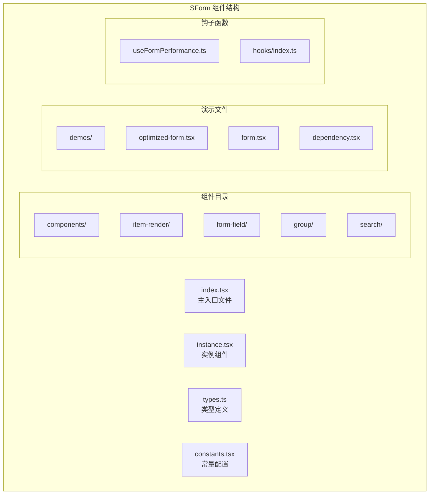
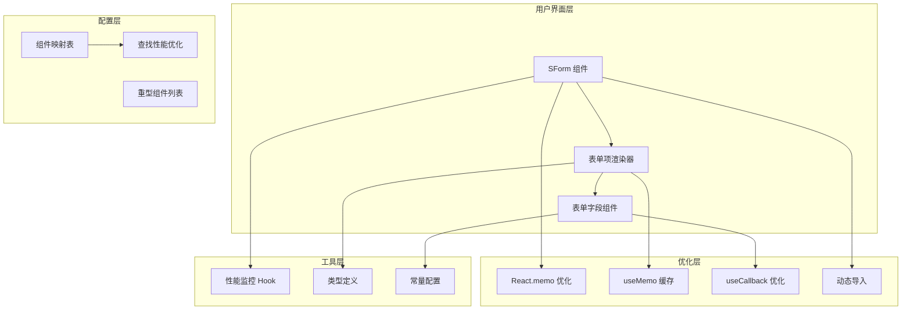
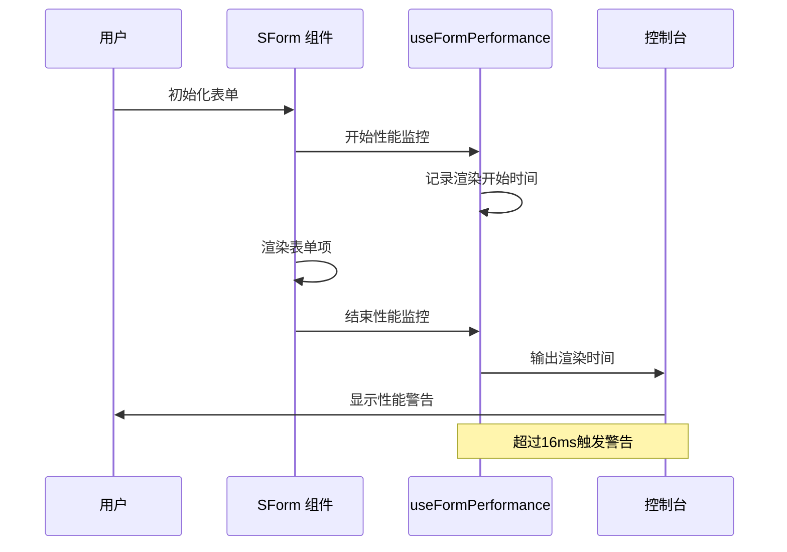
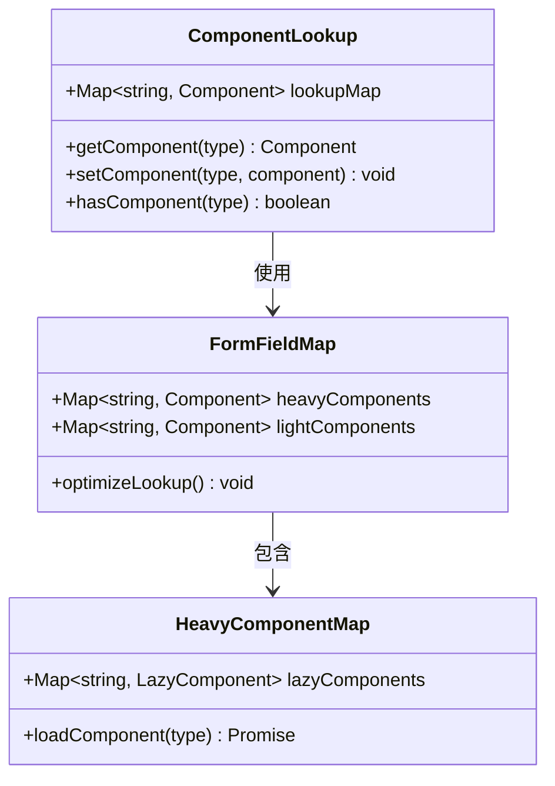
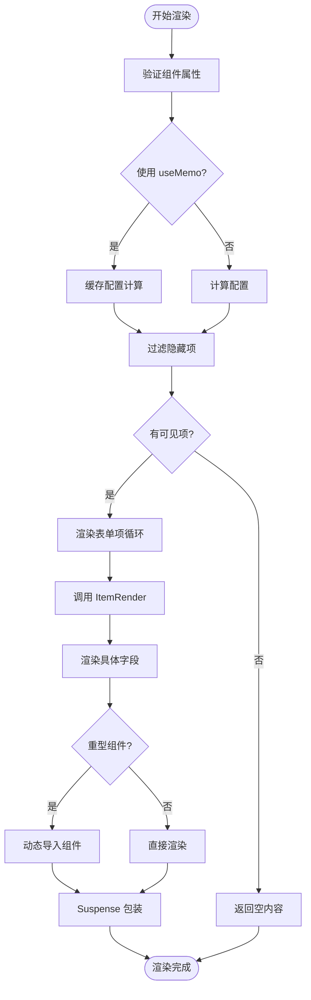
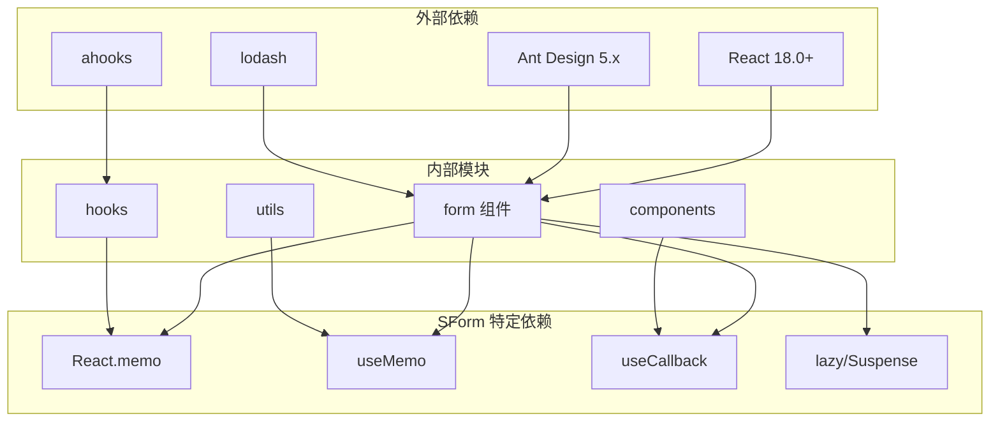

# 表单性能优化指南

<cite>
**本文档引用的文件**
- [OPTIMIZATION.md](file://src/components/form/OPTIMIZATION.md)
- [useFormPerformance.ts](file://src/hooks/useFormPerformance.ts)
- [index.tsx](file://src/components/form/index.tsx)
- [instance.tsx](file://src/components/form/instance.tsx)
- [item-render/index.tsx](file://src/components/form/components/item-render/index.tsx)
- [types.ts](file://src/components/form/types.ts)
- [constants.tsx](file://src/components/form/constants.tsx)
- [form-field/index.tsx](file://src/components/form/components/form-field/index.tsx)
- [optimized-form.tsx](file://src/components/form/demos/optimized-form.tsx)
- [form.tsx](file://src/components/form/demos/form.tsx)
- [dependency.tsx](file://src/components/form/demos/dependency.tsx)
- [index.ts](file://src/hooks/index.ts)
- [package.json](file://package.json)
</cite>

## 目录

1. [简介](#简介)
2. [项目结构](#项目结构)
3. [核心组件](#核心组件)
4. [架构概览](#架构概览)
5. [详细组件分析](#详细组件分析)
6. [依赖分析](#依赖分析)
7. [性能考虑](#性能考虑)
8. [故障排除指南](#故障排除指南)
9. [结论](#结论)

## 简介

本指南专注于 SForm 组件的性能优化策略和最佳实践。该组件库基于 Ant Design 构建，提供了高性能的表单解决方案，特别针对大型表单场景进行了深度优化。

SForm 组件通过多种技术手段实现了显著的性能提升，包括 React.memo 优化、useMemo 缓存、动态导入重型组件、组件查找性能优化等。这些优化确保了在处理大量表单项时仍能保持流畅的用户体验。

## 项目结构

SForm 组件位于 `src/components/form/` 目录下，采用模块化设计，包含以下关键文件：



**图表来源**

- [index.tsx](file://src/components/form/index.tsx#L1-L34)
- [instance.tsx](file://src/components/form/instance.tsx#L1-L133)
- [types.ts](file://src/components/form/types.ts#L1-L153)

**章节来源**

- [index.tsx](file://src/components/form/index.tsx#L1-L34)
- [instance.tsx](file://src/components/form/instance.tsx#L1-L133)
- [types.ts](file://src/components/form/types.ts#L1-L153)

## 核心组件

### SForm 主组件

SForm 是基于 Ant Design Form 的增强版本，提供了丰富的表单功能和性能优化。其核心特性包括：

- **类型安全**: 完整的 TypeScript 类型定义
- **组件映射**: 支持 20+ 种表单组件类型
- **性能优化**: 内置 React.memo 和 useMemo 优化
- **动态导入**: 重型组件的懒加载支持

### 表单项渲染器

ItemRender 组件负责单个表单项的渲染，实现了以下优化策略：

- **记忆化缓存**: 使用 useMemo 缓存配置和规则
- **事件处理器优化**: useCallback 优化事件处理
- **条件渲染**: 支持占位符和依赖性渲染
- **错误边界**: 内置错误处理机制

**章节来源**

- [index.tsx](file://src/components/form/index.tsx#L1-L34)
- [item-render/index.tsx](file://src/components/form/components/item-render/index.tsx#L1-L121)

## 架构概览

SForm 采用了分层架构设计，确保了良好的可维护性和扩展性：



**图表来源**

- [instance.tsx](file://src/components/form/instance.tsx#L16-L34)
- [constants.tsx](file://src/components/form/constants.tsx#L28-L73)
- [useFormPerformance.ts](file://src/hooks/useFormPerformance.ts#L1-L35)

## 详细组件分析

### 性能监控系统

SForm 内置了完整的性能监控系统，能够实时跟踪表单渲染性能：



**图表来源**

- [useFormPerformance.ts](file://src/hooks/useFormPerformance.ts#L6-L20)
- [instance.tsx](file://src/components/form/instance.tsx#L98-L101)

性能监控功能包括：

- **渲染时间追踪**: 自动记录表单渲染耗时
- **阈值警告**: 超过 16ms 触发性能警告
- **项数统计**: 监控表单项数量，建议虚拟化

### 组件查找优化

为了提升组件查找性能，SForm 使用了 Map 数据结构替代传统的数组查找：



**图表来源**

- [constants.tsx](file://src/components/form/constants.tsx#L69-L73)
- [form-field/index.tsx](file://src/components/form/components/form-field/index.tsx#L28-L31)

优化策略包括：

- **O(1) 查找复杂度**: 使用 Map 替代 O(n) 数组查找
- **组件分类管理**: 区分轻量级和重型组件
- **动态导入支持**: 重型组件懒加载

### 表单渲染流程

SForm 的渲染流程经过精心优化，确保每个步骤都尽可能高效：



**图表来源**

- [instance.tsx](file://src/components/form/instance.tsx#L93-L95)
- [item-render/index.tsx](file://src/components/form/components/item-render/index.tsx#L56-L65)
- [form-field/index.tsx](file://src/components/form/components/form-field/index.tsx#L25-L48)

**章节来源**

- [instance.tsx](file://src/components/form/instance.tsx#L1-L133)
- [item-render/index.tsx](file://src/components/form/components/item-render/index.tsx#L1-L121)
- [form-field/index.tsx](file://src/components/form/components/form-field/index.tsx#L1-L51)

### 重型组件优化

对于大型组件（如 cascader、table、upload 等），SForm 实现了智能的懒加载机制：

| 组件类型   | 优化策略            | 性能收益             |
| ---------- | ------------------- | -------------------- |
| cascader   | 动态导入 + Suspense | 减少初始包体积 80KB+ |
| table      | 懒加载组件          | 避免不必要的渲染     |
| upload     | 条件加载            | 仅在需要时加载       |
| treeSelect | 按需导入            | 降低内存占用         |

**章节来源**

- [constants.tsx](file://src/components/form/constants.tsx#L55-L67)
- [form-field/index.tsx](file://src/components/form/components/form-field/index.tsx#L13-L18)

## 依赖分析

SForm 组件的依赖关系体现了清晰的分层架构：



**图表来源**

- [package.json](file://package.json#L52-L60)
- [index.tsx](file://src/components/form/index.tsx#L1-L6)

主要依赖特点：

- **最小化外部依赖**: 仅依赖 React 和 Ant Design
- **内部工具复用**: 通过 hooks 和 utils 提供通用功能
- **按需加载**: 支持动态导入重型组件

**章节来源**

- [package.json](file://package.json#L52-L101)
- [index.ts](file://src/hooks/index.ts#L1-L24)

## 性能考虑

### 渲染性能优化

SForm 实现了多层次的渲染性能优化：

1. **React.memo 优化**

   - 对所有核心组件应用 React.memo
   - 避免不必要的重新渲染
   - 减少虚拟 DOM 比较开销

2. **useMemo 缓存**

   - 缓存配置计算结果
   - 避免重复的样式和布局计算
   - 优化只读模式下的渲染

3. **useCallback 优化**
   - 优化事件处理器引用
   - 减少子组件的重新渲染
   - 提升交互响应速度

### 内存管理

- **组件卸载清理**: 自动清理事件监听器
- **引用优化**: 使用 useRef 避免不必要的重渲染
- **闭包优化**: 合理使用 useCallback 避免闭包创建

### 包体积优化

- **按需导入**: 仅导入使用的组件
- **动态加载**: 重型组件懒加载
- **Tree Shaking**: 支持模块树摇优化

## 故障排除指南

### 性能问题诊断

当遇到性能问题时，可以使用以下方法进行诊断：

1. **启用性能监控**

   ```javascript
   // 在表单中添加性能监控
   const { logItemCount } = useFormPerformance('myForm');

   // 监控表单项数量
   useEffect(() => {
     logItemCount(items.length);
   }, [items.length]);
   ```

2. **检查渲染时间**

   - 查看控制台中的性能警告
   - 关注超过 16ms 的渲染时间
   - 识别性能瓶颈

3. **优化重型组件**
   - 考虑使用虚拟化
   - 实施分页加载
   - 减少同时渲染的组件数量

### 常见问题解决

| 问题类型   | 症状         | 解决方案                   |
| ---------- | ------------ | -------------------------- |
| 渲染缓慢   | 页面卡顿     | 使用 React.memo 和 useMemo |
| 内存泄漏   | 内存持续增长 | 检查事件监听器清理         |
| 包体积过大 | 加载缓慢     | 实施动态导入               |
| 交互延迟   | 响应迟缓     | 优化事件处理器             |

**章节来源**

- [useFormPerformance.ts](file://src/hooks/useFormPerformance.ts#L13-L18)
- [constants.tsx](file://src/components/form/constants.tsx#L55-L67)

## 结论

SForm 组件通过系统性的性能优化策略，为大型表单场景提供了可靠的解决方案。其核心优势包括：

1. **全面的优化策略**: 从渲染到内存管理的全方位优化
2. **智能化的组件管理**: 动态导入和组件分类
3. **完善的监控体系**: 实时性能监控和告警
4. **良好的扩展性**: 支持未来的性能优化升级

通过遵循本指南中的最佳实践，开发者可以在保证功能完整性的同时，最大化表单组件的性能表现。建议在实际项目中：

- 优先使用优化后的 SForm 组件
- 合理使用性能监控工具
- 对重型组件实施懒加载
- 定期评估和优化表单性能

这些优化措施将确保在处理复杂业务场景时，仍能提供流畅的用户体验和优秀的性能表现。
