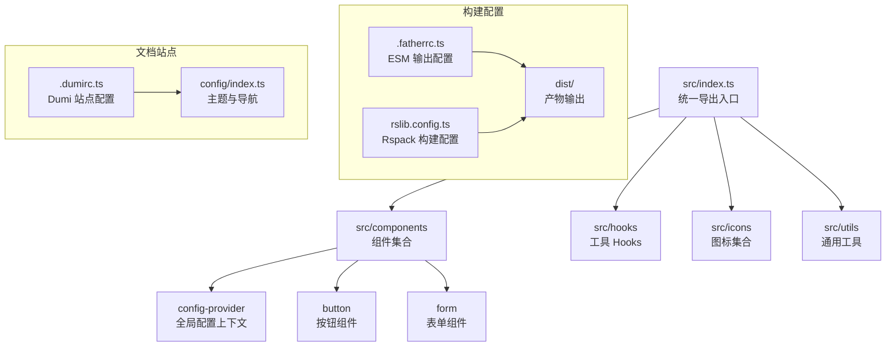
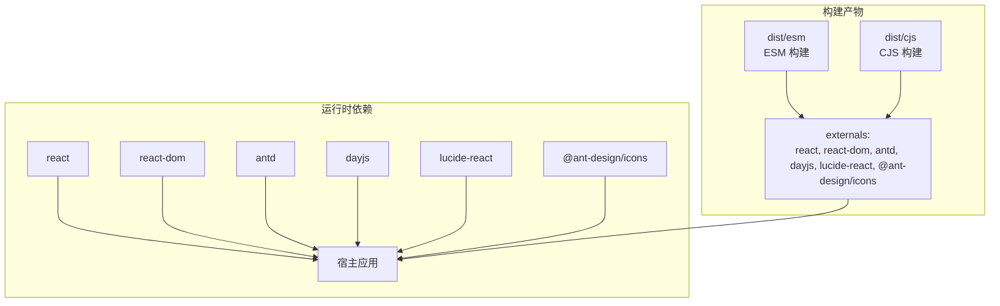
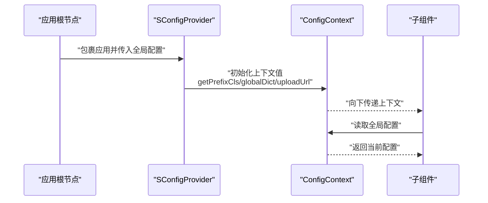
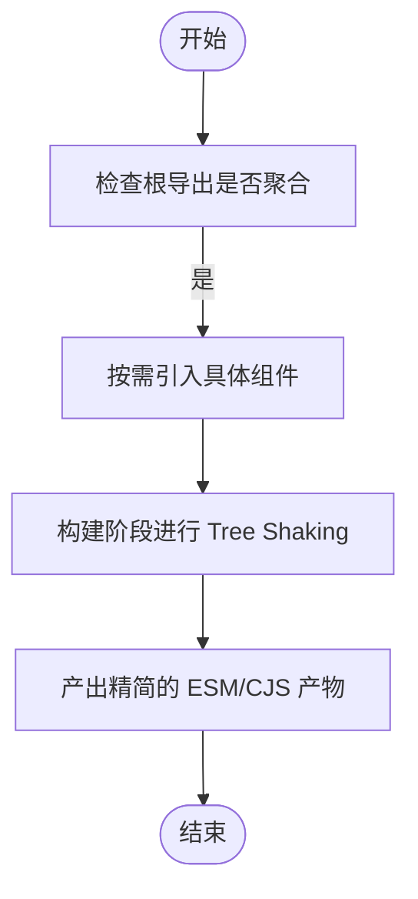
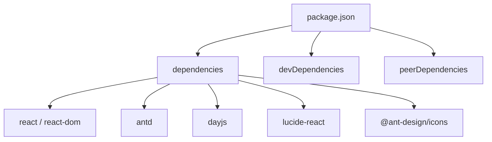

# 项目集成实践

<cite>
**本文引用的文件**
- [package.json](file://package.json)
- [README.md](file://README.md)
- [src/index.ts](file://src/index.ts)
- [src/components/config-provider/index.tsx](file://src/components/config-provider/index.tsx)
- [src/components/config-provider/contexts.tsx](file://src/components/config-provider/contexts.tsx)
- [src/components/config-provider/types.ts](file://src/components/config-provider/types.ts)
- [src/theme/default.less](file://src/theme/default.less)
- [.fatherrc.ts](file://.fatherrc.ts)
- [rslib.config.ts](file://rslib.config.ts)
- [.dumirc.ts](file://.dumirc.ts)
- [config/index.ts](file://config/index.ts)
- [docs/introduce-cn/practical-projects.md](file://docs/introduce-cn/practical-projects.md)
- [src/components/button/index.tsx](file://src/components/button/index.tsx)
- [src/components/form/index.tsx](file://src/components/form/index.tsx)
</cite>

## 目录

1. [简介](#简介)
2. [项目结构](#项目结构)
3. [核心组件](#核心组件)
4. [架构总览](#架构总览)
5. [详细组件分析](#详细组件分析)
6. [依赖分析](#依赖分析)
7. [性能考虑](#性能考虑)
8. [故障排查指南](#故障排查指南)
9. [结论](#结论)
10. [附录](#附录)

## 简介

本指南面向在现有项目中集成 SDesign 组件库的工程实践，覆盖安装与配置、依赖管理、版本兼容性、全局配置（ConfigProvider）、主题与国际化、按需引入优化以及与其他 UI 库共存注意事项。SDesign 是基于 Ant Design 的二次封装组件库，提供业务场景常用的管理端组件，并通过 antd-style 实现 CSS-in-JS 样式方案。

## 项目结构

SDesign 采用多导出的统一入口，组件、Hooks、Icons、Utils 通过根导出聚合，便于按需引入与 Tree Shaking。构建配置分别支持 ESM/CJS 输出，并对外部依赖进行声明，确保在宿主项目中正确共享运行时依赖。

图示来源

- [src/index.ts](file://src/index.ts#L1-L5)
- [.fatherrc.ts](file://.fatherrc.ts#L1-L13)
- [rslib.config.ts](file://rslib.config.ts#L1-L79)
- [.dumirc.ts](file://.dumirc.ts#L1-L22)
- [config/index.ts](file://config/index.ts#L1-L27)

章节来源

- [src/index.ts](file://src/index.ts#L1-L5)
- [.fatherrc.ts](file://.fatherrc.ts#L1-L13)
- [rslib.config.ts](file://rslib.config.ts#L1-L79)
- [.dumirc.ts](file://.dumirc.ts#L1-L22)
- [config/index.ts](file://config/index.ts#L1-L27)

## 核心组件

- 统一导出入口：通过根导出聚合组件、Hooks、Icons、Utils，便于按需引入与 Tree Shaking。
- 全局配置 Provider：提供字典、上传 URL、前缀类名等全局能力，贯穿各组件使用。
- 主题与样式：默认前缀为“sd”，结合 antd-style 提供 CSS-in-JS 能力；LESS 变量前缀可自定义。

章节来源

- [src/index.ts](file://src/index.ts#L1-L5)
- [src/components/config-provider/index.tsx](file://src/components/config-provider/index.tsx#L1-L47)
- [src/components/config-provider/contexts.tsx](file://src/components/config-provider/contexts.tsx#L1-L20)
- [src/components/config-provider/types.ts](file://src/components/config-provider/types.ts#L1-L17)
- [src/theme/default.less](file://src/theme/default.less#L1-L2)

## 架构总览

SDesign 在构建阶段将组件以 ESM/CJS 形式输出，并将 React、ReactDOM、Ant Design、DayJS、Lucide-React、Ant Design Icons 等声明为外部依赖，避免在库内重复打包，降低宿主应用体积。

图示来源

- [rslib.config.ts](file://rslib.config.ts#L43-L50)
- [rslib.config.ts](file://rslib.config.ts#L60-L67)
- [package.json](file://package.json#L93-L101)

章节来源

- [rslib.config.ts](file://rslib.config.ts#L36-L71)
- [package.json](file://package.json#L93-L101)

## 详细组件分析

### 全局配置 Provider（ConfigProvider）

- 职责：提供全局字典、上传接口地址、前缀类名生成策略，作为组件树的上下文根。
- 关键点：
  - 字典数据可通过异步加载后注入，组件内部通过上下文读取。
  - 前缀类名默认以“sd”为前缀，支持自定义覆盖。
  - 上传 URL 用于上传类组件的统一接口配置。

图示来源

- [src/components/config-provider/index.tsx](file://src/components/config-provider/index.tsx#L1-L47)
- [src/components/config-provider/contexts.tsx](file://src/components/config-provider/contexts.tsx#L1-L20)
- [src/components/config-provider/types.ts](file://src/components/config-provider/types.ts#L1-L17)

章节来源

- [src/components/config-provider/index.tsx](file://src/components/config-provider/index.tsx#L1-L47)
- [src/components/config-provider/contexts.tsx](file://src/components/config-provider/contexts.tsx#L1-L20)
- [src/components/config-provider/types.ts](file://src/components/config-provider/types.ts#L1-L17)

### 按需引入与 Tree Shaking

- 统一导出入口：通过根导出聚合，避免全量导入导致的体积膨胀。
- 组件命名导出：如按钮与表单组件均提供命名导出与组合形态，便于按需引入。
- 构建配置：ESM/CJS 输出配合忽略测试与文档资源，减少打包无关内容。

图示来源

- [src/index.ts](file://src/index.ts#L1-L5)
- [.fatherrc.ts](file://.fatherrc.ts#L1-L13)
- [rslib.config.ts](file://rslib.config.ts#L1-L79)

章节来源

- [src/index.ts](file://src/index.ts#L1-L5)
- [.fatherrc.ts](file://.fatherrc.ts#L1-L13)
- [rslib.config.ts](file://rslib.config.ts#L1-L79)

### 主题与样式

- 默认前缀：组件样式前缀默认为“sd”，可在 LESS 变量中调整。
- CSS-in-JS：结合 antd-style 提供动态样式能力，减少全局样式污染。
- 建议：在宿主项目中统一管理主题变量，避免与其它 UI 库产生冲突。

章节来源

- [src/theme/default.less](file://src/theme/default.less#L1-L2)
- [package.json](file://package.json#L52-L60)

### 国际化与字典

- 全局字典：通过 ConfigProvider 注入全局字典，组件内部可按需读取。
- 上传接口：统一上传 URL，便于跨组件复用。

章节来源

- [src/components/config-provider/index.tsx](file://src/components/config-provider/index.tsx#L1-L47)
- [src/components/config-provider/types.ts](file://src/components/config-provider/types.ts#L1-L17)

### 与 UI 库共存注意事项

- 外部依赖声明：构建时将 React、Antd、DayJS、Lucide-React、Ant Design Icons 声明为外部依赖，避免与宿主项目重复打包。
- 版本对齐：建议宿主项目保持与 peerDependencies 的版本范围一致，减少运行时冲突。
- 样式隔离：优先使用 antd-style 与组件前缀“sd”，避免与 Antd 默认样式冲突。

章节来源

- [rslib.config.ts](file://rslib.config.ts#L43-L50)
- [rslib.config.ts](file://rslib.config.ts#L60-L67)
- [package.json](file://package.json#L93-L101)

## 依赖分析

- 运行时依赖：包含 ahooks、antd-style、axios、classnames、copy-to-clipboard、lodash、react-error-boundary 等，满足常用业务与 UI 能力。
- 开发依赖：包含 dumi、father、rsbuild、typescript、eslint、stylelint 等，支撑文档、构建与质量保障。
- 对等依赖：明确声明 React、ReactDOM、Antd、DayJS、Lucide-React、Ant Design Icons 的版本范围，确保与宿主项目一致。

图示来源

- [package.json](file://package.json#L52-L101)

章节来源

- [package.json](file://package.json#L52-L101)

## 性能考虑

- 按需引入：仅引入所需组件，结合 Tree Shaking 减少打包体积。
- 构建优化：忽略测试与文档资源，避免将演示与测试文件打入产物。
- 外部依赖：将 React 生态与 Antd 等声明为外部依赖，降低重复打包成本。
- 样式优化：使用 antd-style 与组件前缀，避免全局样式冲突带来的重绘与回流。

章节来源

- [rslib.config.ts](file://rslib.config.ts#L10-L35)
- [rslib.config.ts](file://rslib.config.ts#L43-L71)
- [package.json](file://package.json#L52-L60)

## 故障排查指南

- 安装与版本不匹配：若出现运行时错误，请核对宿主项目与 peerDependencies 的版本范围是否一致。
- 样式冲突：若出现样式错乱，确认是否同时引入了多个 UI 库且未做样式隔离；建议统一使用 antd-style 与组件前缀“sd”。
- 文档与演示：开发与构建命令可参考仓库脚本，文档构建与本地预览可使用相应脚本。
- 上传接口问题：通过 ConfigProvider 的 uploadUrl 统一配置上传接口，确保组件调用一致。

章节来源

- [package.json](file://package.json#L93-L101)
- [src/components/config-provider/index.tsx](file://src/components/config-provider/index.tsx#L1-L47)
- [README.md](file://README.md#L13-L33)

## 结论

SDesign 通过清晰的统一导出、按需引入与 Tree Shaking、对外部依赖的声明与构建阶段的资源过滤，提供了良好的集成体验。结合 ConfigProvider 的全局配置、antd-style 的样式方案与“sd”前缀的主题约定，能够在多数 React/TypeScript/Vite 项目中实现平滑接入与稳定运行。建议在集成时严格对齐 peerDependencies 版本，并遵循按需引入与样式隔离的最佳实践。

## 附录

- 安装与使用：参考文档中的“项目引入”小节，包含安装与基本使用方式。
- 文档站点：Dumi 站点配置与主题导航，便于查阅组件 API 与示例。

章节来源

- [docs/introduce-cn/practical-projects.md](file://docs/introduce-cn/practical-projects.md#L1-L14)
- [.dumirc.ts](file://.dumirc.ts#L1-L22)
- [config/index.ts](file://config/index.ts#L1-L27)
