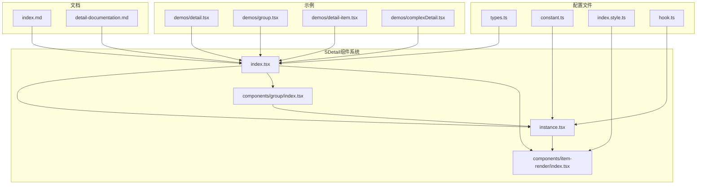
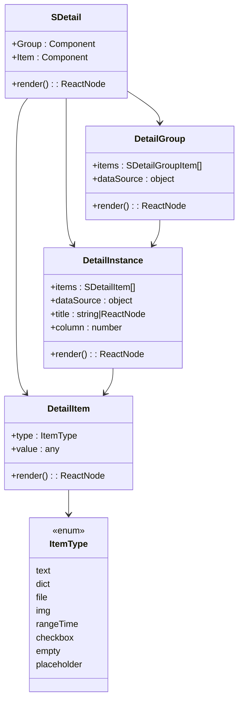
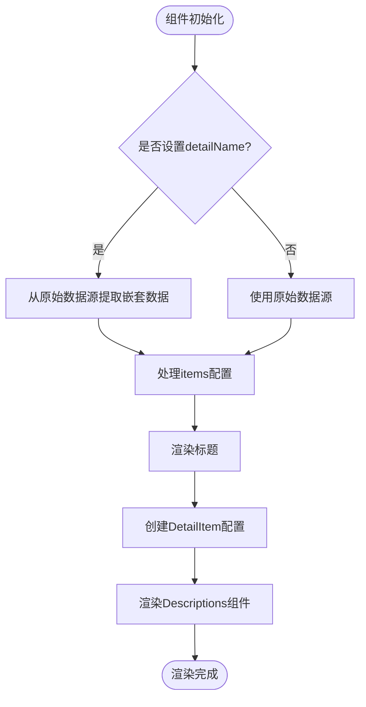
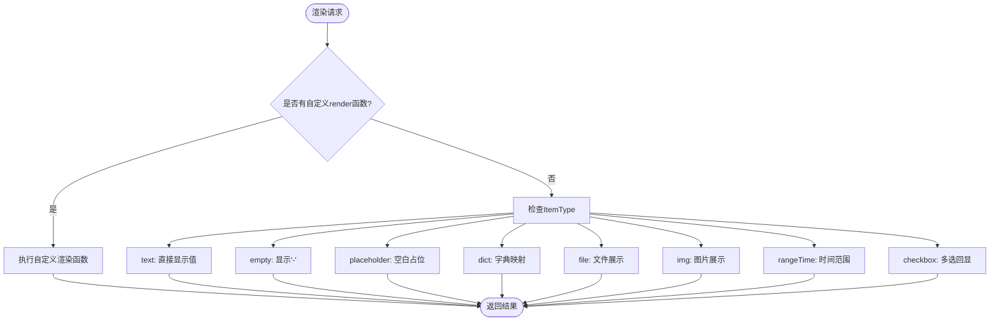
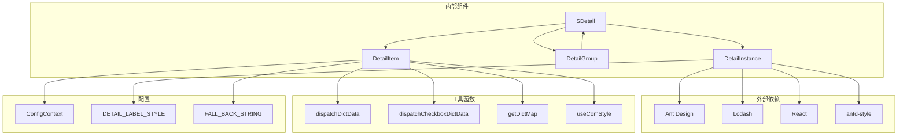

# SDetail 组件 API 参考

<cite>
**本文档引用的文件**
- [src/components/detail/index.tsx](file://src/components/detail/index.tsx)
- [src/components/detail/types.ts](file://src/components/detail/types.ts)
- [src/components/detail/index.md](file://src/components/detail/index.md)
- [src/components/detail/detail-documentation.md](file://src/components/detail/detail-documentation.md)
- [src/components/detail/instance.tsx](file://src/components/detail/instance.tsx)
- [src/components/detail/components/group/index.tsx](file://src/components/detail/components/group/index.tsx)
- [src/components/detail/components/item-render/index.tsx](file://src/components/detail/components/item-render/index.tsx)
- [src/components/detail/hook.ts](file://src/components/detail/hook.ts)
- [src/components/detail/index.style.ts](file://src/components/detail/index.style.ts)
- [src/components/detail/constant.ts](file://src/components/detail/constant.ts)
- [src/utils/dict.ts](file://src/utils/dict.ts)
- [src/components/detail/demos/detail.tsx](file://src/components/detail/demos/detail.tsx)
- [src/components/detail/demos/group.tsx](file://src/components/detail/demos/group.tsx)
- [src/components/detail/demos/detail-item.tsx](file://src/components/detail/demos/detail-item.tsx)
- [src/components/detail/demos/complexDetail.tsx](file://src/components/detail/demos/complexDetail.tsx)
</cite>

## 更新摘要

**变更内容**

- 新增 ItemType 枚举类型定义，包含 8 种渲染类型
- 增强 SDetailItem、SDetailProps、SDetailGroupProps 接口文档
- 完善渲染类型详解和使用示例
- 更新架构概览和依赖分析

## 目录

1. [简介](#简介)
2. [项目结构](#项目结构)
3. [核心组件](#核心组件)
4. [架构概览](#架构概览)
5. [详细组件分析](#详细组件分析)
6. [依赖分析](#依赖分析)
7. [性能考虑](#性能考虑)
8. [故障排除指南](#故障排除指南)
9. [结论](#结论)

## 简介

SDetail 是一个基于 Ant Design Descriptions 组件封装的高级详情展示组件，支持多种数据类型的自动渲染。它提供了 8 种内置数据类型渲染器，包括文本(text)、字典(dict)、文件(file)、图片(img)、时间范围(rangeTime)、多选(checkbox)、空占位(empty)、占位符(placeholder)，支持分组展示复杂详情结构，并与 SDesign 组件生态无缝集成。

## 项目结构

SDetail 组件采用复合组件模式，主要包含以下文件结构：

**图表来源**

- [src/components/detail/index.tsx](file://src/components/detail/index.tsx#L1-L19)
- [src/components/detail/types.ts](file://src/components/detail/types.ts#L1-L80)
- [src/components/detail/instance.tsx](file://src/components/detail/instance.tsx#L1-L132)

**章节来源**

- [src/components/detail/index.tsx](file://src/components/detail/index.tsx#L1-L19)
- [src/components/detail/types.ts](file://src/components/detail/types.ts#L1-L80)

## 核心组件

SDetail 组件系统由三个核心部分组成：

### 主组件 SDetail

主组件负责整体的详情展示逻辑，继承了 Ant Design Descriptions 的所有功能，并增加了 SDesign 特有的配置选项。

### 分组组件 SDetail.Group

用于展示复杂的分组详情结构，支持多个详情组的嵌套展示。

### 单项组件 SDetail.Item

独立的详情项组件，适用于表格回显等场景。

**章节来源**

- [src/components/detail/index.tsx](file://src/components/detail/index.tsx#L6-L18)
- [src/components/detail/types.ts](file://src/components/detail/types.ts#L49-L79)

## 架构概览

SDetail 采用了复合组件模式和策略模式相结合的设计：

**图表来源**

- [src/components/detail/index.tsx](file://src/components/detail/index.tsx#L1-L18)
- [src/components/detail/instance.tsx](file://src/components/detail/instance.tsx#L26-L132)
- [src/components/detail/components/group/index.tsx](file://src/components/detail/components/group/index.tsx#L39-L85)
- [src/components/detail/components/item-render/index.tsx](file://src/components/detail/components/item-render/index.tsx#L72-L119)

## 详细组件分析

### SDetail 主组件

SDetail 主组件继承了 Ant Design Descriptions 的所有属性，并增加了 SDesign 特有的配置选项：

#### 核心属性

| 属性名       | 类型                     | 必填 | 默认值       | 说明                         |
| ------------ | ------------------------ | ---- | ------------ | ---------------------------- |
| items        | `SDetailItem[]`          | 否   | `[]`         | 描述项配置数组               |
| dataSource   | `Record<string, any>`    | 否   | `{}`         | 数据源对象                   |
| title        | `string \| ReactNode`    | 否   | -            | 标题，支持字符串或自定义节点 |
| desc         | `ReactNode`              | 否   | -            | 标题描述                     |
| titleAction  | `ReactNode`              | 否   | -            | 标题操作区域                 |
| column       | `number`                 | 否   | `3`          | 列数                         |
| layout       | `horizontal \| vertical` | 否   | `horizontal` | 布局方式                     |
| colon        | `boolean`                | 否   | `false`      | 是否显示冒号                 |
| hasCardBg    | `boolean`                | 否   | `false`      | 是否显示卡片背景             |
| labelStyle   | `CSSProperties`          | 否   | -            | 标签样式                     |
| contentStyle | `CSSProperties`          | 否   | -            | 内容样式                     |
| detailName   | `string`                 | 否   | -            | 嵌套数据源的 key             |
| container    | `ComponentType`          | 否   | -            | 自定义容器组件               |

#### 数据处理流程

**图表来源**

- [src/components/detail/instance.tsx](file://src/components/detail/instance.tsx#L44-L103)

**章节来源**

- [src/components/detail/instance.tsx](file://src/components/detail/instance.tsx#L26-L132)
- [src/components/detail/types.ts](file://src/components/detail/types.ts#L49-L62)

### SDetail.Item 单项组件

SDetail.Item 是一个独立的详情项组件，适用于需要单独展示某个字段的场景：

#### 属性配置

| 属性名      | 类型                               | 必填 | 默认值                        | 说明           |
| ----------- | ---------------------------------- | ---- | ----------------------------- | -------------- |
| value       | `any`                              | 否   | -                             | 数据值         |
| type        | `ItemType`                         | 否   | `'text'`                      | 渲染类型       |
| render      | `(value, dataSource) => ReactNode` | 否   | -                             | 自定义渲染函数 |
| dictMap     | `object \| any[]`                  | 否   | -                             | 字典映射       |
| dictKey     | `string`                           | 否   | -                             | 字典 key       |
| dictReflect | `{label?: string, name?: string}`  | 否   | `{label:'label',name:'name'}` | 字典字段映射   |
| fileProps   | `Partial<FileListProps>`           | 否   | -                             | 文件组件配置   |

#### 渲染策略

**图表来源**

- [src/components/detail/components/item-render/index.tsx](file://src/components/detail/components/item-render/index.tsx#L24-L70)

**章节来源**

- [src/components/detail/components/item-render/index.tsx](file://src/components/detail/components/item-render/index.tsx#L72-L119)
- [src/components/detail/types.ts](file://src/components/detail/types.ts#L26-L44)

### SDetail.Group 分组组件

SDetail.Group 用于展示复杂的分组详情结构，支持多个详情组的嵌套展示：

#### 分组配置

| 属性名          | 类型                                          | 必填 | 说明           |
| --------------- | --------------------------------------------- | ---- | -------------- |
| groupTitle      | `string \| ReactNode`                         | 否   | 分组标题       |
| groupTitleProps | `Omit<STitleProps, 'title'>`                  | 否   | 标题配置       |
| groupContainer  | `ComponentType`                               | 否   | 分组容器组件   |
| groupItems      | `SDetailProps[]`                              | 否   | 子详情配置数组 |
| items           | `SDetailItem[]`                               | 否   | 单个详情配置   |
| itemProps       | `Omit<SDetailProps, 'items' \| 'dataSource'>` | 否   | 详情项通用配置 |
| dataSource      | `object`                                      | 否   | 分组数据源     |
| hidden          | `boolean`                                     | 否   | 是否隐藏       |

**章节来源**

- [src/components/detail/components/group/index.tsx](file://src/components/detail/components/group/index.tsx#L39-L85)
- [src/components/detail/types.ts](file://src/components/detail/types.ts#L64-L74)

### 渲染类型详解

SDetail 支持 8 种内置渲染类型：

| 类型          | 说明        | 数据格式                | 示例                           |
| ------------- | ----------- | ----------------------- | ------------------------------ |
| `text`        | 普通文本    | 任意值                  | `'张三'`                       |
| `empty`       | 空值显示'-' | 任意空值                | `null, undefined`              |
| `placeholder` | 占位符      | 无实际数据              | 仅显示标签                     |
| `dict`        | 字典映射    | 需要 dictMap 或 dictKey | `{1:'男', 2:'女'}`             |
| `file`        | 文件展示    | 单文件对象或文件数组    | `{fileName, fileUrl}`          |
| `img`         | 图片展示    | 图片 URL                | `'https://...'`                |
| `rangeTime`   | 时间范围    | `[start, end]`数组      | `['2024-01-01', '2024-12-31']` |
| `checkbox`    | 多选回显    | 逗号分隔字符串          | `'1,2,3'`                      |

**章节来源**

- [src/components/detail/types.ts](file://src/components/detail/types.ts#L8-L17)
- [src/components/detail/types.ts](file://src/components/detail/types.ts#L18-L17)

## 依赖分析

SDetail 组件的依赖关系如下：

**图表来源**

- [src/components/detail/instance.tsx](file://src/components/detail/instance.tsx#L1-L12)
- [src/components/detail/components/item-render/index.tsx](file://src/components/detail/components/item-render/index.tsx#L1-L16)
- [src/components/detail/constant.ts](file://src/components/detail/constant.ts#L1-L11)

### 外部依赖

| 依赖       | 版本  | 用途                              |
| ---------- | ----- | --------------------------------- |
| antd       | ^5.x  | Descriptions、Image 组件          |
| lodash     | ^4.x  | isArray、isString、isNil 工具函数 |
| react      | ^18.x | useId、useMemo、memo              |
| antd-style | -     | 样式管理                          |

**章节来源**

- [src/components/detail/detail-documentation.md](file://src/components/detail/detail-documentation.md#L416-L422)

## 性能考虑

SDetail 组件在设计时充分考虑了性能优化：

### 性能优化策略

1. **useMemo 缓存**: 对 dataSource、detailTitle、mergedLabelStyle 进行缓存
2. **React.memo 包裹**: 减少不必要的重渲染
3. **模块级常量**: TYPE_RENDERERS 在模块级别定义，避免重复创建
4. **useId 替代随机 key**: 避免 hydration 不匹配问题

### 性能特性

| 优化特性   | 实现方式                 | 效果               |
| ---------- | ------------------------ | ------------------ |
| 数据源缓存 | useMemo 缓存 dataSource  | 避免重复计算       |
| 标题缓存   | useMemo 缓存 detailTitle | 减少标题重渲染     |
| 样式合并   | useMemo 合并样式         | 避免样式重复计算   |
| 组件缓存   | React.memo 包裹          | 减少不必要的重渲染 |
| 渲染器缓存 | 模块级 TYPE_RENDERERS    | 避免重复创建函数   |

**章节来源**

- [src/components/detail/instance.tsx](file://src/components/detail/instance.tsx#L44-L108)
- [src/components/detail/components/item-render/index.tsx](file://src/components/detail/components/item-render/index.tsx#L24-L70)
- [src/components/detail/detail-documentation.md](file://src/components/detail/detail-documentation.md#L384-L413)

## 故障排除指南

### 常见问题及解决方案

#### 1. 字典数据不显示

**问题**: 使用 dict 类型但数据不显示
**解决方案**:

- 检查 dictMap 或 dictKey 配置是否正确
- 确认数据源中的值与字典映射匹配
- 使用 ConfigProvider 配置全局字典

#### 2. 文件显示异常

**问题**: 文件无法正常显示或下载
**解决方案**:

- 检查文件对象结构是否符合要求
- 确认 fileProps 配置正确
- 验证文件 URL 的有效性

#### 3. 图片加载失败

**问题**: 图片无法加载显示
**解决方案**:

- 检查图片 URL 是否有效
- 确认网络连接正常
- 查看控制台错误信息

#### 4. 布局显示异常

**问题**: 组件布局不符合预期
**解决方案**:

- 检查 column 和 layout 配置
- 确认 labelStyle 和 contentStyle 设置
- 验证响应式设计适配

**章节来源**

- [src/components/detail/detail-documentation.md](file://src/components/detail/detail-documentation.md#L450-L466)

## 结论

SDetail 组件是一个功能强大、设计合理的详情展示组件，具有以下特点：

1. **丰富的渲染类型**: 支持 8 种内置渲染类型，满足各种数据展示需求
2. **灵活的配置选项**: 提供丰富的配置属性，支持高度定制化
3. **优秀的性能表现**: 采用多种性能优化策略，确保组件高效运行
4. **良好的扩展性**: 通过策略模式和自定义渲染函数，易于扩展新功能
5. **完整的文档支持**: 提供详细的 API 文档和技术文档

SDetail 组件适合在各种业务场景中使用，特别是需要展示复杂详情信息的应用程序。其设计理念和实现方式为类似组件的开发提供了良好的参考。
