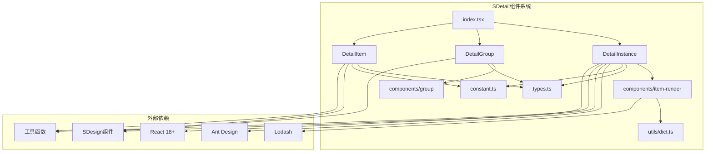
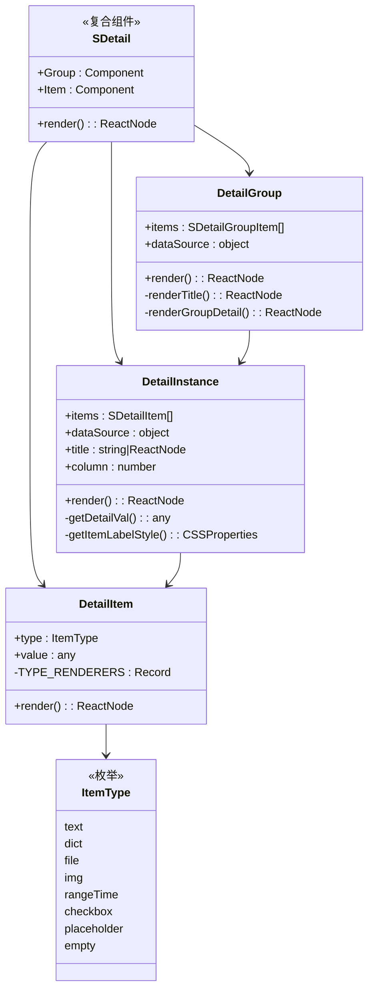
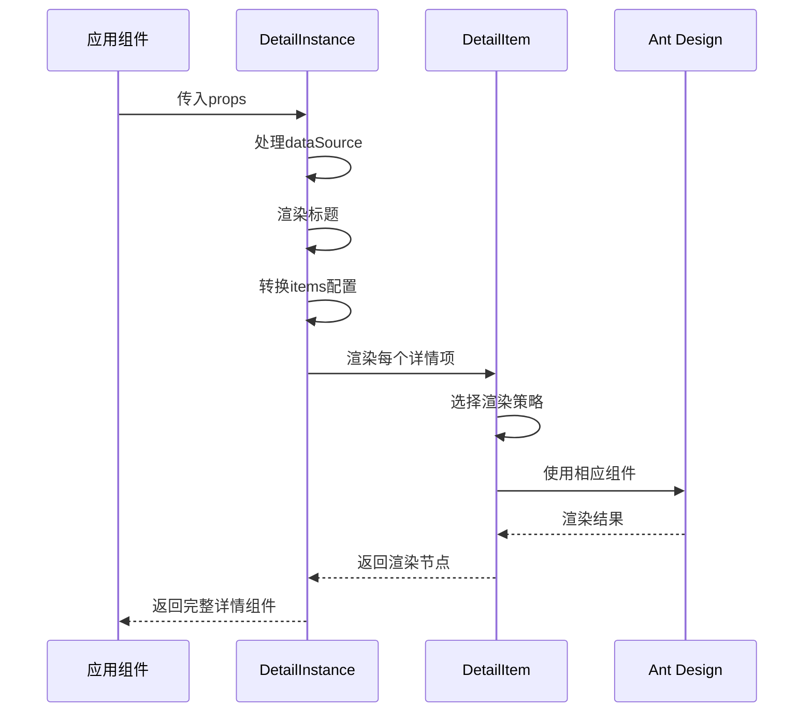
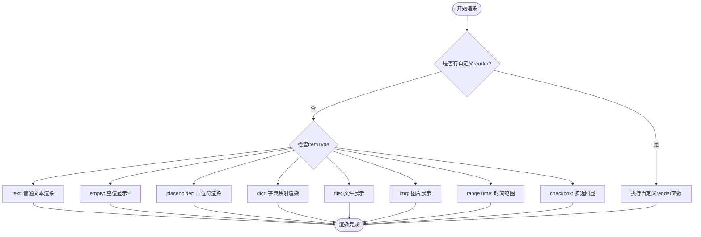
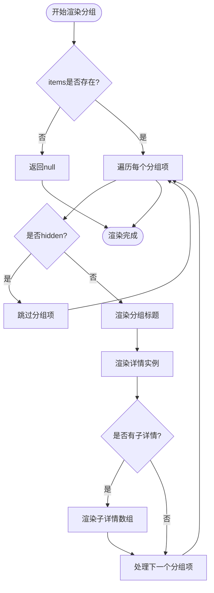

# SDetail 组件技术文档

<cite>
**本文档引用的文件**
- [src/components/detail/index.tsx](file://src/components/detail/index.tsx)
- [src/components/detail/types.ts](file://src/components/detail/types.ts)
- [src/components/detail/index.md](file://src/components/detail/index.md)
- [src/components/detail/detail-documentation.md](file://src/components/detail/detail-documentation.md)
- [src/components/detail/index.style.ts](file://src/components/detail/index.style.ts)
- [src/components/detail/instance.tsx](file://src/components/detail/instance.tsx)
- [src/components/detail/components/group/index.tsx](file://src/components/detail/components/group/index.tsx)
- [src/components/detail/components/item-render/index.tsx](file://src/components/detail/components/item-render/index.tsx)
- [src/components/detail/hook.ts](file://src/components/detail/hook.ts)
- [src/components/detail/constant.ts](file://src/components/detail/constant.ts)
- [src/components/detail/demos/detail.tsx](file://src/components/detail/demos/detail.tsx)
- [src/components/detail/demos/group.tsx](file://src/components/detail/demos/group.tsx)
- [src/components/detail/demos/complexDetail.tsx](file://src/components/detail/demos/complexDetail.tsx)
- [src/utils/dict.ts](file://src/utils/dict.ts)
- [src/components/dynamic-container/index.tsx](file://src/components/dynamic-container/index.tsx)
- [src/components/title/index.tsx](file://src/components/title/index.tsx)
</cite>

## 更新摘要

**变更内容**

- 新增 8 种渲染类型的完整展示指南
- 补充每种渲染类型的详细配置说明和使用示例
- 完善字典映射和多选框渲染的深度解析
- 增强文件和图片渲染的配置选项说明
- 优化时间范围渲染的使用场景说明

## 目录

1. [简介](#简介)
2. [项目结构](#项目结构)
3. [核心组件](#核心组件)
4. [架构概览](#架构概览)
5. [8 种渲染类型详解](#8种渲染类型详解)
6. [详细组件分析](#详细组件分析)
7. [依赖分析](#依赖分析)
8. [性能考虑](#性能考虑)
9. [故障排除指南](#故障排除指南)
10. [结论](#结论)

## 简介

SDetail 是一个基于 Ant Design Descriptions 组件封装的高级详情展示组件，专为 SDesign 组件库生态系统设计。它提供了强大的数据详情展示能力，支持 8 种内置数据类型的自动渲染，包括文本、字典、文件、图片、时间范围、多选框、空值占位等。

### 主要特性

- 🎯 **8 种内置数据类型渲染器**：text、dict、file、img、rangeTime、checkbox、placeholder、empty
- 📦 支持分组展示复杂详情结构
- 🎨 与 SDesign 组件生态无缝集成
- ⚡ 性能优化（useMemo、React.memo）
- 🔧 支持自定义渲染和全局字典配置

## 项目结构

SDetail 组件位于 SDesign 组件库的 detail 目录下，采用模块化设计，包含以下核心文件：



**图表来源**

- [src/components/detail/index.tsx:1-19](file://src/components/detail/index.tsx#L1-L19)
- [src/components/detail/types.ts:1-80](file://src/components/detail/types.ts#L1-L80)

## 核心组件

SDetail 组件系统由三个核心部分组成：

### 1. 主组件 SDetail

- 基于 DetailInstance 实现
- 提供完整的详情展示功能
- 支持标题、描述、操作区域

### 2. 分组组件 SDetail.Group

- 用于展示复杂的分组详情结构
- 支持嵌套分组和数据源继承

### 3. 单项组件 SDetail.Item

- 独立的详情项组件
- 用于自定义场景和灵活配置

**章节来源**

- [src/components/detail/index.tsx:6-18](file://src/components/detail/index.tsx#L6-L18)
- [src/components/detail/types.ts:49-79](file://src/components/detail/types.ts#L49-L79)

## 架构概览

SDetail 采用了复合组件模式和策略模式的设计理念：



**图表来源**

- [src/components/detail/index.tsx:1-19](file://src/components/detail/index.tsx#L1-L19)
- [src/components/detail/instance.tsx:26-132](file://src/components/detail/instance.tsx#L26-L132)
- [src/components/detail/components/group/index.tsx:39-85](file://src/components/detail/components/group/index.tsx#L39-L85)
- [src/components/detail/components/item-render/index.tsx:72-119](file://src/components/detail/components/item-render/index.tsx#L72-L119)

### 设计模式应用

1. **复合组件模式 (Compound Component Pattern)**: SDetail、SDetail.Group、SDetail.Item 组合使用
2. **策略模式 (Strategy Pattern)**: TYPE_RENDERERS 根据 type 选择不同渲染策略
3. **组合模式 (Composite Pattern)**: DetailGroup 支持嵌套分组结构
4. **HOC 模式**: memo 包裹组件实现性能优化

## 8 种渲染类型详解

SDetail 组件支持 8 种内置数据类型的自动渲染，每种类型都有其特定的使用场景和配置选项：

### 1. 文本渲染 (text)

**用途**: 显示普通的文本内容，支持空值处理

**配置选项**:

- `type`: 'text' (默认)
- `value`: 任意类型的值，空值会显示'-'

**使用示例**:

```typescript
{
  label: '用户名',
  name: 'username',
  type: 'text'
}
```

**特点**:

- 自动处理空值显示
- 支持所有数据类型的字符串化

### 2. 字典映射渲染 (dict)

**用途**: 将代码值映射为可读的标签文本

**配置选项**:

- `type`: 'dict'
- `dictMap`: 字典映射对象或数组
- `dictKey`: 从 ConfigProvider 获取的全局字典键
- `dictReflect`: 字典字段映射配置

**使用示例**:

```typescript
// 对象字典
{
  label: '状态',
  name: 'status',
  type: 'dict',
  dictMap: { active: '启用', inactive: '禁用' }
}

// 数组字典
{
  label: '类型',
  name: 'type',
  type: 'dict',
  dictMap: [
    { label: '管理员', name: 'admin' },
    { label: '普通用户', name: 'user' }
  ]
}
```

**特点**:

- 支持对象和数组两种字典格式
- 支持全局字典配置
- 可自定义字段映射

### 3. 文件渲染 (file)

**用途**: 展示单个文件或文件列表

**配置选项**:

- `type`: 'file'
- `fileProps`: SFile 组件的配置属性
- `value`: 文件对象或文件数组

**使用示例**:

```typescript
// 单文件
{
  label: '头像',
  name: 'avatar',
  type: 'file',
  fileProps: { showPreview: true }
}

// 文件列表
{
  label: '附件',
  name: 'attachments',
  type: 'file'
}
```

**特点**:

- 自动区分单文件和文件列表
- 支持文件预览和下载
- 完全兼容 SFile 组件配置

### 4. 图片渲染 (img)

**用途**: 展示图片资源，支持懒加载和错误回退

**配置选项**:

- `type`: 'img'
- `value`: 图片 URL 地址

**使用示例**:

```typescript
{
  label: '用户头像',
  name: 'avatar',
  type: 'img'
}
```

**特点**:

- 基于 Ant Design Image 组件
- 内置懒加载支持
- 自动错误回退处理

### 5. 时间范围渲染 (rangeTime)

**用途**: 展示开始时间和结束时间的范围

**配置选项**:

- `type`: 'rangeTime'
- `name`: 字符串数组，包含开始时间和结束时间的字段名

**使用示例**:

```typescript
{
  label: '活动时间',
  type: 'rangeTime',
  name: ['startTime', 'endTime']
}
```

**特点**:

- 支持数组格式的时间范围
- 自动格式化显示
- 空值时显示'-'占位符

### 6. 多选框渲染 (checkbox)

**用途**: 展示多选值的标签文本

**配置选项**:

- `type`: 'checkbox'
- `dictMap`: 字典映射配置
- `value`: 逗号分隔的多选值字符串

**使用示例**:

```typescript
{
  label: '兴趣爱好',
  name: 'interests',
  type: 'checkbox',
  dictMap: {
    sports: '运动',
    music: '音乐',
    travel: '旅行'
  }
}
```

**特点**:

- 支持逗号分隔的多选值
- 自动分割和映射
- 多值之间用'/'分隔显示

### 7. 占位符渲染 (placeholder)

**用途**: 仅显示标签，不显示具体内容

**配置选项**:

- `type`: 'placeholder'

**使用示例**:

```typescript
{
  label: '这是占位符',
  type: 'placeholder'
}
```

**特点**:

- 仅显示标签文本
- 不占用内容空间
- 用于布局占位

### 8. 空值渲染 (empty)

**用途**: 显式显示空值占位符

**配置选项**:

- `type`: 'empty'

**使用示例**:

```typescript
{
  label: '备用联系方式',
  type: 'empty'
}
```

**特点**:

- 明确显示'-'占位符
- 与 text 类型的空值处理一致

**章节来源**

- [src/components/detail/components/item-render/index.tsx:24-70](file://src/components/detail/components/item-render/index.tsx#L24-L70)
- [src/components/detail/types.ts:8-31](file://src/components/detail/types.ts#L8-L31)

## 详细组件分析

### DetailInstance 主组件实现

DetailInstance 是 SDetail 的核心实现，负责处理数据源、渲染标题和管理详情项：



**图表来源**

- [src/components/detail/instance.tsx:26-132](file://src/components/detail/instance.tsx#L26-L132)
- [src/components/detail/components/item-render/index.tsx:72-119](file://src/components/detail/components/item-render/index.tsx#L72-L119)

#### 核心功能实现

1. **数据源处理**: 支持嵌套数据通过 detailName 提取
2. **标题渲染**: 支持字符串或自定义节点
3. **样式合并**: 合并默认标签样式和自定义样式
4. **性能优化**: 使用 useMemo 缓存计算结果

**章节来源**

- [src/components/detail/instance.tsx:26-132](file://src/components/detail/instance.tsx#L26-L132)

### DetailItem 单项渲染器

DetailItem 实现了 8 种内置数据类型的渲染策略：



**图表来源**

- [src/components/detail/components/item-render/index.tsx:24-70](file://src/components/detail/components/item-render/index.tsx#L24-L70)

#### 渲染策略详解

1. **文本渲染**: 处理空值显示'-'，支持自定义格式化
2. **字典渲染**: 支持对象映射和数组映射两种格式
3. **文件渲染**: 单文件和文件列表的统一处理
4. **图片渲染**: 支持图片懒加载和错误回退
5. **时间范围**: 处理[start, end]格式的时间区间

**章节来源**

- [src/components/detail/components/item-render/index.tsx:24-70](file://src/components/detail/components/item-render/index.tsx#L24-L70)

### DetailGroup 分组组件

DetailGroup 负责处理复杂的分组展示需求：



**图表来源**

- [src/components/detail/components/group/index.tsx:39-85](file://src/components/detail/components/group/index.tsx#L39-L85)

**章节来源**

- [src/components/detail/components/group/index.tsx:39-85](file://src/components/detail/components/group/index.tsx#L39-L85)

## 依赖分析

SDetail 组件的依赖关系体现了清晰的层次结构：

```mermaid
graph TB
subgraph "业务层"
App[应用组件]
end
subgraph "组件层"
SDetail[SDetail组件]
Group[SDetail.Group]
Item[SDetail.Item]
end
subgraph "基础组件层"
Descriptions[Antd Descriptions]
STitle[STitle组件]
SFile[SFile组件]
SCard[SCard组件]
end
subgraph "工具层"
DictUtils[字典处理工具]
ComStyle[样式工具]
DynamicContainer[动态容器]
end
subgraph "外部库"
Antd[Ant Design]
Lodash[Lodash工具库]
React[React 18+]
End
App --> SDetail
SDetail --> Group
SDetail --> Item
SDetail --> Descriptions
SDetail --> STitle
SDetail --> SCard
Item --> SFile
Item --> DictUtils
Item --> ComStyle
SDetail --> DynamicContainer
Group --> STitle
Group --> SCard
Group --> DynamicContainer
DictUtils --> Lodash
STitle --> React
SCard --> Antd
SFile --> Antd
Descriptions --> Antd
```

**图表来源**

- [src/components/detail/instance.tsx:1-12](file://src/components/detail/instance.tsx#L1-L12)
- [src/components/detail/components/item-render/index.tsx:1-16](file://src/components/detail/components/item-render/index.tsx#L1-L16)
- [src/components/detail/components/group/index.tsx:1-9](file://src/components/detail/components/group/index.tsx#L1-L9)

### 外部依赖

| 依赖名称 | 版本要求 | 用途                              |
| -------- | -------- | --------------------------------- |
| antd     | ^5.x     | Descriptions、Image 组件          |
| lodash   | ^4.x     | isArray、isString、isNil 工具函数 |
| react    | ^18.x    | useId、useMemo、memo              |

**章节来源**

- [src/components/detail/detail-documentation.md:416-422](file://src/components/detail/detail-documentation.md#L416-L422)

## 性能考虑

SDetail 组件在设计时充分考虑了性能优化：

### 1. 内存优化策略

- **useMemo 缓存**: 缓存 dataSource、detailTitle、mergedLabelStyle 等计算结果
- **模块级常量**: TYPE_RENDERERS 定义在模块级别，避免重复创建
- **React.memo 包裹**: 所有组件都使用 memo 优化，减少不必要的重渲染

### 2. 渲染优化策略

- **useId 替代随机 key**: 使用 React 18+的 useId 生成稳定 key，避免 hydration 不匹配
- **条件渲染**: 支持 hidden 属性进行条件渲染
- **懒加载支持**: 图片组件支持懒加载

### 3. 内存泄漏防护

- **空值检查**: 使用 isNil 检查处理空值，避免 undefined 报错
- **默认值处理**: 提供完善的默认值处理机制

**章节来源**

- [src/components/detail/detail-documentation.md:273-279](file://src/components/detail/detail-documentation.md#L273-L279)

## 故障排除指南

### 常见问题及解决方案

#### 1. 字典数据不显示

**问题**: 字典渲染显示'-'而不是期望值
**原因**: dictMap 配置错误或数据源中缺少对应值
**解决方案**:

- 检查 dictMap 格式是否正确
- 确认数据源中存在对应的键值
- 验证 dictReflect 配置是否正确

#### 2. 图片加载失败

**问题**: 图片显示加载失败占位符
**原因**: 图片 URL 无效或网络问题
**解决方案**:

- 检查图片 URL 是否有效
- 确认网络连接正常
- 验证图片格式支持

#### 3. 文件显示异常

**问题**: 文件列表显示不正确
**原因**: 文件数据格式不符合要求
**解决方案**:

- 确认文件对象包含 fileName 和 fileUrl 字段
- 检查文件列表格式是否为数组
- 验证文件权限设置

#### 4. 性能问题

**问题**: 组件渲染缓慢
**原因**: 大量数据或复杂渲染逻辑
**解决方案**:

- 使用 hidden 属性隐藏不需要的项
- 优化自定义 render 函数
- 考虑分页或虚拟滚动

**章节来源**

- [src/components/detail/detail-documentation.md:450-466](file://src/components/detail/detail-documentation.md#L450-L466)

## 结论

SDetail 组件是一个设计精良、功能完备的详情展示组件，具有以下优势：

### 技术优势

- **架构清晰**: 采用复合组件模式，职责分离明确
- **扩展性强**: 支持自定义渲染和新增数据类型
- **性能优秀**: 多重优化策略确保高效渲染
- **类型安全**: 完整的 TypeScript 类型定义

### 使用建议

- 合理使用分组功能组织复杂详情
- 充分利用自定义渲染满足特殊需求
- 注意性能优化，避免不必要的重渲染
- 善用 ConfigProvider 进行全局配置

SDetail 组件为 SDesign 生态系统的详情展示提供了强有力的支持，是构建复杂业务场景的理想选择。
