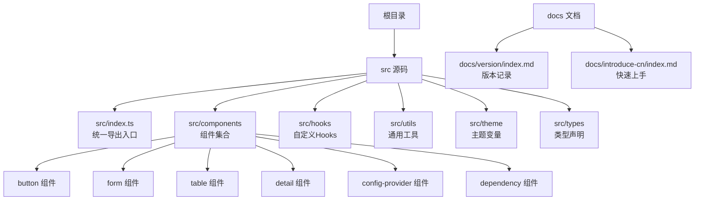
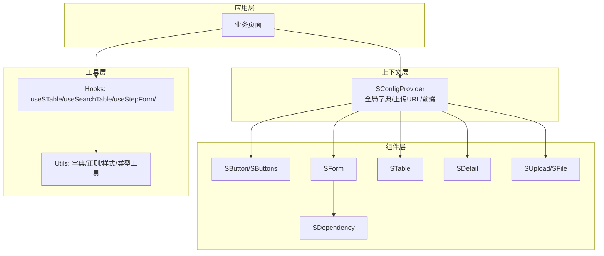
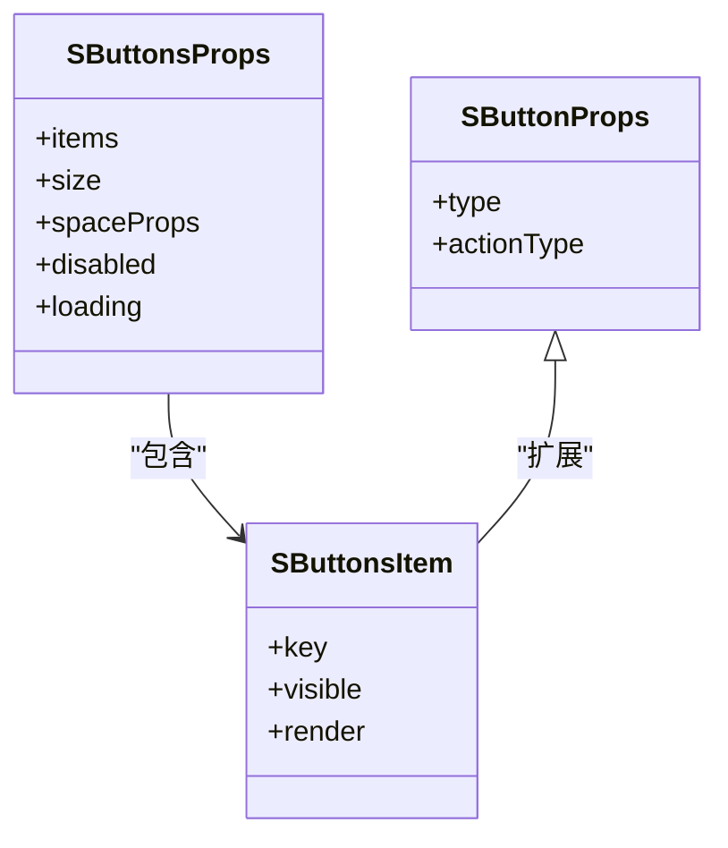
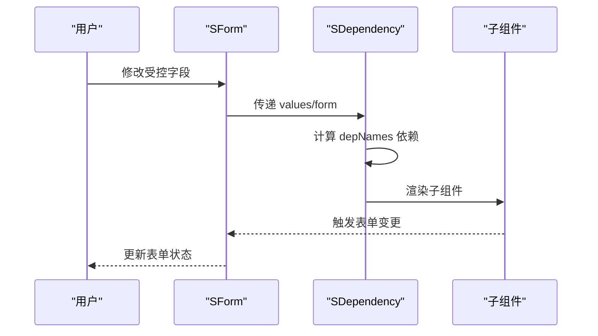
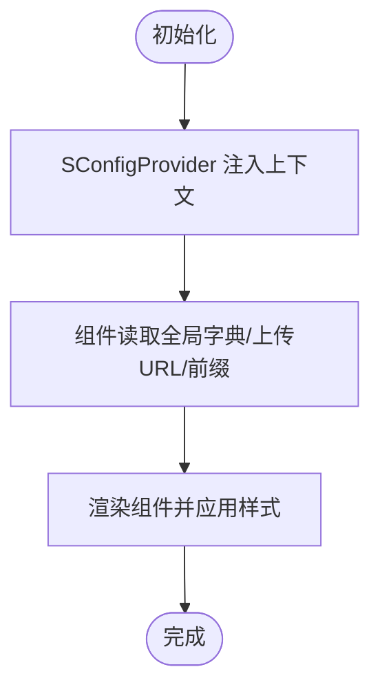
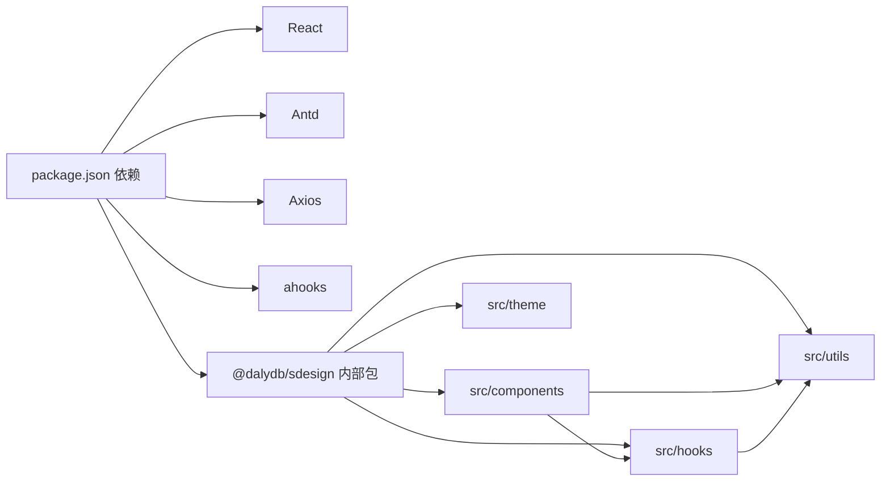

# 组件库总览

<cite>
**本文引用的文件**
- [package.json](file://package.json)
- [README.md](file://README.md)
- [docs/introduce-cn/index.md](file://docs/introduce-cn/index.md)
- [docs/version/index.md](file://docs/version/index.md)
- [src/index.ts](file://src/index.ts)
- [src/components/index.ts](file://src/components/index.ts)
- [src/components/button/types.ts](file://src/components/button/types.ts)
- [src/components/form/types.ts](file://src/components/form/types.ts)
- [src/components/table/types.ts](file://src/components/table/types.ts)
- [src/components/detail/types.ts](file://src/components/detail/types.ts)
- [src/components/config-provider/types.ts](file://src/components/config-provider/types.ts)
- [src/components/dependency/types.ts](file://src/components/dependency/types.ts)
- [src/hooks/index.ts](file://src/hooks/index.ts)
- [src/theme/default.less](file://src/theme/default.less)
- [src/utils/types.ts](file://src/utils/types.ts)
</cite>

## 目录

1. [简介](#简介)
2. [项目结构](#项目结构)
3. [核心组件](#核心组件)
4. [架构总览](#架构总览)
5. [详细组件分析](#详细组件分析)
6. [依赖关系分析](#依赖关系分析)
7. [性能考虑](#性能考虑)
8. [故障排查指南](#故障排查指南)
9. [结论](#结论)
10. [附录](#附录)

## 简介

SDesign 是一个基于 Ant Design 的二次封装组件库，专注于提升管理类业务页面的组件复用性与开发效率。它通过统一的上下文、字典系统、表单与表格能力以及完善的 Hooks 生态，为中后台场景提供一致的交互与视觉体验。

- 版本：当前版本 1.1.5（详见版本记录）
- 主要技术栈：React 18、Antd v5、TypeScript、Dumi、Father 构建
- 设计理念：以 Ant Design 为基础，结合业务场景抽象出更易用的高层组件与工具方法

章节来源

- file://package.json#L1-L121
- file://README.md#L1-L62
- file://docs/introduce-cn/index.md#L1-L27

## 项目结构

仓库采用“按功能域分层 + 组件聚合导出”的组织方式：

- src/index.ts：统一导出组件、Hooks、Icons、Utils
- src/components：按组件维度拆分，每个组件包含类型定义、样式、实例、示例与文档
- src/hooks：与组件配套的自定义 Hooks
- src/utils：通用工具类型与方法
- docs：文档与示例
- theme：主题变量（如 CSS 变量前缀）



图表来源

- [src/index.ts](file://src/index.ts#L1-L5)
- [src/components/index.ts](file://src/components/index.ts#L1-L81)
- [docs/version/index.md](file://docs/version/index.md#L1-L96)
- [docs/introduce-cn/index.md](file://docs/introduce-cn/index.md#L1-L27)

章节来源

- file://src/index.ts#L1-L5
- file://src/components/index.ts#L1-L81

## 核心组件

SDesign 提供以下主要组件族，覆盖基础交互、表单、数据展示、反馈与业务场景：

- 基础组件
  - SButton/SButtons：增强按钮与按钮组，支持动作类型与布局
  - SInput：输入框
  - SSelect：下拉选择
  - STitle：标题与描述
  - SLucideIcon：图标
  - SCard：卡片
  - SNoData/SNoPage：空状态
  - STextEllipsis：文本省略
- 表单组件
  - SForm：通用表单，支持多种内置控件与分组
  - SDatePicker/SDatePickerRange：日期与日期范围
  - SCascader：级联选择
  - SCheckGroup/SRadioGroup：多选/单选组
  - SUpload：上传（含拖拽、图片墙等变体）
  - SFile：文件列表
  - SDependency：基于字段依赖的动态渲染
- 数据展示组件
  - STable：表格（列支持字典渲染与序号）
  - SDetail：详情（支持分组、字典映射、文件展示）
  - SSearchTable：搜索表格（含高级搜索）
- 反馈组件
  - SConfirm：确认对话框
  - SErrorBoundary/SErrorCom：错误边界与错误占位
  - SFrameAnimation：帧动画
- 上下文与工具
  - SConfigProvider：全局字典、上传地址、前缀等
  - Hooks：useSTable、useSearchTable、useStepForm、useExpand、useNumInput 等

章节来源

- file://src/components/index.ts#L1-L81
- file://src/hooks/index.ts#L1-L28

## 架构总览

SDesign 的架构围绕“组件 + 上下文 + 工具”三部分协同工作：

- 组件层：以 Ant Design 为基础，扩展业务能力（如字典映射、表单联动、上传上下文）
- 上下文层：通过 SConfigProvider 注入全局字典、上传地址、前缀等，贯穿各组件
- 工具层：类型工具、正则校验、数字输入、字典获取与分页等 Hooks



图表来源

- [src/components/config-provider/types.ts](file://src/components/config-provider/types.ts#L1-L17)
- [src/components/form/types.ts](file://src/components/form/types.ts#L1-L155)
- [src/components/dependency/types.ts](file://src/components/dependency/types.ts#L1-L17)
- [src/hooks/index.ts](file://src/hooks/index.ts#L1-L28)
- [src/utils/types.ts](file://src/utils/types.ts#L1-L19)

## 详细组件分析

### 基础组件：按钮与按钮组

- 设计要点
  - 在 Ant Design Button 基础上扩展 actionType，统一业务动作语义（保存、取消、删除、导出等）
  - SButtons 支持按钮组布局、尺寸、间距与加载/禁用状态
- 关键类型
  - SButtonProps：继承 Antd ButtonProps，并新增 actionType
  - SButtonsProps：按钮组配置，支持 items、size、spaceProps、disabled、loading
- 使用约定
  - 优先使用 actionType 明确业务含义，避免直接传入复杂逻辑
  - 按钮组内建议统一 size，必要时通过 spaceProps 调整间距



图表来源

- [src/components/button/types.ts](file://src/components/button/types.ts#L52-L72)

章节来源

- file://src/components/button/types.ts#L1-L72

### 表单组件：SForm 与依赖联动

- 设计要点
  - 通过 FormFieldMapType 统一映射内置组件（输入、选择、日期、上传、级联等）
  - 支持分组容器、栅格化布局、只读/禁用、嵌套表单名等
  - 依赖联动：SDependency 基于 depNames 动态渲染子节点
- 关键类型
  - FormFieldMapType：内置组件映射
  - ItemsProps/SFormItems：表单项配置
  - SFormProps/SFormGroupProps：表单与分组表单配置
  - SDependencyProps：依赖渲染配置



图表来源

- [src/components/form/types.ts](file://src/components/form/types.ts#L36-L63)
- [src/components/dependency/types.ts](file://src/components/dependency/types.ts#L10-L17)

章节来源

- file://src/components/form/types.ts#L1-L155
- file://src/components/dependency/types.ts#L1-L17

### 数据展示组件：STable 与 SDetail

- STable
  - 列定义支持 render 类型（datetime/date/ellipsis）与字典映射
  - 支持序号列与分页参数透传
- SDetail
  - 支持多种类型（文本、空值、文件、字典、图片、时间区间、勾选框、占位）
  - 支持分组详情、字典反射、容器自定义

```mermaid
classDiagram
class STableProps {
+columns
+isSeq
+current
+pageSize
}
class SDetailProps {
+dataSource
+items
+labelStyle
+contentStyle
+hasCardBg
+container
}
class SDetailGroupProps {
+items
+dataSource
}
STableProps --> "列定义" : "SColumnsType"
SDetailGroupProps --> SDetailProps : "包含多个"
```

图表来源

- [src/components/table/types.ts](file://src/components/table/types.ts#L27-L34)
- [src/components/detail/types.ts](file://src/components/detail/types.ts#L49-L80)

章节来源

- file://src/components/table/types.ts#L1-L34
- file://src/components/detail/types.ts#L1-L80

### 上下文与样式：SConfigProvider 与主题变量

- SConfigProvider
  - 提供全局字典、上传 URL、前缀等注入
  - getPrefixCls 生成组件 CSS 前缀，便于主题定制
- 主题变量
  - 默认前缀为 sd（可通过 prefixCls 覆盖）



图表来源

- [src/components/config-provider/types.ts](file://src/components/config-provider/types.ts#L3-L16)
- [src/theme/default.less](file://src/theme/default.less#L1-L2)

章节来源

- file://src/components/config-provider/types.ts#L1-L17
- file://src/theme/default.less#L1-L2

## 依赖关系分析

- 外部依赖
  - React 18+、Antd v5、Dayjs、Lucide-React、Axios、ahooks 等
  - 通过 peerDependencies 与业务应用共同管理版本
- 内部依赖
  - 组件间通过类型与上下文解耦；例如 SForm 与 SDependency 通过表单实例与字段名建立弱耦合
  - Hooks 与组件松耦合，既可独立使用也可配合组件使用



图表来源

- [package.json](file://package.json#L52-L101)
- [src/components/index.ts](file://src/components/index.ts#L1-L81)
- [src/hooks/index.ts](file://src/hooks/index.ts#L1-L28)
- [src/utils/types.ts](file://src/utils/types.ts#L1-L19)

章节来源

- file://package.json#L52-L101

## 性能考虑

- 组件渲染
  - 合理使用 visible/hidden 控制渲染，避免不必要的子树
  - 对长列表使用虚拟化或分页，减少一次性渲染压力
- 表单与联动
  - 依赖联动尽量缩小计算范围，避免在 render 中做重型计算
  - 使用只读/禁用替代隐藏字段，减少重渲染
- 图片与文件
  - 文件预览与缩略图按需加载，控制并发数量
- 主题与样式
  - 通过统一前缀与 CSS in JS 减少样式冲突与全局污染
- 构建与打包
  - 使用增量构建与按需导入，避免全量引入

## 故障排查指南

- 常见问题
  - 上传失败：检查 SConfigProvider 中 uploadUrl 是否正确配置
  - 字典不显示：确认全局字典已注入且键名匹配
  - 表单联动无效：核对 depNames 与字段名一致，确保表单实例可用
  - 样式异常：确认 Antd 版本与 peerDependencies 一致，检查前缀配置
- 排查步骤
  - 打开浏览器控制台查看网络请求与错误日志
  - 在文档站点中定位对应 Demo，逐步比对差异
  - 使用最小可复现示例隔离问题范围
- 错误处理组件
  - SErrorBoundary：包裹可能抛错的区域，捕获并降级展示
  - SErrorCom：错误占位，提供重试与提示

章节来源

- file://src/components/config-provider/types.ts#L1-L17
- file://src/components/dependency/types.ts#L1-L17

## 结论

SDesign 以 Antd 为基础，结合业务场景抽象出统一的表单、表格、详情与上下文能力，辅以丰富的 Hooks 与工具类型，形成高复用、低耦合的组件生态。通过明确的类型约束与上下文注入，开发者可以快速搭建一致性的管理页面。

## 附录

### 组件分类导航

- 基础组件：SButton、SInput、SSelect、STitle、SLucideIcon、SCard、SNoData、SNoPage、STextEllipsis
- 表单组件：SForm、SDatePicker、SDatePickerRange、SCascader、SCheckGroup、SRadioGroup、SUpload、SFile、SDependency
- 数据展示：STable、SDetail、SSearchTable
- 反馈组件：SConfirm、SErrorBoundary、SErrorCom、SFrameAnimation
- 上下文与工具：SConfigProvider、Hooks（useSTable、useSearchTable、useStepForm、useExpand、useNumInput 等）

章节来源

- file://src/components/index.ts#L1-L81
- file://src/hooks/index.ts#L1-L28

### 通用属性、事件与样式定制

- 通用属性
  - 只读/禁用：readonly/disabled
  - 样式：style、className、labelStyle/contentStyle
  - 布局：rowProps/columns/colProps
  - 回调：onFinish/onReset/onExpand 等
- 事件处理
  - 表单：onFinish/onReset
  - 表格：分页/排序/筛选回调（由 Antd 透传）
  - 详情：render 回调自定义渲染
- 样式定制
  - 通过 SConfigProvider.getPrefixCls 生成前缀
  - 使用 antd-style 或 CSS 变量覆盖主题

章节来源

- file://src/components/form/types.ts#L104-L155
- file://src/components/table/types.ts#L27-L34
- file://src/components/detail/types.ts#L49-L80
- file://src/components/config-provider/types.ts#L12-L16
- file://src/theme/default.less#L1-L2

### 组件间依赖与组合模式

- SForm 与 SDependency：通过表单实例与字段名建立依赖关系，实现动态渲染
- STable 与字典：列 render 支持字典映射，统一展示格式
- SDetail 与 SFile：文件类型项可直接复用文件组件能力
- SConfigProvider：为上传、字典、前缀等提供全局注入，贯穿组件链路

章节来源

- file://src/components/form/types.ts#L36-L63
- file://src/components/dependency/types.ts#L10-L17
- file://src/components/table/types.ts#L14-L25
- file://src/components/detail/types.ts#L35-L44
- file://src/components/config-provider/types.ts#L3-L16

### 最佳实践

- 优先使用 SForm 的内置映射组件，减少自定义封装
- 使用 SConfigProvider 统一管理全局配置，避免分散注入
- 表单联动尽量保持浅依赖，避免深层嵌套导致的性能问题
- 对长文本与大图使用省略与懒加载策略
- 使用 Hooks 抽离可复用逻辑，降低组件复杂度

### 版本兼容性与升级指南

- 当前版本：1.1.5
- 升级建议
  - 严格遵循 peerDependencies 版本要求（React 18+、Antd v5、Dayjs、Lucide-React）
  - 升级前先运行构建检查与文档构建，确保无编译与示例问题
  - 关注版本记录中的破坏性变更与迁移提示
- 版本记录参考
  - 1.1.5：优化按钮与详情组件，新增 t-link 按钮类型示例
  - 1.1.4：重构搜索表格并添加高级功能
  - 更多历史版本请参阅版本记录文档

章节来源

- file://docs/version/index.md#L1-L96
- file://package.json#L93-L101
